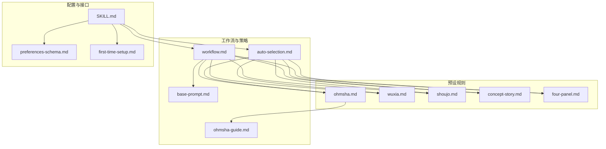
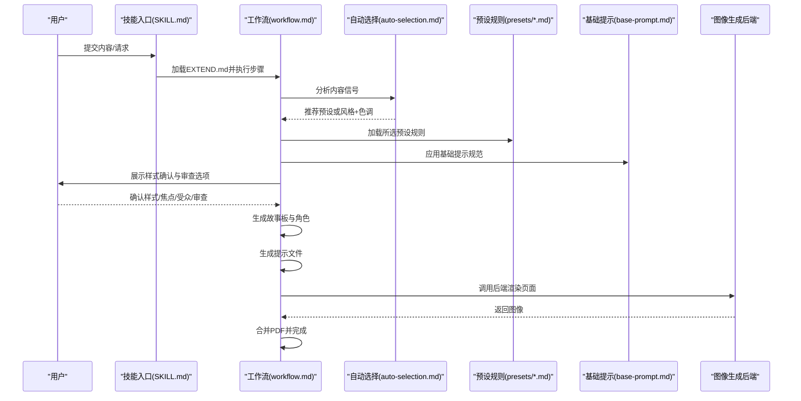
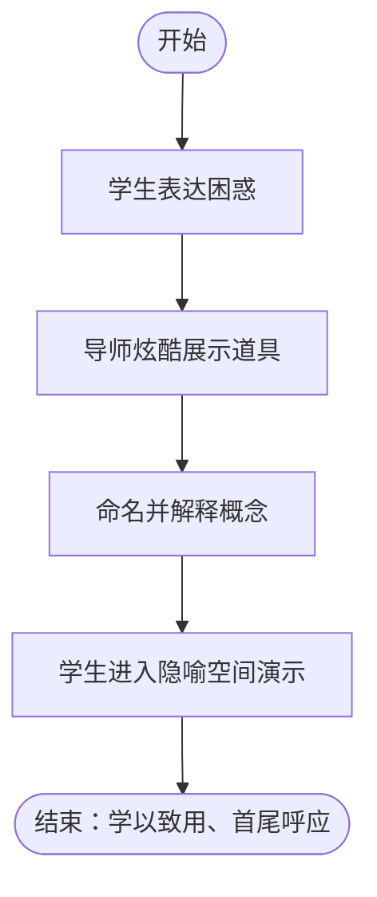
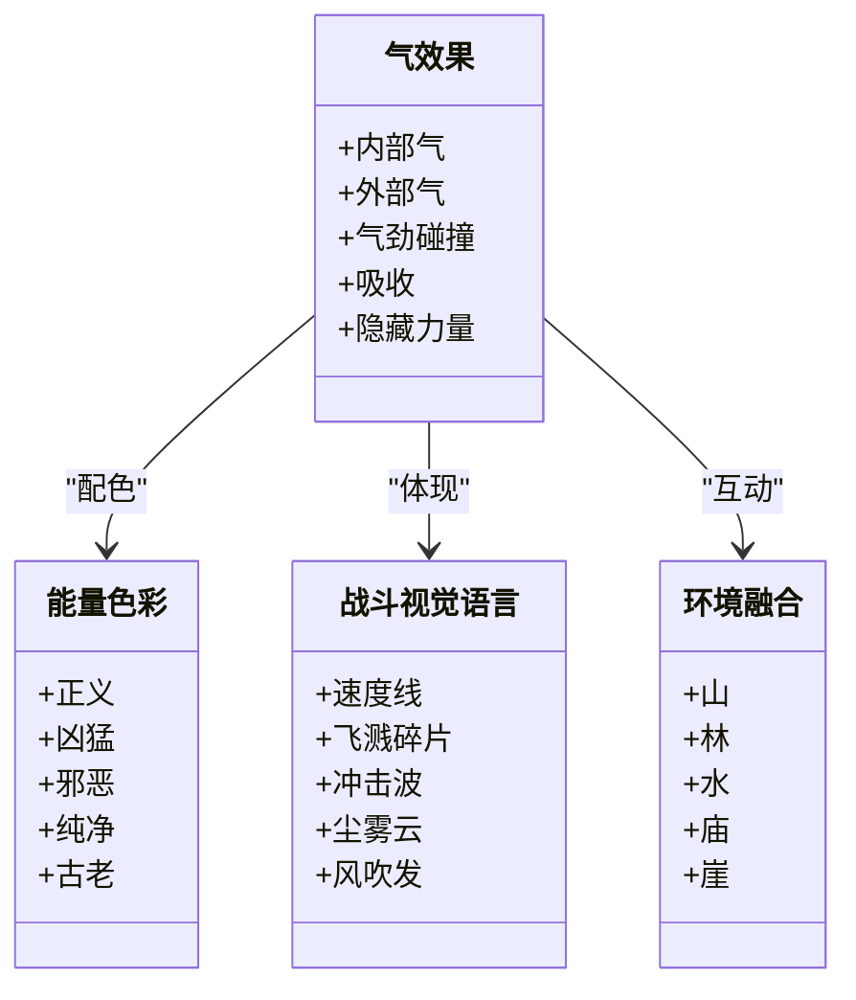
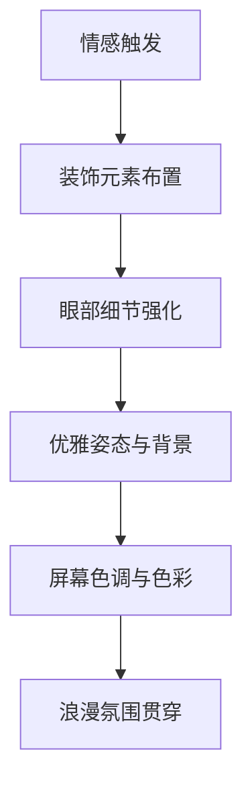
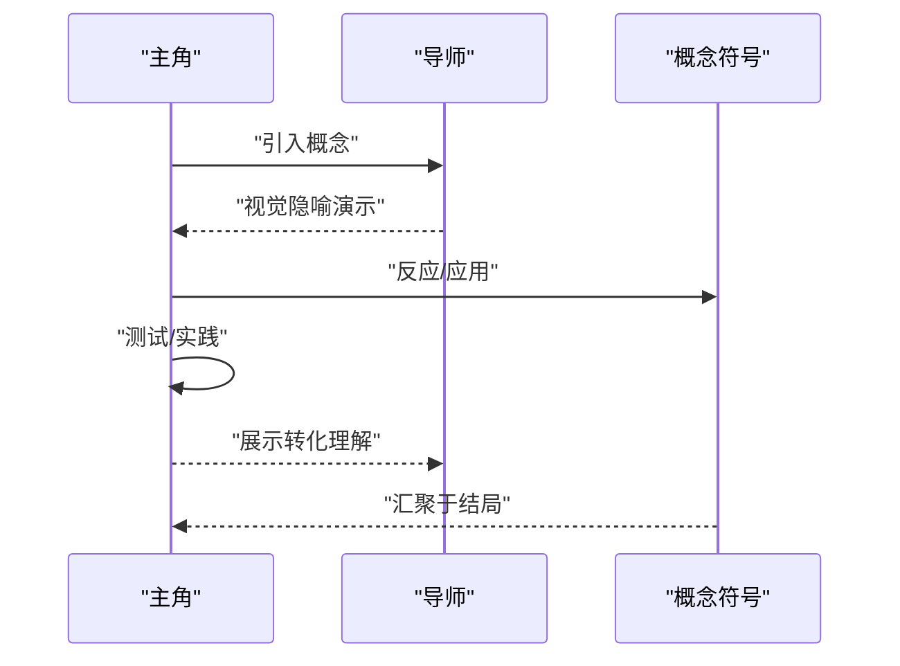
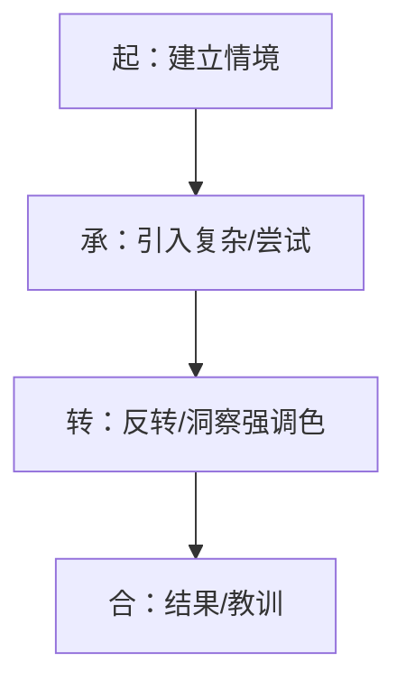
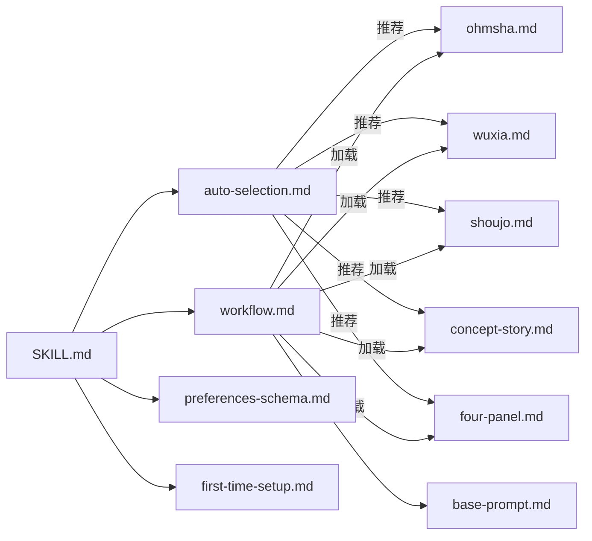

# 预设模板系统

<cite>
**本文引用的文件**
- [ohmsha.md](file://.agents/skills/baoyu-comic/references/presets/ohmsha.md)
- [wuxia.md](file://.agents/skills/baoyu-comic/references/presets/wuxia.md)
- [shoujo.md](file://.agents/skills/baoyu-comic/references/presets/shoujo.md)
- [concept-story.md](file://.agents/skills/baoyu-comic/references/presets/concept-story.md)
- [four-panel.md](file://.agents/skills/baoyu-comic/references/presets/four-panel.md)
- [ohmsha-guide.md](file://.agents/skills/baoyu-comic/references/ohmsha-guide.md)
- [base-prompt.md](file://.agents/skills/baoyu-comic/references/base-prompt.md)
- [workflow.md](file://.agents/skills/baoyu-comic/references/workflow.md)
- [auto-selection.md](file://.agents/skills/baoyu-comic/references/auto-selection.md)
- [preferences-schema.md](file://.agents/skills/baoyu-comic/references/config/preferences-schema.md)
- [first-time-setup.md](file://.agents/skills/baoyu-comic/references/config/first-time-setup.md)
- [SKILL.md](file://.agents/skills/baoyu-comic/SKILL.md)
</cite>

## 目录
1. [简介](#简介)
2. [项目结构](#项目结构)
3. [核心组件](#核心组件)
4. [架构总览](#架构总览)
5. [详细组件分析](#详细组件分析)
6. [依赖关系分析](#依赖关系分析)
7. [性能考量](#性能考量)
8. [故障排除指南](#故障排除指南)
9. [结论](#结论)
10. [附录](#附录)

## 简介
本文件系统化梳理 baoyu-comic 的“预设模板系统”，聚焦五种专业预设：ohmsha（知识漫画风格）、wuxia（武侠漫画）、shoujo（少女漫画）、concept-story（概念故事）、four-panel（四格漫画）。文档从体系架构、规则与视觉特征、创作规范、质量标记、应用场景到使用指南进行逐项解析，并结合工作流与自动选择机制，帮助创作者在保持创意自由的同时高效落地。

## 项目结构
预设模板系统位于 baoyu-comic 技能包内，核心文件组织如下：
- 预设规则：references/presets/*.md
- 工作流与自动选择：references/workflow.md、references/auto-selection.md
- 基础提示与规范：references/base-prompt.md、references/ohmsha-guide.md
- 配置与首选项：references/config/preferences-schema.md、references/config/first-time-setup.md
- 技能接口与选项：SKILL.md

**图示来源**
- [workflow.md:1-544](file://.agents/skills/baoyu-comic/references/workflow.md#L1-L544)
- [auto-selection.md:1-73](file://.agents/skills/baoyu-comic/references/auto-selection.md#L1-L73)
- [ohmsha.md:1-115](file://.agents/skills/baoyu-comic/references/presets/ohmsha.md#L1-L115)
- [wuxia.md:1-111](file://.agents/skills/baoyu-comic/references/presets/wuxia.md#L1-L111)
- [shoujo.md:1-117](file://.agents/skills/baoyu-comic/references/presets/shoujo.md#L1-L117)
- [concept-story.md:1-122](file://.agents/skills/baoyu-comic/references/presets/concept-story.md#L1-L122)
- [four-panel.md:1-108](file://.agents/skills/baoyu-comic/references/presets/four-panel.md#L1-L108)
- [ohmsha-guide.md:1-86](file://.agents/skills/baoyu-comic/references/ohmsha-guide.md#L1-L86)
- [base-prompt.md:1-99](file://.agents/skills/baoyu-comic/references/base-prompt.md#L1-L99)
- [preferences-schema.md:1-162](file://.agents/skills/baoyu-comic/references/config/preferences-schema.md#L1-L162)
- [first-time-setup.md:1-155](file://.agents/skills/baoyu-comic/references/config/first-time-setup.md#L1-L155)
- [SKILL.md:1-317](file://.agents/skills/baoyu-comic/SKILL.md#L1-L317)

**章节来源**
- [SKILL.md:102-118](file://.agents/skills/baoyu-comic/SKILL.md#L102-L118)
- [auto-selection.md:7-51](file://.agents/skills/baoyu-comic/references/auto-selection.md#L7-L51)

## 核心组件
- 预设规则引擎：每个预设文件定义基础配置、独特规则、视觉元素、质量标记与最佳用途，作为生成阶段的权威约束。
- 自动选择器：基于内容信号匹配推荐预设或艺术风格+色调组合，优先级可被用户选项覆盖。
- 工作流编排：从偏好加载、内容分析、样式确认、故事板生成、提示构建、图像生成到PDF合并的完整流水线。
- 基础提示模板：统一的图像规格、分镜结构、文本元素与科学概念可视化规范，确保跨风格一致性。
- 配置与首选项：EXTEND.md 提供水印、语言、艺术风格、色调、布局、宽高比等持久化设置。

**章节来源**
- [auto-selection.md:23-51](file://.agents/skills/baoyu-comic/references/auto-selection.md#L23-L51)
- [workflow.md:35-116](file://.agents/skills/baoyu-comic/references/workflow.md#L35-L116)
- [base-prompt.md:1-99](file://.agents/skills/baoyu-comic/references/base-prompt.md#L1-L99)
- [preferences-schema.md:14-52](file://.agents/skills/baoyu-comic/references/config/preferences-schema.md#L14-L52)

## 架构总览
下图展示从输入内容到最终漫画产出的端到端流程，突出预设模板在不同阶段的注入点与约束作用。

**图示来源**
- [SKILL.md:169-242](file://.agents/skills/baoyu-comic/SKILL.md#L169-L242)
- [workflow.md:151-250](file://.agents/skills/baoyu-comic/references/workflow.md#L151-L250)
- [auto-selection.md:1-73](file://.agents/skills/baoyu-comic/references/auto-selection.md#L1-L73)
- [base-prompt.md:1-99](file://.agents/skills/baoyu-comic/references/base-prompt.md#L1-L99)

## 详细组件分析

### ohmsha（知识漫画风格）
- 基础配置
  - 艺术风格：manga
  - 色调：neutral
  - 布局：webtoon（默认），也可用 dense/mixed
- 独特规则
  - 可视隐喻强制：技术概念必须具象化为“道具/动作/空间”
  - 角色设定：默认使用哆啦A梦角色体系（学生、导师、挑战者、支持者）
  - 分镜标题：每页需有叙事式标题，避免“章节标题”格式
  - “ gadget reveal”模式：学生困惑 → 导师炫酷展示道具 → 名称与解释 → 进入隐喻空间演示
  - 结尾要求：学生展示理解、首尾呼应、导师满意、可选暗示后续主题
  - 禁止“谈话头”：角色必须行动而非仅对话；每格应包含动作、隐喻、互动与非对脸对话
  - 特殊视觉元素：道具揭示（闪亮）、概念空间（圆润边框+发光）、信息显示（全息UI）、顿悟（放射线/光爆）、困惑（螺旋眼/问号）
- 质量标记
  - 概念均有可视隐喻
  - 角色在行动中解释概念
  - 明确的学生/导师动态
  - 道具与道具驱动解释
  - 表情夸张且富有漫画感
  - 信息密度通过视觉设计而非文字堆砌
  - 每页有叙事标题
- 最佳用途
  - 教育类、教程类、计算机科学、AI/编程、算法与数据结构、数学公式、抽象过程讲解
- 使用建议
  - 严格遵循“可视化隐喻”与“gadget reveal”节奏
  - 若无自定义角色，直接采用默认哆啦A梦角色集
  - 页面标题以“故事化”命名，避免技术性副标题

**图示来源**
- [ohmsha.md:64-81](file://.agents/skills/baoyu-comic/references/presets/ohmsha.md#L64-L81)
- [ohmsha-guide.md:37-51](file://.agents/skills/baoyu-comic/references/ohmsha-guide.md#L37-L51)

**章节来源**
- [ohmsha.md:5-115](file://.agents/skills/baoyu-comic/references/presets/ohmsha.md#L5-L115)
- [ohmsha-guide.md:1-86](file://.agents/skills/baoyu-comic/references/ohmsha-guide.md#L1-L86)
- [auto-selection.md:27-31](file://.agents/skills/baoyu-comic/references/auto-selection.md#L27-L31)

### wuxia（武侠漫画）
- 基础配置
  - 艺术风格：ink-brush
  - 色调：action
  - 布局：splash（默认）
- 独特规则
  - 气/内力效果：内部气（围绕角色的光晕）、外部气（可见能量投射）、气劲碰撞（辐射冲击波）、吸收（粒子流向角色）、隐藏力量（眼神/拳头微光）
  - 能量色彩：正义（蓝+金）、凶猛（红+橙）、邪恶（紫+绿）、纯净（白+银）、古老（金+粒子）
  - 战斗视觉语言：冲击时刻需包含速度线、飞溅碎片、冲击波、尘雾/能量云、头发衣物被吹起
  - 动作表现：普通（标准姿态）、快速（运动模糊+速度线）、闪电（残影+多重位置）、瞬移（淡出+粒子轨迹）
  - 环境融合：山（崩塌山峰）、林（炸飞树木/飞叶）、水（壮观水花/踏水而行）、庙（断柱/飞瓦）、崖（惊险坠落/风效）
  - 角色姿态：动态武士站姿、飘逸长袍与头发、动作中的肌肉紧张、脚踩实地或动感移动、传统武术姿势
  - 武器特效：剑（拖尾光弧+刃光）、掌（气流/风效）、棍（旋转模糊+冲击涟漪）、鞭（流动能量轨迹）
  - 氛围元素：浮动粒子（叶/花瓣/尘埃）、水墨烟雾、风向指示、适当的大气与天气
- 质量标记
  - 动态动作姿态与动感
  - 铅笔线条的水墨美学
  - 可见的气/能量效果
  - 高对比戏剧性光线
  - 具有中式元素的氛围背景
  - 飘逸的衣饰与头发
  - 强冲击的战斗时刻
  - 速度线与冲击效果
- 最佳用途
  - 武侠/仙侠故事、中国历史题材、动作密集型叙事
- 使用建议
  - 强化“气”的可视化与环境互动
  - 在关键打击点加入多元素冲击效果
  - 保持角色动态与传统武术美感

**图示来源**
- [wuxia.md:19-96](file://.agents/skills/baoyu-comic/references/presets/wuxia.md#L19-L96)

**章节来源**
- [wuxia.md:1-111](file://.agents/skills/baoyu-comic/references/presets/wuxia.md#L1-L111)
- [auto-selection.md:32-36](file://.agents/skills/baoyu-comic/references/auto-selection.md#L32-L36)

### shoujo（少女漫画）
- 基础配置
  - 艺术风格：manga
  - 色调：romantic
  - 布局：standard（默认）
- 独特规则
  - 装饰元素：爱（飘心/星/玫瑰花瓣）、思念（羽毛/泡泡/远星光）、喜悦（花开/光爆/星星）、悲伤（飘叶/暗淡星光）、害羞（柔光/漂浮泡泡）、顿悟（放射线+闪亮）
  - 眼部细节：眼睛放大（1.2倍）、多亮点（3-5个，随情感）、反射场景、内置闪亮、晶莹泪滴
  - 美的标准：头发飘逸/细节光泽、肌肤如瓷器/脸颊粉嫩、嘴唇柔软略带光泽、手优雅/富有表现力、姿态优雅
  - 背景效果：抽象背景用于情感时刻（告白/震惊/回忆/顿悟/私密）
  - 分镜流动：亲密时刻重叠面板、打破面板边界、在面板间浮动装饰元素、使用屏幕色调营造情绪、不规则面板形状增强戏剧性
  - 情绪节奏：慢下来强化情感冲击（告白→多个小面板再splash；对视→近景序列；触碰→慢动作分解；顿悟→铺垫后爆发）
  - 色彩应用：浪漫（粉/薰衣草/玫瑰金）、快乐（浅黄/桃/天蓝）、悲伤（淡蓝/银/灰薰衣草）、戏剧（深玫瑰/紫/强对比）
  - 屏幕色调：中性（干净简洁）、浪漫（柔和渐变）、戏剧（强对比）、梦幻（软点阵）
- 质量标记
  - 大而闪亮的细节眼睛
  - 情感时刻的装饰元素
  - 流畅美丽的角色设计
  - 柔美粉彩配色
  - 优雅的分镜构图
  - 屏幕色调的情绪效果
  - 全篇浪漫氛围
  - 美丽且富有表现力的姿态
- 最佳用途
  - 浪漫故事、成长/校园、友谊、情感剧、爱情故事
- 使用建议
  - 将情感与装饰元素同步，强调“情绪—装饰—画面”的三重奏
  - 控制节奏，用慢镜头与特殊分镜强化情感张力

**图示来源**
- [shoujo.md:19-102](file://.agents/skills/baoyu-comic/references/presets/shoujo.md#L19-L102)

**章节来源**
- [shoujo.md:1-117](file://.agents/skills/baoyu-comic/references/presets/shoujo.md#L1-L117)
- [auto-selection.md:37-41](file://.agents/skills/baoyu-comic/references/auto-selection.md#L37-L41)

### concept-story（概念故事）
- 基础配置
  - 艺术风格：manga
  - 色调：warm
  - 布局：standard（默认）
- 独特规则
  - 概念可视化系统：为每个主要抽象概念建立重复出现的视觉符号/隐喻（心理需求→可触发光球；管理原则→角色可导航的空间结构；成长→可转化的有机体；框架→空间结构；情绪→场景光照变化）
  - 符号连续性：首次出现→柔和发光；再次出现→背景/互动中重现；结局→所有符号汇聚，展示整合
  - 角色原型：按内容领域定制原创角色，无固定默认角色
  - 叙事弧结构：问题→契机→学习→转折→转变（暖色渐进、构图开放、符号逐一引入、对比增强、动态构图、最终全色展开）
  - 对话与动作平衡：鼓励对话，但每页至少一节对话+一节视觉/动作；避免连续四格纯讲授
  - 场景氛围：问题/挫折→冷调暖底+紧缩构图+杂乱环境；指导时刻→黄金时刻+开放构图+室内暖光；概念可视化→柔和光效+简洁背景+符号聚焦；成长/转变→暖光向外扩散+姿态开放；结局→全暖色+开阔构图+符号齐聚
  - 结尾要求：主角展示转化后的理解、与开篇形成对比（枯萎→繁茂）、所有概念符号同时出现、向前展望的元素
  - 分页标题：每页需有叙事标题，避免直接罗列学科名
- 质量标记
  - 每个主要概念有重复视觉符号
  - 对话与视觉隐喻协同（非相互替代）
  - 从问题到转变的清晰成长弧
  - 与内容领域契合的原创角色
  - 全篇温暖专业的氛围
  - 符号持续出现并在故事中累积
  - 结局整合所有符号并有转化回溯
- 最佳用途
  - 心理学概念、管理/领导力原则、动机理论、个人发展、自我提升、教练叙事、软技能教育、通过角色故事解释抽象概念
- 使用建议
  - 先绘制“符号映射表”，明确概念与符号对应关系
  - 保持对话与动作交替，避免“纯讲授页”

**图示来源**
- [concept-story.md:19-99](file://.agents/skills/baoyu-comic/references/presets/concept-story.md#L19-L99)

**章节来源**
- [concept-story.md:1-122](file://.agents/skills/baoyu-comic/references/presets/concept-story.md#L1-L122)
- [auto-selection.md:42-46](file://.agents/skills/baoyu-comic/references/auto-selection.md#L42-L46)

### four-panel（四格漫画）
- 基础配置
  - 艺术风格：minimalist
  - 色调：neutral
  - 布局：four-panel（默认）+ 4:3（横向）
- 独特规则
  - 起承转合结构：第一格（起）建立情境；第二格（承）推进复杂度；第三格（转）反转/洞察；第四格（合）结果/教训
  - 单页故事：整段故事在一页四格内完成，页数恒为1（可选封面）
  - 色彩系统：黑白线稿为主，1-2个强调色（默认：橙色），关键概念标签/对象使用强调色或描边；第三格强调色最强；角色保持黑白，仅概念/对象/标签着色；整幅保持一致强调色
  - 角色设计：简化棒球棍式人物，通过简单道具区分（领带/眼镜/帽子/公文包/围裙），最多2-3人
  - 面内文字：中文（或源语言），每格最多1-2行短语，关键术语可用强调色背景；无旁白框，仅对话与标签；气泡为简单矩形/椭圆，细黑线
  - 标题与说明：可在四格上方加简短描述标题，下方可加一行说明/道德，二者属于页面构图的一部分，非独立面板
  - 角色原型：按内容定制，无固定默认角色
  - 图像提示模板：强调“四格网格布局（2×2）+极简线条+黑白主色+特定强调色”的关键词组合
- 质量标记
  - 严格2×2四格
  - 起承转合叙事弧清晰
  - 90%+黑白+策略性强调色
  - 简化棒球棍式角色
  - 关键概念以强调色突出
  - 文字精炼且为中文（或源语言）
  - 单页完整故事
  - 第三格传达清晰“转折/洞见”
- 最佳用途
  - 商业寓言、管理格言、短时洞察、职场讽喻、概念对比、社交媒体教育内容、快读漫画
- 使用建议
  - 严格控制文字长度，让画面说话
  - 强调色集中在第三格，制造视觉重心

**图示来源**
- [four-panel.md:20-32](file://.agents/skills/baoyu-comic/references/presets/four-panel.md#L20-L32)

**章节来源**
- [four-panel.md:1-108](file://.agents/skills/baoyu-comic/references/presets/four-panel.md#L1-L108)
- [auto-selection.md:47-51](file://.agents/skills/baoyu-comic/references/auto-selection.md#L47-L51)

## 依赖关系分析
- 预设与自动选择
  - auto-selection.md 定义内容信号矩阵与推荐规则，决定是否启用某预设及其特殊规则
- 工作流与预设
  - workflow.md 在生成故事板与角色时加载对应预设文件，应用其规则
- 基础规范与预设
  - base-prompt.md 提供通用图像规格、分镜结构与科学概念可视化规范，作为各预设的补充约束
- 配置与首选项
  - preferences-schema.md 与 first-time-setup.md 确保 EXTEND.md 的存在与正确性，从而保证工作流的前置条件满足

**图示来源**
- [auto-selection.md:1-73](file://.agents/skills/baoyu-comic/references/auto-selection.md#L1-L73)
- [workflow.md:253-276](file://.agents/skills/baoyu-comic/references/workflow.md#L253-L276)
- [base-prompt.md:1-99](file://.agents/skills/baoyu-comic/references/base-prompt.md#L1-L99)
- [SKILL.md:259-282](file://.agents/skills/baoyu-comic/SKILL.md#L259-L282)

**章节来源**
- [auto-selection.md:1-73](file://.agents/skills/baoyu-comic/references/auto-selection.md#L1-L73)
- [workflow.md:253-276](file://.agents/skills/baoyu-comic/references/workflow.md#L253-L276)
- [SKILL.md:259-282](file://.agents/skills/baoyu-comic/SKILL.md#L259-L282)

## 性能考量
- 图像生成时间：每页约10-30秒，受后端与分辨率影响
- 自动重试：失败时自动重试一次
- 参考图像优化：若使用参考图或角色表作为 --ref，建议压缩后再传，避免负载过大
- 会话一致性：通过会话ID维持风格一致性
- 生成策略：根据后端能力选择“传递角色表”或“嵌入描述”的策略，减少重复工作

**章节来源**
- [SKILL.md:294-303](file://.agents/skills/baoyu-comic/SKILL.md#L294-L303)

## 故障排除指南
- 首次运行无 EXTEND.md
  - 系统将引导完成“首次设置”，保存至项目或用户目录，完成后继续工作流
- 预设未生效
  - 确认在样式确认阶段选择了相应预设；若使用 plain manga+neutral 组合，不会包含预设的额外规则
- 角色与一致性问题
  - 多页/有重复角色时建议生成角色表；若后端不支持 --ref，将自动嵌入角色描述
- 输出语言与文本
  - 语言检测优先级：显式 --lang > EXTEND.md 设置 > 对话语言 > 源内容语言；文本统一使用中文全角标点
- 生成失败
  - 压缩角色表或参考图后重试；仍失败则切换为“提示内嵌描述”策略

**章节来源**
- [first-time-setup.md:12-18](file://.agents/skills/baoyu-comic/references/config/first-time-setup.md#L12-L18)
- [workflow.md:415-496](file://.agents/skills/baoyu-comic/references/workflow.md#L415-L496)
- [SKILL.md:153-168](file://.agents/skills/baoyu-comic/SKILL.md#L153-L168)

## 结论
预设模板系统通过“内容信号→自动选择→预设规则→工作流编排→基础规范”的闭环，既保证了创作的一致性与专业度，又保留了创作者在角色、分镜与细节上的自由度。五种预设分别针对教育、动作、浪漫、概念叙事与极简表达，覆盖广泛的内容类型与传播场景。遵循本文档的规则与流程，可在保持创意自由的同时显著提升生产效率与作品质量。

## 附录
- 快速对照表
  - ohmsha：可视化隐喻+gadget reveal+禁止谈话头+默认哆啦A梦角色
  - wuxia：气/能量+水墨风格+动作密集+环境互动
  - shoujo：装饰元素+眼部细节+浪漫节奏+优雅姿态
  - concept-story：符号系统+成长弧+对话与动作平衡+原创角色
  - four-panel：起承转合+黑白+强调色+极简角色+单页故事
- 扩展阅读
  - 自动选择矩阵与兼容性：[auto-selection.md:52-66](file://.agents/skills/baoyu-comic/references/auto-selection.md#L52-L66)
  - 基础提示模板与规范：[base-prompt.md:1-99](file://.agents/skills/baoyu-comic/references/base-prompt.md#L1-L99)
  - 配置与首选项Schema：[preferences-schema.md:1-162](file://.agents/skills/baoyu-comic/references/config/preferences-schema.md#L1-L162)
  - 首次设置流程：[first-time-setup.md:1-155](file://.agents/skills/baoyu-comic/references/config/first-time-setup.md#L1-L155)
  - 技能接口与选项：[SKILL.md:78-118](file://.agents/skills/baoyu-comic/SKILL.md#L78-L118)