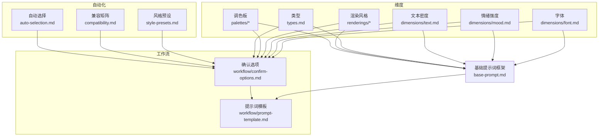
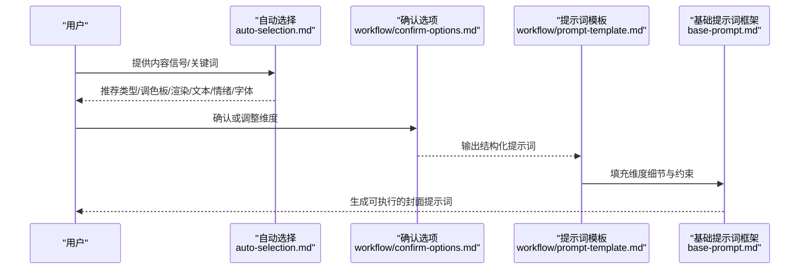
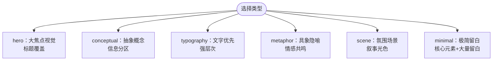
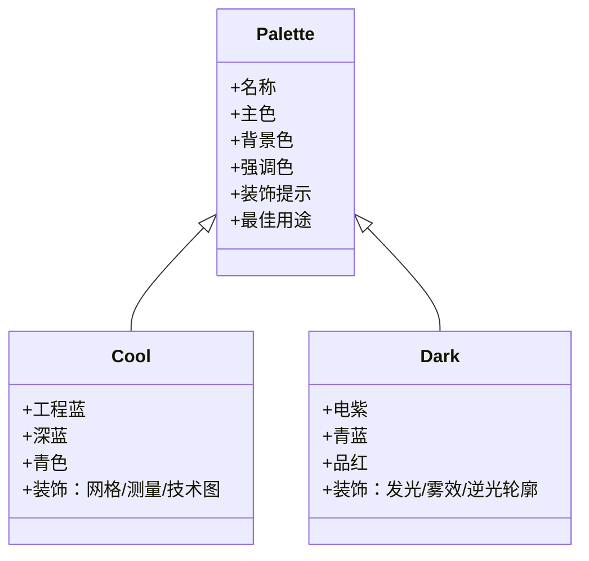
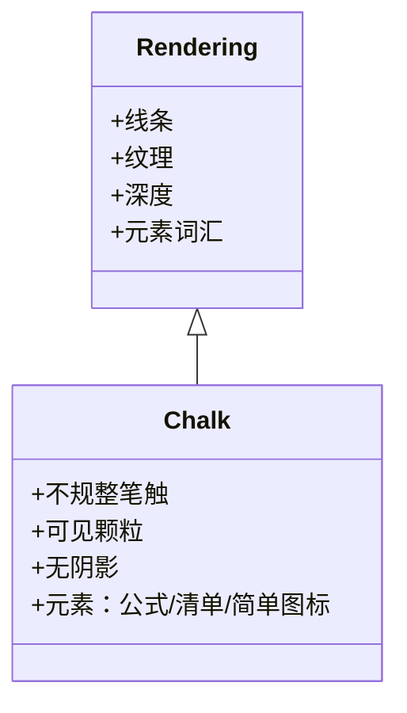
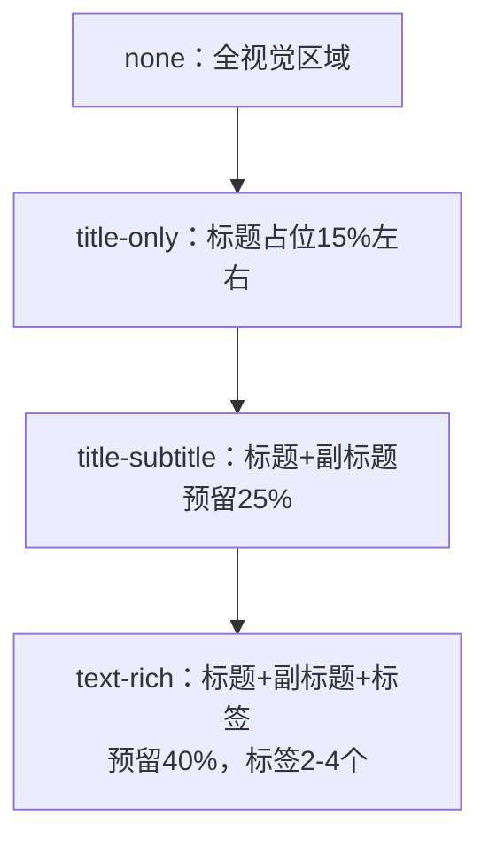
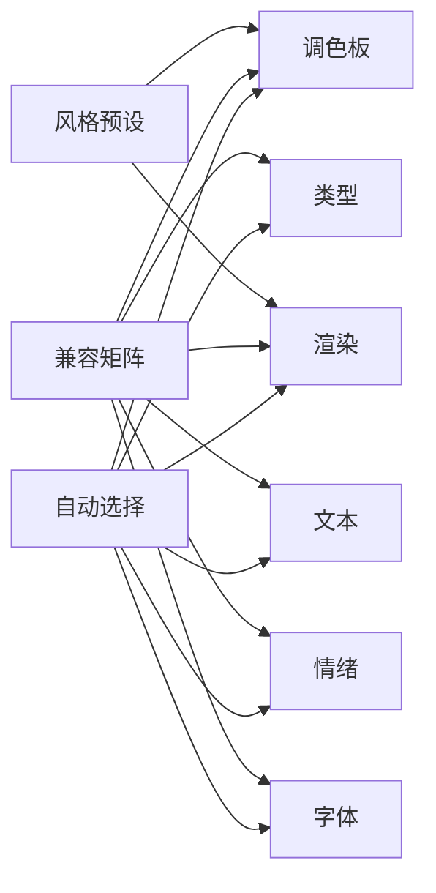
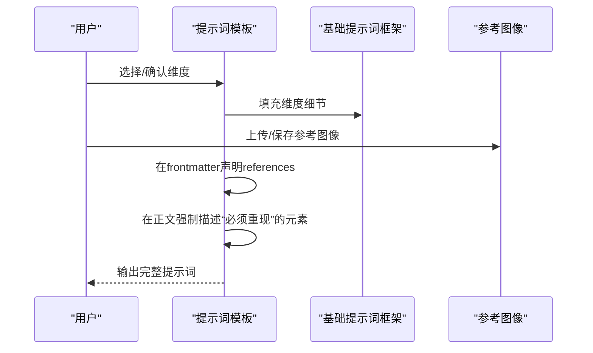
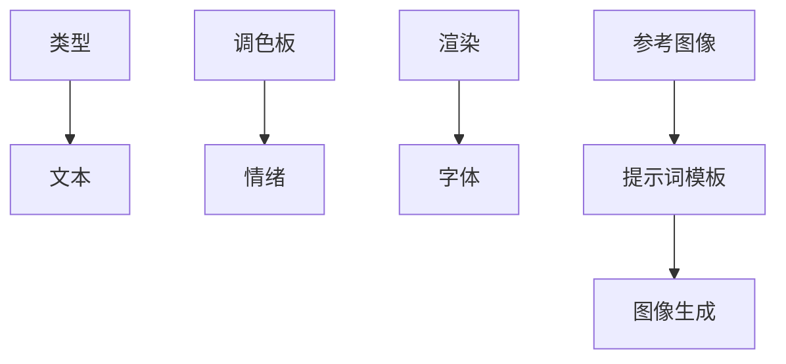

# baoyu-cover-image 封面图像技能

<cite>
**本文引用的文件**
- [SKILL.md](file://.agents/skills/baoyu-cover-image/SKILL.md)
- [auto-selection.md](file://.agents/skills/baoyu-cover-image/references/auto-selection.md)
- [base-prompt.md](file://.agents/skills/baoyu-cover-image/references/base-prompt.md)
- [compatibility.md](file://.agents/skills/baoyu-cover-image/references/compatibility.md)
- [style-presets.md](file://.agents/skills/baoyu-cover-image/references/style-presets.md)
- [types.md](file://.agents/skills/baoyu-cover-image/references/types.md)
- [visual-elements.md](file://.agents/skills/baoyu-cover-image/references/visual-elements.md)
- [palettes/cool.md](file://.agents/skills/baoyu-cover-image/references/palettes/cool.md)
- [palettes/dark.md](file://.agents/skills/baoyu-cover-image/references/palettes/dark.md)
- [renderings/chalk.md](file://.agents/skills/baoyu-cover-image/references/renderings/chalk.md)
- [dimensions/font.md](file://.agents/skills/baoyu-cover-image/references/dimensions/font.md)
- [dimensions/mood.md](file://.agents/skills/baoyu-cover-image/references/dimensions/mood.md)
- [dimensions/text.md](file://.agents/skills/baoyu-cover-image/references/dimensions/text.md)
- [workflow/confirm-options.md](file://.agents/skills/baoyu-cover-image/references/workflow/confirm-options.md)
- [workflow/prompt-template.md](file://.agents/skills/baoyu-cover-image/references/workflow/prompt-template.md)
</cite>

## 目录
1. [简介](#简介)
2. [项目结构](#项目结构)
3. [核心组件](#核心组件)
4. [架构总览](#架构总览)
5. [详细组件分析](#详细组件分析)
6. [依赖关系分析](#依赖关系分析)
7. [性能与可扩展性](#性能与可扩展性)
8. [故障排查指南](#故障排查指南)
9. [结论](#结论)
10. [附录：使用示例与最佳实践](#附录使用示例与最佳实践)

## 简介
本技能通过“六维设计系统”自动生成高质量封面图像：类型(Type)、调色板(Palette)、渲染风格(Rendering)、文本密度(Text)、情绪强度(Mood)、字体(Font)，并结合尺寸与参考图像进行智能适配。系统内置自动选择规则、兼容矩阵与风格预设，覆盖从科技到创意的多种视觉风格，并提供可复用的提示词模板与可视化元素库，帮助用户以最小成本产出一致、专业且富有表现力的封面。

## 项目结构
技能目录按“维度/主题 + 工作流”的方式组织，便于维护与扩展：
- 维度定义：types、dimensions、palettes、renderings、visual-elements
- 自动化：auto-selection、compatibility、style-presets
- 工作流：workflow（确认选项、提示词模板）
- 入口：SKILL.md

图表来源
- [.agents/skills/baoyu-cover-image/references/types.md:1-24](file://.agents/skills/baoyu-cover-image/references/types.md#L1-L24)
- [.agents/skills/baoyu-cover-image/references/dimensions/text.md:1-131](file://.agents/skills/baoyu-cover-image/references/dimensions/text.md#L1-L131)
- [.agents/skills/baoyu-cover-image/references/dimensions/mood.md:1-142](file://.agents/skills/baoyu-cover-image/references/dimensions/mood.md#L1-L142)
- [.agents/skills/baoyu-cover-image/references/dimensions/font.md:1-165](file://.agents/skills/baoyu-cover-image/references/dimensions/font.md#L1-L165)
- [.agents/skills/baoyu-cover-image/references/auto-selection.md:1-75](file://.agents/skills/baoyu-cover-image/references/auto-selection.md#L1-L75)
- [.agents/skills/baoyu-cover-image/references/compatibility.md:1-61](file://.agents/skills/baoyu-cover-image/references/compatibility.md#L1-L61)
- [.agents/skills/baoyu-cover-image/references/style-presets.md:1-40](file://.agents/skills/baoyu-cover-image/references/style-presets.md#L1-L40)
- [.agents/skills/baoyu-cover-image/references/workflow/confirm-options.md:1-153](file://.agents/skills/baoyu-cover-image/references/workflow/confirm-options.md#L1-L153)
- [.agents/skills/baoyu-cover-image/references/workflow/prompt-template.md:1-255](file://.agents/skills/baoyu-cover-image/references/workflow/prompt-template.md#L1-L255)
- [.agents/skills/baoyu-cover-image/references/base-prompt.md:1-125](file://.agents/skills/baoyu-cover-image/references/base-prompt.md#L1-L125)

章节来源
- [.agents/skills/baoyu-cover-image/SKILL.md](file://.agents/skills/baoyu-cover-image/SKILL.md)

## 核心组件
- 六维设计系统
  - 类型(Type)：hero、conceptual、typography、metaphor、scene、minimal
  - 调色板(Palette)：warm、elegant、cool、dark、earth、vivid、pastel、mono、retro、duotone
  - 渲染风格(Rendering)：flat-vector、hand-drawn、painterly、digital、pixel、chalk、screen-print
  - 文本密度(Text)：none、title-only、title-subtitle、text-rich
  - 情绪强度(Mood)：subtle、balanced、bold
  - 字体(Font)：clean、handwritten、serif、display
- 自动选择与兼容矩阵：基于内容信号自动推荐维度组合，避免不兼容搭配
- 风格预设：常用组合的快捷入口，支持覆盖单维
- 提示词模板：结构化输出，确保参考图像与内容语义被模型充分理解
- 可视化元素库：图标与符号词汇表，按主题分类，指导构图与隐喻表达

章节来源
- [.agents/skills/baoyu-cover-image/references/types.md:1-24](file://.agents/skills/baoyu-cover-image/references/types.md#L1-L24)
- [.agents/skills/baoyu-cover-image/references/style-presets.md:1-40](file://.agents/skills/baoyu-cover-image/references/style-presets.md#L1-L40)
- [.agents/skills/baoyu-cover-image/references/compatibility.md:1-61](file://.agents/skills/baoyu-cover-image/references/compatibility.md#L1-L61)
- [.agents/skills/baoyu-cover-image/references/auto-selection.md:1-75](file://.agents/skills/baoyu-cover-image/references/auto-selection.md#L1-L75)
- [.agents/skills/baoyu-cover-image/references/workflow/prompt-template.md:1-255](file://.agents/skills/baoyu-cover-image/references/workflow/prompt-template.md#L1-L255)
- [.agents/skills/baoyu-cover-image/references/visual-elements.md:1-102](file://.agents/skills/baoyu-cover-image/references/visual-elements.md#L1-L102)

## 架构总览
下图展示了从输入内容到最终提示词与封面生成的关键流程，以及各维度之间的交互关系。

图表来源
- [.agents/skills/baoyu-cover-image/references/auto-selection.md:1-75](file://.agents/skills/baoyu-cover-image/references/auto-selection.md#L1-L75)
- [.agents/skills/baoyu-cover-image/references/workflow/confirm-options.md:1-153](file://.agents/skills/baoyu-cover-image/references/workflow/confirm-options.md#L1-L153)
- [.agents/skills/baoyu-cover-image/references/workflow/prompt-template.md:1-255](file://.agents/skills/baoyu-cover-image/references/workflow/prompt-template.md#L1-L255)
- [.agents/skills/baoyu-cover-image/references/base-prompt.md:1-125](file://.agents/skills/baoyu-cover-image/references/base-prompt.md#L1-L125)

## 详细组件分析

### 组件一：类型(Type)与构图
- 类型定义与适用场景：hero（大视觉冲击）、conceptual（概念可视化）、typography（文字优先）、metaphor（具象隐喻）、scene（氛围场景）、minimal（极简留白）
- 类型特定布局要点：焦点占比、标题叠加策略、信息层级与留白比例
- 与渲染/文本/情绪的兼容性：不同类型对渲染风格与文本密度有偏好，需遵循兼容矩阵

图表来源
- [.agents/skills/baoyu-cover-image/references/types.md:14-24](file://.agents/skills/baoyu-cover-image/references/types.md#L14-L24)

章节来源
- [.agents/skills/baoyu-cover-image/references/types.md:1-24](file://.agents/skills/baoyu-cover-image/references/types.md#L1-L24)

### 组件二：调色板(Palette)与色彩方案
- 调色板类别与风格定位：warm（亲和）、elegant（优雅）、cool（技术）、dark（暗黑）、earth（自然）、vivid（活力）、pastel（柔和）、mono（极简）、retro（复古）、duotone（二色）
- 色彩角色与装饰提示：主色、背景、强调色；装饰线索（网格、几何、颗粒感等）
- 与情绪强度的映射：subtle降低对比与饱和度，bold增强对比与饱和度，balanced保持标准

图表来源
- [.agents/skills/baoyu-cover-image/references/palettes/cool.md:1-31](file://.agents/skills/baoyu-cover-image/references/palettes/cool.md#L1-L31)
- [.agents/skills/baoyu-cover-image/references/palettes/dark.md:1-31](file://.agents/skills/baoyu-cover-image/references/palettes/dark.md#L1-L31)

章节来源
- [.agents/skills/baoyu-cover-image/references/palettes/cool.md:1-31](file://.agents/skills/baoyu-cover-image/references/palettes/cool.md#L1-L31)
- [.agents/skills/baoyu-cover-image/references/palettes/dark.md:1-31](file://.agents/skills/baoyu-cover-image/references/palettes/dark.md#L1-L31)
- [.agents/skills/baoyu-cover-image/references/dimensions/mood.md:105-116](file://.agents/skills/baoyu-cover-image/references/dimensions/mood.md#L105-L116)

### 组件三：渲染风格(Rendering)与视觉元素
- 渲染风格特性：线条质量、纹理、明暗与深度、元素词汇
- 示例：chalk（粉笔黑板风，手绘质感，颗粒与擦痕）
- 与字体/类型的匹配：不同渲染风格对字体与类型有兼容偏好

图表来源
- [.agents/skills/baoyu-cover-image/references/renderings/chalk.md:1-44](file://.agents/skills/baoyu-cover-image/references/renderings/chalk.md#L1-L44)

章节来源
- [.agents/skills/baoyu-cover-image/references/renderings/chalk.md:1-44](file://.agents/skills/baoyu-cover-image/references/renderings/chalk.md#L1-L44)
- [.agents/skills/baoyu-cover-image/references/compatibility.md:20-30](file://.agents/skills/baoyu-cover-image/references/compatibility.md#L20-L30)

### 组件四：文本密度(Text)与标题策略
- 文本密度等级：none（纯视觉）、title-only（单标题）、title-subtitle（标题+副标题）、text-rich（标题+副标题+2-4标签）
- 不同等级的版式预留区与层次关系
- 与类型的兼容性：某些类型不适合过多文本

图表来源
- [.agents/skills/baoyu-cover-image/references/dimensions/text.md:12-17](file://.agents/skills/baoyu-cover-image/references/dimensions/text.md#L12-L17)

章节来源
- [.agents/skills/baoyu-cover-image/references/dimensions/text.md:1-131](file://.agents/skills/baoyu-cover-image/references/dimensions/text.md#L1-L131)

### 组件五：情绪强度(Mood)与视觉权重
- 情绪等级：subtle（低对比/柔化）、balanced（中等）、bold（高对比/强烈）
- 对调色板与渲染风格的调整：subtle弱化饱和与笔触重量，bold强化对比与笔触厚度
- 与类型的兼容性：部分类型对bold不友好（如minimal）

章节来源
- [.agents/skills/baoyu-cover-image/references/dimensions/mood.md:1-142](file://.agents/skills/baoyu-cover-image/references/dimensions/mood.md#L1-L142)

### 组件六：字体(Font)与风格适配
- 字体类别：clean（几何无衬线）、handwritten（手写笔刷）、serif（经典衬线）、display（粗体装饰）
- 与渲染/类型的兼容矩阵：不同字体与渲染风格的适配程度不同
- 与调色板的互动：根据调色板特征调整字重与气质

章节来源
- [.agents/skills/baoyu-cover-image/references/dimensions/font.md:1-165](file://.agents/skills/baoyu-cover-image/references/dimensions/font.md#L1-L165)

### 组件七：自动选择机制与兼容矩阵
- 内容信号驱动的自动选择：类型、调色板、渲染、文本、情绪、字体均支持基于内容信号的默认推荐
- 兼容矩阵：Palette×Rendering、Type×Rendering、Type×Text、Type×Mood、Font×Rendering 的推荐度矩阵
- 风格预设：--style 快捷组合，可覆盖任一维度

图表来源
- [.agents/skills/baoyu-cover-image/references/auto-selection.md:1-75](file://.agents/skills/baoyu-cover-image/references/auto-selection.md#L1-L75)
- [.agents/skills/baoyu-cover-image/references/compatibility.md:1-61](file://.agents/skills/baoyu-cover-image/references/compatibility.md#L1-L61)
- [.agents/skills/baoyu-cover-image/references/style-presets.md:1-40](file://.agents/skills/baoyu-cover-image/references/style-presets.md#L1-L40)

章节来源
- [.agents/skills/baoyu-cover-image/references/auto-selection.md:1-75](file://.agents/skills/baoyu-cover-image/references/auto-selection.md#L1-L75)
- [.agents/skills/baoyu-cover-image/references/compatibility.md:1-61](file://.agents/skills/baoyu-cover-image/references/compatibility.md#L1-L61)
- [.agents/skills/baoyu-cover-image/references/style-presets.md:1-40](file://.agents/skills/baoyu-cover-image/references/style-presets.md#L1-L40)

### 组件八：提示词模板与参考图像处理
- 结构化提示词：frontmatter（类型、调色板、渲染、参考列表）、内容上下文、视觉设计、文本元素、情绪应用、字体应用、构图说明、水印与参考图像说明
- 参考图像处理：必须在frontmatter中声明references；当提供参考图像时，需在提示词正文中强制描述“必须重现”的具体视觉元素与空间布局
- 内容驱动设计：标题与摘要决定视觉隐喻，关键词决定装饰元素与符号

图表来源
- [.agents/skills/baoyu-cover-image/references/workflow/prompt-template.md:1-255](file://.agents/skills/baoyu-cover-image/references/workflow/prompt-template.md#L1-L255)
- [.agents/skills/baoyu-cover-image/references/base-prompt.md:1-125](file://.agents/skills/baoyu-cover-image/references/base-prompt.md#L1-L125)

章节来源
- [.agents/skills/baoyu-cover-image/references/workflow/prompt-template.md:1-255](file://.agents/skills/baoyu-cover-image/references/workflow/prompt-template.md#L1-L255)
- [.agents/skills/baoyu-cover-image/references/base-prompt.md:1-125](file://.agents/skills/baoyu-cover-image/references/base-prompt.md#L1-L125)

## 依赖关系分析
- 维度间耦合
  - 类型与文本：类型决定文本密度上限与布局预留区
  - 调色板与情绪：情绪修改调色板的对比/饱和/笔触重量
  - 渲染与字体：不同渲染风格对字体的适配度不同
  - 参考图像与提示词：参考图像必须在frontmatter声明并在正文强制描述
- 外部依赖
  - 图像生成模型：需要明确的“必须重现”指令，否则忽略参考图像
  - 用户偏好：快速模式、输出目录、语言等

图表来源
- [.agents/skills/baoyu-cover-image/references/compatibility.md:1-61](file://.agents/skills/baoyu-cover-image/references/compatibility.md#L1-L61)
- [.agents/skills/baoyu-cover-image/references/workflow/prompt-template.md:131-176](file://.agents/skills/baoyu-cover-image/references/workflow/prompt-template.md#L131-L176)

章节来源
- [.agents/skills/baoyu-cover-image/references/compatibility.md:1-61](file://.agents/skills/baoyu-cover-image/references/compatibility.md#L1-L61)
- [.agents/skills/baoyu-cover-image/references/workflow/prompt-template.md:131-176](file://.agents/skills/baoyu-cover-image/references/workflow/prompt-template.md#L131-L176)

## 性能与可扩展性
- 性能考量
  - 自动选择与兼容矩阵减少无效尝试，提升命中率
  - 风格预设降低用户决策成本，提高批量生成效率
- 可扩展性
  - 新增调色板/渲染风格/字体时，需同步更新兼容矩阵与自动选择规则
  - 可视化元素库可按主题持续扩充，保持隐喻表达的一致性

[本节为通用建议，无需列出章节来源]

## 故障排查指南
- 参考图像未生效
  - 确认已在frontmatter声明references且文件存在
  - 在提示词正文中强制描述“必须重现”的具体元素与空间布局
- 维度冲突
  - 使用兼容矩阵核对组合是否被标记为“不推荐”
  - 通过--style或显式--palette/--rendering覆盖冲突维度
- 输出语言不正确
  - 语言由内容语言自动确定，若与预期不符，请检查输入内容的语言一致性
- 快速模式未按预期
  - quick_mode仅提供推荐值，不会自动选择维度；如需跳过全部维度请显式传入相应参数

章节来源
- [.agents/skills/baoyu-cover-image/references/workflow/prompt-template.md:131-176](file://.agents/skills/baoyu-cover-image/references/workflow/prompt-template.md#L131-L176)
- [.agents/skills/baoyu-cover-image/references/compatibility.md:1-61](file://.agents/skills/baoyu-cover-image/references/compatibility.md#L1-L61)
- [.agents/skills/baoyu-cover-image/references/workflow/confirm-options.md:1-153](file://.agents/skills/baoyu-cover-image/references/workflow/confirm-options.md#L1-L153)

## 结论
baoyu-cover-image 技能通过“六维设计系统 + 自动选择 + 兼容矩阵 + 风格预设 + 结构化提示词模板”，实现了从内容到封面的高效、一致与可复现的生成流程。配合可视化元素库与参考图像处理规范，既能满足多样化风格需求，又能保证品牌一致性与视觉表达力。

[本节为总结，无需列出章节来源]

## 附录：使用示例与最佳实践

- 示例一：科技产品发布（hero + cool + digital + title-only + bold + clean）
  - 适用场景：产品发布、技术公告
  - 关键点：技术蓝为主色，强调对比与清晰度，标题优先，保留右侧标题区
  - 参考路径：[style-presets.md:8-11](file://.agents/skills/baoyu-cover-image/references/style-presets.md#L8-L11)

- 示例二：创意教程（conceptual + pastel + hand-drawn + title-subtitle + balanced + handwritten）
  - 适用场景：教程、创意分享
  - 关键点：柔和色彩与手绘风格，标题+副标题说明课程信息
  - 参考路径：[style-presets.md:12-26](file://.agents/skills/baoyu-cover-image/references/style-presets.md#L12-L26)

- 示例三：个人故事（scene + warm + painterly + title-only + subtle + handwritten）
  - 适用场景：个人博客、生活随笔
  - 关键点：温暖色调与柔和笔触，营造亲和氛围
  - 参考路径：[types.md:7-12](file://.agents/skills/baoyu-cover-image/references/types.md#L7-L12)

- 示例四：极简知识卡片（minimal + mono + flat-vector + none + balanced + clean）
  - 适用场景：知识卡片、信息图
  - 关键点：大量留白与几何元素，强调信息密度
  - 参考路径：[types.md:7-12](file://.agents/skills/baoyu-cover-image/references/types.md#L7-L12)

- 示例五：复古电影海报（scene + retro + screen-print + text-rich + bold + display）
  - 适用场景：活动宣传、主题推广
  - 关键点：二色/多色网点印刷风格，强调视觉重量与动态
  - 参考路径：[style-presets.md:28-32](file://.agents/skills/baoyu-cover-image/references/style-presets.md#L28-L32)

- 最佳实践
  - 优先使用--style快速获得推荐组合，再根据品牌/内容微调
  - 有参考图像时务必在frontmatter声明references并在提示词中强制描述“必须重现”的元素
  - 使用可视化元素库中的图标与隐喻，避免复杂细节，突出核心概念
  - 保持标题与内容语言一致，避免虚构或篡改标题

章节来源
- [.agents/skills/baoyu-cover-image/references/style-presets.md:1-40](file://.agents/skills/baoyu-cover-image/references/style-presets.md#L1-L40)
- [.agents/skills/baoyu-cover-image/references/types.md:1-24](file://.agents/skills/baoyu-cover-image/references/types.md#L1-L24)
- [.agents/skills/baoyu-cover-image/references/visual-elements.md:1-102](file://.agents/skills/baoyu-cover-image/references/visual-elements.md#L1-L102)
- [.agents/skills/baoyu-cover-image/references/workflow/prompt-template.md:131-176](file://.agents/skills/baoyu-cover-image/references/workflow/prompt-template.md#L131-L176)