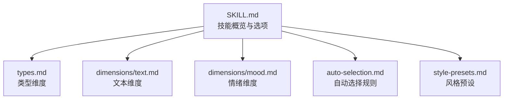
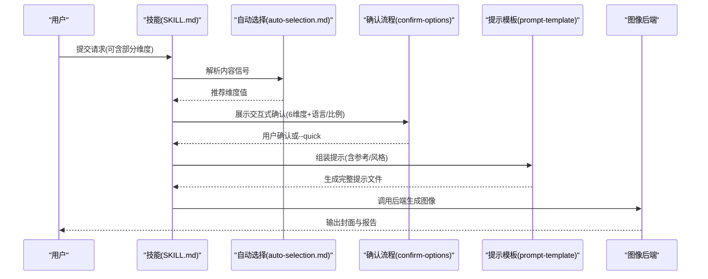
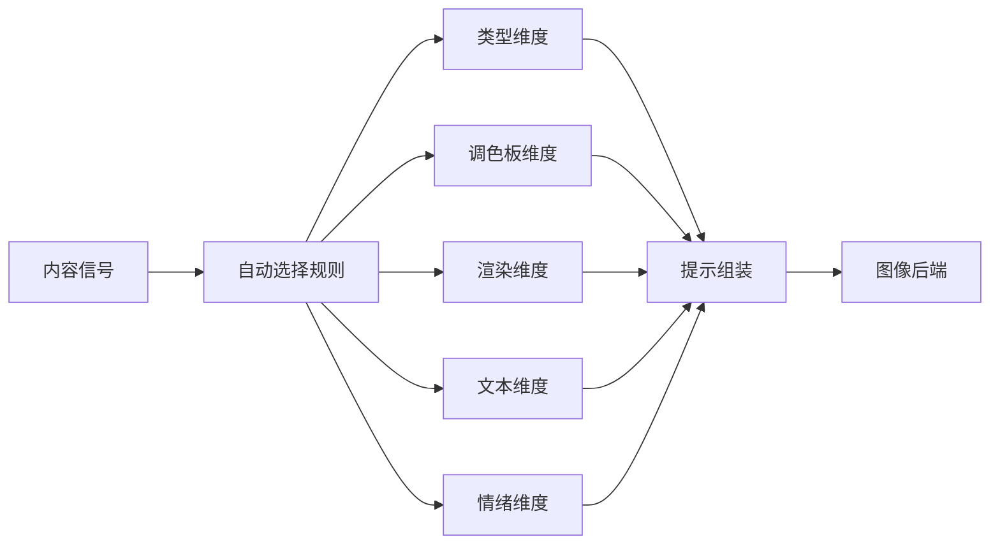

# 五维定制系统

<cite>
**本文引用的文件**
- [.agents/skills/baoyu-cover-image/SKILL.md](file://.agents/skills/baoyu-cover-image/SKILL.md)
- [.agents/skills/baoyu-cover-image/references/types.md](file://.agents/skills/baoyu-cover-image/references/types.md)
- [.agents/skills/baoyu-cover-image/references/dimensions/text.md](file://.agents/skills/baoyu-cover-image/references/dimensions/text.md)
- [.agents/skills/baoyu-cover-image/references/dimensions/mood.md](file://.agents/skills/baoyu-cover-image/references/dimensions/mood.md)
- [.agents/skills/baoyu-cover-image/references/auto-selection.md](file://.agents/skills/baoyu-cover-image/references/auto-selection.md)
- [.agents/skills/baoyu-cover-image/references/style-presets.md](file://.agents/skills/baoyu-cover-image/references/style-presets.md)
</cite>

## 目录
1. [简介](#简介)
2. [项目结构](#项目结构)
3. [核心组件](#核心组件)
4. [架构总览](#架构总览)
5. [详细组件分析](#详细组件分析)
6. [依赖分析](#依赖分析)
7. [性能考虑](#性能考虑)
8. [故障排除指南](#故障排除指南)
9. [结论](#结论)
10. [附录](#附录)

## 简介
本文件系统性阐述 baoyu-cover-image 技能的“五维定制系统”，即类型维度、调色板维度、渲染维度、文本维度与情绪维度。文档将明确各维度的可选值、默认值、自动选择规则、相互影响关系，并提供使用示例与最佳实践建议，帮助用户在不同内容场景下高效产出高质量封面图像。

## 项目结构
baoyu-cover-image 技能通过统一的技能描述文件与参考文档组织五维信息：
- 技能概览与选项：SKILL.md
- 维度详解与兼容性：types.md、dimensions/text.md、dimensions/mood.md
- 自动选择规则：auto-selection.md
- 预设组合与覆盖策略：style-presets.md

图表来源
- [.agents/skills/baoyu-cover-image/SKILL.md:1-273](file://.agents/skills/baoyu-cover-image/SKILL.md#L1-L273)
- [.agents/skills/baoyu-cover-image/references/types.md:1-24](file://.agents/skills/baoyu-cover-image/references/types.md#L1-L24)
- [.agents/skills/baoyu-cover-image/references/dimensions/text.md:1-131](file://.agents/skills/baoyu-cover-image/references/dimensions/text.md#L1-L131)
- [.agents/skills/baoyu-cover-image/references/dimensions/mood.md:1-142](file://.agents/skills/baoyu-cover-image/references/dimensions/mood.md#L1-L142)
- [.agents/skills/baoyu-cover-image/references/auto-selection.md:1-75](file://.agents/skills/baoyu-cover-image/references/auto-selection.md#L1-L75)
- [.agents/skills/baoyu-cover-image/references/style-presets.md:1-40](file://.agents/skills/baoyu-cover-image/references/style-presets.md#L1-L40)

章节来源
- [.agents/skills/baoyu-cover-image/SKILL.md:1-273](file://.agents/skills/baoyu-cover-image/SKILL.md#L1-L273)

## 核心组件
- 类型维度（Type）
  - 可选值：hero、conceptual、typography、metaphor、scene、minimal
  - 默认值：auto（由自动选择规则推断）
  - 作用：决定封面的主要视觉焦点与构图策略
- 调色板维度（Palette）
  - 可选值：warm、elegant、cool、dark、earth、vivid、pastel、mono、retro、duotone、macaron
  - 默认值：auto（由自动选择规则推断）
  - 作用：定义整体色彩基调与情感倾向
- 渲染维度（Rendering）
  - 可选值：flat-vector、hand-drawn、painterly、digital、pixel、chalk、screen-print
  - 默认值：auto（由自动选择规则推断）
  - 作用：控制画面质感与表现手法
- 文本维度（Text）
  - 可选值：none、title-only、title-subtitle、text-rich
  - 默认值：title-only
  - 作用：控制标题密度与信息层级
- 情绪维度（Mood）
  - 可选值：subtle、balanced、bold
  - 默认值：balanced
  - 作用：调节对比度、饱和度与视觉重量

章节来源
- [.agents/skills/baoyu-cover-image/SKILL.md:51-100](file://.agents/skills/baoyu-cover-image/SKILL.md#L51-L100)

## 架构总览
五维定制系统遵循“输入信号 → 自动选择 → 用户确认 → 提示构建 → 图像生成”的流程。当任一维度未显式指定时，系统依据内容信号自动推断；随后进入确认阶段，最终生成提示并驱动后端渲染。

图表来源
- [.agents/skills/baoyu-cover-image/SKILL.md:120-214](file://.agents/skills/baoyu-cover-image/SKILL.md#L120-L214)
- [.agents/skills/baoyu-cover-image/references/auto-selection.md:1-75](file://.agents/skills/baoyu-cover-image/references/auto-selection.md#L1-L75)

## 详细组件分析

### 类型维度（Type）
- 定义与适用场景
  - hero：强调大视觉冲击与标题叠加，适合产品发布、品牌推广等重大宣告
  - conceptual：抽象化表达核心理念，适合技术文章、方法论、架构设计
  - typography：以文字为主导的布局，适合观点类、名言、洞见
  - metaphor：具象表达抽象概念，适合哲学、成长、个人发展主题
  - scene：营造氛围场景，适合故事、旅行、生活方式
  - minimal：极简构图，强调留白与核心元素，适合禅意、聚焦、核心概念
- 默认值与自动选择
  - 默认值：auto
  - 自动选择依据内容信号，如产品发布、架构设计、个人故事、叙事类内容等
- 兼容性与推荐
  - 不同类型对文本密度与情绪强度的兼容性不同，详见类型-文本兼容矩阵与类型-情绪兼容矩阵

章节来源
- [.agents/skills/baoyu-cover-image/references/types.md:1-24](file://.agents/skills/baoyu-cover-image/references/types.md#L1-L24)
- [.agents/skills/baoyu-cover-image/references/auto-selection.md:5-15](file://.agents/skills/baoyu-cover-image/references/auto-selection.md#L5-L15)

### 调色板维度（Palette）
- 可选值与类别
  - warm、elegant、cool、dark、earth、vivid、pastel、mono、retro、duotone、macaron
- 默认值与自动选择
  - 默认值：auto
  - 自动选择依据内容信号，如商业专业、技术架构、娱乐游戏、自然生态等
- 与情绪维度的交互
  - 情绪子模块详细说明了不同情绪级别如何调整暖系、冷系、暗系、复古、双色等调色板的呈现特征（例如低对比、柔和色调 vs 高对比、鲜艳饱和）

章节来源
- [.agents/skills/baoyu-cover-image/references/auto-selection.md:16-31](file://.agents/skills/baoyu-cover-image/references/auto-selection.md#L16-L31)
- [.agents/skills/baoyu-cover-image/references/dimensions/mood.md:105-116](file://.agents/skills/baoyu-cover-image/references/dimensions/mood.md#L105-L116)

### 渲染维度（Rendering）
- 可选值与类别
  - flat-vector、hand-drawn、painterly、digital、pixel、chalk、screen-print
- 默认值与自动选择
  - 默认值：auto
  - 自动选择依据内容信号，如科技图标、手绘笔记、水彩创意、数据仪表盘、像素风、课堂教育、海报印刷等
- 与情绪维度的交互
  - 不同情绪级别会改变渲染细节：如线条粗细、填充密度、阴影明暗、像素颗粒度、粉笔厚度与色彩密度、胶版印刷的网点与套准效果等

章节来源
- [.agents/skills/baoyu-cover-image/references/auto-selection.md:32-43](file://.agents/skills/baoyu-cover-image/references/auto-selection.md#L32-L43)
- [.agents/skills/baoyu-cover-image/references/dimensions/mood.md:117-130](file://.agents/skills/baoyu-cover-image/references/dimensions/mood.md#L117-L130)

### 文本维度（Text）
- 可选值与信息密度
  - none：纯视觉，无文本元素
  - title-only：单标题，最大冲击
  - title-subtitle：标题+副标题
  - text-rich：信息密集，含2-4个标签
- 默认值与自动选择
  - 默认值：title-only
  - 自动选择依据内容形态：纯视觉摄影/抽象艺术选 none；标准文章选 title-only；系列教程/技术说明选 title-subtitle；公告/特性/多要点选 text-rich
- 类型兼容性
  - 不同类型对文本密度的兼容性不同，存在高度推荐、兼容与不推荐的矩阵

章节来源
- [.agents/skills/baoyu-cover-image/references/dimensions/text.md:1-131](file://.agents/skills/baoyu-cover-image/references/dimensions/text.md#L1-L131)
- [.agents/skills/baoyu-cover-image/references/auto-selection.md:44-53](file://.agents/skills/baoyu-cover-image/references/auto-selection.md#L44-L53)

### 情绪维度（Mood）
- 可选值与视觉特征
  - subtle：低对比、柔和饱和、轻量视觉重量、平静内敛
  - balanced：中等对比、自然饱和、平衡重量、清晰但不强势
  - bold：高对比、鲜艳饱和、厚重重量、动态张力
- 默认值与自动选择
  - 默认值：balanced
  - 自动选择依据内容语境：专业/企业/思想领袖/学术/奢华选 subtle；通用/教学/标准/博客/文档选 balanced；发布/公告/促销/活动/游戏/娱乐选 bold
- 与调色板、渲染的交互
  - 情绪子模块提供了情绪级别对调色板与渲染细节的具体调整规则，确保整体视觉一致性

章节来源
- [.agents/skills/baoyu-cover-image/references/dimensions/mood.md:1-142](file://.agents/skills/baoyu-cover-image/references/dimensions/mood.md#L1-L142)
- [.agents/skills/baoyu-cover-image/references/auto-selection.md:55-63](file://.agents/skills/baoyu-cover-image/references/auto-selection.md#L55-L63)

### 风格预设与覆盖策略
- 预设组合
  - --style X 展开为特定调色板+渲染组合，便于快速落地
  - 示例：elegant（elegant+hand-drawn）、blueprint（cool+digital）、minimal（mono+flat-vector）等
- 覆盖优先级
  - 显式 --palette 或 --rendering 会覆盖预设中的对应维度

章节来源
- [.agents/skills/baoyu-cover-image/references/style-presets.md:1-40](file://.agents/skills/baoyu-cover-image/references/style-presets.md#L1-L40)

## 依赖分析
五维定制系统内部存在以下关键依赖与耦合关系：
- 内容信号 → 自动选择 → 维度值
- 维度值 → 提示组装 → 后端渲染
- 情绪维度对调色板与渲染细节具有修饰作用
- 文本维度与类型维度存在兼容性矩阵约束

图表来源
- [.agents/skills/baoyu-cover-image/references/auto-selection.md:1-75](file://.agents/skills/baoyu-cover-image/references/auto-selection.md#L1-L75)
- [.agents/skills/baoyu-cover-image/SKILL.md:193-214](file://.agents/skills/baoyu-cover-image/SKILL.md#L193-L214)

章节来源
- [.agents/skills/baoyu-cover-image/references/auto-selection.md:1-75](file://.agents/skills/baoyu-cover-image/references/auto-selection.md#L1-L75)
- [.agents/skills/baoyu-cover-image/SKILL.md:193-214](file://.agents/skills/baoyu-cover-image/SKILL.md#L193-L214)

## 性能考虑
- 自动选择的准确性直接影响后续提示质量与生成成功率，建议在内容信号明确时尽量减少维度显式指定，以发挥自动选择优势
- 当使用风格预设时，若需微调，优先使用 --palette 或 --rendering 的覆盖策略，避免全量重选
- 在批量生成场景中，建议先进行一次确认并保存 EXTEND.md 中的偏好，减少重复交互成本

## 故障排除指南
- 确认步骤被跳过导致生成异常
  - 现象：未完成确认即开始生成
  - 处理：确保使用确认策略或明确 --quick 且理解其含义
- 自动选择与预期不符
  - 现象：类型/调色板/渲染/文本/情绪与内容语境不匹配
  - 处理：显式指定相关维度，或调整内容表述以提供更清晰的信号
- 情绪与调色板/渲染冲突
  - 现象：情绪子模块建议的调整与实际风格不协调
  - 处理：根据情绪子模块的交互规则手动微调调色板或渲染参数
- 文本密度与类型不兼容
  - 现象：text-rich 与某些类型不推荐
  - 处理：更换类型或降低文本密度至兼容级别

章节来源
- [.agents/skills/baoyu-cover-image/SKILL.md:42-50](file://.agents/skills/baoyu-cover-image/SKILL.md#L42-L50)
- [.agents/skills/baoyu-cover-image/references/dimensions/text.md:106-118](file://.agents/skills/baoyu-cover-image/references/dimensions/text.md#L106-L118)
- [.agents/skills/baoyu-cover-image/references/dimensions/mood.md:92-116](file://.agents/skills/baoyu-cover-image/references/dimensions/mood.md#L92-L116)

## 结论
五维定制系统通过类型、调色板、渲染、文本与情绪五大维度的协同，结合自动选择与交互确认机制，能够在不同内容场景下稳定产出高质量封面图像。建议用户在熟悉各维度默认值与自动规则的基础上，针对关键场景进行显式覆盖，以获得更符合预期的视觉效果。

## 附录

### 使用示例与最佳实践
- 快速生成
  - 使用 --quick 或设置 quick_mode: true，跳过确认，依赖自动选择
- 场景化示例
  - 产品发布：优先选择 hero 类型 + bold 情绪 + vivid/duotone 调色板 + digital/flat-vector 渲染 + title-only 文本
  - 技术教程：选择 conceptual 类型 + balanced 情绪 + cool 调色板 + digital 渲染 + title-subtitle 文本
  - 哲学随笔：选择 metaphor 类型 + subtle 情绪 + elegant/earth 调色板 + painterly 渲染 + title-only 文本
  - 教育课程：选择 typography/scene 类型 + balanced 情绪 + macaron/mono 调色板 + hand-drawn 渲染 + text-rich 文本
- 最佳实践
  - 明确内容信号：在输入中提供足够上下文，提升自动选择准确率
  - 控制文本密度：遵循类型-文本兼容矩阵，避免过度拥挤
  - 协调情绪与风格：利用情绪子模块的调色板/渲染调整规则，保持整体一致
  - 使用风格预设：以 --style X 快速落地，再进行局部覆盖

章节来源
- [.agents/skills/baoyu-cover-image/references/auto-selection.md:1-75](file://.agents/skills/baoyu-cover-image/references/auto-selection.md#L1-L75)
- [.agents/skills/baoyu-cover-image/references/style-presets.md:1-40](file://.agents/skills/baoyu-cover-image/references/style-presets.md#L1-L40)
- [.agents/skills/baoyu-cover-image/references/dimensions/text.md:106-131](file://.agents/skills/baoyu-cover-image/references/dimensions/text.md#L106-L131)
- [.agents/skills/baoyu-cover-image/references/dimensions/mood.md:92-142](file://.agents/skills/baoyu-cover-image/references/dimensions/mood.md#L92-L142)