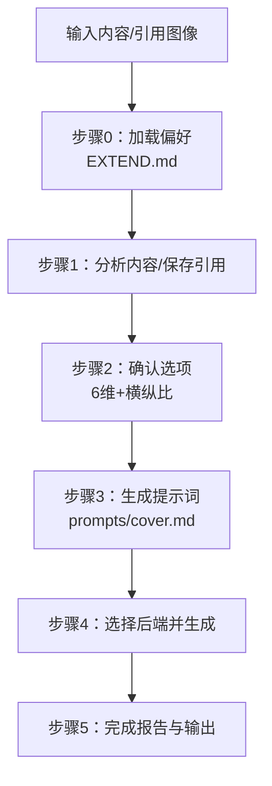
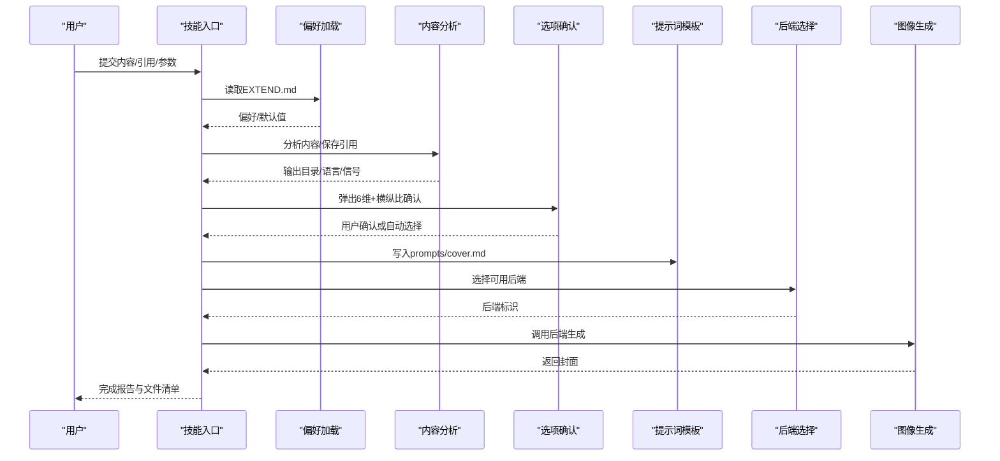
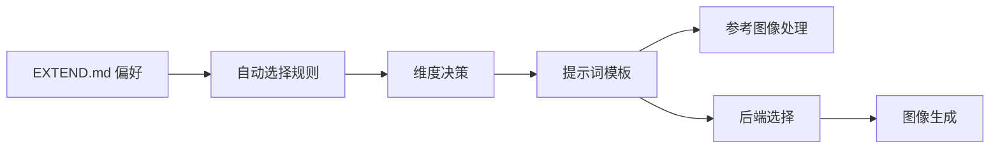

# 使用示例与最佳实践

<cite>
**本文引用的文件**
- [SKILL.md](file://.agents/skills/baoyu-cover-image/SKILL.md)
- [style-presets.md](file://.agents/skills/baoyu-cover-image/references/style-presets.md)
- [auto-selection.md](file://.agents/skills/baoyu-cover-image/references/auto-selection.md)
- [base-prompt.md](file://.agents/skills/baoyu-cover-image/references/base-prompt.md)
- [types.md](file://.agents/skills/baoyu-cover-image/references/types.md)
- [text.md](file://.agents/skills/baoyu-cover-image/references/dimensions/text.md)
- [mood.md](file://.agents/skills/baoyu-cover-image/references/dimensions/mood.md)
- [font.md](file://.agents/skills/baoyu-cover-image/references/dimensions/font.md)
- [confirm-options.md](file://.agents/skills/baoyu-cover-image/references/workflow/confirm-options.md)
- [prompt-template.md](file://.agents/skills/baoyu-cover-image/references/workflow/prompt-template.md)
- [first-time-setup.md](file://.agents/skills/baoyu-cover-image/references/config/first-time-setup.md)
- [preferences-schema.md](file://.agents/skills/baoyu-cover-image/references/config/preferences-schema.md)
- [visual-elements.md](file://.agents/skills/baoyu-cover-image/references/visual-elements.md)
- [warm.md](file://.agents/skills/baoyu-cover-image/references/palettes/warm.md)
- [hand-drawn.md](file://.agents/skills/baoyu-cover-image/references/renderings/hand-drawn.md)
</cite>

## 目录
1. [简介](#简介)
2. [项目结构](#项目结构)
3. [核心组件](#核心组件)
4. [架构总览](#架构总览)
5. [详细组件分析](#详细组件分析)
6. [依赖关系分析](#依赖关系分析)
7. [性能考虑](#性能考虑)
8. [故障排查指南](#故障排查指南)
9. [结论](#结论)
10. [附录](#附录)

## 简介
本文件面向“baoyu-cover-image”技能的使用者与集成者，提供从入门到进阶的系统化使用示例与最佳实践。内容覆盖：
- 面向不同内容类型的封面生成策略与推荐配置
- 风格预设的使用方法与组合技巧
- 自动选择机制的工作原理与优化建议
- 常见问题解决方案与性能优化技巧
- 与其他AI技能的协同使用与工作流整合建议
- 实际项目中的应用案例与经验总结

## 项目结构
该技能围绕“五维定制”（类型、调色板、渲染风格、文本密度、情绪强度）与“多维度自动选择”构建，配套有：
- 配置与首选项：首次运行引导、偏好存储与迁移
- 维度说明：文本密度、情绪强度、字体风格
- 风格预设：快速组合调色板与渲染风格
- 工作流：选项确认、提示词模板、参考图像处理
- 视觉元素库：主题图标与组合模式

图表来源
- [.agents/skills/baoyu-cover-image/SKILL.md:145-170](file://.agents/skills/baoyu-cover-image/SKILL.md#L145-L170)
- [.agents/skills/baoyu-cover-image/references/workflow/confirm-options.md:1-153](file://.agents/skills/baoyu-cover-image/references/workflow/confirm-options.md#L1-L153)
- [.agents/skills/baoyu-cover-image/references/workflow/prompt-template.md:1-255](file://.agents/skills/baoyu-cover-image/references/workflow/prompt-template.md#L1-L255)

章节来源
- [.agents/skills/baoyu-cover-image/SKILL.md:101-143](file://.agents/skills/baoyu-cover-image/SKILL.md#L101-L143)

## 核心组件
- 五维定制
  - 类型：hero、conceptual、typography、metaphor、scene、minimal
  - 调色板：warm、elegant、cool、dark、earth、vivid、pastel、mono、retro、duotone、macaron
  - 渲染风格：flat-vector、hand-drawn、painterly、digital、pixel、chalk、screen-print
  - 文本密度：none、title-only、title-subtitle、text-rich
  - 情绪强度：subtle、balanced、bold
  - 字体风格：clean、handwritten、serif、display
- 自动选择规则：基于内容信号自动推断类型、调色板、渲染风格、文本密度、情绪强度、字体风格
- 风格预设：通过--style快速组合调色板与渲染风格，并可进一步覆盖
- 提示词模板：统一结构化输出，支持引用图像元数据与强制性整合指令
- 参考图像处理：支持直接传递与风格/色调提取两种方式，强调“必须在提示词中明确描述”

章节来源
- [.agents/skills/baoyu-cover-image/SKILL.md:51-100](file://.agents/skills/baoyu-cover-image/SKILL.md#L51-L100)
- [.agents/skills/baoyu-cover-image/references/auto-selection.md:1-75](file://.agents/skills/baoyu-cover-image/references/auto-selection.md#L1-L75)
- [.agents/skills/baoyu-cover-image/references/style-presets.md:1-40](file://.agents/skills/baoyu-cover-image/references/style-presets.md#L1-L40)
- [.agents/skills/baoyu-cover-image/references/workflow/prompt-template.md:1-255](file://.agents/skills/baoyu-cover-image/references/workflow/prompt-template.md#L1-L255)

## 架构总览
下图展示了从输入到输出的关键交互路径，包括偏好加载、内容分析、选项确认、提示词生成、后端选择与图像生成。

图表来源
- [.agents/skills/baoyu-cover-image/SKILL.md:24-50](file://.agents/skills/baoyu-cover-image/SKILL.md#L24-L50)
- [.agents/skills/baoyu-cover-image/references/workflow/confirm-options.md:1-153](file://.agents/skills/baoyu-cover-image/references/workflow/confirm-options.md#L1-L153)
- [.agents/skills/baoyu-cover-image/references/workflow/prompt-template.md:1-255](file://.agents/skills/baoyu-cover-image/references/workflow/prompt-template.md#L1-L255)

## 详细组件分析

### 维度详解与组合建议
- 类型（Type）
  - hero：适合产品发布、品牌推广；强调大视觉焦点与标题叠加
  - conceptual：适合技术架构、方法论；强调抽象形状与信息层级
  - typography：适合观点类、引言类；标题为主，视觉最少
  - metaphor：适合哲学、成长类；以具象物表达抽象概念
  - scene：适合故事、旅行、生活方式；强调氛围与叙事
  - minimal：适合禅意、聚焦类；留白充足，单一焦点
- 文本密度（Text）
  - none：纯视觉，适合摄影/抽象
  - title-only：默认，适合大多数文章
  - title-subtitle：适合系列/教程/需要补充说明
  - text-rich：适合公告/功能列表/信息密集
- 情绪强度（Mood）
  - subtle：低对比、柔和色调，适合专业/学术/奢侈品
  - balanced：中性对比，通用场景
  - bold：高对比、鲜艳色调，适合发布/活动/娱乐
- 字体风格（Font）
  - clean：几何无衬线，现代、清晰
  - handwritten：手写笔触，亲和、友好
  - serif：经典衬线，权威、优雅
  - display：装饰性粗体，醒目、戏剧化
- 调色板（Palette）
  - warm：友好、人情味，适合个人成长、生活分享
  - elegant：精致、内敛，适合商业/思想领袖
  - cool：理性、科技感，适合技术/工程
  - dark：暗黑、高级，适合娱乐/电影风
  - earth：自然、有机，适合健康/旅行
  - vivid：活力、促销，适合游戏/新品
  - pastel：柔和、童趣，适合教育/创意
  - mono：极简、专注，适合专注/核心理念
  - retro：复古、怀旧，适合复古主题
  - duotone：双色对比，适合海报/专辑
  - macaron：马卡龙色系，适合知识/概念解释
- 渲染风格（Rendering）
  - flat-vector：简洁线条、平面填充，适合信息图/扁平设计
  - hand-drawn：手绘质感、自然笔触，适合笔记/创意
  - painterly：水彩/软边，适合艺术/梦幻
  - digital：精细数字绘制，适合UI/仪表盘
  - pixel：像素风格，适合复古/游戏
  - chalk：粉笔纹理，适合课堂/教学
  - screen-print：胶版印刷，适合海报/限量版

章节来源
- [.agents/skills/baoyu-cover-image/references/types.md:1-24](file://.agents/skills/baoyu-cover-image/references/types.md#L1-L24)
- [.agents/skills/baoyu-cover-image/references/dimensions/text.md:1-131](file://.agents/skills/baoyu-cover-image/references/dimensions/text.md#L1-L131)
- [.agents/skills/baoyu-cover-image/references/dimensions/mood.md:1-142](file://.agents/skills/baoyu-cover-image/references/dimensions/mood.md#L1-L142)
- [.agents/skills/baoyu-cover-image/references/dimensions/font.md:1-165](file://.agents/skills/baoyu-cover-image/references/dimensions/font.md#L1-L165)
- [.agents/skills/baoyu-cover-image/references/palettes/warm.md:1-31](file://.agents/skills/baoyu-cover-image/references/palettes/warm.md#L1-L31)
- [.agents/skills/baoyu-cover-image/references/renderings/hand-drawn.md:1-41](file://.agents/skills/baoyu-cover-image/references/renderings/hand-drawn.md#L1-L41)

### 自动选择机制与优化建议
- 自动选择依据内容信号，覆盖类型、调色板、渲染风格、文本密度、情绪强度、字体风格
- 优化建议
  - 在输入中提供更明确的主题词、语气、受众，提升信号质量
  - 对于人物出现的封面，优先使用--ref并配合详细角色描述
  - 使用--style快速锁定调色板+渲染组合，再微调其他维度
  - 利用EXTEND.md设置常用偏好，减少每次确认成本
  - 快速模式仅用于已稳定的工作流，日常建议保留确认环节

章节来源
- [.agents/skills/baoyu-cover-image/references/auto-selection.md:1-75](file://.agents/skills/baoyu-cover-image/references/auto-selection.md#L1-L75)
- [.agents/skills/baoyu-cover-image/references/workflow/confirm-options.md:1-153](file://.agents/skills/baoyu-cover-image/references/workflow/confirm-options.md#L1-L153)

### 风格预设与组合技巧
- 预设映射：--style X 展开为特定调色板+渲染组合，可被--palette/--rendering覆盖
- 组合技巧
  - blueprint：科技感强，适合技术/架构类
  - elegant：手绘风格，适合知识/创意类
  - watercolor：柔和梦幻，适合人文/成长类
  - minimal：极简扁平，适合专注/核心理念
  - pixel-art：复古游戏风，适合娱乐/活动
  - vintage：复古手绘，适合怀旧主题
  - poster-art/mondo/art-deco：海报风格，适合宣传/限量
  - cinematic：双色对比，适合电影/专辑
- 覆盖策略：先--style，再--palette/--rendering进行局部修正，确保最终效果可控

章节来源
- [.agents/skills/baoyu-cover-image/references/style-presets.md:1-40](file://.agents/skills/baoyu-cover-image/references/style-presets.md#L1-L40)

### 提示词模板与参考图像处理
- 结构化字段：类型、调色板、渲染、字体、文本密度、情绪强度、横纵比、语言、内容上下文、视觉主题、文字元素、色彩方案、渲染要点、水印（可选）、参考图像（可选）
- 参考图像处理
  - 若保存到refs/，需在frontmatter列出；若模型支持--ref则直接传递
  - 无论是否传递--ref，都必须在提示词正文写出“必须/必需”的具体整合指令
  - 人物参考需明确外观、风格化要求与布局位置
- 水印：如启用，按偏好位置与透明度添加

章节来源
- [.agents/skills/baoyu-cover-image/references/workflow/prompt-template.md:1-255](file://.agents/skills/baoyu-cover-image/references/workflow/prompt-template.md#L1-L255)

### 选项确认流程
- 一次性弹出最多4个问题，涵盖类型、调色板、渲染、字体
- 其他设置（输出目录、文本密度、情绪强度、横纵比）合并为一个设置问题
- 快速模式与--quick/--style/--aspect指定会跳过相应问题
- 语言由用户输入语言>偏好>源内容自动决定

章节来源
- [.agents/skills/baoyu-cover-image/references/workflow/confirm-options.md:1-153](file://.agents/skills/baoyu-cover-image/references/workflow/confirm-options.md#L1-L153)

### 基础提示词与创作原则
- 图像规格：封面/主图，按指定横纵比
- 核心原则：留白充足、主视觉居中或略偏左、简化人物轮廓、使用图标化词汇
- 五维说明：类型、调色板、渲染、文本密度、情绪强度
- 文字风格：忠实原文标题，匹配渲染风格
- 布局指导：留白40-60%、视觉锚点居中或偏左、信息层级清晰、背景简洁
- 字符处理：默认使用简化剪影；含人物时需风格化并保留特征
- 情绪应用：subtle/bold对对比度、饱和度、笔触重量的影响
- 语言：与内容一致，标点风格匹配

章节来源
- [.agents/skills/baoyu-cover-image/references/base-prompt.md:1-125](file://.agents/skills/baoyu-cover-image/references/base-prompt.md#L1-L125)

### 视觉元素库与图标组合
- 按主题分类的图标词汇：技术开发、想法创新、沟通协作、自然成长、工具动作、抽象概念
- 组合模式：通过元素组合表达复合含义（如灯泡+齿轮=创新工程）
- 渲染适配：不同渲染风格对元素呈现方式有差异（扁平矢量几何、手绘草率、水彩柔和等）

章节来源
- [.agents/skills/baoyu-cover-image/references/visual-elements.md:1-102](file://.agents/skills/baoyu-cover-image/references/visual-elements.md#L1-L102)

### 不同内容类型的封面示例与推荐配置
- 科技文章
  - 推荐：conceptual 或 hero；cool 或 elegant；digital 或 flat-vector；title-only 或 title-subtitle；balanced 或 bold
  - 示例思路：抽象概念可视化、技术符号组合、科技蓝/灰配色、信息层级清晰
- 生活分享
  - 推荐：scene 或 typography；warm；hand-drawn 或 watercolor；title-only；balanced 或 subtle
  - 示例思路：氛围场景、手写字体、柔和色彩、情感共鸣
- 学术论文
  - 推荐：conceptual；elegant 或 cool；digital；title-only；subtle
  - 示例思路：严谨信息图、经典衬线字体、低对比配色、权威感
- 创意作品
  - 推荐：metaphor 或 minimal；pastel 或 warm；painterly 或 hand-drawn；title-only；balanced 或 bold
  - 示例思路：象征性物体、极简构图、柔和或高饱和色彩、创意表达
- 海报/活动
  - 推荐：hero；duotone 或 retro；screen-print；text-rich；bold
  - 示例思路：强烈对比、装饰性字体、标签化关键词、视觉冲击力

章节来源
- [.agents/skills/baoyu-cover-image/references/types.md:1-24](file://.agents/skills/baoyu-cover-image/references/types.md#L1-L24)
- [.agents/skills/baoyu-cover-image/references/dimensions/text.md:1-131](file://.agents/skills/baoyu-cover-image/references/dimensions/text.md#L1-L131)
- [.agents/skills/baoyu-cover-image/references/dimensions/mood.md:1-142](file://.agents/skills/baoyu-cover-image/references/dimensions/mood.md#L1-L142)
- [.agents/skills/baoyu-cover-image/references/dimensions/font.md:1-165](file://.agents/skills/baoyu-cover-image/references/dimensions/font.md#L1-L165)
- [.agents/skills/baoyu-cover-image/references/palettes/warm.md:1-31](file://.agents/skills/baoyu-cover-image/references/palettes/warm.md#L1-L31)
- [.agents/skills/baoyu-cover-image/references/renderings/hand-drawn.md:1-41](file://.agents/skills/baoyu-cover-image/references/renderings/hand-drawn.md#L1-L41)

### 与其他AI技能的协同与工作流整合
- 与“baoyu-imagine”协同：作为非原生后端时，可在EXTEND.md中固定preferred_image_backend，或在运行时选择
- 与“baoyu-article-illustrator”协同：前者负责文章插画，后者负责封面，二者共享视觉元素库与风格语义
- 与“baoyu-format-markdown”协同：统一标题格式与术语，提升自动选择信号质量
- 与“baoyu-post-to-wechat”协同：封面生成后可直接复用，注意横纵比与平台适配
- 工作流建议
  - 输入阶段：先做内容清洗与标题标准化
  - 设计阶段：先--style快速定位，再微调维度
  - 生成阶段：保存prompts/cover.md后再调用后端
  - 复查阶段：检查水印、标题语言、引用整合是否到位

章节来源
- [.agents/skills/baoyu-cover-image/SKILL.md:24-50](file://.agents/skills/baoyu-cover-image/SKILL.md#L24-L50)
- [.agents/skills/baoyu-cover-image/references/config/preferences-schema.md:1-267](file://.agents/skills/baoyu-cover-image/references/config/preferences-schema.md#L1-L267)

## 依赖关系分析
- 偏好依赖：EXTEND.md决定默认行为（类型、调色板、渲染、文本、情绪、横纵比、输出目录、快速模式、语言、后端偏好）
- 自动选择依赖：内容信号（主题词、语气、受众、是否含人物）驱动各维度自动决策
- 提示词依赖：frontmatter引用与正文强制整合指令共同决定生成结果
- 后端依赖：优先级为运行时原生工具 > 固定后端 > 多后端时询问

图表来源
- [.agents/skills/baoyu-cover-image/references/auto-selection.md:1-75](file://.agents/skills/baoyu-cover-image/references/auto-selection.md#L1-L75)
- [.agents/skills/baoyu-cover-image/references/workflow/prompt-template.md:1-255](file://.agents/skills/baoyu-cover-image/references/workflow/prompt-template.md#L1-L255)
- [.agents/skills/baoyu-cover-image/SKILL.md:24-50](file://.agents/skills/baoyu-cover-image/SKILL.md#L24-L50)

章节来源
- [.agents/skills/baoyu-cover-image/references/config/preferences-schema.md:1-267](file://.agents/skills/baoyu-cover-image/references/config/preferences-schema.md#L1-L267)

## 性能考虑
- 减少重复生成：先更新prompts/cover.md再调用后端，避免无效请求
- 控制提示词长度：在满足“必须/必需”整合的前提下，尽量精炼描述
- 合理使用--ref：仅在必要时传递，避免过多引用导致模型负担
- 后端选择：优先使用运行时原生工具，减少跨后端切换成本
- 批量任务：将多个封面生成纳入同一会话，统一后端选择与输出目录

## 故障排查指南
- 未找到EXTEND.md
  - 现象：阻塞式首次设置
  - 处理：按引导完成偏好设置，保存EXTEND.md后再继续
- 生成失败重试
  - 现象：后端不可用或超时
  - 处理：自动重试一次；若仍失败，检查后端可用性与网络状态
- 引用图像未生效
  - 现象：封面未体现参考风格
  - 处理：确认frontmatter引用存在且文件存在；在提示词正文中追加“必须/必需”的整合指令
- 标题不匹配或语言错误
  - 现象：标题被篡改或语言不符
  - 处理：严格使用原文标题；检查语言偏好与内容语言一致性
- 输出目录混乱
  - 现象：封面散落各处
  - 处理：在EXTEND.md中设置default_output_dir；或在确认阶段选择合适目录

章节来源
- [.agents/skills/baoyu-cover-image/SKILL.md:145-170](file://.agents/skills/baoyu-cover-image/SKILL.md#L145-L170)
- [.agents/skills/baoyu-cover-image/references/workflow/prompt-template.md:131-176](file://.agents/skills/baoyu-cover-image/references/workflow/prompt-template.md#L131-L176)
- [.agents/skills/baoyu-cover-image/references/config/first-time-setup.md:1-203](file://.agents/skills/baoyu-cover-image/references/config/first-time-setup.md#L1-L203)

## 结论
baoyu-cover-image通过“五维定制+自动选择+结构化提示词+参考图像强制整合”的设计，在保证一致性的同时提供了强大的可塑性。结合风格预设与维度组合技巧，可快速适配多种内容类型；通过EXTEND.md固化偏好与工作流，可显著提升效率。建议在团队内建立统一的视觉规范与术语标准，持续优化自动选择信号，实现高质量、高效率的封面批量生产。

## 附录
- 首次运行与偏好设置
  - 通过一次性问答完成水印、默认类型、调色板、渲染、横纵比、输出目录、快速模式、保存位置等设置
  - 偏好文件EXTEND.md支持版本迁移与自定义调色板
- 常用命令与参数
  - --type/--palette/--rendering/--style/--text/--mood/--font/--aspect/--lang/--no-title/--quick/--ref
- 输出目录约定
  - same-dir：与文章同目录
  - imgs-subdir：文章目录下的imgs子目录
  - independent：独立的cover-image/{topic-slug}/

章节来源
- [.agents/skills/baoyu-cover-image/references/config/first-time-setup.md:1-203](file://.agents/skills/baoyu-cover-image/references/config/first-time-setup.md#L1-L203)
- [.agents/skills/baoyu-cover-image/references/config/preferences-schema.md:1-267](file://.agents/skills/baoyu-cover-image/references/config/preferences-schema.md#L1-L267)
- [.agents/skills/baoyu-cover-image/SKILL.md:101-120](file://.agents/skills/baoyu-cover-image/SKILL.md#L101-L120)