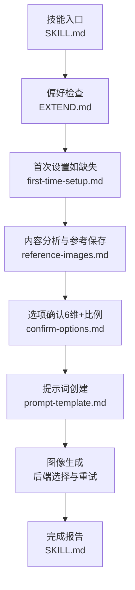
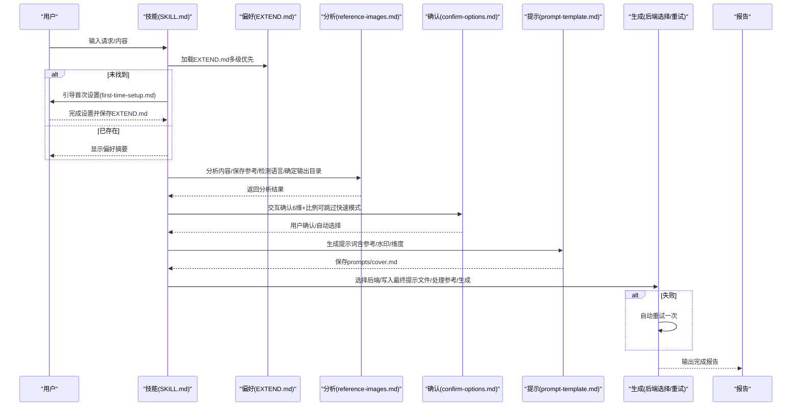
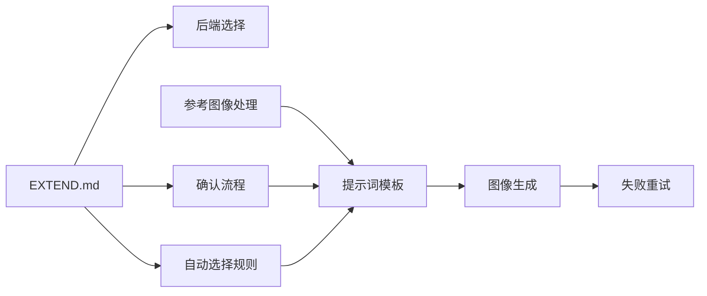
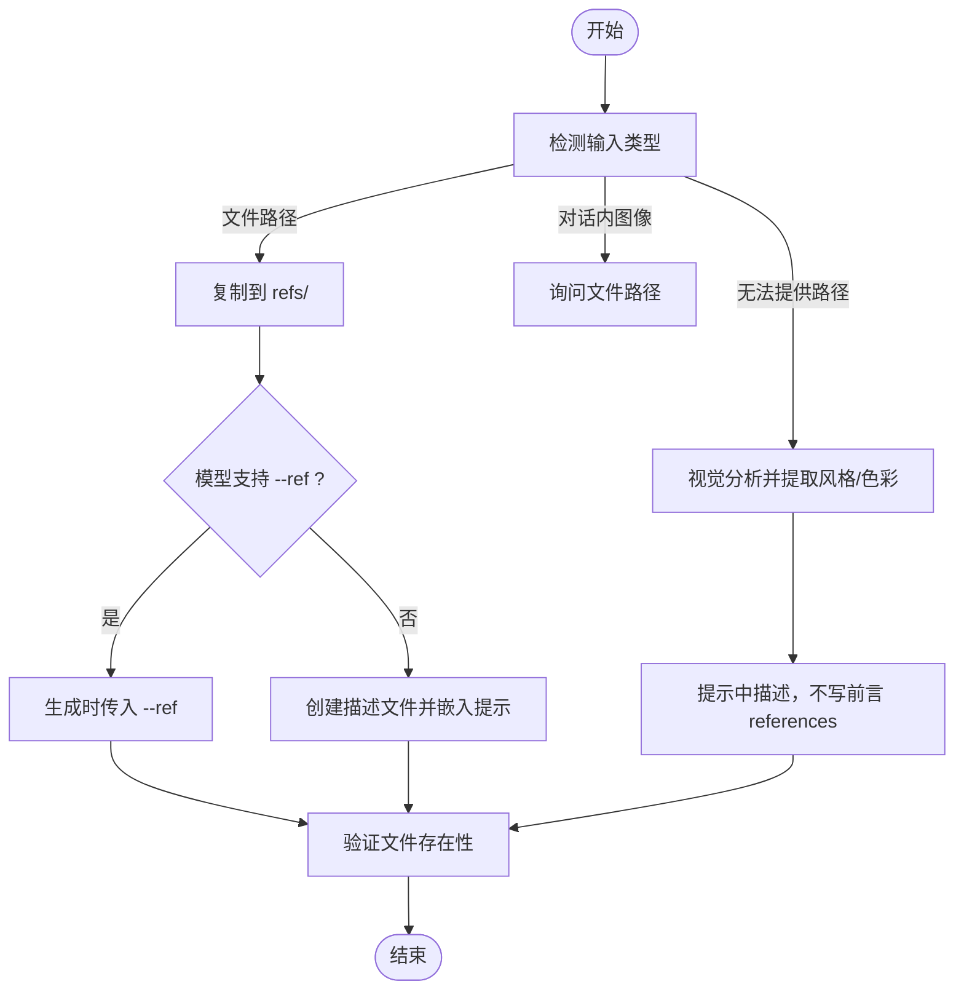

# 工作流程与配置

<cite>
**本文引用的文件**
- [SKILL.md](file://.agents/skills/baoyu-cover-image/SKILL.md)
- [first-time-setup.md](file://.agents/skills/baoyu-cover-image/references/config/first-time-setup.md)
- [preferences-schema.md](file://.agents/skills/baoyu-cover-image/references/config/preferences-schema.md)
- [watermark-guide.md](file://.agents/skills/baoyu-cover-image/references/config/watermark-guide.md)
- [confirm-options.md](file://.agents/skills/baoyu-cover-image/references/workflow/confirm-options.md)
- [prompt-template.md](file://.agents/skills/baoyu-cover-image/references/workflow/prompt-template.md)
- [reference-images.md](file://.agents/skills/baoyu-cover-image/references/workflow/reference-images.md)
- [auto-selection.md](file://.agents/skills/baoyu-cover-image/references/auto-selection.md)
- [compatibility.md](file://.agents/skills/baoyu-cover-image/references/compatibility.md)
- [visual-elements.md](file://.agents/skills/baoyu-cover-image/references/visual-elements.md)
- [types.md](file://.agents/skills/baoyu-cover-image/references/types.md)
- [text.md](file://.agents/skills/baoyu-cover-image/references/dimensions/text.md)
- [mood.md](file://.agents/skills/baoyu-cover-image/references/dimensions/mood.md)
- [font.md](file://.agents/skills/baoyu-cover-image/references/dimensions/font.md)
- [base-prompt.md](file://.agents/skills/baoyu-cover-image/references/base-prompt.md)
</cite>

## 目录
1. [简介](#简介)
2. [项目结构](#项目结构)
3. [核心组件](#核心组件)
4. [架构总览](#架构总览)
5. [详细组件分析](#详细组件分析)
6. [依赖关系分析](#依赖关系分析)
7. [性能考量](#性能考量)
8. [故障排查指南](#故障排查指南)
9. [结论](#结论)
10. [附录](#附录)

## 简介
本文件面向 baoyu-cover-image 技能的使用者与维护者，系统化阐述“封面图像生成”的完整工作流程与配置方法。文档覆盖从偏好设置检查到最终报告输出的五个步骤，并深入解析 EXTEND.md 配置项、自动选择规则、选项确认流程、提示词构建、图像生成与回滚机制，以及风格与维度的兼容性矩阵与最佳实践。

## 项目结构
baoyu-cover-image 技能位于 .agents/skills/baoyu-cover-image 目录下，核心由以下部分组成：
- 技能说明与工作流：SKILL.md
- 首次设置与偏好配置：references/config 下的 first-time-setup.md、preferences-schema.md、watermark-guide.md
- 工作流参考：references/workflow 下的 confirm-options.md、prompt-template.md、reference-images.md
- 维度与类型：references/dimensions 下的 text.md、mood.md、font.md；references/types.md
- 兼容性与视觉元素：references/compatibility.md、references/visual-elements.md
- 基础提示词模板：references/base-prompt.md

图表来源
- [.agents/skills/baoyu-cover-image/SKILL.md:120-143](file://.agents/skills/baoyu-cover-image/SKILL.md#L120-L143)
- [.agents/skills/baoyu-cover-image/references/config/first-time-setup.md:20-38](file://.agents/skills/baoyu-cover-image/references/config/first-time-setup.md#L20-L38)
- [.agents/skills/baoyu-cover-image/references/workflow/reference-images.md:1-107](file://.agents/skills/baoyu-cover-image/references/workflow/reference-images.md#L1-L107)
- [.agents/skills/baoyu-cover-image/references/workflow/confirm-options.md:1-153](file://.agents/skills/baoyu-cover-image/references/workflow/confirm-options.md#L1-L153)
- [.agents/skills/baoyu-cover-image/references/workflow/prompt-template.md:1-255](file://.agents/skills/baoyu-cover-image/references/workflow/prompt-template.md#L1-L255)

章节来源
- [.agents/skills/baoyu-cover-image/SKILL.md:101-116](file://.agents/skills/baoyu-cover-image/SKILL.md#L101-L116)

## 核心组件
- 偏好配置 EXTEND.md：定义水印、默认类型/调色板/渲染风格、文本密度、情绪强度、默认比例、输出目录、快速模式、语言、图像后端偏好、自定义调色板等。
- 自动选择规则：基于内容信号自动推断类型、调色板、渲染风格、文本密度、情绪强度、字体。
- 选项确认：通过交互式问题收集或确认6维参数与比例，支持快速模式跳过。
- 提示词模板：统一的提示词结构，包含内容上下文、设计维度、文字元素、构图与参考图像整合。
- 参考图像处理：保存/提取风格与色彩，决定是否在生成时传入参考图像或仅在提示中描述。
- 图像生成与回滚：后端选择策略、失败自动重试一次、覆盖旧图前备份。

章节来源
- [.agents/skills/baoyu-cover-image/references/config/preferences-schema.md:10-47](file://.agents/skills/baoyu-cover-image/references/config/preferences-schema.md#L10-L47)
- [.agents/skills/baoyu-cover-image/references/auto-selection.md:1-75](file://.agents/skills/baoyu-cover-image/references/auto-selection.md#L1-L75)
- [.agents/skills/baoyu-cover-image/references/workflow/confirm-options.md:1-153](file://.agents/skills/baoyu-cover-image/references/workflow/confirm-options.md#L1-L153)
- [.agents/skills/baoyu-cover-image/references/workflow/prompt-template.md:1-255](file://.agents/skills/baoyu-cover-image/references/workflow/prompt-template.md#L1-L255)
- [.agents/skills/baoyu-cover-image/references/workflow/reference-images.md:1-107](file://.agents/skills/baoyu-cover-image/references/workflow/reference-images.md#L1-L107)
- [.agents/skills/baoyu-cover-image/SKILL.md:204-214](file://.agents/skills/baoyu-cover-image/SKILL.md#L204-L214)

## 架构总览
下图展示 baoyu-cover-image 的端到端流程与关键决策点，包括偏好加载、内容分析、选项确认、提示词生成、图像生成与回滚。

图表来源
- [.agents/skills/baoyu-cover-image/SKILL.md:145-143](file://.agents/skills/baoyu-cover-image/SKILL.md#L145-L143)
- [.agents/skills/baoyu-cover-image/references/config/first-time-setup.md:20-38](file://.agents/skills/baoyu-cover-image/references/config/first-time-setup.md#L20-L38)
- [.agents/skills/baoyu-cover-image/references/workflow/reference-images.md:1-107](file://.agents/skills/baoyu-cover-image/references/workflow/reference-images.md#L1-L107)
- [.agents/skills/baoyu-cover-image/references/workflow/confirm-options.md:1-153](file://.agents/skills/baoyu-cover-image/references/workflow/confirm-options.md#L1-L153)
- [.agents/skills/baoyu-cover-image/references/workflow/prompt-template.md:1-255](file://.agents/skills/baoyu-cover-image/references/workflow/prompt-template.md#L1-L255)
- [.agents/skills/baoyu-cover-image/SKILL.md:204-214](file://.agents/skills/baoyu-cover-image/SKILL.md#L204-L214)

## 详细组件分析

### 步骤0：偏好设置检查（EXTEND.md）
- 优先级路径：项目级、XDG 用户级、用户主目录级，首个命中即使用。
- 首次运行若未找到 EXTEND.md，则强制执行首次设置流程，一次性收集水印、默认类型/调色板/渲染、默认比例、输出目录、快速模式、保存位置等。
- 偏好项涵盖：水印开关/内容/位置、默认类型/调色板/渲染、默认文本/情绪/语言、默认输出目录、快速模式、图像后端偏好、自定义调色板、版本号。

章节来源
- [.agents/skills/baoyu-cover-image/SKILL.md:145-159](file://.agents/skills/baoyu-cover-image/SKILL.md#L145-L159)
- [.agents/skills/baoyu-cover-image/references/config/first-time-setup.md:20-38](file://.agents/skills/baoyu-cover-image/references/config/first-time-setup.md#L20-L38)
- [.agents/skills/baoyu-cover-image/references/config/preferences-schema.md:10-47](file://.agents/skills/baoyu-cover-image/references/config/preferences-schema.md#L10-L47)

### 步骤1：内容分析与参考保存
- 保存参考图像（若提供）、保存源内容、分析主题/语调/关键词/视觉隐喻。
- 深度分析参考图像：品牌元素、标志性图案、色彩、版式、字体、内容主体、人物特征等。
- 语言检测：比较源内容、用户输入与偏好，确定输出语言。
- 输出目录：依据偏好与输入路径，选择独立目录、同目录或 imgs 子目录。

章节来源
- [.agents/skills/baoyu-cover-image/SKILL.md:162-169](file://.agents/skills/baoyu-cover-image/SKILL.md#L162-L169)
- [.agents/skills/baoyu-cover-image/references/workflow/reference-images.md:1-107](file://.agents/skills/baoyu-cover-image/references/workflow/reference-images.md#L1-L107)

### 步骤2：选项确认（6维 + 比例）
- 确认顺序：类型、调色板、渲染风格、字体 + 设置（输出目录、文本密度、情绪、比例）。
- 跳过条件：显式 --quick 或 quick_mode:true 时跳过6维，仍会询问比例（除非已指定 --aspect）。
- 快速模式输出：展示自动推荐的6维及其理由，随后询问比例。
- 交互策略：单次 AskUserQuestion 最多4个问题；其余维度以“其他”自定义组合形式输入。

章节来源
- [.agents/skills/baoyu-cover-image/references/workflow/confirm-options.md:1-153](file://.agents/skills/baoyu-cover-image/references/workflow/confirm-options.md#L1-L153)
- [.agents/skills/baoyu-cover-image/SKILL.md:180-192](file://.agents/skills/baoyu-cover-image/SKILL.md#L180-L192)

### 步骤3：提示词创建
- 结构：YAML 前言（类型、调色板、渲染、参考列表）+ 内容上下文 + 视觉设计 + 文字元素 + 情绪应用 + 字体应用 + 构图 + 颜色方案约束 + 渲染要点 + 类型要点 + 调色板要点 + 水印（若启用）+ 参考图像整合。
- 参考图像：若保存至 refs/，必须在前言中列出；否则仅在正文描述风格/色彩。
- 强制要求：提示词文件需在调用后端前写入，且文件存在性校验通过。

章节来源
- [.agents/skills/baoyu-cover-image/references/workflow/prompt-template.md:1-255](file://.agents/skills/baoyu-cover-image/references/workflow/prompt-template.md#L1-L255)
- [.agents/skills/baoyu-cover-image/SKILL.md:193-203](file://.agents/skills/baoyu-cover-image/SKILL.md#L193-L203)

### 步骤4：图像生成
- 后端选择：当前请求覆盖 > 已保存偏好 > 自动选择（优先运行时原生工具，其次唯一非原生后端，否则询问）。
- 生成前置：写入最终提示文件（硬性要求），处理前言中的参考图像（直接传递或风格/色调描述）。
- 失败处理：自动重试一次；覆盖旧图前进行备份。

章节来源
- [.agents/skills/baoyu-cover-image/SKILL.md:26-36](file://.agents/skills/baoyu-cover-image/SKILL.md#L26-L36)
- [.agents/skills/baoyu-cover-image/SKILL.md:204-214](file://.agents/skills/baoyu-cover-image/SKILL.md#L204-L214)

### 步骤5：完成报告
- 展示主题、6维参数、标题、语言、水印状态、参考数量/提取风格/无参考、输出位置与文件清单。

章节来源
- [.agents/skills/baoyu-cover-image/SKILL.md:215-232](file://.agents/skills/baoyu-cover-image/SKILL.md#L215-L232)

### 配置文件 EXTEND.md 结构与参数详解
- 版本号：用于迁移与兼容性管理。
- 水印：enabled/content/position/opactiy；位置枚举（右下/左下/底中/右上）。
- 默认维度：preferred_type/palette/rendering/text/mood/language。
- 默认输出目录：independent/same-dir/imgs-subdir。
- 快速模式：quick_mode 控制是否跳过确认。
- 图像后端偏好：preferred_image_backend 支持 auto/ask/<后端ID>。
- 自定义调色板：custom_palettes 列表，包含 name/description/colors.* 与装饰提示、适用场景等字段。

章节来源
- [.agents/skills/baoyu-cover-image/references/config/preferences-schema.md:10-47](file://.agents/skills/baoyu-cover-image/references/config/preferences-schema.md#L10-L47)
- [.agents/skills/baoyu-cover-image/references/config/watermark-guide.md:1-70](file://.agents/skills/baoyu-cover-image/references/config/watermark-guide.md#L1-L70)

### 自动选择与兼容性矩阵
- 自动选择：基于内容信号自动推断类型、调色板、渲染风格、文本密度、情绪强度、字体。
- 兼容性矩阵：Palette×Rendering、Type×Rendering、Type×Text、Type×Mood、Font×Rendering 等，指导维度组合合理性。

章节来源
- [.agents/skills/baoyu-cover-image/references/auto-selection.md:1-75](file://.agents/skills/baoyu-cover-image/references/auto-selection.md#L1-L75)
- [.agents/skills/baoyu-cover-image/references/compatibility.md:1-61](file://.agents/skills/baoyu-cover-image/references/compatibility.md#L1-L61)

### 维度与类型参考
- 文本密度：none/title-only/title-subtitle/text-rich 的视觉占比与适用场景。
- 情绪强度：subtle/balanced/bold 的对比/饱和/重量/能量表现与调色板/渲染互动。
- 字体风格：clean/handwritten/serif/display 的视觉风格与渲染/类型/调色板适配。
- 类型：hero/conceptual/typography/metaphor/scene/minimal 的构图要点。

章节来源
- [.agents/skills/baoyu-cover-image/references/dimensions/text.md:1-131](file://.agents/skills/baoyu-cover-image/references/dimensions/text.md#L1-L131)
- [.agents/skills/baoyu-cover-image/references/dimensions/mood.md:1-142](file://.agents/skills/baoyu-cover-image/references/dimensions/mood.md#L1-L142)
- [.agents/skills/baoyu-cover-image/references/dimensions/font.md:1-165](file://.agents/skills/baoyu-cover-image/references/dimensions/font.md#L1-L165)
- [.agents/skills/baoyu-cover-image/references/types.md:1-24](file://.agents/skills/baoyu-cover-image/references/types.md#L1-L24)

### 首次设置与偏好变更
- 首次设置：一次性收集水印、默认类型/调色板/渲染、默认比例、输出目录、快速模式、保存位置。
- 偏好变更：可直接编辑 EXTEND.md、删除后重新触发首次设置、或使用常见一键编辑（如固定后端、切换快速模式等）。

章节来源
- [.agents/skills/baoyu-cover-image/references/config/first-time-setup.md:20-38](file://.agents/skills/baoyu-cover-image/references/config/first-time-setup.md#L20-L38)
- [.agents/skills/baoyu-cover-image/SKILL.md:248-260](file://.agents/skills/baoyu-cover-image/SKILL.md#L248-L260)

### 修改与回滚流程
- 重新生成：备份旧图 → 更新提示词文件 → 重新生成。
- 变更维度：备份旧图 → 确认新值 → 更新提示词 → 重新生成。
- 失败回退：生成失败自动重试一次；若仍失败，建议检查提示词完整性与参考图像存在性。

章节来源
- [.agents/skills/baoyu-cover-image/SKILL.md:234-240](file://.agents/skills/baoyu-cover-image/SKILL.md#L234-L240)
- [.agents/skills/baoyu-cover-image/SKILL.md:213-214](file://.agents/skills/baoyu-cover-image/SKILL.md#L213-L214)

## 依赖关系分析
- 偏好依赖：EXTEND.md 是所有后续步骤的输入基础，缺失则阻塞。
- 内容与参考：参考图像的保存/提取直接影响提示词构建与生成质量。
- 维度与兼容：维度组合遵循兼容性矩阵，避免不推荐组合导致生成偏差。
- 后端选择：受运行时环境与偏好共同影响，失败时自动重试一次。

图表来源
- [.agents/skills/baoyu-cover-image/SKILL.md:26-36](file://.agents/skills/baoyu-cover-image/SKILL.md#L26-L36)
- [.agents/skills/baoyu-cover-image/references/config/preferences-schema.md:10-47](file://.agents/skills/baoyu-cover-image/references/config/preferences-schema.md#L10-L47)
- [.agents/skills/baoyu-cover-image/references/workflow/reference-images.md:1-107](file://.agents/skills/baoyu-cover-image/references/workflow/reference-images.md#L1-L107)
- [.agents/skills/baoyu-cover-image/references/workflow/prompt-template.md:1-255](file://.agents/skills/baoyu-cover-image/references/workflow/prompt-template.md#L1-L255)
- [.agents/skills/baoyu-cover-image/references/auto-selection.md:1-75](file://.agents/skills/baoyu-cover-image/references/auto-selection.md#L1-L75)

章节来源
- [.agents/skills/baoyu-cover-image/SKILL.md:26-36](file://.agents/skills/baoyu-cover-image/SKILL.md#L26-L36)
- [.agents/skills/baoyu-cover-image/references/compatibility.md:1-61](file://.agents/skills/baoyu-cover-image/references/compatibility.md#L1-L61)

## 性能考量
- 生成前先写入最终提示文件并校验参考图像存在性，减少后端调用失败与重复计算。
- 快速模式适合批量生成与已有明确偏好，可显著缩短交互时间。
- 合理使用自定义调色板与风格预设，避免过度复杂组合导致生成耗时增加。
- 在高分辨率/复杂构图场景下，适当降低文本密度或简化装饰元素以提升生成效率。

## 故障排查指南
- 未找到 EXTEND.md：立即触发首次设置，完成后继续流程。
- 提示词未写入或参考图像不存在：检查提示词文件命名与前言 references 列表，确保 refs/ 文件存在。
- 生成失败：查看后端日志与网络状态，系统会自动重试一次；若仍失败，建议简化提示词或调整维度组合。
- 水印不可见：调整位置/透明度/大小，或更换位置以避免遮挡标题。
- 参考图像未生效：确保同时使用 --ref 参数与详细的提示词描述，模型通常需要明确指令才能复现参考风格。

章节来源
- [.agents/skills/baoyu-cover-image/SKILL.md:204-214](file://.agents/skills/baoyu-cover-image/SKILL.md#L204-L214)
- [.agents/skills/baoyu-cover-image/references/config/watermark-guide.md:63-70](file://.agents/skills/baoyu-cover-image/references/config/watermark-guide.md#L63-L70)
- [.agents/skills/baoyu-cover-image/references/workflow/reference-images.md:177-223](file://.agents/skills/baoyu-cover-image/references/workflow/reference-images.md#L177-L223)

## 结论
baoyu-cover-image 技能通过“偏好驱动 + 内容感知 + 交互确认 + 模板化提示词 + 后端可插拔”的设计，实现了高质量、可复现的封面图像生成。合理配置 EXTEND.md 并遵循工作流各步骤，可在保证一致性的同时提升创作效率。遇到问题时，优先检查偏好文件、提示词完整性与参考图像处理，必要时启用快速模式或简化维度组合。

## 附录

### 首次设置问答概览
- 水印：是否添加水印及内容。
- 默认类型：自动选择或指定 hero/conceptual/...。
- 默认调色板：自动选择或指定 warm/elegant/...。
- 默认渲染：自动选择或指定 flat-vector/hand-drawn/...。
- 默认比例：16:9/2.35:1/1:1/3:4。
- 输出目录：独立/同目录/imgs 子目录。
- 快速模式：是否默认跳过确认。
- 保存位置：项目级或用户级。

章节来源
- [.agents/skills/baoyu-cover-image/references/config/first-time-setup.md:40-156](file://.agents/skills/baoyu-cover-image/references/config/first-time-setup.md#L40-L156)

### 参考图像处理流程图

图表来源
- [.agents/skills/baoyu-cover-image/references/workflow/reference-images.md:1-107](file://.agents/skills/baoyu-cover-image/references/workflow/reference-images.md#L1-L107)