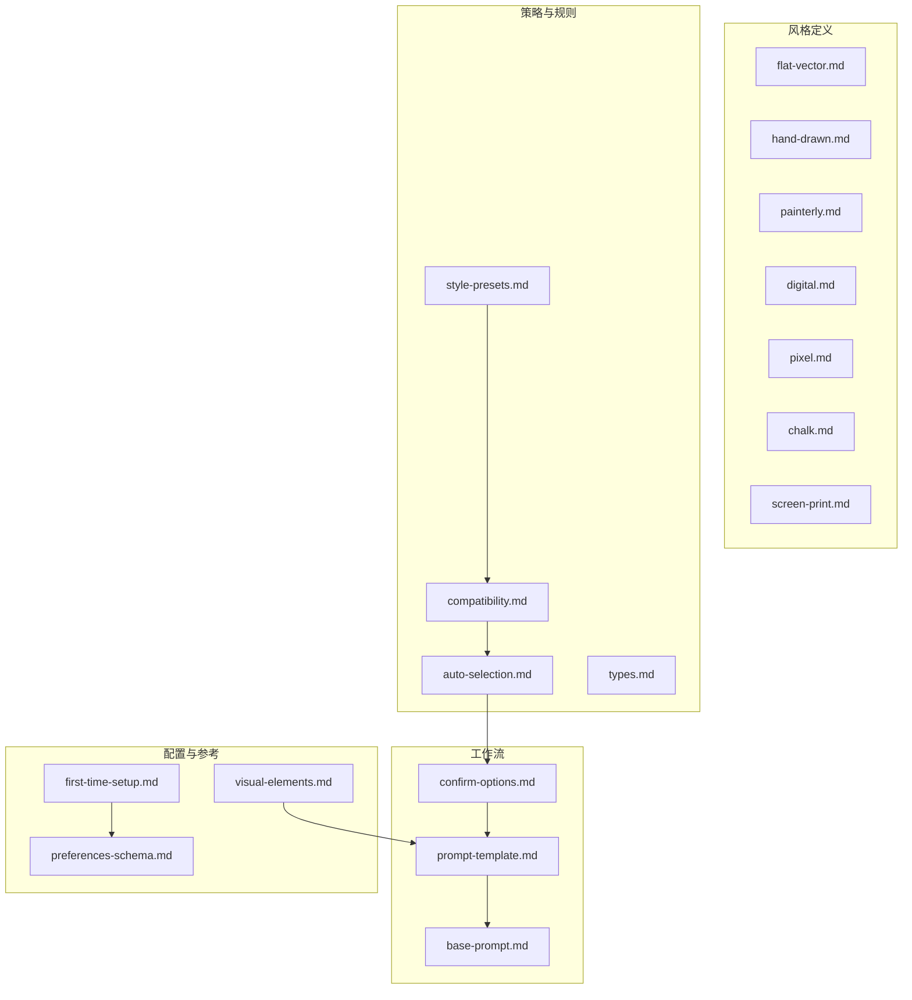
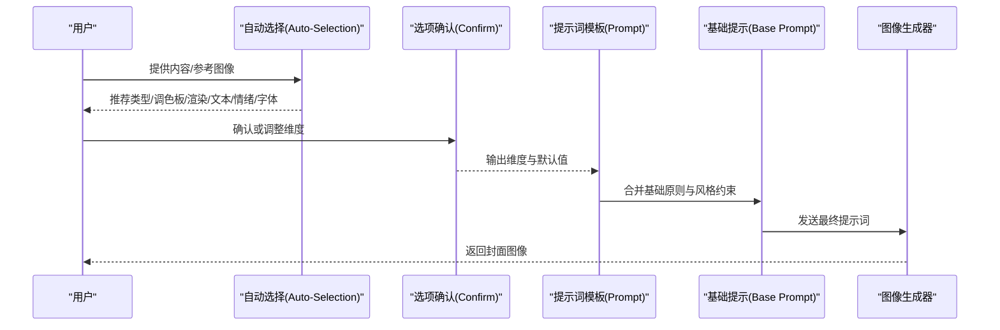
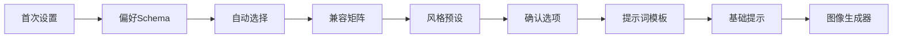
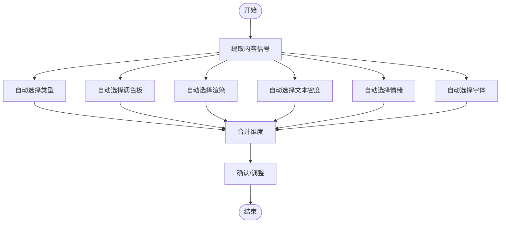

# 渲染风格系统

<cite>
**本文引用的文件**
- [flat-vector.md](file://.agents/skills/baoyu-cover-image/references/renderings/flat-vector.md)
- [hand-drawn.md](file://.agents/skills/baoyu-cover-image/references/renderings/hand-drawn.md)
- [painterly.md](file://.agents/skills/baoyu-cover-image/references/renderings/painterly.md)
- [digital.md](file://.agents/skills/baoyu-cover-image/references/renderings/digital.md)
- [pixel.md](file://.agents/skills/baoyu-cover-image/references/renderings/pixel.md)
- [chalk.md](file://.agents/skills/baoyu-cover-image/references/renderings/chalk.md)
- [screen-print.md](file://.agents/skills/baoyu-cover-image/references/renderings/screen-print.md)
- [style-presets.md](file://.agents/skills/baoyu-cover-image/references/style-presets.md)
- [compatibility.md](file://.agents/skills/baoyu-cover-image/references/compatibility.md)
- [auto-selection.md](file://.agents/skills/baoyu-cover-image/references/auto-selection.md)
- [types.md](file://.agents/skills/baoyu-cover-image/references/types.md)
- [prompt-template.md](file://.agents/skills/baoyu-cover-image/references/workflow/prompt-template.md)
- [confirm-options.md](file://.agents/skills/baoyu-cover-image/references/workflow/confirm-options.md)
- [base-prompt.md](file://.agents/skills/baoyu-cover-image/references/base-prompt.md)
- [visual-elements.md](file://.agents/skills/baoyu-cover-image/references/visual-elements.md)
- [first-time-setup.md](file://.agents/skills/baoyu-cover-image/references/config/first-time-setup.md)
- [preferences-schema.md](file://.agents/skills/baoyu-cover-image/references/config/preferences-schema.md)
</cite>

## 目录
1. [简介](#简介)
2. [项目结构](#项目结构)
3. [核心组件](#核心组件)
4. [架构总览](#架构总览)
5. [详细组件分析](#详细组件分析)
6. [依赖关系分析](#依赖关系分析)
7. [性能考量](#性能考量)
8. [故障排查指南](#故障排查指南)
9. [结论](#结论)
10. [附录](#附录)

## 简介
本文件系统化梳理 baoyu-cover-image 技能在“封面渲染风格”维度的设计与使用方法，围绕七种渲染风格（扁平矢量、手绘、绘画、数码、像素、粉笔、胶版印刷）展开技术特性、视觉要点、适用场景与与AI图像生成器的兼容性说明，并提供风格选择指南、优缺点对比与实践案例建议，帮助用户在不同内容性质与目标平台上做出最优的视觉呈现决策。

## 项目结构
渲染风格系统由“风格定义”“兼容矩阵”“自动选择规则”“类型与文本密度”“工作流模板”等模块构成，形成从内容信号到风格选择再到提示词生成的闭环。

图表来源
- [style-presets.md:1-40](file://.agents/skills/baoyu-cover-image/references/style-presets.md#L1-L40)
- [compatibility.md:1-61](file://.agents/skills/baoyu-cover-image/references/compatibility.md#L1-L61)
- [auto-selection.md:1-75](file://.agents/skills/baoyu-cover-image/references/auto-selection.md#L1-L75)
- [confirm-options.md:1-153](file://.agents/skills/baoyu-cover-image/references/workflow/confirm-options.md#L1-L153)
- [prompt-template.md:1-255](file://.agents/skills/baoyu-cover-image/references/workflow/prompt-template.md#L1-L255)
- [base-prompt.md:1-125](file://.agents/skills/baoyu-cover-image/references/base-prompt.md#L1-L125)
- [visual-elements.md:1-102](file://.agents/skills/baoyu-cover-image/references/visual-elements.md#L1-L102)
- [first-time-setup.md:1-203](file://.agents/skills/baoyu-cover-image/references/config/first-time-setup.md#L1-L203)
- [preferences-schema.md:1-267](file://.agents/skills/baoyu-cover-image/references/config/preferences-schema.md#L1-L267)

章节来源
- [style-presets.md:1-40](file://.agents/skills/baoyu-cover-image/references/style-presets.md#L1-L40)
- [compatibility.md:1-61](file://.agents/skills/baoyu-cover-image/references/compatibility.md#L1-L61)
- [auto-selection.md:1-75](file://.agents/skills/baoyu-cover-image/references/auto-selection.md#L1-L75)
- [types.md:1-24](file://.agents/skills/baoyu-cover-image/references/types.md#L1-L24)
- [confirm-options.md:1-153](file://.agents/skills/baoyu-cover-image/references/workflow/confirm-options.md#L1-L153)
- [prompt-template.md:1-255](file://.agents/skills/baoyu-cover-image/references/workflow/prompt-template.md#L1-L255)
- [base-prompt.md:1-125](file://.agents/skills/baoyu-cover-image/references/base-prompt.md#L1-L125)
- [visual-elements.md:1-102](file://.agents/skills/baoyu-cover-image/references/visual-elements.md#L1-L102)
- [first-time-setup.md:1-203](file://.agents/skills/baoyu-cover-image/references/config/first-time-setup.md#L1-L203)
- [preferences-schema.md:1-267](file://.agents/skills/baoyu-cover-image/references/config/preferences-schema.md#L1-L267)

## 核心组件
- 风格定义：对七种渲染风格的线条、纹理、深度、元素词汇与字体取向进行规范，确保与AI生成器的提示词一致。
- 兼容矩阵：给出调色板×渲染、类型×渲染、类型×文本、类型×情绪、字体×渲染的推荐度，指导组合选择。
- 自动选择：基于内容信号自动推断类型、调色板、渲染、文本密度、情绪与字体，支持快速模式。
- 类型与文本密度：定义六类封面类型及文本密度等级，决定构图与留白策略。
- 工作流模板：将确认的维度转化为可执行的提示词模板，包含参考图像处理、水印、排版与元素库映射。
- 配置与偏好：首次设置与偏好存储，支持跨项目复用与后端选择。

章节来源
- [compatibility.md:1-61](file://.agents/skills/baoyu-cover-image/references/compatibility.md#L1-L61)
- [auto-selection.md:1-75](file://.agents/skills/baoyu-cover-image/references/auto-selection.md#L1-L75)
- [types.md:1-24](file://.agents/skills/baoyu-cover-image/references/types.md#L1-L24)
- [prompt-template.md:1-255](file://.agents/skills/baoyu-cover-image/references/workflow/prompt-template.md#L1-L255)
- [first-time-setup.md:1-203](file://.agents/skills/baoyu-cover-image/references/config/first-time-setup.md#L1-L203)
- [preferences-schema.md:1-267](file://.agents/skills/baoyu-cover-image/references/config/preferences-schema.md#L1-L267)

## 架构总览
渲染风格系统以“内容信号→维度选择→提示词生成→图像生成”的流水线运行，关键节点如下：

图表来源
- [auto-selection.md:1-75](file://.agents/skills/baoyu-cover-image/references/auto-selection.md#L1-L75)
- [confirm-options.md:1-153](file://.agents/skills/baoyu-cover-image/references/workflow/confirm-options.md#L1-L153)
- [prompt-template.md:1-255](file://.agents/skills/baoyu-cover-image/references/workflow/prompt-template.md#L1-L255)
- [base-prompt.md:1-125](file://.agents/skills/baoyu-cover-image/references/base-prompt.md#L1-L125)

## 详细组件分析

### 扁平矢量（flat-vector）
- 技术特点
  - 线条：清晰统一的描边、闭合形状、圆润末端、一致线宽
  - 纹理：无纹理，纯色块，无渐变、阴影或噪点
  - 深度：平面，2D重叠表达层次；可选2.5D等轴测（无透视）
  - 元素词汇：几何图标与简单图形、圆润比例、装饰性小元素、孤立于纯色背景
  - 字体：简洁无衬线或粗几何字形，强调可读性与缩放性
- 适用场景
  - 科技产品发布、数据仪表盘、信息图、UI组件展示、极简品牌封面
- 与AI生成器兼容性
  - 易于控制边界与形状，适合强调轮廓与色块的模型；需明确“无阴影/无渐变”
- 优缺点
  - 优点：清晰、现代、跨平台适配好、易于识别核心元素
  - 缺点：可能显得生硬、缺乏温度与层次
- 实际应用案例
  - 企业技术白皮书封面、开源项目主页、课程卡片

章节来源
- [flat-vector.md:1-43](file://.agents/skills/baoyu-cover-image/references/renderings/flat-vector.md#L1-L43)
- [compatibility.md:5-18](file://.agents/skills/baoyu-cover-image/references/compatibility.md#L5-L18)
- [types.md:7-12](file://.agents/skills/baoyu-cover-image/references/types.md#L7-L12)
- [visual-elements.md:96-96](file://.agents/skills/baoyu-cover-image/references/visual-elements.md#L96-L96)

### 手绘（hand-drawn）
- 技术特点
  - 线条：草率有机、可变粗细、波浪连接、自然抖动
  - 纹理：纸纹与细微表面质感、铅笔/钢笔/马克笔笔触、随意填充
  - 深度：轻度阴影或交叉线，无真实透视，简单重叠
  - 元素词汇：涂鸦、有机形状、手写字母、概念图标、波浪连接线
  - 字体：手写字体或记号笔风格，基线弹性、强调层级变化
- 适用场景
  - 教育类、创意类、个人博客、思维导图、课堂笔记风格
- 与AI生成器兼容性
  - 需要明确“手绘质感、轻微不完美”，避免过度光滑
- 优缺点
  - 优点：亲切、有个性、易建立情感连接
  - 缺点：在高精度要求场景可能显得不够专业
- 实际应用案例
  - 教程封面、播客剧集、创意分享、学习笔记

章节来源
- [hand-drawn.md:1-41](file://.agents/skills/baoyu-cover-image/references/renderings/hand-drawn.md#L1-L41)
- [compatibility.md:5-18](file://.agents/skills/baoyu-cover-image/references/compatibility.md#L5-L18)
- [types.md:11-14](file://.agents/skills/baoyu-cover-image/references/types.md#L11-L14)
- [visual-elements.md:97-97](file://.agents/skills/baoyu-cover-image/references/visual-elements.md#L97-L97)

### 绘画（painterly）
- 技术特点
  - 线条：柔和笔触、可变透明度、软边缘、自然融合
  - 纹理：可见颜料/水彩晕染、湿拓效果、透薄纸纹、笔触方向
  - 深度：软边缘与自然过渡、大气透视、层层洗色
  - 元素词汇：水彩背景、自然元素、柔和渐变、飞溅与滴落
  - 字体：优雅手写体或带笔触的手稿风格
- 适用场景
  - 艺术类、自然主题、创意插画、温暖故事类内容
- 与AI生成器兼容性
  - 需强调“水彩质感、颜色渗透、纸张纹理”
- 优缺点
  - 优点：富有艺术感与情感张力
  - 缺点：在信息密度高的场景可能影响可读性
- 实际应用案例
  - 文艺类文章、旅行游记、自然科普、创意短文

章节来源
- [painterly.md:1-41](file://.agents/skills/baoyu-cover-image/references/renderings/painterly.md#L1-L41)
- [compatibility.md:5-18](file://.agents/skills/baoyu-cover-image/references/compatibility.md#L5-L18)
- [visual-elements.md:98-98](file://.agents/skills/baoyu-cover-image/references/visual-elements.md#L98-L98)

### 数码（digital）
- 技术特点
  - 线条：计算机完美边缘、一致线宽、锐利转角、抗锯齿
  - 纹理：光滑表面、允许柔和渐变、磨砂玻璃与模糊效果、一致方向阴影
  - 深度：柔和渐变与投影、卡片式分层布局、轻度3D效果
  - 元素词汇： polished 图标与UI组件、数据可视化、卡片网格
  - 字体：系统UI或现代无衬线（如Inter/SF Pro），功能性强
- 适用场景
  - 产品发布、SaaS仪表盘、科技资讯、企业宣传
- 与AI生成器兼容性
  - 易于生成，适合强调“干净、现代、精确”的模型
- 优缺点
  - 优点：现代感强、跨媒体适配佳、信息承载力高
  - 缺点：可能显得冷峻、缺乏温度
- 实际应用案例
  - 会议海报、产品主页、技术博客、演示文稿

章节来源
- [digital.md:1-43](file://.agents/skills/baoyu-cover-image/references/renderings/digital.md#L1-L43)
- [compatibility.md:5-18](file://.agents/skills/baoyu-cover-image/references/compatibility.md#L5-L18)
- [types.md:7-12](file://.agents/skills/baoyu-cover-image/references/types.md#L7-L12)
- [visual-elements.md:99-99](file://.agents/skills/baoyu-cover-image/references/visual-elements.md#L99-L99)

### 像素（pixel）
- 技术特点
  - 线条：像素网格对齐、阶梯边缘、单像素/双像素描边、方块感
  - 纹理：点阵图案用于渐变、无平滑过渡、像素精度的交叉线
  - 深度：平面像素层、前景/背景视差层
  - 元素词汇：8位精灵与方块形状、简单图标、像素边框对话气泡
  - 字体：像素位图风格、方块字母、等宽或固定宽度
- 适用场景
  - 游戏主题、复古风、动漫/ACG、怀旧活动
- 与AI生成器兼容性
  - 需强调“像素网格、有限调色板、点阵细节”
- 优缺点
  - 优点：风格辨识度高、怀旧氛围强
  - 缺点：细节表达受限、不适合复杂信息
- 实际应用案例
  - 游戏预告、动漫周边、复古活动、像素风教程

章节来源
- [pixel.md:1-43](file://.agents/skills/baoyu-cover-image/references/renderings/pixel.md#L1-L43)
- [compatibility.md:5-18](file://.agents/skills/baoyu-cover-image/references/compatibility.md#L5-L18)
- [types.md:10-13](file://.agents/skills/baoyu-cover-image/references/types.md#L10-L13)
- [visual-elements.md:100-100](file://.agents/skills/baoyu-cover-image/references/visual-elements.md#L100-L100)

### 粉笔（chalk）
- 技术特点
  - 线条：不完美的粉笔笔触、可变压力、轻微摇摆、厚强调/细细节
  - 纹理：粉笔颗粒与粉尘效果、黑板表面纹理、橡皮擦污渍
  - 深度：平面粉笔画、通过擦除与重绘分层
  - 元素词汇：粉笔涂鸦、数学公式与图解、简单图标与连接线
  - 字体：手绘粉笔字母、不规整基线、强调色突出
- 适用场景
  - 教育类、课堂风格、知识讲解、教学资源
- 与AI生成器兼容性
  - 需强调“黑板质感、粉尘颗粒、手写不完美”
- 优缺点
  - 优点：真实课堂感、亲和力强
  - 缺点：在正式场合可能显得不够专业
- 实际应用案例
  - 教学课件、知识卡片、在线课程、讲座海报

章节来源
- [chalk.md:1-44](file://.agents/skills/baoyu-cover-image/references/renderings/chalk.md#L1-L44)
- [compatibility.md:5-18](file://.agents/skills/baoyu-cover-image/references/compatibility.md#L5-L18)
- [types.md:11-14](file://.agents/skills/baoyu-cover-image/references/types.md#L11-L14)
- [visual-elements.md:101-101](file://.agents/skills/baoyu-cover-image/references/visual-elements.md#L101-L101)

### 胶版印刷（screen-print）
- 技术特点
  - 线条：色块间锐利边界、无描边、由色彩边界定义形状
  - 纹理：网点图案、轻微套色偏差、纸张纹理、丝网印刷瑕疵
  - 深度：平面色块前后叠加、负空间作为主动构图元素
  - 元素词汇：几何框架、正负形反转、符号化元素、复古边框
  - 字体：粗缩放无衬线或手写字体，与设计融为一体
- 适用场景
  - 海报、专辑封面、电影/音乐会宣传、复古/限量版风格
- 与AI生成器兼容性
  - 需强调“网点、套色误差、几何形状、负空间”
- 优缺点
  - 优点：视觉冲击力强、风格辨识度高
  - 缺点：色彩与细节表达受限制
- 实际应用案例
  - 音乐节海报、电影宣传、复古书籍封面、展览招贴

章节来源
- [screen-print.md:1-45](file://.agents/skills/baoyu-cover-image/references/renderings/screen-print.md#L1-L45)
- [compatibility.md:5-18](file://.agents/skills/baoyu-cover-image/references/compatibility.md#L5-L18)
- [types.md:7-12](file://.agents/skills/baoyu-cover-image/references/types.md#L7-L12)
- [visual-elements.md:102-102](file://.agents/skills/baoyu-cover-image/references/visual-elements.md#L102-L102)

### 风格选择指南与实践建议
- 内容信号驱动
  - 清洁/现代/科技 → 扁平矢量
  - 概念/架构/技术 → 扁平矢量 或 数码
  - 创意/艺术/软性主题 → 绘画 或 手绘
  - 数据/仪表盘/企业 → 数码
  - 游戏/复古/动漫 → 像素
  - 教育/课堂/知识 → 粉笔
  - 海报/限量/复古 → 胶版印刷
- 平台与受众
  - 社交媒体（方形/竖版）→ 手绘/扁平矢量/粉笔
  - 视频/博客横版 → 数码/扁平矢量/胶版印刷
  - 游戏/动漫平台 → 像素/胶版印刷
- 参考图像优先
  - 当提供参考图时，应将其风格与色彩作为主要输入，再结合类型与渲染维度微调

章节来源
- [auto-selection.md:32-42](file://.agents/skills/baoyu-cover-image/references/auto-selection.md#L32-L42)
- [compatibility.md:5-61](file://.agents/skills/baoyu-cover-image/references/compatibility.md#L5-L61)
- [prompt-template.md:75-86](file://.agents/skills/baoyu-cover-image/references/workflow/prompt-template.md#L75-L86)

## 依赖关系分析
- 风格定义与兼容矩阵耦合：风格定义是兼容矩阵的基础，矩阵决定可接受的组合
- 自动选择依赖内容信号与兼容矩阵：根据信号匹配最佳风格与调色板
- 工作流模板依赖确认的维度：提示词模板将维度转化为具体指令
- 配置与偏好影响自动选择：默认偏好会改变推荐结果

图表来源
- [auto-selection.md:1-75](file://.agents/skills/baoyu-cover-image/references/auto-selection.md#L1-L75)
- [compatibility.md:1-61](file://.agents/skills/baoyu-cover-image/references/compatibility.md#L1-L61)
- [style-presets.md:1-40](file://.agents/skills/baoyu-cover-image/references/style-presets.md#L1-L40)
- [confirm-options.md:1-153](file://.agents/skills/baoyu-cover-image/references/workflow/confirm-options.md#L1-L153)
- [prompt-template.md:1-255](file://.agents/skills/baoyu-cover-image/references/workflow/prompt-template.md#L1-L255)
- [base-prompt.md:1-125](file://.agents/skills/baoyu-cover-image/references/base-prompt.md#L1-L125)
- [first-time-setup.md:1-203](file://.agents/skills/baoyu-cover-image/references/config/first-time-setup.md#L1-L203)
- [preferences-schema.md:1-267](file://.agents/skills/baoyu-cover-image/references/config/preferences-schema.md#L1-L267)

章节来源
- [style-presets.md:1-40](file://.agents/skills/baoyu-cover-image/references/style-presets.md#L1-L40)
- [compatibility.md:1-61](file://.agents/skills/baoyu-cover-image/references/compatibility.md#L1-L61)
- [auto-selection.md:1-75](file://.agents/skills/baoyu-cover-image/references/auto-selection.md#L1-L75)
- [confirm-options.md:1-153](file://.agents/skills/baoyu-cover-image/references/workflow/confirm-options.md#L1-L153)
- [prompt-template.md:1-255](file://.agents/skills/baoyu-cover-image/references/workflow/prompt-template.md#L1-L255)
- [base-prompt.md:1-125](file://.agents/skills/baoyu-cover-image/references/base-prompt.md#L1-L125)
- [first-time-setup.md:1-203](file://.agents/skills/baoyu-cover-image/references/config/first-time-setup.md#L1-L203)
- [preferences-schema.md:1-267](file://.agents/skills/baoyu-cover-image/references/config/preferences-schema.md#L1-L267)

## 性能考量
- 生成速度
  - 扁平矢量/手绘/粉笔：结构简单，通常较快
  - 数码/胶版印刷：细节与色块较多，可能稍慢
  - 绘画：纹理与晕染较耗时
  - 像素：网格与点阵细节可控，速度中等
- 提示词长度
  - 引入参考图像时，提示词会更长，但有助于提升一致性与质量
- 后端选择
  - 首次设置与偏好中可指定图像后端，按项目或全局生效

章节来源
- [compatibility.md:5-61](file://.agents/skills/baoyu-cover-image/references/compatibility.md#L5-L61)
- [prompt-template.md:131-167](file://.agents/skills/baoyu-cover-image/references/workflow/prompt-template.md#L131-L167)
- [first-time-setup.md:134-144](file://.agents/skills/baoyu-cover-image/references/config/first-time-setup.md#L134-L144)
- [preferences-schema.md:35-65](file://.agents/skills/baoyu-cover-image/references/config/preferences-schema.md#L35-L65)

## 故障排查指南
- 问题：风格与内容不匹配
  - 处理：检查兼容矩阵，必要时切换渲染或调色板
- 问题：AI忽略参考图像
  - 处理：在提示词中明确“必须参考提供的图像家族”，并提供具体元素描述
- 问题：文字与风格冲突
  - 处理：依据字体×渲染矩阵选择合适字体（如手绘配手写体）
- 问题：输出不符合预期
  - 处理：在提示词中强化“主视觉位置、留白比例、图标简化”等基础原则

章节来源
- [compatibility.md:53-61](file://.agents/skills/baoyu-cover-image/references/compatibility.md#L53-L61)
- [prompt-template.md:75-86](file://.agents/skills/baoyu-cover-image/references/workflow/prompt-template.md#L75-L86)
- [prompt-template.md:185-222](file://.agents/skills/baoyu-cover-image/references/workflow/prompt-template.md#L185-L222)
- [base-prompt.md:16-58](file://.agents/skills/baoyu-cover-image/references/base-prompt.md#L16-L58)

## 结论
baoyu-cover-image 的渲染风格系统通过“风格定义—兼容矩阵—自动选择—工作流模板—配置偏好”的闭环，实现了从内容信号到视觉风格的一致化落地。七种渲染风格覆盖了从科技理性到创意感性的广泛需求，配合类型、文本密度与情绪维度，可在不同平台与受众下稳定产出高质量封面。建议在实际使用中优先考虑内容信号与目标平台，结合兼容矩阵与自动选择规则，必要时通过参考图像与提示词强化风格一致性。

## 附录

### 风格与字体兼容速查
- 扁平矢量：适合“清洁/显示”字体
- 手绘：适合“手写/显示”字体
- 绘画：适合“手写/手稿”字体
- 数码：适合“清洁/显示”字体
- 像素：适合“显示”字体
- 粉笔：适合“手写”字体
- 胶版印刷：适合“显示/手写”字体

章节来源
- [compatibility.md:53-61](file://.agents/skills/baoyu-cover-image/references/compatibility.md#L53-L61)

### 类型与渲染兼容速查
- hero：手绘/绘画/数码/像素/胶版印刷均较优
- conceptual：扁平矢量/数码/胶版印刷较优
- typography：扁平矢量/数码/胶版印刷较优
- metaphor：手绘/绘画/胶版印刷较优
- scene：手绘/绘画较优
- minimal：扁平矢量/数码/胶版印刷较优

章节来源
- [compatibility.md:20-29](file://.agents/skills/baoyu-cover-image/references/compatibility.md#L20-L29)

### 自动选择流程图

图表来源
- [auto-selection.md:1-75](file://.agents/skills/baoyu-cover-image/references/auto-selection.md#L1-L75)
- [confirm-options.md:34-152](file://.agents/skills/baoyu-cover-image/references/workflow/confirm-options.md#L34-L152)