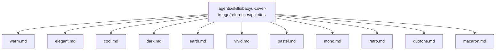
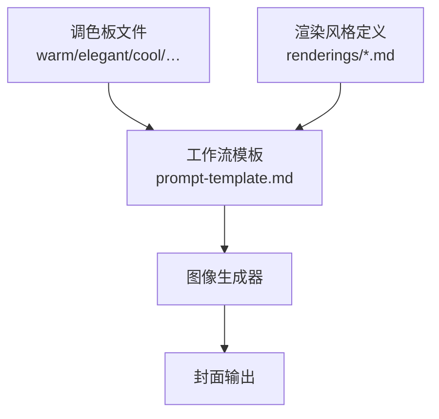
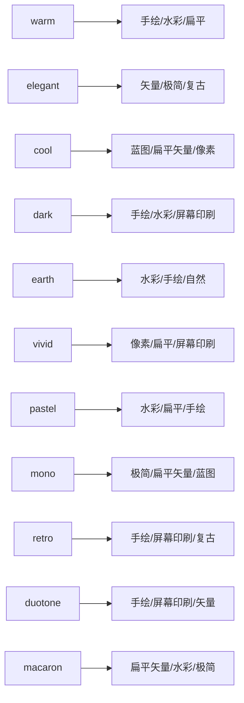

# 调色板系统

<cite>
**本文引用的文件**
- [warm.md](file://.agents/skills/baoyu-cover-image/references/palettes/warm.md)
- [elegant.md](file://.agents/skills/baoyu-cover-image/references/palettes/elegant.md)
- [cool.md](file://.agents/skills/baoyu-cover-image/references/palettes/cool.md)
- [dark.md](file://.agents/skills/baoyu-cover-image/references/palettes/dark.md)
- [earth.md](file://.agents/skills/baoyu-cover-image/references/palettes/earth.md)
- [vivid.md](file://.agents/skills/baoyu-cover-image/references/palettes/vivid.md)
- [pastel.md](file://.agents/skills/baoyu-cover-image/references/palettes/pastel.md)
- [mono.md](file://.agents/skills/baoyu-cover-image/references/palettes/mono.md)
- [retro.md](file://.agents/skills/baoyu-cover-image/references/palettes/retro.md)
- [duotone.md](file://.agents/skills/baoyu-cover-image/references/palettes/duotone.md)
- [macaron.md](file://.agents/skills/baoyu-cover-image/references/palettes/macaron.md)
</cite>

## 目录
1. [简介](#简介)
2. [项目结构](#项目结构)
3. [核心组件](#核心组件)
4. [架构总览](#架构总览)
5. [详细组件分析](#详细组件分析)
6. [依赖关系分析](#依赖关系分析)
7. [性能考量](#性能考量)
8. [故障排查指南](#故障排查指南)
9. [结论](#结论)
10. [附录](#附录)

## 简介
本文件系统性梳理 baoyu-cover-image 技能的调色板体系，覆盖 11 种可用调色板：warm（温暖）、elegant（优雅）、cool（冷静）、dark（深沉）、earth（大地）、vivid（鲜艳）、pastel（粉彩）、mono（单色）、retro（复古）、duotone（双色）、macaron（马卡龙）。文档从色彩特征、情感表达、视觉效果、适用主题与受众、与渲染风格的搭配建议以及组合使用技巧等维度进行说明，并提供可操作的选择指南，帮助创作者在封面生成中做出更精准的色彩决策。

## 项目结构
调色板定义位于技能引用资源目录下，每个调色板以独立 Markdown 文件呈现，统一包含“名称”“色彩角色与色值”“装饰性提示”“语义约束”“适用领域”等结构化信息。该组织方式便于检索、维护与跨模块复用。

图表来源
- [.agents/skills/baoyu-cover-image/references/palettes/warm.md:1-31](file://.agents/skills/baoyu-cover-image/references/palettes/warm.md#L1-L31)
- [.agents/skills/baoyu-cover-image/references/palettes/elegant.md:1-31](file://.agents/skills/baoyu-cover-image/references/palettes/elegant.md#L1-L31)
- [.agents/skills/baoyu-cover-image/references/palettes/cool.md:1-31](file://.agents/skills/baoyu-cover-image/references/palettes/cool.md#L1-L31)
- [.agents/skills/baoyu-cover-image/references/palettes/dark.md:1-31](file://.agents/skills/baoyu-cover-image/references/palettes/dark.md#L1-L31)
- [.agents/skills/baoyu-cover-image/references/palettes/earth.md:1-31](file://.agents/skills/baoyu-cover-image/references/palettes/earth.md#L1-L31)
- [.agents/skills/baoyu-cover-image/references/palettes/vivid.md:1-31](file://.agents/skills/baoyu-cover-image/references/palettes/vivid.md#L1-L31)
- [.agents/skills/baoyu-cover-image/references/palettes/pastel.md:1-31](file://.agents/skills/baoyu-cover-image/references/palettes/pastel.md#L1-L31)
- [.agents/skills/baoyu-cover-image/references/palettes/mono.md:1-31](file://.agents/skills/baoyu-cover-image/references/palettes/mono.md#L1-L31)
- [.agents/skills/baoyu-cover-image/references/palettes/retro.md:1-35](file://.agents/skills/baoyu-cover-image/references/palettes/retro.md#L1-L35)
- [.agents/skills/baoyu-cover-image/references/palettes/duotone.md:1-44](file://.agents/skills/baoyu-cover-image/references/palettes/duotone.md#L1-L44)
- [.agents/skills/baoyu-cover-image/references/palettes/macaron.md:1-31](file://.agents/skills/baoyu-cover-image/references/palettes/macaron.md#L1-L31)

章节来源
- [.agents/skills/baoyu-cover-image/references/palettes/warm.md:1-31](file://.agents/skills/baoyu-cover-image/references/palettes/warm.md#L1-L31)
- [.agents/skills/baoyu-cover-image/references/palettes/elegant.md:1-31](file://.agents/skills/baoyu-cover-image/references/palettes/elegant.md#L1-L31)
- [.agents/skills/baoyu-cover-image/references/palettes/cool.md:1-31](file://.agents/skills/baoyu-cover-image/references/palettes/cool.md#L1-L31)
- [.agents/skills/baoyu-cover-image/references/palettes/dark.md:1-31](file://.agents/skills/baoyu-cover-image/references/palettes/dark.md#L1-L31)
- [.agents/skills/baoyu-cover-image/references/palettes/earth.md:1-31](file://.agents/skills/baoyu-cover-image/references/palettes/earth.md#L1-L31)
- [.agents/skills/baoyu-cover-image/references/palettes/vivid.md:1-31](file://.agents/skills/baoyu-cover-image/references/palettes/vivid.md#L1-L31)
- [.agents/skills/baoyu-cover-image/references/palettes/pastel.md:1-31](file://.agents/skills/baoyu-cover-image/references/palettes/pastel.md#L1-L31)
- [.agents/skills/baoyu-cover-image/references/palettes/mono.md:1-31](file://.agents/skills/baoyu-cover-image/references/palettes/mono.md#L1-L31)
- [.agents/skills/baoyu-cover-image/references/palettes/retro.md:1-35](file://.agents/skills/baoyu-cover-image/references/palettes/retro.md#L1-L35)
- [.agents/skills/baoyu-cover-image/references/palettes/duotone.md:1-44](file://.agents/skills/baoyu-cover-image/references/palettes/duotone.md#L1-L44)
- [.agents/skills/baoyu-cover-image/references/palettes/macaron.md:1-31](file://.agents/skills/baoyu-cover-image/references/palettes/macaron.md#L1-L31)

## 核心组件
- 调色板元数据：每种调色板均包含主色、背景、辅色的角色划分与色值；部分调色板还提供“配色对选项”或“额外辅色”，用于双色风格的灵活选择。
- 装饰性提示：给出与调色板匹配的构图元素、线条、光影与纹理建议，帮助生成更具氛围感的封面。
- 语义约束：明确禁止将颜色名称、十六进制码或角色标签作为可见文本出现在图像中，确保输出画面的整洁与专业度。
- 适用领域：列出最适合的主题与受众方向，便于按内容定位快速选色。

章节来源
- [.agents/skills/baoyu-cover-image/references/palettes/warm.md:5-31](file://.agents/skills/baoyu-cover-image/references/palettes/warm.md#L5-L31)
- [.agents/skills/baoyu-cover-image/references/palettes/elegant.md:5-31](file://.agents/skills/baoyu-cover-image/references/palettes/elegant.md#L5-L31)
- [.agents/skills/baoyu-cover-image/references/palettes/cool.md:5-31](file://.agents/skills/baoyu-cover-image/references/palettes/cool.md#L5-L31)
- [.agents/skills/baoyu-cover-image/references/palettes/dark.md:5-31](file://.agents/skills/baoyu-cover-image/references/palettes/dark.md#L5-L31)
- [.agents/skills/baoyu-cover-image/references/palettes/earth.md:5-31](file://.agents/skills/baoyu-cover-image/references/palettes/earth.md#L5-L31)
- [.agents/skills/baoyu-cover-image/references/palettes/vivid.md:5-31](file://.agents/skills/baoyu-cover-image/references/palettes/vivid.md#L5-L31)
- [.agents/skills/baoyu-cover-image/references/palettes/pastel.md:5-31](file://.agents/skills/baoyu-cover-image/references/palettes/pastel.md#L5-L31)
- [.agents/skills/baoyu-cover-image/references/palettes/mono.md:5-31](file://.agents/skills/baoyu-cover-image/references/palettes/mono.md#L5-L31)
- [.agents/skills/baoyu-cover-image/references/palettes/retro.md:5-35](file://.agents/skills/baoyu-cover-image/references/palettes/retro.md#L5-L35)
- [.agents/skills/baoyu-cover-image/references/palettes/duotone.md:5-44](file://.agents/skills/baoyu-cover-image/references/palettes/duotone.md#L5-L44)
- [.agents/skills/baoyu-cover-image/references/palettes/macaron.md:5-31](file://.agents/skills/baoyu-cover-image/references/palettes/macaron.md#L5-L31)

## 架构总览
调色板系统采用“声明式配置 + 渲染风格适配”的架构：调色板文件提供色彩语义与风格提示，渲染风格文件提供视觉表现策略（如扁平、水彩、像素风等），二者通过工作流模板组合，最终驱动图像生成器产出符合主题与情绪的封面。

图表来源
- [.agents/skills/baoyu-cover-image/references/palettes/warm.md:1-31](file://.agents/skills/baoyu-cover-image/references/palettes/warm.md#L1-L31)
- [.agents/skills/baoyu-cover-image/references/palettes/duotone.md:1-44](file://.agents/skills/baoyu-cover-image/references/palettes/duotone.md#L1-L44)
- [.agents/skills/baoyu-cover-image/references/workflow/prompt-template.md](file://.agents/skills/baoyu-cover-image/references/workflow/prompt-template.md)

## 详细组件分析

### warm（温暖）
- 色彩特征：以暖橙、金黄、焦糖为主色，背景为奶油与柔粉，辅以深棕与微红，整体明亮亲和。
- 情感表达：友好、可亲、人性化，适合传递温度与人情味。
- 视觉效果：日光、暖光、圆润曲线、有机形态、笑脸与爱心等元素增强亲和力。
- 适用主题与受众：个人成长、生活方式、教育、人文故事、情感、社区类内容。
- 搭配建议：可与“手绘”“水彩”“扁平插画”风格结合，突出柔和与自然感。

章节来源
- [.agents/skills/baoyu-cover-image/references/palettes/warm.md:1-31](file://.agents/skills/baoyu-cover-image/references/palettes/warm.md#L1-L31)

### elegant（优雅）
- 色彩特征：柔珊瑚、哑光绿松石、浅玫瑰为主色，背景为暖奶油与浅米色，辅以金色与铜色，整体柔和精致。
- 情感表达：精致、内敛、奢华而不张扬，强调质感与平衡。
- 视觉效果：精细装饰细节、微妙渐变、几何纹样、对称构图。
- 适用主题与受众：商业、专业、思想领袖、奢侈品、企业传播。
- 搭配建议：与“矢量插画”“极简”“复古”风格结合，提升高级感与专业度。

章节来源
- [.agents/skills/baoyu-cover-image/references/palettes/elegant.md:1-31](file://.agents/skills/baoyu-cover-image/references/palettes/elegant.md#L1-L31)

### cool（冷静）
- 色彩特征：工程蓝、深蓝、青色为主色，背景为浅灰与米白，辅以琥珀与浅蓝，理性而清晰。
- 情感表达：技术性、专业、精确，强调逻辑与结构。
- 视觉效果：网格线、尺寸标注、技术图表、几何精度元素。
- 适用主题与受众：建筑、系统设计、API、技术文档、工程、数据分析。
- 搭配建议：与“蓝图”“扁平矢量”“像素风”风格结合，强化科技感与条理感。

章节来源
- [.agents/skills/baoyu-cover-image/references/palettes/cool.md:1-31](file://.agents/skills/baoyu-cover-image/references/palettes/cool.md#L1-L31)

### dark（深沉）
- 色彩特征：电紫、青蓝、洋红为主色，背景为深紫黑与深蓝，辅以琥珀与纯白，对比强烈。
- 情感表达：电影感、高端、氛围感强，适合暗黑与未来主题。
- 视觉效果：发光高亮、雾气粒子、逆光剪影、渐变背景。
- 适用主题与受众：娱乐、高端品牌、电影叙事、暗黑模式、游戏、夜间主题。
- 搭配建议：与“手绘”“水彩”“屏幕印刷”风格结合，突出层次与张力。

章节来源
- [.agents/skills/baoyu-cover-image/references/palettes/dark.md:1-31](file://.agents/skills/baoyu-cover-image/references/palettes/dark.md#L1-L31)

### earth（大地）
- 色彩特征：森林绿、鼠尾草、土棕色为主色，背景为沙贝齿与天蓝，辅以落日橙与水蓝，贴近自然。
- 情感表达：自然、有机、稳重，强调回归与可持续。
- 视觉效果：树叶、山川、云朵、自然流线、植物插画、质朴纹理。
- 适用主题与受众：自然、健康、生态、有机、旅行、可持续、户外、慢生活。
- 搭配建议：与“水彩”“手绘”“自然”风格结合，营造清新与真实感。

章节来源
- [.agents/skills/baoyu-cover-image/references/palettes/earth.md:1-31](file://.agents/skills/baoyu-cover-image/references/palettes/earth.md#L1-L31)

### vivid（鲜艳）
- 色彩特征：鲜红、霓虹绿、电蓝为主色，背景为浅蓝与淡薰衣草，辅以亮橙与明黄，高饱和。
- 情感表达：活力、醒目、引人注目，适合促销与活动。
- 视觉效果：动态斜线与角度、大色块、戏剧性光影、高能量构图。
- 适用主题与受众：产品发布、游戏、营销、活动、公告、品牌展示。
- 搭配建议：与“像素风”“扁平插画”“屏幕印刷”风格结合，强化冲击力。

章节来源
- [.agents/skills/baoyu-cover-image/references/palettes/vivid.md:1-31](file://.agents/skills/baoyu-cover-image/references/palettes/vivid.md#L1-L31)

### pastel（粉彩）
- 色彩特征：柔粉、薄荷、薰衣草为主色，背景为纯白与浅乳霜，辅以柠檬黄与天蓝，柔和轻盈。
- 情感表达：温柔、梦幻、轻松，适合儿童与创意内容。
- 视觉效果：圆润比例、星点、花朵、轻柔阴影、童话元素。
- 适用主题与受众：幻想、儿童、温和内容、创意、轻松、入门教程。
- 搭配建议：与“水彩”“扁平插画”“手绘”风格结合，增强亲和与童趣。

章节来源
- [.agents/skills/baoyu-cover-image/references/palettes/pastel.md:1-31](file://.agents/skills/baoyu-cover-image/references/palettes/pastel.md#L1-L31)

### mono（单色）
- 色彩特征：纯黑、近黑、深灰为主色，背景为白与米白，辅以中灰与内容衍生色，极简纯粹。
- 情感表达：干净、专注、本质，强调留白与聚焦。
- 视觉效果：最大负空间、细线与最少笔触、单一焦点、强对比。
- 适用主题与受众：禅意、专注、核心概念、纯粹、极简哲学、清洁设计。
- 搭配建议：与“极简”“扁平矢量”“蓝图”风格结合，突出克制与力量。

章节来源
- [.agents/skills/baoyu-cover-image/references/palettes/mono.md:1-31](file://.agents/skills/baoyu-cover-image/references/palettes/mono.md#L1-L31)

### retro（复古）
- 色彩特征：珊瑚、薄荷、芥末、深褐为主色，背景为奶油与做旧纸，辅以烧焦橙、岩石蓝、复古金、褪色绿，多辅色。
- 情感表达：怀旧、经典、复古，适合回顾与创意提案。
- 视觉效果：半色调网点、做旧纹理、放射光晕、胶囊云与小点星、经典图标。
- 适用主题与受众：历史、复古、经典、探索、回顾展、复古内容、创意提案、教育。
- 搭配建议：与“手绘”“屏幕印刷”“复古”风格结合，唤起时代感。

章节来源
- [.agents/skills/baoyu-cover-image/references/palettes/retro.md:1-35](file://.agents/skills/baoyu-cover-image/references/palettes/retro.md#L1-L35)

### duotone（双色）
- 色彩特征：双色主导全图，提供多种配色对选项（如橙+绿、红+奶油、蓝+金、紫+绿、洋红+青、深红+藏青），背景为深黑或深炭，辅以暖奶油与琥珀高光。
- 情感表达：戏剧性、电影感、高对比，适合艺术化与品牌化场景。
- 视觉效果：整幅二色分离、半色调过渡、剪影与高对比前景/背景关系。
- 适用主题与受众：电影海报、专辑封面、演出印刷、戏剧性公告、电影化内容、品牌宣传、编辑封面、艺术活动。
- 搭配建议：与“手绘”“屏幕印刷”“矢量插画”风格结合，强化视觉冲击与辨识度。

章节来源
- [.agents/skills/baoyu-cover-image/references/palettes/duotone.md:1-44](file://.agents/skills/baoyu-cover-image/references/palettes/duotone.md#L1-L44)

### macaron（马卡龙）
- 色彩特征：天蓝、薄荷绿、薰衣草为主色，背景为暖奶油与桃粉，辅以珊瑚与深炭，柔和色块。
- 情感表达：柔和、知识感、亲和，适合教学与知识分享。
- 视觉效果：圆润马卡龙色块、轻微纸纹、柔和阴影、区域间渐变过渡。
- 适用主题与受众：教育内容、知识分享、概念解释、教程、技术摘要、入职材料。
- 搭配建议：与“扁平矢量”“水彩”“极简”风格结合，营造温和与易理解的氛围。

章节来源
- [.agents/skills/baoyu-cover-image/references/palettes/macaron.md:1-31](file://.agents/skills/baoyu-cover-image/references/palettes/macaron.md#L1-L31)

## 依赖关系分析
- 组件耦合：调色板与渲染风格之间为弱耦合，通过工作流模板聚合，便于替换与组合。
- 外部依赖：调色板文件本身不依赖具体实现，但需配合渲染风格与生成器参数共同作用。
- 可能的循环依赖：无直接循环；若在工作流中错误地回引用调色板自身，可能造成逻辑闭环，应避免。

图表来源
- [.agents/skills/baoyu-cover-image/references/palettes/warm.md:1-31](file://.agents/skills/baoyu-cover-image/references/palettes/warm.md#L1-L31)
- [.agents/skills/baoyu-cover-image/references/palettes/elegant.md:1-31](file://.agents/skills/baoyu-cover-image/references/palettes/elegant.md#L1-L31)
- [.agents/skills/baoyu-cover-image/references/palettes/cool.md:1-31](file://.agents/skills/baoyu-cover-image/references/palettes/cool.md#L1-L31)
- [.agents/skills/baoyu-cover-image/references/palettes/dark.md:1-31](file://.agents/skills/baoyu-cover-image/references/palettes/dark.md#L1-L31)
- [.agents/skills/baoyu-cover-image/references/palettes/earth.md:1-31](file://.agents/skills/baoyu-cover-image/references/palettes/earth.md#L1-L31)
- [.agents/skills/baoyu-cover-image/references/palettes/vivid.md:1-31](file://.agents/skills/baoyu-cover-image/references/palettes/vivid.md#L1-L31)
- [.agents/skills/baoyu-cover-image/references/palettes/pastel.md:1-31](file://.agents/skills/baoyu-cover-image/references/palettes/pastel.md#L1-L31)
- [.agents/skills/baoyu-cover-image/references/palettes/mono.md:1-31](file://.agents/skills/baoyu-cover-image/references/palettes/mono.md#L1-L31)
- [.agents/skills/baoyu-cover-image/references/palettes/retro.md:1-35](file://.agents/skills/baoyu-cover-image/references/palettes/retro.md#L1-L35)
- [.agents/skills/baoyu-cover-image/references/palettes/duotone.md:1-44](file://.agents/skills/baoyu-cover-image/references/palettes/duotone.md#L1-L44)
- [.agents/skills/baoyu-cover-image/references/palettes/macaron.md:1-31](file://.agents/skills/baoyu-cover-image/references/palettes/macaron.md#L1-L31)

## 性能考量
- 生成效率：调色板越复杂（如 duotone 的多对选项、retro 的多辅色），渲染风格越丰富，可能增加生成时间与显存占用。建议在保证表达的前提下优先选择最贴合主题的最小化组合。
- 输出一致性：严格遵守“语义约束”，避免将色值与角色标签作为可见文本，有助于减少不必要的后处理与修正成本。
- 风格与调色板匹配：风格与调色板的契合度越高，越容易在较少迭代中获得满意结果，从而降低总体耗时。

## 故障排查指南
- 现象：图像出现色值或角色标签文字
  - 排查：检查工作流模板是否遵循“语义约束”，确保提示词中未要求显示色值或标签。
  - 参考：各调色板文件中的“语义约束”段落。
- 现象：风格与调色板不匹配导致画面违和
  - 排查：确认渲染风格与调色板的情感基调一致；必要时更换风格或调整主色/辅色。
  - 参考：各调色板的“装饰性提示”与“适用领域”。
- 现象：双色风格（duotone）颜色过多或对比不足
  - 排查：根据内容情绪选择合适的配色对；控制第三色仅作小面积高光，避免喧宾夺主。
  - 参考：duotone 的“配色对选项”与“装饰性提示”。

章节来源
- [.agents/skills/baoyu-cover-image/references/palettes/warm.md:24-26](file://.agents/skills/baoyu-cover-image/references/palettes/warm.md#L24-L26)
- [.agents/skills/baoyu-cover-image/references/palettes/elegant.md:24-26](file://.agents/skills/baoyu-cover-image/references/palettes/elegant.md#L24-L26)
- [.agents/skills/baoyu-cover-image/references/palettes/cool.md:24-26](file://.agents/skills/baoyu-cover-image/references/palettes/cool.md#L24-L26)
- [.agents/skills/baoyu-cover-image/references/palettes/dark.md:24-26](file://.agents/skills/baoyu-cover-image/references/palettes/dark.md#L24-L26)
- [.agents/skills/baoyu-cover-image/references/palettes/earth.md:24-26](file://.agents/skills/baoyu-cover-image/references/palettes/earth.md#L24-L26)
- [.agents/skills/baoyu-cover-image/references/palettes/vivid.md:24-26](file://.agents/skills/baoyu-cover-image/references/palettes/vivid.md#L24-L26)
- [.agents/skills/baoyu-cover-image/references/palettes/pastel.md:24-26](file://.agents/skills/baoyu-cover-image/references/palettes/pastel.md#L24-L26)
- [.agents/skills/baoyu-cover-image/references/palettes/mono.md:24-26](file://.agents/skills/baoyu-cover-image/references/palettes/mono.md#L24-L26)
- [.agents/skills/baoyu-cover-image/references/palettes/retro.md:28-30](file://.agents/skills/baoyu-cover-image/references/palettes/retro.md#L28-L30)
- [.agents/skills/baoyu-cover-image/references/palettes/duotone.md:37-39](file://.agents/skills/baoyu-cover-image/references/palettes/duotone.md#L37-L39)
- [.agents/skills/baoyu-cover-image/references/palettes/macaron.md:24-26](file://.agents/skills/baoyu-cover-image/references/palettes/macaron.md#L24-L26)

## 结论
baoyu-cover-image 的调色板系统以“声明式配置 + 渲染风格适配”为核心，通过 11 种风格明确的色彩方案，覆盖从温暖亲和到冷静专业、从自然有机到未来科幻的广泛表达需求。建议在实际使用中：先确定内容主题与目标受众，再依据“适用领域”与“情感基调”选择调色板，最后结合渲染风格与装饰性提示完成最终画面。对于复杂风格（如 duotone、retro），建议先选定主配色对或主辅色组合，再进行风格细化，以获得稳定且高效的产出。

## 附录
- 选择指南速查
  - 温暖：人情味、社区、教育、情感 → 优先 warm 或 macaron
  - 优雅：商业、专业、思想领袖 → 优先 elegant
  - 冷静：技术、工程、数据 → 优先 cool
  - 深沉：娱乐、高端、夜主题 → 优先 dark
  - 大地：自然、生态、旅行 → 优先 earth
  - 鲜艳：营销、活动、游戏 → 优先 vivid
  - 粉彩：儿童、创意、轻松 → 优先 pastel
  - 单色：极简、专注、本质 → 优先 mono
  - 复古：怀旧、经典、创意提案 → 优先 retro
  - 双色：电影化、品牌化、艺术活动 → 优先 duotone
  - 马卡龙：知识分享、教程、入门 → 优先 macaron