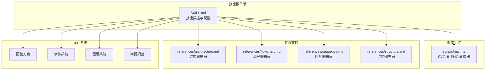
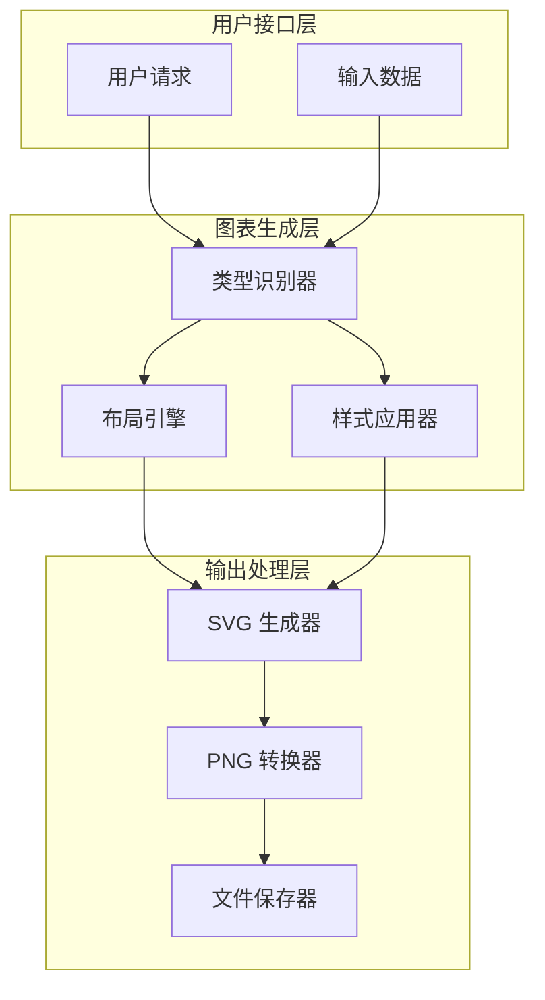
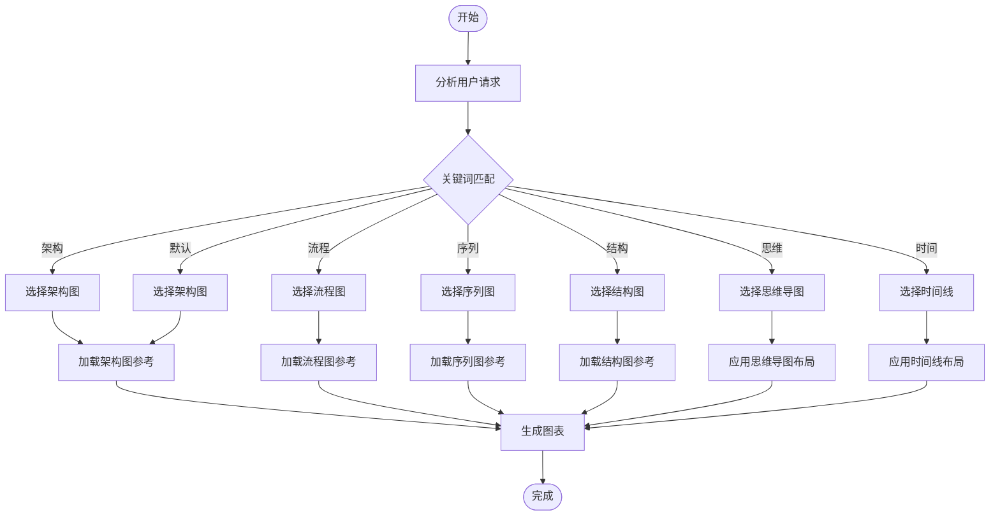
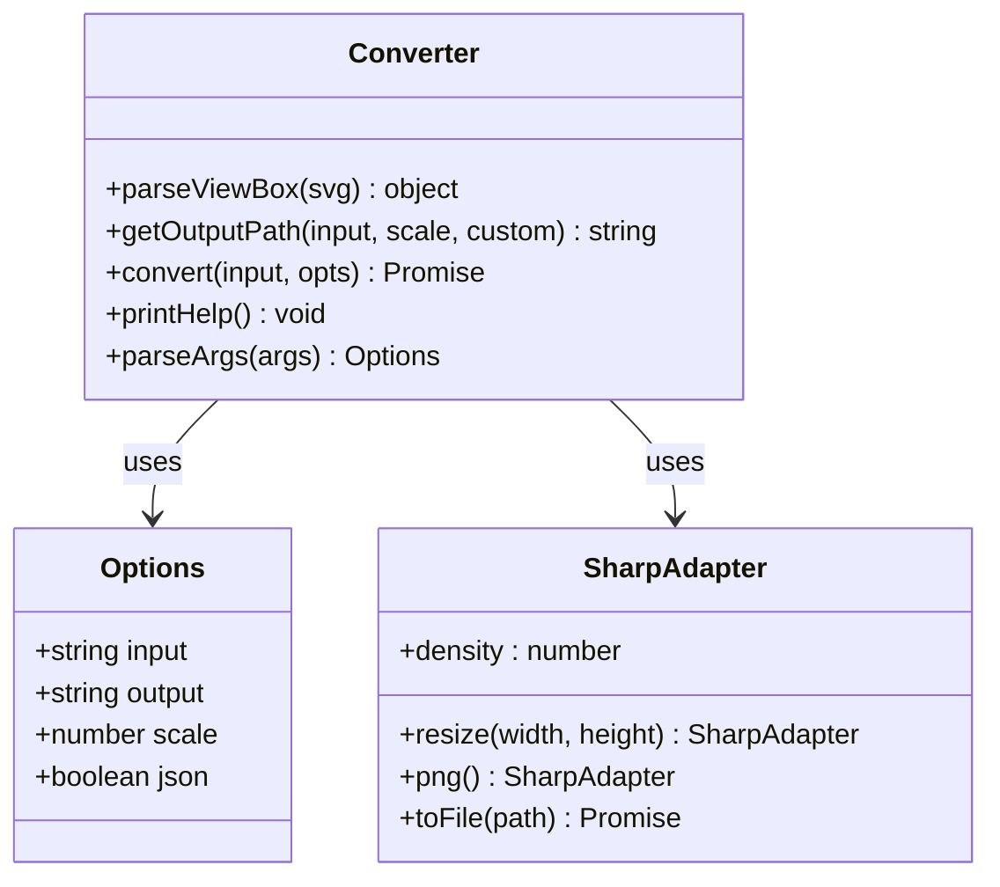
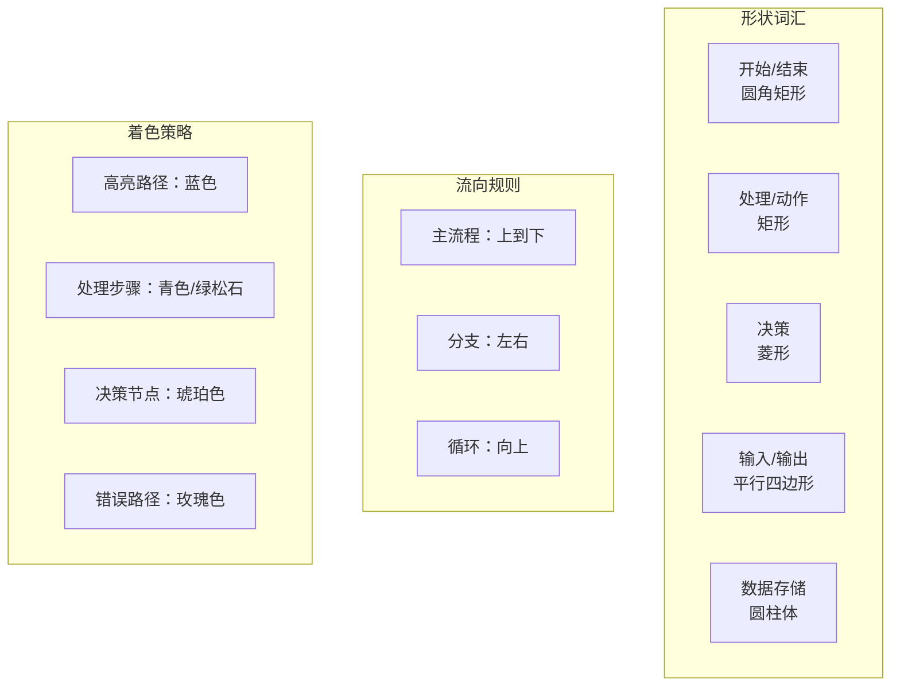
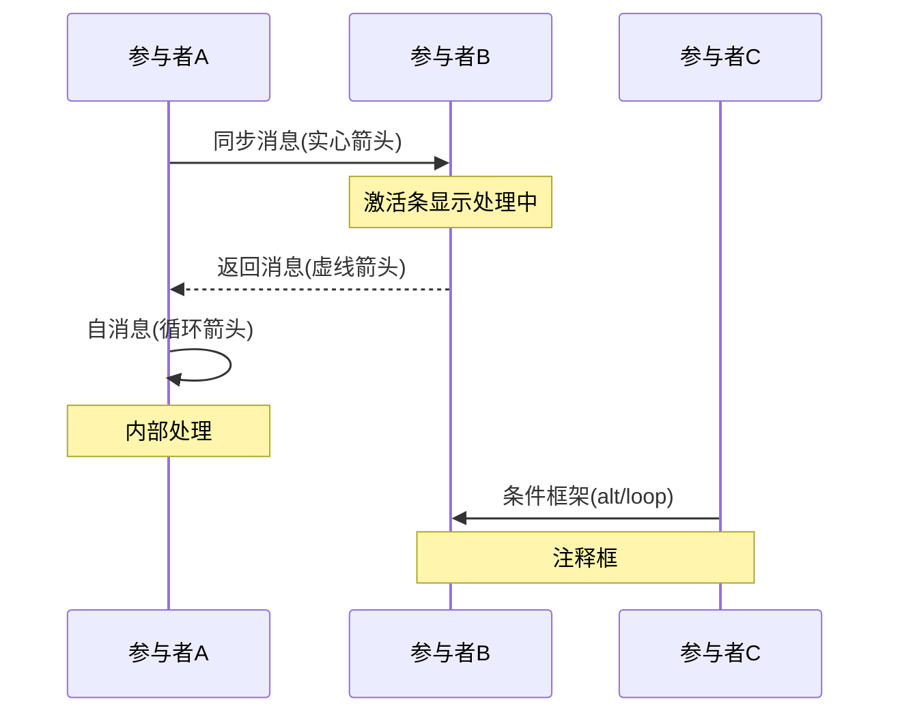
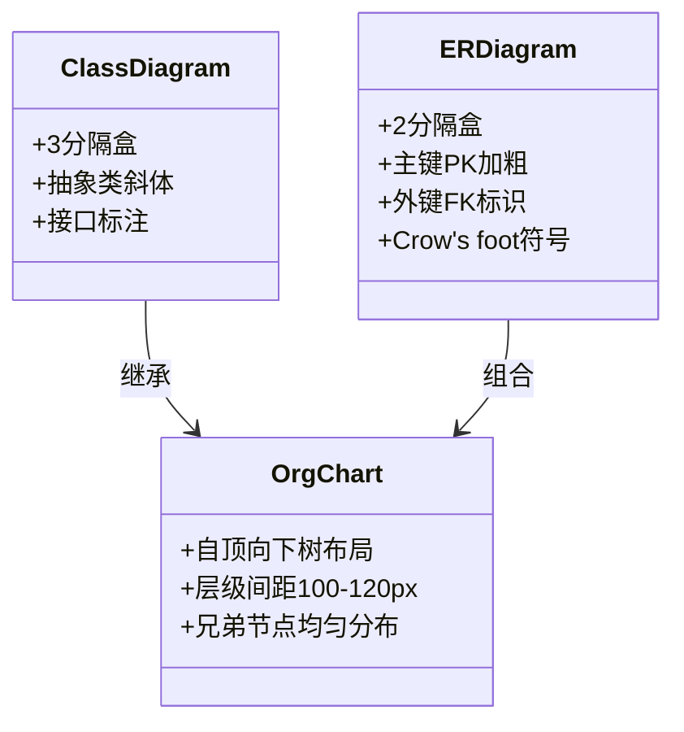

# baoyu-diagram 图表绘制技能

<cite>
**本文档引用的文件**
- [main.ts](file://.agents/skills/baoyu-diagram/scripts/main.ts)
- [SKILL.md](file://.agents/skills/baoyu-diagram/SKILL.md)
- [architecture.md](file://.agents/skills/baoyu-diagram/references/architecture.md)
- [flowchart.md](file://.agents/skills/baoyu-diagram/references/flowchart.md)
- [sequence.md](file://.agents/skills/baoyu-diagram/references/sequence.md)
- [structural.md](file://.agents/skills/baoyu-diagram/references/structural.md)
</cite>

## 目录
1. [简介](#简介)
2. [项目结构](#项目结构)
3. [核心组件](#核心组件)
4. [架构概览](#架构概览)
5. [详细组件分析](#详细组件分析)
6. [依赖关系分析](#依赖关系分析)
7. [性能考虑](#性能考虑)
8. [故障排除指南](#故障排除指南)
9. [结论](#结论)

## 简介

baoyu-diagram 是一个专业的 SVG 图表绘制技能，能够生成多种类型的图表，包括架构图、流程图、序列图、结构图等。该技能专注于创建暗色主题的专业图表，支持中文文本，并提供完整的样式系统和布局算法。

该技能的核心特性：
- 支持多种图表类型：架构图、流程图、序列图、结构图、思维导图、时间线等
- 暗色主题设计系统，包含完整的配色方案
- 响应式 SVG 输出，支持 PNG 导出
- 严格的布局规则和间距规范
- 中文文本支持和字体处理

## 项目结构

baoyu-diagram 技能采用模块化设计，主要包含以下组件：



**图表来源**
- [SKILL.md:1-248](file://.agents/skills/baoyu-diagram/SKILL.md#L1-L248)
- [main.ts:1-101](file://.agents/skills/baoyu-diagram/scripts/main.ts#L1-L101)

**章节来源**
- [SKILL.md:1-248](file://.agents/skills/baoyu-diagram/SKILL.md#L1-L248)

## 核心组件

### 主要图表类型

baoyu-diagram 支持以下八种主要图表类型：

| 类型 | 使用场景 | 关键特征 |
|------|----------|----------|
| **架构图** | 系统组件与关系 | 分组盒子、连接箭头、区域边界 |
| **流程图** | 决策逻辑、流程步骤 | 菱形决策、圆角步骤盒子、方向性流程 |
| **序列图** | 时间顺序的参与者交互 | 垂直线生命线、水平消息、激活条 |
| **结构图** | 类图、ER图、组织架构 | 分隔盒子、类型化关系（继承、组合） |

### 设计系统

#### 配色方案

技能使用统一的暗色主题配色方案：

| 分类 | 填充色 | 描边色 | 用途 |
|------|--------|--------|------|
| 主要 | rgba(8, 51, 68, 0.4) | #22d3ee (青色) | 前端、用户界面、输入 |
| 次要 | rgba(6, 78, 59, 0.4) | #34d399 (绿松石) | 后端、服务、处理 |
| 第三 | rgba(76, 29, 149, 0.4) | #a78bfa (紫罗兰) | 数据库、存储、持久化 |
| 强调 | rgba(120, 53, 15, 0.3) | #fbbf24 (琥珀) | 云、基础设施、区域 |
| 警告 | rgba(136, 19, 55, 0.4) | #fb7185 (玫瑰) | 安全、错误、警告 |
| 连接器 | rgba(251, 146, 60, 0.3) | #fb923c (橙色) | 总线、队列、中间件 |
| 中性 | rgba(30, 41, 59, 0.5) | #94a3b8 (浅灰) | 外部、通用、未知 |
| 高亮 | rgba(59, 130, 246, 0.3) | #60a5fa (蓝色) | 活跃状态、焦点、当前步骤 |

#### 字体系统

使用嵌入式 SVG `@font-face` 或系统等宽字体回退：

- **标题**: 16px，权重 700
- **组件名称**: 11-12px，权重 600  
- **子标签/描述**: 9px，权重 400，颜色 #94a3b8
- **注释/说明**: 8px，权重 400
- **小标签（箭头上）**: 7-8px

#### 背景与网格

- **背景**: #0f172a (slate-900) 带细微网格
- **网格模式**: 40x40 像素，#1e293b 线条，0.5px 线宽

**章节来源**
- [SKILL.md:24-248](file://.agents/skills/baoyu-diagram/SKILL.md#L24-L248)

## 架构概览

baoyu-diagram 的整体架构分为三个层次：



**图表来源**
- [SKILL.md:176-248](file://.agents/skills/baoyu-diagram/SKILL.md#L176-L248)
- [main.ts:32-51](file://.agents/skills/baoyu-diagram/scripts/main.ts#L32-L51)

### 图表类型选择机制

图表类型的选择基于用户请求的语义分析：



**图表来源**
- [SKILL.md:10-23](file://.agents/skills/baoyu-diagram/SKILL.md#L10-L23)
- [SKILL.md:176-199](file://.agents/skills/baoyu-diagram/SKILL.md#L176-L199)

## 详细组件分析

### SVG 转 PNG 转换器

主转换器负责将生成的 SVG 文件转换为高分辨率 PNG 图像：



**图表来源**
- [main.ts:5-10](file://.agents/skills/baoyu-diagram/scripts/main.ts#L5-L10)
- [main.ts:32-51](file://.agents/skills/baoyu-diagram/scripts/main.ts#L32-L51)

#### 核心功能分析

**视口解析函数** (`parseViewBox`)
- 提取 SVG 的 viewBox 属性
- 解析 width 和 height 属性作为后备方案
- 返回标准化的尺寸对象

**输出路径生成** (`getOutputPath`)
- 支持自定义输出路径
- 默认生成 `@{scale}x` 后缀
- 自动创建输出目录

**转换流程** (`convert`)
- 读取 SVG 文件内容
- 解析视口尺寸
- 使用 sharp 库进行高分辨率渲染
- 支持缩放因子调整

**参数解析** (`parseArgs`)
- 支持命令行参数：`-o/--output`, `-s/--scale`, `--json`, `-h/--help`
- 输入验证和错误处理
- 默认值设置

**章节来源**
- [main.ts:12-51](file://.agents/skills/baoyu-diagram/scripts/main.ts#L12-L51)
- [main.ts:65-80](file://.agents/skills/baoyu-diagram/scripts/main.ts#L65-L80)

### 架构图布局引擎

架构图遵循特定的布局算法和流向规则：

```mermaid
flowchart LR
subgraph "架构图布局算法"
A[识别层级] --> B[分配列/行]
B --> C[层内堆叠]
C --> D[绘制区域边界]
D --> E[连接器路由]
end
subgraph "流向选择"
F[左到右(LTR)] --> G[数据管道]
H[上到下(TTB)] --> I[分层架构]
end
subgraph "连接器策略"
J[优先直角线] --> K[L形路径]
K --> L[透明度控制]
end
```

**图表来源**
- [architecture.md:9-15](file://.agents/skills/baoyu-diagram/references/architecture.md#L9-L15)
- [architecture.md:40-48](file://.agents/skills/baoyu-diagram/references/architecture.md#L40-L48)

#### 核心布局规则

**层级识别** (`identify layers`)
- 客户端层：浏览器、移动应用、API 客户端
- 网关层：负载均衡器、API 网关
- 服务层：认证服务、用户服务、订单服务
- 数据层：Redis、PostgreSQL、S3 存储桶

**区域边界** (`region boundaries`)
- 使用虚线矩形框定共享基础设施的组
- 不同嵌套级别的区域使用不同的虚线模式
- 外层：`stroke-dasharray="12,4"`
- 中层：`stroke-dasharray="8,4"`
- 内层：`stroke-dasharray="4,4"`

**消息总线模式** (`message bus`)
- 在服务层之间绘制水平连接条
- 使用强调色（橙色）表示总线
- 支持事件驱动的通信模式

**章节来源**
- [architecture.md:17-38](file://.agents/skills/baoyu-diagram/references/architecture.md#L17-L38)
- [architecture.md:50-75](file://.agents/skills/baoyu-diagram/references/architecture.md#L50-L75)

### 流程图布局引擎

流程图遵循严格的形状词汇和流向规则：



**图表来源**
- [flowchart.md:3-11](file://.agents/skills/baoyu-diagram/references/flowchart.md#L3-L11)
- [flowchart.md:13-15](file://.agents/skills/baoyu-diagram/references/flowchart.md#L13-L15)
- [flowchart.md:47-53](file://.agents/skills/baoyu-diagram/references/flowchart.md#L47-L53)

#### 核心算法

**主路径识别** (`identify main path`)
- 确定最常见或最短的执行路径
- 将主路径保持在中心位置
- 分支路径向左右扩展

**分支路由** (`branch routing`)
- "是"/"是"路径继续向下
- "否"/"否"路径向右（或向左）
- 使用 L 形连接器合并路径

**复杂流程图处理** (`complex flowcharts`)
- 10+ 步骤时使用泳道分组
- 添加阶段标题栏
- 使用架构图的区域边界模式

**章节来源**
- [flowchart.md:17-22](file://.agents/skills/baoyu-diagram/references/flowchart.md#L17-L22)
- [flowchart.md:55-61](file://.agents/skills/baoyu-diagram/references/flowchart.md#L55-L61)

### 序列图布局引擎

序列图专注于时间顺序的交互表示：



**图表来源**
- [sequence.md:17-23](file://.agents/skills/baoyu-diagram/references/sequence.md#L17-L23)
- [sequence.md:37-51](file://.agents/skills/baoyu-diagram/references/sequence.md#L37-L51)

#### 核心元素

**参与者布局** (`actor placement`)
- 水平均匀分布，150-200px 间距
- 每个参与者顶部绘制矩形框
- 垂直线生命线向下延伸

**消息类型** (`message types`)
- 同步消息：实心箭头，请求或调用
- 异步消息：开放箭头头，发送即忘
- 返回消息：虚线箭头，响应

**激活条** (`activation bars`)
- 10px 宽，居中于生命线
- 跨越从进入消息到离开消息的时间段

**编号系统** (`numbering`)
- 复杂序列（8+ 消息）时为每个消息编号
- 使用圆形标记 + 数字

**章节来源**
- [sequence.md:25-35](file://.agents/skills/baoyu-diagram/references/sequence.md#L25-L35)
- [sequence.md:74-81](file://.agents/skills/baoyu-diagram/references/sequence.md#L74-L81)

### 结构图布局引擎

结构图涵盖多种 UML 图表类型：



**图表来源**
- [structural.md:5-31](file://.agents/skills/baoyu-diagram/references/structural.md#L5-L31)
- [structural.md:70-94](file://.agents/skills/baoyu-diagram/references/structural.md#L70-L94)

#### 关系类型

**UML 关系** (`UML relationships`)
- 继承：实线 + 空心三角形指向父类
- 实现：虚线 + 空心三角形指向接口
- 组合：实线 + 实心菱形（拥有者端）
- 聚合：实线 + 空心菱形（拥有者端）
- 依赖：虚线 + 开放箭头（目标端）
- 关联：实线 + 开放箭头或无箭头

**实体关系图** (`ER diagram`)
- 使用 2 分隔盒（实体名 + 属性）
- 主键：`PK` 前缀 + 加粗
- 外键：`FK` 前缀
- 多对多关系：Crow's foot 符号

**组织架构图** (`org chart`)
- 自顶向下树形布局
- 根节点位于顶部中央
- 每层垂直间距 100-120px
- 兄弟节点水平均匀分布
- 连接线：从父节点底部中心到水平梁，再到每个子节点顶部中心

**章节来源**
- [structural.md:32-60](file://.agents/skills/baoyu-diagram/references/structural.md#L32-L60)
- [structural.md:70-101](file://.agents/skills/baoyu-diagram/references/structural.md#L70-L101)

## 依赖关系分析

baoyu-diagram 技能的依赖关系相对简单，主要依赖于 sharp 库进行图像处理：

```mermaid
graph TB
subgraph "外部依赖"
SHARP[sharp@latest<br/>图像处理]
FS[fs<br/>文件系统操作]
PATH[path<br/>路径处理]
end
subgraph "内部组件"
MAIN[main.ts<br/>主转换器]
ARCH[architecture.md<br/>架构图参考]
FLOW[flowchart.md<br/>流程图参考]
SEQ[sequence.md<br/>序列图参考]
STRUCT[structural.md<br/>结构图参考]
end
MAIN --> SHARP
MAIN --> FS
MAIN --> PATH
SKILL[SKILL.md] --> ARCH
SKILL --> FLOW
SKILL --> SEQ
SKILL --> STRUCT
```

**图表来源**
- [main.ts:1-4](file://.agents/skills/baoyu-diagram/scripts/main.ts#L1-L4)
- [SKILL.md:176-199](file://.agents/skills/baoyu-diagram/SKILL.md#L176-L199)

### 外部依赖

**sharp 库** (`sharp`)
- 用于 SVG 到 PNG 的高分辨率转换
- 支持密度设置（72 * scale）
- 提供 resize 和 PNG 编码功能

**Node.js 核心模块**
- `fs`: 文件系统操作，读取 SVG 文件
- `path`: 路径处理，生成输出文件名

### 内部依赖

**参考文档系统**
- 每种图表类型都有专门的布局参考文档
- 参考文档包含具体的布局算法和示例
- 技能通过读取这些参考文档来确定布局策略

**设计系统依赖**
- 所有图表都遵循统一的设计系统
- 配色方案、字体、间距规则在所有图表中保持一致

**章节来源**
- [main.ts:41](file://.agents/skills/baoyu-diagram/scripts/main.ts#L41)
- [SKILL.md:176-178](file://.agents/skills/baoyu-diagram/SKILL.md#L176-L178)

## 性能考虑

### 渲染性能优化

**分辨率控制**
- 默认缩放因子为 2，生成 @2x PNG
- 支持自定义缩放因子，平衡质量与文件大小
- 使用密度参数（72 * scale）确保高质量渲染

**内存管理**
- 异步处理避免阻塞主线程
- 及时释放文件句柄和内存资源
- 错误处理确保异常情况下的资源清理

**文件 I/O 优化**
- 批量处理多个图表时复用文件句柄
- 预检查文件存在性和类型
- 自动创建必要的输出目录

### 图表生成优化

**布局算法效率**
- 预计算组件尺寸和间距
- 使用缓存避免重复计算
- 优化 SVG 元素的生成顺序

**样式应用优化**
- 批量应用样式规则
- 避免重复的样式声明
- 使用 CSS 类和 ID 减少冗余

## 故障排除指南

### 常见问题及解决方案

**SVG 尺寸解析失败**
- **症状**: "无法从 viewBox 或 width/height 属性确定 SVG 尺寸"
- **原因**: SVG 文件缺少有效的尺寸信息
- **解决**: 确保 SVG 包含正确的 viewBox 或 width/height 属性

**输入文件类型错误**
- **症状**: "输入必须是 SVG 文件"
- **原因**: 提供了非 SVG 格式的文件
- **解决**: 确保输入文件具有 .svg 扩展名

**输出路径权限问题**
- **症状**: 文件写入失败
- **原因**: 输出目录没有写入权限
- **解决**: 检查输出目录权限，确保可写

**Bun 运行时问题**
- **症状**: bun 命令未找到
- **原因**: 系统缺少 Bun 运行时
- **解决**: 安装 Bun 或使用 npx -y bun 替代

### 调试技巧

**JSON 输出模式**
- 使用 `--json` 参数获取详细的转换信息
- 包含输入路径、输出路径、最终尺寸等信息

**帮助系统**
- 使用 `-h` 或 `--help` 获取完整的使用说明
- 查看所有可用的命令行选项

**章节来源**
- [main.ts:36](file://.agents/skills/baoyu-diagram/scripts/main.ts#L36)
- [main.ts:87-88](file://.agents/skills/baoyu-diagram/scripts/main.ts#L87-L88)
- [main.ts:53-63](file://.agents/skills/baoyu-diagram/scripts/main.ts#L53-L63)

## 结论

baoyu-diagram 技能是一个功能完整、设计精良的图表生成工具。它通过以下关键特性提供了卓越的用户体验：

**技术优势**
- 统一的设计系统确保视觉一致性
- 严格的布局规则保证图表的专业性
- 多种图表类型覆盖广泛的应用场景
- 高质量的 SVG 输出和 PNG 导出

**实用性特点**
- 支持中文文本和字体处理
- 灵活的配置选项和参数控制
- 完善的错误处理和调试支持
- 易于集成和扩展的架构设计

**应用场景**
- 系统架构设计和文档
- 流程分析和优化
- 交互设计和原型制作
- 教育和培训材料
- 技术演示和展示

该技能为开发者和设计师提供了一个强大而易用的图表生成解决方案，能够满足各种技术可视化需求。