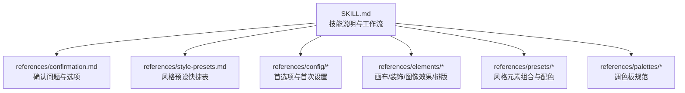
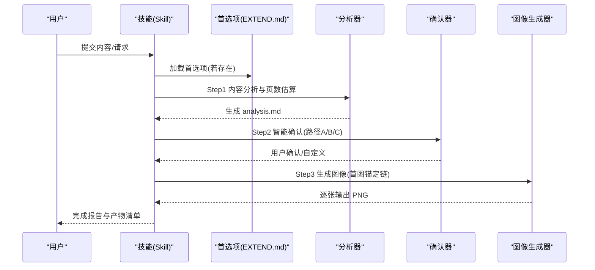
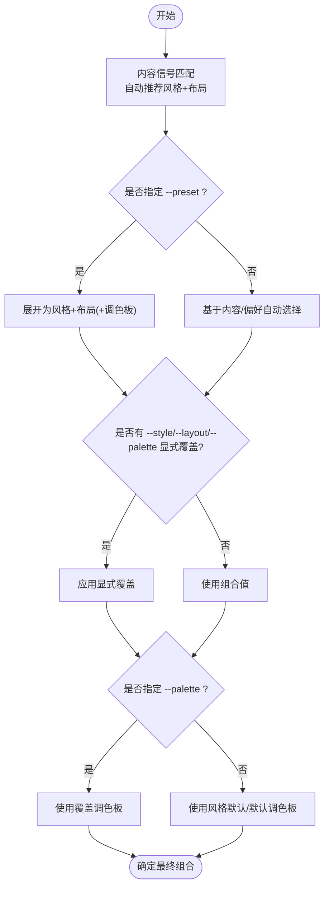
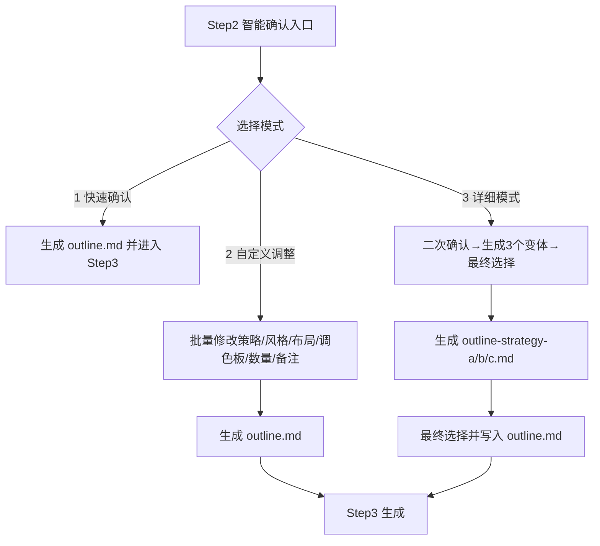
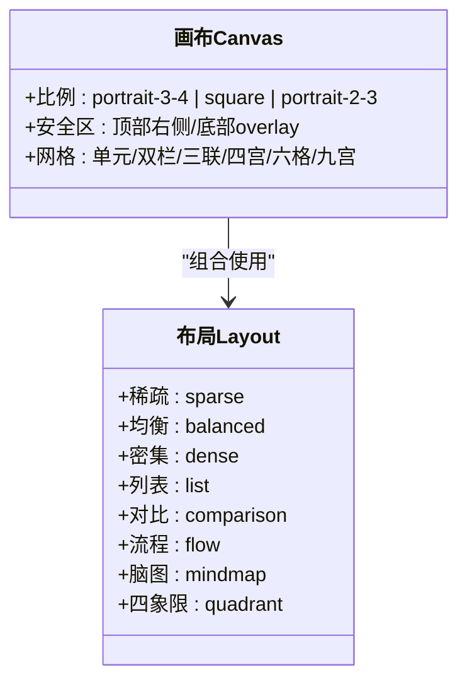
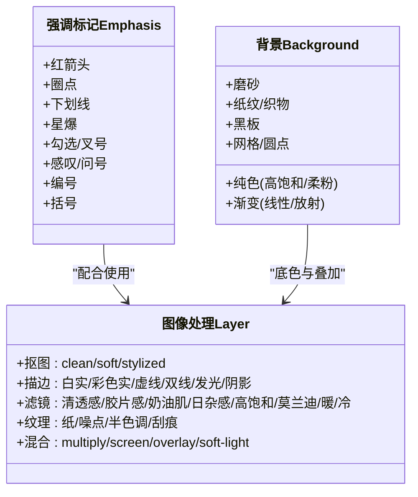
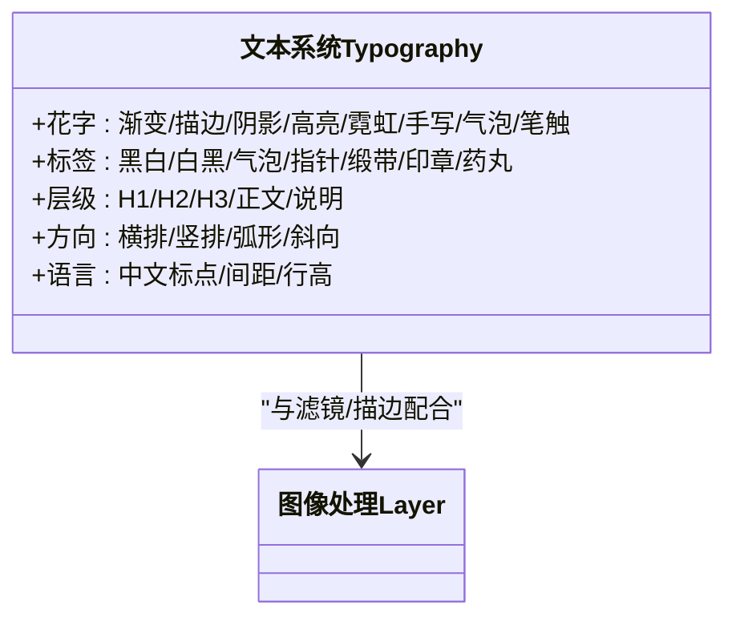
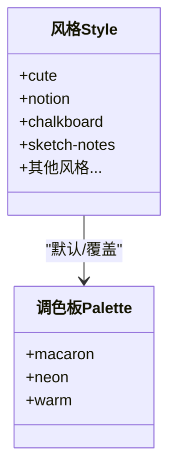
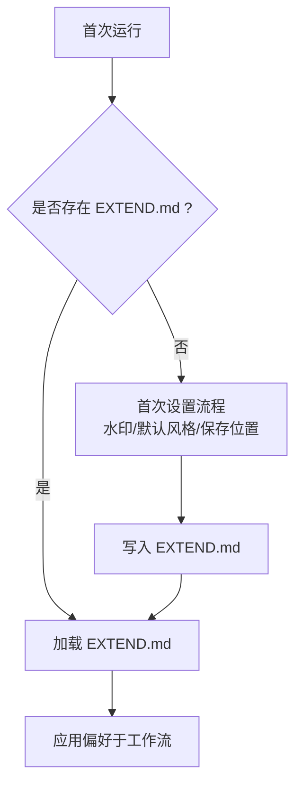
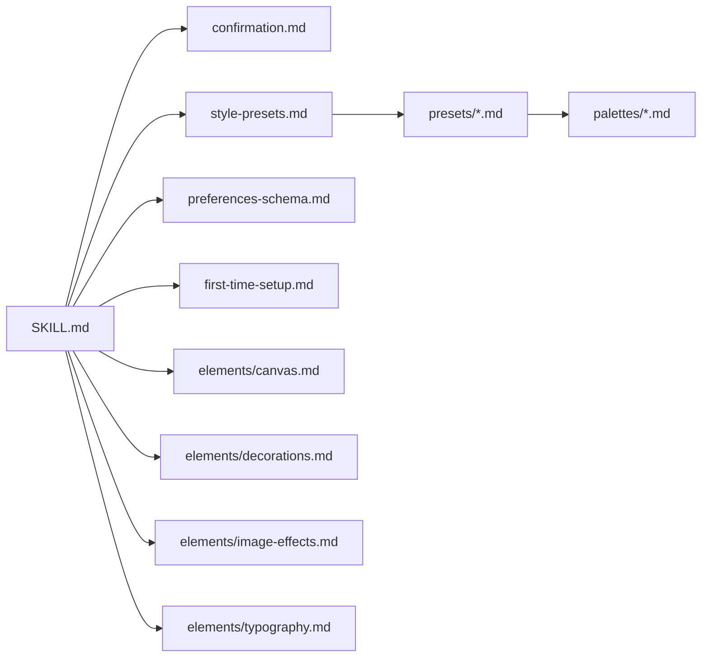

# baoyu-image-cards 图像卡片技能

<cite>
**本文引用的文件**
- [SKILL.md](file://.agents/skills/baoyu-image-cards/SKILL.md)
- [confirmation.md](file://.agents/skills/baoyu-image-cards/references/confirmation.md)
- [style-presets.md](file://.agents/skills/baoyu-image-cards/references/style-presets.md)
- [preferences-schema.md](file://.agents/skills/baoyu-image-cards/references/config/preferences-schema.md)
- [first-time-setup.md](file://.agents/skills/baoyu-image-cards/references/config/first-time-setup.md)
- [canvas.md](file://.agents/skills/baoyu-image-cards/references/elements/canvas.md)
- [decorations.md](file://.agents/skills/baoyu-image-cards/references/elements/decorations.md)
- [image-effects.md](file://.agents/skills/baoyu-image-cards/references/elements/image-effects.md)
- [typography.md](file://.agents/skills/baoyu-image-cards/references/elements/typography.md)
- [cute.md](file://.agents/skills/baoyu-image-cards/references/presets/cute.md)
- [notion.md](file://.agents/skills/baoyu-image-cards/references/presets/notion.md)
- [chalkboard.md](file://.agents/skills/baoyu-image-cards/references/presets/chalkboard.md)
- [sketch-notes.md](file://.agents/skills/baoyu-image-cards/references/presets/sketch-notes.md)
- [macaron.md](file://.agents/skills/baoyu-image-cards/references/palettes/macaron.md)
- [neon.md](file://.agents/skills/baoyu-image-cards/references/palettes/neon.md)
</cite>

## 目录
1. [简介](#简介)
2. [项目结构](#项目结构)
3. [核心组件](#核心组件)
4. [架构总览](#架构总览)
5. [详细组件分析](#详细组件分析)
6. [依赖关系分析](#依赖关系分析)
7. [性能与一致性建议](#性能与一致性建议)
8. [故障排查指南](#故障排查指南)
9. [结论](#结论)
10. [附录](#附录)

## 简介
baoyu-image-cards 是一个面向社交平台（尤其是小红书风格）的图像卡片系列生成技能。它将复杂内容拆分为 1–10 张卡通风格的图像卡片，覆盖封面、正文与结尾三段式结构，并通过“风格 × 布局 × 调色板”的自由组合，提供多种视觉表达路径。技能内置智能确认机制与工作流，确保在生成前完成内容理解、策略选择与风格布局确认；同时支持参考图像叠加、水印、首选项管理与多后端图像生成工具选择。

## 项目结构
技能位于 .agents/skills/baoyu-image-cards，核心由以下部分组成：
- 技能说明与工作流：SKILL.md
- 确认与选项：references/confirmation.md
- 预设与快捷组合：references/style-presets.md
- 配置与首选项：references/config/*
- 元素规范：references/elements/*
- 风格与调色板：references/presets/* 与 references/palettes/*

图表来源
- [SKILL.md:275-432](file://.agents/skills/baoyu-image-cards/SKILL.md#L275-L432)
- [confirmation.md:1-157](file://.agents/skills/baoyu-image-cards/references/confirmation.md#L1-L157)
- [style-presets.md:1-44](file://.agents/skills/baoyu-image-cards/references/style-presets.md#L1-L44)
- [preferences-schema.md:1-124](file://.agents/skills/baoyu-image-cards/references/config/preferences-schema.md#L1-L124)
- [canvas.md:1-123](file://.agents/skills/baoyu-image-cards/references/elements/canvas.md#L1-L123)
- [decorations.md:1-153](file://.agents/skills/baoyu-image-cards/references/elements/decorations.md#L1-L153)
- [image-effects.md:1-93](file://.agents/skills/baoyu-image-cards/references/elements/image-effects.md#L1-L93)
- [typography.md:1-97](file://.agents/skills/baoyu-image-cards/references/elements/typography.md#L1-L97)
- [cute.md:1-73](file://.agents/skills/baoyu-image-cards/references/presets/cute.md#L1-L73)
- [notion.md:1-74](file://.agents/skills/baoyu-image-cards/references/presets/notion.md#L1-L74)
- [chalkboard.md:1-98](file://.agents/skills/baoyu-image-cards/references/presets/chalkboard.md#L1-L98)
- [sketch-notes.md:1-101](file://.agents/skills/baoyu-image-cards/references/presets/sketch-notes.md#L1-L101)
- [macaron.md:1-34](file://.agents/skills/baoyu-image-cards/references/palettes/macaron.md#L1-L34)
- [neon.md:1-33](file://.agents/skills/baoyu-image-cards/references/palettes/neon.md#L1-L33)

章节来源
- [SKILL.md:258-432](file://.agents/skills/baoyu-image-cards/SKILL.md#L258-L432)

## 核心组件
- 风格系统（12 种风格）：cute、fresh、warm、bold、minimal、retro、pop、notion、chalkboard、study-notes、screen-print、sketch-notes
- 布局系统（8 种布局）：sparse、balanced、dense、list、comparison、flow、mindmap、quadrant
- 调色板（可选覆盖）：macaron、warm、neon
- 预设快捷（preset）：将风格 + 布局 + 可选调色板组合封装，便于快速启动
- 确认机制：Step 2 的智能确认，支持快速确认、自定义调整与详细模式
- 参考图像：用户提供的参考图可作为风格/色彩提取或直接传递给后端锚定首图
- 文件与目录：analysis.md、outline*.md、prompts/*.md、PNG 输出、refs/

章节来源
- [SKILL.md:55-125](file://.agents/skills/baoyu-image-cards/SKILL.md#L55-L125)
- [SKILL.md:126-220](file://.agents/skills/baoyu-image-cards/SKILL.md#L126-L220)
- [SKILL.md:275-432](file://.agents/skills/baoyu-image-cards/SKILL.md#L275-L432)

## 架构总览
技能采用“分析 → 确认 → 生成 → 报告”的流水线式工作流，强调视觉一致性与可编辑性。

图表来源
- [SKILL.md:275-432](file://.agents/skills/baoyu-image-cards/SKILL.md#L275-L432)
- [confirmation.md:5-157](file://.agents/skills/baoyu-image-cards/references/confirmation.md#L5-L157)

## 详细组件分析

### 组件一：风格 × 布局 × 调色板矩阵与预设
- 风格维度：12 种风格，每种风格定义画布比例、网格、图像效果、排版与装饰元素组合，并给出最佳布局搭配与适用场景。
- 布局维度：8 种布局，按信息密度与结构划分，覆盖 sparse/balanced/dense 与 list/comparison/flow/mindmap/quadrant。
- 调色板维度：可覆盖风格默认色，仅替换颜色不改变渲染规则；部分风格有默认调色板（如 sketch-notes 默认 macaron）。
- 预设维度：preset 将风格 + 布局 + 可选调色板打包，CLI 支持 --preset 与 --style/--layout/--palette 的显式覆盖。

图表来源
- [SKILL.md:126-220](file://.agents/skills/baoyu-image-cards/SKILL.md#L126-L220)
- [style-presets.md:1-44](file://.agents/skills/baoyu-image-cards/references/style-presets.md#L1-L44)
- [sketch-notes.md:4](file://.agents/skills/baoyu-image-cards/references/presets/sketch-notes.md#L4-L4)

章节来源
- [SKILL.md:80-125](file://.agents/skills/baoyu-image-cards/SKILL.md#L80-L125)
- [style-presets.md:5-44](file://.agents/skills/baoyu-image-cards/references/style-presets.md#L5-L44)
- [sketch-notes.md:37-39](file://.agents/skills/baoyu-image-cards/references/presets/sketch-notes.md#L37-L39)

### 组件二：确认机制与工作流路径
- Step 2 智能确认：展示分析摘要与推荐方案，提供三种路径：
  - 路径 A：快速确认，信任推荐并生成 outline.md 后进入 Step 3
  - 路径 B：自定义调整，一次性批量修改策略/风格/布局/调色板/数量/备注
  - 路径 C：详细模式，先二次确认理解内容，再生成三个不同 outline 变体供选择
- 确认问题与选项：references/confirmation.md 提供标准问答文案与前端数据结构，便于不同运行时适配。

图表来源
- [SKILL.md:309-341](file://.agents/skills/baoyu-image-cards/SKILL.md#L309-L341)
- [confirmation.md:5-157](file://.agents/skills/baoyu-image-cards/references/confirmation.md#L5-L157)

章节来源
- [SKILL.md:309-341](file://.agents/skills/baoyu-image-cards/SKILL.md#L309-L341)
- [confirmation.md:21-124](file://.agents/skills/baoyu-image-cards/references/confirmation.md#L21-L124)

### 组件三：画布元素与排版设置
- 画布与安全区：提供 3:4/1:1/2:3 的像素尺寸与安全区提示，避免移动端交互遮挡区域。
- 布局密度与结构：sparse/balanced/dense 对应低中高密度；list/comparison/flow/mindmap/quadrant 对应枚举、对比、流程、思维导图与四象限。
- 布局位置建议：封面用 sparse，结尾用 sparse 或 balanced，中间内容根据密度选择。

图表来源
- [canvas.md:5-123](file://.agents/skills/baoyu-image-cards/references/elements/canvas.md#L5-L123)

章节来源
- [canvas.md:5-123](file://.agents/skills/baoyu-image-cards/references/elements/canvas.md#L5-L123)

### 组件四：装饰效果与图像处理层
- 强调标记：星爆、爱心、下划线、箭头、勾选/叉号等
- 背景与纹理：纯色、渐变、磨砂玻璃、纸纹、织物、黑板、网格、圆点等
- 图像处理：抠图（clean/soft/stylized）、描边（白实/彩色实/虚线/双线/发光/阴影）、滤镜（清透感/胶片感/奶油肌/日杂感/高饱和/莫兰迪/暖色调/冷色调）、纹理叠加与混合模式
- 风格化组合：不同风格的常见效果堆叠建议（如 cute 的 clear-glow + 白色描边，notion 的轻微纹理 + 白描边）

图表来源
- [decorations.md:5-153](file://.agents/skills/baoyu-image-cards/references/elements/decorations.md#L5-L153)
- [image-effects.md:5-93](file://.agents/skills/baoyu-image-cards/references/elements/image-effects.md#L5-L93)

章节来源
- [decorations.md:5-153](file://.agents/skills/baoyu-image-cards/references/elements/decorations.md#L5-L153)
- [image-effects.md:5-93](file://.agents/skills/baoyu-image-cards/references/elements/image-effects.md#L5-L93)

### 组件五：排版与文字系统
- 花字与标签：渐变、描边、阴影、高亮、霓虹、手写、气泡、笔触等装饰文本；黑白/白黑标签、气泡标签、指针、缎带、印章、药丸等结构化标签
- 文本层级：H1/H2/H3/正文/说明的相对字号与字重建议
- 文字方向：横排/竖排/弧形/斜向
- 语言考虑：中文标点、字符间距、行高与英数风格一致性
- 风格化排版：cute 的圆润气泡字+粉色点缀；notion 的简洁手写字+无装饰；chalkboard 的粉笔质感与多色书写

图表来源
- [typography.md:1-97](file://.agents/skills/baoyu-image-cards/references/elements/typography.md#L1-L97)

章节来源
- [typography.md:1-97](file://.agents/skills/baoyu-image-cards/references/elements/typography.md#L1-L97)

### 组件六：风格与调色板详解
- cute：圆润气泡字体、柔和阴影、粉色系与爱心/星星/花朵装饰；适合生活方式、美妆、穿搭与个人分享
- notion：极简手绘线条、单色/淡彩块面、最大留白；适合知识类、生产力、技术教程
- chalkboard：黑板背景+彩色粉笔手绘；适合教学、教程、课堂主题
- sketch-notes：手绘教育风，稍带抖动感，macaron 默认配色；适合知识总结、流程图、概念图
- 调色板：
  - macaron：暖奶油背景 + 柔粉/薰衣草/薄荷/桃粉区块 + 珊瑚红强调，温和亲和
  - neon：深紫背景 + 霓虹青/洋红/绿/粉 + 电黄强调，高能量未来感

图表来源
- [cute.md:1-73](file://.agents/skills/baoyu-image-cards/references/presets/cute.md#L1-L73)
- [notion.md:1-74](file://.agents/skills/baoyu-image-cards/references/presets/notion.md#L1-L74)
- [chalkboard.md:1-98](file://.agents/skills/baoyu-image-cards/references/presets/chalkboard.md#L1-L98)
- [sketch-notes.md:1-101](file://.agents/skills/baoyu-image-cards/references/presets/sketch-notes.md#L1-L101)
- [macaron.md:1-34](file://.agents/skills/baoyu-image-cards/references/palettes/macaron.md#L1-L34)
- [neon.md:1-33](file://.agents/skills/baoyu-image-cards/references/palettes/neon.md#L1-L33)

章节来源
- [cute.md:10-73](file://.agents/skills/baoyu-image-cards/references/presets/cute.md#L10-L73)
- [notion.md:10-74](file://.agents/skills/baoyu-image-cards/references/presets/notion.md#L10-L74)
- [chalkboard.md:10-98](file://.agents/skills/baoyu-image-cards/references/presets/chalkboard.md#L10-L98)
- [sketch-notes.md:11-101](file://.agents/skills/baoyu-image-cards/references/presets/sketch-notes.md#L11-L101)
- [macaron.md:10-34](file://.agents/skills/baoyu-image-cards/references/palettes/macaron.md#L10-L34)
- [neon.md:10-33](file://.agents/skills/baoyu-image-cards/references/palettes/neon.md#L10-L33)

### 组件七：首选项与配置
- EXTEND.md 支持：水印开关/内容/位置、默认风格/布局、语言、图像后端偏好、自定义风格
- 首次设置：引导用户完成水印、默认风格、保存位置等基础配置，保证后续流程可预测
- 偏好变更：支持直接编辑、重新配置或常用一键修改（如固定后端、切换默认风格/布局/调色板/语言）

图表来源
- [SKILL.md:285-299](file://.agents/skills/baoyu-image-cards/SKILL.md#L285-L299)
- [first-time-setup.md:1-123](file://.agents/skills/baoyu-image-cards/references/config/first-time-setup.md#L1-L123)
- [preferences-schema.md:1-124](file://.agents/skills/baoyu-image-cards/references/config/preferences-schema.md#L1-L124)

章节来源
- [SKILL.md:285-299](file://.agents/skills/baoyu-image-cards/SKILL.md#L285-L299)
- [first-time-setup.md:20-123](file://.agents/skills/baoyu-image-cards/references/config/first-time-setup.md#L20-L123)
- [preferences-schema.md:8-124](file://.agents/skills/baoyu-image-cards/references/config/preferences-schema.md#L8-L124)

## 依赖关系分析
- 工作流依赖：确认机制依赖 analysis.md 与推荐策略；生成阶段依赖 prompts/*.md 与后端工具解析逻辑
- 元素依赖：风格定义依赖 elements/* 与 palettes/*；预设依赖 style-presets.md 与各风格的 frontmatter
- 配置依赖：EXTEND.md 影响后端选择、水印、语言与默认风格/布局

图表来源
- [SKILL.md:414-432](file://.agents/skills/baoyu-image-cards/SKILL.md#L414-L432)
- [confirmation.md:1-157](file://.agents/skills/baoyu-image-cards/references/confirmation.md#L1-L157)
- [style-presets.md:1-44](file://.agents/skills/baoyu-image-cards/references/style-presets.md#L1-L44)
- [preferences-schema.md:1-124](file://.agents/skills/baoyu-image-cards/references/config/preferences-schema.md#L1-L124)
- [first-time-setup.md:1-123](file://.agents/skills/baoyu-image-cards/references/config/first-time-setup.md#L1-L123)
- [canvas.md:1-123](file://.agents/skills/baoyu-image-cards/references/elements/canvas.md#L1-L123)
- [decorations.md:1-153](file://.agents/skills/baoyu-image-cards/references/elements/decorations.md#L1-L153)
- [image-effects.md:1-93](file://.agents/skills/baoyu-image-cards/references/elements/image-effects.md#L1-L93)
- [typography.md:1-97](file://.agents/skills/baoyu-image-cards/references/elements/typography.md#L1-L97)

## 性能与一致性建议
- 首图锚定链：先生成封面（image-1）不带参考，随后对后续图像统一传入 image-1 作为参考，确保角色/主色/风格一致性
- Session ID：若后端支持，使用 cards-{slug}-{timestamp} 作为会话标识，结合参考链进一步稳定生成
- Prompt 文件优先：在调用任何后端前，必须先写出 prompts/NN-*.md，以便复现与回溯
- 后端选择：优先使用运行时原生图像工具，其次自动选择唯一非原生后端，否则询问用户
- 失败重试：生成失败时自动重试一次，再上报错误

章节来源
- [SKILL.md:342-370](file://.agents/skills/baoyu-image-cards/SKILL.md#L342-L370)

## 故障排查指南
- 未找到 EXTEND.md：首次运行会被阻塞至完成首次设置；若使用 --yes 则跳过设置，使用内置默认
- 确认缺失：Step 2 为硬性必经步骤；若未完成确认即开始生成，需先回到确认阶段
- 后端不可用：当没有可用后端时，按规则提示用户并允许选择；必要时改用 --yes 使用首选项
- 参考图像冲突：image-1 的 direct 用法作为锚定链，后续图像不再重复叠加用户参考，避免信号冲突
- 水印问题：检查 EXTEND.md 中 watermark.enabled/content/position 是否正确；水印文案需与目标平台合规

章节来源
- [SKILL.md:285-300](file://.agents/skills/baoyu-image-cards/SKILL.md#L285-L300)
- [SKILL.md:342-370](file://.agents/skills/baoyu-image-cards/SKILL.md#L342-L370)
- [SKILL.md:357-364](file://.agents/skills/baoyu-image-cards/SKILL.md#L357-L364)

## 结论
baoyu-image-cards 通过“风格 × 布局 × 调色板”的自由组合与智能确认机制，为社交平台内容提供了高度可定制且视觉一致的图像卡片系列生成能力。其清晰的工作流、完善的元素规范与可编辑的提示文件，既满足规模化生产，也保留了创作弹性。配合 EXTEND.md 首选项与参考图像机制，可在不同后端与品牌风格间灵活切换，实现高质量、可追溯的图像内容产出。

## 附录

### 使用示例与最佳实践
- 快速启动
  - 使用 --preset 快速组合：如 --preset cute-share、--preset knowledge-card、--preset poster 等
  - 在 --yes 下直接生成：跳过确认，使用 EXTEND.md 或内置默认
- 自定义调整
  - Step 2B：一次性批量修改策略/风格/布局/调色板/数量/备注，适合已有明确想法的场景
- 详细模式
  - Step 2C：先理解卖点/受众/语气，再生成三个 outline 变体，最后合并选择，适合创意探索
- 参考图像
  - --ref 用于风格/色彩提取或直接传递到首图锚定链；注意后续图像不再重复叠加用户参考
- 首选项管理
  - 通过 EXTEND.md 设置水印、默认风格/布局、语言与后端偏好；支持重新配置与常用一键修改

章节来源
- [SKILL.md:275-432](file://.agents/skills/baoyu-image-cards/SKILL.md#L275-L432)
- [confirmation.md:21-157](file://.agents/skills/baoyu-image-cards/references/confirmation.md#L21-L157)
- [style-presets.md:5-44](file://.agents/skills/baoyu-image-cards/references/style-presets.md#L5-L44)
- [preferences-schema.md:14-56](file://.agents/skills/baoyu-image-cards/references/config/preferences-schema.md#L14-L56)