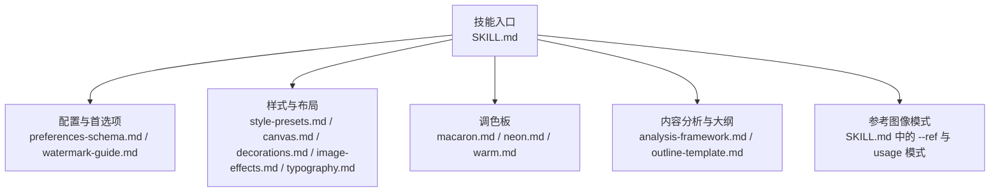
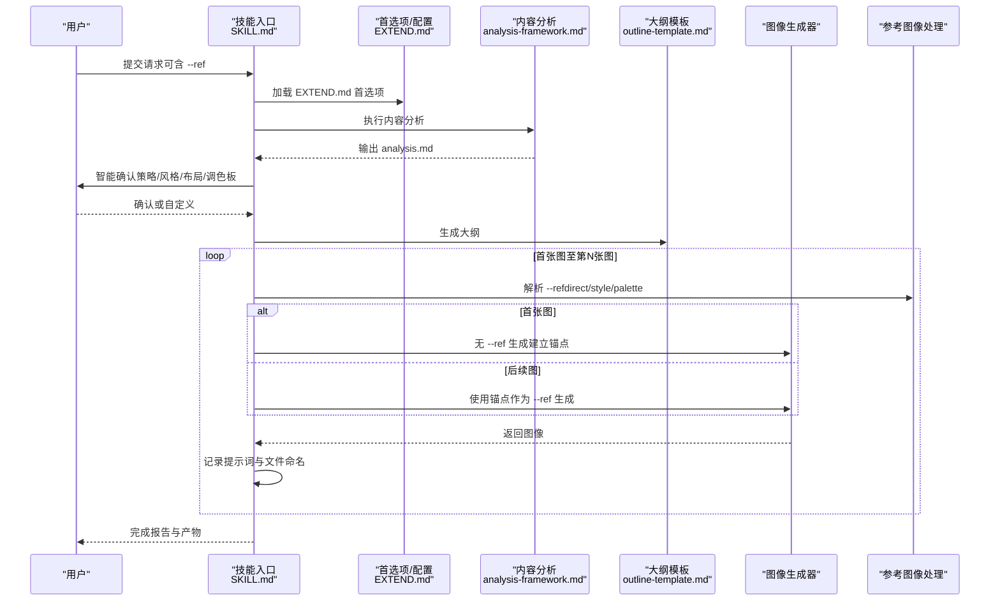
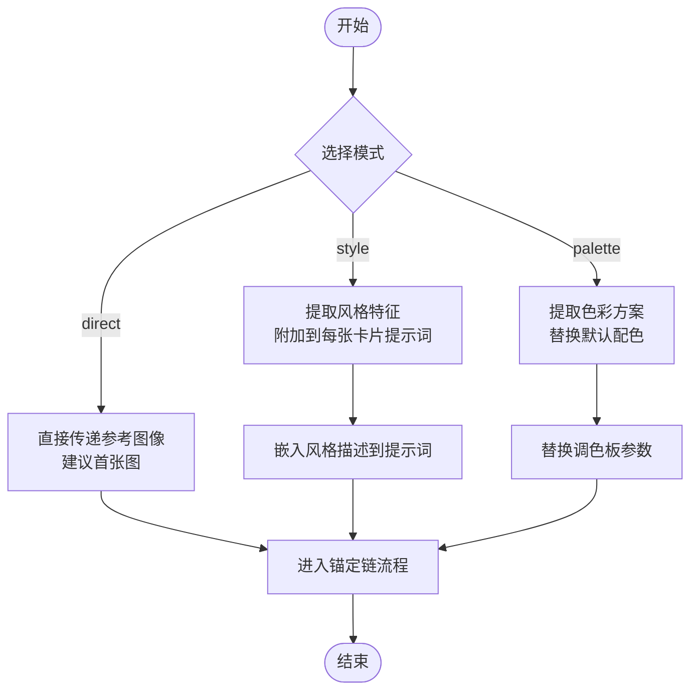
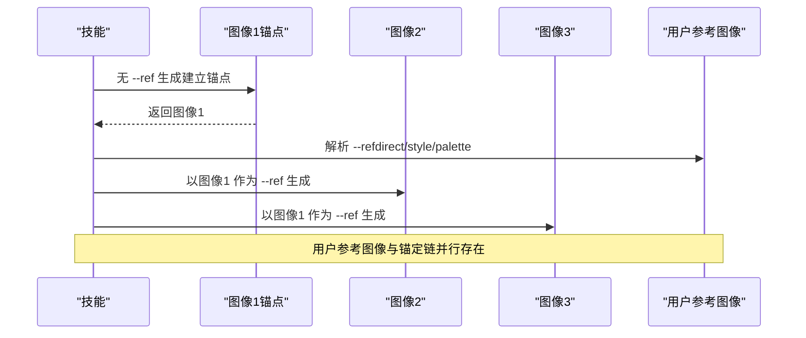
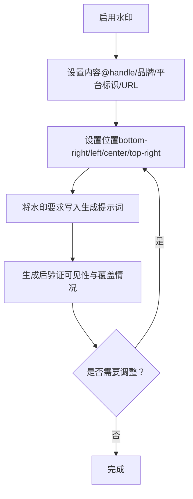
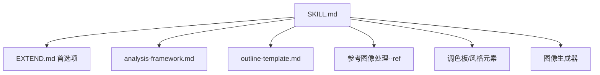

# 参考图像与一致性管理

<cite>
**本文引用的文件**
- [SKILL.md](file://.agents/skills/baoyu-image-cards/SKILL.md)
- [preferences-schema.md](file://.agents/skills/baoyu-image-cards/references/config/preferences-schema.md)
- [watermark-guide.md](file://.agents/skills/baoyu-image-cards/references/config/watermark-guide.md)
- [style-presets.md](file://.agents/skills/baoyu-image-cards/references/style-presets.md)
- [canvas.md](file://.agents/skills/baoyu-image-cards/references/elements/canvas.md)
- [decorations.md](file://.agents/skills/baoyu-image-cards/references/elements/decorations.md)
- [image-effects.md](file://.agents/skills/baoyu-image-cards/references/elements/image-effects.md)
- [typography.md](file://.agents/skills/baoyu-image-cards/references/elements/typography.md)
- [macaron.md](file://.agents/skills/baoyu-image-cards/references/palettes/macaron.md)
- [neon.md](file://.agents/skills/baoyu-image-cards/references/palettes/neon.md)
- [warm.md](file://.agents/skills/baoyu-image-cards/references/palettes/warm.md)
- [analysis-framework.md](file://.agents/skills/baoyu-image-cards/references/workflows/analysis-framework.md)
- [outline-template.md](file://.agents/skills/baoyu-image-cards/references/workflows/outline-template.md)
</cite>

## 目录
1. [简介](#简介)
2. [项目结构](#项目结构)
3. [核心组件](#核心组件)
4. [架构总览](#架构总览)
5. [详细组件分析](#详细组件分析)
6. [依赖关系分析](#依赖关系分析)
7. [性能考量](#性能考量)
8. [故障排除指南](#故障排除指南)
9. [结论](#结论)
10. [附录](#附录)

## 简介
本技术文档聚焦“图像卡片”的参考图像与一致性管理，系统阐述三类参考图像使用模式（direct直接传递、style风格提取、palette色彩提取）及其适用场景；深入解析“图像锚定链”机制，说明如何以第一张图像为锚点，确保后续图像在角色、色彩与风格上保持一致；提供水印配置指南（位置、透明度与内容设置）；介绍EXTEND.md配置文件的关键参数与自定义选项，并结合实际使用示例与常见问题排查，帮助读者高效稳定地生成系列化、高一致性的社交平台图像卡片。

## 项目结构
该技能围绕“图像卡片生成”组织内容，关键目录与文件如下：
- 技能入口与工作流：SKILL.md
- 配置与首选项：references/config/preferences-schema.md、references/config/watermark-guide.md
- 样式与布局：references/style-presets.md、references/elements/canvas.md、references/elements/decorations.md、references/elements/image-effects.md、references/elements/typography.md
- 调色板：references/palettes/macaron.md、references/palettes/neon.md、references/palettes/warm.md
- 内容分析与大纲：references/workflows/analysis-framework.md、references/workflows/outline-template.md

**图表来源**
- [SKILL.md](file://.agents/skills/baoyu-image-cards/SKILL.md)
- [preferences-schema.md](file://.agents/skills/baoyu-image-cards/references/config/preferences-schema.md)
- [watermark-guide.md](file://.agents/skills/baoyu-image-cards/references/config/watermark-guide.md)
- [style-presets.md](file://.agents/skills/baoyu-image-cards/references/style-presets.md)
- [canvas.md](file://.agents/skills/baoyu-image-cards/references/elements/canvas.md)
- [decorations.md](file://.agents/skills/baoyu-image-cards/references/elements/decorations.md)
- [image-effects.md](file://.agents/skills/baoyu-image-cards/references/elements/image-effects.md)
- [typography.md](file://.agents/skills/baoyu-image-cards/references/elements/typography.md)
- [macaron.md](file://.agents/skills/baoyu-image-cards/references/palettes/macaron.md)
- [neon.md](file://.agents/skills/baoyu-image-cards/references/palettes/neon.md)
- [warm.md](file://.agents/skills/baoyu-image-cards/references/palettes/warm.md)
- [analysis-framework.md](file://.agents/skills/baoyu-image-cards/references/workflows/analysis-framework.md)
- [outline-template.md](file://.agents/skills/baoyu-image-cards/references/workflows/outline-template.md)

**章节来源**
- [.agents/skills/baoyu-image-cards/SKILL.md](file://.agents/skills/baoyu-image-cards/SKILL.md)

## 核心组件
- 参考图像使用模式
  - direct：将参考图像直接传递给后端（通常仅对首张图生效，形成锚定链）
  - style：从参考图像中抽取风格特征并附加到每张卡片提示词
  - palette：从参考图像中抽取色彩并附加到每张卡片提示词
- 图像锚定链（Image-1 Anchor Chain）
  - 通过首张图作为锚点，后续图像统一引用该锚点，避免角色、色彩与风格漂移
- 水印配置（EXTEND.md）
  - 开关、内容、位置（bottom-right/bottom-left/bottom-center/top-right）
- EXTEND.md 参数与自定义
  - preferred_image_backend、preferred_style、preferred_layout、language、watermark、custom_styles 等

**章节来源**
- [.agents/skills/baoyu-image-cards/SKILL.md](file://.agents/skills/baoyu-image-cards/SKILL.md)
- [.agents/skills/baoyu-image-cards/references/config/preferences-schema.md](file://.agents/skills/baoyu-image-cards/references/config/preferences-schema.md)
- [.agents/skills/baoyu-image-cards/references/config/watermark-guide.md](file://.agents/skills/baoyu-image-cards/references/config/watermark-guide.md)

## 架构总览
下图展示了参考图像与一致性管理在整体工作流中的位置与交互：

**图表来源**
- [.agents/skills/baoyu-image-cards/SKILL.md](file://.agents/skills/baoyu-image-cards/SKILL.md)
- [.agents/skills/baoyu-image-cards/references/config/preferences-schema.md](file://.agents/skills/baoyu-image-cards/references/config/preferences-schema.md)
- [.agents/skills/baoyu-image-cards/references/workflows/analysis-framework.md](file://.agents/skills/baoyu-image-cards/references/workflows/analysis-framework.md)
- [.agents/skills/baoyu-image-cards/references/workflows/outline-template.md](file://.agents/skills/baoyu-image-cards/references/workflows/outline-template.md)

## 详细组件分析

### 组件A：参考图像使用模式与应用场景
- direct（直接传递）
  - 将参考图像原样传给后端，通常用于首张图建立角色/场景锚点
  - 优点：保留原始细节与构图；缺点：可能引入过多干扰信息
  - 适用：角色明确、风格统一、无需风格迁移的场景
- style（风格提取）
  - 从参考图像中抽取风格特征（如笔触、纹理、构图倾向），融入每张卡片的提示词
  - 优点：风格迁移自然，避免直接图像干扰；缺点：提取质量依赖后端能力
  - 适用：需要风格一致性但不希望直接复用图像的场景
- palette（色彩提取）
  - 从参考图像中抽取主色/辅色，替换卡片默认配色
  - 优点：色彩统一且可控；缺点：忽略纹理与笔触等非色彩元素
  - 适用：品牌色一致、主题色统一的系列化内容

**图表来源**
- [.agents/skills/baoyu-image-cards/SKILL.md](file://.agents/skills/baoyu-image-cards/SKILL.md)

**章节来源**
- [.agents/skills/baoyu-image-cards/SKILL.md](file://.agents/skills/baoyu-image-cards/SKILL.md)

### 组件B：图像锚定链机制
- 锚定链规则
  - 首张图不带 --ref，直接生成，作为锚点
  - 后续每张图均带上锚点作为 --ref 生成，确保角色、色彩与风格一致
  - 若后端支持会话ID，建议统一使用同一会话ID，进一步强化一致性
- 与用户参考图像的关系
  - 用户提供的参考图像与锚定链并行存在：用户参考图像叠加在锚定链之上
  - direct 模式下的用户参考图像通常仅作用于首张图；style/palette 模式则嵌入到每张卡片提示词

**图表来源**
- [.agents/skills/baoyu-image-cards/SKILL.md](file://.agents/skills/baoyu-image-cards/SKILL.md)

**章节来源**
- [.agents/skills/baoyu-image-cards/SKILL.md](file://.agents/skills/baoyu-image-cards/SKILL.md)

### 组件C：水印配置指南
- 启用方式
  - 在 EXTEND.md 中开启水印开关，并设置内容与位置
- 位置选项
  - bottom-right（默认）、bottom-left、bottom-center、top-right
- 内容格式
  - 支持账号标识（@用户名）、品牌名称、中文平台标识、URL 等
- 最佳实践
  - 保持系列内水印一致；确保在亮/暗区域均可读；大小适中，不喧宾夺主
- 常见问题
  - 不可见：调整位置或对比度
  - 过于显眼：更换位置或缩小尺寸
  - 与其他元素重叠：更换位置
  - 跨图不一致：使用会话ID保证一致性

**图表来源**
- [.agents/skills/baoyu-image-cards/references/config/watermark-guide.md](file://.agents/skills/baoyu-image-cards/references/config/watermark-guide.md)
- [.agents/skills/baoyu-image-cards/references/config/preferences-schema.md](file://.agents/skills/baoyu-image-cards/references/config/preferences-schema.md)

**章节来源**
- [.agents/skills/baoyu-image-cards/references/config/watermark-guide.md](file://.agents/skills/baoyu-image-cards/references/config/watermark-guide.md)
- [.agents/skills/baoyu-image-cards/references/config/preferences-schema.md](file://.agents/skills/baoyu-image-cards/references/config/preferences-schema.md)

### 组件D：EXTEND.md 配置参数与自定义
- 关键字段
  - version：版本号
  - watermark.enabled/content/position：水印开关、内容与位置
  - preferred_style.name/description：首选风格与描述
  - preferred_layout：首选布局
  - language：输出语言
  - preferred_image_backend：后端选择策略（auto/ask/backend-id）
  - custom_styles：自定义风格集合（名称、描述、配色、视觉元素、字体风格、适用场景）
- 常见用法
  - 固定后端：preferred_image_backend: codex-imagegen 或 baoyu-imagine
  - 固定风格/布局/语言：preferred_style.name: notion、preferred_layout: dense、language: zh
  - 开启水印：watermark.enabled: true + watermark.content: "@handle"

**章节来源**
- [.agents/skills/baoyu-image-cards/references/config/preferences-schema.md](file://.agents/skills/baoyu-image-cards/references/config/preferences-schema.md)
- [.agents/skills/baoyu-image-cards/SKILL.md](file://.agents/skills/baoyu-image-cards/SKILL.md)

### 组件E：样式×布局矩阵与一致性建议
- 样式×布局兼容性
  - 不同样式与布局组合的兼容分数（✓✓/✓/✗），用于指导用户选择
  - 示例：notion 与 dense 的兼容性较高，适合知识卡片；sketch-notes 与 dense 的兼容性更高
- 一致性建议
  - 优先选择与内容类型匹配的样式与布局组合
  - 避免低兼容组合导致阅读体验下降

**章节来源**
- [.agents/skills/baoyu-image-cards/SKILL.md](file://.agents/skills/baoyu-image-cards/SKILL.md)

### 组件F：调色板与风格元素
- 调色板
  - macaron：柔和马卡龙色系，适合教育/手绘风格
  - neon：暗底高亮霓虹色系，适合科技/前卫风格
  - warm：暖色系，适合生活/温馨风格
- 风格元素
  - 画布比例、网格、安全区
  - 装饰元素（强调标记、背景、涂鸦、边框、贴纸）
  - 图像效果（抠图、描边、滤镜、纹理叠加）
  - 文字系统（装饰文本、标签、层级、方向）

**章节来源**
- [.agents/skills/baoyu-image-cards/references/palettes/macaron.md](file://.agents/skills/baoyu-image-cards/references/palettes/macaron.md)
- [.agents/skills/baoyu-image-cards/references/palettes/neon.md](file://.agents/skills/baoyu-image-cards/references/palettes/neon.md)
- [.agents/skills/baoyu-image-cards/references/palettes/warm.md](file://.agents/skills/baoyu-image-cards/references/palettes/warm.md)
- [.agents/skills/baoyu-image-cards/references/elements/canvas.md](file://.agents/skills/baoyu-image-cards/references/elements/canvas.md)
- [.agents/skills/baoyu-image-cards/references/elements/decorations.md](file://.agents/skills/baoyu-image-cards/references/elements/decorations.md)
- [.agents/skills/baoyu-image-cards/references/elements/image-effects.md](file://.agents/skills/baoyu-image-cards/references/elements/image-effects.md)
- [.agents/skills/baoyu-image-cards/references/elements/typography.md](file://.agents/skills/baoyu-image-cards/references/elements/typography.md)

### 组件G：内容分析与大纲模板
- 内容分析框架
  - 平台特性（钩子、滑动动机、收藏价值、分享触发）
  - 分析维度（内容类型、受众画像、钩子评分、视觉机会、滑动流程）
- 大纲模板
  - 三种策略（故事驱动/信息密集/视觉优先）与页面数量建议
  - 文件命名规范（cover/content/ending + 序号 + slug）

**章节来源**
- [.agents/skills/baoyu-image-cards/references/workflows/analysis-framework.md](file://.agents/skills/baoyu-image-cards/references/workflows/analysis-framework.md)
- [.agents/skills/baoyu-image-cards/references/workflows/outline-template.md](file://.agents/skills/baoyu-image-cards/references/workflows/outline-template.md)

## 依赖关系分析
- 组件耦合
  - SKILL.md 是中枢，依赖 EXTEND.md 首选项、内容分析与大纲模板
  - 参考图像处理与锚定链由 SKILL.md 控制，与后端生成器解耦
  - 调色板与风格元素为提示词构建提供素材，与生成器解耦
- 外部依赖
  - 图像后端（runtime-native 或第三方技能）
  - 用户参考图像（可选）

**图表来源**
- [.agents/skills/baoyu-image-cards/SKILL.md](file://.agents/skills/baoyu-image-cards/SKILL.md)
- [.agents/skills/baoyu-image-cards/references/config/preferences-schema.md](file://.agents/skills/baoyu-image-cards/references/config/preferences-schema.md)
- [.agents/skills/baoyu-image-cards/references/workflows/analysis-framework.md](file://.agents/skills/baoyu-image-cards/references/workflows/analysis-framework.md)
- [.agents/skills/baoyu-image-cards/references/workflows/outline-template.md](file://.agents/skills/baoyu-image-cards/references/workflows/outline-template.md)

**章节来源**
- [.agents/skills/baoyu-image-cards/SKILL.md](file://.agents/skills/baoyu-image-cards/SKILL.md)

## 性能考量
- 生成次数与一致性权衡
  - 通过锚定链减少风格漂移，降低重生成概率
  - 在提示词中嵌入风格/色彩描述可减少后端反复尝试
- 后端选择策略
  - preferred_image_backend: auto/ask/backend-id，结合当前环境选择最优后端
- 文件与提示词管理
  - prompts/ 下的提示词文件是可复现的依据，便于切换后端或修复

[本节为通用建议，不直接分析具体文件]

## 故障排除指南
- 水印不可见
  - 检查位置是否被遮挡；调整对比度或位置
- 水印过于显眼
  - 减小字号或更换位置
- 水印与内容重叠
  - 更换位置；必要时调整布局或安全区
- 跨图水印不一致
  - 使用会话ID贯穿系列生成
- 参考图像未生效
  - direct 模式通常仅对首张图有效；style/palette 模式会嵌入到每张提示词
- 风格/色彩漂移
  - 确保首张图生成时不带 --ref，后续均以首张图为锚点；必要时固定会话ID

**章节来源**
- [.agents/skills/baoyu-image-cards/references/config/watermark-guide.md](file://.agents/skills/baoyu-image-cards/references/config/watermark-guide.md)
- [.agents/skills/baoyu-image-cards/SKILL.md](file://.agents/skills/baoyu-image-cards/SKILL.md)

## 结论
通过明确的参考图像使用模式、严格的图像锚定链机制、完善的EXTEND.md配置与水印策略，本技能能够在多轮生成中保持角色、色彩与风格的高度一致性，同时兼顾可定制性与可复现性。配合内容分析与大纲模板，可系统化产出高质量的社交平台图像卡片系列。

[本节为总结性内容，不直接分析具体文件]

## 附录
- 实际使用示例（步骤化）
  - 步骤1：准备 EXTEND.md，设置 preferred_image_backend、preferred_style、preferred_layout、language、watermark
  - 步骤2：撰写内容并运行内容分析，生成 analysis.md
  - 步骤3：智能确认（策略/风格/布局/调色板），生成 outline.md
  - 步骤4：首张图无 --ref 生成，建立锚点；后续每张图均以锚点作为 --ref 生成
  - 步骤5：如需风格/色彩迁移，使用 --ref 并选择 style/palette 模式
  - 步骤6：按需添加水印，验证跨图一致性
- 相关参考文件
  - SKILL.md、preferences-schema.md、watermark-guide.md、style-presets.md、canvas.md、decorations.md、image-effects.md、typography.md、macaron.md、neon.md、warm.md、analysis-framework.md、outline-template.md

**章节来源**
- [.agents/skills/baoyu-image-cards/SKILL.md](file://.agents/skills/baoyu-image-cards/SKILL.md)
- [.agents/skills/baoyu-image-cards/references/config/preferences-schema.md](file://.agents/skills/baoyu-image-cards/references/config/preferences-schema.md)
- [.agents/skills/baoyu-image-cards/references/config/watermark-guide.md](file://.agents/skills/baoyu-image-cards/references/config/watermark-guide.md)
- [.agents/skills/baoyu-image-cards/references/style-presets.md](file://.agents/skills/baoyu-image-cards/references/style-presets.md)
- [.agents/skills/baoyu-image-cards/references/elements/canvas.md](file://.agents/skills/baoyu-image-cards/references/elements/canvas.md)
- [.agents/skills/baoyu-image-cards/references/elements/decorations.md](file://.agents/skills/baoyu-image-cards/references/elements/decorations.md)
- [.agents/skills/baoyu-image-cards/references/elements/image-effects.md](file://.agents/skills/baoyu-image-cards/references/elements/image-effects.md)
- [.agents/skills/baoyu-image-cards/references/elements/typography.md](file://.agents/skills/baoyu-image-cards/references/elements/typography.md)
- [.agents/skills/baoyu-image-cards/references/palettes/macaron.md](file://.agents/skills/baoyu-image-cards/references/palettes/macaron.md)
- [.agents/skills/baoyu-image-cards/references/palettes/neon.md](file://.agents/skills/baoyu-image-cards/references/palettes/neon.md)
- [.agents/skills/baoyu-image-cards/references/palettes/warm.md](file://.agents/skills/baoyu-image-cards/references/palettes/warm.md)
- [.agents/skills/baoyu-image-cards/references/workflows/analysis-framework.md](file://.agents/skills/baoyu-image-cards/references/workflows/analysis-framework.md)
- [.agents/skills/baoyu-image-cards/references/workflows/outline-template.md](file://.agents/skills/baoyu-image-cards/references/workflows/outline-template.md)