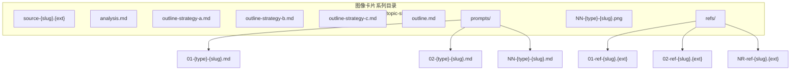
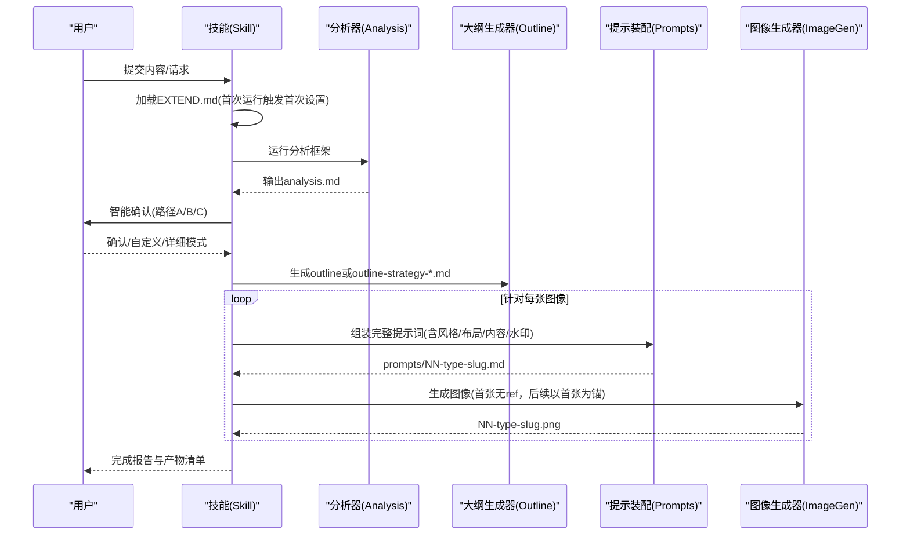
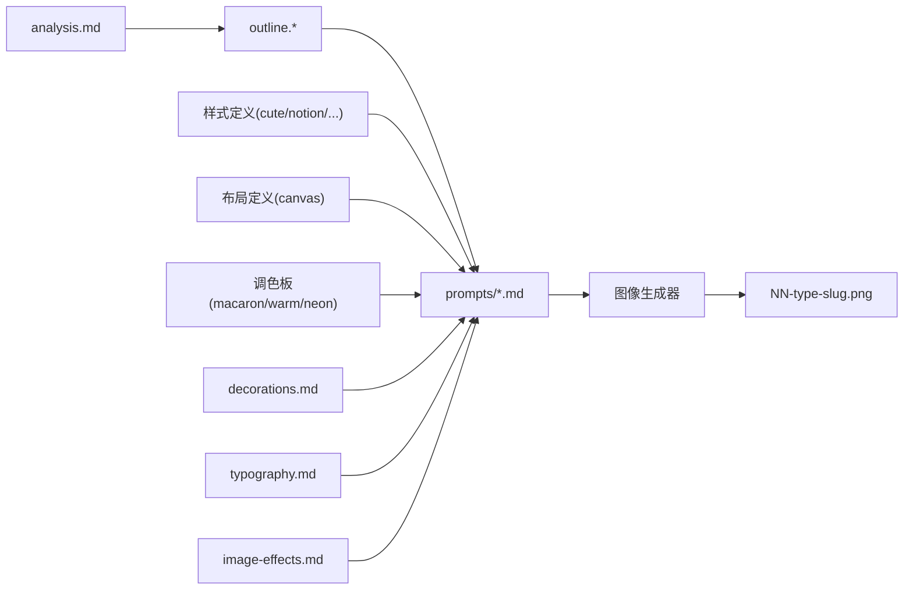

# 文件结构与命名规范

<cite>
**本文引用的文件**
- [SKILL.md](file://.agents/skills/baoyu-image-cards/SKILL.md)
- [confirmation.md](file://.agents/skills/baoyu-image-cards/references/confirmation.md)
- [style-presets.md](file://.agents/skills/baoyu-image-cards/references/style-presets.md)
- [analysis-framework.md](file://.agents/skills/baoyu-image-cards/references/workflows/analysis-framework.md)
- [outline-template.md](file://.agents/skills/baoyu-image-cards/references/workflows/outline-template.md)
- [prompt-assembly.md](file://.agents/skills/baoyu-image-cards/references/workflows/prompt-assembly.md)
- [canvas.md](file://.agents/skills/baoyu-image-cards/references/elements/canvas.md)
- [decorations.md](file://.agents/skills/baoyu-image-cards/references/elements/decorations.md)
- [typography.md](file://.agents/skills/baoyu-image-cards/references/elements/typography.md)
- [image-effects.md](file://.agents/skills/baoyu-image-cards/references/elements/image-effects.md)
- [cute.md](file://.agents/skills/baoyu-image-cards/references/presets/cute.md)
- [macaron.md](file://.agents/skills/baoyu-image-cards/references/palettes/macaron.md)
- [first-time-setup.md](file://.agents/skills/baoyu-image-cards/references/config/first-time-setup.md)
- [preferences-schema.md](file://.agents/skills/baoyu-image-cards/references/config/preferences-schema.md)
</cite>

## 目录
1. [简介](#简介)
2. [项目结构概览](#项目结构概览)
3. [核心组件与职责](#核心组件与职责)
4. [架构总览](#架构总览)
5. [详细组件分析](#详细组件分析)
6. [依赖关系分析](#依赖关系分析)
7. [性能与一致性考量](#性能与一致性考量)
8. [故障排查指南](#故障排查指南)
9. [结论](#结论)
10. [附录：模板与示例](#附录模板与示例)

## 简介
本规范面向“图像卡片”工作流的完整文件组织与命名体系，覆盖 source 源文件、analysis 分析报告、outline 大纲文件、prompts 提示词文件以及 refs 参考图像目录，并明确时间戳备份机制、版本管理策略与最佳实践。目标是确保系列图像卡片在风格、布局、色彩与内容结构上保持高度一致，同时便于回溯、修改与协作。

## 项目结构概览
图像卡片系列的产出遵循统一的目录布局与命名约定，根目录为按主题构建的子目录，内部包含源材料、分析、大纲、提示词与最终图像等文件。该结构支持多轮迭代与并行工作流。

图表来源
- [SKILL.md:258-274](file://.agents/skills/baoyu-image-cards/SKILL.md#L258-L274)

章节来源
- [SKILL.md:258-274](file://.agents/skills/baoyu-image-cards/SKILL.md#L258-L274)

## 核心组件与职责
- 源材料（source）：输入内容的原始载体，用于分析与生成。
- 分析报告（analysis）：基于内容信号与平台特征进行深度分析，输出推荐风格、布局、数量与策略。
- 大纲（outline）：系列图像的结构化内容规划，支持三种策略变体与最终选定版本。
- 提示词（prompts）：每张图像的完整提示词文件，作为可复现的“源记录”。
- 图像（PNG）：最终生成的系列图像，按序号与类型命名。
- 参考图像（refs）：用户提供的风格或色彩参考，按需复制到 refs 目录并标注使用方式。

章节来源
- [SKILL.md:301-308](file://.agents/skills/baoyu-image-cards/SKILL.md#L301-L308)
- [SKILL.md:330-341](file://.agents/skills/baoyu-image-cards/SKILL.md#L330-L341)
- [SKILL.md:350-356](file://.agents/skills/baoyu-image-cards/SKILL.md#L350-L356)
- [SKILL.md:231-257](file://.agents/skills/baoyu-image-cards/SKILL.md#L231-L257)

## 架构总览
从“内容输入”到“系列图像输出”的端到端流程如下：

图表来源
- [SKILL.md:275-392](file://.agents/skills/baoyu-image-cards/SKILL.md#L275-L392)
- [analysis-framework.md:1-199](file://.agents/skills/baoyu-image-cards/references/workflows/analysis-framework.md#L1-L199)
- [outline-template.md:1-248](file://.agents/skills/baoyu-image-cards/references/workflows/outline-template.md#L1-L248)
- [prompt-assembly.md:1-379](file://.agents/skills/baoyu-image-cards/references/workflows/prompt-assembly.md#L1-L379)

## 详细组件分析

### 文件命名约定与目录规则
- 主目录：image-cards/{topic-slug}/
  - topic-slug：由主题推导的短横线连接标识，冲突时追加时间戳后缀。
- 源文件：source-{slug}.{ext}
- 分析报告：analysis.md
- 大纲文件：
  - outline-strategy-a/b/c.md（详细模式生成）
  - outline.md（最终选定的大纲）
- 提示词目录：prompts/
  - 命名：NN-{type}-{slug}.md
  - 类型：cover/content/ending
  - 序号：两位数字递增
- 图像文件：NN-{type}-{slug}.png
- 参考图像目录：refs/
  - 命名：NN-ref-{slug}.{ext}

章节来源
- [SKILL.md:258-274](file://.agents/skills/baoyu-image-cards/SKILL.md#L258-L274)
- [outline-template.md:5-34](file://.agents/skills/baoyu-image-cards/references/workflows/outline-template.md#L5-L34)

### 时间戳备份机制
- 覆盖保护：在覆盖任何文件（source、outline、prompt、图像）前，将现有文件重命名为带时间戳的备份文件。
- 格式：{name}-backup-YYYYMMDD-HHMMSS.{ext}
- 适用范围：源文件、分析报告、大纲、提示词与图像文件均受此规则保护。

章节来源
- [SKILL.md:271-274](file://.agents/skills/baoyu-image-cards/SKILL.md#L271-L274)

### 分析与确认流程
- 分析阶段：运行分析框架，识别内容类型、钩子潜力、受众、保存/分享触发点、视觉机会与滑动流程，输出 analysis.md。
- 确认阶段：提供三种路径（快速确认、自定义、详细），在用户确认后生成 outline 或 outline-strategy-*.md。

章节来源
- [SKILL.md:301-308](file://.agents/skills/baoyu-image-cards/SKILL.md#L301-L308)
- [SKILL.md:309-341](file://.agents/skills/baoyu-image-cards/SKILL.md#L309-L341)
- [confirmation.md:1-157](file://.agents/skills/baoyu-image-cards/references/confirmation.md#L1-L157)
- [analysis-framework.md:1-199](file://.agents/skills/baoyu-image-cards/references/workflows/analysis-framework.md#L1-L199)

### 提示词组装与图像生成
- 组装顺序：基础结构 → 风格段落 → 布局段落 → 内容段落 → 水印段落 → 生成指令。
- 风格与调色板：从样式与调色板定义中提取颜色、元素与排版规则；显式调色板优先于样式默认。
- 布局：根据画布与网格规范选择密度与结构，结合位置推荐。
- 一致性：首张图像不带参考，后续图像以首张为锚定参考，确保角色/风格/色彩连贯。
- 水印：若启用，则在提示词中加入水印内容、位置与可见度说明。

章节来源
- [prompt-assembly.md:5-59](file://.agents/skills/baoyu-image-cards/references/workflows/prompt-assembly.md#L5-L59)
- [prompt-assembly.md:115-145](file://.agents/skills/baoyu-image-cards/references/workflows/prompt-assembly.md#L115-L145)
- [prompt-assembly.md:146-162](file://.agents/skills/baoyu-image-cards/references/workflows/prompt-assembly.md#L146-L162)
- [prompt-assembly.md:251-260](file://.agents/skills/baoyu-image-cards/references/workflows/prompt-assembly.md#L251-L260)
- [prompt-assembly.md:180-188](file://.agents/skills/baoyu-image-cards/references/workflows/prompt-assembly.md#L180-L188)

### 参考图像与风格/色彩注入
- 用户可通过路径或粘贴内容提供参考图像，系统将其复制到 refs 目录并标注使用方式（direct/style/palette）。
- direct：传递给后端（通常仅首张），作为系列锚点。
- style/palette：从参考中抽取风格特征或色值，注入到每张图像的提示词中，避免叠加冲突。

章节来源
- [SKILL.md:231-257](file://.agents/skills/baoyu-image-cards/SKILL.md#L231-L257)

### 风格、布局与调色板
- 风格（12）：cute/fresh/warm/bold/minimal/retro/pop/notion/chalkboard/study-notes/screen-print/sketch-notes
- 布局（8）：sparse/balanced/dense/list/comparison/flow/mindmap/quadrant
- 调色板（可选）：macaron/warm/neon
- 预设：通过 --preset 快速组合风格+布局（部分预设含可选调色板）

章节来源
- [SKILL.md:80-125](file://.agents/skills/baoyu-image-cards/SKILL.md#L80-L125)
- [SKILL.md:126-182](file://.agents/skills/baoyu-image-cards/SKILL.md#L126-L182)
- [style-presets.md:1-44](file://.agents/skills/baoyu-image-cards/references/style-presets.md#L1-L44)
- [canvas.md:1-123](file://.agents/skills/baoyu-image-cards/references/elements/canvas.md#L1-L123)
- [cute.md:1-73](file://.agents/skills/baoyu-image-cards/references/presets/cute.md#L1-L73)
- [macaron.md:1-34](file://.agents/skills/baoyu-image-cards/references/palettes/macaron.md#L1-L34)

### 大纲模板与策略差异
- 三种策略（A/B/C）在结构、页面数与风格上应有明显区别，且每份大纲需包含推荐风格与理由。
- outline.md 为最终选定版本；策略变体用于比较与决策。

章节来源
- [outline-template.md:1-248](file://.agents/skills/baoyu-image-cards/references/workflows/outline-template.md#L1-L248)
- [confirmation.md:58-157](file://.agents/skills/baoyu-image-cards/references/confirmation.md#L58-L157)

### 首次设置与偏好配置
- 首次运行未检测到 EXTEND.md 时，引导完成偏好设置（水印、默认风格、保存位置等），完成后方可继续工作流。
- 偏好项包括：水印开关/内容/位置、默认风格/布局、语言、图像后端选择、自定义风格等。

章节来源
- [first-time-setup.md:1-123](file://.agents/skills/baoyu-image-cards/references/config/first-time-setup.md#L1-L123)
- [preferences-schema.md:1-124](file://.agents/skills/baoyu-image-cards/references/config/preferences-schema.md#L1-L124)

## 依赖关系分析
- 工作流依赖：analysis.md → outline.* → prompts/*.md → 生成图像 → 复核与迭代。
- 组件依赖：提示词装配依赖样式、布局与调色板定义；大纲模板提供结构化约束；Canvas/Decorations/Typography/Image-Effects提供视觉元素规范。
- 外部依赖：图像生成后端（如 Codex、baoyu-imagine 等），按优先级选择并支持会话锚定。

图表来源
- [prompt-assembly.md:61-162](file://.agents/skills/baoyu-image-cards/references/workflows/prompt-assembly.md#L61-L162)
- [outline-template.md:68-219](file://.agents/skills/baoyu-image-cards/references/workflows/outline-template.md#L68-L219)
- [canvas.md:1-123](file://.agents/skills/baoyu-image-cards/references/elements/canvas.md#L1-L123)
- [decorations.md:1-153](file://.agents/skills/baoyu-image-cards/references/elements/decorations.md#L1-L153)
- [typography.md:1-97](file://.agents/skills/baoyu-image-cards/references/elements/typography.md#L1-L97)
- [image-effects.md:1-93](file://.agents/skills/baoyu-image-cards/references/elements/image-effects.md#L1-L93)

## 性能与一致性考量
- 生成性能：优先使用运行时原生图像工具，减少跨进程开销；在多后端存在时按优先级选择。
- 一致性保障：首张图像不带参考建立锚点，后续图像统一以首张为参考，配合会话ID与固定尺寸（3:4）确保角色/风格/色彩稳定。
- 提示词复用：prompts/*.md 作为唯一真实来源，修改需先更新提示词再再生，避免漂移。

章节来源
- [SKILL.md:24-41](file://.agents/skills/baoyu-image-cards/SKILL.md#L24-L41)
- [prompt-assembly.md:251-260](file://.agents/skills/baoyu-image-cards/references/workflows/prompt-assembly.md#L251-L260)

## 故障排查指南
- 无法生成图像
  - 检查 EXTEND.md 是否存在且包含首选后端；若不存在，按首次设置流程创建。
  - 确认 prompts/*.md 已生成且未被覆盖（检查备份）。
  - 若后端不可用，按规则切换或询问用户选择。
- 风格/色彩不一致
  - 确保首张图像未带参考，后续图像均以首张为锚。
  - 显式调色板优先级高于样式默认，必要时在 EXTEND.md 中配置。
- 大纲/提示词冲突
  - 优先以 outline.md 为准；策略变体仅用于比较，最终应合并到 outline.md。
  - 修改提示词需先更新 prompts/*.md，再再生对应图像。

章节来源
- [SKILL.md:285-298](file://.agents/skills/baoyu-image-cards/SKILL.md#L285-L298)
- [SKILL.md:350-356](file://.agents/skills/baoyu-image-cards/SKILL.md#L350-L356)
- [first-time-setup.md:10-18](file://.agents/skills/baoyu-image-cards/references/config/first-time-setup.md#L10-L18)

## 结论
通过严格的文件命名与目录规范、时间戳备份机制、提示词装配与锚定一致性策略，图像卡片工作流实现了可复现、可追溯、可协作的高质量产出。建议团队在每次迭代中：
- 严格遵守命名与目录规则；
- 在覆盖前保留备份；
- 先更新提示词再再生图像；
- 使用 outline.md 作为最终依据；
- 合理使用参考图像与调色板，避免风格冲突。

## 附录：模板与示例

### 文件模板
- 分析报告（analysis.md）：包含主题、内容类型、语言、推荐数量、受众、钩子评分、价值主张、互动设计、内容信号、滑动流程与推荐组合等字段。
- 大纲文件（outline.md/outline-strategy-*.md）：包含策略标识、名称、风格、默认布局、图像总数、生成时间、逐页结构与视觉钩子。
- 提示词（prompts/NN-type-slug.md）：包含基础结构、风格段落、布局段落、内容段落、水印段落与生成指令。
- 参考图像（refs/NN-ref-slug.ext）：按使用方式标注（direct/style/palette），并在相关提示词的 frontmatter 中记录引用信息。

章节来源
- [analysis-framework.md:120-199](file://.agents/skills/baoyu-image-cards/references/workflows/analysis-framework.md#L120-L199)
- [outline-template.md:68-219](file://.agents/skills/baoyu-image-cards/references/workflows/outline-template.md#L68-L219)
- [prompt-assembly.md:5-59](file://.agents/skills/baoyu-image-cards/references/workflows/prompt-assembly.md#L5-L59)
- [SKILL.md:247-257](file://.agents/skills/baoyu-image-cards/SKILL.md#L247-L257)

### 版本管理与最佳实践
- 版本管理：以 prompts/*.md 为唯一真实来源，图像文件与大纲文件为派生产物；修改需先更新提示词。
- 备份策略：覆盖前自动重命名为带时间戳的备份文件，便于回滚与审计。
- 最佳实践：
  - 首张图像不带参考，建立锚点；
  - 后续图像统一以首张为参考；
  - 使用 --preset 快速组合风格+布局，必要时微调；
  - 在 EXTEND.md 中配置水印与默认偏好，保持一致性；
  - 详细模式下生成三份大纲变体，再择优合并。

章节来源
- [SKILL.md:350-356](file://.agents/skills/baoyu-image-cards/SKILL.md#L350-L356)
- [SKILL.md:271-274](file://.agents/skills/baoyu-image-cards/SKILL.md#L271-L274)
- [SKILL.md:439-452](file://.agents/skills/baoyu-image-cards/SKILL.md#L439-L452)