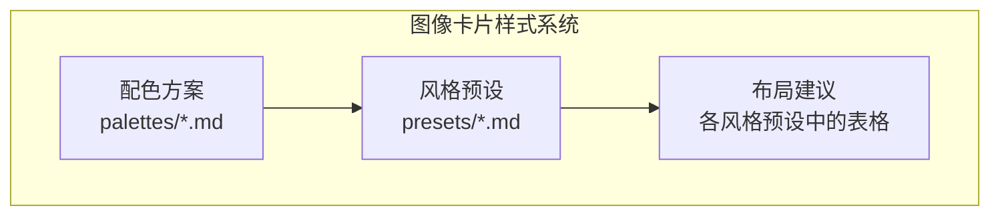
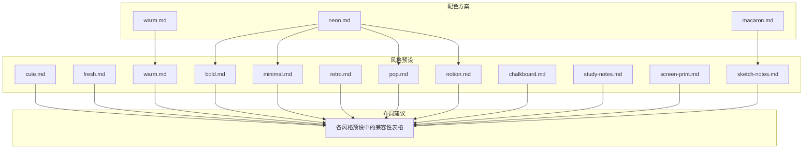
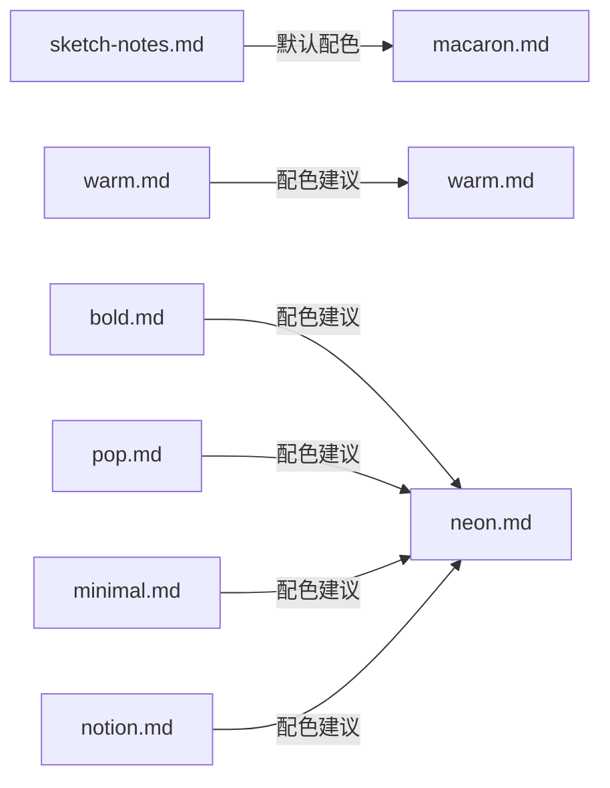

# 样式与布局系统

<cite>
**本文引用的文件**
- [macaron.md](file://.agents/skills/baoyu-image-cards/references/palettes/macaron.md)
- [warm.md](file://.agents/skills/baoyu-image-cards/references/palettes/warm.md)
- [neon.md](file://.agents/skills/baoyu-image-cards/references/palettes/neon.md)
- [cute.md](file://.agents/skills/baoyu-image-cards/references/presets/cute.md)
- [fresh.md](file://.agents/skills/baoyu-image-cards/references/presets/fresh.md)
- [warm.md](file://.agents/skills/baoyu-image-cards/references/presets/warm.md)
- [bold.md](file://.agents/skills/baoyu-image-cards/references/presets/bold.md)
- [minimal.md](file://.agents/skills/baoyu-image-cards/references/presets/minimal.md)
- [retro.md](file://.agents/skills/baoyu-image-cards/references/presets/retro.md)
- [pop.md](file://.agents/skills/baoyu-image-cards/references/presets/pop.md)
- [notion.md](file://.agents/skills/baoyu-image-cards/references/presets/notion.md)
- [chalkboard.md](file://.agents/skills/baoyu-image-cards/references/presets/chalkboard.md)
- [study-notes.md](file://.agents/skills/baoyu-image-cards/references/presets/study-notes.md)
- [screen-print.md](file://.agents/skills/baoyu-image-cards/references/presets/screen-print.md)
- [sketch-notes.md](file://.agents/skills/baoyu-image-cards/references/presets/sketch-notes.md)
</cite>

## 目录
1. [简介](#简介)
2. [项目结构](#项目结构)
3. [核心组件](#核心组件)
4. [架构总览](#架构总览)
5. [详细组件分析](#详细组件分析)
6. [依赖关系分析](#依赖关系分析)
7. [性能考量](#性能考量)
8. [故障排查指南](#故障排查指南)
9. [结论](#结论)
10. [附录](#附录)

## 简介
本技术文档聚焦“图像卡片”的样式与布局系统，围绕以下目标展开：
- 深入解析12种视觉风格（cute、fresh、warm、bold、minimal、retro、pop、notion、chalkboard、study-notes、screen-print、sketch-notes）的设计语言、适用场景与组合建议
- 详解8种信息布局（sparse、balanced、dense、list、comparison、flow、mindmap、quadrant）的设计原理与使用建议
- 解释配色方案系统：macaron、warm、neon 的色彩搭配与情感表达
- 提供风格与布局的兼容性矩阵，辅助用户进行最佳组合选择
- 给出具体使用示例与视觉效果对比思路，便于快速上手与质量把控

## 项目结构
该能力由“风格预设”“配色方案”“布局建议”三部分构成，分别位于技能目录下的 references 子目录中：
- 风格预设：presets/*.md，定义每种风格的元素组合、排版规则、最佳布局与适用领域
- 配色方案：palettes/*.md，定义三套配色的背景、主色、强调色及语义约束与最佳搭配
- 布局建议：各风格预设中的“最佳布局配对”表格，给出兼容性评分与使用场景

图示来源
- [cute.md:1-73](file://.agents/skills/baoyu-image-cards/references/presets/cute.md#L1-L73)
- [macaron.md:1-34](file://.agents/skills/baoyu-image-cards/references/palettes/macaron.md#L1-L34)

章节来源
- [cute.md:1-73](file://.agents/skills/baoyu-image-cards/references/presets/cute.md#L1-L73)
- [fresh.md:1-73](file://.agents/skills/baoyu-image-cards/references/presets/fresh.md#L1-L73)
- [warm.md:1-73](file://.agents/skills/baoyu-image-cards/references/presets/warm.md#L1-L73)
- [bold.md:1-73](file://.agents/skills/baoyu-image-cards/references/presets/bold.md#L1-L73)
- [minimal.md:1-73](file://.agents/skills/baoyu-image-cards/references/presets/minimal.md#L1-L73)
- [retro.md:1-73](file://.agents/skills/baoyu-image-cards/references/presets/retro.md#L1-L73)
- [pop.md:1-73](file://.agents/skills/baoyu-image-cards/references/presets/pop.md#L1-L73)
- [notion.md:1-74](file://.agents/skills/baoyu-image-cards/references/presets/notion.md#L1-L74)
- [chalkboard.md:1-98](file://.agents/skills/baoyu-image-cards/references/presets/chalkboard.md#L1-L98)
- [study-notes.md:1-116](file://.agents/skills/baoyu-image-cards/references/presets/study-notes.md#L1-L116)
- [screen-print.md:1-93](file://.agents/skills/baoyu-image-cards/references/presets/screen-print.md#L1-L93)
- [sketch-notes.md:1-101](file://.agents/skills/baoyu-image-cards/references/presets/sketch-notes.md#L1-L101)
- [macaron.md:1-34](file://.agents/skills/baoyu-image-cards/references/palettes/macaron.md#L1-L34)
- [warm.md:1-33](file://.agents/skills/baoyu-image-cards/references/palettes/warm.md#L1-L33)
- [neon.md:1-33](file://.agents/skills/baoyu-image-cards/references/palettes/neon.md#L1-L33)

## 核心组件
- 风格预设（Style Presets）
  - 定义每种风格的画布比例、网格、图像效果、字体装饰、装饰元素等组合
  - 提供最佳布局配对表与适用领域，指导内容组织方式
- 配色方案（Palettes）
  - 提供三套配色的背景、文本、区块色、强调色及其语义约束
  - 给出与风格的最佳搭配建议，避免视觉冲突
- 布局建议（Layout Recommendations）
  - 各风格预设中的“最佳布局配对”表格，标注兼容性与使用场景
  - 作为风格与布局的耦合参考，确保视觉与信息密度平衡

章节来源
- [cute.md:10-32](file://.agents/skills/baoyu-image-cards/references/presets/cute.md#L10-L32)
- [fresh.md:10-32](file://.agents/skills/baoyu-image-cards/references/presets/fresh.md#L10-L32)
- [sketch-notes.md:35-39](file://.agents/skills/baoyu-image-cards/references/presets/sketch-notes.md#L35-L39)
- [macaron.md:10-25](file://.agents/skills/baoyu-image-cards/references/palettes/macaron.md#L10-L25)
- [warm.md:10-25](file://.agents/skills/baoyu-image-cards/references/palettes/warm.md#L10-L25)
- [neon.md:10-25](file://.agents/skills/baoyu-image-cards/references/palettes/neon.md#L10-L25)

## 架构总览
下图展示“风格预设”“配色方案”“布局建议”之间的关系与交互：

图示来源
- [cute.md:1-73](file://.agents/skills/baoyu-image-cards/references/presets/cute.md#L1-L73)
- [sketch-notes.md:35-39](file://.agents/skills/baoyu-image-cards/references/presets/sketch-notes.md#L35-L39)
- [macaron.md:1-34](file://.agents/skills/baoyu-image-cards/references/palettes/macaron.md#L1-L34)
- [warm.md:1-33](file://.agents/skills/baoyu-image-cards/references/palettes/warm.md#L1-L33)
- [neon.md:1-33](file://.agents/skills/baoyu-image-cards/references/palettes/neon.md#L1-L33)

## 详细组件分析

### 配色方案系统
- macaron（马卡龙）
  - 背景：温暖奶油色，带有轻微纸纹，整体柔和亲和
  - 主色：马卡龙蓝、薰衣草、薄荷、桃粉等柔和色块
  - 强调色：珊瑚红，用于关键术语强调
  - 语义约束：避免饱和或霓虹色调；不将颜色名称、角色标签作为可见文字渲染
  - 最佳搭配：sketch-notes、notion、chalkboard、warm、fresh
- warm（暖色）
  - 背景：柔滑桃色，温暖略带纹理
  - 主色：暖橙、焦糖、金黄、灰玫瑰等暖系
  - 强调色：焦褐，传达舒适、温暖与信任感
  - 语义约束：仅用暖色，避免冷色；整体如秋日阳光般温和
  - 最佳搭配：warm、cute、retro、sketch-notes
- neon（霓虹）
  - 背景：深紫，光滑深沉
  - 主色：霓虹青、品红、绿、粉，强调色：亮黄
  - 语义约束：高对比、未来感；霓虹应节制使用，留白很重要
  - 最佳搭配：bold、pop、minimal、notion

章节来源
- [macaron.md:1-34](file://.agents/skills/baoyu-image-cards/references/palettes/macaron.md#L1-L34)
- [warm.md:1-33](file://.agents/skills/baoyu-image-cards/references/palettes/warm.md#L1-L33)
- [neon.md:1-33](file://.agents/skills/baoyu-image-cards/references/palettes/neon.md#L1-L33)

### 视觉风格详解与适用场景
- cute（可爱）
  - 设计语言：甜美、可爱情感，适合小红书风
  - 元素组合：画布比例偏竖版，网格支持单/双/四宫格；图像效果强调柔光与白色描边；字体装饰以气泡/强调为主；装饰元素多为爱心、星星、花朵等
  - 适用场景：生活方式、美妆护肤、时尚穿搭、日常技巧分享、个人随笔
  - 最佳布局配对：sparse、balanced、dense（知识卡片）、list（清单/排行榜）、comparison（前后对比）、flow（步骤指南）
- fresh（清新生动）
  - 设计语言：干净、清新、自然
  - 元素组合：竖版画布，单/三联画网格；图像效果偏向柔光与冷调；字体装饰简洁或强调；装饰元素为叶子、云朵、水珠等自然元素
  - 适用场景：健康养生、极简生活、自我护理、自然主题、清洁生活技巧
  - 最佳布局配对：sparse、balanced、dense（有序信息）、list（健康要点）、comparison（健康前后对比）、flow（有机流程）
- warm（温暖）
  - 设计语言：舒适、友好、易于接近
  - 元素组合：竖版画布，单/双网格；图像效果采用暖调与柔光；字体装饰友好圆润；装饰元素为云彩、星光等温馨元素
  - 适用场景：个人故事、人生感悟、情感分享、舒适生活方式、暖心建议
  - 最佳布局配对：sparse、balanced、dense（详细体验）、list（人生经验）、comparison（前后对比）、flow（旅程叙述）
- bold（醒目）
  - 设计语言：高冲击力、抓人眼球
  - 元素组合：竖版画布，单/双网格；图像效果强调高饱和；字体装饰采用3D阴影或描边；装饰元素为惊叹号、箭头、星爆等
  - 适用场景：重要提示与警告、必知清单、关键公告、排名与对比、引人注目的钩子
  - 最佳布局配对：sparse（有力声明）、balanced（警示内容）、dense（关键信息卡片）、list（必须知道的清单）、comparison（强烈对比）、flow（关键步骤流程）
- minimal（极简）
  - 设计语言：极致干净、优雅
  - 元素组合：竖版画布，单网格；图像效果尽量简洁；字体装饰极简；装饰元素为细线、点标记等
  - 适用场景：专业内容、严肃话题、高端产品、商业内容、优雅呈现
  - 最佳布局配对：sparse（优雅声明）、balanced（专业内容）、dense（干净的知识卡片）、list（简单清单）、comparison（清晰对比）、flow（优雅流程）
- retro（复古）
  - 设计语言：复古、怀旧、潮流
  - 元素组合：竖版画布，单/双网格；图像效果加入胶片颗粒与柔化色调；字体装饰采用刷笔/手写风格；装饰元素为星点、手绘曲线、胶片条纹等
  - 适用场景：复古内容、经典技巧、永恒建议、复古美学、怀旧分享
  - 最佳布局配对：sparse（复古封面）、balanced（经典内容）、dense（复古知识卡片）、list（经典排行）、comparison（过去与现在）、flow（历史时间线）
- pop（活力）
  - 设计语言：鲜艳、充满活力、引人注目
  - 元素组合：竖版画布，单/四宫格；图像效果高饱和；字体装饰强调描边与阴影；装饰元素为星爆、彩色圆点、五角星、彩色纸屑等
  - 适用场景：激动人心的公告、趣味事实、轻松教程、娱乐内容、青年向内容
  - 最佳布局配对：sparse（激动人心的公告）、balanced（有趣教程）、dense（信息量大但有活力）、list（趣味清单）、comparison（动态对比）、flow（活力流程）
- notion（知识卡片）
  - 设计语言：极简手绘线条，知识感强
  - 元素组合：竖版画布，单/双网格；图像效果保持干净或微柔化；字体装饰简洁或手写；装饰元素为手绘线条、箭头曲线等
  - 适用场景：知识分享、概念解释、SaaS内容、生产力技巧、技术教程、专业内容
  - 最佳布局配对：sparse（概念封面）、balanced（标准解释）、dense（知识卡片/速查表）、list（生产力清单/工具列表）、comparison（数据对比）、flow（流程图）
- chalkboard（黑板）
  - 设计语言：黑板背景，彩色粉笔手绘风格
  - 元素组合：竖版画布，单/双/三联画网格；无滤镜；字体采用手写粉笔风格；装饰元素为手绘线条、下划线、圆圈、箭头、数学公式等
  - 适用场景：教学材料、课堂主题、工作坊、非正式学习、知识分享
  - 最佳布局配对：sparse（教育封面）、balanced（标准课程）、dense（详细教程）、list（学习清单）、comparison（概念对比）、flow（过程讲解）
- study-notes（学习笔记）
  - 设计语言：真实手写照片质感，学生笔记风格，内容密集但可读
  - 元素组合：竖版画布，单网格；图像效果采用自然照片；字体装饰极简；装饰元素为红笔标注、黄色荧光笔、修正符号、箭头与简单符号
  - 适用场景：学习指南、考试笔记、知识整理、快速笔记、需要真实感的内容
  - 最佳布局配对：sparse（不适用）、balanced（内容较轻时）、dense（最佳匹配：知识笔记/总结）、list（步骤清单/排行榜）、comparison（对比分析）、flow（流程）、mindmap（思维导图）、quadrant（象限分析）
- screen-print（丝网印刷）
  - 设计语言：海报风格，半色调纹理，有限色彩，象征性叙事
  - 元素组合：竖版画布，单/双网格；图像效果采用剪影与半色调；字体装饰强调描边与阴影；装饰元素较少
  - 适用场景：观点文章、文化评论、电影/音乐/书籍推荐、重大公告、前后对比、事件宣传
  - 最佳布局配对：sparse（标志性海报封面/有力声明）、balanced（编辑类构图/观点文章）、dense（不建议）、list（醒目排行）、comparison（分屏对比/前后对比）、flow（电影式推进/时间线）、mindmap（不建议）、quadrant（强几何分割/分类）
- sketch-notes（手绘笔记）
  - 设计语言：高质量演示式手绘，略带抖动感，如高质量讲稿视觉摘要
  - 元素组合：竖版画布，单/双网格；图像效果手绘化；字体装饰手写；装饰元素为手绘线条、星点、箭头曲线、简单图标等
  - 默认配色：macaron（若未指定配色）
  - 适用场景：教学内容、教程、操作指南、知识总结、技术解释、入职培训友好指南
  - 最佳布局配对：sparse（单区简单封面）、balanced（标准教学摘要）、dense（知识卡片/概念图）、list（步骤指南/清单）、comparison（并列对比）、flow（流程图/工作流/教程）、mindmap（概念图/辐射知识图）、quadrant（分类矩阵）

章节来源
- [cute.md:1-73](file://.agents/skills/baoyu-image-cards/references/presets/cute.md#L1-L73)
- [fresh.md:1-73](file://.agents/skills/baoyu-image-cards/references/presets/fresh.md#L1-L73)
- [warm.md:1-73](file://.agents/skills/baoyu-image-cards/references/presets/warm.md#L1-L73)
- [bold.md:1-73](file://.agents/skills/baoyu-image-cards/references/presets/bold.md#L1-L73)
- [minimal.md:1-73](file://.agents/skills/baoyu-image-cards/references/presets/minimal.md#L1-L73)
- [retro.md:1-73](file://.agents/skills/baoyu-image-cards/references/presets/retro.md#L1-L73)
- [pop.md:1-73](file://.agents/skills/baoyu-image-cards/references/presets/pop.md#L1-L73)
- [notion.md:1-74](file://.agents/skills/baoyu-image-cards/references/presets/notion.md#L1-L74)
- [chalkboard.md:1-98](file://.agents/skills/baoyu-image-cards/references/presets/chalkboard.md#L1-L98)
- [study-notes.md:1-116](file://.agents/skills/baoyu-image-cards/references/presets/study-notes.md#L1-L116)
- [screen-print.md:1-93](file://.agents/skills/baoyu-image-cards/references/presets/screen-print.md#L1-L93)
- [sketch-notes.md:1-101](file://.agents/skills/baoyu-image-cards/references/presets/sketch-notes.md#L1-L101)

### 信息布局设计原理与使用建议
- sparse（稀疏）
  - 特点：留白多，信息密度低，强调视觉冲击与情绪表达
  - 适用风格：cute、fresh、warm、bold、minimal、retro、pop、notion、chalkboard、study-notes、screen-print、sketch-notes
  - 使用建议：用于封面、声明、情感表达、重大公告
- balanced（均衡）
  - 特点：信息与留白平衡，适合常规内容
  - 适用风格：多数风格均可
  - 使用建议：标准解释、日常分享、一般教程
- dense（密集）
  - 特点：信息量大，适合知识卡片与总结
  - 适用风格：cute、fresh、warm、minimal、retro、notion、chalkboard、study-notes、sketch-notes
  - 使用建议：知识卡片、学习笔记、概念图、速查表
- list（清单）
  - 特点：条理清晰，适合要点罗列
  - 适用风格：cute、fresh、warm、bold、pop、notion、chalkboard、study-notes、sketch-notes
  - 使用建议：排行榜、步骤清单、要点列表
- comparison（对比）
  - 特点：强调差异与关系
  - 适用风格：cute、fresh、warm、bold、retro、pop、notion、chalkboard、study-notes、screen-print、sketch-notes
  - 使用建议：前后对比、优劣对比、时间线对比
- flow（流程）
  - 特点：强调顺序与过程
  - 适用风格：cute、fresh、warm、bold、retro、pop、notion、chalkboard、study-notes、screen-print、sketch-notes
  - 使用建议：步骤教程、流程图、时间线
- mindmap（思维导图）
  - 特点：发散式结构，适合概念关联
  - 适用风格：study-notes、sketch-notes
  - 使用建议：知识整理、概念图、框架总结
- quadrant（象限）
  - 特点：二维分类，适合矩阵分析
  - 适用风格：study-notes、screen-print、sketch-notes
  - 使用建议：四象限分析、分类矩阵、优先级划分

章节来源
- [cute.md:55-64](file://.agents/skills/baoyu-image-cards/references/presets/cute.md#L55-L64)
- [fresh.md:55-64](file://.agents/skills/baoyu-image-cards/references/presets/fresh.md#L55-L64)
- [warm.md:55-64](file://.agents/skills/baoyu-image-cards/references/presets/warm.md#L55-L64)
- [bold.md:55-64](file://.agents/skills/baoyu-image-cards/references/presets/bold.md#L55-L64)
- [minimal.md:55-64](file://.agents/skills/baoyu-image-cards/references/presets/minimal.md#L55-L64)
- [retro.md:55-64](file://.agents/skills/baoyu-image-cards/references/presets/retro.md#L55-L64)
- [pop.md:55-64](file://.agents/skills/baoyu-image-cards/references/presets/pop.md#L55-L64)
- [notion.md:55-64](file://.agents/skills/baoyu-image-cards/references/presets/notion.md#L55-L64)
- [chalkboard.md:78-87](file://.agents/skills/baoyu-image-cards/references/presets/chalkboard.md#L78-L87)
- [study-notes.md:80-91](file://.agents/skills/baoyu-image-cards/references/presets/study-notes.md#L80-L91)
- [screen-print.md:72-83](file://.agents/skills/baoyu-image-cards/references/presets/screen-print.md#L72-L83)
- [sketch-notes.md:80-91](file://.agents/skills/baoyu-image-cards/references/presets/sketch-notes.md#L80-L91)

### 风格与布局兼容性矩阵
以下为基于各风格预设中“最佳布局配对”表格的汇总矩阵（✓/✓✓/✗ 表示兼容性等级）。为便于阅读，按风格与布局两维整理。

- cute
  - sparse/balanced/dense/list/comparison/flow：均高度兼容
- fresh
  - sparse/balanced/dense/list/comparison/flow：均高度兼容
- warm
  - sparse/balanced/dense/list/comparison/flow：均高度兼容
- bold
  - sparse/balanced/dense/list/comparison/flow：均高度兼容
- minimal
  - sparse/balanced/dense/list/comparison/flow：均高度兼容
- retro
  - sparse/balanced/dense/list/comparison/flow：均高度兼容
- pop
  - sparse/balanced/dense/list/comparison/flow：均高度兼容
- notion
  - sparse/balanced/dense/list/comparison/flow：均高度兼容
- chalkboard
  - sparse/balanced/dense/list/comparison/flow：均高度兼容
- study-notes
  - sparse（✗）、balanced（✓）、dense（✓✓）、list（✓✓）、comparison（✓）、flow（✓）、mindmap（✓✓）、quadrant（✓）
- screen-print
  - sparse/balanced（✓✓）、dense（✗）、list（✓）、comparison（✓✓）、flow（✓）、mindmap（✗）、quadrant（✓✓）
- sketch-notes
  - sparse（✓）、balanced（✓✓）、dense（✓✓）、list（✓✓）、comparison（✓）、flow（✓✓）、mindmap（✓✓）、quadrant（✓）

章节来源
- [cute.md:55-64](file://.agents/skills/baoyu-image-cards/references/presets/cute.md#L55-L64)
- [fresh.md:55-64](file://.agents/skills/baoyu-image-cards/references/presets/fresh.md#L55-L64)
- [warm.md:55-64](file://.agents/skills/baoyu-image-cards/references/presets/warm.md#L55-L64)
- [bold.md:55-64](file://.agents/skills/baoyu-image-cards/references/presets/bold.md#L55-L64)
- [minimal.md:55-64](file://.agents/skills/baoyu-image-cards/references/presets/minimal.md#L55-L64)
- [retro.md:55-64](file://.agents/skills/baoyu-image-cards/references/presets/retro.md#L55-L64)
- [pop.md:55-64](file://.agents/skills/baoyu-image-cards/references/presets/pop.md#L55-L64)
- [notion.md:55-64](file://.agents/skills/baoyu-image-cards/references/presets/notion.md#L55-L64)
- [chalkboard.md:78-87](file://.agents/skills/baoyu-image-cards/references/presets/chalkboard.md#L78-L87)
- [study-notes.md:80-91](file://.agents/skills/baoyu-image-cards/references/presets/study-notes.md#L80-L91)
- [screen-print.md:72-83](file://.agents/skills/baoyu-image-cards/references/presets/screen-print.md#L72-L83)
- [sketch-notes.md:80-91](file://.agents/skills/baoyu-image-cards/references/presets/sketch-notes.md#L80-L91)

### 使用示例与视觉效果对比
- 示例一：cute + sparse
  - 场景：发布一款新品的可爱风格封面
  - 对比：相比dense，sparse更突出情绪与视觉冲击，适合社交媒体首图
- 示例二：study-notes + dense
  - 场景：整理一份知识点密集的学习笔记
  - 对比：相比sparse，dense能承载更多信息，适合复习与速查
- 示例三：screen-print + quadrant
  - 场景：制作一张关于产品定位的四象限分析海报
  - 对比：相比mindmap，quadrant更适合二元维度的分类与对比
- 示例四：sketch-notes + flow
  - 场景：绘制一个工作流程的可视化摘要
  - 对比：相比mindmap，flow更强调顺序与路径，适合流程讲解

## 依赖关系分析
- 风格与配色的耦合
  - sketch-notes 默认使用 macaron 配色，体现柔和亲和的教育风格
  - warm 风格与 warm 配色天然契合，强化温暖舒适的氛围
  - bold 与 neon 配色搭配，营造高能量与未来感
- 风格与布局的耦合
  - 不同风格在不同布局上的兼容性存在差异，需依据内容密度与信息结构选择
- 外部依赖
  - 本系统为纯文档驱动的配置型方案，不涉及运行时代码依赖，仅依赖于风格与配色文档的约定

图示来源
- [sketch-notes.md:35-39](file://.agents/skills/baoyu-image-cards/references/presets/sketch-notes.md#L35-L39)
- [macaron.md:1-34](file://.agents/skills/baoyu-image-cards/references/palettes/macaron.md#L1-L34)
- [warm.md:1-33](file://.agents/skills/baoyu-image-cards/references/palettes/warm.md#L1-L33)
- [neon.md:1-33](file://.agents/skills/baoyu-image-cards/references/palettes/neon.md#L1-L33)

章节来源
- [sketch-notes.md:35-39](file://.agents/skills/baoyu-image-cards/references/presets/sketch-notes.md#L35-L39)
- [warm.md:27-32](file://.agents/skills/baoyu-image-cards/references/palettes/warm.md#L27-L32)
- [neon.md:27-32](file://.agents/skills/baoyu-image-cards/references/palettes/neon.md#L27-L32)

## 性能考量
- 文档驱动的风格系统无需运行时计算，生成效率高
- 建议在批量生成前先进行“风格-布局-配色”组合校验，减少无效尝试
- 对于高密度布局（如 study-notes、sketch-notes），注意控制装饰元素数量，避免视觉拥挤

## 故障排查指南
- 颜色名称或角色标签作为可见文字出现在图像中
  - 现象：违反配色方案的“语义约束”
  - 排查：检查 macaron、warm、neon 的语义约束说明
  - 参考
    - [macaron.md:23-25](file://.agents/skills/baoyu-image-cards/references/palettes/macaron.md#L23-L25)
    - [warm.md:23-25](file://.agents/skills/baoyu-image-cards/references/palettes/warm.md#L23-L25)
    - [neon.md:23-25](file://.agents/skills/baoyu-image-cards/references/palettes/neon.md#L23-L25)
- 过度使用霓虹色导致视觉混乱
  - 现象：neon 配色使用过多发光元素
  - 排查：遵循“少量霓虹、留白呼吸”的原则
  - 参考
    - [neon.md:23-25](file://.agents/skills/baoyu-image-cards/references/palettes/neon.md#L23-L25)
- 在不适合的布局中使用某些风格
  - 现象：如 study-notes 用于 sparse 或 screen-print 用于 dense
  - 排查：对照兼容性矩阵，选择更合适的布局
  - 参考
    - [study-notes.md:80-91](file://.agents/skills/baoyu-image-cards/references/presets/study-notes.md#L80-L91)
    - [screen-print.md:72-83](file://.agents/skills/baoyu-image-cards/references/presets/screen-print.md#L72-L83)

章节来源
- [macaron.md:23-25](file://.agents/skills/baoyu-image-cards/references/palettes/macaron.md#L23-L25)
- [warm.md:23-25](file://.agents/skills/baoyu-image-cards/references/palettes/warm.md#L23-L25)
- [neon.md:23-25](file://.agents/skills/baoyu-image-cards/references/palettes/neon.md#L23-L25)
- [study-notes.md:80-91](file://.agents/skills/baoyu-image-cards/references/presets/study-notes.md#L80-L91)
- [screen-print.md:72-83](file://.agents/skills/baoyu-image-cards/references/presets/screen-print.md#L72-L83)

## 结论
本样式与布局系统通过“风格预设—配色方案—布局建议”的协同，为图像卡片提供了清晰的设计语言与执行规范。用户可依据内容类型与信息密度，结合兼容性矩阵与配色约束，快速选择最合适的风格与布局组合，实现高效且一致的视觉产出。

## 附录
- 快速索引
  - 风格预设：见各风格文件
  - 配色方案：见 macaron、warm、neon 文件
  - 布局建议：见各风格文件中的“最佳布局配对”表格