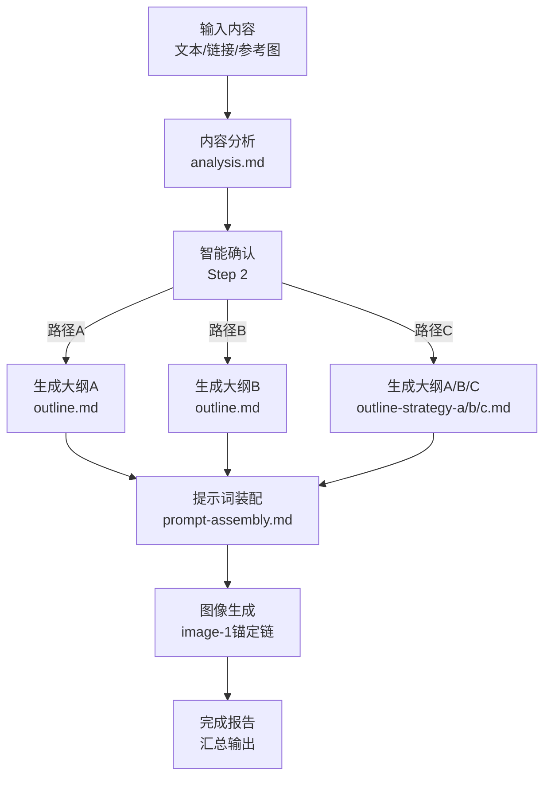
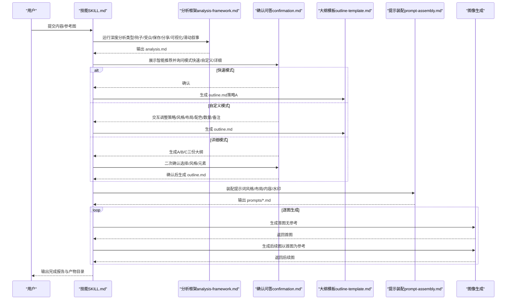
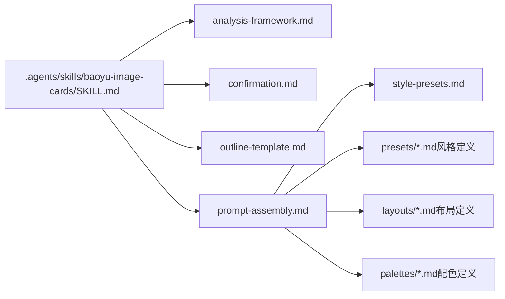

# 预设模板与工作流程

<cite>
**本文引用的文件**
- [SKILL.md](file://.agents/skills/baoyu-image-cards/SKILL.md)
- [style-presets.md](file://.agents/skills/baoyu-image-cards/references/style-presets.md)
- [analysis-framework.md](file://.agents/skills/baoyu-image-cards/references/workflows/analysis-framework.md)
- [outline-template.md](file://.agents/skills/baoyu-image-cards/references/workflows/outline-template.md)
- [prompt-assembly.md](file://.agents/skills/baoyu-image-cards/references/workflows/prompt-assembly.md)
- [confirmation.md](file://.agents/skills/baoyu-image-cards/references/confirmation.md)
- [cute.md](file://.agents/skills/baoyu-image-cards/references/presets/cute.md)
- [fresh.md](file://.agents/skills/baoyu-image-cards/references/presets/fresh.md)
- [warm.md](file://.agents/skills/baoyu-image-cards/references/presets/warm.md)
- [bold.md](file://.agents/skills/baoyu-image-cards/references/presets/bold.md)
- [minimal.md](file://.agents/skills/baoyu-image-cards/references/presets/minimal.md)
- [retro.md](file://.agents/skills/baoyu-image-cards/references/presets/retro.md)
- [pop.md](file://.agents/skills/baoyu-image-cards/references/presets/pop.md)
- [notion.md](file://.agents/skills/baoyu-image-cards/references/presets/notion.md)
- [chalkboard.md](file://.agents/skills/baoyu-image-cards/references/presets/chalkboard.md)
- [study-notes.md](file://.agents/skills/baoyu-image-cards/references/presets/study-notes.md)
- [screen-print.md](file://.agents/skills/baoyu-image-cards/references/presets/screen-print.md)
- [sketch-notes.md](file://.agents/skills/baoyu-image-cards/references/presets/sketch-notes.md)
</cite>

## 目录
1. [简介](#简介)
2. [项目结构](#项目结构)
3. [核心组件](#核心组件)
4. [架构总览](#架构总览)
5. [详细组件分析](#详细组件分析)
6. [依赖关系分析](#依赖关系分析)
7. [性能考量](#性能考量)
8. [故障排查指南](#故障排查指南)
9. [结论](#结论)
10. [附录](#附录)

## 简介
本技术文档围绕“图像卡片”的预设模板与工作流程展开，系统性介绍五类预设模板（知识学习、生活方式、影响力、趋势娱乐、海报编辑）及其快捷组合，深入解析三种大纲策略（故事驱动A、信息密集B、视觉优先C）的设计理念与适用场景，并详细说明智能选择机制（关键词匹配与自动推荐规则）。文档还提供从内容分析到最终生成的完整工作流程，包含使用案例与最佳实践建议，帮助用户高效产出符合社交平台传播特性的系列图像卡片。

## 项目结构
该技能以“预设模板 + 工作流”为核心，通过明确的文件组织实现可复用、可扩展的生成管线：
- 预设模板：按风格（12种）、布局（8种）、配色（3种）与快捷预设（21个）组织，覆盖知识学习、生活方式、影响力、趋势娱乐、海报编辑等场景。
- 工作流：包含内容分析、智能确认、大纲生成、提示词组装、图像生成与一致性锚定、完成报告等步骤。
- 参考资料：样式定义、布局规范、配色说明、分析框架、大纲模板、提示词装配指南、确认问答等。

图表来源
- [.agents/skills/baoyu-image-cards/SKILL.md:275-393](file://.agents/skills/baoyu-image-cards/SKILL.md#L275-L393)
- [.agents/skills/baoyu-image-cards/references/workflows/analysis-framework.md:1-199](file://.agents/skills/baoyu-image-cards/references/workflows/analysis-framework.md#L1-L199)
- [.agents/skills/baoyu-image-cards/references/workflows/prompt-assembly.md:1-379](file://.agents/skills/baoyu-image-cards/references/workflows/prompt-assembly.md#L1-L379)

章节来源
- [.agents/skills/baoyu-image-cards/SKILL.md:258-300](file://.agents/skills/baoyu-image-cards/SKILL.md#L258-L300)

## 核心组件
- 预设模板体系
  - 风格（12）：cute、fresh、warm、bold、minimal、retro、pop、notion、chalkboard、study-notes、screen-print、sketch-notes
  - 布局（8）：sparse、balanced、dense、list、comparison、flow、mindmap、quadrant
  - 配色（3）：macaron、warm、neon（部分风格带默认配色）
  - 快捷预设（21）：按场景聚合，如知识学习（knowledge-card、checklist、concept-map、swot、tutorial、classroom、study-guide、hand-drawn-edu、sketch-card、sketch-summary），生活方式（cute-share、girly、cozy-story、product-review、nature-flow），影响力（warning、versus、clean-quote、pro-summary），趋势娱乐（retro-ranking、throwback、pop-facts、hype），海报编辑（poster、editorial、cinematic）
- 大纲策略（3）
  - A：故事驱动（情感共鸣优先，结构：Hook→Problem→Discovery→Experience→Conclusion）
  - B：信息密集（价值优先，结构：核心结论→信息卡→正反对比→推荐）
  - C：视觉优先（高美感低文本，结构：英雄图→细节→生活化场景→行动号召）
- 智能选择机制
  - 基于源内容信号的关键词匹配，命中即返回对应风格/布局/预设组合；无命中回退至cute-share
  - 自动推荐同时考虑内容类型、受众画像、保存/分享触发点、可视化机会点与滑动叙事弧
- 提示词装配与一致性
  - 严格分段装配（基础规范、风格、布局、内容、水印），并以“image-1锚定链”确保跨图一致性
  - 支持显式参数覆盖与预设解析

章节来源
- [.agents/skills/baoyu-image-cards/SKILL.md:126-230](file://.agents/skills/baoyu-image-cards/SKILL.md#L126-L230)
- [.agents/skills/baoyu-image-cards/references/style-presets.md:1-44](file://.agents/skills/baoyu-image-cards/references/style-presets.md#L1-L44)
- [.agents/skills/baoyu-image-cards/references/workflows/analysis-framework.md:21-120](file://.agents/skills/baoyu-image-cards/references/workflows/analysis-framework.md#L21-L120)
- [.agents/skills/baoyu-image-cards/references/workflows/prompt-assembly.md:5-114](file://.agents/skills/baoyu-image-cards/references/workflows/prompt-assembly.md#L5-L114)

## 架构总览
整体流程分为四个阶段：内容分析、智能确认、大纲生成与提示词装配、图像生成与一致性锚定。

图表来源
- [.agents/skills/baoyu-image-cards/SKILL.md:275-393](file://.agents/skills/baoyu-image-cards/SKILL.md#L275-L393)
- [.agents/skills/baoyu-image-cards/references/workflows/analysis-framework.md:1-199](file://.agents/skills/baoyu-image-cards/references/workflows/analysis-framework.md#L1-L199)
- [.agents/skills/baoyu-image-cards/references/workflows/outline-template.md:1-248](file://.agents/skills/baoyu-image-cards/references/workflows/outline-template.md#L1-L248)
- [.agents/skills/baoyu-image-cards/references/workflows/prompt-assembly.md:189-264](file://.agents/skills/baoyu-image-cards/references/workflows/prompt-assembly.md#L189-L264)

## 详细组件分析

### 预设模板与快捷组合
- 知识学习
  - knowledge-card（notion + dense）：知识卡片风格，适合干货分享
  - checklist（notion + list）：清爽清单风格
  - concept-map（notion + mindmap）：概念图/知识脉络
  - swot（notion + quadrant）：SWOT分析/四象限
  - tutorial（chalkboard + flow）：教程步骤
  - classroom（chalkboard + balanced）：课堂笔记/知识讲解
  - study-guide（study-notes + dense）：学习笔记/考试重点
  - hand-drawn-edu（sketch-notes + flow + macaron）：手绘教程/流程图解
  - sketch-card（sketch-notes + dense + macaron）：手绘知识卡
  - sketch-summary（sketch-notes + balanced + macaron）：手绘总结/图文笔记
- 生活方式
  - cute-share（cute + balanced）：少女风分享/日常种草
  - girly（cute + sparse）：甜美封面/氛围感
  - cozy-story（warm + balanced）：生活故事/情感分享
  - product-review（fresh + comparison）：产品对比/测评
  - nature-flow（fresh + flow）：健康流程/自然主题
- 影响力
  - warning（bold + list）：避坑指南/重要提醒
  - versus（bold + comparison）：正反对比
  - clean-quote（minimal + sparse）：金句/极简封面
  - pro-summary（minimal + balanced）：专业总结/商务内容
- 趋势娱乐
  - retro-ranking（retro + list）：复古排行/经典盘点
  - throwback（retro + balanced）：怀旧分享
  - pop-facts（pop + list）：趣味冷知识
  - hype（pop + sparse）：炸裂封面/惊叹分享
- 海报编辑
  - poster（screen-print + sparse）：海报风封面/影评书评
  - editorial（screen-print + balanced）：观点文章/文化评论
  - cinematic（screen-print + comparison）：电影对比/戏剧张力

章节来源
- [.agents/skills/baoyu-image-cards/SKILL.md:126-182](file://.agents/skills/baoyu-image-cards/SKILL.md#L126-L182)
- [.agents/skills/baoyu-image-cards/references/style-presets.md:5-44](file://.agents/skills/baoyu-image-cards/references/style-presets.md#L5-L44)

### 三大大纲策略与适用场景
- A：故事驱动（情感优先）
  - 结构：Hook → Problem → Discovery → Experience → Conclusion
  - 适用：评测、个人分享、转变类内容
  - 特点：强调情绪共鸣与个人体验
- B：信息密集（价值优先）
  - 结构：核心结论 → 信息卡 → 正反对比 → 推荐
  - 适用：教程、对比、清单
  - 特点：高效传递信息，便于收藏/转发
- C：视觉优先（高美感低文本）
  - 结构：英雄图 → 细节 → 生活化场景 → CTA
  - 适用：高质感产品、生活方式、氛围内容
  - 特点：最小化文字，最大化视觉冲击

章节来源
- [.agents/skills/baoyu-image-cards/SKILL.md:221-230](file://.agents/skills/baoyu-image-cards/SKILL.md#L221-L230)
- [.agents/skills/baoyu-image-cards/references/workflows/outline-template.md:234-248](file://.agents/skills/baoyu-image-cards/references/workflows/outline-template.md#L234-L248)

### 智能选择机制（关键词匹配与自动推荐）
- 关键词匹配表（命中即返回对应组合，无命中回退至cute-share）
  - 美妆/时尚/可爱/女孩/粉色 → cute（sparse/balanced）
  - 健康/自然/新鲜/有机 → fresh（balanced/flow）
  - 生活/故事/情感/温暖 → warm（balanced）
  - 警告/重要/必须/关键 → bold（list/comparison）
  - 专业/商务/优雅 → minimal（sparse/balanced）
  - 经典/复古/传统 → retro（balanced）
  - 有趣/兴奋/哇/惊人 → pop（sparse/list）
  - 知识/概念/生产力/SaaS → notion（dense/list）
  - 教育/教程/学习/课堂 → chalkboard（balanced/dense）
  - 笔记/手写/学习指南/真实 → study-notes（dense/list/mindmap）
  - 电影/海报/观点/编辑/电影感 → screen-print（sparse/comparison）
  - 手绘/信息图/流程/图解 → sketch-notes（flow/balanced/dense）

章节来源
- [.agents/skills/baoyu-image-cards/SKILL.md:183-201](file://.agents/skills/baoyu-image-cards/SKILL.md#L183-L201)
- [.agents/skills/baoyu-image-cards/references/workflows/analysis-framework.md:166-186](file://.agents/skills/baoyu-image-cards/references/workflows/analysis-framework.md#L166-L186)

### 提示词装配与一致性锚定
- 装配结构
  - 基础规范：竖版3:4、手绘风格、语言与标点、关键词强调、留白与层级
  - 风格段：颜色、视觉元素、排版风格（不同风格有差异化规则）
  - 布局段：密度、留白、结构与平衡
  - 内容段：位置、核心信息、文本层次、视觉概念、滑动钩子
  - 水印段：启用时追加
- 一致性锚定
  - 首图不带参考，后续图均以首图作为参考，确保角色/风格/色彩一致
  - 支持会话ID与参考链结合，进一步稳定生成结果

章节来源
- [.agents/skills/baoyu-image-cards/references/workflows/prompt-assembly.md:5-114](file://.agents/skills/baoyu-image-cards/references/workflows/prompt-assembly.md#L5-L114)
- [.agents/skills/baoyu-image-cards/references/workflows/prompt-assembly.md:251-264](file://.agents/skills/baoyu-image-cards/references/workflows/prompt-assembly.md#L251-L264)

### 工作流程详解（从内容分析到最终生成）
- 步骤0：加载偏好（EXTEND.md）
  - 优先级：项目内 > XDG > 用户家目录；未找到且交互则首次设置；未找到且非交互则使用内置默认
- 步骤1：内容分析 → analysis.md
  - 内容类型、钩子潜力、受众画像、保存/分享触发、可视化机会、滑动叙事弧、推荐图片数
- 步骤2：智能确认（必经）
  - 路径A：快速确认（信任自动推荐）
  - 路径B：自定义（策略/风格/布局/配色/数量/备注）
  - 路径C：详细模式（先理解内容，再生成A/B/C三份大纲，最后选择）
- 步骤3：生成图像
  - 逐图写出完整提示词文件，首图无参考，后续图以首图为参考
  - 后端选择遵循优先级：当前请求覆盖 > 保存偏好 > 自动选择 > 用户确认
  - 可选水印：按偏好追加至提示词
- 步骤4：完成报告
  - 汇总主题、模式、策略、风格、配色、布局、位置、图片数量与产物清单

章节来源
- [.agents/skills/baoyu-image-cards/SKILL.md:275-393](file://.agents/skills/baoyu-image-cards/SKILL.md#L275-L393)

### 风格与布局矩阵（兼容性评分）
- 矩阵用于指导用户在非默认组合下的兼容性判断，高分组合更推荐
- 示例：notion在所有布局上均高度兼容；study-notes在mindmap上不推荐；screen-print在mindmap上不推荐

章节来源
- [.agents/skills/baoyu-image-cards/SKILL.md:202-220](file://.agents/skills/baoyu-image-cards/SKILL.md#L202-L220)

### 参考图像与风格/配色提取
- 用户可通过--ref传入参考图，支持三种用法：direct（作为锚定）、style（提取风格特征）、palette（提取色板）
- 建议：首图使用direct，后续图沿用首图作为参考，避免叠加冲突信号

章节来源
- [.agents/skills/baoyu-image-cards/SKILL.md:231-257](file://.agents/skills/baoyu-image-cards/SKILL.md#L231-L257)

### 使用案例与最佳实践
- 案例1：AI工具推荐（信息密集B）
  - 推荐：notion + dense 或 notion + list
  - 大纲：核心结论→信息卡→对比→推荐
  - 图片数：6张（封面/铺垫/核心×3/结尾）
- 案例2：护肤产品测评（视觉优先C）
  - 推荐：screen-print + sparse 或 minimal + sparse
  - 大纲：英雄图→细节→生活化场景→CTA
  - 图片数：4张（封面/细节/场景/结尾）
- 案例3：个人成长分享（故事驱动A）
  - 推荐：warm + balanced
  - 大纲：Hook→问题→发现→体验→结论
  - 图片数：5张（封面/问题/发现/体验/结论）
- 最佳实践
  - 首图锚定：务必先生成首图，再以首图为参考生成后续图
  - 配色策略：无--palette则沿用风格默认或风格声明的默认配色；需要统一品牌色时再显式指定
  - 滑动钩子：每张图结尾预留钩子，保持连续性与期待感
  - 水印：仅在需要时开启，避免干扰主视觉

章节来源
- [.agents/skills/baoyu-image-cards/references/workflows/outline-template.md:221-248](file://.agents/skills/baoyu-image-cards/references/workflows/outline-template.md#L221-L248)
- [.agents/skills/baoyu-image-cards/references/workflows/analysis-framework.md:102-120](file://.agents/skills/baoyu-image-cards/references/workflows/analysis-framework.md#L102-L120)

## 依赖关系分析
- 文件间依赖
  - SKILL.md 作为入口，调用 analysis-framework.md、confirmation.md、outline-template.md、prompt-assembly.md
  - style-presets.md 为快捷预设的权威来源，被 SKILL.md 与 prompt-assembly.md 使用
  - 各风格/布局/配色定义文件（如 cute.md、notion.md、screen-print.md 等）为提示装配提供风格与布局细节
- 组件耦合
  - 工作流各阶段强耦合（分析→确认→大纲→提示装配→生成），但风格/布局/配色定义相对独立，便于扩展
  - 一致性锚定链路与后端选择逻辑独立于风格定义，降低耦合风险

图表来源
- [.agents/skills/baoyu-image-cards/SKILL.md:414-432](file://.agents/skills/baoyu-image-cards/SKILL.md#L414-L432)
- [.agents/skills/baoyu-image-cards/references/style-presets.md:1-44](file://.agents/skills/baoyu-image-cards/references/style-presets.md#L1-L44)
- [.agents/skills/baoyu-image-cards/references/workflows/prompt-assembly.md:189-264](file://.agents/skills/baoyu-image-cards/references/workflows/prompt-assembly.md#L189-L264)

章节来源
- [.agents/skills/baoyu-image-cards/SKILL.md:414-432](file://.agents/skills/baoyu-image-cards/SKILL.md#L414-L432)

## 性能考量
- 生成性能
  - 采用“首图锚定链”减少角色/风格漂移，提高成功率，降低重试成本
  - 合理控制图片数量与布局密度，避免过度拥挤导致渲染失败
- 提示词装配
  - 按需加载风格/布局/配色定义，避免冗余拼接
  - 显式参数优先级高于预设，减少歧义与回溯
- 后端选择
  - 优先使用运行时原生图像工具，其次自动选择或用户确认，避免不必要的等待

## 故障排查指南
- 无法生成图像
  - 检查 EXTEND.md 是否存在且可读；若不存在且非交互，将使用内置默认；若交互则触发首次设置
  - 若多后端可用，确认是否已按优先级选择；必要时使用--yes跳过确认
- 生成结果风格不一致
  - 确保首图未使用参考，后续图均以首图为参考；检查会话ID与参考链是否正确
- 提示词缺失
  - 在调用后端前，确保 prompts/NN-*.md 已生成；遵循备份规则，避免覆盖
- 水印未生效
  - 检查 EXTEND.md 中水印开关与内容配置；仅在启用时追加至提示词

章节来源
- [.agents/skills/baoyu-image-cards/SKILL.md:285-300](file://.agents/skills/baoyu-image-cards/SKILL.md#L285-L300)
- [.agents/skills/baoyu-image-cards/SKILL.md:342-370](file://.agents/skills/baoyu-image-cards/SKILL.md#L342-L370)
- [.agents/skills/baoyu-image-cards/references/workflows/prompt-assembly.md:251-264](file://.agents/skills/baoyu-image-cards/references/workflows/prompt-assembly.md#L251-L264)

## 结论
本技能通过“预设模板 + 大纲策略 + 智能选择 + 一致性锚定”的闭环，将复杂内容转化为高传播力的系列图像卡片。用户可依据场景快速选择预设，或在详细模式下探索三种策略的差异；借助智能推荐与分析框架，能够精准匹配受众与平台特性，显著提升内容的钩子、滑动动机、收藏价值与分享触发。配合严格的提示词装配与生成流程，可在保证质量的同时提升生产效率。

## 附录
- 快捷预设一览（节选）
  - 知识学习：knowledge-card、checklist、concept-map、swot、tutorial、classroom、study-guide、hand-drawn-edu、sketch-card、sketch-summary
  - 生活方式：cute-share、girly、cozy-story、product-review、nature-flow
  - 影响力：warning、versus、clean-quote、pro-summary
  - 趋势娱乐：retro-ranking、throwback、pop-facts、hype
  - 海报编辑：poster、editorial、cinematic
- 风格与布局矩阵（节选）
  - notion 在 dense/list/mindmap/quadrant 上高度兼容
  - study-notes 在 mindmap 上兼容性一般
  - screen-print 在 mindmap 上不推荐

章节来源
- [.agents/skills/baoyu-image-cards/references/style-presets.md:5-44](file://.agents/skills/baoyu-image-cards/references/style-presets.md#L5-L44)
- [.agents/skills/baoyu-image-cards/SKILL.md:202-220](file://.agents/skills/baoyu-image-cards/SKILL.md#L202-L220)