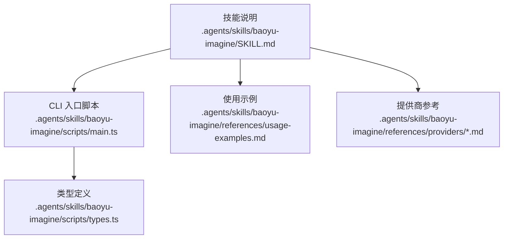
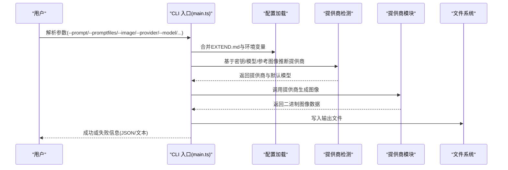
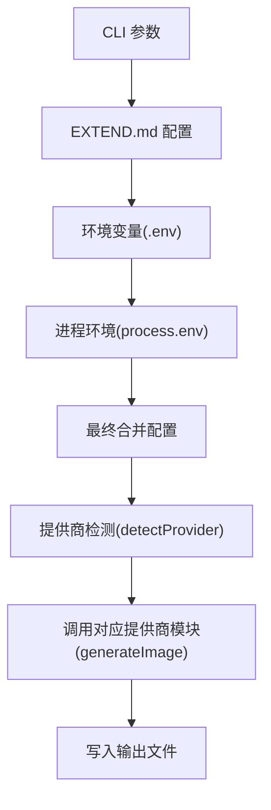

# CLI 使用示例

<cite>
**本文引用的文件**
- [SKILL.md](file://.agents/skills/baoyu-imagine/SKILL.md)
- [main.ts](file://.agents/skills/baoyu-imagine/scripts/main.ts)
- [types.ts](file://.agents/skills/baoyu-imagine/scripts/types.ts)
- [usage-examples.md](file://.agents/skills/baoyu-imagine/references/usage-examples.md)
- [dashscope.md](file://.agents/skills/baoyu-imagine/references/providers/dashscope.md)
- [zai.md](file://.agents/skills/baoyu-imagine/references/providers/zai.md)
- [minimax.md](file://.agents/skills/baoyu-imagine/references/providers/minimax.md)
- [openrouter.md](file://.agents/skills/baoyu-imagine/references/providers/openrouter.md)
- [replicate.md](file://.agents/skills/baoyu-imagine/references/providers/replicate.md)
</cite>

## 目录
1. [简介](#简介)
2. [项目结构](#项目结构)
3. [核心组件](#核心组件)
4. [架构总览](#架构总览)
5. [详细组件分析](#详细组件分析)
6. [依赖关系分析](#依赖关系分析)
7. [性能考量](#性能考量)
8. [故障排查指南](#故障排查指南)
9. [结论](#结论)
10. [附录](#附录)

## 简介
本文件面向 baoyu-imagine 技能的 CLI 用户，提供从基础到高级的完整命令行使用示例与说明，覆盖文本到图像生成、参考图像处理、纵横比与尺寸设置、批量作业执行等。文档同时解释各 CLI 选项的含义与参数组合，并针对不同提供商（OpenAI、Azure、Google、OpenRouter、DashScope、Z.AI、MiniMax、Jimeng、Seedream、Replicate）给出特定参数要求与兼容性提示。最后提供常见问题与解决方案、性能优化与最佳实践。

## 项目结构
baoyu-imagine 的 CLI 主程序位于技能目录下的脚本文件中，核心逻辑集中在主入口脚本与类型定义中；使用示例与提供商细节分别汇总在参考文档中。

图表来源
- [SKILL.md](file://.agents/skills/baoyu-imagine/SKILL.md)
- [main.ts](file://.agents/skills/baoyu-imagine/scripts/main.ts)
- [types.ts](file://.agents/skills/baoyu-imagine/scripts/types.ts)
- [usage-examples.md](file://.agents/skills/baoyu-imagine/references/usage-examples.md)
- [dashscope.md](file://.agents/skills/baoyu-imagine/references/providers/dashscope.md)
- [zai.md](file://.agents/skills/baoyu-imagine/references/providers/zai.md)
- [minimax.md](file://.agents/skills/baoyu-imagine/references/providers/minimax.md)
- [openrouter.md](file://.agents/skills/baoyu-imagine/references/providers/openrouter.md)
- [replicate.md](file://.agents/skills/baoyu-imagine/references/providers/replicate.md)

章节来源
- [SKILL.md](file://.agents/skills/baoyu-imagine/SKILL.md)
- [main.ts](file://.agents/skills/baoyu-imagine/scripts/main.ts)
- [types.ts](file://.agents/skills/baoyu-imagine/scripts/types.ts)
- [usage-examples.md](file://.agents/skills/baoyu-imagine/references/usage-examples.md)

## 核心组件
- CLI 参数解析：支持提示词、提示词文件、输出路径、批处理文件、工作并发数、提供商、模型、纵横比、尺寸、质量、图像尺寸、OpenAI 兼容方言、参考图像、生成数量、JSON 输出、帮助等。
- 配置加载：优先级为 CLI > EXTEND.md > 环境变量 > 当前目录 .env > 用户目录 .env。
- 提供商选择：根据可用密钥、参考图像需求、模型推断自动选择；也可显式指定。
- 批量模式：当批处理任务≥2时自动并行；默认最大并发可配置；每张图最多重试3次。
- 输出与扩展：支持单图与多图输出，JSON 模式便于集成；支持通过 EXTEND.md 自定义默认提供商、质量、纵横比、尺寸、模型与并发限制。

章节来源
- [SKILL.md](file://.agents/skills/baoyu-imagine/SKILL.md)
- [main.ts](file://.agents/skills/baoyu-imagine/scripts/main.ts)
- [types.ts](file://.agents/skills/baoyu-imagine/scripts/types.ts)

## 架构总览
CLI 调用流程概览如下：

图表来源
- [main.ts](file://.agents/skills/baoyu-imagine/scripts/main.ts)
- [SKILL.md](file://.agents/skills/baoyu-imagine/SKILL.md)

## 详细组件分析

### CLI 选项与参数组合
- 基础必选/可选项
  - --prompt/-p 文本提示词
  - --promptfiles 多个提示词文件（内容拼接）
  - --image 输出图像路径（单图模式必需）
  - --batchfile 批处理 JSON 文件
  - --jobs 并发工作线程数（默认自动，受 EXTEND.md 与环境变量约束）
  - --provider 显式指定提供商（google/openai/openrouter/dashscope/zai/minimax/replicate/jimeng/seedream/azure）
  - --model/-m 模型 ID（按提供商默认值或 EXTEND.md/环境变量）
  - --ar 纵横比（如 16:9、1:1、4:3 等）
  - --size 尺寸 WxH（如 1024x1024；OpenAI 有额外规则）
  - --quality normal/2k（默认 2k）
  - --imageSize 1K/2K/4K（Google/OpenRouter）
  - --imageApiDialect openai-native/ratio-metadata（OpenAI 兼容网关方言）
  - --ref 参考图像（部分提供商/模型支持）
  - --n 图像数量（Replicate 当前要求为 1）
  - --json 输出 JSON
  - --help/-h 帮助
- 环境变量（优先级：CLI > EXTEND.md > 进程环境 > 当前目录 .env > 用户目录 .env）
  - 各提供商 API Key 与 Endpoint
  - 各提供商默认模型覆盖
  - OpenAI 方言与属性注入
  - 并发与节流控制（BAOYU_IMAGE_GEN_*）

章节来源
- [SKILL.md](file://.agents/skills/baoyu-imagine/SKILL.md)
- [main.ts](file://.agents/skills/baoyu-imagine/scripts/main.ts)
- [types.ts](file://.agents/skills/baoyu-imagine/scripts/types.ts)

### 使用示例与场景
- 基础文本到图像
  - 示例：指定提示词与输出文件
  - 参考：[usage-examples.md](file://.agents/skills/baoyu-imagine/references/usage-examples.md)
- 设置纵横比与高质量
  - 示例：--ar 16:9 与 --quality 2k
  - 参考：[usage-examples.md](file://.agents/skills/baoyu-imagine/references/usage-examples.md)
- 从文件读取提示词
  - 示例：--promptfiles system.md content.md
  - 参考：[usage-examples.md](file://.agents/skills/baoyu-imagine/references/usage-examples.md)
- 参考图像处理
  - 示例：--ref source.png（需提供商/模型支持）
  - 参考：[usage-examples.md](file://.agents/skills/baoyu-imagine/references/usage-examples.md)
- 指定提供商与模型
  - 示例：--provider dashscope --model qwen-image-2.0-pro
  - 参考：[usage-examples.md](file://.agents/skills/baoyu-imagine/references/usage-examples.md)
- OpenAI GPT Image 2
  - 示例：--provider openai --model gpt-image-2
  - 参考：[usage-examples.md](file://.agents/skills/baoyu-imagine/references/usage-examples.md)
- 批处理模式
  - 示例：--batchfile batch.json 与 --jobs 4
  - 参考：[usage-examples.md](file://.agents/skills/baoyu-imagine/references/usage-examples.md)

章节来源
- [usage-examples.md](file://.agents/skills/baoyu-imagine/references/usage-examples.md)

### 不同提供商的特定参数与兼容性
- DashScope（阿里通义万象）
  - 支持 qwen-image-2.0* 家族（自由尺寸，像素范围与推荐表）
  - 支持固定尺寸家族（仅允许五种尺寸）
  - 支持 wan2.7-image*（多模态），支持 up to 9 张参考图，4K 需显式 --size
  - 参考：[dashscope.md](file://.agents/skills/baoyu-imagine/references/providers/dashscope.md)
- Z.AI（GLM-Image）
  - 默认模型 glm-image；不支持 --ref
  - 自定义尺寸有宽度/高度范围与总像素限制
  - 参考：[zai.md](file://.agents/skills/baoyu-imagine/references/providers/zai.md)
- MiniMax
  - 支持官方 aspect_ratio 值与自定义 --size <WxH>
  - 支持 subject-reference（角色一致性）
  - 参考：[minimax.md](file://.agents/skills/baoyu-imagine/references/providers/minimax.md)
- OpenRouter
  - 使用 /chat/completions 流程；需多模态模型支持输入/输出
  - --imageSize 映射 imageGenerationOptions.size
  - 参考：[openrouter.md](file://.agents/skills/baoyu-imagine/references/providers/openrouter.md)
- Replicate
  - 支持 google/nano-banana*、bytedance/seedream-*、wan-video/wan-2.7-image*
  - --size 仅作为已知纵横比与 1K/2K 的简写；超出范围会本地校验拒绝
  - 当前仅支持单输出保存语义（--n 必须为 1）
  - 参考：[replicate.md](file://.agents/skills/baoyu-imagine/references/providers/replicate.md)

章节来源
- [dashscope.md](file://.agents/skills/baoyu-imagine/references/providers/dashscope.md)
- [zai.md](file://.agents/skills/baoyu-imagine/references/providers/zai.md)
- [minimax.md](file://.agents/skills/baoyu-imagine/references/providers/minimax.md)
- [openrouter.md](file://.agents/skills/baoyu-imagine/references/providers/openrouter.md)
- [replicate.md](file://.agents/skills/baoyu-imagine/references/providers/replicate.md)

### 批处理与并行执行
- 触发条件：批处理任务数量 ≥ 2 时自动并行
- 并发上限：默认 10，可通过 EXTEND.md 或环境变量覆盖
- 重试策略：每张图最多重试 3 次
- 输出：成功/失败计数与逐项失败原因
- 批处理文件格式：jobs 与 tasks 数组；支持相对路径解析
- 参考：[SKILL.md](file://.agents/skills/baoyu-imagine/SKILL.md)、[usage-examples.md](file://.agents/skills/baoyu-imagine/references/usage-examples.md)

章节来源
- [SKILL.md](file://.agents/skills/baoyu-imagine/SKILL.md)
- [usage-examples.md](file://.agents/skills/baoyu-imagine/references/usage-examples.md)

### 实际使用场景示例
- 社交媒体图片生成
  - 场景：按 16:9 纵横比生成封面图，使用高质量输出
  - 建议：--ar 16:9 --quality 2k；必要时配合 --imageSize 2K/4K
- 产品展示图制作
  - 场景：固定尺寸与比例，确保文字与细节清晰
  - 建议：--size 1920x1080 或 --ar 16:9 + --quality 2k；DashScope/MiniMax/Z.AI 可按需调整
- 艺术创作辅助
  - 场景：结合参考图像进行风格迁移或融合
  - 建议：--ref source.png；优先选择支持参考图的提供商（如 Google、OpenAI、Azure、OpenRouter、Replicate、DashScope wan2.7、Seedream、MiniMax subject-ref）

章节来源
- [usage-examples.md](file://.agents/skills/baoyu-imagine/references/usage-examples.md)
- [dashscope.md](file://.agents/skills/baoyu-imagine/references/providers/dashscope.md)
- [minimax.md](file://.agents/skills/baoyu-imagine/references/providers/minimax.md)
- [replicate.md](file://.agents/skills/baoyu-imagine/references/providers/replicate.md)

## 依赖关系分析
CLI 参数与配置的依赖关系如下：

图表来源
- [main.ts](file://.agents/skills/baoyu-imagine/scripts/main.ts)
- [SKILL.md](file://.agents/skills/baoyu-imagine/SKILL.md)

章节来源
- [main.ts](file://.agents/skills/baoyu-imagine/scripts/main.ts)
- [SKILL.md](file://.agents/skills/baoyu-imagine/SKILL.md)

## 性能考量
- 并发与节流
  - 默认最大并发为 10；可通过 BAOYU_IMAGE_GEN_MAX_WORKERS 或 EXTEND.md 的 batch.max_workers 调整
  - 各提供商内置并发与启动间隔限制，可通过 BAOYU_IMAGE_GEN_<PROVIDER>_CONCURRENCY 与 START_INTERVAL_MS 调整
- 重试与稳定性
  - 单图最多重试 3 次，降低偶发失败影响
- 输出质量与尺寸
  - --quality 与 --imageSize 控制输出分辨率；部分提供商（如 OpenAI）对尺寸有额外规则
- 批处理吞吐
  - 批处理自动并行，适合已有保存好的提示词文件与批量产出场景

章节来源
- [SKILL.md](file://.agents/skills/baoyu-imagine/SKILL.md)
- [main.ts](file://.agents/skills/baoyu-imagine/scripts/main.ts)

## 故障排查指南
- 缺少 API 密钥
  - 现象：报错提示未找到可用密钥
  - 处理：在 ~/.baoyu-skills/.env 或当前目录 .baoyu-skills/.env 中添加对应提供商密钥
- 生成失败
  - 现象：单图多次重试后仍失败
  - 处理：检查网络、提供商限额、模型可用性；必要时更换提供商或降低并发
- 纵横比无效
  - 现象：警告并回退默认
  - 处理：使用受支持的纵横比（如 1:1、16:9、4:3 等）
- 参考图像不被支持
  - 现象：指定 --ref 但提供商/模型不支持
  - 处理：移除 --ref 或改用支持参考图的提供商/模型（如 Google、OpenAI、Azure、OpenRouter、Replicate、DashScope wan2.7、Seedream、MiniMax subject-ref）
- Replicate 仅支持单输出
  - 现象：--n > 1 被拒绝
  - 处理：保持 --n 为 1；如需多图网格，请直接调用 Replicate API

章节来源
- [SKILL.md](file://.agents/skills/baoyu-imagine/SKILL.md)
- [main.ts](file://.agents/skills/baoyu-imagine/scripts/main.ts)

## 结论
baoyu-imagine CLI 提供了统一的跨提供商图像生成体验，支持从基础文本到图像到参考图像融合，再到批量并行生成的全链路能力。通过 EXTEND.md 与环境变量，用户可以灵活定制默认行为与并发策略；在不同提供商之间切换时，注意其特有的模型家族、尺寸规则与参考图像支持范围，以获得更稳定与高质量的输出。

## 附录
- 批处理文件格式要点
  - jobs：可选，覆盖 CLI --jobs
  - tasks：数组，每个任务可含 id、promptFiles、image、provider、model、ar、size、quality、imageSize、ref、n
  - 路径解析：promptFiles、image、ref 相对于批处理文件所在目录
  - 参考：[usage-examples.md](file://.agents/skills/baoyu-imagine/references/usage-examples.md)

章节来源
- [usage-examples.md](file://.agents/skills/baoyu-imagine/references/usage-examples.md)