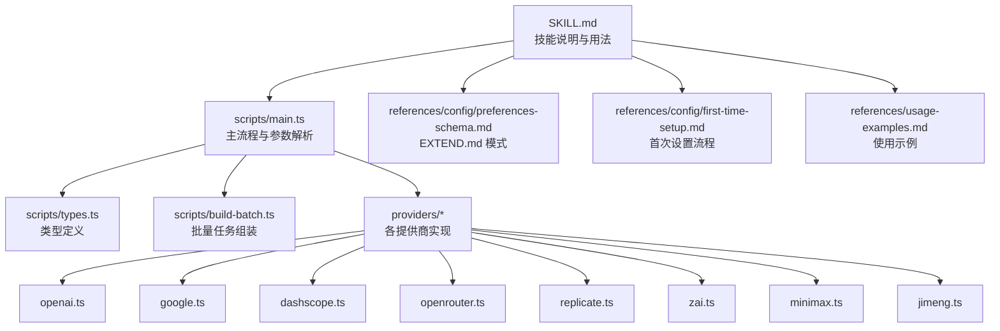
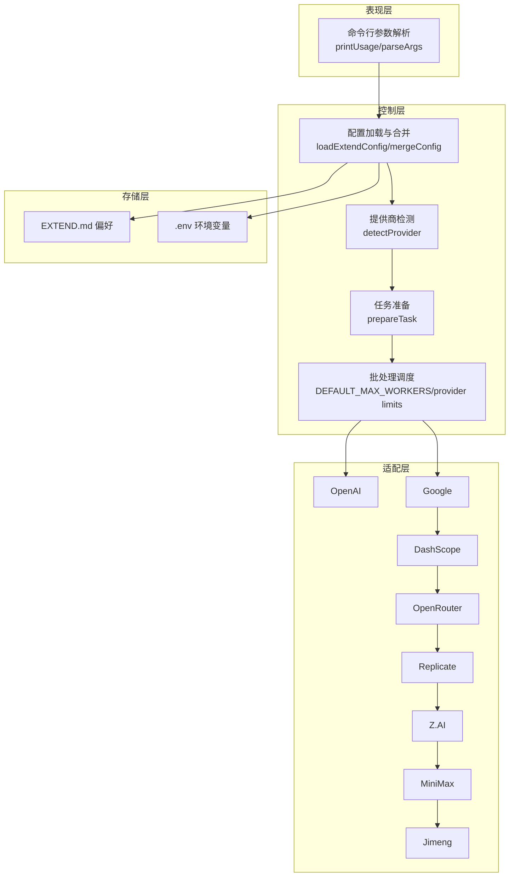
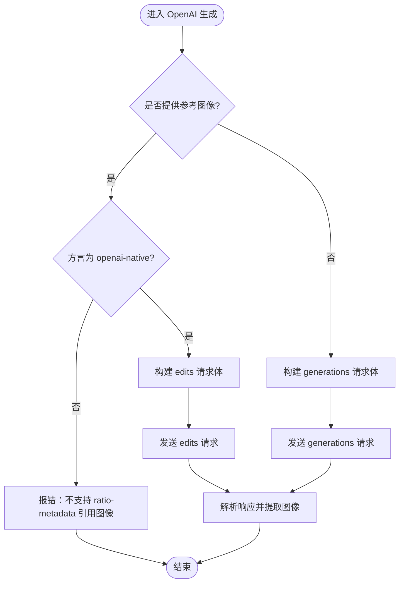
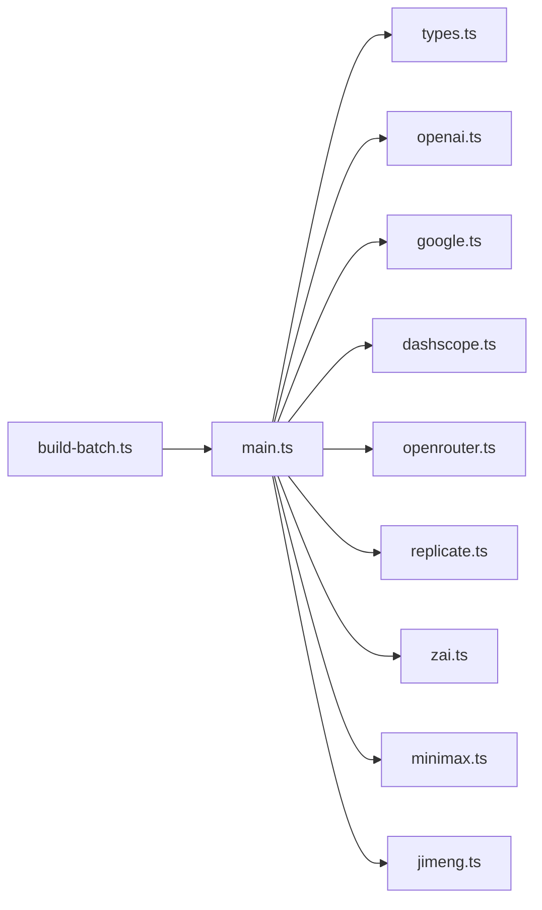

# baoyu-imagine 图像生成技能

<cite>
**本文引用的文件**
- [SKILL.md](file://.agents/skills/baoyu-imagine/SKILL.md)
- [main.ts](file://.agents/skills/baoyu-imagine/scripts/main.ts)
- [types.ts](file://.agents/skills/baoyu-imagine/scripts/types.ts)
- [build-batch.ts](file://.agents/skills/baoyu-imagine/scripts/build-batch.ts)
- [usage-examples.md](file://.agents/skills/baoyu-imagine/references/usage-examples.md)
- [preferences-schema.md](file://.agents/skills/baoyu-imagine/references/config/preferences-schema.md)
- [first-time-setup.md](file://.agents/skills/baoyu-imagine/references/config/first-time-setup.md)
- [openai.ts](file://.agents/skills/baoyu-imagine/scripts/providers/openai.ts)
- [google.ts](file://.agents/skills/baoyu-imagine/scripts/providers/google.ts)
- [dashscope.ts](file://.agents/skills/baoyu-imagine/scripts/providers/dashscope.ts)
- [openrouter.ts](file://.agents/skills/baoyu-imagine/scripts/providers/openrouter.ts)
- [replicate.ts](file://.agents/skills/baoyu-imagine/scripts/providers/replicate.ts)
- [zai.ts](file://.agents/skills/baoyu-imagine/scripts/providers/zai.ts)
- [minimax.ts](file://.agents/skills/baoyu-imagine/scripts/providers/minimax.ts)
- [jimeng.ts](file://.agents/skills/baoyu-imagine/scripts/providers/jimeng.ts)
</cite>

## 目录
1. [简介](#简介)
2. [项目结构](#项目结构)
3. [核心组件](#核心组件)
4. [架构总览](#架构总览)
5. [详细组件分析](#详细组件分析)
6. [依赖关系分析](#依赖关系分析)
7. [性能考量](#性能考量)
8. [故障排查指南](#故障排查指南)
9. [结论](#结论)
10. [附录](#附录)

## 简介
baoyu-imagine 是一个基于多提供商 API 的图像生成技能，支持 OpenAI、Azure OpenAI、Google、OpenRouter、DashScope、Z.AI、MiniMax、Jimeng、Seedream 和 Replicate 等多家服务。它提供统一的命令行接口，支持文本到图像、参考图像处理、纵横比与尺寸控制、以及批量任务调度与重试机制。技能通过 EXTEND.md 进行用户偏好配置，覆盖默认提供商、默认模型、质量预设、纵横比、图像尺寸、批处理并发限制等。

## 项目结构
技能位于 .agents/skills/baoyu-imagine 目录，主要由以下部分组成：
- 参考资料：配置模式、首次设置、使用示例与各提供商指南
- 脚本：主入口、类型定义、批量构建器、各提供商适配模块
- 技能元数据：SKILL.md 描述了 CLI 选项、环境变量、模型解析优先级、提供商选择策略、质量预设与纵横比支持等

图表来源
- [SKILL.md:1-238](file://.agents/skills/baoyu-imagine/SKILL.md#L1-L238)
- [main.ts:1-161](file://.agents/skills/baoyu-imagine/scripts/main.ts#L1-L161)
- [types.ts:1-91](file://.agents/skills/baoyu-imagine/scripts/types.ts#L1-L91)
- [build-batch.ts:1-82](file://.agents/skills/baoyu-imagine/scripts/build-batch.ts#L1-L82)
- [preferences-schema.md:1-136](file://.agents/skills/baoyu-imagine/references/config/preferences-schema.md#L1-L136)
- [first-time-setup.md:1-371](file://.agents/skills/baoyu-imagine/references/config/first-time-setup.md#L1-L371)
- [usage-examples.md:1-118](file://.agents/skills/baoyu-imagine/references/usage-examples.md#L1-L118)

章节来源
- [.agents/skills/baoyu-imagine/SKILL.md:1-238](file://.agents/skills/baoyu-imagine/SKILL.md#L1-L238)
- [.agents/skills/baoyu-imagine/scripts/main.ts:1-161](file://.agents/skills/baoyu-imagine/scripts/main.ts#L1-L161)
- [.agents/skills/baoyu-imagine/scripts/types.ts:1-91](file://.agents/skills/baoyu-imagine/scripts/types.ts#L1-L91)
- [.agents/skills/baoyu-imagine/scripts/build-batch.ts:1-82](file://.agents/skills/baoyu-imagine/scripts/build-batch.ts#L1-L82)
- [.agents/skills/baoyu-imagine/references/config/preferences-schema.md:1-136](file://.agents/skills/baoyu-imagine/references/config/preferences-schema.md#L1-L136)
- [.agents/skills/baoyu-imagine/references/config/first-time-setup.md:1-371](file://.agents/skills/baoyu-imagine/references/config/first-time-setup.md#L1-L371)
- [.agents/skills/baoyu-imagine/references/usage-examples.md:1-118](file://.agents/skills/baoyu-imagine/references/usage-examples.md#L1-L118)

## 核心组件
- 主入口与参数解析：负责解析 CLI 参数、加载 EXTEND.md、合并配置、检测提供商、准备任务、执行单图或批量生成，并进行重试与结果汇总
- 类型系统：统一描述 CLI 参数、批处理任务输入、EXTEND.md 结构与提供商枚举
- 批量构建器：从大纲与提示文件集合生成批量任务 JSON，便于复用与稳定吞吐
- 提供商适配模块：每个提供商封装其特有的请求体构造、尺寸/纵横比映射、引用图像支持、错误处理与输出提取

章节来源
- [.agents/skills/baoyu-imagine/scripts/main.ts:163-343](file://.agents/skills/baoyu-imagine/scripts/main.ts#L163-L343)
- [.agents/skills/baoyu-imagine/scripts/types.ts:15-91](file://.agents/skills/baoyu-imagine/scripts/types.ts#L15-L91)
- [.agents/skills/baoyu-imagine/scripts/build-batch.ts:47-82](file://.agents/skills/baoyu-imagine/scripts/build-batch.ts#L47-L82)

## 架构总览
技能采用“统一 CLI + 多提供商适配”的分层架构：
- 表现层：CLI 解析与帮助输出
- 控制层：配置合并、提供商选择、任务准备、批处理调度与重试
- 适配层：各提供商的具体实现（请求体、尺寸/纵横比、引用图像、响应提取）
- 存储层：EXTEND.md 用户偏好、.env 环境变量、批处理任务文件

图表来源
- [main.ts:163-343](file://.agents/skills/baoyu-imagine/scripts/main.ts#L163-L343)
- [main.ts:551-594](file://.agents/skills/baoyu-imagine/scripts/main.ts#L551-L594)
- [main.ts:691-777](file://.agents/skills/baoyu-imagine/scripts/main.ts#L691-L777)
- [main.ts:53-67](file://.agents/skills/baoyu-imagine/scripts/main.ts#L53-L67)
- [preferences-schema.md:34-61](file://.agents/skills/baoyu-imagine/references/config/preferences-schema.md#L34-L61)

章节来源
- [.agents/skills/baoyu-imagine/scripts/main.ts:53-67](file://.agents/skills/baoyu-imagine/scripts/main.ts#L53-L67)
- [.agents/skills/baoyu-imagine/scripts/main.ts:551-594](file://.agents/skills/baoyu-imagine/scripts/main.ts#L551-L594)
- [.agents/skills/baoyu-imagine/scripts/main.ts:691-777](file://.agents/skills/baoyu-imagine/scripts/main.ts#L691-L777)
- [.agents/skills/baoyu-imagine/references/config/preferences-schema.md:34-61](file://.agents/skills/baoyu-imagine/references/config/preferences-schema.md#L34-L61)

## 详细组件分析

### 统一 CLI 与参数解析
- 支持的选项：提示词、提示文件、输出路径、批处理文件、工作线程数、提供商、模型、纵横比、尺寸、质量、图像尺寸、图像 API 方言、参考图像、输出数量、JSON 输出、帮助
- 环境变量优先级：CLI > EXTEND.md > 进程环境 > 项目 .env > 用户 .env
- 位置参数：若未显式指定 --prompt/--promptfiles，则将剩余位置参数拼接为提示词

章节来源
- [.agents/skills/baoyu-imagine/scripts/main.ts:69-161](file://.agents/skills/baoyu-imagine/scripts/main.ts#L69-L161)
- [.agents/skills/baoyu-imagine/scripts/main.ts:163-343](file://.agents/skills/baoyu-imagine/scripts/main.ts#L163-L343)
- [.agents/skills/baoyu-imagine/SKILL.md:98-124](file://.agents/skills/baoyu-imagine/SKILL.md#L98-L124)

### 配置加载与合并（EXTEND.md）
- 加载顺序：项目 .baoyu-skills/baoyu-imagine/EXTEND.md > XDG 配置目录 > 用户家目录 .baoyu-skills/baoyu-imagine/EXTEND.md
- 兼容旧路径：自动迁移 .baoyu-skills/baoyu-image-gen/EXTEND.md 到新路径
- 合并规则：CLI 覆盖 EXTEND.md；EXTEND.md 覆盖环境变量
- 模式字段：默认提供商、默认质量、默认纵横比、默认图像尺寸、默认图像 API 方言、默认模型字典、批处理最大并发与各提供商并发限制

章节来源
- [.agents/skills/baoyu-imagine/scripts/main.ts:551-571](file://.agents/skills/baoyu-imagine/scripts/main.ts#L551-L571)
- [.agents/skills/baoyu-imagine/scripts/main.ts:573-594](file://.agents/skills/baoyu-imagine/scripts/main.ts#L573-L594)
- [.agents/skills/baoyu-imagine/scripts/main.ts:613-651](file://.agents/skills/baoyu-imagine/scripts/main.ts#L613-L651)
- [.agents/skills/baoyu-imagine/references/config/preferences-schema.md:10-61](file://.agents/skills/baoyu-imagine/references/config/preferences-schema.md#L10-L61)

### 批量任务构建（build-batch.ts）
- 输入：大纲文件、提示文件目录、输出批处理 JSON、图片输出目录、参考图像目录、默认提供商/模型/纵横比/质量/并发
- 输出：batch.json，包含 jobs 与 tasks 数组
- 规则：从大纲中解析插图条目，匹配对应提示文件，解析提示中的直接引用，组装任务列表

章节来源
- [.agents/skills/baoyu-imagine/scripts/build-batch.ts:47-82](file://.agents/skills/baoyu-imagine/scripts/build-batch.ts#L47-L82)
- [.agents/skills/baoyu-imagine/scripts/build-batch.ts:173-239](file://.agents/skills/baoyu-imagine/scripts/build-batch.ts#L173-L239)

### 提供商选择与检测
- 自动选择策略：
  - 提供参考图像且未指定提供商时：优先 Google → OpenAI → Azure → OpenRouter → Replicate → Seedream → MiniMax
  - 显式指定提供商：必须为受支持的提供商
  - 仅存在一个密钥：使用该提供商
  - 多个密钥：默认优先级 Google → OpenAI → Azure → OpenRouter → DashScope → Z.AI → MiniMax → Replicate → Jimeng → Seedream
- 引用图像校验：当提供参考图像但提供商不支持时，抛出明确错误提示

章节来源
- [.agents/skills/baoyu-imagine/SKILL.md:166-172](file://.agents/skills/baoyu-imagine/SKILL.md#L166-L172)
- [.agents/skills/baoyu-imagine/scripts/main.ts:691-777](file://.agents/skills/baoyu-imagine/scripts/main.ts#L691-L777)

### OpenAI（含 OpenAI 兼容网关方言）
- 默认模型：OPENAI_IMAGE_MODEL 或 gpt-image-2
- 尺寸与纵横比：
  - gpt-image-2：根据纵横比推导最接近的有效尺寸，满足像素步进与范围约束
  - 兼容方言 ratio-metadata：使用 aspect-ratio 字段与 metadata.resolution/orientation
- 引用图像：仅在 openai-native 方言下支持编辑类接口
- 错误校验：纵横比超限、尺寸格式/范围/步进非法、总像素范围非法

图表来源
- [openai.ts:278-318](file://.agents/skills/baoyu-imagine/scripts/providers/openai.ts#L278-L318)
- [openai.ts:204-237](file://.agents/skills/baoyu-imagine/scripts/providers/openai.ts#L204-L237)
- [openai.ts:239-276](file://.agents/skills/baoyu-imagine/scripts/providers/openai.ts#L239-L276)

章节来源
- [.agents/skills/baoyu-imagine/scripts/providers/openai.ts:5-7](file://.agents/skills/baoyu-imagine/scripts/providers/openai.ts#L5-L7)
- [.agents/skills/baoyu-imagine/scripts/providers/openai.ts:204-237](file://.agents/skills/baoyu-imagine/scripts/providers/openai.ts#L204-L237)
- [.agents/skills/baoyu-imagine/scripts/providers/openai.ts:239-276](file://.agents/skills/baoyu-imagine/scripts/providers/openai.ts#L239-L276)
- [.agents/skills/baoyu-imagine/scripts/providers/openai.ts:278-318](file://.agents/skills/baoyu-imagine/scripts/providers/openai.ts#L278-L318)

### Google（Gemini 多模态/Imagen）
- 模型族识别：Gemini 多模态 vs Imagen
- Gemini 多模态：支持参考图像，通过 inlineData 注入；imageConfig.aspectRatio 与 imageSize 控制
- Imagen：不支持参考图像；支持 aspectRatio 与 imageSize（4K 不可用）
- HTTP 代理：检测到 HTTPS_PROXY 等时改用 curl 发送请求以规避长连接问题

章节来源
- [.agents/skills/baoyu-imagine/scripts/providers/google.ts:16-36](file://.agents/skills/baoyu-imagine/scripts/providers/google.ts#L16-L36)
- [.agents/skills/baoyu-imagine/scripts/providers/google.ts:38-41](file://.agents/skills/baoyu-imagine/scripts/providers/google.ts#L38-L41)
- [.agents/skills/baoyu-imagine/scripts/providers/google.ts:124-163](file://.agents/skills/baoyu-imagine/scripts/providers/google.ts#L124-L163)
- [.agents/skills/baoyu-imagine/scripts/providers/google.ts:328-349](file://.agents/skills/baoyu-imagine/scripts/providers/google.ts#L328-L349)

### DashScope（Qwen-Image 家族）
- 模型族别：
  - qwen2：灵活自定义尺寸，支持负向提示、水印关闭、像素预算约束
  - qwenFixed：固定尺寸集，仅支持特定纵横比
  - wan2.7：支持最多 9 张参考图像，文本到图像最高 4K，参考图像最高 2K
- 尺寸解析：根据纵横比与质量推导或校验尺寸，确保在模型能力范围内
- 引用图像：仅 wan2.7 家族支持

章节来源
- [.agents/skills/baoyu-imagine/scripts/providers/dashscope.ts:7-110](file://.agents/skills/baoyu-imagine/scripts/providers/dashscope.ts#L7-L110)
- [.agents/skills/baoyu-imagine/scripts/providers/dashscope.ts:458-487](file://.agents/skills/baoyu-imagine/scripts/providers/dashscope.ts#L458-L487)
- [.agents/skills/baoyu-imagine/scripts/providers/dashscope.ts:555-625](file://.agents/skills/baoyu-imagine/scripts/providers/dashscope.ts#L555-L625)

### OpenRouter（多模态路由）
- 模型：如 google/gemini-3.1-flash-image-preview 等
- 纵横比：根据模型支持集校验；可从 size 推断
- 引用图像：通过消息内容注入 image_url
- 认证头：支持 HTTP-Referer 与 X-OpenRouter-Title/X-Title

章节来源
- [.agents/skills/baoyu-imagine/scripts/providers/openrouter.ts:43-45](file://.agents/skills/baoyu-imagine/scripts/providers/openrouter.ts#L43-L45)
- [.agents/skills/baoyu-imagine/scripts/providers/openrouter.ts:68-75](file://.agents/skills/baoyu-imagine/scripts/providers/openrouter.ts#L68-L75)
- [.agents/skills/baoyu-imagine/scripts/providers/openrouter.ts:177-195](file://.agents/skills/baoyu-imagine/scripts/providers/openrouter.ts#L177-L195)
- [.agents/skills/baoyu-imagine/scripts/providers/openrouter.ts:331-369](file://.agents/skills/baoyu-imagine/scripts/providers/openrouter.ts#L331-L369)

### Replicate（多家族）
- 家族与限制：
  - nano-banana：支持最多 14 张参考图像；aspect_ratio 文档化集合；--size 映射为 1K/2K
  - seedream-4.5：支持 2K/4K 或自定义 1024-4096；支持最多 14 张参考图像
  - seedream-5-lite：支持 2K/3K 或自定义；支持最多 14 张参考图像
  - wan-2.7-image(-pro)：支持最多 9 张参考图像；--size 支持 1K/2K/4K 或自定义；Pro 版 4K 仅限文本到图像
- 输入构建：按家族映射纵横比/尺寸/参考图像
- 流程：同步预测（必要时等待）→ 轮询 → 下载输出

章节来源
- [.agents/skills/baoyu-imagine/scripts/providers/replicate.ts:22-82](file://.agents/skills/baoyu-imagine/scripts/providers/replicate.ts#L22-L82)
- [.agents/skills/baoyu-imagine/scripts/providers/replicate.ts:367-437](file://.agents/skills/baoyu-imagine/scripts/providers/replicate.ts#L367-L437)
- [.agents/skills/baoyu-imagine/scripts/providers/replicate.ts:582-616](file://.agents/skills/baoyu-imagine/scripts/providers/replicate.ts#L582-L616)

### Z.AI（GLM-image/CogView-4）
- 模型族：GLM-image（2^22 像素上限，32 步进）、Legacy（2^21 像素上限，16 步进）
- 尺寸解析：支持推荐尺寸映射与自定义尺寸校验（范围、步进、像素上限）
- 引用图像：当前版本不支持

章节来源
- [.agents/skills/baoyu-imagine/scripts/providers/zai.ts:59-61](file://.agents/skills/baoyu-imagine/scripts/providers/zai.ts#L59-L61)
- [.agents/skills/baoyu-imagine/scripts/providers/zai.ts:201-236](file://.agents/skills/baoyu-imagine/scripts/providers/zai.ts#L201-L236)
- [.agents/skills/baoyu-imagine/scripts/providers/zai.ts:242-250](file://.agents/skills/baoyu-imagine/scripts/providers/zai.ts#L242-L250)
- [.agents/skills/baoyu-imagine/scripts/providers/zai.ts:280-306](file://.agents/skills/baoyu-imagine/scripts/providers/zai.ts#L280-L306)

### MiniMax（subject-reference）
- 支持：aspect_ratio 或自定义 width/height（需在 512-2048 且 8 的倍数）
- 引用图像：subject_reference，仅支持 JPG/JPEG/PNG，单张不超过 10MB
- 并发：最多 9 张/次

章节来源
- [.agents/skills/baoyu-imagine/scripts/providers/minimax.ts:8-8](file://.agents/skills/baoyu-imagine/scripts/providers/minimax.ts#L8-L8)
- [.agents/skills/baoyu-imagine/scripts/providers/minimax.ts:82-103](file://.agents/skills/baoyu-imagine/scripts/providers/minimax.ts#L82-L103)
- [.agents/skills/baoyu-imagine/scripts/providers/minimax.ts:105-124](file://.agents/skills/baoyu-imagine/scripts/providers/minimax.ts#L105-L124)
- [.agents/skills/baoyu-imagine/scripts/providers/minimax.ts:193-220](file://.agents/skills/baoyu-imagine/scripts/providers/minimax.ts#L193-L220)

### Jimeng（Volcengine）
- 签名：HMAC-SHA256，遵循火山引擎规范
- 尺寸：按纵横比与质量映射到预设尺寸，或自定义宽高
- 引用图像：不支持
- 流程：提交任务 → 轮询状态 → 获取 base64 或下载 URL

章节来源
- [.agents/skills/baoyu-imagine/scripts/providers/jimeng.ts:55-134](file://.agents/skills/baoyu-imagine/scripts/providers/jimeng.ts#L55-L134)
- [.agents/skills/baoyu-imagine/scripts/providers/jimeng.ts:216-225](file://.agents/skills/baoyu-imagine/scripts/providers/jimeng.ts#L216-L225)
- [.agents/skills/baoyu-imagine/scripts/providers/jimeng.ts:435-467](file://.agents/skills/baoyu-imagine/scripts/providers/jimeng.ts#L435-L467)

### 种子图像（Seedream）与 Azure OpenAI（简要）
- Seedream：作为 Replicate 家族之一，遵循 Replicate 的尺寸/纵横比与引用图像规则
- Azure OpenAI：与 OpenAI 类似，但模型为部署名称；需要 AZURE_OPENAI_API_KEY 与 AZURE_OPENAI_BASE_URL

章节来源
- [.agents/skills/baoyu-imagine/scripts/providers/replicate.ts:54-82](file://.agents/skills/baoyu-imagine/scripts/providers/replicate.ts#L54-L82)
- [.agents/skills/baoyu-imagine/SKILL.md:136-138](file://.agents/skills/baoyu-imagine/SKILL.md#L136-L138)

## 依赖关系分析
- 组件耦合：
  - main.ts 与 providers/* 通过统一接口（getDefaultModel/generateImage/validateArgs/getDefaultOutputExtension）解耦
  - 批处理依赖 build-batch.ts 与 main.ts 的任务输入结构
- 外部依赖：
  - 各提供商的 API 端点与鉴权方式不同，通过环境变量与默认值隔离
  - Google 在代理环境下使用 curl 替代 fetch，避免长连接中断

图表来源
- [main.ts:15-30](file://.agents/skills/baoyu-imagine/scripts/main.ts#L15-L30)
- [types.ts:1-14](file://.agents/skills/baoyu-imagine/scripts/types.ts#L1-L14)
- [build-batch.ts:1-5](file://.agents/skills/baoyu-imagine/scripts/build-batch.ts#L1-L5)

章节来源
- [.agents/skills/baoyu-imagine/scripts/main.ts:15-30](file://.agents/skills/baoyu-imagine/scripts/main.ts#L15-L30)
- [.agents/skills/baoyu-imagine/scripts/types.ts:1-14](file://.agents/skills/baoyu-imagine/scripts/types.ts#L1-L14)
- [.agents/skills/baoyu-imagine/scripts/build-batch.ts:1-5](file://.agents/skills/baoyu-imagine/scripts/build-batch.ts#L1-L5)

## 性能考量
- 批处理并发：
  - 默认最大并发 10，可通过 BAOYU_IMAGE_GEN_MAX_WORKERS 或 EXTEND.md 覆盖
  - 各提供商默认并发与启动间隔可在 EXTEND.md 的 batch.provider_limits 中配置，亦可通过 BAOYU_IMAGE_GEN_<PROVIDER>_CONCURRENCY 与 START_INTERVAL_MS 覆盖
- 重试机制：每张图最多重试 3 次
- 顺序与并行：单图或少量简单图建议顺序；保存的提示文件批量生成建议并行，以提升吞吐与可预测性

章节来源
- [.agents/skills/baoyu-imagine/scripts/main.ts:53-67](file://.agents/skills/baoyu-imagine/scripts/main.ts#L53-L67)
- [.agents/skills/baoyu-imagine/scripts/main.ts:613-651](file://.agents/skills/baoyu-imagine/scripts/main.ts#L613-L651)
- [.agents/skills/baoyu-imagine/SKILL.md:207-214](file://.agents/skills/baoyu-imagine/SKILL.md#L207-L214)

## 故障排查指南
- 缺失 API 密钥：提示设置相应 PROVIDER_API_KEY 或 PROVIDER_BASE_URL
- 引用图像不支持：当 --ref 与提供商不兼容时，给出明确修复建议
- 尺寸/纵横比错误：OpenAI gpt-image-2 对尺寸有严格约束；DashScope/Replicate 对纵横比/尺寸有限制；Z.AI 对自定义尺寸有步进与上限要求
- 批处理失败：检查 batch.json 语法与相对路径；确认 jobs 与任务字段；查看每任务失败原因

章节来源
- [.agents/skills/baoyu-imagine/scripts/main.ts:791-800](file://.agents/skills/baoyu-imagine/scripts/main.ts#L791-L800)
- [.agents/skills/baoyu-imagine/scripts/providers/openai.ts:239-276](file://.agents/skills/baoyu-imagine/scripts/providers/openai.ts#L239-L276)
- [.agents/skills/baoyu-imagine/scripts/providers/dashscope.ts:384-403](file://.agents/skills/baoyu-imagine/scripts/providers/dashscope.ts#L384-L403)
- [.agents/skills/baoyu-imagine/scripts/providers/replicate.ts:367-437](file://.agents/skills/baoyu-imagine/scripts/providers/replicate.ts#L367-L437)
- [.agents/skills/baoyu-imagine/scripts/providers/zai.ts:161-199](file://.agents/skills/baoyu-imagine/scripts/providers/zai.ts#L161-L199)

## 结论
baoyu-imagine 通过统一 CLI 与 EXTEND.md 配置，将多家图像生成服务抽象为一致的调用体验。其提供商适配模块覆盖主流平台，支持参考图像、纵横比与尺寸控制，并提供稳定的批量执行与重试机制。合理配置 EXTEND.md 与环境变量，可显著提升生成效率与一致性。

## 附录

### 使用示例（节选）
- 基础文本到图像、指定纵横比与高质量、从文件读取提示、添加参考图像、指定提供商与模型、批量执行
- 更多示例参见 references/usage-examples.md

章节来源
- [.agents/skills/baoyu-imagine/SKILL.md:51-76](file://.agents/skills/baoyu-imagine/SKILL.md#L51-L76)
- [.agents/skills/baoyu-imagine/references/usage-examples.md:1-118](file://.agents/skills/baoyu-imagine/references/usage-examples.md#L1-L118)

### EXTEND.md 结构与首选项
- 字段说明：默认提供商、默认质量、默认纵横比、默认图像尺寸、默认图像 API 方言、默认模型字典、批处理最大并发与各提供商并发限制
- 最小化与完整示例：参见 references/config/preferences-schema.md

章节来源
- [.agents/skills/baoyu-imagine/references/config/preferences-schema.md:6-61](file://.agents/skills/baoyu-imagine/references/config/preferences-schema.md#L6-L61)
- [.agents/skills/baoyu-imagine/references/config/preferences-schema.md:86-136](file://.agents/skills/baoyu-imagine/references/config/preferences-schema.md#L86-L136)

### 首次设置与最佳实践
- 首次运行：若未找到 EXTEND.md 或默认模型为空，触发首次设置流程，引导选择提供商、模型、质量与保存位置
- 最佳实践：优先在 EXTEND.md 设置默认提供商与模型；通过 BAOYU_IMAGE_GEN_MAX_WORKERS 与 provider_limits 调优批处理吞吐；为 Google/Replicate/Z.AI 等设置合适的并发与启动间隔

章节来源
- [.agents/skills/baoyu-imagine/references/config/first-time-setup.md:10-32](file://.agents/skills/baoyu-imagine/references/config/first-time-setup.md#L10-L32)
- [.agents/skills/baoyu-imagine/references/config/first-time-setup.md:34-371](file://.agents/skills/baoyu-imagine/references/config/first-time-setup.md#L34-L371)
- [.agents/skills/baoyu-imagine/scripts/main.ts:613-651](file://.agents/skills/baoyu-imagine/scripts/main.ts#L613-L651)