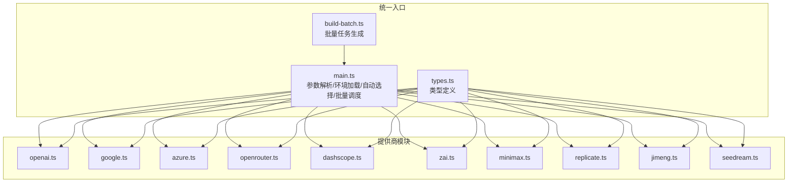
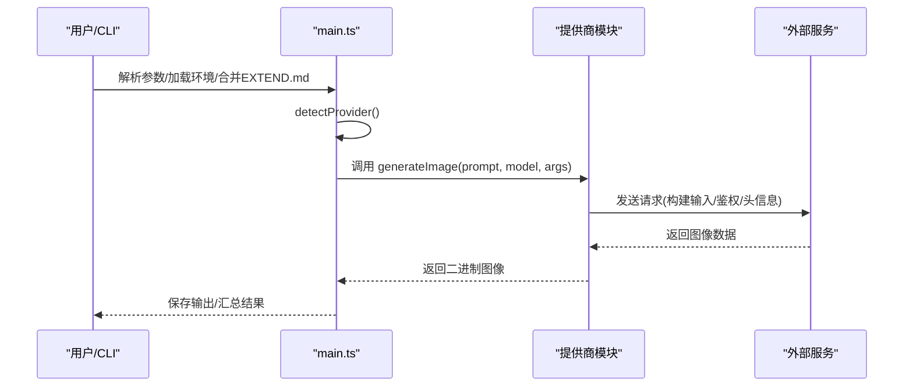
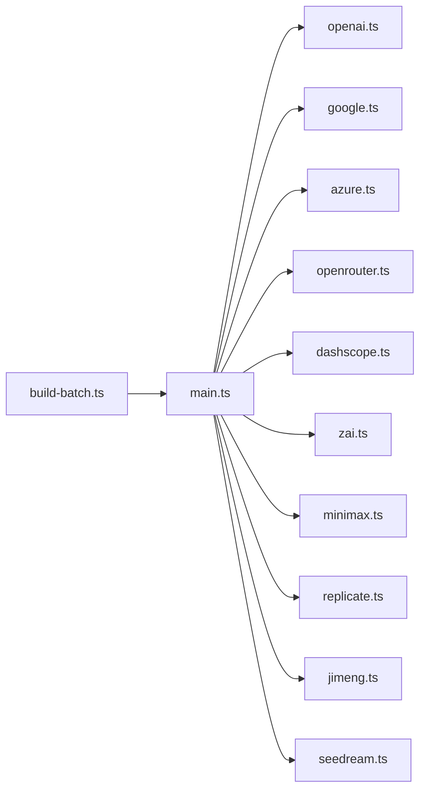
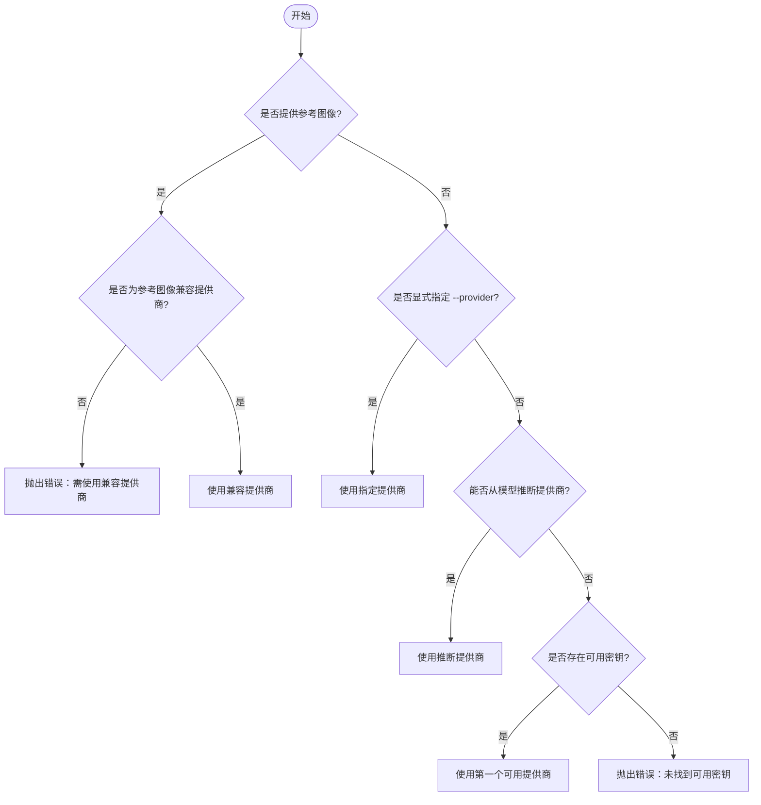

# 多提供商支持架构

<cite>
**本文档引用的文件**
- [main.ts](file://.agents/skills/baoyu-imagine/scripts/main.ts)
- [types.ts](file://.agents/skills/baoyu-imagine/scripts/types.ts)
- [build-batch.ts](file://.agents/skills/baoyu-imagine/scripts/build-batch.ts)
- [preferences-schema.md](file://.agents/skills/baoyu-imagine/references/config/preferences-schema.md)
- [openai.ts](file://.agents/skills/baoyu-imagine/scripts/providers/openai.ts)
- [google.ts](file://.agents/skills/baoyu-imagine/scripts/providers/google.ts)
- [azure.ts](file://.agents/skills/baoyu-imagine/scripts/providers/azure.ts)
- [openrouter.ts](file://.agents/skills/baoyu-imagine/scripts/providers/openrouter.ts)
- [dashscope.ts](file://.agents/skills/baoyu-imagine/scripts/providers/dashscope.ts)
- [zai.ts](file://.agents/skills/baoyu-imagine/scripts/providers/zai.ts)
- [minimax.ts](file://.agents/skills/baoyu-imagine/scripts/providers/minimax.ts)
- [replicate.ts](file://.agents/skills/baoyu-imagine/scripts/providers/replicate.ts)
- [jimeng.ts](file://.agents/skills/baoyu-imagine/scripts/providers/jimeng.ts)
- [seedream.ts](file://.agents/skills/baoyu-imagine/scripts/providers/seedream.ts)
</cite>

## 目录
1. [简介](#简介)
2. [项目结构](#项目结构)
3. [核心组件](#核心组件)
4. [架构总览](#架构总览)
5. [详细组件分析](#详细组件分析)
6. [依赖关系分析](#依赖关系分析)
7. [性能考虑](#性能考虑)
8. [故障排除指南](#故障排除指南)
9. [结论](#结论)
10. [附录](#附录)

## 简介
本文件系统性阐述 baoyu-imagine 技能在多提供商（OpenAI、Azure OpenAI、Google、OpenRouter、DashScope、Z.AI、MiniMax、Jimeng、Seedream、Replicate）上的支持架构与实现细节。内容涵盖：
- 各提供商的配置要点、API 密钥管理、模型选择逻辑与功能差异
- 自动提供商选择算法：基于参考图像、可用密钥与优先级规则
- 模型家族、尺寸限制、参考图像支持能力与特殊配置项对比
- 配置示例与常见问题排查

## 项目结构
baoyu-imagine 的多提供商支持以“统一入口 + 插件化提供商模块”的方式组织：
- 统一入口负责参数解析、环境变量加载、EXTEND.md 合并、提供商自动选择与批量调度
- 各提供商以独立模块实现 generateImage、默认模型、参数校验等接口
- 批量构建工具用于从大纲与提示生成批量任务文件

**图表来源**
- [main.ts:1-160](file://.agents/skills/baoyu-imagine/scripts/main.ts#L1-L160)
- [types.ts:1-91](file://.agents/skills/baoyu-imagine/scripts/types.ts#L1-L91)
- [build-batch.ts:1-80](file://.agents/skills/baoyu-imagine/scripts/build-batch.ts#L1-L80)

**章节来源**
- [main.ts:1-160](file://.agents/skills/baoyu-imagine/scripts/main.ts#L1-L160)
- [types.ts:1-91](file://.agents/skills/baoyu-imagine/scripts/types.ts#L1-L91)
- [build-batch.ts:1-80](file://.agents/skills/baoyu-imagine/scripts/build-batch.ts#L1-L80)

## 核心组件
- 统一入口与参数系统
  - 参数解析：支持 --prompt/--promptfiles、--image、--batchfile、--jobs、--provider、--model、--ar/--size、--quality、--imageSize、--imageApiDialect、--ref、--n、--json、--help
  - 环境变量：OPENAI_API_KEY、OPENROUTER_API_KEY、GOOGLE_API_KEY/GEMINI_API_KEY、DASHSCOPE_API_KEY、ZAI_API_KEY/BIGMODEL_API_KEY、MINIMAX_API_KEY、REPLICATE_API_TOKEN、JIMENG_ACCESS_KEY_ID/SECRET_ACCESS_KEY、ARK_API_KEY、AZURE_OPENAI_* 等
  - EXTEND.md 合并：默认提供商、默认质量、默认宽高比、默认图像大小、默认 OpenAI 图像方言、默认模型、批量并发与起始间隔
- 提供商自动选择
  - 优先级：显式 --provider > 基于模型推断 > 参考图像可用性 > 可用密钥集合 > 默认首选项
  - 参考图像约束：部分提供商不支持参考图像，或仅在特定模型/版本支持
- 批量处理
  - 并行度与速率限制：可按提供商覆盖并发与起始间隔
  - 输出路径规范化与重试机制

**章节来源**
- [main.ts:163-343](file://.agents/skills/baoyu-imagine/scripts/main.ts#L163-L343)
- [main.ts:596-651](file://.agents/skills/baoyu-imagine/scripts/main.ts#L596-L651)
- [main.ts:691-777](file://.agents/skills/baoyu-imagine/scripts/main.ts#L691-L777)
- [preferences-schema.md:1-136](file://.agents/skills/baoyu-imagine/references/config/preferences-schema.md#L1-L136)

## 架构总览
统一入口通过 detectProvider 决定使用哪个提供商模块；各模块实现 generateImage 并根据自身模型族与参数进行请求构建与响应提取。

**图表来源**
- [main.ts:691-777](file://.agents/skills/baoyu-imagine/scripts/main.ts#L691-L777)
- [openai.ts:278-318](file://.agents/skills/baoyu-imagine/scripts/providers/openai.ts#L278-L318)
- [google.ts:328-349](file://.agents/skills/baoyu-imagine/scripts/providers/google.ts#L328-L349)
- [azure.ts:110-123](file://.agents/skills/baoyu-imagine/scripts/providers/azure.ts#L110-L123)
- [openrouter.ts:331-369](file://.agents/skills/baoyu-imagine/scripts/providers/openrouter.ts#L331-L369)
- [dashscope.ts:555-625](file://.agents/skills/baoyu-imagine/scripts/providers/dashscope.ts#L555-L625)
- [zai.ts:280-306](file://.agents/skills/baoyu-imagine/scripts/providers/zai.ts#L280-L306)
- [minimax.ts:193-220](file://.agents/skills/baoyu-imagine/scripts/providers/minimax.ts#L193-L220)
- [replicate.ts:582-616](file://.agents/skills/baoyu-imagine/scripts/providers/replicate.ts#L582-L616)
- [jimeng.ts:435-467](file://.agents/skills/baoyu-imagine/scripts/providers/jimeng.ts#L435-L467)
- [seedream.ts:302-341](file://.agents/skills/baoyu-imagine/scripts/providers/seedream.ts#L302-L341)

## 详细组件分析

### OpenAI
- 默认模型：OPENAI_IMAGE_MODEL 或 gpt-image-2
- 图像尺寸与质量：
  - 支持 dall-e-2/3 与 gpt-image-2 等模型族
  - gpt-image-2：按长边 2048/1024 与 16 像素对齐约束推导尺寸，限制长宽比不超过 3:1
  - 其他模型：根据宽高比映射到方形/横向/纵向标准尺寸
- 参考图像编辑：
  - 仅支持 gpt-image 系列；需使用原生 OpenAI 图像方言
  - 使用 /images/edits 接口上传多图
- 关键参数：--imageApiDialect(openai-native/ratio-metadata)、--quality(normal/2k)、--size/WxH、--ar
- 环境变量：OPENAI_API_KEY、OPENAI_BASE_URL、OPENAI_IMAGE_MODEL、OPENAI_IMAGE_USE_CHAT=true/false

**章节来源**
- [openai.ts:5-7](file://.agents/skills/baoyu-imagine/scripts/providers/openai.ts#L5-L7)
- [openai.ts:77-116](file://.agents/skills/baoyu-imagine/scripts/providers/openai.ts#L77-L116)
- [openai.ts:204-237](file://.agents/skills/baoyu-imagine/scripts/providers/openai.ts#L204-L237)
- [openai.ts:239-276](file://.agents/skills/baoyu-imagine/scripts/providers/openai.ts#L239-L276)
- [openai.ts:278-318](file://.agents/skills/baoyu-imagine/scripts/providers/openai.ts#L278-L318)

### Azure OpenAI
- 默认模型：AZURE_OPENAI_DEPLOYMENT > AZURE_OPENAI_BASE_URL 中的部署名 > AZURE_OPENAI_IMAGE_MODEL > gpt-image-2
- 认证：api-key 头部，支持自定义 AZURE_API_VERSION
- 尺寸与质量：基于 OpenAI 尺寸策略，质量映射为 medium/high
- 参考图像：限制为 PNG/JPG/JPEG；使用 /images/edits
- 关键参数：--model(部署名)、--ar/--size、--quality
- 环境变量：AZURE_OPENAI_API_KEY、AZURE_OPENAI_BASE_URL、AZURE_OPENAI_DEPLOYMENT、AZURE_API_VERSION、AZURE_OPENAI_IMAGE_MODEL

**章节来源**
- [azure.ts:35-50](file://.agents/skills/baoyu-imagine/scripts/providers/azure.ts#L35-L50)
- [azure.ts:99-108](file://.agents/skills/baoyu-imagine/scripts/providers/azure.ts#L99-L108)
- [azure.ts:110-123](file://.agents/skills/baoyu-imagine/scripts/providers/azure.ts#L110-L123)
- [azure.ts:125-154](file://.agents/skills/baoyu-imagine/scripts/providers/azure.ts#L125-L154)
- [azure.ts:156-192](file://.agents/skills/baoyu-imagine/scripts/providers/azure.ts#L156-L192)

### Google
- 模型族：
  - Multimodal：gemini-3-pro-image-preview、gemini-3-flash-preview、gemini-3.1-flash-image-preview
  - Imagen：imagen-3.0-generate-001/002（不支持参考图像）
- 图像尺寸：1K/2K/4K（Imagen 不支持 4K）
- 参考图像：仅支持 Multimodal 模型；通过内联 base64 传入
- 请求方式：优先使用 fetch；检测到 HTTP 代理时改用 curl
- 关键参数：--imageSize(1K/2K/4K)、--quality、--ar
- 环境变量：GOOGLE_API_KEY 或 GEMINI_API_KEY、GOOGLE_BASE_URL、GOOGLE_IMAGE_MODEL

**章节来源**
- [google.ts:6-14](file://.agents/skills/baoyu-imagine/scripts/providers/google.ts#L6-L14)
- [google.ts:16-32](file://.agents/skills/baoyu-imagine/scripts/providers/google.ts#L16-L32)
- [google.ts:38-41](file://.agents/skills/baoyu-imagine/scripts/providers/google.ts#L38-L41)
- [google.ts:328-349](file://.agents/skills/baoyu-imagine/scripts/providers/google.ts#L328-L349)
- [google.ts:236-326](file://.agents/skills/baoyu-imagine/scripts/providers/google.ts#L236-L326)

### OpenRouter
- 默认模型：OPENROUTER_IMAGE_MODEL 或 google/gemini-3.1-flash-image-preview
- 文本+图像模型：支持 text+image 模态；非文本模型仅 image
- 宽高比支持：除特定模型外，支持常见比例；超出范围会报错
- 参考图像：以 data URL 形式传入
- 关键参数：--imageSize(1K/2K/4K)、--ar、--quality
- 环境变量：OPENROUTER_API_KEY、OPENROUTER_BASE_URL、OPENROUTER_HTTP_REFERER、OPENROUTER_TITLE

**章节来源**
- [openrouter.ts:5-45](file://.agents/skills/baoyu-imagine/scripts/providers/openrouter.ts#L5-L45)
- [openrouter.ts:162-171](file://.agents/skills/baoyu-imagine/scripts/providers/openrouter.ts#L162-L171)
- [openrouter.ts:177-195](file://.agents/skills/baoyu-imagine/scripts/providers/openrouter.ts#L177-L195)
- [openrouter.ts:210-228](file://.agents/skills/baoyu-imagine/scripts/providers/openrouter.ts#L210-L228)
- [openrouter.ts:331-369](file://.agents/skills/baoyu-imagine/scripts/providers/openrouter.ts#L331-L369)

### DashScope
- 模型族与尺寸：
  - qwen2：推荐尺寸，像素预算 512*512–2048*2048
  - qwen-fixed：固定尺寸集（如 16:9/4:3/1:1 等）
  - wan2.7：最大 2048*2048（通用）或 4096*4096（Pro 且无参考图）
  - legacy：传统尺寸集
- 参考图像：仅 wan2.7 支持，最多 9 张
- 关键参数：--size/WxH/*、--ar、--quality、--n=1（wan2.7）
- 环境变量：DASHSCOPE_API_KEY、DASHSCOPE_BASE_URL、DASHSCOPE_IMAGE_MODEL

**章节来源**
- [dashscope.ts:5-10](file://.agents/skills/baoyu-imagine/scripts/providers/dashscope.ts#L5-L10)
- [dashscope.ts:142-148](file://.agents/skills/baoyu-imagine/scripts/providers/dashscope.ts#L142-L148)
- [dashscope.ts:458-487](file://.agents/skills/baoyu-imagine/scripts/providers/dashscope.ts#L458-L487)
- [dashscope.ts:555-625](file://.agents/skills/baoyu-imagine/scripts/providers/dashscope.ts#L555-L625)

### Z.AI
- 模型族：glm-image（GLM）、legacy
- 尺寸与步进：
  - GLM：1024–2048，步进 32，像素上限 2^22
  - Legacy：512–2048，步进 16，像素上限 2^21
- 参考图像：当前版本不支持
- 关键参数：--size/WxH、--quality(normal/2k)
- 环境变量：ZAI_API_KEY 或 BIGMODEL_API_KEY、ZAI_BASE_URL/BIGMODEL_BASE_URL、ZAI_IMAGE_MODEL/BIGMODEL_IMAGE_MODEL

**章节来源**
- [zai.ts:3-10](file://.agents/skills/baoyu-imagine/scripts/providers/zai.ts#L3-L10)
- [zai.ts:201-236](file://.agents/skills/baoyu-imagine/scripts/providers/zai.ts#L201-L236)
- [zai.ts:242-250](file://.agents/skills/baoyu-imagine/scripts/providers/zai.ts#L242-L250)
- [zai.ts:280-306](file://.agents/skills/baoyu-imagine/scripts/providers/zai.ts#L280-L306)

### MiniMax
- 默认模型：image-01
- 支持宽高比：1:1、16:9、4:3、3:2、2:3、3:4、9:16、21:9
- 尺寸约束：512–2048，且必须 8 的倍数
- 参考图像：subject_reference，单张或数组，限制 ≤10MB，仅支持 JPG/PNG
- 关键参数：--ar 或 --size、--n(≤9)、--quality
- 环境变量：MINIMAX_API_KEY、MINIMAX_BASE_URL、MINIMAX_IMAGE_MODEL

**章节来源**
- [minimax.ts:6-8](file://.agents/skills/baoyu-imagine/scripts/providers/minimax.ts#L6-L8)
- [minimax.ts:82-103](file://.agents/skills/baoyu-imagine/scripts/providers/minimax.ts#L82-L103)
- [minimax.ts:126-160](file://.agents/skills/baoyu-imagine/scripts/providers/minimax.ts#L126-L160)
- [minimax.ts:193-220](file://.agents/skills/baoyu-imagine/scripts/providers/minimax.ts#L193-L220)

### Replicate
- 模型族：
  - google/nano-banana(-2)：支持参考图像（最多 14 张），支持指定 aspect_ratio 或 match_input_image
  - bytedance/seedream-4.5：支持参考图像（最多 14 张），支持 2K/4K 或自定义 WxH
  - bytedance/seedream-5-lite：支持 2K/3K
  - wan-video/wan-2.7-image(-pro)：支持参考图像（最多 9 张），支持 1K/2K/4K 或自定义 WxH（Pro 在无参考图时可达 4K）
- 关键参数：--model(owner/name[:version])、--ar、--size、--quality、--n=1
- 环境变量：REPLICATE_API_TOKEN、REPLICATE_BASE_URL、REPLICATE_IMAGE_MODEL

**章节来源**
- [replicate.ts:22-82](file://.agents/skills/baoyu-imagine/scripts/providers/replicate.ts#L22-L82)
- [replicate.ts:367-437](file://.agents/skills/baoyu-imagine/scripts/providers/replicate.ts#L367-L437)
- [replicate.ts:444-465](file://.agents/skills/baoyu-imagine/scripts/providers/replicate.ts#L444-L465)
- [replicate.ts:582-616](file://.agents/skills/baoyu-imagine/scripts/providers/replicate.ts#L582-L616)

### Jimeng
- 默认模型：jimeng_t2i_v40
- 尺寸预设：按 1:1/4:3/16:9/3:2/21:9 的近似映射到 1K/2K/4K 预设
- 参考图像：不支持
- 签名：遵循火山引擎 HMAC-SHA256 签名流程
- 关键参数：--ar/--imageSize(1K/2K/4K/WxH)、--quality
- 环境变量：JIMENG_ACCESS_KEY_ID、JIMENG_SECRET_ACCESS_KEY、JIMENG_REGION、JIMENG_BASE_URL、JIMENG_IMAGE_MODEL

**章节来源**
- [jimeng.ts:6-8](file://.agents/skills/baoyu-imagine/scripts/providers/jimeng.ts#L6-L8)
- [jimeng.ts:139-225](file://.agents/skills/baoyu-imagine/scripts/providers/jimeng.ts#L139-L225)
- [jimeng.ts:435-467](file://.agents/skills/baoyu-imagine/scripts/providers/jimeng.ts#L435-L467)

### Seedream
- 模型族：
  - seedream5：支持参考图像（最多 14 张），支持 2K/3K 或 WxH
  - seedream45：支持参考图像（最多 14 张），支持 2K/4K 或 WxH
  - seedream40：支持参考图像（最多 14 张），支持 1K/2K/4K 或 WxH
  - seedream30：仅支持 WxH
- 输出格式：seedream5 可返回 PNG，其余返回 JPG
- 关键参数：--size(1K/2K/3K/4K/adaptive/WxH)、--ar、--quality、--n
- 环境变量：ARK_API_KEY、SEEDREAM_BASE_URL、SEEDREAM_IMAGE_MODEL

**章节来源**
- [seedream.ts:6-11](file://.agents/skills/baoyu-imagine/scripts/providers/seedream.ts#L6-L11)
- [seedream.ts:105-138](file://.agents/skills/baoyu-imagine/scripts/providers/seedream.ts#L105-L138)
- [seedream.ts:151-201](file://.agents/skills/baoyu-imagine/scripts/providers/seedream.ts#L151-L201)
- [seedream.ts:302-341](file://.agents/skills/baoyu-imagine/scripts/providers/seedream.ts#L302-L341)

## 依赖关系分析
- 统一入口依赖提供商模块接口（getDefaultModel/generateImage/validateArgs/getDefaultOutputExtension）
- 各提供商模块依赖环境变量与外部服务 API
- 批量构建工具依赖统一入口的参数与 EXTEND.md 规范

**图表来源**
- [main.ts:15-30](file://.agents/skills/baoyu-imagine/scripts/main.ts#L15-L30)
- [build-batch.ts:1-20](file://.agents/skills/baoyu-imagine/scripts/build-batch.ts#L1-L20)

**章节来源**
- [main.ts:15-30](file://.agents/skills/baoyu-imagine/scripts/main.ts#L15-L30)
- [build-batch.ts:1-20](file://.agents/skills/baoyu-imagine/scripts/build-batch.ts#L1-L20)

## 性能考虑
- 并发与速率限制
  - 默认并发与起始间隔：各提供商有内置默认值，可通过环境变量或 EXTEND.md 覆盖
  - 批量模式下，pending≥2 即并行；每任务最大重试 3 次
- 网络与代理
  - Google 在检测到 HTTP 代理时改用 curl，避免长连接被关闭导致失败
- 输出扩展
  - 部分提供商默认输出扩展不同（如 MiniMax 默认 .jpg）

**章节来源**
- [main.ts:56-67](file://.agents/skills/baoyu-imagine/scripts/main.ts#L56-L67)
- [main.ts:619-651](file://.agents/skills/baoyu-imagine/scripts/main.ts#L619-L651)
- [google.ts:153-162](file://.agents/skills/baoyu-imagine/scripts/providers/google.ts#L153-L162)
- [minimax.ts:189-191](file://.agents/skills/baoyu-imagine/scripts/providers/minimax.ts#L189-L191)

## 故障排除指南
- 缺少 API 密钥
  - 统一入口会在未检测到任何可用密钥时抛出错误，提示设置对应 PROVIDER_API_KEY 或 PROVIDER_BASE_URL
- 参考图像不支持
  - OpenAI/Google/Azure/OpenRouter/Replicate/DashScope/Seedream 对参考图像的支持不同；若使用了不支持的提供商/模型，将抛出明确错误
- 尺寸与比例限制
  - 各提供商对尺寸、步进、像素预算、宽高比有严格限制；违反将抛出错误
- 模型推断冲突
  - 当模型 ID 指向某提供商但密钥缺失时，会提示设置相应密钥
- 环境变量与 EXTEND.md 顺序
  - CLI > EXTEND.md > process.env > <cwd>/.baoyu-skills/.env > ~/.baoyu-skills/.env

**章节来源**
- [main.ts:711-777](file://.agents/skills/baoyu-imagine/scripts/main.ts#L711-L777)
- [openai.ts:298-311](file://.agents/skills/baoyu-imagine/scripts/providers/openai.ts#L298-L311)
- [google.ts:334-346](file://.agents/skills/baoyu-imagine/scripts/providers/google.ts#L334-L346)
- [azure.ts:99-108](file://.agents/skills/baoyu-imagine/scripts/providers/azure.ts#L99-L108)
- [openrouter.ts:177-195](file://.agents/skills/baoyu-imagine/scripts/providers/openrouter.ts#L177-L195)
- [dashscope.ts:565-581](file://.agents/skills/baoyu-imagine/scripts/providers/dashscope.ts#L565-L581)
- [seedream.ts:203-228](file://.agents/skills/baoyu-imagine/scripts/providers/seedream.ts#L203-L228)

## 结论
baoyu-imagine 的多提供商支持通过统一入口与标准化提供商接口实现高度一致的使用体验。自动选择算法结合参考图像需求、可用密钥与模型推断，确保在不同场景下选择最合适的提供商。各提供商在尺寸、参考图像、认证与响应提取方面各有差异，但统一的参数体系与错误提示帮助用户快速定位问题并正确配置。

## 附录

### 提供商自动选择算法

**图表来源**
- [main.ts:691-777](file://.agents/skills/baoyu-imagine/scripts/main.ts#L691-L777)

### 配置示例与最佳实践
- 设置默认提供商与质量
  - 在 EXTEND.md 中设置 default_provider、default_quality、default_aspect_ratio、default_image_size、default_model.*
- 覆盖并发与起始间隔
  - 使用 BAOYU_IMAGE_GEN_<PROVIDER>_CONCURRENCY 与 BAOYU_IMAGE_GEN_<PROVIDER>_START_INTERVAL_MS
- OpenAI 图像方言
  - 使用 OPENAI_IMAGE_API_DIALECT=openai-native 或 ratio-metadata，并在 OpenAI 场景下启用参考图像编辑时选择原生方言
- DashScope wan2.7
  - 无参考图时可使用 4096*4096（Pro），有参考图时限制 2048*2048；--n 必须为 1
- Replicate
  - --n 必须为 1；nano-banana/seedream 支持参考图像；wan-2.7 支持 1K/2K/4K 或自定义 WxH
- Z.AI
  - 当前不支持参考图像；--n=1；GLM 与 Legacy 的尺寸与步进不同
- MiniMax
  - 支持最多 9 张图片；仅支持指定的宽高比；subject_reference 图片 ≤10MB
- Seedream
  - seedream5/45/40 支持参考图像（最多 14 张）；seedream30 仅支持 WxH；注意输出格式差异
- Jimeng
  - 不支持参考图像；按 1:1/4:3/16:9/3:2/21:9 映射尺寸；需正确配置火山引擎签名参数

**章节来源**
- [preferences-schema.md:1-136](file://.agents/skills/baoyu-imagine/references/config/preferences-schema.md#L1-L136)
- [main.ts:114-160](file://.agents/skills/baoyu-imagine/scripts/main.ts#L114-L160)
- [dashscope.ts:565-581](file://.agents/skills/baoyu-imagine/scripts/providers/dashscope.ts#L565-L581)
- [replicate.ts:367-437](file://.agents/skills/baoyu-imagine/scripts/providers/replicate.ts#L367-L437)
- [zai.ts:242-250](file://.agents/skills/baoyu-imagine/scripts/providers/zai.ts#L242-L250)
- [minimax.ts:82-103](file://.agents/skills/baoyu-imagine/scripts/providers/minimax.ts#L82-L103)
- [seedream.ts:203-228](file://.agents/skills/baoyu-imagine/scripts/providers/seedream.ts#L203-L228)
- [jimeng.ts:440-444](file://.agents/skills/baoyu-imagine/scripts/providers/jimeng.ts#L440-L444)