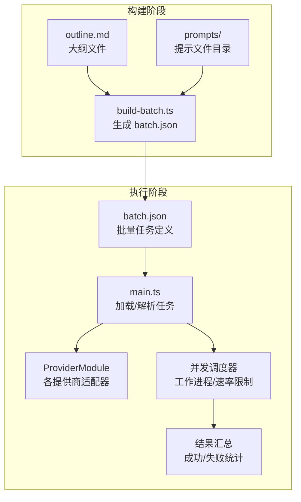
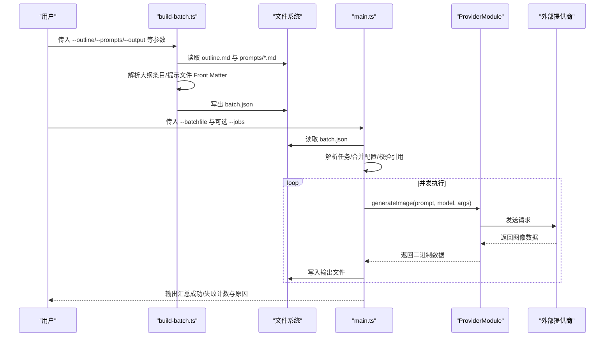
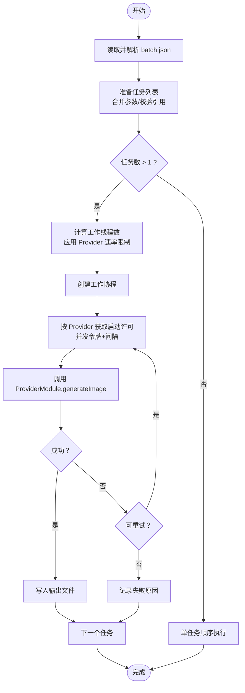
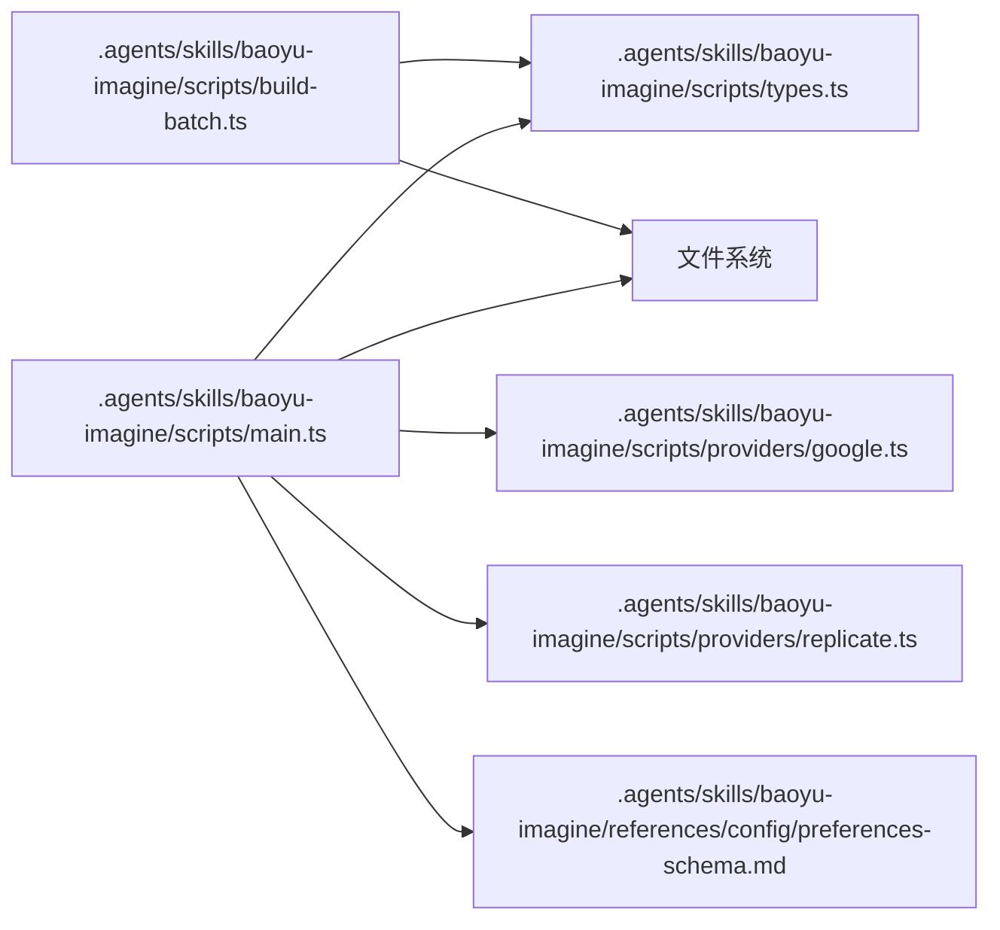

# 批量处理功能

<cite>
**本文引用的文件**
- [build-batch.ts](file://.agents/skills/baoyu-imagine/scripts/build-batch.ts)
- [main.ts](file://.agents/skills/baoyu-imagine/scripts/main.ts)
- [types.ts](file://.agents/skills/baoyu-imagine/scripts/types.ts)
- [build-batch.test.ts](file://.agents/skills/baoyu-imagine/scripts/build-batch.test.ts)
- [SKILL.md](file://.agents/skills/baoyu-imagine/SKILL.md)
- [usage-examples.md](file://.agents/skills/baoyu-imagine/references/usage-examples.md)
- [preferences-schema.md](file://.agents/skills/baoyu-imagine/references/config/preferences-schema.md)
- [first-time-setup.md](file://.agents/skills/baoyu-imagine/references/config/first-time-setup.md)
- [google.ts](file://.agents/skills/baoyu-imagine/scripts/providers/google.ts)
- [replicate.ts](file://.agents/skills/baoyu-imagine/scripts/providers/replicate.ts)
</cite>

## 目录
1. [简介](#简介)
2. [项目结构](#项目结构)
3. [核心组件](#核心组件)
4. [架构总览](#架构总览)
5. [详细组件分析](#详细组件分析)
6. [依赖关系分析](#依赖关系分析)
7. [性能考量](#性能考量)
8. [故障排查指南](#故障排查指南)
9. [结论](#结论)
10. [附录](#附录)

## 简介
本文件面向 baoyu-imagine 技能的批量处理能力，系统性阐述批处理模式的工作原理与使用方法，重点覆盖以下主题：
- --batchfile 参数的 JSON 格式规范与字段语义
- 任务队列管理与并行执行机制
- build-batch.ts 脚本：从“大纲文件 + 提示文件”构建批量任务
- 工作进程管理、并发控制与速率限制策略（BAOYU_IMAGE_GEN_MAX_WORKERS 与 PROVIDER_CONCURRENCY）
- 重试机制、错误处理与进度监控
- 完整使用示例与性能优化建议

## 项目结构
baoyu-imagine 的批量处理由两部分组成：
- 构建阶段：build-batch.ts 将 outline.md 与 prompts/ 下的提示文件解析为 batch.json
- 执行阶段：main.ts 读取 batch.json 并行生成图像，支持重试与汇总输出

图表来源
- [.agents/skills/baoyu-imagine/scripts/build-batch.ts:173-233](file://.agents/skills/baoyu-imagine/scripts/build-batch.ts#L173-L233)
- [.agents/skills/baoyu-imagine/scripts/main.ts:1093-1133](file://.agents/skills/baoyu-imagine/scripts/main.ts#L1093-L1133)

章节来源
- [.agents/skills/baoyu-imagine/scripts/build-batch.ts:1-239](file://.agents/skills/baoyu-imagine/scripts/build-batch.ts#L1-L239)
- [.agents/skills/baoyu-imagine/scripts/main.ts:1-1236](file://.agents/skills/baoyu-imagine/scripts/main.ts#L1-L1236)

## 核心组件
- build-batch.ts：解析 outline 与提示文件，生成 batch.json；支持从提示文件 Front Matter 中提取直接引用（direct）的参考图片路径，并可设置 provider、model、ar、quality 等全局参数。
- main.ts：批处理入口，负责加载 batch.json、准备任务、并发调度、重试、汇总输出；支持环境变量与 EXTEND.md 配置覆盖。
- types.ts：定义 CLI 参数、批处理任务输入、批处理文件格式等类型。
- Provider 适配模块：如 google.ts、replicate.ts 等，封装具体提供商的请求与响应处理。

章节来源
- [.agents/skills/baoyu-imagine/scripts/build-batch.ts:1-239](file://.agents/skills/baoyu-imagine/scripts/build-batch.ts#L1-L239)
- [.agents/skills/baoyu-imagine/scripts/main.ts:1-1236](file://.agents/skills/baoyu-imagine/scripts/main.ts#L1-L1236)
- [.agents/skills/baoyu-imagine/scripts/types.ts:1-91](file://.agents/skills/baoyu-imagine/scripts/types.ts#L1-L91)

## 架构总览
批处理流程分为“构建任务”和“执行任务”两个阶段，二者通过 batch.json 解耦。

图表来源
- [.agents/skills/baoyu-imagine/scripts/build-batch.ts:173-233](file://.agents/skills/baoyu-imagine/scripts/build-batch.ts#L173-L233)
- [.agents/skills/baoyu-imagine/scripts/main.ts:1093-1133](file://.agents/skills/baoyu-imagine/scripts/main.ts#L1093-L1133)
- [.agents/skills/baoyu-imagine/scripts/providers/google.ts:328-349](file://.agents/skills/baoyu-imagine/scripts/providers/google.ts#L328-L349)
- [.agents/skills/baoyu-imagine/scripts/providers/replicate.ts:582-616](file://.agents/skills/baoyu-imagine/scripts/providers/replicate.ts#L582-L616)

## 详细组件分析

### 批处理文件格式与字段规范
- 支持两种形式：
  - 数组：顶层为任务数组
  - 对象：包含 tasks 数组与可选 jobs 字段
- 任务字段（BatchTaskInput）：
  - id：任务标识（可选）
  - prompt 或 promptFiles：提示文本或提示文件列表（二选一或同时存在）
  - image：输出图像路径（可选）
  - provider/model/ar/size/quality/imageSize/imageApiDialect/ref/n：与 CLI 参数一致
- jobs：可选，用于声明推荐工作线程数，CLI --jobs 可覆盖

章节来源
- [.agents/skills/baoyu-imagine/scripts/types.ts:36-57](file://.agents/skills/baoyu-imagine/scripts/types.ts#L36-L57)
- [.agents/skills/baoyu-imagine/references/usage-examples.md:92-117](file://.agents/skills/baoyu-imagine/references/usage-examples.md#L92-L117)

### build-batch.ts 使用与行为
- 命令行参数
  - --outline：必须，指向 outline.md
  - --prompts：必须，指向提示文件目录
  - --output：必须，输出 batch.json
  - --images-dir：可选，指定生成图像目录（默认与 batch.json 同目录）
  - --refs-dir：可选，默认 references，用于拼接提示中引用图片的相对路径
  - --provider/--model/--ar/--quality/--jobs：全局参数，影响所有任务
- 大纲解析
  - 从 outline.md 中提取“Illustration”区块，解析每个条目的索引与文件名
- 提示解析
  - 从每个提示文件的 Front Matter 中提取 references 列表，仅保留 usage 为 direct 的条目，并映射到 refs-dir 下的相对路径
- 任务构造
  - 为每个条目生成一个任务对象，包含 id、promptFiles、image、provider、ar、quality 等字段
  - 若显式指定了 --model，则写入任务；否则不写入，交由执行阶段解析默认模型
  - 若存在 direct 引用，则将 ref 字段写入
- 输出
  - 写出 batch.json，包含 tasks 与可选 jobs

章节来源
- [.agents/skills/baoyu-imagine/scripts/build-batch.ts:5-81](file://.agents/skills/baoyu-imagine/scripts/build-batch.ts#L5-L81)
- [.agents/skills/baoyu-imagine/scripts/build-batch.ts:149-164](file://.agents/skills/baoyu-imagine/scripts/build-batch.ts#L149-L164)
- [.agents/skills/baoyu-imagine/scripts/build-batch.ts:166-171](file://.agents/skills/baoyu-imagine/scripts/build-batch.ts#L166-L171)
- [.agents/skills/baoyu-imagine/scripts/build-batch.ts:173-233](file://.agents/skills/baoyu-imagine/scripts/build-batch.ts#L173-L233)
- [.agents/skills/baoyu-imagine/scripts/build-batch.test.ts:45-85](file://.agents/skills/baoyu-imagine/scripts/build-batch.test.ts#L45-L85)

### 批处理执行流程与并发控制
- 加载与解析
  - main.ts 读取 batch.json，支持数组或对象两种形式；若为对象则解析 jobs 字段
  - 对每个任务，解析 promptFiles 与 ref 路径（相对 batch.json 的绝对路径），合并 CLI 与任务级参数
- 准备与校验
  - 检查每个任务是否具备 prompt 或 promptFiles，以及输出路径
  - 校验引用图片是否存在（支持远程 DashScope 场景）
- 并发调度
  - 当任务数量大于 1 时启用并行模式
  - 计算最大工作线程数：优先使用 CLI --jobs，其次取 min(任务数, 最大工作线程上限)，上限来自配置
  - 为每个提供商维护独立的“并发令牌 + 启动间隔”门限，避免 RPM 爆炸
- 生成与重试
  - 每个任务最多尝试 3 次，非可重试错误（如鉴权缺失、参数非法、模型不支持等）不会重试
  - 成功写入输出文件后记录成功，失败则记录错误信息
- 汇总输出
  - 统计总数、成功数、失败数，并列出失败原因

图表来源
- [.agents/skills/baoyu-imagine/scripts/main.ts:1093-1133](file://.agents/skills/baoyu-imagine/scripts/main.ts#L1093-L1133)
- [.agents/skills/baoyu-imagine/scripts/main.ts:1012-1061](file://.agents/skills/baoyu-imagine/scripts/main.ts#L1012-L1061)
- [.agents/skills/baoyu-imagine/scripts/main.ts:1063-1086](file://.agents/skills/baoyu-imagine/scripts/main.ts#L1063-L1086)

章节来源
- [.agents/skills/baoyu-imagine/scripts/main.ts:906-930](file://.agents/skills/baoyu-imagine/scripts/main.ts#L906-L930)
- [.agents/skills/baoyu-imagine/scripts/main.ts:940-962](file://.agents/skills/baoyu-imagine/scripts/main.ts#L940-L962)
- [.agents/skills/baoyu-imagine/scripts/main.ts:964-1005](file://.agents/skills/baoyu-imagine/scripts/main.ts#L964-L1005)
- [.agents/skills/baoyu-imagine/scripts/main.ts:1088-1091](file://.agents/skills/baoyu-imagine/scripts/main.ts#L1088-L1091)
- [.agents/skills/baoyu-imagine/scripts/main.ts:1093-1133](file://.agents/skills/baoyu-imagine/scripts/main.ts#L1093-L1133)
- [.agents/skills/baoyu-imagine/scripts/main.ts:1135-1151](file://.agents/skills/baoyu-imagine/scripts/main.ts#L1135-L1151)

### 重试机制与错误处理
- 重试次数：每张图最多 3 次
- 可重试条件：当错误消息不包含“不可重试”标记（如鉴权、参数非法、模型不支持、尺寸范围限制等）
- 不可重试错误：例如“Reference image not supported”、“No API key found”、“Invalid ...”、“API error (4xx)”等
- 单任务失败不影响其他任务继续执行

章节来源
- [.agents/skills/baoyu-imagine/scripts/main.ts:53-54](file://.agents/skills/baoyu-imagine/scripts/main.ts#L53-L54)
- [.agents/skills/baoyu-imagine/scripts/main.ts:806-830](file://.agents/skills/baoyu-imagine/scripts/main.ts#L806-L830)

### 并发控制与速率限制
- 工作线程上限
  - 来源优先级：CLI --jobs > EXTEND.md batch.max_workers > 内置默认 10
- Provider 速率限制
  - 默认并发与启动间隔（毫秒）针对各 Provider 设定
  - 可通过环境变量覆盖：BAOYU_IMAGE_GEN_<PROVIDER>_CONCURRENCY、BAOYU_IMAGE_GEN_<PROVIDER>_START_INTERVAL_MS
  - 也可通过 EXTEND.md 的 batch.provider_limits 覆盖

章节来源
- [.agents/skills/baoyu-imagine/scripts/main.ts:56-67](file://.agents/skills/baoyu-imagine/scripts/main.ts#L56-L67)
- [.agents/skills/baoyu-imagine/scripts/main.ts:613-651](file://.agents/skills/baoyu-imagine/scripts/main.ts#L613-L651)
- [.agents/skills/baoyu-imagine/references/config/preferences-schema.md:34-61](file://.agents/skills/baoyu-imagine/references/config/preferences-schema.md#L34-L61)

### Provider 特性与兼容性
- Google：支持 Gemini 多模态与 Imagen 推理；多模态支持参考图；Imagen 不支持参考图
- Replicate：支持多种模型家族（nano-banana、Seedream、Wan 2.7），不同模型有不同参数与限制；当前版本要求 --n=1
- 其他 Provider：详见各自模块的参数校验与约束

章节来源
- [.agents/skills/baoyu-imagine/scripts/providers/google.ts:328-349](file://.agents/skills/baoyu-imagine/scripts/providers/google.ts#L328-L349)
- [.agents/skills/baoyu-imagine/scripts/providers/replicate.ts:367-437](file://.agents/skills/baoyu-imagine/scripts/providers/replicate.ts#L367-L437)

## 依赖关系分析

图表来源
- [.agents/skills/baoyu-imagine/scripts/build-batch.ts:1-239](file://.agents/skills/baoyu-imagine/scripts/build-batch.ts#L1-L239)
- [.agents/skills/baoyu-imagine/scripts/main.ts:1-1236](file://.agents/skills/baoyu-imagine/scripts/main.ts#L1-L1236)
- [.agents/skills/baoyu-imagine/scripts/types.ts:1-91](file://.agents/skills/baoyu-imagine/scripts/types.ts#L1-L91)

章节来源
- [.agents/skills/baoyu-imagine/scripts/build-batch.ts:1-239](file://.agents/skills/baoyu-imagine/scripts/build-batch.ts#L1-L239)
- [.agents/skills/baoyu-imagine/scripts/main.ts:1-1236](file://.agents/skills/baoyu-imagine/scripts/main.ts#L1-L1236)
- [.agents/skills/baoyu-imagine/scripts/types.ts:1-91](file://.agents/skills/baoyu-imagine/scripts/types.ts#L1-L91)

## 性能考量
- 并发度选择
  - 任务数较多且 Provider 速率允许时，适当提高 --jobs 可提升吞吐；但需结合 Provider 的并发限制与网络状况
- 速率限制
  - 合理设置 BAOYU_IMAGE_GEN_<PROVIDER>_CONCURRENCY 与 BAOYU_IMAGE_GEN_<PROVIDER>_START_INTERVAL_MS，避免触发上游限流
- 输出路径
  - 将 --images-dir 指向高速磁盘或 SSD，减少 IO 瓶颈
- 模型与尺寸
  - 高质量与大尺寸会增加耗时，建议在保证质量的前提下选择合适分辨率
- 网络代理
  - 某些 Provider 在代理环境下不稳定，必要时调整网络或改用直连

## 故障排查指南
- 缺少 API 密钥
  - 现象：报错提示未找到密钥
  - 处理：按 SKILL.md 的环境变量说明设置对应 PROVIDER 的密钥
- 参数非法或模型不支持
  - 现象：报错包含“Invalid”、“not supported”等
  - 处理：检查 Provider 的模型与参数支持范围，必要时更换模型或调整参数
- 引用图片不支持
  - 现象：报错提示引用图片不被当前 Provider 支持
  - 处理：更换支持参考图的 Provider 或移除 --ref
- 任务缺少提示或输出路径
  - 现象：报错提示任务缺少 prompt 或 image
  - 处理：确保每个任务都有有效的 prompt 或 promptFiles，以及 image 输出路径
- 批处理失败统计
  - 处理：查看最终汇总中的失败原因，逐项修复后再重试

章节来源
- [.agents/skills/baoyu-imagine/SKILL.md:215-221](file://.agents/skills/baoyu-imagine/SKILL.md#L215-L221)
- [.agents/skills/baoyu-imagine/scripts/main.ts:806-830](file://.agents/skills/baoyu-imagine/scripts/main.ts#L806-L830)

## 结论
baoyu-imagine 的批量处理通过 build-batch.ts 将“大纲 + 提示文件”转换为标准化的 batch.json，再由 main.ts 实现高并发、可重试、可观测的批量生成。通过合理的并发与速率限制配置、完善的错误处理与汇总输出，可在保证稳定性的同时最大化吞吐效率。建议在生产环境中结合 Provider 的实际限额与网络状况，动态调整并发度与速率参数。

## 附录

### 使用示例
- 构建批处理任务
  - 基于 outline 与 prompts 目录生成 batch.json
  - 可指定 provider、model、ar、quality、jobs 等全局参数
- 执行批处理
  - 通过 --batchfile 指定 batch.json
  - 可选 --jobs 指定工作线程数，--json 输出 JSON 汇总

章节来源
- [.agents/skills/baoyu-imagine/references/usage-examples.md:82-90](file://.agents/skills/baoyu-imagine/references/usage-examples.md#L82-L90)
- [.agents/skills/baoyu-imagine/references/usage-examples.md:92-117](file://.agents/skills/baoyu-imagine/references/usage-examples.md#L92-L117)

### 配置与环境变量
- 批处理配置（EXTEND.md）
  - batch.max_workers：最大工作线程上限
  - batch.provider_limits：<provider>：concurrency 与 start_interval_ms
- 环境变量
  - BAOYU_IMAGE_GEN_MAX_WORKERS：覆盖最大工作线程
  - BAOYU_IMAGE_GEN_<PROVIDER>_CONCURRENCY：覆盖 Provider 并发
  - BAOYU_IMAGE_GEN_<PROVIDER>_START_INTERVAL_MS：覆盖 Provider 启动间隔

章节来源
- [.agents/skills/baoyu-imagine/references/config/preferences-schema.md:34-61](file://.agents/skills/baoyu-imagine/references/config/preferences-schema.md#L34-L61)
- [.agents/skills/baoyu-imagine/SKILL.md:119-121](file://.agents/skills/baoyu-imagine/SKILL.md#L119-L121)