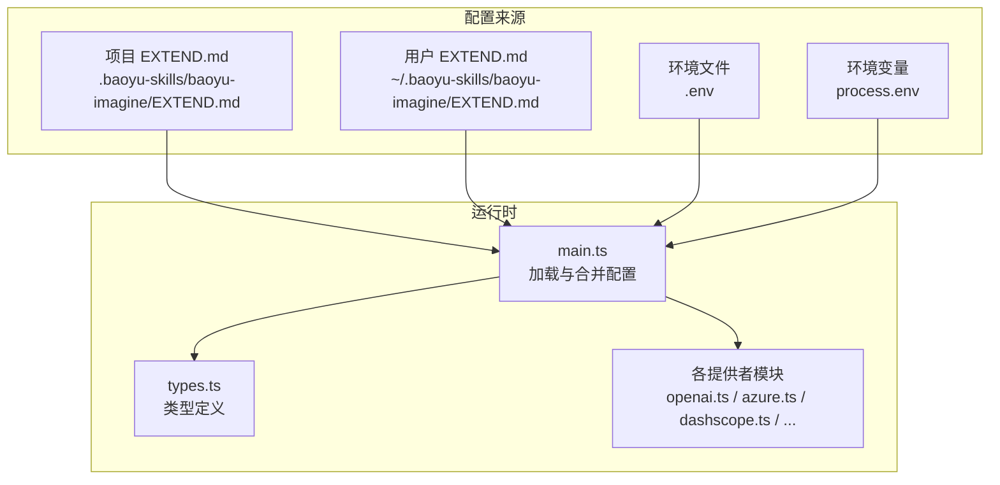
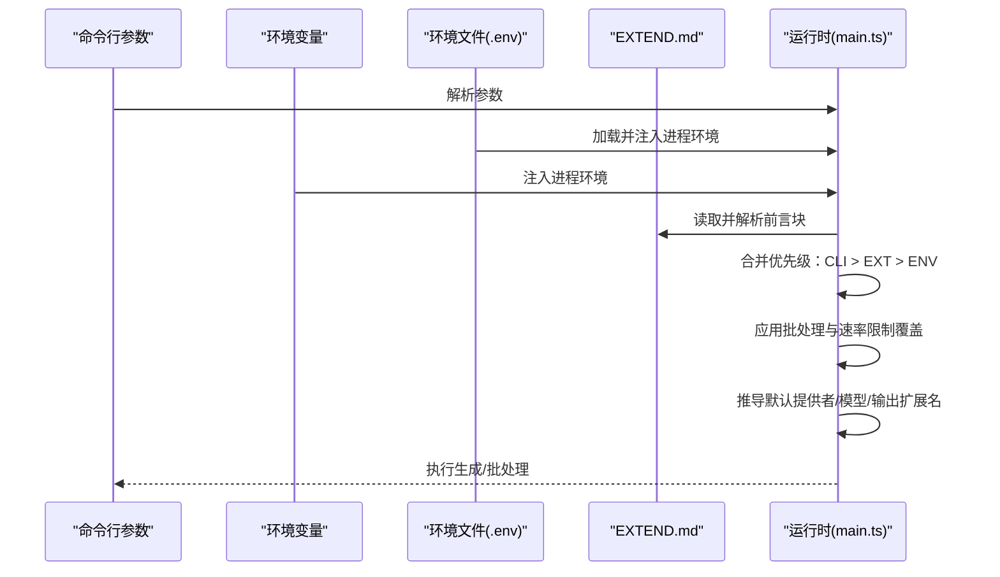
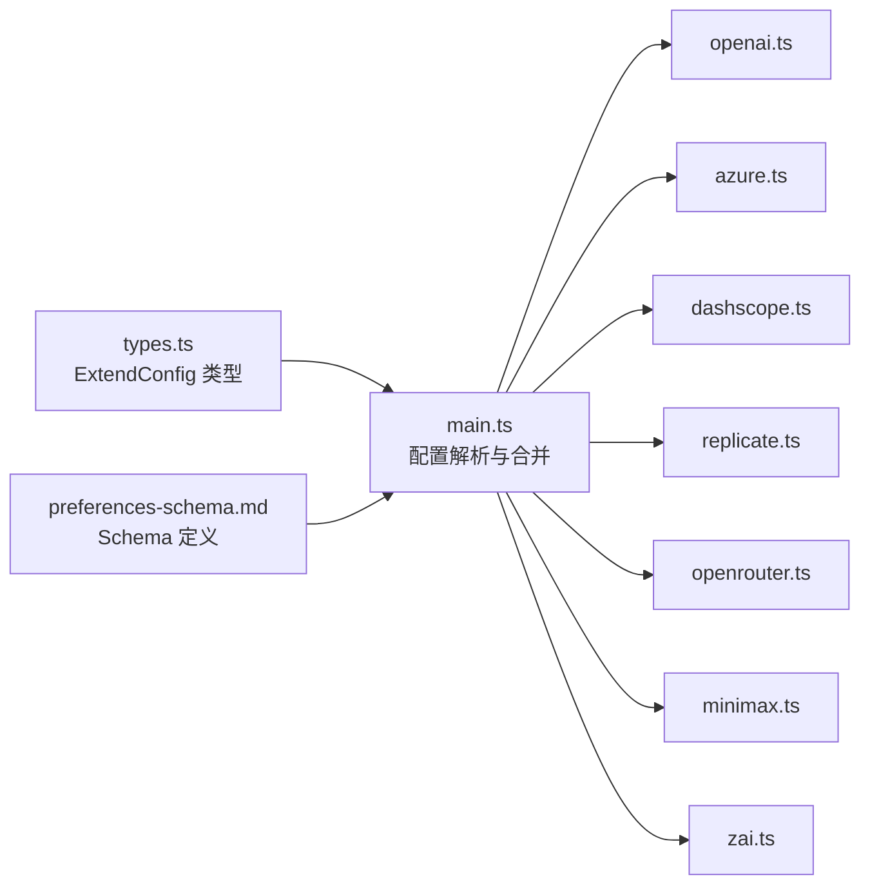

# 配置管理

<cite>
**本文引用的文件**
- [preferences-schema.md](file://.agents/skills/baoyu-imagine/references/config/preferences-schema.md)
- [first-time-setup.md](file://.agents/skills/baoyu-imagine/references/config/first-time-setup.md)
- [main.ts](file://.agents/skills/baoyu-imagine/scripts/main.ts)
- [types.ts](file://.agents/skills/baoyu-imagine/scripts/types.ts)
- [dashscope.ts](file://.agents/skills/baoyu-imagine/scripts/providers/dashscope.ts)
- [openai.ts](file://.agents/skills/baoyu-imagine/scripts/providers/openai.ts)
- [azure.ts](file://.agents/skills/baoyu-imagine/scripts/providers/azure.ts)
- [minimax.ts](file://.agents/skills/baoyu-imagine/scripts/providers/minimax.ts)
- [replicate.ts](file://.agents/skills/baoyu-imagine/scripts/providers/replicate.ts)
- [openrouter.ts](file://.agents/skills/baoyu-imagine/scripts/providers/openrouter.ts)
- [zai.ts](file://.agents/skills/baoyu-imagine/scripts/providers/zai.ts)
</cite>

## 目录
1. [简介](#简介)
2. [项目结构](#项目结构)
3. [核心组件](#核心组件)
4. [架构总览](#架构总览)
5. [详细组件分析](#详细组件分析)
6. [依赖分析](#依赖分析)
7. [性能考虑](#性能考虑)
8. [故障排查指南](#故障排查指南)
9. [结论](#结论)
10. [附录](#附录)

## 简介
本文件面向 baoyu-imagine 技能的配置管理系统，系统性阐述 EXTEND.md 配置文件的结构与字段语义、加载优先级与环境变量交互、首选项模式（preferences-schema）的全部配置项、首次设置流程与最佳实践，并覆盖配置验证、错误处理与动态配置更新机制。读者无需深入技术背景即可理解并正确使用该配置体系。

## 项目结构
baoyu-imagine 将“配置”与“运行时逻辑”解耦：
- 配置文件 EXTEND.md 放置于 XDG 路径约定的目录中，遵循“项目内优先、用户全局次之”的加载策略。
- 首次设置流程由参考文档驱动，生成或更新 EXTEND.md。
- 运行时通过解析 EXTEND.md 并与 CLI 参数、环境变量合并，形成最终执行参数。

图表来源
- [main.ts:551-571](file://.agents/skills/baoyu-imagine/scripts/main.ts#L551-L571)
- [main.ts:367-380](file://.agents/skills/baoyu-imagine/scripts/main.ts#L367-L380)
- [types.ts:59-90](file://.agents/skills/baoyu-imagine/scripts/types.ts#L59-L90)

章节来源
- [main.ts:551-571](file://.agents/skills/baoyu-imagine/scripts/main.ts#L551-L571)
- [main.ts:367-380](file://.agents/skills/baoyu-imagine/scripts/main.ts#L367-L380)
- [types.ts:59-90](file://.agents/skills/baoyu-imagine/scripts/types.ts#L59-L90)

## 核心组件
- EXTEND.md 配置文件：YAML 前言块，定义默认提供者、默认质量、默认纵横比、默认图像尺寸、默认 API 方言、默认模型映射、批处理并发与速率限制等。
- 首次设置流程：引导用户选择默认提供者与模型，并决定保存位置（项目或用户）。
- 运行时配置合并：CLI 参数优先于 EXTEND.md，再由环境变量兜底；批处理并发与速率限制支持环境变量覆盖。
- 提供者适配层：各提供者模块负责将配置转换为具体请求参数，并进行参数校验与响应提取。

章节来源
- [preferences-schema.md:10-62](file://.agents/skills/baoyu-imagine/references/config/preferences-schema.md#L10-L62)
- [first-time-setup.md:1-371](file://.agents/skills/baoyu-imagine/references/config/first-time-setup.md#L1-L371)
- [main.ts:573-594](file://.agents/skills/baoyu-imagine/scripts/main.ts#L573-L594)
- [main.ts:613-651](file://.agents/skills/baoyu-imagine/scripts/main.ts#L613-L651)

## 架构总览
配置加载与合并的总体流程如下：

图表来源
- [main.ts:160-161](file://.agents/skills/baoyu-imagine/scripts/main.ts#L160-L161)
- [main.ts:367-380](file://.agents/skills/baoyu-imagine/scripts/main.ts#L367-L380)
- [main.ts:551-571](file://.agents/skills/baoyu-imagine/scripts/main.ts#L551-L571)
- [main.ts:573-594](file://.agents/skills/baoyu-imagine/scripts/main.ts#L573-L594)
- [main.ts:613-651](file://.agents/skills/baoyu-imagine/scripts/main.ts#L613-L651)

## 详细组件分析

### EXTEND.md 结构与字段定义
EXTEND.md 采用 YAML 前言块，schema 版本为 1。关键字段包括：
- default_provider：默认提供者（null 表示自动检测）
- default_quality：默认质量（normal 或 2k，默认 2k）
- default_aspect_ratio：默认纵横比字符串
- default_image_size：针对 Google/OpenRouter 的图像尺寸（1K/2K/4K，覆盖 quality）
- default_image_api_dialect：OpenAI 兼容图像方言（openai-native 或 ratio-metadata）
- default_model.*：按提供者分组的默认模型 ID
- batch.max_workers：批处理最大工作线程数
- batch.provider_limits.*：按提供者分组的并发与启动间隔

字段参考表（节选）

| 字段 | 类型 | 默认 | 描述 |
| --- | --- | --- | --- |
| version | 整数 | 1 | 配置版本 |
| default_provider | 字符串/null | null | 默认提供者（null=自动检测） |
| default_quality | 字符串/null | null | 默认质量（null=2k） |
| default_aspect_ratio | 字符串/null | null | 默认纵横比 |
| default_image_size | 字符串/null | null | Google/OpenRouter 图像尺寸（覆盖 quality） |
| default_image_api_dialect | 字符串/null | null | OpenAI 兼容图像方言 |
| default_model.google/openai/azure/openrouter/dashscope/zai/minimax/replicate | 字符串/null | null | 各提供者默认模型 |
| batch.max_workers | 整数/null | 10 | 批处理最大工作线程 |
| batch.provider_limits.<provider>.concurrency/start_interval_ms | 整数/null | 提供者默认 | 并发与最小启动间隔 |

章节来源
- [preferences-schema.md:10-62](file://.agents/skills/baoyu-imagine/references/config/preferences-schema.md#L10-L62)
- [preferences-schema.md:66-85](file://.agents/skills/baoyu-imagine/references/config/preferences-schema.md#L66-L85)

### 配置加载优先级与环境变量交互
- 加载顺序（命中即停）：
  1) 项目 EXTEND.md：.baoyu-skills/baoyu-imagine/EXTEND.md
  2) 用户 EXTEND.md：~/.baoyu-skills/baoyu-imagine/EXTEND.md
- 合并规则（从高到低）：
  - CLI 参数优先
  - EXTEND.md 次之
  - 环境变量再次之
- 环境文件加载顺序：
  - ~/.baoyu-skills/.env
  - <cwd>/.baoyu-skills/.env
- 批处理与速率限制的环境变量覆盖：
  - BAOYU_IMAGE_GEN_MAX_WORKERS：覆盖 batch.max_workers
  - BAOYU_IMAGE_GEN_<PROVIDER>_CONCURRENCY：覆盖 provider_limits.<provider>.concurrency
  - BAOYU_IMAGE_GEN_<PROVIDER>_START_INTERVAL_MS：覆盖 provider_limits.<provider>.start_interval_ms

章节来源
- [main.ts:551-571](file://.agents/skills/baoyu-imagine/scripts/main.ts#L551-L571)
- [main.ts:573-594](file://.agents/skills/baoyu-imagine/scripts/main.ts#L573-L594)
- [main.ts:613-651](file://.agents/skills/baoyu-imagine/scripts/main.ts#L613-L651)
- [main.ts:160-161](file://.agents/skills/baoyu-imagine/scripts/main.ts#L160-L161)
- [main.ts:367-380](file://.agents/skills/baoyu-imagine/scripts/main.ts#L367-L380)

### 首次设置流程与最佳实践
- 触发条件：
  - 未找到 EXTEND.md → 完整首次设置（提供者 + 模型 + 首选项）
  - 已存在 EXTEND.md 但 default_model.[provider] 为空 → 仅模型选择
- 设置流程要点：
  - 选择默认提供者（Google/OpenAI/Azure/OpenRouter/DashScope/Z.AI/MiniMax/Replicate）
  - 针对所选提供者选择默认模型
  - 选择默认质量（2k 更适合生产）
  - 选择保存位置：项目内或用户全局
- 最佳实践：
  - 在项目内保存偏好用于团队共享，或在用户全局保存用于跨项目复用
  - 为 OpenAI 兼容网关明确 dialect（ratio-metadata 时需提供纵横比与元数据分辨率）
  - 为 DashScope、Replicate、MiniMax 等提供者选择与其能力匹配的模型族

章节来源
- [first-time-setup.md:10-32](file://.agents/skills/baoyu-imagine/references/config/first-time-setup.md#L10-L32)
- [first-time-setup.md:152-191](file://.agents/skills/baoyu-imagine/references/config/first-time-setup.md#L152-L191)
- [first-time-setup.md:195-371](file://.agents/skills/baoyu-imagine/references/config/first-time-setup.md#L195-L371)

### 配置验证与错误处理
- 配置解析：
  - 仅提取 YAML 前言块内容，逐行解析键值，支持 null、引号去除与缩进层级识别
- 参数校验：
  - CLI 参数范围检查（如 --quality、--imageSize、--imageApiDialect）
  - 各提供者特定参数校验（如 OpenAI 的纵横比范围、Replicate 的输出数量限制）
- 错误处理：
  - 对不可重试的错误（如缺少 API Key、不支持的参数组合）直接抛出
  - 可重试错误（如网络抖动）自动重试最多 3 次
  - 批处理模式汇总失败原因并退出码非零

章节来源
- [main.ts:291-313](file://.agents/skills/baoyu-imagine/scripts/main.ts#L291-L313)
- [main.ts:806-830](file://.agents/skills/baoyu-imagine/scripts/main.ts#L806-L830)
- [openai.ts:239-276](file://.agents/skills/baoyu-imagine/scripts/providers/openai.ts#L239-L276)
- [replicate.ts:367-437](file://.agents/skills/baoyu-imagine/scripts/providers/replicate.ts#L367-L437)
- [minimax.ts:82-103](file://.agents/skills/baoyu-imagine/scripts/providers/minimax.ts#L82-L103)

### 动态配置更新机制
- 运行时不会修改 EXTEND.md；变更通过 CLI 参数或环境变量即时生效
- 批处理并发与速率限制可通过环境变量动态调整，无需重启
- 首次设置完成后会提示保存路径，便于后续维护

章节来源
- [main.ts:551-571](file://.agents/skills/baoyu-imagine/scripts/main.ts#L551-L571)
- [main.ts:613-651](file://.agents/skills/baoyu-imagine/scripts/main.ts#L613-L651)
- [first-time-setup.md:365-371](file://.agents/skills/baoyu-imagine/references/config/first-time-setup.md#L365-L371)

### 提供者维度的配置与参数映射
- OpenAI（含兼容方言）：
  - dialect=openai-native：使用 images/generations，按 size 推断纵横比
  - dialect=ratio-metadata：以纵横比字符串作为 size，metadata 中携带分辨率与朝向
  - gpt-image-* 支持纵横比与像素约束校验
- Azure OpenAI：
  - 部署名称即模型 ID；支持图片编辑（PNG/JPG）
- DashScope：
  - 模型族区分（qwen2/qwenFixed/wan2.7/legacy），不同族有不同尺寸约束与参考图支持
  - wan2.7-image-pro 支持 4K 文本到图，且可带参考图
- Replicate：
  - 多模型族（nano-banana/seedream/wan2.7），严格限制每请求一张图
  - 支持从纵横比推导尺寸或显式指定
- OpenRouter：
  - 支持文本+图像多模态消息；按模型支持的纵横比集合校验
- MiniMax：
  - 支持人物参考图（subject_reference），限制大小与格式
  - 支持官方纵横比集合与自定义宽高（需满足步长与范围）
- Z.AI：
  - GLM-image 为主流文本到图模型，当前不支持参考图
  - 自定义尺寸有像素上限与步长要求

章节来源
- [openai.ts:142-181](file://.agents/skills/baoyu-imagine/scripts/providers/openai.ts#L142-L181)
- [openai.ts:204-237](file://.agents/skills/baoyu-imagine/scripts/providers/openai.ts#L204-L237)
- [azure.ts:99-108](file://.agents/skills/baoyu-imagine/scripts/providers/azure.ts#L99-L108)
- [dashscope.ts:458-487](file://.agents/skills/baoyu-imagine/scripts/providers/dashscope.ts#L458-L487)
- [replicate.ts:367-437](file://.agents/skills/baoyu-imagine/scripts/providers/replicate.ts#L367-L437)
- [openrouter.ts:177-195](file://.agents/skills/baoyu-imagine/scripts/providers/openrouter.ts#L177-L195)
- [minimax.ts:82-103](file://.agents/skills/baoyu-imagine/scripts/providers/minimax.ts#L82-L103)
- [zai.ts:242-250](file://.agents/skills/baoyu-imagine/scripts/providers/zai.ts#L242-L250)

## 依赖分析
配置系统的关键依赖关系如下：

图表来源
- [types.ts:59-90](file://.agents/skills/baoyu-imagine/scripts/types.ts#L59-L90)
- [preferences-schema.md:10-62](file://.agents/skills/baoyu-imagine/references/config/preferences-schema.md#L10-L62)
- [main.ts:551-571](file://.agents/skills/baoyu-imagine/scripts/main.ts#L551-L571)

章节来源
- [types.ts:59-90](file://.agents/skills/baoyu-imagine/scripts/types.ts#L59-L90)
- [preferences-schema.md:10-62](file://.agents/skills/baoyu-imagine/references/config/preferences-schema.md#L10-L62)
- [main.ts:551-571](file://.agents/skills/baoyu-imagine/scripts/main.ts#L551-L571)

## 性能考虑
- 批处理并发与速率限制：
  - 默认最大工作线程为 10；可通过 BAOYU_IMAGE_GEN_MAX_WORKERS 调整
  - 各提供者默认并发与启动间隔可在 EXTEND.md 的 batch.provider_limits 中配置，亦可通过对应环境变量覆盖
- 重试策略：
  - 单张图生成最多重试 3 次，避免瞬时错误导致失败
- 输出扩展名：
  - 不同提供者默认输出扩展名不同（如 MiniMax 默认 .jpg），可减少后处理开销

章节来源
- [main.ts:55-67](file://.agents/skills/baoyu-imagine/scripts/main.ts#L55-L67)
- [main.ts:613-651](file://.agents/skills/baoyu-imagine/scripts/main.ts#L613-L651)
- [main.ts:806-830](file://.agents/skills/baoyu-imagine/scripts/main.ts#L806-L830)
- [minimax.ts:189-191](file://.agents/skills/baoyu-imagine/scripts/providers/minimax.ts#L189-L191)

## 故障排查指南
- 常见错误与定位
  - 缺少 API Key：检查对应 PROVIDER_API_KEY 或 PROVIDER_BASE_URL 是否设置
  - 不支持的纵横比/尺寸：依据提供者模块的校验规则调整
  - 批量请求过多：降低 jobs 或提升 provider_limits.start_interval_ms
  - OpenAI dialect 使用不当：确保 ratio-metadata 时提供纵横比与分辨率元数据
- 日志与诊断
  - 批处理模式会输出汇总统计与失败原因
  - 各提供者模块会在生成前后打印关键参数与响应状态

章节来源
- [main.ts:1196-1216](file://.agents/skills/baoyu-imagine/scripts/main.ts#L1196-L1216)
- [openai.ts:298-311](file://.agents/skills/baoyu-imagine/scripts/providers/openai.ts#L298-L311)
- [replicate.ts:370-376](file://.agents/skills/baoyu-imagine/scripts/providers/replicate.ts#L370-L376)
- [dashscope.ts:565-581](file://.agents/skills/baoyu-imagine/scripts/providers/dashscope.ts#L565-L581)

## 结论
baoyu-imagine 的配置管理以 EXTEND.md 为核心，结合 CLI、EXTEND.md 与环境变量的三层优先级，实现了灵活而可控的默认行为。配合首次设置流程与严格的参数校验，既能快速上手，又能满足复杂场景下的精细化控制。通过环境变量覆盖批处理与速率限制，系统具备良好的动态调优能力。

## 附录

### 配置字段速查（摘要）
- default_provider：默认提供者
- default_quality：normal/2k
- default_aspect_ratio：纵横比字符串
- default_image_size：1K/2K/4K（Google/OpenRouter）
- default_image_api_dialect：openai-native/ratio-metadata
- default_model.*：各提供者默认模型 ID
- batch.max_workers：批处理最大工作线程
- batch.provider_limits.*：并发与启动间隔

章节来源
- [preferences-schema.md:66-85](file://.agents/skills/baoyu-imagine/references/config/preferences-schema.md#L66-L85)