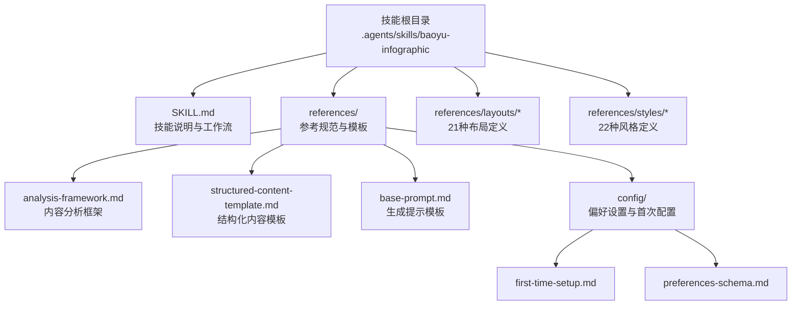
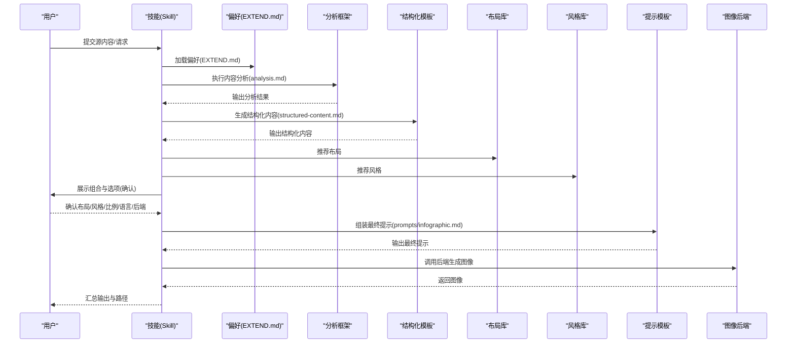
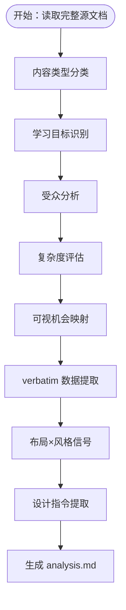
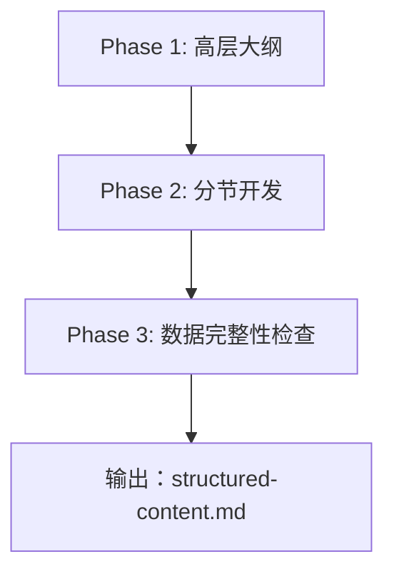
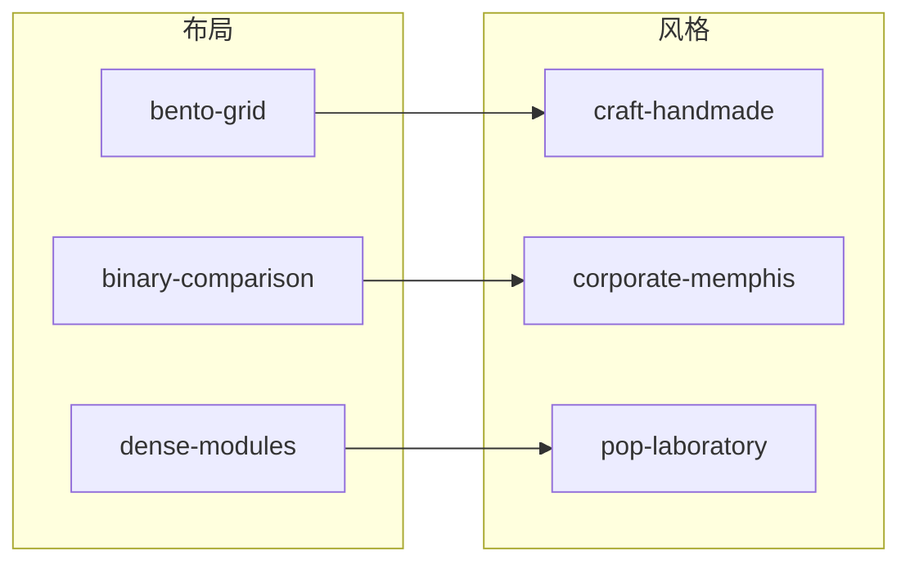
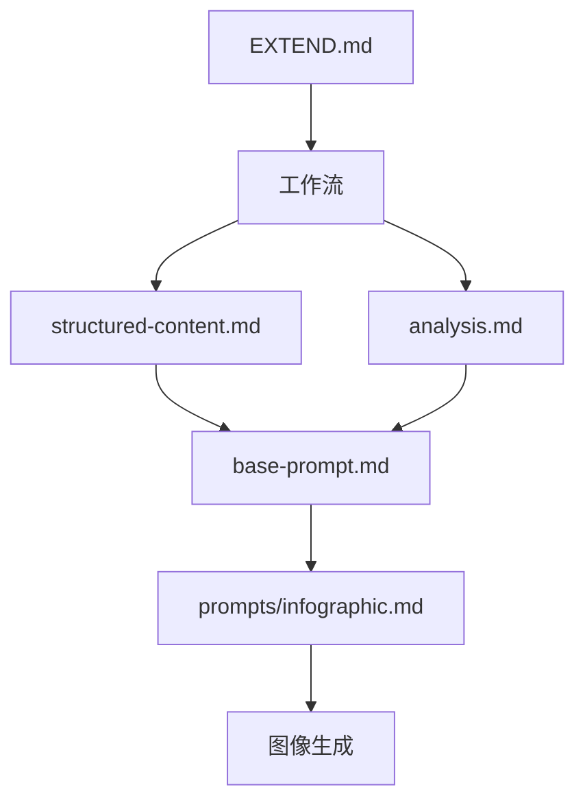

# baoyu-infographic 信息图表技能

<cite>
**本文引用的文件**
- [SKILL.md](file://.agents/skills/baoyu-infographic/SKILL.md)
- [analysis-framework.md](file://.agents/skills/baoyu-infographic/references/analysis-framework.md)
- [base-prompt.md](file://.agents/skills/baoyu-infographic/references/base-prompt.md)
- [structured-content-template.md](file://.agents/skills/baoyu-infographic/references/structured-content-template.md)
- [first-time-setup.md](file://.agents/skills/baoyu-infographic/references/config/first-time-setup.md)
- [preferences-schema.md](file://.agents/skills/baoyu-infographic/references/config/preferences-schema.md)
- [bento-grid.md](file://.agents/skills/baoyu-infographic/references/layouts/bento-grid.md)
- [binary-comparison.md](file://.agents/skills/baoyu-infographic/references/layouts/binary-comparison.md)
- [dense-modules.md](file://.agents/skills/baoyu-infographic/references/layouts/dense-modules.md)
- [craft-handmade.md](file://.agents/skills/baoyu-infographic/references/styles/craft-handmade.md)
- [corporate-memphis.md](file://.agents/skills/baoyu-infographic/references/styles/corporate-memphis.md)
- [pop-laboratory.md](file://.agents/skills/baoyu-infographic/references/styles/pop-laboratory.md)
</cite>

## 目录
1. [简介](#简介)
2. [项目结构](#项目结构)
3. [核心组件](#核心组件)
4. [架构总览](#架构总览)
5. [详细组件分析](#详细组件分析)
6. [依赖关系分析](#依赖关系分析)
7. [性能考虑](#性能考虑)
8. [故障排查指南](#故障排查指南)
9. [结论](#结论)
10. [附录](#附录)

## 简介
baoyu-infographic 是一个面向“信息图表”生成的专业技能，支持 21 种布局与 22 种视觉风格的自由组合，覆盖从概览型网格到高密度模块、从手绘风到科技工程图等多种表达方式。其工作流以“分析—结构化内容—推荐组合—确认—生成提示—图像生成—输出总结”为主线，强调：
- 内容忠实保留：原文数据、引文、统计数字等严格 verbatim 复制
- 学习目标驱动：先确定学习目标，再进行信息架构与风格匹配
- 视觉优先：通过布局与风格强化信息传达，避免过度装饰
- 可复现性：每张图的最终提示均保存为独立文件，便于回溯与迁移

## 项目结构
技能目录下包含技能说明、参考规范与示例文件，形成“规则—模板—示例”的知识体系：
- 根目录 SKILL.md：技能说明、选项、推荐组合、关键词快捷、输出结构、工作流与参考路径
- references/ 下：
  - analysis-framework.md：内容分析框架（教学设计视角）
  - structured-content-template.md：结构化内容模板（分阶段、分节、数据校验）
  - base-prompt.md：生成提示的基础模板（含布局/风格/语言/文本/布局/风格指南占位）
  - config/：偏好设置与首次配置
- references/layouts 与 references/styles：各布局与风格的定义与最佳搭配

**图表来源**
- [.agents/skills/baoyu-infographic/SKILL.md:1-321](file://.agents/skills/baoyu-infographic/SKILL.md#L1-L321)
- [.agents/skills/baoyu-infographic/references/analysis-framework.md:1-183](file://.agents/skills/baoyu-infographic/references/analysis-framework.md#L1-L183)
- [.agents/skills/baoyu-infographic/references/structured-content-template.md:1-245](file://.agents/skills/baoyu-infographic/references/structured-content-template.md#L1-L245)
- [.agents/skills/baoyu-infographic/references/base-prompt.md:1-44](file://.agents/skills/baoyu-infographic/references/base-prompt.md#L1-L44)
- [.agents/skills/baoyu-infographic/references/config/first-time-setup.md:1-154](file://.agents/skills/baoyu-infographic/references/config/first-time-setup.md#L1-L154)
- [.agents/skills/baoyu-infographic/references/config/preferences-schema.md:1-127](file://.agents/skills/baoyu-infographic/references/config/preferences-schema.md#L1-L127)

**章节来源**
- [.agents/skills/baoyu-infographic/SKILL.md:1-321](file://.agents/skills/baoyu-infographic/SKILL.md#L1-L321)

## 核心组件
- 分析框架（analysis-framework.md）：以教学设计思维对源内容进行深度分析，明确主题、学习目标、受众、复杂度、可视机会与数据摘录，产出 analysis.md
- 结构化内容模板（structured-content-template.md）：将分析结果转化为可交付给图像生成器的结构化内容，包含标题、概述、学习目标、分节内容、数据点、设计指令等
- 基础提示模板（base-prompt.md）：统一的提示词骨架，注入布局、风格、语言、文本要求、布局/风格指南与结构化内容
- 偏好设置与首次配置（preferences-schema.md、first-time-setup.md）：定义 EXTEND.md 字段、默认值与交互式首次配置流程
- 布局与风格库（layouts/*.md、styles/*.md）：21 种布局与 22 种风格的具体定义、适用场景与推荐搭配

**章节来源**
- [.agents/skills/baoyu-infographic/references/analysis-framework.md:1-183](file://.agents/skills/baoyu-infographic/references/analysis-framework.md#L1-L183)
- [.agents/skills/baoyu-infographic/references/structured-content-template.md:1-245](file://.agents/skills/baoyu-infographic/references/structured-content-template.md#L1-L245)
- [.agents/skills/baoyu-infographic/references/base-prompt.md:1-44](file://.agents/skills/baoyu-infographic/references/base-prompt.md#L1-L44)
- [.agents/skills/baoyu-infographic/references/config/preferences-schema.md:1-127](file://.agents/skills/baoyu-infographic/references/config/preferences-schema.md#L1-L127)
- [.agents/skills/baoyu-infographic/references/config/first-time-setup.md:1-154](file://.agents/skills/baoyu-infographic/references/config/first-time-setup.md#L1-L154)

## 架构总览
整体工作流由“输入—分析—结构化—推荐—确认—提示组装—生成—输出”构成，贯穿多处备份与可复现机制。

**图表来源**
- [.agents/skills/baoyu-infographic/SKILL.md:203-300](file://.agents/skills/baoyu-infographic/SKILL.md#L203-L300)
- [.agents/skills/baoyu-infographic/references/analysis-framework.md:115-168](file://.agents/skills/baoyu-infographic/references/analysis-framework.md#L115-L168)
- [.agents/skills/baoyu-infographic/references/structured-content-template.md:46-138](file://.agents/skills/baoyu-infographic/references/structured-content-template.md#L46-L138)
- [.agents/skills/baoyu-infographic/references/base-prompt.md:1-44](file://.agents/skills/baoyu-infographic/references/base-prompt.md#L1-L44)

## 详细组件分析

### 组件一：内容分析框架（Instructional Design Mindset）
- 目标：在创作前对源材料进行深度理解，识别学习目标，结构化信息以提升清晰度与记忆点，并匹配最优布局×风格组合
- 关键维度：
  - 内容类型分类：时间线/过程/对比/层级/关系/数据/循环/系统/旅程/概览/产品指南等
  - 学习目标：1-3 条，从观者视角描述“看完后能理解什么”
  - 受众分析：知识水平、观看动机、期望、视觉偏好
  - 复杂度评估：简单/中等/复杂，影响布局密度与结构
  - 可视机会映射：数字、对比、流程、层级、关系、分类、时间线、引述等
  - 数据 verbatim 提取：统计、引述、名称、日期、术语、列表等严格复制
- 输出：analysis.md（含 YAML frontmatter 与正文）

**图表来源**
- [.agents/skills/baoyu-infographic/references/analysis-framework.md:26-168](file://.agents/skills/baoyu-infographic/references/analysis-framework.md#L26-L168)

**章节来源**
- [.agents/skills/baoyu-infographic/references/analysis-framework.md:1-183](file://.agents/skills/baoyu-infographic/references/analysis-framework.md#L1-L183)

### 组件二：结构化内容模板（Structured Content）
- 目标：将分析结果转化为图像生成器可用的结构化内容，确保所有数据 verbatim、分离设计指令、分节明确
- 三阶段：
  - 高层大纲：标题、概述、学习目标
  - 分节开发：每个目标对应一个或多个分节，包含“关键概念、内容、视觉元素、文本标签”
  - 数据完整性检查：逐条核对 verbatim、标注、格式一致性
- 特定内容类型的分节模板：流程步骤、对比、层级、数据统计等
- 输出：structured-content.md

**图表来源**
- [.agents/skills/baoyu-infographic/references/structured-content-template.md:13-138](file://.agents/skills/baoyu-infographic/references/structured-content-template.md#L13-L138)

**章节来源**
- [.agents/skills/baoyu-infographic/references/structured-content-template.md:1-245](file://.agents/skills/baoyu-infographic/references/structured-content-template.md#L1-L245)

### 组件三：基础提示模板（Base Prompt）
- 目标：统一提示词骨架，确保生成的一致性与可复现性
- 关键要素：
  - 图像规格：类型、布局、风格、宽高比、语言
  - 核心原则：遵循布局结构、风格一致、敏感/版权人物替换、简洁突出关键词、充足留白、清晰层次
  - 文本要求：与风格一致、主标题醒目、关键词强调、标签清晰、指定语言
  - 布局与风格指南：由布局/风格定义文件注入
  - 内容与标签：由结构化内容与文本标签注入

**章节来源**
- [.agents/skills/baoyu-infographic/references/base-prompt.md:1-44](file://.agents/skills/baoyu-infographic/references/base-prompt.md#L1-L44)

### 组件四：偏好设置与首次配置（EXTEND.md）
- EXTEND.md 支持字段：
  - preferred_layout、preferred_style、preferred_aspect、language、preferred_image_backend、custom_styles
- 首次配置流程：交互式问答，保存至项目或用户范围，随后继续工作流
- 后续修改：可直接编辑、重新触发配置、常用一键修改项

**章节来源**
- [.agents/skills/baoyu-infographic/references/config/preferences-schema.md:1-127](file://.agents/skills/baoyu-infographic/references/config/preferences-schema.md#L1-L127)
- [.agents/skills/baoyu-infographic/references/config/first-time-setup.md:1-154](file://.agents/skills/baoyu-infographic/references/config/first-time-setup.md#L1-L154)

### 组件五：布局与风格库（21 布局 × 22 风格）
- 布局特点与适用场景（节选）：
  - bento-grid：多主题概览、特征亮点、仪表盘摘要、作品集展示、混合内容类型
  - binary-comparison：两方对比（A vs B、前后、正负），强调镜像结构与清晰区分
  - dense-modules：高密度模块（6-7 个模块），每模块承载具体数据，紧凑排版，坐标/网格/自由流动变体
- 风格特点与适用场景（节选）：
  - craft-handmade：手绘/剪纸质感，温暖有机，适合教育、友好解释、儿童内容
  - corporate-memphis：扁平矢量、几何填充、明亮饱和色，适合商业演示、技术产品、营销材料
  - pop-laboratory：蓝图网格+荧光色，实验室精度与流行色结合，适合技术产品指南、规格对比
- 推荐组合（节选）：根据内容类型、语气、受众与复杂度给出 top-3 组合建议

**图表来源**
- [.agents/skills/baoyu-infographic/references/layouts/bento-grid.md:1-42](file://.agents/skills/baoyu-infographic/references/layouts/bento-grid.md#L1-L42)
- [.agents/skills/baoyu-infographic/references/layouts/binary-comparison.md:1-49](file://.agents/skills/baoyu-infographic/references/layouts/binary-comparison.md#L1-L49)
- [.agents/skills/baoyu-infographic/references/layouts/dense-modules.md:1-74](file://.agents/skills/baoyu-infographic/references/layouts/dense-modules.md#L1-L74)
- [.agents/skills/baoyu-infographic/references/styles/craft-handmade.md:1-45](file://.agents/skills/baoyu-infographic/references/styles/craft-handmade.md#L1-L45)
- [.agents/skills/baoyu-infographic/references/styles/corporate-memphis.md:1-30](file://.agents/skills/baoyu-infographic/references/styles/corporate-memphis.md#L1-L30)
- [.agents/skills/baoyu-infographic/references/styles/pop-laboratory.md:1-49](file://.agents/skills/baoyu-infographic/references/styles/pop-laboratory.md#L1-L49)

**章节来源**
- [.agents/skills/baoyu-infographic/references/layouts/bento-grid.md:1-42](file://.agents/skills/baoyu-infographic/references/layouts/bento-grid.md#L1-L42)
- [.agents/skills/baoyu-infographic/references/layouts/binary-comparison.md:1-49](file://.agents/skills/baoyu-infographic/references/layouts/binary-comparison.md#L1-L49)
- [.agents/skills/baoyu-infographic/references/layouts/dense-modules.md:1-74](file://.agents/skills/baoyu-infographic/references/layouts/dense-modules.md#L1-L74)
- [.agents/skills/baoyu-infographic/references/styles/craft-handmade.md:1-45](file://.agents/skills/baoyu-infographic/references/styles/craft-handmade.md#L1-L45)
- [.agents/skills/baoyu-infographic/references/styles/corporate-memphis.md:1-30](file://.agents/skills/baoyu-infographic/references/styles/corporate-memphis.md#L1-L30)
- [.agents/skills/baoyu-infographic/references/styles/pop-laboratory.md:1-49](file://.agents/skills/baoyu-infographic/references/styles/pop-laboratory.md#L1-L49)

## 依赖关系分析
- 技能运行依赖 EXTEND.md 的存在；若缺失则阻塞进入后续步骤，需先完成首次配置
- 工作流中各阶段相互依赖：analysis.md 为 structured-content.md 的输入；structured-content.md 与布局/风格定义共同组成最终提示
- 图像生成后端选择遵循“当前请求覆盖 > 保存偏好 > 自动选择 > 用户确认”的优先级

**图表来源**
- [.agents/skills/baoyu-infographic/SKILL.md:207-300](file://.agents/skills/baoyu-infographic/SKILL.md#L207-L300)
- [.agents/skills/baoyu-infographic/references/base-prompt.md:1-44](file://.agents/skills/baoyu-infographic/references/base-prompt.md#L1-L44)

**章节来源**
- [.agents/skills/baoyu-infographic/SKILL.md:207-300](file://.agents/skills/baoyu-infographic/SKILL.md#L207-L300)

## 性能考虑
- 生成提示与图像生成前的备份策略：analysis.md、structured-content.md、prompts/infographic.md 均有冲突重命名备份逻辑，降低重复覆盖风险
- 图像生成失败自动重试一次，提高成功率
- 提示词文件作为可复现记录，便于切换后端或回放生成过程
- 高密度模块布局（dense-modules）在保证信息密度的同时，注意保持可读性与组织性，避免过度拥挤

[本节为通用指导，不直接分析具体文件]

## 故障排查指南
- 未找到 EXTEND.md：首次运行会引导完成偏好设置，完成后方可继续工作流
- 生成提示文件未写入：确保在调用后端前已写入 prompts/infographic.md，它是可复现记录
- 图像生成失败：系统会自动重试一次；若仍失败，检查后端可用性与提示文件内容
- 确认步骤被跳过：默认行为为“生成前确认”，除非用户显式请求跳过（例如 --no-confirm 或等价表达）
- 引用图片处理：当后端不支持直接传入参考图时，系统会将提取的风格/色调特征内嵌到提示文本中

**章节来源**
- [.agents/skills/baoyu-infographic/SKILL.md:42-81](file://.agents/skills/baoyu-infographic/SKILL.md#L42-L81)
- [.agents/skills/baoyu-infographic/SKILL.md:288-296](file://.agents/skills/baoyu-infographic/SKILL.md#L288-L296)

## 结论
baoyu-infographic 将“教学设计思维”与“视觉信息架构”结合，通过标准化的内容分析、结构化内容与提示模板，实现从结构化数据到专业信息图表的稳定生产。其 21 布局与 22 风格的自由组合，配合可复现的提示文件与可配置的偏好设置，既满足多样化表达需求，又保障了质量与一致性。

[本节为总结性内容，不直接分析具体文件]

## 附录

### 使用示例：从结构化数据到信息图表生成的完整流程
- 步骤 1：加载偏好（EXTEND.md）并执行内容分析，生成 analysis.md
- 步骤 2：基于分析结果生成结构化内容，生成 structured-content.md
- 步骤 3：根据内容类型、语气、受众与复杂度推荐 3-5 组布局×风格组合
- 步骤 4：确认选项（布局、风格、宽高比、语言、后端），必要时跳过确认需显式声明
- 步骤 5：组装最终提示，写入 prompts/infographic.md
- 步骤 6：解析图像后端并调用生成，失败自动重试一次
- 步骤 7：输出汇总报告与文件路径

**章节来源**
- [.agents/skills/baoyu-infographic/SKILL.md:203-300](file://.agents/skills/baoyu-infographic/SKILL.md#L203-L300)

### 配置文件设置与首选项管理
- EXTEND.md 字段与默认值：preferred_layout、preferred_style、preferred_aspect、language、preferred_image_backend、custom_styles
- 首次配置：交互式问答，保存至项目或用户范围
- 偏好修改：直接编辑、重新触发配置、常用一键修改项（如固定后端、更改默认布局/风格/宽高比/语言）

**章节来源**
- [.agents/skills/baoyu-infographic/references/config/preferences-schema.md:1-127](file://.agents/skills/baoyu-infographic/references/config/preferences-schema.md#L1-L127)
- [.agents/skills/baoyu-infographic/references/config/first-time-setup.md:1-154](file://.agents/skills/baoyu-infographic/references/config/first-time-setup.md#L1-L154)

### 设计指南与最佳实践
- 保持数据 verbatim：统计、引述、名称、日期、术语、列表等严格复制
- 先学习目标，后信息架构：围绕“观者能理解什么”组织内容
- 视觉优先但不过度装饰：用布局与风格强化信息，而非掩盖信息
- 高密度模块布局要点：模块数量与职责明确、坐标/网格/自由流动的视觉组织、警告/陷阱模块的高对比呈现
- 手绘风格限制：严禁真实照片或写实人物，必须保持手绘/卡通风格

**章节来源**
- [.agents/skills/baoyu-infographic/references/analysis-framework.md:14-25](file://.agents/skills/baoyu-infographic/references/analysis-framework.md#L14-L25)
- [.agents/skills/baoyu-infographic/references/structured-content-template.md:37-45](file://.agents/skills/baoyu-infographic/references/structured-content-template.md#L37-L45)
- [.agents/skills/baoyu-infographic/references/layouts/dense-modules.md:58-64](file://.agents/skills/baoyu-infographic/references/layouts/dense-modules.md#L58-L64)
- [.agents/skills/baoyu-infographic/references/styles/craft-handmade.md:29-34](file://.agents/skills/baoyu-infographic/references/styles/craft-handmade.md#L29-L34)