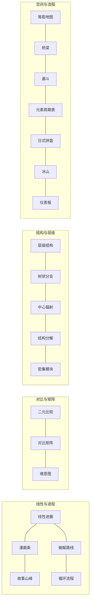
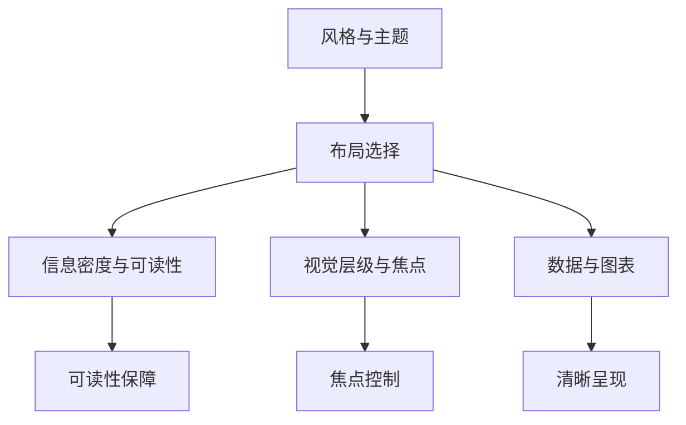

# 信息图表布局类型

<cite>
**本文引用的文件**
- [linear-progression.md](file://.agents/skills/baoyu-infographic/references/layouts/linear-progression.md)
- [binary-comparison.md](file://.agents/skills/baoyu-infographic/references/layouts/binary-comparison.md)
- [comparison-matrix.md](file://.agents/skills/baoyu-infographic/references/layouts/comparison-matrix.md)
- [hierarchical-layers.md](file://.agents/skills/baoyu-infographic/references/layouts/hierarchical-layers.md)
- [tree-branching.md](file://.agents/skills/baoyu-infographic/references/layouts/tree-branching.md)
- [hub-spoke.md](file://.agents/skills/baoyu-infographic/references/layouts/hub-spoke.md)
- [structural-breakdown.md](file://.agents/skills/baoyu-infographic/references/layouts/structural-breakdown.md)
- [bento-grid.md](file://.agents/skills/baoyu-infographic/references/layouts/bento-grid.md)
- [iceberg.md](file://.agents/skills/baoyu-infographic/references/layouts/iceberg.md)
- [bridge.md](file://.agents/skills/baoyu-infographic/references/layouts/bridge.md)
- [funnel.md](file://.agents/skills/baoyu-infographic/references/layouts/funnel.md)
- [isometric-map.md](file://.agents/skills/baoyu-infographic/references/layouts/isometric-map.md)
- [dashboard.md](file://.agents/skills/baoyu-infographic/references/layouts/dashboard.md)
- [periodic-table.md](file://.agents/skills/baoyu-infographic/references/layouts/periodic-table.md)
- [comic-strip.md](file://.agents/skills/baoyu-infographic/references/layouts/comic-strip.md)
- [story-mountain.md](file://.agents/skills/baoyu-infographic/references/layouts/story-mountain.md)
- [jigsaw.md](file://.agents/skills/baoyu-infographic/references/layouts/jigsaw.md)
- [venn-diagram.md](file://.agents/skills/baoyu-infographic/references/layouts/venn-diagram.md)
- [winding-roadmap.md](file://.agents/skills/baoyu-infographic/references/layouts/winding-roadmap.md)
- [circular-flow.md](file://.agents/skills/baoyu-infographic/references/layouts/circular-flow.md)
- [dense-modules.md](file://.agents/skills/baoyu-infographic/references/layouts/dense-modules.md)
</cite>

## 目录
1. [简介](#简介)
2. [项目结构](#项目结构)
3. [核心组件](#核心组件)
4. [架构总览](#架构总览)
5. [详细组件分析](#详细组件分析)
6. [依赖关系分析](#依赖关系分析)
7. [性能考量](#性能考量)
8. [故障排查指南](#故障排查指南)
9. [结论](#结论)
10. [附录](#附录)

## 简介
本技术文档系统梳理并解读信息图表中的 21 种布局类型，覆盖从线性进展到循环流程的多种可视化范式。每种布局均包含结构特征、变体、适用场景、视觉元素、文本排布与风格搭配建议，并提供选择指南与实践要点，帮助读者在不同内容语境下做出最优布局决策。

## 项目结构
这些布局定义集中于技能参考文档中，采用 Markdown 文件形式组织，便于检索与扩展。每个布局文件独立描述其结构、变体、最佳用途、视觉元素、文本放置与推荐风格搭配。

```mermaid
graph TB
root[".agents/skills/baoyu-infographic/references/layouts"] --> lp["linear-progression.md"]
root --> bc["binary-comparison.md"]
root --> cm["comparison-matrix.md"]
root --> hl["hierarchical-layers.md"]
root --> tb["tree-branching.md"]
root --> hs["hub-spoke.md"]
root --> sb["structural-breakdown.md"]
root --> bg["bento-grid.md"]
root --> ib["iceberg.md"]
root --> br["bridge.md"]
root --> fu["funnel.md"]
root --> im["isometric-map.md"]
root --> db["dashboard.md"]
root --> pt["periodic-table.md"]
root --> cs["comic-strip.md"]
root --> sm["story-mountain.md"]
root --> jg["jigsaw.md"]
root --> vd["venn-diagram.md"]
root --> wr["winding-roadmap.md"]
root --> cf["circular-flow.md"]
root --> dm["dense-modules.md"]
```

**图表来源**
- [linear-progression.md:1-49](file://.agents/skills/baoyu-infographic/references/layouts/linear-progression.md#L1-L49)
- [binary-comparison.md:1-49](file://.agents/skills/baoyu-infographic/references/layouts/binary-comparison.md#L1-L49)
- [comparison-matrix.md:1-42](file://.agents/skills/baoyu-infographic/references/layouts/comparison-matrix.md#L1-L42)
- [hierarchical-layers.md:1-49](file://.agents/skills/baoyu-infographic/references/layouts/hierarchical-layers.md#L1-L49)
- [tree-branching.md:1-42](file://.agents/skills/baoyu-infographic/references/layouts/tree-branching.md#L1-L42)
- [hub-spoke.md:1-42](file://.agents/skills/baoyu-infographic/references/layouts/hub-spoke.md#L1-L42)
- [structural-breakdown.md:1-49](file://.agents/skills/baoyu-infographic/references/layouts/structural-breakdown.md#L1-L49)
- [bento-grid.md:1-42](file://.agents/skills/baoyu-infographic/references/layouts/bento-grid.md#L1-L42)
- [iceberg.md:1-42](file://.agents/skills/baoyu-infographic/references/layouts/iceberg.md#L1-L42)
- [bridge.md:1-42](file://.agents/skills/baoyu-infographic/references/layouts/bridge.md#L1-L42)
- [funnel.md:1-42](file://.agents/skills/baoyu-infographic/references/layouts/funnel.md#L1-L42)
- [isometric-map.md:1-42](file://.agents/skills/baoyu-infographic/references/layouts/isometric-map.md#L1-L42)
- [dashboard.md:1-42](file://.agents/skills/baoyu-infographic/references/layouts/dashboard.md#L1-L42)
- [periodic-table.md:1-42](file://.agents/skills/baoyu-infographic/references/layouts/periodic-table.md#L1-L42)
- [comic-strip.md:1-42](file://.agents/skills/baoyu-infographic/references/layouts/comic-strip.md#L1-L42)
- [story-mountain.md:1-42](file://.agents/skills/baoyu-infographic/references/layouts/story-mountain.md#L1-L42)
- [jigsaw.md](file://.agents/skills/baoyu-infographic/references/layouts/jigsaw.md)
- [venn-diagram.md](file://.agents/skills/baoyu-infographic/references/layouts/venn-diagram.md)
- [winding-roadmap.md](file://.agents/skills/baoyu-infographic/references/layouts/winding-roadmap.md)
- [circular-flow.md](file://.agents/skills/baoyu-infographic/references/layouts/circular-flow.md)
- [dense-modules.md](file://.agents/skills/baoyu-infographic/references/layouts/dense-modules.md)

**章节来源**
- [.agents/skills/baoyu-infographic/references/layouts](file://.agents/skills/baoyu-infographic/references/layouts)

## 核心组件
本节对 21 种布局进行分组与概述，便于快速建立整体认知框架。

- 线性与进程类
  - 线性进展：顺序步骤、时间轴或阶段性事件
  - 漫画条：连续叙事面板，讲述故事或解释过程
  - 故事山峰：情节弧线，强调上升、顶点与回落
  - 蜿蜒路线：非直线路径，适合探索式旅程
  - 循环流程：周而复始的过程，强调持续性与反馈
- 对比与矩阵类
  - 二元比较：左右对比、前后变化、正反权衡
  - 对比矩阵：多因素网格对比，突出评分与取舍
  - 维恩图：集合交叠关系，表达共性与差异
- 结构与层级类
  - 层级结构：金字塔/同心圆等多层嵌套
  - 树状分支：根干分叉，子叶终端
  - 中心辐射：枢纽向外辐射连接
  - 结构分解：解构内部组成与关系
  - 密集模块：高密度信息区块组合
- 地图与空间类
  - 等距地图：等角三维视角的空间关系
  - 桥梁：跨越差距，连接现状与目标
  - 漏斗：逐步筛选与转化
  - 元素周期表：规整网格分类展示
  - 日式拼盘：模块化网格，主次分明
  - 冰山：显隐层次，强调深层原因
  - 仪表板：多指标聚合展示
  - 拼图：碎片化要素整合为整体

**章节来源**
- [linear-progression.md:1-49](file://.agents/skills/baoyu-infographic/references/layouts/linear-progression.md#L1-L49)
- [binary-comparison.md:1-49](file://.agents/skills/baoyu-infographic/references/layouts/binary-comparison.md#L1-L49)
- [comparison-matrix.md:1-42](file://.agents/skills/baoyu-infographic/references/layouts/comparison-matrix.md#L1-L42)
- [hierarchical-layers.md:1-49](file://.agents/skills/baoyu-infographic/references/layouts/hierarchical-layers.md#L1-L49)
- [tree-branching.md:1-42](file://.agents/skills/baoyu-infographic/references/layouts/tree-branching.md#L1-L42)
- [hub-spoke.md:1-42](file://.agents/skills/baoyu-infographic/references/layouts/hub-spoke.md#L1-L42)
- [structural-breakdown.md:1-49](file://.agents/skills/baoyu-infographic/references/layouts/structural-breakdown.md#L1-L49)
- [bento-grid.md:1-42](file://.agents/skills/baoyu-infographic/references/layouts/bento-grid.md#L1-L42)
- [iceberg.md:1-42](file://.agents/skills/baoyu-infographic/references/layouts/iceberg.md#L1-L42)
- [bridge.md:1-42](file://.agents/skills/baoyu-infographic/references/layouts/bridge.md#L1-L42)
- [funnel.md:1-42](file://.agents/skills/baoyu-infographic/references/layouts/funnel.md#L1-L42)
- [isometric-map.md:1-42](file://.agents/skills/baoyu-infographic/references/layouts/isometric-map.md#L1-L42)
- [dashboard.md:1-42](file://.agents/skills/baoyu-infographic/references/layouts/dashboard.md#L1-L42)
- [periodic-table.md:1-42](file://.agents/skills/baoyu-infographic/references/layouts/periodic-table.md#L1-L42)
- [comic-strip.md:1-42](file://.agents/skills/baoyu-infographic/references/layouts/comic-strip.md#L1-L42)
- [story-mountain.md:1-42](file://.agents/skills/baoyu-infographic/references/layouts/story-mountain.md#L1-L42)
- [jigsaw.md](file://.agents/skills/baoyu-infographic/references/layouts/jigsaw.md)
- [venn-diagram.md](file://.agents/skills/baoyu-infographic/references/layouts/venn-diagram.md)
- [winding-roadmap.md](file://.agents/skills/baoyu-infographic/references/layouts/winding-roadmap.md)
- [circular-flow.md](file://.agents/skills/baoyu-infographic/references/layouts/circular-flow.md)
- [dense-modules.md](file://.agents/skills/baoyu-infographic/references/layouts/dense-modules.md)

## 架构总览
以下以“布局类型—结构—视觉—文本—风格”的维度，给出统一的映射视图，帮助在设计阶段快速定位布局与风格的匹配度。

**图表来源**
- [linear-progression.md:1-49](file://.agents/skills/baoyu-infographic/references/layouts/linear-progression.md#L1-L49)
- [binary-comparison.md:1-49](file://.agents/skills/baoyu-infographic/references/layouts/binary-comparison.md#L1-L49)
- [comparison-matrix.md:1-42](file://.agents/skills/baoyu-infographic/references/layouts/comparison-matrix.md#L1-L42)
- [hierarchical-layers.md:1-49](file://.agents/skills/baoyu-infographic/references/layouts/hierarchical-layers.md#L1-L49)
- [tree-branching.md:1-42](file://.agents/skills/baoyu-infographic/references/layouts/tree-branching.md#L1-L42)
- [hub-spoke.md:1-42](file://.agents/skills/baoyu-infographic/references/layouts/hub-spoke.md#L1-L42)
- [structural-breakdown.md:1-49](file://.agents/skills/baoyu-infographic/references/layouts/structural-breakdown.md#L1-L49)
- [bento-grid.md:1-42](file://.agents/skills/baoyu-infographic/references/layouts/bento-grid.md#L1-L42)
- [iceberg.md:1-42](file://.agents/skills/baoyu-infographic/references/layouts/iceberg.md#L1-L42)
- [bridge.md:1-42](file://.agents/skills/baoyu-infographic/references/layouts/bridge.md#L1-L42)
- [funnel.md:1-42](file://.agents/skills/baoyu-infographic/references/layouts/funnel.md#L1-L42)
- [isometric-map.md:1-42](file://.agents/skills/baoyu-infographic/references/layouts/isometric-map.md#L1-L42)
- [dashboard.md:1-42](file://.agents/skills/baoyu-infographic/references/layouts/dashboard.md#L1-L42)
- [periodic-table.md:1-42](file://.agents/skills/baoyu-infographic/references/layouts/periodic-table.md#L1-L42)
- [comic-strip.md:1-42](file://.agents/skills/baoyu-infographic/references/layouts/comic-strip.md#L1-L42)
- [story-mountain.md:1-42](file://.agents/skills/baoyu-infographic/references/layouts/story-mountain.md#L1-L42)
- [jigsaw.md](file://.agents/skills/baoyu-infographic/references/layouts/jigsaw.md)
- [venn-diagram.md](file://.agents/skills/baoyu-infographic/references/layouts/venn-diagram.md)
- [winding-roadmap.md](file://.agents/skills/baoyu-infographic/references/layouts/winding-roadmap.md)
- [circular-flow.md](file://.agents/skills/baoyu-infographic/references/layouts/circular-flow.md)
- [dense-modules.md](file://.agents/skills/baoyu-infographic/references/layouts/dense-modules.md)

## 详细组件分析

### 线性进展（Linear Progression）
- 结构要点：线性排列（水平/垂直）、关键节点标记、节点间连线、明确起点终点与流向指示
- 变体：时间线（强调日期与时段）、流程（强调步骤编号与动作图标）
- 适用场景：分步教程、历史演进、里程碑/路线图、工作流文档、入职流程
- 视觉元素：编号步骤/日期标记、箭头/连接线、步骤/事件图标、一致间距、可选进度指示
- 文本放置：顶部标题；节点处放置步骤/事件标题；节点下方简要描述；清晰显示日期/序号
- 推荐风格搭配：手工风（友好教程/时间线）、宜家说明书（整洁装配）、企业孟菲斯（业务流程）、老学究风（历史发现）

**章节来源**
- [linear-progression.md:1-49](file://.agents/skills/baoyu-infographic/references/layouts/linear-progression.md#L1-L49)

### 二元比较（Binary Comparison）
- 结构要点：垂直分割将画面一分为二，左侧/右侧分别代表 A/B 或前/后，镜像布局便于对比
- 变体：前后对比（强调时态变化与改善）、A vs B（强调特性差异）、正反对比（平衡评估）
- 适用场景：前后变化、产品/选项对比、利弊分析、新旧对比、两种观点的对比
- 视觉元素：强对比的垂直分割线或渐变、两侧配色区分、对应元素位置对齐、VS 符号或分割装饰、前后转换箭头
- 文本放置：顶部居中标题；两侧标签（A/B、前/后）；水平对齐的对应点；必要时底部总结
- 推荐风格搭配：企业孟菲斯（商业对比）、高对比视觉（戏剧化对比）、手工风（友好解释器）

**章节来源**
- [binary-comparison.md:1-49](file://.agents/skills/baoyu-infographic/references/layouts/binary-comparison.md#L1-L49)

### 对比矩阵（Comparison Matrix）
- 结构要点：表格/网格布局，行表示被比较对象，列表示比较标准，单元格填入评分/勾选/数值
- 适用场景：产品功能对比、工具/软件评测、多准则决策、规格表、评分对比
- 视觉元素：清晰网格线/单元边界、单元内勾选/叉号/评分、颜色编码快速扫描、标准类别图标、推荐项高亮
- 文本放置：顶部标题；首列对象名；表头标准；单元内简要数值；如使用符号需附图例
- 推荐风格搭配：企业孟菲斯（商业工具对比）、UI 线框（技术特性矩阵）、蓝图（规格对比）

**章节来源**
- [comparison-matrix.md:1-42](file://.agents/skills/baoyu-infographic/references/layouts/comparison-matrix.md#L1-L42)

### 层级结构（Hierarchical Layers）
- 结构要点：多层嵌套，由内至外重要性递减，通常 3–7 层，层间边界清晰
- 变体：金字塔（自上而下的等级、数量感）、同心圆（由中心向外影响、距离感）
- 适用场景：马斯洛需求层次式概念、优先级与重要性级别、影响力范围、组织结构、利益相关者分析
- 视觉元素：每层不同颜色、每级图标/插画、尺寸体现重要性/数量、层内或层旁标注、中心/顶端装饰元素
- 文本放置：顶部或侧边标题；每层内标注层级名称；层外简要描述；相关数量/百分比；颜色含义图例
- 推荐风格搭配：手工风（轻松的层级概念）、企业孟菲斯（业务层级）、技术工程图（技术三维金字塔）

**章节来源**
- [hierarchical-layers.md:1-49](file://.agents/skills/baoyu-infographic/references/layouts/hierarchical-layers.md#L1-L49)

### 树状分支（Tree Branching）
- 结构要点：根/干位于顶部或左侧，分支不断分裂，末端为叶子；明确父子关系；平衡或自然分支
- 适用场景：分类体系与分类法、决策树、组织架构、文件/文件夹结构、家谱
- 视觉元素：连接线体现关系、分支点节点、各节点图标/标签、按分支着色、视觉权重向叶子递减
- 文本放置：顶部标题；根概念显著标注；分支与叶标注；关键节点可选描述；类别图例
- 推荐风格搭配：卡通手绘（友好分类）、达·芬奇手稿（科学分类）、折纸（几何树结构）

**章节来源**
- [tree-branching.md:1-42](file://.agents/skills/baoyu-infographic/references/layouts/tree-branching.md#L1-L42)

### 中心辐射（Hub-Spoke）
- 结构要点：中央枢纽（核心概念），辐条向外辐射，辐条末端为相关概念；均匀或加权分布；可选二级连接
- 适用场景：围绕核心主题的组成部分、核心产品特性、项目团队角色、生态映射、思维导图
- 视觉元素：突出的中央枢纽、清晰的辐条线、节点样式统一、各辐条项目图标、可选分组着色
- 文本放置：顶部标题；中心枢纽核心概念；辐条项目节点标注；节点附近简要描述；必要时标注连接说明
- 推荐风格搭配：卡通手绘（友好概念图）、企业孟菲斯（商业生态）、地铁地图（网络式连接）

**章节来源**
- [hub-spoke.md:1-42](file://.agents/skills/baoyu-infographic/references/layouts/hub-spoke.md#L1-L42)

### 结构分解（Structural Breakdown）
- 结构要点：主体居中（物体、系统、人体），部件/层次清晰可见，标注通过引出线指向；可爆炸或横截面视图；可选放大细节
- 变体：爆炸视图（部件向外分离，强调关系）、横截面（切开/剖面，强调内部层次与组成）
- 适用场景：产品部件拆解、解剖学讲解、系统组件、设备拆卸、材料组成
- 视觉元素：主体清晰绘制、带点/箭头的引出线、标注框置于末端、编号部件（可选）、层界或分离线
- 文本放置：顶部标题；引出点标注部件/层次；框内简要描述；编号系统图例；厚度/深度说明
- 推荐风格搭配：技术工程图（技术原理）、老学究风（经典解剖风格）、手工风（友好拆解）

**章节来源**
- [structural-breakdown.md:1-49](file://.agents/skills/baoyu-infographic/references/layouts/structural-breakdown.md#L1-L49)

### 日式拼盘（Bento Grid）
- 结构要点：矩形网格单元，混合尺寸（1×1、2×1、1×2、2×2），无严格对称，主单元突出，周边辅单元
- 适用场景：多主题概览、特性亮点、仪表板摘要、作品集展示、混合内容类型
- 视觉元素：清晰单元边界、多样背景色块、每单元图标/插画、一致的留白与边距、通过尺寸建立视觉层级
- 文本放置：顶部主标题；单元内单元标题；每单元简要内容；尽量少字多图；醒目单元放行动号召或总结
- 推荐风格搭配：手工风（友好概览）、企业孟菲斯（商业摘要）、像素艺术（复古特性网格）

**章节来源**
- [bento-grid.md:1-42](file://.agents/skills/baoyu-infographic/references/layouts/bento-grid.md#L1-L42)

### 冰山（Iceberg）
- 结构要点：水面线划分可见与隐藏，尖部在水上（显性/表面），水下更大体量（隐性/深层），比例强调隐藏深度；可选水下分层
- 适用场景：显性与潜在原因、表面与隐形工作、症状与底层问题、公共与私人层面、已知与未知因素
- 视觉元素：清晰的水面/表面线、水上较小明亮、水下较大深色/深邃、波纹或水质感、深度渐变
- 文本放置：顶部标题；水上项目位于水面之上；水下项目更大；可选水面标注；分层深度指示
- 推荐风格搭配：卡通手绘（友好隐喻）、绘本水彩（艺术深度）、图形小说（戏剧性揭示）

**章节来源**
- [iceberg.md:1-42](file://.agents/skills/baoyu-infographic/references/layouts/iceberg.md#L1-L42)

### 桥梁（Bridge）
- 结构要点：左侧当前状态/问题，右侧目标状态/解决方案，桥跨越缺口；缺口代表挑战/障碍；桥元素代表步骤/方法
- 适用场景：问题到解决方案的旅程、现状与未来状态、缺口分析、转型桥梁、战略举措
- 视觉元素：两个明显平台/侧面、可见的缺口或鸿沟、桥结构与支撑、各侧图标、阶梯石或桥板
- 文本放置：顶部标题；左侧标签（来自/问题/现状）；右侧标签（前往/方案/未来）；桥元素标注；缺口下方描述
- 推荐风格搭配：卡通手绘（友好旅程）、企业孟菲斯（商业转型）、等距 3D（技术过渡）

**章节来源**
- [bridge.md:1-42](file://.agents/skills/baoyu-infographic/references/layouts/bridge.md#L1-L42)

### 漏斗（Funnel）
- 结构要点：顶部宽（输入/开始）、底部窄（输出/结果）、水平分层表示阶段、逐步收窄、通常 3–6 阶段
- 适用场景：销售/营销漏斗、转化过程、过滤/筛选、招聘流程、决策过程
- 视觉元素：明确漏斗形状、每阶段不同颜色、宽度表示体量/数量、阶段图标或符号、每阶段数字/百分比
- 文本放置：顶部标题；阶段名称置于内部或旁侧；每阶段指标/数字；顶部输入标签；底部输出标签
- 推荐风格搭配：企业孟菲斯（营销漏斗）、等距 3D（技术管线）、卡通手绘（教育性漏斗）

**章节来源**
- [funnel.md:1-42](file://.agents/skills/baoyu-infographic/references/layouts/funnel.md#L1-L42)

### 等距地图（Isometric Map）
- 结构要点：等角三维视角（30°）、地点作为建筑/地标、路径连接地点、空间关系可见、鸟瞰角度
- 适用场景：办公室/校园布局、城市/生态系统地图、用户旅程地图、系统架构、流程景观
- 视觉元素：一致的等角角度、3D 建筑或物体、路径与道路、漂浮标签、地点上的迷你场景
- 文本放置：顶部角落标题；物体上方地点标签；沿路线路径标签；符号图例；必要时比例尺
- 推荐风格搭配：等距 3D（干净技术地图）、像素艺术（复古游戏风格地图）、乐高积木（趣味地点地图）

**章节来源**
- [isometric-map.md:1-42](file://.agents/skills/baoyu-infographic/references/layouts/isometric-map.md#L1-L42)

### 仪表板（Dashboard）
- 结构要点：多个数据小部件、图表/图形/数字、网格或模块化布局、关键指标突出、状态指示器
- 适用场景：KPI 汇总、绩效指标、分析总览、状态报告、数据快照
- 视觉元素：图表类型（柱状、折线、饼图、仪表）、大号数字用于 KPI、趋势箭头（上下）、状态着色（绿/红）、干净的数据可视化
- 文本放置：顶部标题；每个板块标题；指标标签与数值；单位清晰；时间区间标注
- 推荐风格搭配：企业孟菲斯（商业仪表板）、UI 线框（技术仪表板）、赛博朋克霓虹（未来感显示）

**章节来源**
- [dashboard.md:1-42](file://.agents/skills/baoyu-infographic/references/layouts/dashboard.md#L1-L42)

### 元素周期表（Periodic Table）
- 结构要点：矩形网格、每个单元格为一个元素、按类别着色、单元格式一致、可选分组空隙
- 适用场景：分类集合、工具/资源目录、技能矩阵、元素集合、参考手册
- 视觉元素：统一单元尺寸、类别着色、符号/缩写突出、每单元小图标、类别图例
- 文本放置：顶部标题；单元：符号、名称、简要信息；图例中标注类别名称；可选行列标题；脚注标注特殊情况
- 推荐风格搭配：流行艺术（鲜艳元素网格）、像素艺术（复古收藏展示）、企业孟菲斯（商业工具目录）

**章节来源**
- [periodic-table.md:1-42](file://.agents/skills/baoyu-infographic/references/layouts/periodic-table.md#L1-L42)

### 漫画条（Comic Strip）
- 结构要点：多个连续面板、从左到右、从上到下阅读、场景中有角色或主体、对话/心理气泡、面板边界清晰
- 适用场景：故事性解释、用户旅程叙述、情景图示、带上下文的步骤序列、前后/期间/之后的故事
- 视觉元素：面板边框、对话与思考气泡、音效（可选）、有表情的角色、场景背景
- 文本放置：顶部标题；对话放入气泡；叙述放入说明框；音效融入画面；必要时标注面板序号
- 推荐风格搭配：图形小说（戏剧性叙述）、可爱（Q 萌角色故事）、卡通手绘（友好解释）

**章节来源**
- [comic-strip.md:1-42](file://.agents/skills/baoyu-infographic/references/layouts/comic-strip.md#L1-L42)

### 故事山峰（Story Mountain）
- 结构要点：山峰/弧线形状、上升坡（铺垫）、顶峰（高潮）、下降坡（解决）、起点与终点处于基线
- 适用场景：叙事结构、项目生命周期、张力/释放模式、情感旅程、活动弧线
- 视觉元素：山或弧线曲线、路径上的点、顶峰视觉强调、坡度陡峭具有意义、基地营地或里程碑
- 文本放置：顶部标题；路径上阶段标签；顶峰显著标注；各点简要描述；起点/终点明确标示
- 推荐风格搭配：童话水彩（叙事旅程）、卡通手绘（教育性情节图）、图形小说（戏剧性故事弧）

**章节来源**
- [story-mountain.md:1-42](file://.agents/skills/baoyu-infographic/references/layouts/story-mountain.md#L1-L42)

### 拼图（Jigsaw）
- 特点：碎片化要素整合为整体，强调拼接与完整性
- 适用场景：知识体系整合、任务/能力拼图、跨领域融合、学习路径拼接
- 视觉元素：碎片形状、拼接线、整体轮廓提示、关键连接点标注
- 文本放置：顶部标题；碎片内简要说明；整体目标/总结置于显要位置
- 推荐风格搭配：依据内容性质选择风格，强调完整与关联

**章节来源**
- [jigsaw.md](file://.agents/skills/baoyu-infographic/references/layouts/jigsaw.md)

### 维恩图（Venn Diagram）
- 特点：集合交叠关系，表达共性与差异
- 适用场景：概念对比、属性重叠、策略协同、风险共担
- 视觉元素：交叠区域、独立区域、标签与交集说明
- 文本放置：顶部标题；集合标签；交集与独立区域标注
- 推荐风格搭配：依据内容性质选择风格，强调关系与交集

**章节来源**
- [venn-diagram.md](file://.agents/skills/baoyu-infographic/references/layouts/venn-diagram.md)

### 蜿蜒路线（Winding Roadmap）
- 特点：非直线路径，强调探索、迭代与回溯
- 适用场景：研究路线、创意探索、复杂问题解决、学习路径
- 视觉元素：曲线路径、里程碑标注、回溯与前进示意
- 文本放置：顶部标题；路径节点标注；阶段性总结
- 推荐风格搭配：依据内容性质选择风格，强调探索与灵活性

**章节来源**
- [winding-roadmap.md](file://.agents/skills/baoyu-infographic/references/layouts/winding-roadmap.md)

### 循环流程（Circular Flow）
- 特点：周而复始的过程，强调持续性与反馈
- 适用场景：业务循环、生态循环、学习闭环、持续改进
- 视觉元素：闭合环路、方向箭头、关键节点标注
- 文本放置：顶部标题；节点标注；循环说明
- 推荐风格搭配：依据内容性质选择风格，强调持续与反馈

**章节来源**
- [circular-flow.md](file://.agents/skills/baoyu-infographic/references/layouts/circular-flow.md)

### 密集模块（Dense Modules）
- 特点：高密度信息区块组合，强调信息密度与紧凑性
- 适用场景：知识索引、技能矩阵、资源清单、综合概览
- 视觉元素：模块化区块、信息层级、分组与导航
- 文本放置：顶部标题；模块内要点；导航与索引导航
- 推荐风格搭配：依据内容性质选择风格，强调信息密度与可检索性

**章节来源**
- [dense-modules.md](file://.agents/skills/baoyu-infographic/references/layouts/dense-modules.md)

## 依赖关系分析
- 设计一致性：同一主题下的多布局选择应保持风格与视觉语言一致，避免风格混搭导致认知混乱
- 信息密度与可读性：密集模块与日式拼盘强调高密度信息，需注意留白与层级；线性进展与故事山峰强调连贯性，需注意节奏与重点
- 视觉层级与焦点：中心辐射与层级结构强调中心与层级；漏斗与桥梁强调阶段与过渡；冰山强调显隐对比
- 数据与图表：仪表板与对比矩阵强调量化与可读性；周期表与日式拼盘强调分类与布局

[此图为概念性关系图，不直接映射具体源文件，故不提供图表来源]

## 性能考量
- 渲染效率：在高密度布局（密集模块、日式拼盘、对比矩阵）中，优先使用简洁的图标与有限的颜色，减少渲染负担
- 用户体验：线性进展与故事山峰应控制节点数量，避免信息过载；漏斗与桥梁应突出关键阶段与转折点
- 可访问性：确保颜色对比度满足无障碍要求；文本与图标大小适中，便于远距离阅读

[本节为通用指导，不直接分析具体文件]

## 故障排查指南
- 布局与内容不匹配：若内容强调对比而非单一线性，优先考虑二元比较或对比矩阵；若强调层级关系，优先层级结构或树状分支
- 视觉混乱：当出现过多颜色或图标时，采用统一风格模板与有限色彩策略；在密集模块中增加分组与导航
- 信息过载：将复杂内容拆分为多个子布局（如先用层级结构概览，再用日式拼盘展开要点）
- 可读性不足：调整字体大小、行高与留白；在漏斗与桥梁中明确标注阶段与过渡说明

[本节为通用指导，不直接分析具体文件]

## 结论
21 种布局类型提供了从线性到循环、从对比到结构化的丰富可视化范式。选择布局的关键在于：明确内容的结构性质（顺序、对比、层级、空间、流程）、目标受众的阅读习惯、以及风格与主题的一致性。通过合理搭配视觉元素与文本排布，可在保证可读性的前提下实现信息的有效传达。

[本节为总结性内容，不直接分析具体文件]

## 附录
- 选择指南速查
  - 强调顺序与阶段：线性进展、漫画条、故事山峰、蜿蜒路线、循环流程
  - 强调对比与取舍：二元比较、对比矩阵、维恩图
  - 强调层级与结构：层级结构、树状分支、中心辐射、结构分解、密集模块
  - 强调空间与关系：等距地图、桥梁、漏斗、元素周期表、日式拼盘、冰山、仪表板
- 最佳实践
  - 明确焦点：每幅图只讲一个核心故事
  - 控制复杂度：避免在同一图中承载过多信息
  - 保持一致性：风格、色彩、图标与字体在整个系列中统一
  - 注重可读性：确保文字与图标的可辨识度与对比度

[本节为通用指导，不直接分析具体文件]