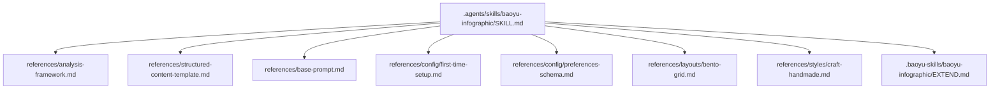
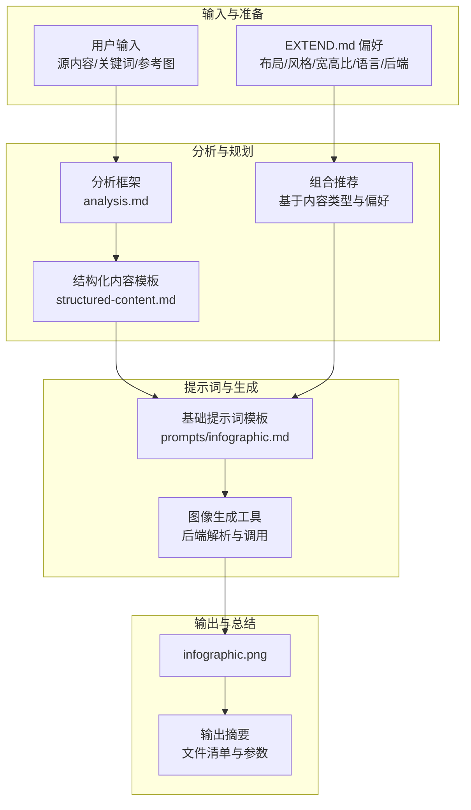
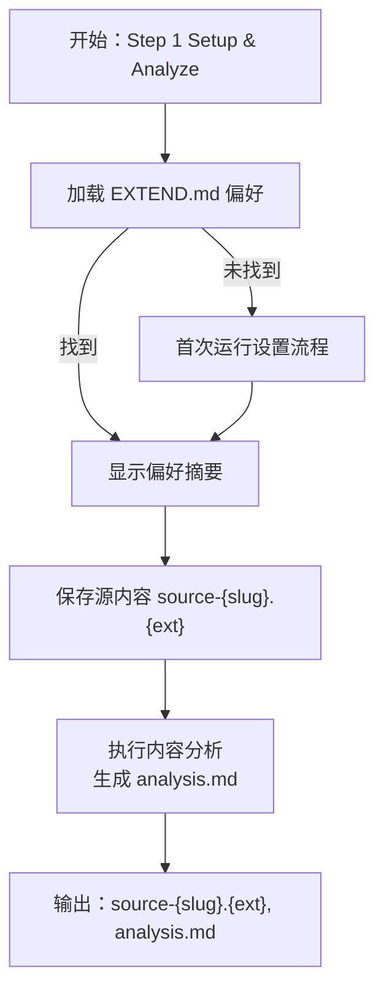
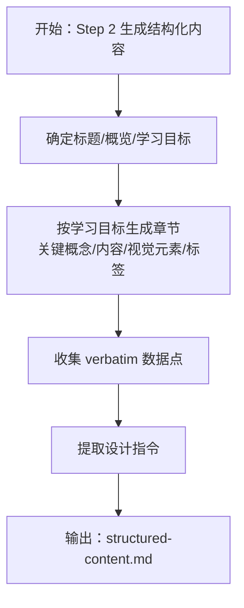
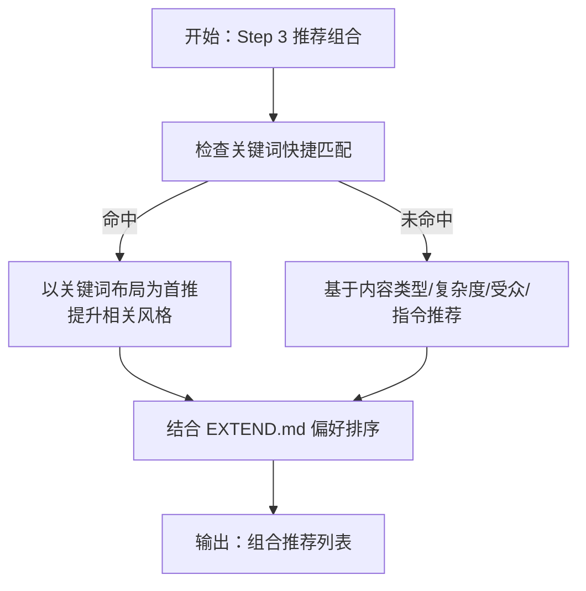
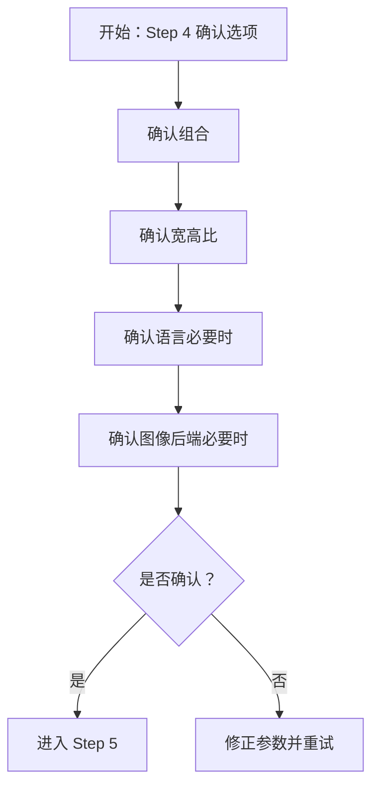
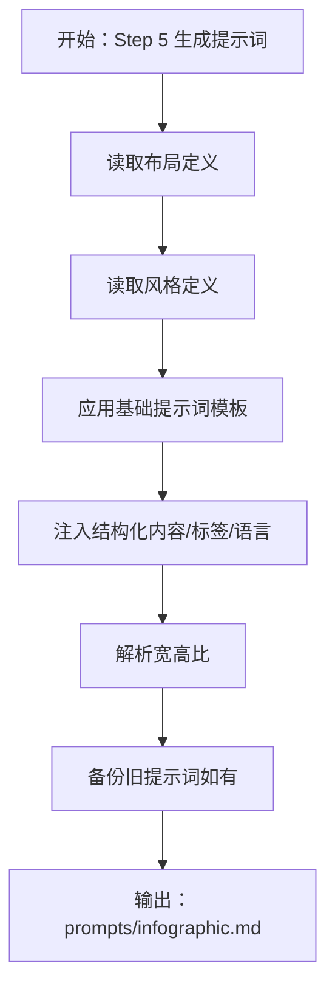
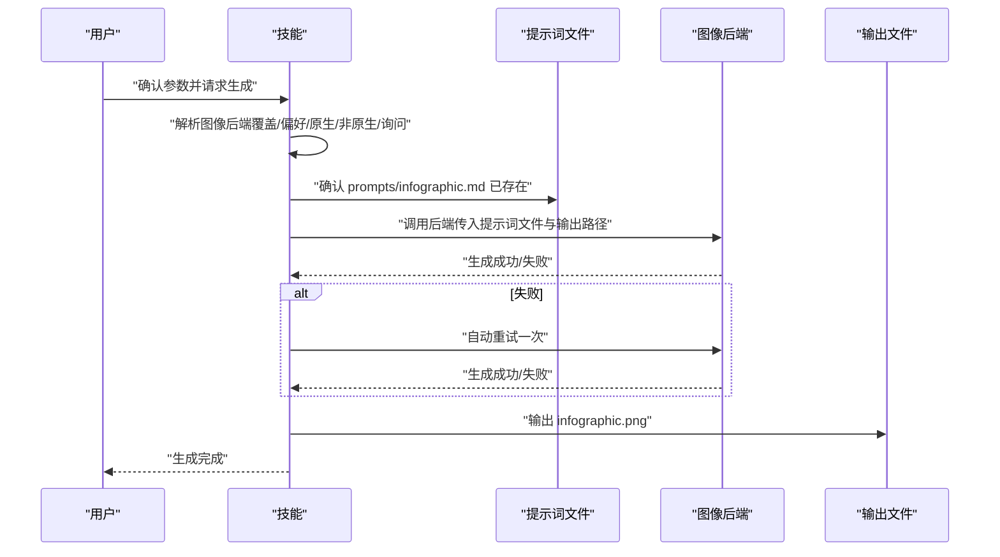
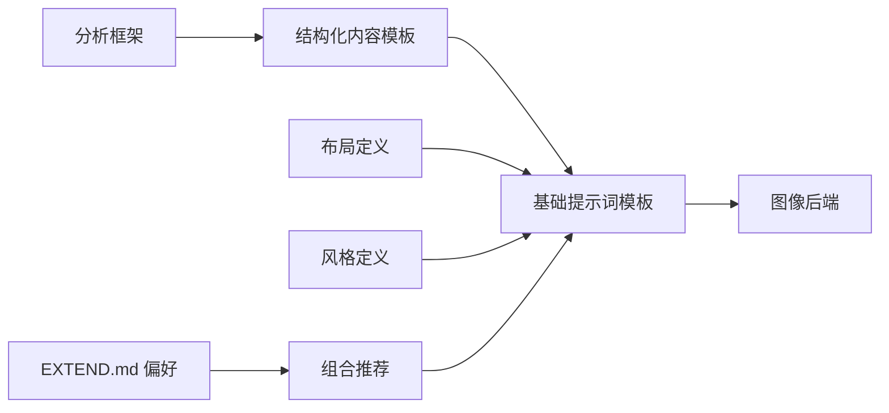

# 信息图表生成工作流程

<cite>
**本文引用的文件**
- [.agents/skills/baoyu-infographic/SKILL.md](file://.agents/skills/baoyu-infographic/SKILL.md)
- [.agents/skills/baoyu-infographic/references/analysis-framework.md](file://.agents/skills/baoyu-infographic/references/analysis-framework.md)
- [.agents/skills/baoyu-infographic/references/structured-content-template.md](file://.agents/skills/baoyu-infographic/references/structured-content-template.md)
- [.agents/skills/baoyu-infographic/references/base-prompt.md](file://.agents/skills/baoyu-infographic/references/base-prompt.md)
- [.agents/skills/baoyu-infographic/references/config/first-time-setup.md](file://.agents/skills/baoyu-infographic/references/config/first-time-setup.md)
- [.agents/skills/baoyu-infographic/references/config/preferences-schema.md](file://.agents/skills/baoyu-infographic/references/config/preferences-schema.md)
- [.agents/skills/baoyu-infographic/references/layouts/bento-grid.md](file://.agents/skills/baoyu-infographic/references/layouts/bento-grid.md)
- [.agents/skills/baoyu-infographic/references/styles/craft-handmade.md](file://.agents/skills/baoyu-infographic/references/styles/craft-handmade.md)
- [.baoyu-skills/baoyu-infographic/EXTEND.md](file://.baoyu-skills/baoyu-infographic/EXTEND.md)
</cite>

## 目录
1. [简介](#简介)
2. [项目结构](#项目结构)
3. [核心组件](#核心组件)
4. [架构总览](#架构总览)
5. [详细组件分析](#详细组件分析)
6. [依赖关系分析](#依赖关系分析)
7. [性能考量](#性能考量)
8. [故障排除指南](#故障排除指南)
9. [结论](#结论)
10. [附录](#附录)

## 简介
本技术文档面向“信息图表生成工作流程”，系统性阐述从原始内容到最终信息图表的完整转化过程。该流程由七个步骤构成：Step 1: Setup & Analyze（设置与分析）、Step 2: Generate Structured Content（生成结构化内容）、Step 3: Recommend Combinations（推荐组合）、Step 4: Confirm Options（确认选项）、Step 5: Generate Prompt（生成提示词）、Step 6: Generate Image（生成图像）、Step 7: Output Summary（输出摘要）。文档将逐项说明每个步骤的操作、输入输出、决策逻辑与最佳实践，并解释分析框架、结构化内容模板与基础提示词的作用机制。同时提供配置管理、偏好设置与故障排除建议，帮助用户高效、可重复地产出高质量信息图表。

## 项目结构
信息图表生成能力由 baoyu-infographic 技能提供，其核心参考与实现分布在以下位置：
- 技能主文件：.agents/skills/baoyu-infographic/SKILL.md
- 分析框架：references/analysis-framework.md
- 结构化内容模板：references/structured-content-template.md
- 基础提示词模板：references/base-prompt.md
- 首次运行偏好设置：references/config/first-time-setup.md
- 偏好配置模式：references/config/preferences-schema.md
- 布局定义样例：references/layouts/bento-grid.md
- 风格定义样例：references/styles/craft-handmade.md
- 用户偏好文件：.baoyu-skills/baoyu-infographic/EXTEND.md

**图示来源**
- [.agents/skills/baoyu-infographic/SKILL.md:203-307](file://.agents/skills/baoyu-infographic/SKILL.md#L203-L307)

**章节来源**
- [.agents/skills/baoyu-infographic/SKILL.md:184-196](file://.agents/skills/baoyu-infographic/SKILL.md#L184-L196)

## 核心组件
- 分析框架：指导如何对源内容进行深度分析，明确学习目标、受众、复杂度与可视机会，确保数据完整性与结构化输出。
- 结构化内容模板：将分析结果转化为面向视觉设计的结构化内容，包含标题、概览、学习目标、分节内容、数据点与设计指令等。
- 基础提示词模板：统一图像生成的提示词骨架，包含图像规格、核心原则、文本要求、布局与风格指南以及内容注入位点。
- 偏好设置与模式：通过 EXTEND.md 统一管理布局、风格、宽高比、语言与图像后端偏好；首次运行引导完成基础配置。
- 布局与风格库：提供 21 种布局与 22 种风格的定义与搭配建议，支持自动选择与人工确认相结合的推荐策略。

**章节来源**
- [.agents/skills/baoyu-infographic/references/analysis-framework.md:1-183](file://.agents/skills/baoyu-infographic/references/analysis-framework.md#L1-L183)
- [.agents/skills/baoyu-infographic/references/structured-content-template.md:1-245](file://.agents/skills/baoyu-infographic/references/structured-content-template.md#L1-L245)
- [.agents/skills/baoyu-infographic/references/base-prompt.md:1-44](file://.agents/skills/baoyu-infographic/references/base-prompt.md#L1-L44)
- [.agents/skills/baoyu-infographic/references/config/first-time-setup.md:1-154](file://.agents/skills/baoyu-infographic/references/config/first-time-setup.md#L1-L154)
- [.agents/skills/baoyu-infographic/references/config/preferences-schema.md:1-127](file://.agents/skills/baoyu-infographic/references/config/preferences-schema.md#L1-L127)

## 架构总览
下图展示了信息图表生成的端到端架构与关键交互：

**图示来源**
- [.agents/skills/baoyu-infographic/SKILL.md:203-307](file://.agents/skills/baoyu-infographic/SKILL.md#L203-L307)

## 详细组件分析

### 步骤 1: Setup & Analyze（设置与分析）
- 目标：加载用户偏好并完成源内容分析，生成 analysis.md。
- 关键动作
  - 加载偏好：优先级读取项目级、XDG、用户级 EXTEND.md，显示简要摘要；若缺失则引导首次运行设置。
  - 源内容保存：接收文件路径或粘贴内容，写入 source-{slug}.{ext}，存在时自动备份。
  - 内容分析：识别主题、数据类型、复杂度、受众、语种与设计指令，形成结构化分析报告。
  - 输出：analysis.md（含元信息、学习目标、受众、内容类型分析、关键数据点、布局×风格信号与推荐组合）。
- 输入
  - 用户输入：源内容（文件路径或文本）、关键词、参考图、语言偏好。
  - 偏好：EXTEND.md 中的 preferred_layout、preferred_style、preferred_aspect、language、preferred_image_backend。
- 输出
  - source-{slug}.{ext}
  - analysis.md
- 最佳实践
  - 在分析前先完成首次运行设置，确保偏好生效。
  - 保持源内容的完整性与准确性，避免摘要或改写。
  - 明确设计指令（如配色、风格倾向），以便后续推荐更贴合需求。

**图示来源**
- [.agents/skills/baoyu-infographic/SKILL.md:205-237](file://.agents/skills/baoyu-infographic/SKILL.md#L205-L237)
- [.agents/skills/baoyu-infographic/references/config/first-time-setup.md:19-37](file://.agents/skills/baoyu-infographic/references/config/first-time-setup.md#L19-L37)

**章节来源**
- [.agents/skills/baoyu-infographic/SKILL.md:205-237](file://.agents/skills/baoyu-infographic/SKILL.md#L205-L237)
- [.agents/skills/baoyu-infographic/references/analysis-framework.md:115-168](file://.agents/skills/baoyu-infographic/references/analysis-framework.md#L115-L168)
- [.agents/skills/baoyu-infographic/references/config/first-time-setup.md:10-17](file://.agents/skills/baoyu-infographic/references/config/first-time-setup.md#L10-L17)

### 步骤 2: Generate Structured Content（生成结构化内容）
- 目标：将 analysis.md 的分析结果转化为面向视觉设计的结构化内容，生成 structured-content.md。
- 关键动作
  - 依据分析结果确定标题、概览与学习目标。
  - 按学习目标拆分章节，每节包含：关键概念、内容（verbatim）、视觉元素描述、文本标签。
  - 收集 verbatim 数据点（统计、引述、术语）。
  - 提取用户设计指令（风格、布局、其他要求）。
- 输入
  - analysis.md
  - 用户设计指令（来自分析阶段提取）
- 输出
  - structured-content.md（遵循模板格式）
- 最佳实践
  - 严格 verbatim 复制，不添加新信息。
  - 明确每节的视觉元素与文本标签，便于后续提示词组装。

**图示来源**
- [.agents/skills/baoyu-infographic/SKILL.md:238-248](file://.agents/skills/baoyu-infographic/SKILL.md#L238-L248)
- [.agents/skills/baoyu-infographic/references/structured-content-template.md:46-138](file://.agents/skills/baoyu-infographic/references/structured-content-template.md#L46-L138)

**章节来源**
- [.agents/skills/baoyu-infographic/SKILL.md:238-248](file://.agents/skills/baoyu-infographic/SKILL.md#L238-L248)
- [.agents/skills/baoyu-infographic/references/structured-content-template.md:13-45](file://.agents/skills/baoyu-infographic/references/structured-content-template.md#L13-L45)

### 步骤 3: Recommend Combinations（推荐组合）
- 目标：基于内容类型、风格、受众与用户指令，推荐 3–5 组布局×风格组合。
- 关键动作
  - 关键词快捷匹配：若用户输入命中关键词表，则以关键词映射的布局作为首要推荐，并提升相关风格至前列。
  - 否则：根据分析结果（内容类型、复杂度、受众、设计指令）综合推荐。
  - 可选：结合 EXTEND.md 中的 preferred_layout 与 preferred_style 作为首选或高优先级候选项。
- 输入
  - analysis.md
  - 用户输入（关键词/设计指令）
  - EXTEND.md 偏好
- 输出
  - 推荐组合列表（含理由）
- 最佳实践
  - 若内容类型明确，优先采用“内容类型→布局”的推荐矩阵。
  - 当用户有明确风格偏好时，将其置于推荐前列但保留多样性。

**图示来源**
- [.agents/skills/baoyu-infographic/SKILL.md:250-259](file://.agents/skills/baoyu-infographic/SKILL.md#L250-L259)
- [.agents/skills/baoyu-infographic/SKILL.md:175-183](file://.agents/skills/baoyu-infographic/SKILL.md#L175-L183)

**章节来源**
- [.agents/skills/baoyu-infographic/SKILL.md:150-173](file://.agents/skills/baoyu-infographic/SKILL.md#L150-L173)
- [.agents/skills/baoyu-infographic/SKILL.md:250-259](file://.agents/skills/baoyu-infographic/SKILL.md#L250-L259)

### 步骤 4: Confirm Options（确认选项）
- 目标：强制确认生成参数，防止误触发。
- 关键动作
  - 必须确认的参数：组合（布局×风格）、宽高比（命名预设或自定义 W:H）、语言（当源语言≠用户语言时）、图像后端（当需要选择时）。
  - 仅当用户显式同意跳过确认（例如传入 --no-confirm 或等价表达）时才跳过。
  - 若跳过确认，需在生成前向用户说明所假设的组合/宽高比/语言/后端。
- 输入
  - 推荐组合、EXTEND.md 偏好、用户输入
- 输出
  - 用户确认后的最终参数
- 最佳实践
  - 默认开启确认，确保每次生成都经过审慎核对。
  - 对于批量任务，可在请求中显式传入 --no-confirm 以跳过确认。

**图示来源**
- [.agents/skills/baoyu-infographic/SKILL.md:260-272](file://.agents/skills/baoyu-infographic/SKILL.md#L260-L272)
- [.agents/skills/baoyu-infographic/SKILL.md:73-81](file://.agents/skills/baoyu-infographic/SKILL.md#L73-L81)

**章节来源**
- [.agents/skills/baoyu-infographic/SKILL.md:73-81](file://.agents/skills/baoyu-infographic/SKILL.md#L73-L81)
- [.agents/skills/baoyu-infographic/SKILL.md:260-272](file://.agents/skills/baoyu-infographic/SKILL.md#L260-L272)

### 步骤 5: Generate Prompt（生成提示词）
- 目标：将布局定义、风格定义、基础模板与结构化内容整合为最终提示词文件 prompts/infographic.md。
- 关键动作
  - 读取布局定义（如 bento-grid.md）与风格定义（如 craft-handmade.md）。
  - 应用基础提示词模板（base-prompt.md），填充占位符（布局、风格、宽高比、语言、布局/风格指南、内容、文本标签）。
  - 宽高比解析：命名预设（landscape/portrait/square）→ 比例字符串；自定义 W:H → 直接使用。
  - 备份规则：若已存在 prompts/infographic.md，先备份再写入。
- 输入
  - 结构化内容（structured-content.md）
  - 选定布局与风格
  - 宽高比与语言
- 输出
  - prompts/infographic.md
- 最佳实践
  - 保证所有文本标签与内容均符合选定语言。
  - 在提示词中明确风格一致性与布局结构要求。

**图示来源**
- [.agents/skills/baoyu-infographic/SKILL.md:273-287](file://.agents/skills/baoyu-infographic/SKILL.md#L273-L287)
- [.agents/skills/baoyu-infographic/references/base-prompt.md:1-44](file://.agents/skills/baoyu-infographic/references/base-prompt.md#L1-L44)
- [.agents/skills/baoyu-infographic/references/layouts/bento-grid.md:1-42](file://.agents/skills/baoyu-infographic/references/layouts/bento-grid.md#L1-L42)
- [.agents/skills/baoyu-infographic/references/styles/craft-handmade.md:1-45](file://.agents/skills/baoyu-infographic/references/styles/craft-handmade.md#L1-L45)

**章节来源**
- [.agents/skills/baoyu-infographic/SKILL.md:273-287](file://.agents/skills/baoyu-infographic/SKILL.md#L273-L287)
- [.agents/skills/baoyu-infographic/references/base-prompt.md:1-44](file://.agents/skills/baoyu-infographic/references/base-prompt.md#L1-L44)

### 步骤 6: Generate Image（生成图像）
- 目标：调用图像后端生成最终信息图表。
- 关键动作
  - 后端解析：优先使用当前请求覆盖、EXTEND.md 偏好、运行时原生工具、单个可用非原生工具，否则询问用户。
  - 生成前检查：若目标文件已存在，先备份。
  - 调用后端：传入提示词文件与输出路径；失败时自动重试一次。
- 输入
  - prompts/infographic.md
  - 选定后端
- 输出
  - infographic.png
- 最佳实践
  - 生成前务必确保提示词文件已持久化，以便复现与切换后端。
  - 如无原生工具可用，建议固定一个稳定的非原生后端（如 baoyu-imagine）。

**图示来源**
- [.agents/skills/baoyu-infographic/SKILL.md:288-296](file://.agents/skills/baoyu-infographic/SKILL.md#L288-L296)

**章节来源**
- [.agents/skills/baoyu-infographic/SKILL.md:24-41](file://.agents/skills/baoyu-infographic/SKILL.md#L24-L41)
- [.agents/skills/baoyu-infographic/SKILL.md:288-296](file://.agents/skills/baoyu-infographic/SKILL.md#L288-L296)

### 步骤 7: Output Summary（输出摘要）
- 目标：汇总本次生成的关键信息，便于审计与复现。
- 内容
  - 主题、布局、风格、宽高比、语言、图像后端、输出路径与创建的文件清单。
- 最佳实践
  - 将输出摘要用于归档与版本控制，便于后续修改与再生成。

**章节来源**
- [.agents/skills/baoyu-infographic/SKILL.md:297-300](file://.agents/skills/baoyu-infographic/SKILL.md#L297-L300)

## 依赖关系分析
- 组件耦合
  - 分析框架与结构化内容模板强关联：前者决定内容组织，后者驱动视觉设计。
  - 基础提示词模板与布局/风格定义解耦：通过占位符注入，便于灵活组合。
  - 偏好设置影响推荐与默认值，但不绕过确认环节。
- 外部依赖
  - 图像后端：支持运行时原生工具与多种非原生后端（如 baoyu-imagine），具备自动选择与回退策略。
- 循环依赖
  - 无循环依赖，流程单向推进。

**图示来源**
- [.agents/skills/baoyu-infographic/SKILL.md:203-307](file://.agents/skills/baoyu-infographic/SKILL.md#L203-L307)

**章节来源**
- [.agents/skills/baoyu-infographic/SKILL.md:24-41](file://.agents/skills/baoyu-infographic/SKILL.md#L24-L41)

## 性能考量
- 生成效率
  - 优先使用运行时原生图像工具可显著降低延迟与资源占用。
  - 批量生成时，建议固定后端并复用提示词文件，减少重复计算。
- 存储与备份
  - 自动备份策略（analysis/structured-content/prompts/infographic）有助于快速回滚与审计。
- 文本处理
  - verbatim 复制与 strip 秘密信息可避免额外清洗开销，提高稳定性。

## 故障排除指南
- 无法生成图像
  - 检查后端可用性与权限；若无原生工具，确认 EXTEND.md 中 pinned 的后端是否安装且可访问。
  - 查看提示词文件是否存在且完整；必要时重新生成 Step 5。
  - 若失败，系统会自动重试一次；如仍失败，请调整布局/风格或语言后再试。
- 偏好未生效
  - 确认 EXTEND.md 的读取优先级与路径正确；若多处存在，以“优先级最高”为准。
  - 首次运行未完成时，会阻塞后续步骤；请先完成首次设置。
- 输出不符合预期
  - 回到 Step 3 重新确认组合与风格；或在 Step 4 中调整宽高比与语言。
  - 检查结构化内容是否包含 verbatim 数据点与明确的视觉元素描述。

**章节来源**
- [.agents/skills/baoyu-infographic/SKILL.md:24-41](file://.agents/skills/baoyu-infographic/SKILL.md#L24-L41)
- [.agents/skills/baoyu-infographic/SKILL.md:288-296](file://.agents/skills/baoyu-infographic/SKILL.md#L288-L296)
- [.agents/skills/baoyu-infographic/references/config/first-time-setup.md:10-17](file://.agents/skills/baoyu-infographic/references/config/first-time-setup.md#L10-L17)

## 结论
本工作流程以“分析—结构—推荐—确认—提示—生成—总结”为主线，通过标准化的分析框架、结构化内容模板与基础提示词模板，确保从源内容到最终信息图表的可重复、可审计与高质量交付。EXTEND.md 偏好与首次运行设置为个性化体验提供基础，而严格的确认策略与后端解析逻辑保障了生成的可控性与鲁棒性。建议在实践中结合业务场景优化关键词快捷匹配与风格偏好，持续完善提示词与参考图策略，以获得更稳定的结果。

## 附录
- 使用示例（从原始内容到最终信息图表）
  - 准备阶段：确认 EXTEND.md 已配置；准备好源内容（文件路径或粘贴文本）。
  - Step 1：运行分析，生成 analysis.md。
  - Step 2：生成 structured-content.md。
  - Step 3：根据分析结果与偏好，得到组合推荐。
  - Step 4：确认组合、宽高比、语言与后端。
  - Step 5：生成 prompts/infographic.md。
  - Step 6：调用图像后端生成 infographic.png。
  - Step 7：查看输出摘要与文件清单。
- 配置管理与偏好设置
  - 偏好文件：.baoyu-skills/baoyu-infographic/EXTEND.md
  - 首次运行设置：references/config/first-time-setup.md
  - 偏好模式：references/config/preferences-schema.md
  - 常见编辑：preferred_image_backend、preferred_layout、preferred_style、preferred_aspect、language

**章节来源**
- [.baoyu-skills/baoyu-infographic/EXTEND.md:1-10](file://.baoyu-skills/baoyu-infographic/EXTEND.md#L1-L10)
- [.agents/skills/baoyu-infographic/references/config/first-time-setup.md:128-154](file://.agents/skills/baoyu-infographic/references/config/first-time-setup.md#L128-L154)
- [.agents/skills/baoyu-infographic/references/config/preferences-schema.md:1-127](file://.agents/skills/baoyu-infographic/references/config/preferences-schema.md#L1-L127)