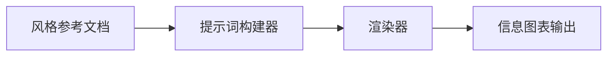

# 信息图表视觉风格

<cite>
**本文引用的文件**
- [craft-handmade.md](file://.agents/skills/baoyu-infographic/references/styles/craft-handmade.md)
- [claymation.md](file://.agents/skills/baoyu-infographic/references/styles/claymation.md)
- [kawaii.md](file://.agents/skills/baoyu-infographic/references/styles/kawaii.md)
- [storybook-watercolor.md](file://.agents/skills/baoyu-infographic/references/styles/storybook-watercolor.md)
- [chalkboard.md](file://.agents/skills/baoyu-infographic/references/styles/chalkboard.md)
- [cyberpunk-neon.md](file://.agents/skills/baoyu-infographic/references/styles/cyberpunk-neon.md)
- [bold-graphic.md](file://.agents/skills/baoyu-infographic/references/styles/bold-graphic.md)
- [aged-academia.md](file://.agents/skills/baoyu-infographic/references/styles/aged-academia.md)
- [corporate-memphis.md](file://.agents/skills/baoyu-infographic/references/styles/corporate-memphis.md)
- [technical-schematic.md](file://.agents/skills/baoyu-infographic/references/styles/technical-schematic.md)
- [origami.md](file://.agents/skills/baoyu-infographic/references/styles/origami.md)
- [pixel-art.md](file://.agents/skills/baoyu-infographic/references/styles/pixel-art.md)
- [ui-wireframe.md](file://.agents/skills/baoyu-infographic/references/styles/ui-wireframe.md)
- [subway-map.md](file://.agents/skills/baoyu-infographic/references/styles/subway-map.md)
- [ikea-manual.md](file://.agents/skills/baoyu-infographic/references/styles/ikea-manual.md)
- [knolling.md](file://.agents/skills/baoyu-infographic/references/styles/knolling.md)
- [lego-brick.md](file://.agents/skills/baoyu-infographic/references/styles/lego-brick.md)
- [pop-laboratory.md](file://.agents/skills/baoyu-infographic/references/styles/pop-laboratory.md)
- [morandi-journal.md](file://.agents/skills/baoyu-infographic/references/styles/morandi-journal.md)
- [retro-pop-grid.md](file://.agents/skills/baoyu-infographic/references/styles/retro-pop-grid.md)
- [retro-popup-pop.md](file://.agents/skills/baoyu-infographic/references/styles/retro-popup-pop.md)
- [hand-drawn-edu.md](file://.agents/skills/baoyu-infographic/references/styles/hand-drawn-edu.md)
</cite>

## 目录
1. [简介](#简介)
2. [项目结构](#项目结构)
3. [核心组件](#核心组件)
4. [架构总览](#架构总览)
5. [详细组件分析](#详细组件分析)
6. [依赖关系分析](#依赖关系分析)
7. [性能考量](#性能考量)
8. [故障排查指南](#故障排查指南)
9. [结论](#结论)
10. [附录](#附录)

## 简介
本技术文档系统梳理并解读信息图表视觉风格模板库中的22种风格：craft-handmade（手工制作）、claymation（黏土动画）、kawaii（可爱风格）、storybook-watercolor（绘本水彩）、chalkboard（黑板风格）、cyberpunk-neon（赛博朋克霓虹）、bold-graphic（粗犷图形）、aged-academia（复古学术）、corporate-memphis（企业孟菲斯）、technical-schematic（技术制图）、origami（折纸艺术）、pixel-art（像素艺术）、ui-wireframe（界面线框）、subway-map（地铁地图）、ikea-manual（宜家手册）、knolling（整理摆放）、lego-brick（乐高积木）、pop-laboratory（流行实验室）、morandi-journal（莫兰迪日记）、retro-pop-grid（复古流行网格）、hand-drawn-edu（手绘教育）与retro-popup-pop（复古弹出流行）。文档从视觉特征、适用场景、设计要点、风格规则与排版建议等维度进行深入解析，并提供风格选择指南与组合推荐，帮助用户基于内容性质与受众定位做出最优视觉决策。

## 项目结构
本仓库中与信息图表风格直接相关的核心位置位于技能参考文档目录下，每个风格以独立 Markdown 文件呈现，包含色彩方案、视觉元素、排版规范与最佳应用场景等内容。这些文件共同构成风格知识库，支撑生成式图像与信息图表的风格化输出。

```mermaid
graph TB
root[".agents/skills/baoyu-infographic/references/styles"] --> craft["craft-handmade.md"]
root --> clay["claymation.md"]
root --> kawaii["kawaii.md"]
root --> storybook["storybook-watercolor.md"]
root --> chalk["chalkboard.md"]
root --> cyber["cyberpunk-neon.md"]
root --> bold["bold-graphic.md"]
root --> aged["aged-academia.md"]
root --> memphis["corporate-memphis.md"]
root --> tech["technical-schematic.md"]
root --> orig["origami.md"]
root --> pixel["pixel-art.md"]
root --> ui["ui-wireframe.md"]
root --> subway["subway-map.md"]
root --> ikea["ikea-manual.md"]
root --> knoll["knolling.md"]
root --> lego["lego-brick.md"]
root --> pop["pop-laboratory.md"]
root --> morandi["morandi-journal.md"]
root --> retro_grid["retro-pop-grid.md"]
root --> retro_popup["retro-popup-pop.md"]
root --> edu["hand-drawn-edu.md"]
```

**图表来源**
- [.agents/skills/baoyu-infographic/references/styles](file://.agents/skills/baoyu-infographic/references/styles)

**章节来源**
- [.agents/skills/baoyu-infographic/references/styles](file://.agents/skills/baoyu-infographic/references/styles)

## 核心组件
- 风格定义模块：每个风格文件包含“色彩方案”“视觉元素”“排版规范”“风格规则”“最佳应用”等结构化条目，形成可检索、可复用的风格知识单元。
- 设计约束与一致性：多数风格强调“禁止项”与“必须项”，确保生成内容在风格上保持一致与可识别。
- 变体与子风格：部分风格提供变体说明，用于在统一风格框架内实现差异化表达（如“手工制作”的手绘与剪贴变体；“粗犷图形”的漫画与波普变体；“技术制图”的蓝图与等轴测变体；“复古学术”的笔记本与标本变体）。

**章节来源**
- [craft-handmade.md:1-45](file://.agents/skills/baoyu-infographic/references/styles/craft-handmade.md#L1-L45)
- [bold-graphic.md:1-37](file://.agents/skills/baoyu-infographic/references/styles/bold-graphic.md#L1-L37)
- [technical-schematic.md:1-37](file://.agents/skills/baoyu-infographic/references/styles/technical-schematic.md#L1-L37)
- [aged-academia.md:1-37](file://.agents/skills/baoyu-infographic/references/styles/aged-academia.md#L1-L37)

## 架构总览
风格体系由“风格层”“规则层”“表现层”三部分组成，协同驱动信息图表的风格化生成与呈现。

```mermaid
graph TB
subgraph "风格层"
S1["手工制作<br/>craft-handmade"]
S2["黏土动画<br/>claymation"]
S3["可爱风格<br/>kawaii"]
S4["绘本水彩<br/>storybook-watercolor"]
S5["黑板风格<br/>chalkboard"]
S6["赛博朋克霓虹<br/>cyberpunk-neon"]
S7["粗犷图形<br/>bold-graphic"]
S8["复古学术<br/>aged-academia"]
S9["企业孟菲斯<br/>corporate-memphis"]
S10["技术制图<br/>technical-schematic"]
S11["折纸艺术<br/>origami"]
S12["像素艺术<br/>pixel-art"]
S13["界面线框<br/>ui-wireframe"]
S14["地铁地图<br/>subway-map"]
S15["宜家手册<br/>ikea-manual"]
S16["整理摆放<br/>knolling"]
S17["乐高积木<br/>lego-brick"]
S18["流行实验室<br/>pop-laboratory"]
S19["莫兰迪日记<br/>morandi-journal"]
S20["复古流行网格<br/>retro-pop-grid"]
S21["手绘教育<br/>hand-drawn-edu"]
S22["复古弹出流行<br/>retro-popup-pop"]
end
subgraph "规则层"
R1["色彩方案"]
R2["视觉元素"]
R3["排版规范"]
R4["风格规则"]
R5["最佳应用"]
end
subgraph "表现层"
P1["生成器输入提示"]
P2["图像渲染"]
P3["布局与标注"]
end
S1 --> R1
S1 --> R2
S1 --> R3
S1 --> R4
S1 --> R5
S2 --> R1
S2 --> R2
S2 --> R3
S2 --> R4
S2 --> R5
S3 --> R1
S3 --> R2
S3 --> R3
S3 --> R4
S3 --> R5
S4 --> R1
S4 --> R2
S4 --> R3
S4 --> R4
S4 --> R5
S5 --> R1
S5 --> R2
S5 --> R3
S5 --> R4
S5 --> R5
S6 --> R1
S6 --> R2
S6 --> R3
S6 --> R4
S6 --> R5
S7 --> R1
S7 --> R2
S7 --> R3
S7 --> R4
S7 --> R5
S8 --> R1
S8 --> R2
S8 --> R3
S8 --> R4
S8 --> R5
S9 --> R1
S9 --> R2
S9 --> R3
S9 --> R4
S9 --> R5
S10 --> R1
S10 --> R2
S10 --> R3
S10 --> R4
S10 --> R5
S11 --> R1
S11 --> R2
S11 --> R3
S11 --> R4
S11 --> R5
S12 --> R1
S12 --> R2
S12 --> R3
S12 --> R4
S12 --> R5
S13 --> R1
S13 --> R2
S13 --> R3
S13 --> R4
S13 --> R5
S14 --> R1
S14 --> R2
S14 --> R3
S14 --> R4
S14 --> R5
S15 --> R1
S15 --> R2
S15 --> R3
S15 --> R4
S15 --> R5
S16 --> R1
S16 --> R2
S16 --> R3
S16 --> R4
S16 --> R5
S17 --> R1
S17 --> R2
S17 --> R3
S17 --> R4
S17 --> R5
S18 --> R1
S18 --> R2
S18 --> R3
S18 --> R4
S18 --> R5
S19 --> R1
S19 --> R2
S19 --> R3
S19 --> R4
S19 --> R5
S20 --> R1
S20 --> R2
S20 --> R3
S20 --> R4
S20 --> R5
S21 --> R1
S21 --> R2
S21 --> R3
S21 --> R4
S21 --> R5
S22 --> R1
S22 --> R2
S22 --> R3
S22 --> R4
S22 --> R5
R1 --> P1
R2 --> P1
R3 --> P1
R4 --> P1
R5 --> P1
P1 --> P2
P2 --> P3
```

**图表来源**
- [.agents/skills/baoyu-infographic/references/styles](file://.agents/skills/baoyu-infographic/references/styles)

## 详细组件分析

### 手工制作（craft-handmade）
- 视觉特征：手绘与纸质工艺美学，温暖自然的质感；强调不完美线条与有机形状。
- 色彩方案：暖色系主色、柔和饱和色与手工纸色调；背景常用米白或纹理纸；强调对比色高光。
- 视觉元素：手绘或剪纸质感；层次阴影与撕边纹理；简单卡通图标与角色化人物；留白与清晰构图；关键词突出。
- 排版规范：手写或休闲字体；清晰可读标签；关键词加大加粗；剪贴风字母（剪贴变体）。
- 风格规则：严格手绘风格，禁用真实照片或拟真元素；全图保持一致的笔触与线宽。
- 最佳应用：教育类、通用解释、友好型信息图、儿童内容、轻松的层级关系。

**章节来源**
- [craft-handmade.md:1-45](file://.agents/skills/baoyu-infographic/references/styles/craft-handmade.md#L1-L45)

### 黏土动画（claymation）
- 视觉特征：3D黏土人偶风格，定格动画魅力；圆润雕塑感与软阴影。
- 色彩方案：饱和但略哑光的黏土色；中性工作室背景；互补色高光与亮面。
- 视觉元素：所有对象具黏土/塑形质感；指纹与瑕疵；圆润雕塑形态；软阴影；定格摄影布景；微缩场景。
- 排版规范：挤出式黏土字体；立体圆润文字；俏皮且厚实；嵌入黏土场景。
- 最佳应用：俏皮解释、儿童内容、定格叙事、友好流程。

**章节来源**
- [claymation.md:1-30](file://.agents/skills/baoyu-infographic/references/styles/claymation.md#L1-L30)

### 可爱风格（kawaii）
- 视觉特征：日式可爱美学，大眼睛与马卡龙色系。
- 色彩方案：柔和粉（#FFB6C1）、薄荷（#98D8C8）、薰衣草（#E6E6FA）；背景浅粉或奶油；点缀亮色与星月。
- 视觉元素：闪亮大眼、圆润柔软形状、脸颊泛红、星点与爱心散落、Q版动物角色、Q版比例。
- 排版规范：圆润气泡字体；字母装饰；心中星月；柔和亲和。
- 最佳应用：可爱教程、儿童教育、生活方式、角色驱动解释。

**章节来源**
- [kawaii.md:1-30](file://.agents/skills/baoyu-infographic/references/styles/kawaii.md#L1-L30)

### 绘本水彩（storybook-watercolor）
- 视觉特征：柔和手绘水彩，充满奇想魅力。
- 色彩方案：水彩晕染的低饱和度蓝绿与大地色；水彩纸纹理；深色颜料点与飞溅效果。
- 视觉元素：可见笔触；柔和渐变与渗透；留白作为设计元素；水彩底上的精细线条；自然有机形状；梦幻氛围。
- 排版规范：优雅手写字体；水彩风格文字；流畅有机字形；与插画融合。
- 最佳应用：故事叙述、情感旅程、自然主题、儿童教育、艺术展示。

**章节来源**
- [storybook-watercolor.md:1-30](file://.agents/skills/baoyu-infographic/references/styles/storybook-watercolor.md#L1-L30)

### 黑板风格（chalkboard）
- 视觉特征：经典教室黑板背景，彩色粉笔绘制风格，怀旧教学感。
- 色彩方案：黑板黑（#1A1A1A）或深绿黑（#1C2B1C）；背景表层有细微划痕、粉尘与擦痕；多色粉笔高亮。
- 视觉元素：手绘粉笔插画，略带缺陷的草率线条；粉笔灰效果；课堂小贴图：星、箭头、下划线、圆圈、勾；数学公式与简单图解；擦痕与残留纹理；可选木质边框；简单人形与图标；手绘连接线。
- 排版规范：手绘粉笔字体，可见粉笔质感；基线略有偏差增加真实感；白色或亮色粉笔强调。
- 风格规则：必须保持真实粉笔质感；全程使用手绘风格；避免几何完美与数字光泽。
- 最佳应用：教学内容、教程、课堂主题、教学材料、工作坊、非正式学习、知识分享。

**章节来源**
- [chalkboard.md:1-62](file://.agents/skills/baoyu-infographic/references/styles/chalkboard.md#L1-L62)

### 赛博朋克霓虹（cyberpunk-neon）
- 视觉特征：暗色背景上的霓虹发光，未来感。
- 色彩方案：霓虹粉（#FF00FF）、青（#00FFFF）、电蓝；背景深黑（#0A0A0A）、深紫渐变；高光霓虹与金属反光。
- 视觉元素：发光轮廓；暗色氛围；数字故障；电路图案；全息元素；雨与倒影。
- 排版规范：发光霓虹文字；科技/数码字体；闪烁效果；描边发光字。
- 最佳应用：科技未来、游戏内容、数字文化、未来概念、夜晚美学。

**章节来源**
- [cyberpunk-neon.md:1-30](file://.agents/skills/baoyu-infographic/references/styles/cyberpunk-neon.md#L1-L30)

### 粗犷图形（bold-graphic）
- 视觉特征：高对比漫画风格，粗线与戏剧化画面。
- 色彩方案：红黄蓝黑原色；背景白、网点或强烈阴影；强调色与霓虹高光。
- 变体：漫画小说（动作线、排线、分镜）；波普艺术（网点、重复、高能量）。
- 视觉元素：粗黑线；高对比构图；网点图案；可选漫画框；动感线与音效；对话气泡与标题框。
- 排版规范：漫画书书写；强调字体；波普艺术POW/BANG效果；叙事性题注框。
- 最佳应用：抓人眼球的内容、戏剧化叙事、流行文化、营销、高能演示。

**章节来源**
- [bold-graphic.md:1-37](file://.agents/skills/baoyu-infographic/references/styles/bold-graphic.md#L1-L37)

### 复古学术（aged-academia）
- 视觉特征：历史科学插画，陈旧纸张美学。
- 色彩方案：棕褐色（#704214）、陈旧墨水、大地哑光；背景羊皮纸（#F4E4BC）、泛黄纸纹；褪色红标注、铁胆墨水斑点。
- 变体：笔记本（个人草图、发明笔记、边注）；标本（分类图、拉丁学名）。
- 视觉元素：陈旧纸纹叠加；细致交叉线与排线；科学插画精度；研究笔记与标注；标本板或素描风格；编号图元。
- 排版规范：手写草书或衬线字体；科学标注；小大写标签；斜体学名。
- 最佳应用：科学教育、生物学主题、历史解释、发明、自然记录。

**章节来源**
- [aged-academia.md:1-37](file://.agents/skills/baoyu-infographic/references/styles/aged-academia.md#L1-L37)

### 企业孟菲斯（corporate-memphis）
- 视觉特征：扁平矢量人物，鲜艳几何填充。
- 色彩方案：高饱和原色（紫、橙、绿、黄）；背景白或浅粉；强调渐变与几何图案。
- 视觉元素：扁平矢量；不成比例的人形；抽象体态；漂浮几何元素；无轮廓，纯色填充；植物与物体装饰。
- 排版规范：简洁无衬线；粗标题；专业但友好的字体；最少装饰。
- 最佳应用：商业演示、科技产品、营销物料、企业培训。

**章节来源**
- [corporate-memphis.md:1-30](file://.agents/skills/baoyu-infographic/references/styles/corporate-memphis.md#L1-L30)

### 技术制图（technical-schematic）
- 视觉特征：工程精度与几何整洁。
- 色彩方案：蓝（#2563EB）、蓝绿、灰、白线；背景深蓝（#1E3A5F）、白或浅灰网格；强调琥珀高光（#F59E0B）、青色标注。
- 变体：蓝图（白底蓝图、尺寸、网格）；等轴测（30°块体、整洁填充）。
- 视觉元素：几何精准；网格或等轴测角度；尺寸线与标注；技术符号与注释；干净矢量形状；一致笔画。
- 排版规范：工程字体或简洁无衬线；全大写标签；测量标注；等轴测浮动标签。
- 最佳应用：技术架构、系统图、工程规格、产品拆解、数据可视化。

**章节来源**
- [technical-schematic.md:1-37](file://.agents/skills/baoyu-infographic/references/styles/technical-schematic.md#L1-L37)

### 折纸艺术（origami）
- 视觉特征：折叠纸张的几何精确。
- 色彩方案：固体折纸色（红、蓝、绿、金）；背景白或浅灰；强调折痕高光与锐利阴影。
- 视觉元素：几何折叠形状；可见折痕线；投射阴影显示深度；纸纹；角度分明的多面体；低多边形美学。
- 排版规范：简洁几何字体；角度字形；折纸文本效果；极简精确标签。
- 最佳应用：几何概念、转换主题、日本风格、抽象表达。

**章节来源**
- [origami.md:1-30](file://.agents/skills/baoyu-infographic/references/styles/origami.md#L1-L30)

### 像素艺术（pixel-art）
- 视觉特征：复古8位游戏美学。
- 色彩方案：有限调色板（NES/SNES色）；背景黑或深蓝；可选扫描线；强调像素高光与CRT辉光。
- 视觉元素：可见像素网格；每精灵有限色彩；8位或16位风格；复古游戏UI元素；像素级边缘；棋盘式渐变。
- 排版规范：像素字体；方块字形；游戏UI风格文本；分数/状态栏风格。
- 最佳应用：游戏主题、怀旧内容、开发者受众、复古科技主题。

**章节来源**
- [pixel-art.md:1-30](file://.agents/skills/baoyu-infographic/references/styles/pixel-art.md#L1-L30)

### 界面线框（ui-wireframe）
- 视觉特征：灰阶界面原型风格。
- 色彩方案：灰阶（浅#E5E5E5、中#9CA3AF、深#374151）；背景白或浅灰；强调蓝色交互（#3B82F6）、红色强调。
- 视觉元素：线框盒子与占位符；X代表图片占位；简单线图标；网格布局；标注说明；红线条规格。
- 排版规范：系统字体；占位“Lorem ipsum”；UI标签风格；全无衬线。
- 最佳应用：产品设计、UI解释、应用概念、用户流程图。

**章节来源**
- [ui-wireframe.md:1-30](file://.agents/skills/baoyu-infographic/references/styles/ui-wireframe.md#L1-L30)

### 地铁地图（subway-map）
- 视觉特征：交通图风格，彩色线路与站点。
- 色彩方案：线路色（红、蓝、绿、黄、橙）；背景白或浅灰；强调站点圆点与换乘标记。
- 视觉元素：彩色路线线；仅45°与90°角；站点圆形标记；换乘符号；地理简化；线宽层级。
- 排版规范：简洁无衬线；站点名称标签；线路编号/名称徽章；横向或倾斜文本。
- 最佳应用：旅程地图、流程图、网络图、路线解释。

**章节来源**
- [subway-map.md:1-30](file://.agents/skills/baoyu-infographic/references/styles/subway-map.md#L1-L30)

### 宜家手册（ikea-manual）
- 视觉特征：极简线稿装配说明风格。
- 色彩方案：黑线、极少填色；背景白或米色纸；强调红（警告）、蓝（高亮）。
- 视觉元素：简单线描；编号步骤序列；箭头指示；爆炸装配视图；无声沟通；比例小人示例。
- 排版规范：极简文字；步骤号突出；通用符号；必要时简单无衬线。
- 最佳应用：分步说明、装配指南、操作流程、通用沟通。

**章节来源**
- [ikea-manual.md:1-30](file://.agents/skills/baoyu-infographic/references/styles/ikea-manual.md#L1-L30)

### 整理摆放（knolling）
- 视觉特征：俯拍整齐平面布置。
- 色彩方案：物品天然色；背景纯色（黑、白或彩色表面）；强调阴影与微妙高光。
- 视觉元素：俯拍视角；90°角度排列；等距间距；整洁有序；对称与秩序；无重叠。
- 排版规范：简洁标签；置于物外；连接线指向物品；极简目录风格。
- 最佳应用：产品集合、工具清单、装备布局、有序概览。

**章节来源**
- [knolling.md:1-30](file://.agents/skills/baoyu-infographic/references/styles/knolling.md#L1-L30)

### 乐高积木（lego-brick）
- 视觉特征：积木颗粒的几何拼接与色彩。
- 色彩方案：乐高标准色；背景白或浅灰；强调颗粒高光与阴影。
- 视觉元素：方正颗粒；网格拼接；可见拼接线；颗粒高光；几何块体；低多边形。
- 排版规范：简洁几何字体；方正字形；颗粒文本效果；极简标签。
- 最佳应用：构建过程、空间关系、儿童主题、创意拼装。

**章节来源**
- [lego-brick.md](file://.agents/skills/baoyu-infographic/references/styles/lego-brick.md)

### 流行实验室（pop-laboratory）
- 视觉特征：流行文化的实验性视觉语言。
- 色彩方案：高饱和与对比；强调几何与渐变；背景可为白或深色。
- 视觉元素：几何与有机混合；实验性拼贴；高对比与动态构图；流行符号与图标。
- 排版规范：现代无衬线；醒目标题；标签简洁；强调视觉层级。
- 最佳应用：流行文化、创意展示、品牌传播、年轻受众。

**章节来源**
- [pop-laboratory.md](file://.agents/skills/baoyu-infographic/references/styles/pop-laboratory.md)

### 莫兰迪日记（morandi-journal）
- 视觉特征：莫兰迪色系的静谧与高级感。
- 色彩方案：低饱和中性色；背景白或浅灰；强调细腻过渡与微妙高光。
- 视觉元素：柔和过渡；极简几何；静物与日常；留白与节奏。
- 排版规范：简洁无衬线；正文易读；标题克制；标签极简。
- 最佳应用：生活记录、设计日志、慢节奏内容、静谧主题。

**章节来源**
- [morandi-journal.md](file://.agents/skills/baoyu-infographic/references/styles/morandi-journal.md)

### 复古流行网格（retro-pop-grid）
- 视觉特征：复古网格与流行元素结合。
- 色彩方案：复古亮色与中性；强调网格与对比。
- 视觉元素：网格布局；复古图标与几何；高饱和强调；分块信息。
- 排版规范：现代与复古结合的无衬线；标题醒目；标签清晰。
- 最佳应用：复古主题、流行文化、信息矩阵、品牌展示。

**章节来源**
- [retro-pop-grid.md](file://.agents/skills/baoyu-infographic/references/styles/retro-pop-grid.md)

### 复古弹出流行（retro-popup-pop）
- 视觉特征：复古弹出与流行风格的结合。
- 色彩方案：高对比与弹出感配色；强调层次与立体。
- 视觉元素：弹出式构图；几何与有机结合；立体阴影；复古字体。
- 排版规范：复古与现代结合的字体；标题突出；标签清晰。
- 最佳应用：复古主题、弹出式信息、品牌展示、年轻受众。

**章节来源**
- [retro-popup-pop.md](file://.agents/skills/baoyu-infographic/references/styles/retro-popup-pop.md)

### 手绘教育（hand-drawn-edu）
- 视觉特征：手绘风格的教育类信息图。
- 色彩方案：教育友好色；背景白或浅灰；强调清晰与可读。
- 视觉元素：手绘插画；清晰图标；分层信息；教学友好。
- 排版规范：清晰无衬线；标题与正文层次；标签简洁。
- 最佳应用：教学内容、学习指南、知识讲解、课堂素材。

**章节来源**
- [hand-drawn-edu.md](file://.agents/skills/baoyu-infographic/references/styles/hand-drawn-edu.md)

## 依赖关系分析
- 风格文件之间无直接代码依赖，均为独立参考文档，通过统一的结构化字段（色彩、元素、排版、规则、最佳应用）实现风格知识的标准化与可检索。
- 生成器与渲染器通过读取风格文件中的字段构建提示词与布局策略，从而驱动图像生成与排版输出。

**图表来源**
- [.agents/skills/baoyu-infographic/references/styles](file://.agents/skills/baoyu-infographic/references/styles)

## 性能考量
- 风格文件体量较小，解析与加载开销可忽略。
- 在批量生成场景中，建议缓存风格字段映射，减少重复解析成本。
- 对于高复杂度风格（如技术制图、折纸艺术），适当控制细节密度与阴影数量可提升渲染效率。

## 故障排查指南
- 风格不一致：检查是否遵循“风格规则”中的“必须项”与“禁止项”，确保全图风格统一。
- 色彩偏差：核对“色彩方案”中的主色、辅色与背景色，避免超出范围的颜色使用。
- 元素违和：对照“视觉元素”清单，确认未引入与风格相悖的元素（如真实照片、完美几何、光泽效果等）。
- 字体不适配：按“排版规范”选用相应字体风格，避免与风格气质冲突。
- 应用场景不符：依据“最佳应用”选择合适风格，避免风格与内容目标错配导致理解困难。

**章节来源**
- [chalkboard.md:42-58](file://.agents/skills/baoyu-infographic/references/styles/chalkboard.md#L42-L58)
- [craft-handmade.md:29-34](file://.agents/skills/baoyu-infographic/references/styles/craft-handmade.md#L29-L34)

## 结论
本风格体系以结构化文档形式沉淀了22种信息图表视觉风格的设计语言与执行准则。通过明确的色彩、元素、排版与规则约束，能够稳定地指导生成式图像与信息图表的风格化创作。建议在实际应用中结合内容属性与受众偏好，优先选择与主题契合的风格，并在组合使用时保持风格边界与一致性，以获得最佳的传达效果。

## 附录
- 风格选择指南
  - 教育与儿童：手工制作、黑板风格、可爱风格、手绘教育。
  - 科技与工程：技术制图、界面线框、折纸艺术、乐高积木。
  - 文化与创意：黏土动画、流行实验室、莫兰迪日记、复古流行网格。
  - 商业与品牌：企业孟菲斯、赛博朋克霓虹、复古弹出流行。
  - 工具与流程：宜家手册、地铁地图、整理摆放。
  - 艺术与故事：绘本水彩、复古学术、像素艺术。
- 组合推荐
  - “技术制图+折纸艺术”：用于科技主题的空间与结构说明，兼具严谨与趣味。
  - “手工制作+黑板风格”：用于课堂与教学场景，营造亲切与知识传递的氛围。
  - “企业孟菲斯+流行实验室”：用于品牌创意展示，突出活力与现代感。
  - “像素艺术+赛博朋克霓虹”：用于游戏与数字文化主题，强化未来与复古的碰撞。
  - “地铁地图+整理摆放”：用于流程与组织类信息，强调清晰与可读性。