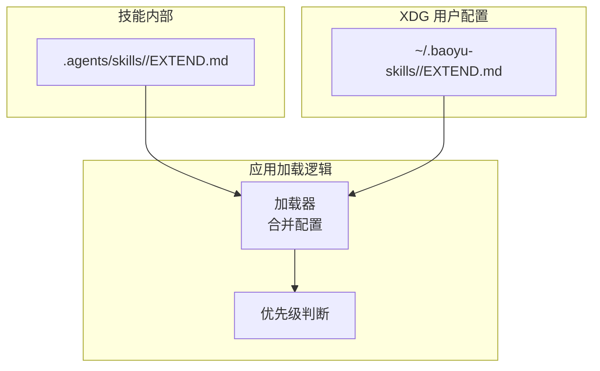
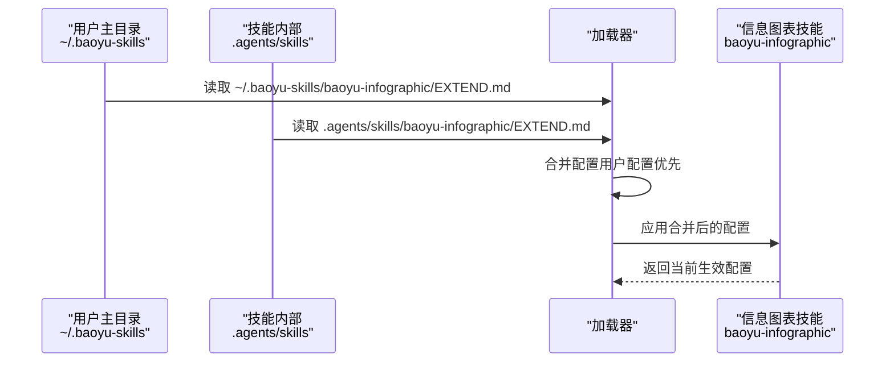
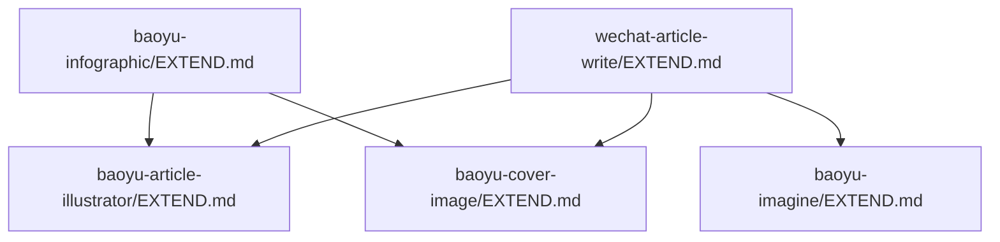

# 信息图表配置管理

<cite>
**本文档引用的文件**
- [.agents/skills/wechat-article-write/EXTEND.md](file://.agents/skills/wechat-article-write/EXTEND.md)
- [.baoyu-skills/baoyu-infographic/EXTEND.md](file://.baoyu-skills/baoyu-infographic/EXTEND.md)
- [.baoyu-skills/baoyu-article-illustrator/EXTEND.md](file://.baoyu-skills/baoyu-article-illustrator/EXTEND.md)
- [.baoyu-skills/baoyu-cover-image/EXTEND.md](file://.baoyu-skills/baoyu-cover-image/EXTEND.md)
- [.baoyu-skills/baoyu-imagine/EXTEND.md](file://.baoyu-skills/baoyu-imagine/EXTEND.md)
- [CLAUDE.md](file://CLAUDE.md)
</cite>

## 目录
1. [简介](#简介)
2. [项目结构](#项目结构)
3. [核心组件](#核心组件)
4. [架构总览](#架构总览)
5. [详细组件分析](#详细组件分析)
6. [依赖关系分析](#依赖关系分析)
7. [性能考虑](#性能考虑)
8. [故障排除指南](#故障排除指南)
9. [结论](#结论)
10. [附录](#附录)

## 简介
本文件面向信息图表配置管理，围绕 EXTEND.md 配置文件展开，系统阐述其结构、字段语义、优先级规则、加载顺序、schema 约束、最佳实践与故障排除。重点覆盖以下配置项：
- 首选布局（preferred_layout）
- 首选风格（preferred_style）
- 默认宽高比（preferred_aspect）
- 语言偏好（language）
- 首选图像后端（preferred_image_backend）
- 自定义风格定义与样式预设
- 项目级、XDG 配置、用户主目录的优先级与加载顺序
- 配置验证与重配置流程

## 项目结构
EXTEND.md 配置文件主要分布在两类位置：
- 技能内部：技能根目录下的 EXTEND.md，用于声明该技能的默认行为与偏好
- XDG 用户配置：位于用户主目录的 .baoyu-skills/<skill>/EXTEND.md，用于覆盖技能默认配置

下图展示了 EXTEND.md 在技能系统中的位置与作用范围：

**图表来源**
- [CLAUDE.md:45-50](file://CLAUDE.md#L45-L50)
- [.agents/skills/wechat-article-write/EXTEND.md:1-61](file://.agents/skills/wechat-article-write/EXTEND.md#L1-L61)

**章节来源**
- [CLAUDE.md:45-50](file://CLAUDE.md#L45-L50)

## 核心组件
本节聚焦 EXTEND.md 的关键字段及其语义，结合仓库中已有的配置样例进行说明。

- preferred_layout
  - 语义：信息图表生成时的首选布局类型
  - 示例来源：[baoyu-infographic/EXTEND.md:4](file://.baoyu-skills/baoyu-infographic/EXTEND.md#L4)
  - 说明：用于控制模块排列、网格密度、层级关系等布局策略

- preferred_style
  - 语义：信息图表的首选视觉风格
  - 示例来源：[baoyu-infographic/EXTEND.md:5](file://.baoyu-skills/baoyu-infographic/EXTEND.md#L5)
  - 说明：与样式预设（style presets）配合，决定整体视觉风格

- preferred_aspect
  - 语义：信息图表的默认宽高比
  - 示例来源：[baoyu-infographic/EXTEND.md:6](file://.baoyu-skills/baoyu-infographic/EXTEND.md#L6)
  - 说明：影响画布尺寸与元素比例

- language
  - 语义：语言偏好，决定提示词、文案与输出的语言
  - 示例来源：[baoyu-infographic/EXTEND.md:8](file://.baoyu-skills/baoyu-infographic/EXTEND.md#L8)、[baoyu-article-illustrator/EXTEND.md:6](file://.baoyu-skills/baoyu-article-illustrator/EXTEND.md#L6)、[baoyu-cover-image/EXTEND.md:11](file://.baoyu-skills/baoyu-cover-image/EXTEND.md#L11)

- preferred_image_backend
  - 语义：图像生成后端选择策略
  - 示例来源：[baoyu-infographic/EXTEND.md:9](file://.baoyu-skills/baoyu-infographic/EXTEND.md#L9)、[baoyu-article-illustrator/EXTEND.md:7](file://.baoyu-skills/baoyu-article-illustrator/EXTEND.md#L7)、[baoyu-cover-image/EXTEND.md:12](file://.baoyu-skills/baoyu-cover-image/EXTEND.md#L12)

- 版本字段（version）
  - 语义：配置文件版本，用于兼容性与升级
  - 示例来源：[baoyu-infographic/EXTEND.md:2](file://.baoyu-skills/baoyu-infographic/EXTEND.md#L2)、[baoyu-article-illustrator/EXTEND.md:2](file://.baoyu-skills/baoyu-article-illustrator/EXTEND.md#L2)、[baoyu-cover-image/EXTEND.md:2](file://.baoyu-skills/baoyu-cover-image/EXTEND.md#L2)

- 水印开关（watermark.enabled）
  - 语义：是否启用水印
  - 示例来源：[baoyu-article-illustrator/EXTEND.md:3-4](file://.baoyu-skills/baoyu-article-illustrator/EXTEND.md#L3-L4)、[baoyu-cover-image/EXTEND.md:4-5](file://.baoyu-skills/baoyu-cover-image/EXTEND.md#L4-L5)

- 默认输出目录（default_output_dir）
  - 语义：默认输出目录
  - 示例来源：[baoyu-article-illustrator/EXTEND.md:5](file://.baoyu-skills/baoyu-article-illustrator/EXTEND.md#L5)

- 快速模式（quick_mode）
  - 语义：是否跳过中间确认步骤，全自动执行
  - 示例来源：[wechat-article-write/EXTEND.md:7-16](file://.agents/skills/wechat-article-write/EXTEND.md#L7-L16)、[baoyu-cover-image/EXTEND.md:10](file://.baoyu-skills/baoyu-cover-image/EXTEND.md#L10)

- 默认文本策略（preferred_text）
  - 语义：封面生成时的默认文本策略
  - 示例来源：[baoyu-cover-image/EXTEND.md:7](file://.baoyu-skills/baoyu-cover-image/EXTEND.md#L7)

- 默认宽高比（default_aspect）
  - 语义：封面默认宽高比
  - 示例来源：[baoyu-cover-image/EXTEND.md:9](file://.baoyu-skills/baoyu-cover-image/EXTEND.md#L9)

- 默认发布方式（default_publish_method）
  - 语义：发布到公众号的默认方式
  - 示例来源：[wechat-article-write/EXTEND.md:17-28](file://.agents/skills/wechat-article-write/EXTEND.md#L17-L28)

- 环境变量与依赖技能配置
  - 语义：技能间依赖关系与所需环境变量
  - 示例来源：[wechat-article-write/EXTEND.md:29-61](file://.agents/skills/wechat-article-write/EXTEND.md#L29-L61)

**章节来源**
- [.baoyu-skills/baoyu-infographic/EXTEND.md:1-10](file://.baoyu-skills/baoyu-infographic/EXTEND.md#L1-L10)
- [.baoyu-skills/baoyu-article-illustrator/EXTEND.md:1-9](file://.baoyu-skills/baoyu-article-illustrator/EXTEND.md#L1-L9)
- [.baoyu-skills/baoyu-cover-image/EXTEND.md:1-13](file://.baoyu-skills/baoyu-cover-image/EXTEND.md#L1-L13)
- [.agents/skills/wechat-article-write/EXTEND.md:1-61](file://.agents/skills/wechat-article-write/EXTEND.md#L1-L61)

## 架构总览
EXTEND.md 的加载与合并遵循“用户主目录覆盖技能内部配置”的优先级规则。下图展示典型的信息图表相关技能配置加载流程：

**图表来源**
- [CLAUDE.md:45-50](file://CLAUDE.md#L45-L50)
- [.baoyu-skills/baoyu-infographic/EXTEND.md:1-10](file://.baoyu-skills/baoyu-infographic/EXTEND.md#L1-L10)

## 详细组件分析

### 信息图表技能（baoyu-infographic）配置
- 配置要点
  - preferred_layout：控制模块布局
  - preferred_style：控制视觉风格
  - preferred_aspect：控制宽高比
  - language：语言偏好
  - preferred_image_backend：图像后端选择
  - version：配置版本

- 配置示例路径
  - [baoyu-infographic/EXTEND.md:1-10](file://.baoyu-skills/baoyu-infographic/EXTEND.md#L1-L10)

- 依赖与联动
  - 与其他技能（如 baoyu-article-illustrator、baoyu-cover-image）共享部分字段（如 language、preferred_image_backend）

**章节来源**
- [.baoyu-skills/baoyu-infographic/EXTEND.md:1-10](file://.baoyu-skills/baoyu-infographic/EXTEND.md#L1-L10)

### 插图绘制技能（baoyu-article-illustrator）配置
- 配置要点
  - watermark.enabled：是否启用水印
  - default_output_dir：默认输出目录
  - language：语言偏好
  - preferred_image_backend：图像后端选择
  - version：配置版本

- 配置示例路径
  - [baoyu-article-illustrator/EXTEND.md:1-9](file://.baoyu-skills/baoyu-article-illustrator/EXTEND.md#L1-L9)

**章节来源**
- [.baoyu-skills/baoyu-article-illustrator/EXTEND.md:1-9](file://.baoyu-skills/baoyu-article-illustrator/EXTEND.md#L1-L9)

### 封面生成技能（baoyu-cover-image）配置
- 配置要点
  - watermark.enabled：是否启用水印
  - preferred_text：默认文本策略
  - default_aspect：默认宽高比
  - quick_mode：快速模式
  - language：语言偏好
  - preferred_image_backend：图像后端选择
  - version：配置版本

- 配置示例路径
  - [baoyu-cover-image/EXTEND.md:1-13](file://.baoyu-skills/baoyu-cover-image/EXTEND.md#L1-L13)

**章节来源**
- [.baoyu-skills/baoyu-cover-image/EXTEND.md:1-13](file://.baoyu-skills/baoyu-cover-image/EXTEND.md#L1-L13)

### 图像生成技能（baoyu-imagine）配置
- 配置要点
  - default_provider：默认图像生成提供商
  - default_quality/default_aspect_ratio/default_image_size：质量与尺寸默认值
  - default_model.*：各提供商默认模型映射
  - batch.max_workers/provider_limits：批处理并发与限流

- 配置示例路径
  - [baoyu-imagine/EXTEND.md:1-27](file://.baoyu-skills/baoyu-imagine/EXTEND.md#L1-L27)

**章节来源**
- [.baoyu-skills/baoyu-imagine/EXTEND.md:1-27](file://.baoyu-skills/baoyu-imagine/EXTEND.md#L1-L27)

### 微信文章写作流水线（wechat-article-write）配置
- 配置要点
  - quick_mode：是否跳过中间确认步骤
  - default_publish_method：默认发布方式（api/browser）
  - 依赖技能与配置路径：列出依赖技能的 EXTEND.md 位置与必需配置项
  - 环境变量：.env 文件位置与所需变量

- 配置示例路径
  - [wechat-article-write/EXTEND.md:1-61](file://.agents/skills/wechat-article-write/EXTEND.md#L1-L61)

**章节来源**
- [.agents/skills/wechat-article-write/EXTEND.md:1-61](file://.agents/skills/wechat-article-write/EXTEND.md#L1-L61)

## 依赖关系分析
信息图表配置在流水线中的依赖关系如下：

**图表来源**
- [.agents/skills/wechat-article-write/EXTEND.md:29-39](file://.agents/skills/wechat-article-write/EXTEND.md#L29-L39)
- [.baoyu-skills/baoyu-infographic/EXTEND.md:1-10](file://.baoyu-skills/baoyu-infographic/EXTEND.md#L1-L10)

**章节来源**
- [.agents/skills/wechat-article-write/EXTEND.md:29-39](file://.agents/skills/wechat-article-write/EXTEND.md#L29-L39)

## 性能考虑
- 批处理并发与限流
  - 通过 default_provider 与 batch.provider_limits 控制并发与启动间隔，避免触发上游服务限流
  - 示例来源：[baoyu-imagine/EXTEND.md:15-27](file://.baoyu-skills/baoyu-imagine/EXTEND.md#L15-L27)

- 快速模式
  - quick_mode=true 可减少交互等待，提升流水线吞吐量
  - 示例来源：[wechat-article-write/EXTEND.md:7-16](file://.agents/skills/wechat-article-write/EXTEND.md#L7-L16)、[baoyu-cover-image/EXTEND.md:10](file://.baoyu-skills/baoyu-cover-image/EXTEND.md#L10)

- 图像后端选择
  - preferred_image_backend=auto 可由系统自动选择最优后端，平衡速度与质量
  - 示例来源：[baoyu-infographic/EXTEND.md:9](file://.baoyu-skills/baoyu-infographic/EXTEND.md#L9)、[baoyu-article-illustrator/EXTEND.md:7](file://.baoyu-skills/baoyu-article-illustrator/EXTEND.md#L7)、[baoyu-cover-image/EXTEND.md:12](file://.baoyu-skills/baoyu-cover-image/EXTEND.md#L12)

**章节来源**
- [.baoyu-skills/baoyu-imagine/EXTEND.md:15-27](file://.baoyu-skills/baoyu-imagine/EXTEND.md#L15-L27)
- [.agents/skills/wechat-article-write/EXTEND.md:7-16](file://.agents/skills/wechat-article-write/EXTEND.md#L7-L16)
- [.baoyu-skills/baoyu-cover-image/EXTEND.md:10](file://.baoyu-skills/baoyu-cover-image/EXTEND.md#L10)
- [.baoyu-skills/baoyu-infographic/EXTEND.md:9](file://.baoyu-skills/baoyu-infographic/EXTEND.md#L9)

## 故障排除指南
- 配置未生效
  - 检查用户主目录配置是否覆盖技能内部配置
  - 确认配置文件格式与字段拼写
  - 示例来源：[CLAUDE.md:45-50](file://CLAUDE.md#L45-L50)

- 依赖技能缺失配置
  - 根据 wechat-article-write/EXTEND.md 的依赖表，逐项补齐所需配置
  - 示例来源：[wechat-article-write/EXTEND.md:29-39](file://.agents/skills/wechat-article-write/EXTEND.md#L29-L39)

- 环境变量错误
  - 确认 .env 文件路径与变量名称正确
  - 示例来源：[wechat-article-write/EXTEND.md:40-61](file://.agents/skills/wechat-article-write/EXTEND.md#L40-L61)

- 版本不兼容
  - 检查 version 字段，必要时升级或降级配置文件以适配当前版本
  - 示例来源：[baoyu-infographic/EXTEND.md:2](file://.baoyu-skills/baoyu-infographic/EXTEND.md#L2)、[baoyu-article-illustrator/EXTEND.md:2](file://.baoyu-skills/baoyu-article-illustrator/EXTEND.md#L2)、[baoyu-cover-image/EXTEND.md:2](file://.baoyu-skills/baoyu-cover-image/EXTEND.md#L2)

**章节来源**
- [CLAUDE.md:45-50](file://CLAUDE.md#L45-L50)
- [.agents/skills/wechat-article-write/EXTEND.md:29-61](file://.agents/skills/wechat-article-write/EXTEND.md#L29-L61)
- [.baoyu-skills/baoyu-infographic/EXTEND.md:2](file://.baoyu-skills/baoyu-infographic/EXTEND.md#L2)
- [.baoyu-skills/baoyu-article-illustrator/EXTEND.md:2](file://.baoyu-skills/baoyu-article-illustrator/EXTEND.md#L2)
- [.baoyu-skills/baoyu-cover-image/EXTEND.md:2](file://.baoyu-skills/baoyu-cover-image/EXTEND.md#L2)

## 结论
EXTEND.md 为信息图表工作流提供了集中化的配置入口，通过“用户主目录覆盖技能内部配置”的优先级机制实现灵活的个性化定制。结合版本字段、字段约束与依赖关系，用户可在保证兼容性的前提下，按需调整布局、风格、宽高比、语言与图像后端等关键参数，从而获得稳定高效的生成体验。

## 附录

### 配置优先级与加载顺序
- 加载顺序
  1) 读取技能内部 EXTEND.md
  2) 读取用户主目录 ~/.baoyu-skills/<skill>/EXTEND.md
  3) 合并配置，用户配置覆盖技能默认配置
- 适用范围
  - 适用于信息图表、插图绘制、封面生成、图像生成等技能
- 示例来源
  - [CLAUDE.md:45-50](file://CLAUDE.md#L45-L50)

**章节来源**
- [CLAUDE.md:45-50](file://CLAUDE.md#L45-L50)

### 配置字段与约束（基于现有样例）
- 字段清单
  - version：整数，用于版本管理
  - preferred_layout：字符串，布局类型
  - preferred_style：字符串，风格类型
  - preferred_aspect：字符串，宽高比
  - language：字符串，语言代码
  - preferred_image_backend：字符串，后端选择策略
  - watermark.enabled：布尔值，水印开关
  - default_output_dir：字符串，输出目录
  - quick_mode：布尔值，快速模式
  - preferred_text：字符串，文本策略
  - default_aspect：字符串，封面宽高比
  - default_publish_method：字符串，发布方式
  - default_provider/default_quality/default_aspect_ratio/default_image_size：字符串/数值，图像生成默认参数
  - default_model.*：对象映射，各提供商默认模型
  - batch.max_workers/provider_limits：数值，批处理并发与限流
- 约束说明
  - 仅当字段存在于具体技能的 EXTEND.md 时才生效
  - 未显式设置的字段采用技能内部默认值
- 示例来源
  - [.baoyu-skills/baoyu-infographic/EXTEND.md:1-10](file://.baoyu-skills/baoyu-infographic/EXTEND.md#L1-L10)
  - [.baoyu-skills/baoyu-article-illustrator/EXTEND.md:1-9](file://.baoyu-skills/baoyu-article-illustrator/EXTEND.md#L1-L9)
  - [.baoyu-skills/baoyu-cover-image/EXTEND.md:1-13](file://.baoyu-skills/baoyu-cover-image/EXTEND.md#L1-L13)
  - [.baoyu-skills/baoyu-imagine/EXTEND.md:1-27](file://.baoyu-skills/baoyu-imagine/EXTEND.md#L1-L27)
  - [.agents/skills/wechat-article-write/EXTEND.md:1-61](file://.agents/skills/wechat-article-write/EXTEND.md#L1-L61)

**章节来源**
- [.baoyu-skills/baoyu-infographic/EXTEND.md:1-10](file://.baoyu-skills/baoyu-infographic/EXTEND.md#L1-L10)
- [.baoyu-skills/baoyu-article-illustrator/EXTEND.md:1-9](file://.baoyu-skills/baoyu-article-illustrator/EXTEND.md#L1-L9)
- [.baoyu-skills/baoyu-cover-image/EXTEND.md:1-13](file://.baoyu-skills/baoyu-cover-image/EXTEND.md#L1-L13)
- [.baoyu-skills/baoyu-imagine/EXTEND.md:1-27](file://.baoyu-skills/baoyu-imagine/EXTEND.md#L1-L27)
- [.agents/skills/wechat-article-write/EXTEND.md:1-61](file://.agents/skills/wechat-article-write/EXTEND.md#L1-L61)

### 最佳实践
- 保持版本字段一致：确保 version 与当前技能版本匹配
- 逐步覆盖：先在用户主目录配置少量关键字段，验证后再扩展
- 统一语言：统一设置 language，避免跨技能语言不一致
- 合理并发：根据上游服务限流策略调整 batch.provider_limits
- 快速模式：在稳定阶段开启 quick_mode，减少人工干预
- 示例来源
  - [.baoyu-skills/baoyu-infographic/EXTEND.md:1-10](file://.baoyu-skills/baoyu-infographic/EXTEND.md#L1-L10)
  - [.baoyu-skills/baoyu-imagine/EXTEND.md:15-27](file://.baoyu-skills/baoyu-imagine/EXTEND.md#L15-L27)
  - [.agents/skills/wechat-article-write/EXTEND.md:7-16](file://.agents/skills/wechat-article-write/EXTEND.md#L7-L16)

**章节来源**
- [.baoyu-skills/baoyu-infographic/EXTEND.md:1-10](file://.baoyu-skills/baoyu-infographic/EXTEND.md#L1-L10)
- [.baoyu-skills/baoyu-imagine/EXTEND.md:15-27](file://.baoyu-skills/baoyu-imagine/EXTEND.md#L15-L27)
- [.agents/skills/wechat-article-write/EXTEND.md:7-16](file://.agents/skills/wechat-article-write/EXTEND.md#L7-L16)