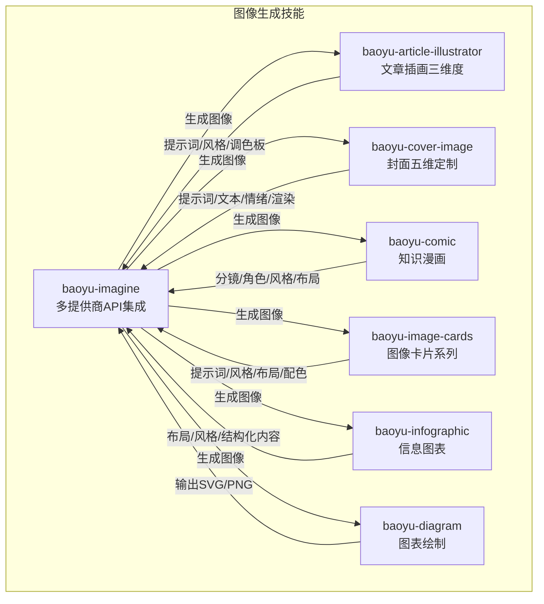
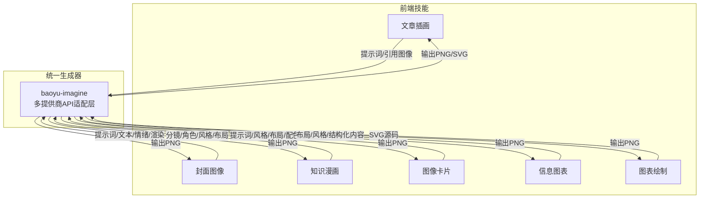
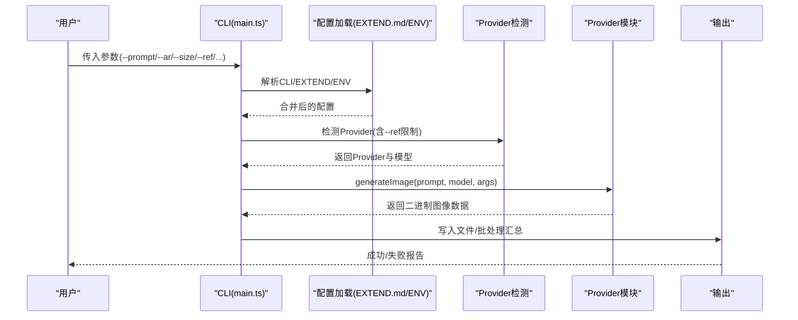
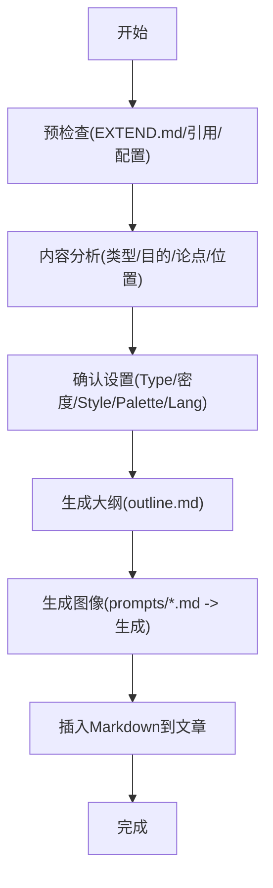
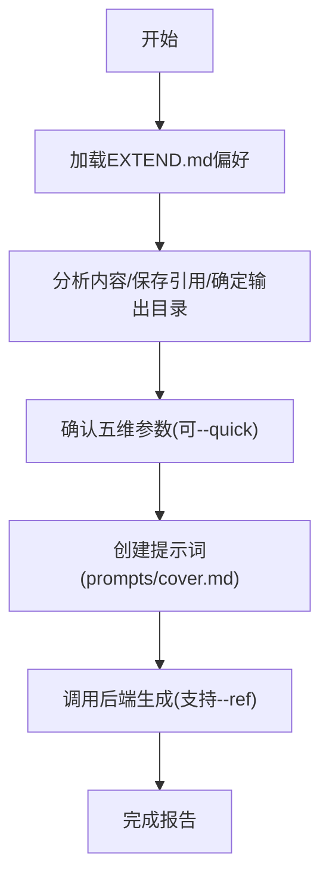
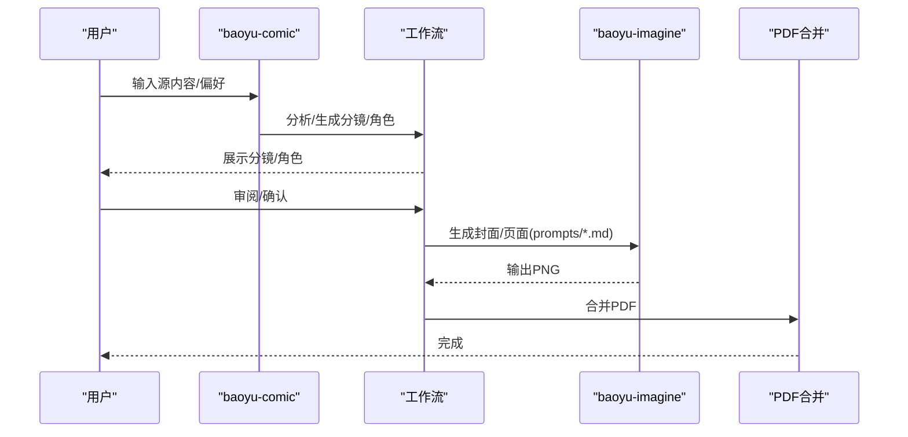
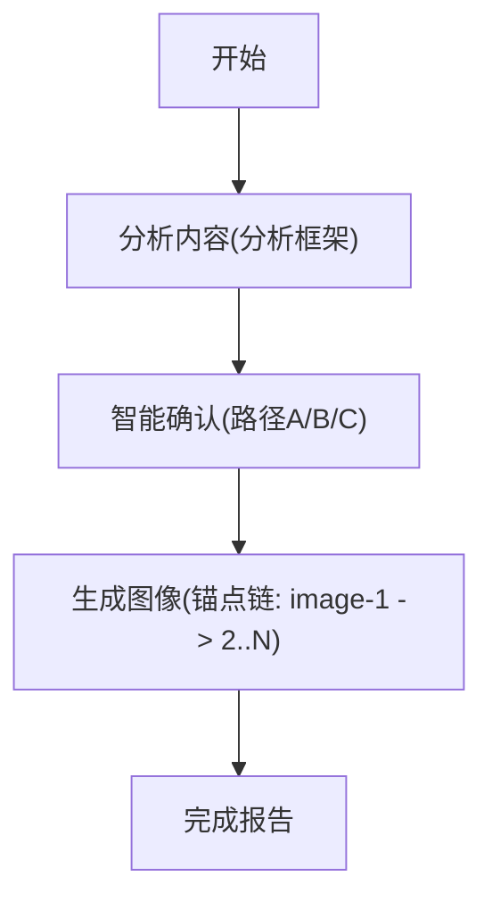
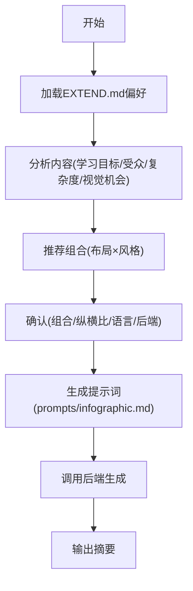
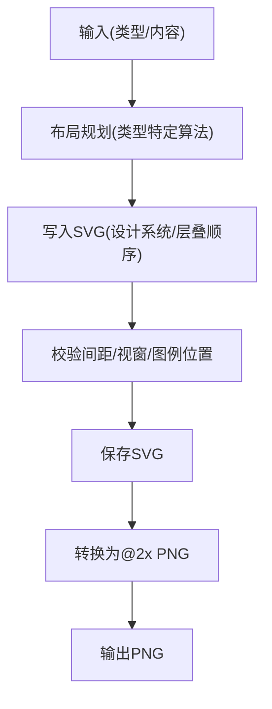
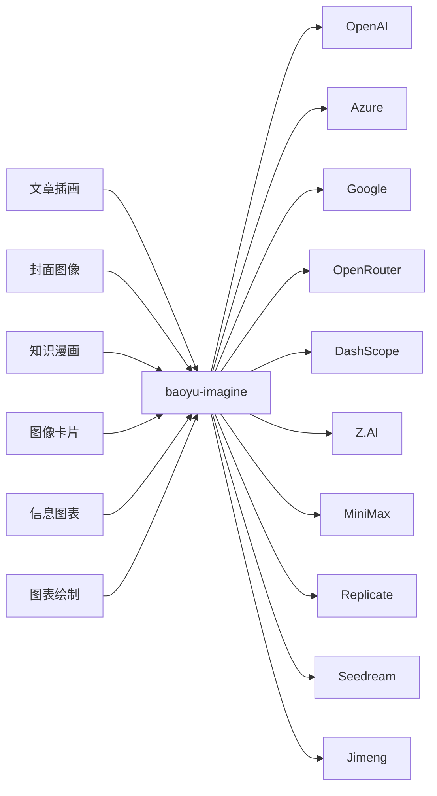

# 图像生成技能

<cite>
**本文档引用的文件**
- [baoyu-imagine/SKILL.md](file://.agents/skills/baoyu-imagine/SKILL.md)
- [baoyu-imagine/scripts/main.ts](file://.agents/skills/baoyu-imagine/scripts/main.ts)
- [baoyu-imagine/scripts/build-batch.ts](file://.agents/skills/baoyu-imagine/scripts/build-batch.ts)
- [baoyu-imagine/references/providers/dashscope.md](file://.agents/skills/baoyu-imagine/references/providers/dashscope.md)
- [baoyu-imagine/references/providers/openrouter.md](file://.agents/skills/baoyu-imagine/references/providers/openrouter.md)
- [baoyu-article-illustrator/SKILL.md](file://.agents/skills/baoyu-article-illustrator/SKILL.md)
- [baoyu-article-illustrator/references/styles.md](file://.agents/skills/baoyu-article-illustrator/references/styles.md)
- [baoyu-article-illustrator/references/style-presets.md](file://.agents/skills/baoyu-article-illustrator/references/style-presets.md)
- [baoyu-article-illustrator/references/workflow.md](file://.agents/skills/baoyu-article-illustrator/references/workflow.md)
- [baoyu-cover-image/SKILL.md](file://.agents/skills/baoyu-cover-image/SKILL.md)
- [baoyu-comic/SKILL.md](file://.agents/skills/baoyu-comic/SKILL.md)
- [baoyu-comic/references/workflow.md](file://.agents/skills/baoyu-comic/references/workflow.md)
- [baoyu-image-cards/SKILL.md](file://.agents/skills/baoyu-image-cards/SKILL.md)
- [baoyu-image-cards/references/workflows/analysis-framework.md](file://.agents/skills/baoyu-image-cards/references/workflows/analysis-framework.md)
- [baoyu-infographic/SKILL.md](file://.agents/skills/baoyu-infographic/SKILL.md)
- [baoyu-infographic/references/analysis-framework.md](file://.agents/skills/baoyu-infographic/references/analysis-framework.md)
- [baoyu-diagram/SKILL.md](file://.agents/skills/baoyu-diagram/SKILL.md)
- [baoyu-diagram/scripts/main.ts](file://.agents/skills/baoyu-diagram/scripts/main.ts)
</cite>

## 目录
1. [简介](#简介)
2. [项目结构](#项目结构)
3. [核心组件](#核心组件)
4. [架构总览](#架构总览)
5. [详细组件分析](#详细组件分析)
6. [依赖关系分析](#依赖关系分析)
7. [性能考虑](#性能考虑)
8. [故障排除指南](#故障排除指南)
9. [结论](#结论)
10. [附录](#附录)

## 简介
本技术文档系统性梳理 NTLx's Blog 中的图像生成技能模块，覆盖以下技能：
- baoyu-imagine：多提供商图像生成与批量处理
- baoyu-article-illustrator：文章插画生成（三维度风格体系）
- baoyu-cover-image：封面图像生成（五维定制）
- baoyu-comic：知识漫画生成（艺术风格×情绪×布局×角色）
- baoyu-image-cards：图像卡片系列（社交图文）
- baoyu-infographic：信息图表生成（布局×风格×结构化内容）
- baoyu-diagram：图表绘制（架构/流程/序列/结构/思维导图/时间线等）

文档从架构、数据流、处理逻辑、集成点、错误处理与性能优化等维度进行深入解析，并提供可视化图示与排障建议。

## 项目结构
各技能均采用“技能说明 + 参考资料 + 脚本”的组织方式：
- 技能说明（SKILL.md）：能力边界、输入输出、配置项、工作流与注意事项
- 参考资料（references/）：风格库、布局库、自动选择规则、分析框架、模板等
- 脚本（scripts/）：CLI 入口、批处理组装、转换工具等

**图表来源**
- [.agents/skills/baoyu-imagine/SKILL.md:1-238](file://.agents/skills/baoyu-imagine/SKILL.md#L1-L238)
- [.agents/skills/baoyu-article-illustrator/SKILL.md:1-241](file://.agents/skills/baoyu-article-illustrator/SKILL.md#L1-L241)
- [.agents/skills/baoyu-cover-image/SKILL.md:1-273](file://.agents/skills/baoyu-cover-image/SKILL.md#L1-L273)
- [.agents/skills/baoyu-comic/SKILL.md:1-317](file://.agents/skills/baoyu-comic/SKILL.md#L1-L317)
- [.agents/skills/baoyu-image-cards/SKILL.md:1-452](file://.agents/skills/baoyu-image-cards/SKILL.md#L1-L452)
- [.agents/skills/baoyu-infographic/SKILL.md:1-321](file://.agents/skills/baoyu-infographic/SKILL.md#L1-L321)
- [.agents/skills/baoyu-diagram/SKILL.md:1-248](file://.agents/skills/baoyu-diagram/SKILL.md#L1-L248)

**章节来源**
- [.agents/skills/baoyu-imagine/SKILL.md:1-238](file://.agents/skills/baoyu-imagine/SKILL.md#L1-L238)
- [.agents/skills/baoyu-article-illustrator/SKILL.md:1-241](file://.agents/skills/baoyu-article-illustrator/SKILL.md#L1-L241)
- [.agents/skills/baoyu-cover-image/SKILL.md:1-273](file://.agents/skills/baoyu-cover-image/SKILL.md#L1-L273)
- [.agents/skills/baoyu-comic/SKILL.md:1-317](file://.agents/skills/baoyu-comic/SKILL.md#L1-L317)
- [.agents/skills/baoyu-image-cards/SKILL.md:1-452](file://.agents/skills/baoyu-image-cards/SKILL.md#L1-L452)
- [.agents/skills/baoyu-infographic/SKILL.md:1-321](file://.agents/skills/baoyu-infographic/SKILL.md#L1-L321)
- [.agents/skills/baoyu-diagram/SKILL.md:1-248](file://.agents/skills/baoyu-diagram/SKILL.md#L1-L248)

## 核心组件
- 多提供商图像生成引擎（baoyu-imagine）
  - 支持 OpenAI、Azure、Google、OpenRouter、DashScope、Z.AI、MiniMax、Jimeng、Seedream、Replicate
  - 提供 CLI 参数、环境变量、EXTEND.md 配置、批处理模式与并发控制
  - 支持参考图像、纵横比、尺寸、质量、多提供商限流与重试
- 文章插画生成（baoyu-article-illustrator）
  - Type×Style×Palette 三维风格体系，结合内容分析与自动推荐
  - 明确的提示词构建规范与引用图像处理流程
- 封面图像生成（baoyu-cover-image）
  - 五维定制：类型、调色板、渲染、文本、情绪；支持多种纵横比与字体
  - 自动选择规则与确认策略，确保一致性与可复现性
- 知识漫画生成（baoyu-comic）
  - 艺术风格×情绪×布局×角色的组合；支持分镜、角色参考、局部重生成
  - 完整工作流：分析→分镜→角色→提示词→图像→PDF
- 图像卡片系列（baoyu-image-cards）
  - 12风格×8布局×3配色；支持锚定链保持视觉一致性
  - 三种策略（A/B/C）与自动选择矩阵
- 信息图表生成（baoyu-infographic）
  - 21布局×22风格×结构化内容；关键词快捷映射与组合推荐
  - 严格的数据逐字保留原则
- 图表绘制（baoyu-diagram）
  - 专业深色系 SVG 图表；包含设计系统、层叠顺序、间距规则与转换脚本

**章节来源**
- [.agents/skills/baoyu-imagine/SKILL.md:1-238](file://.agents/skills/baoyu-imagine/SKILL.md#L1-L238)
- [.agents/skills/baoyu-article-illustrator/SKILL.md:1-241](file://.agents/skills/baoyu-article-illustrator/SKILL.md#L1-L241)
- [.agents/skills/baoyu-cover-image/SKILL.md:1-273](file://.agents/skills/baoyu-cover-image/SKILL.md#L1-L273)
- [.agents/skills/baoyu-comic/SKILL.md:1-317](file://.agents/skills/baoyu-comic/SKILL.md#L1-L317)
- [.agents/skills/baoyu-image-cards/SKILL.md:1-452](file://.agents/skills/baoyu-image-cards/SKILL.md#L1-L452)
- [.agents/skills/baoyu-infographic/SKILL.md:1-321](file://.agents/skills/baoyu-infographic/SKILL.md#L1-L321)
- [.agents/skills/baoyu-diagram/SKILL.md:1-248](file://.agents/skills/baoyu-diagram/SKILL.md#L1-L248)

## 架构总览
多提供商图像生成（baoyu-imagine）作为统一后端，被其他技能以“提示词文件”或“参数”形式调用，形成“前端技能 + 统一生成器”的分层架构。

**图表来源**
- [.agents/skills/baoyu-imagine/SKILL.md:1-238](file://.agents/skills/baoyu-imagine/SKILL.md#L1-L238)
- [.agents/skills/baoyu-article-illustrator/SKILL.md:24-41](file://.agents/skills/baoyu-article-illustrator/SKILL.md#L24-L41)
- [.agents/skills/baoyu-cover-image/SKILL.md:24-41](file://.agents/skills/baoyu-cover-image/SKILL.md#L24-L41)
- [.agents/skills/baoyu-comic/SKILL.md:28-45](file://.agents/skills/baoyu-comic/SKILL.md#L28-L45)
- [.agents/skills/baoyu-image-cards/SKILL.md:24-41](file://.agents/skills/baoyu-image-cards/SKILL.md#L24-L41)
- [.agents/skills/baoyu-infographic/SKILL.md:24-41](file://.agents/skills/baoyu-infographic/SKILL.md#L24-L41)
- [.agents/skills/baoyu-diagram/SKILL.md:1-248](file://.agents/skills/baoyu-diagram/SKILL.md#L1-L248)

## 详细组件分析

### baoyu-imagine：多提供商图像生成与批量处理
- 多提供商支持
  - OpenAI、Azure、Google、OpenRouter、DashScope、Z.AI、MiniMax、Jimeng、Seedream、Replicate
  - Provider 模块接口抽象：getDefaultModel、generateImage、validateArgs、getDefaultOutputExtension
- 配置与优先级
  - CLI 参数 > EXTEND.md > 环境变量 > 本地 .env > 用户 .env
  - EXTEND.md 支持默认提供商、默认质量、默认纵横比、默认尺寸、批次并发限制、提供商限流
- 批量处理
  - 支持 --batchfile 与 --jobs；默认自动并行（任务≥2），最大工作者数可配置
  - 每张图最多重试3次；输出成功/失败计数与失败原因
- Provider 特性
  - DashScope：qwen-image-2.0* 自由尺寸、wan2.7-image* 参考图像、像素上限与比例约束
  - OpenRouter：/chat/completions 流程，支持参考图像的多模态模型
- 关键流程（CLI 解析 → 配置合并 → Provider 选择 → 生成 → 批处理/重试）

**图表来源**
- [.agents/skills/baoyu-imagine/scripts/main.ts:163-343](file://.agents/skills/baoyu-imagine/scripts/main.ts#L163-L343)
- [.agents/skills/baoyu-imagine/scripts/main.ts:573-594](file://.agents/skills/baoyu-imagine/scripts/main.ts#L573-L594)
- [.agents/skills/baoyu-imagine/scripts/main.ts:691-777](file://.agents/skills/baoyu-imagine/scripts/main.ts#L691-L777)
- [.agents/skills/baoyu-imagine/SKILL.md:154-165](file://.agents/skills/baoyu-imagine/SKILL.md#L154-L165)

**章节来源**
- [.agents/skills/baoyu-imagine/SKILL.md:1-238](file://.agents/skills/baoyu-imagine/SKILL.md#L1-L238)
- [.agents/skills/baoyu-imagine/scripts/main.ts:1-800](file://.agents/skills/baoyu-imagine/scripts/main.ts#L1-L800)
- [.agents/skills/baoyu-imagine/scripts/build-batch.ts:1-239](file://.agents/skills/baoyu-imagine/scripts/build-batch.ts#L1-L239)
- [.agents/skills/baoyu-imagine/references/providers/dashscope.md:1-70](file://.agents/skills/baoyu-imagine/references/providers/dashscope.md#L1-L70)
- [.agents/skills/baoyu-imagine/references/providers/openrouter.md:1-20](file://.agents/skills/baoyu-imagine/references/providers/openrouter.md#L1-L20)

### baoyu-article-illustrator：文章插画生成
- 三维度风格体系
  - Type（信息图/场景/流程图/对比/框架/时间线）、Style（向量/手绘/极简/蓝图/水彩/编辑/科学/屏幕印刷等）、Palette（马卡龙/暖色/霓虹/墨色）
  - 自动推荐矩阵与内容信号映射
- 工作流
  - 预检查（EXTEND.md/引用图像/配置）→ 内容分析 → 确认设置（AskUserQuestion）→ 生成大纲 → 生成图像（提示词文件先行）
  - 引用图像处理：direct/style/palette 三种用法；仅当文件实际保存才写入 frontmatter
- 输出目录策略
  - 相对文章目录的不同子目录策略，支持独立输出目录

**图表来源**
- [.agents/skills/baoyu-article-illustrator/references/workflow.md:1-432](file://.agents/skills/baoyu-article-illustrator/references/workflow.md#L1-L432)
- [.agents/skills/baoyu-article-illustrator/SKILL.md:84-173](file://.agents/skills/baoyu-article-illustrator/SKILL.md#L84-L173)

**章节来源**
- [.agents/skills/baoyu-article-illustrator/SKILL.md:1-241](file://.agents/skills/baoyu-article-illustrator/SKILL.md#L1-L241)
- [.agents/skills/baoyu-article-illustrator/references/styles.md:1-237](file://.agents/skills/baoyu-article-illustrator/references/styles.md#L1-L237)
- [.agents/skills/baoyu-article-illustrator/references/style-presets.md:1-88](file://.agents/skills/baoyu-article-illustrator/references/style-presets.md#L1-L88)
- [.agents/skills/baoyu-article-illustrator/references/workflow.md:1-432](file://.agents/skills/baoyu-article-illustrator/references/workflow.md#L1-L432)

### baoyu-cover-image：封面图像生成
- 五维定制
  - Type（英雄/概念/文字/隐喻/场景/极简）、Palette（暖/优雅/冷/暗/大地/鲜艳/粉彩/单色/复古/双色）、Rendering（矢量/手绘/绘画/数字/像素/粉笔/胶版）、Text（无/仅标题/标题副标题/富文本）、Mood（微妙/平衡/强烈）
  - 字体、纵横比、语言、快速模式、引用图像处理
- 自动选择与确认策略
  - 基于内容与偏好自动推荐；支持 --quick 跳过确认
  - 引用图像中含人像时，针对不支持 --ref 的模型提供描述文件方案
- 文件结构与输出目录
  - 支持同目录、img子目录、独立目录等策略

**图表来源**
- [.agents/skills/baoyu-cover-image/SKILL.md:120-233](file://.agents/skills/baoyu-cover-image/SKILL.md#L120-L233)

**章节来源**
- [.agents/skills/baoyu-cover-image/SKILL.md:1-273](file://.agents/skills/baoyu-cover-image/SKILL.md#L1-L273)

### baoyu-comic：知识漫画生成
- 组合维度
  - Art（线条简洁/漫画/写实/水墨/粉笔/极简）、Tone（中性/温暖/戏剧/浪漫/活力/复古/动作）、Layout（标准/电影式/密集/喷溅/混合/网络漫画/四格）、Aspect（3:4/4:3/16:9）
  - 预设（ohmsha/wuxia/shoujo/concept-story/four-panel）含特殊规则
- 工作流
  - 预检查 → 内容分析 → 确认风格/焦点/受众/审阅 → 生成分镜+角色 → 审阅大纲/提示词 → 生成图像（支持角色参考/压缩/回退）→ 合并PDF
- 角色参考与一致性
  - 多页漫画建议生成角色参考图；根据后端能力决定是否使用 --ref 或内嵌描述

**图表来源**
- [.agents/skills/baoyu-comic/SKILL.md:169-242](file://.agents/skills/baoyu-comic/SKILL.md#L169-L242)
- [.agents/skills/baoyu-comic/references/workflow.md:1-544](file://.agents/skills/baoyu-comic/references/workflow.md#L1-L544)

**章节来源**
- [.agents/skills/baoyu-comic/SKILL.md:1-317](file://.agents/skills/baoyu-comic/SKILL.md#L1-L317)
- [.agents/skills/baoyu-comic/references/workflow.md:1-544](file://.agents/skills/baoyu-comic/references/workflow.md#L1-L544)

### baoyu-image-cards：图像卡片系列
- 维度组合
  - Style（12种）、Layout（8种）、Palette（可选覆盖）
  - 预设（知识/生活/影响/趋势/海报）与自动选择矩阵
- 生成策略
  - 三种策略（A/B/C）；图像1作为锚点，后续图像以该图为 --ref 保持一致性
  - 支持引用图像（direct/style/palette）叠加，避免冲突信号
- 内容分析框架
  - 针对小红书风格的内容分析：钩子、受众、保存/分享动机、滑动叙事

**图表来源**
- [.agents/skills/baoyu-image-cards/SKILL.md:275-372](file://.agents/skills/baoyu-image-cards/SKILL.md#L275-L372)
- [.agents/skills/baoyu-image-cards/references/workflows/analysis-framework.md:1-199](file://.agents/skills/baoyu-image-cards/references/workflows/analysis-framework.md#L1-L199)

**章节来源**
- [.agents/skills/baoyu-image-cards/SKILL.md:1-452](file://.agents/skills/baoyu-image-cards/SKILL.md#L1-L452)
- [.agents/skills/baoyu-image-cards/references/workflows/analysis-framework.md:1-199](file://.agents/skills/baoyu-image-cards/references/workflows/analysis-framework.md#L1-L199)

### baoyu-infographic：信息图表生成
- 维度与组合
  - 21布局×22风格；默认组合与关键词快捷映射
  - 结构化内容模板：学习目标、受众、数据逐字保留、设计指令
- 工作流
  - 预检查 → 内容分析 → 推荐组合 → 确认选项 → 生成提示词 → 生成图像 → 输出摘要
- 数据完整性
  - 严禁摘要/改写；引用/统计/日期/术语必须逐字保留

**图表来源**
- [.agents/skills/baoyu-infographic/SKILL.md:203-296](file://.agents/skills/baoyu-infographic/SKILL.md#L203-L296)
- [.agents/skills/baoyu-infographic/references/analysis-framework.md:1-183](file://.agents/skills/baoyu-infographic/references/analysis-framework.md#L1-L183)

**章节来源**
- [.agents/skills/baoyu-infographic/SKILL.md:1-321](file://.agents/skills/baoyu-infographic/SKILL.md#L1-L321)
- [.agents/skills/baoyu-infographic/references/analysis-framework.md:1-183](file://.agents/skills/baoyu-infographic/references/analysis-framework.md#L1-L183)

### baoyu-diagram：图表绘制
- 支持类型
  - 架构图、流程图、序列图、结构图、思维导图、时间线、示意/概念图等
- 设计系统
  - 深色背景网格、语义化颜色、字体与层级顺序（背景→区域→连线→遮罩→组件→文本→图例→标题）
- 输出与转换
  - 输出单一自包含 .svg；提供脚本将 SVG 转换为 @2x PNG

**图表来源**
- [.agents/skills/baoyu-diagram/SKILL.md:176-248](file://.agents/skills/baoyu-diagram/SKILL.md#L176-L248)
- [.agents/skills/baoyu-diagram/scripts/main.ts:1-101](file://.agents/skills/baoyu-diagram/scripts/main.ts#L1-L101)

**章节来源**
- [.agents/skills/baoyu-diagram/SKILL.md:1-248](file://.agents/skills/baoyu-diagram/SKILL.md#L1-L248)
- [.agents/skills/baoyu-diagram/scripts/main.ts:1-101](file://.agents/skills/baoyu-diagram/scripts/main.ts#L1-L101)

## 依赖关系分析
- 组件耦合
  - baoyu-imagine 作为通用图像生成器，被其他技能通过“提示词文件/参数”调用，耦合度低、内聚性强
  - 各技能内部工作流高度模块化，便于替换与扩展
- 外部依赖
  - Provider API（OpenAI/Azure/Google/OpenRouter/DashScope/Z.AI/MiniMax/Replicate/Seedream/Jimeng）
  - 本地文件系统（EXTEND.md、提示词文件、输出目录）
  - 第三方库（如 sharp 用于 SVG→PNG 转换）

**图表来源**
- [.agents/skills/baoyu-imagine/SKILL.md:16-165](file://.agents/skills/baoyu-imagine/SKILL.md#L16-L165)
- [.agents/skills/baoyu-diagram/SKILL.md:10-248](file://.agents/skills/baoyu-diagram/SKILL.md#L10-L248)

**章节来源**
- [.agents/skills/baoyu-imagine/SKILL.md:1-238](file://.agents/skills/baoyu-imagine/SKILL.md#L1-L238)
- [.agents/skills/baoyu-diagram/SKILL.md:1-248](file://.agents/skills/baoyu-diagram/SKILL.md#L1-L248)

## 性能考虑
- 并发与限流
  - baoyu-imagine 默认最大工作者数与提供商并发限制可配置；批处理自动并行，减少总体耗时
- 重试与稳定性
  - 每张图最多重试3次；失败原因记录便于定位
- 生成策略
  - baoyu-image-cards 使用“图像1锚点链 + 后续 --ref”降低风格漂移，提高一致性
  - baoyu-comic 在存在角色参考时优先使用 --ref，否则内嵌描述，兼顾一致性与兼容性
- 输出优化
  - baoyu-diagram 使用 sharp 将 SVG 转换为 @2x PNG，保证清晰度与体积平衡

[本节为通用指导，无需具体文件分析]

## 故障排除指南
- 缺少 API 密钥
  - 现象：无法检测 Provider 或报错
  - 处理：在 EXTEND.md 或环境变量中配置对应 PROVIDER_API_KEY/PROVIDER_BASE_URL
- 参考图像不支持
  - 现象：指定 --ref 但 Provider 不支持
  - 处理：更换支持参考图像的 Provider，或在提示词中描述风格/色彩
- 批处理失败
  - 现象：部分任务失败
  - 处理：查看失败原因，修复后重试；必要时降低并发或调整限流
- 引用图像缺失
  - 现象：frontmatter 中声明引用但文件不存在
  - 处理：修正 frontmatter 或删除引用字段
- 模型/尺寸/纵横比不合法
  - 现象：DashScope/Replicate 等报错
  - 处理：参考对应 Provider 文档，调整 --size/--ar 或使用受支持的模型族

**章节来源**
- [.agents/skills/baoyu-imagine/SKILL.md:215-221](file://.agents/skills/baoyu-imagine/SKILL.md#L215-L221)
- [.agents/skills/baoyu-imagine/scripts/main.ts:791-800](file://.agents/skills/baoyu-imagine/scripts/main.ts#L791-L800)
- [.agents/skills/baoyu-article-illustrator/references/workflow.md:350-383](file://.agents/skills/baoyu-article-illustrator/references/workflow.md#L350-L383)
- [.agents/skills/baoyu-comic/references/workflow.md:460-467](file://.agents/skills/baoyu-comic/references/workflow.md#L460-L467)

## 结论
本模块通过“统一生成器 + 多技能前端”的架构，实现了从内容分析到图像生成的完整流水线。baoyu-imagine 提供稳定的多提供商适配与批处理能力；各前端技能围绕自身领域特性（风格/布局/角色/结构化内容/图表类型）提供明确的工作流与配置项，既保证了灵活性，也确保了可复现性与一致性。配合完善的错误处理与性能优化建议，能够满足博客与内容创作场景下的多样化图像生成需求。

[本节为总结性内容，无需具体文件分析]

## 附录
- 配置文件位置与加载顺序
  - EXTEND.md 优先级：项目路径 > XDG 路径 > 用户主目录
  - 环境变量优先级：CLI > EXTEND.md > 环境变量 > 项目 .env > 用户 .env
- 常用命令示例
  - baoyu-imagine：基础生成、指定纵横比/质量、从文件读取提示词、指定 Provider/模型、批量生成
  - baoyu-diagram：SVG→PNG 转换（支持缩放与 JSON 输出）

**章节来源**
- [.agents/skills/baoyu-imagine/SKILL.md:32-49](file://.agents/skills/baoyu-imagine/SKILL.md#L32-L49)
- [.agents/skills/baoyu-imagine/SKILL.md:98-123](file://.agents/skills/baoyu-imagine/SKILL.md#L98-L123)
- [.agents/skills/baoyu-diagram/SKILL.md:219-237](file://.agents/skills/baoyu-diagram/SKILL.md#L219-L237)