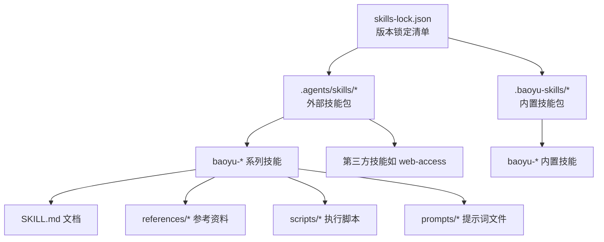
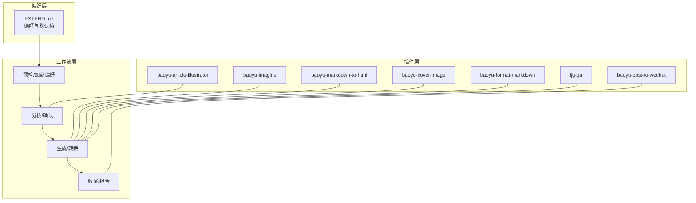
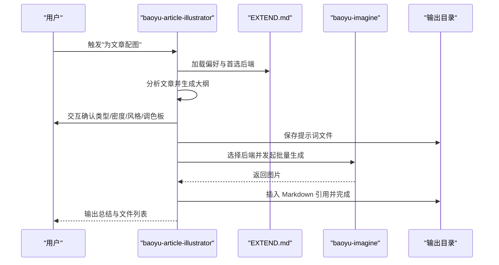
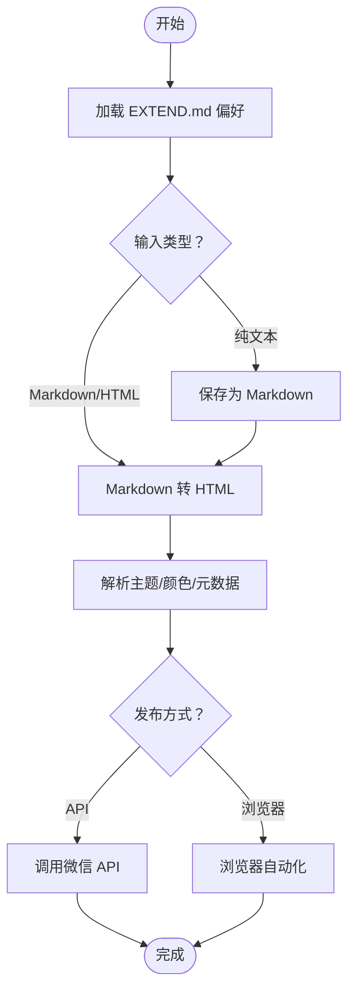
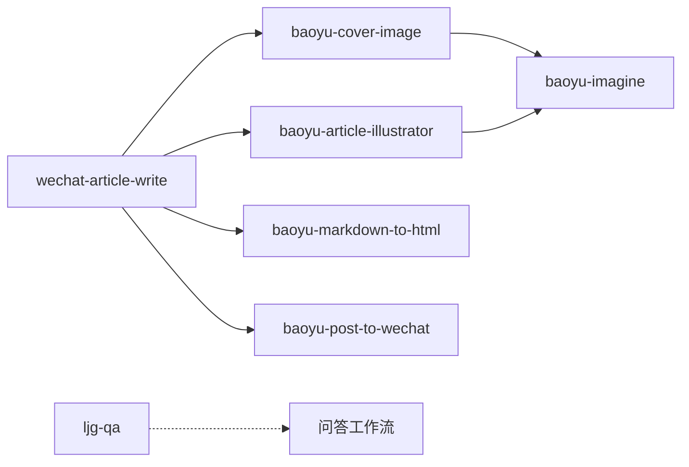

# 技能系统概览

<cite>
**本文档引用的文件**
- [skills-lock.json](file://skills-lock.json)
- [.agents/skills/wechat-article-write/EXTEND.md](file://.agents/skills/wechat-article-write/EXTEND.md)
- [.agents/skills/baoyu-article-illustrator/SKILL.md](file://.agents/skills/baoyu-article-illustrator/SKILL.md)
- [.agents/skills/baoyu-imagine/SKILL.md](file://.agents/skills/baoyu-imagine/SKILL.md)
- [.agents/skills/baoyu-post-to-wechat/SKILL.md](file://.agents/skills/baoyu-post-to-wechat/SKILL.md)
- [.agents/skills/baoyu-markdown-to-html/SKILL.md](file://.agents/skills/baoyu-markdown-to-html/SKILL.md)
- [.agents/skills/baoyu-cover-image/SKILL.md](file://.agents/skills/baoyu-cover-image/SKILL.md)
- [.agents/skills/baoyu-format-markdown/SKILL.md](file://.agents/skills/baoyu-format-markdown/SKILL.md)
- [.agents/skills/ljg-qa/SKILL.md](file://.agents/skills/ljg-qa/SKILL.md)
</cite>

## 更新摘要
**所做更改**
- 移除了翻译、URL转Markdown和多个专门技能的描述
- 新增了 ljg-qa 技能的详细介绍
- 更新了技能生态系统架构，强调核心能力聚焦
- 修订了技能分类体系和使用场景说明
- 更新了依赖关系分析和最佳实践指南

## 目录
1. [引言](#引言)
2. [项目结构](#项目结构)
3. [核心组件](#核心组件)
4. [架构总览](#架构总览)
5. [详细组件分析](#详细组件分析)
6. [依赖关系分析](#依赖关系分析)
7. [性能与可靠性考量](#性能与可靠性考量)
8. [故障排查指南](#故障排查指南)
9. [结论](#结论)
10. [附录](#附录)

## 引言
本文件面向 NTLx's Blog 的 AI 技能系统，提供从整体架构到具体实现的全景式概览。文档重点涵盖：
- 技能系统的模块化设计理念与技能组织结构
- EXTEND.md 配置文件格式与技能偏好管理
- 技能版本锁定机制与可复现性保障
- 技能扩展开发流程与最佳实践
- 技能分类体系与典型使用场景
- 技能集成方法与端到端工作流

**更新** 技能系统经过重大重组，移除了翻译、URL转Markdown等非核心功能，新增 ljg-qa 技能，使技能生态系统更加聚焦核心能力。

## 项目结构
技能系统以"技能包"为最小可分发单元，每个技能包内含：
- SKILL.md：技能元数据与使用说明
- references/*：参考文档、样式库、配置模板
- scripts/*：可执行脚本与工具
- prompts/*：可复现的提示词文件（部分技能）

技能清单由 skills-lock.json 统一锁定，确保版本稳定与来源可信。

**图表来源**
- [skills-lock.json](file://skills-lock.json)
- [.agents/skills/baoyu-article-illustrator/SKILL.md](file://.agents/skills/baoyu-article-illustrator/SKILL.md)

**章节来源**
- [skills-lock.json](file://skills-lock.json)

## 核心组件
- 技能包（Skill Package）
  - 每个技能包是一个独立功能单元，包含元数据、参考文档、脚本与提示词模板。
  - 元数据通过 SKILL.md 描述名称、版本、用途与运行要求。
- EXTEND.md 偏好配置
  - 各技能通过 EXTEND.md 管理用户偏好、默认参数与环境变量映射。
  - 支持多级优先级加载（项目、XDG、用户主目录），便于跨项目复用。
- 版本锁定与来源校验
  - skills-lock.json 记录技能来源、路径与哈希，确保可复现与安全。
- 工作流与交互
  - 技能遵循"预检 → 分析 → 确认 → 生成/转换 → 收尾"的通用流程。
  - 用户输入工具优先使用运行时提供的交互能力，必要时回退到明文问答。

**章节来源**
- [.agents/skills/baoyu-article-illustrator/SKILL.md](file://.agents/skills/baoyu-article-illustrator/SKILL.md)
- [.agents/skills/baoyu-imagine/SKILL.md](file://.agents/skills/baoyu-imagine/SKILL.md)
- [.agents/skills/baoyu-post-to-wechat/SKILL.md](file://.agents/skills/baoyu-post-to-wechat/SKILL.md)
- [.agents/skills/baoyu-markdown-to-html/SKILL.md](file://.agents/skills/baoyu-markdown-to-html/SKILL.md)
- [.agents/skills/baoyu-cover-image/SKILL.md](file://.agents/skills/baoyu-cover-image/SKILL.md)
- [.agents/skills/baoyu-format-markdown/SKILL.md](file://.agents/skills/baoyu-format-markdown/SKILL.md)
- [.agents/skills/ljg-qa/SKILL.md](file://.agents/skills/ljg-qa/SKILL.md)

## 架构总览
技能系统采用"插件化 + 偏好驱动 + 可复现工作流"的三层架构：
- 插件层：各技能包独立部署，通过 SKILL.md 暴露能力边界与接口契约。
- 偏好层：EXTEND.md 提供统一的配置入口，支持跨技能共享与继承（如主题、颜色）。
- 工作流层：标准化的"分析-确认-生成/转换-收尾"流程，结合提示词文件与脚本实现可复现输出。

**图表来源**
- [.agents/skills/baoyu-article-illustrator/SKILL.md](file://.agents/skills/baoyu-article-illustrator/SKILL.md)
- [.agents/skills/baoyu-imagine/SKILL.md](file://.agents/skills/baoyu-imagine/SKILL.md)
- [.agents/skills/baoyu-post-to-wechat/SKILL.md](file://.agents/skills/baoyu-post-to-wechat/SKILL.md)
- [.agents/skills/baoyu-markdown-to-html/SKILL.md](file://.agents/skills/baoyu-markdown-to-html/SKILL.md)
- [.agents/skills/baoyu-cover-image/SKILL.md](file://.agents/skills/baoyu-cover-image/SKILL.md)
- [.agents/skills/baoyu-format-markdown/SKILL.md](file://.agents/skills/baoyu-format-markdown/SKILL.md)
- [.agents/skills/ljg-qa/SKILL.md](file://.agents/skills/ljg-qa/SKILL.md)

## 详细组件分析

### EXTEND.md 配置体系
- 加载顺序与优先级
  - 项目级优先于 XDG，再优先于用户主目录；首次缺失时触发"首次设置"流程。
- 典型字段与作用域
  - 图像生成类：默认提供商、质量、尺寸、方言、模型、批处理并发与限速。
  - 内容处理类：主题、颜色、字体、标题保留策略、引用模式。
  - 问答提取类：输出路径、通知配置、文件命名规范。
- 跨技能共享
  - 主题与颜色可在多个技能间共享（如 Markdown 转换器会回读微信发布技能的默认主题）。

**章节来源**
- [.agents/skills/baoyu-imagine/SKILL.md](file://.agents/skills/baoyu-imagine/SKILL.md)
- [.agents/skills/baoyu-markdown-to-html/SKILL.md](file://.agents/skills/baoyu-markdown-to-html/SKILL.md)
- [.agents/skills/ljg-qa/SKILL.md](file://.agents/skills/ljg-qa/SKILL.md)

### 技能版本锁定机制
- 锁定清单
  - skills-lock.json 记录每个技能的来源仓库、类型、技能路径与计算哈希。
- 校验与复现
  - 通过哈希校验确保技能包未被篡改；版本变更需同步更新哈希。
- 依赖技能
  - 某些技能（如微信文章发布）依赖其他技能的 EXTEND.md，需在对应位置配置。

**章节来源**
- [skills-lock.json](file://skills-lock.json)
- [.agents/skills/wechat-article-write/EXTEND.md](file://.agents/skills/wechat-article-write/EXTEND.md)

### 图像生成类技能
- baoyu-article-illustrator
  - 三维度（类型×风格×调色板）生成一致性插图，强调"先分析、后确认、再生成"的可复现流程。
  - 强制保存提示词文件，作为可追溯与跨后端迁移的凭证。
- baoyu-imagine
  - 多提供商适配（OpenAI、Azure、Google、OpenRouter、DashScope、ZAI、MiniMax、Replicate 等）。
  - 支持参考图、批量生成、并发控制与重试策略。
- baoyu-cover-image
  - 五维（类型、调色板、渲染、文本、情绪）组合，支持多种宽高比与文字层级。

**图表来源**
- [.agents/skills/baoyu-article-illustrator/SKILL.md](file://.agents/skills/baoyu-article-illustrator/SKILL.md)
- [.agents/skills/baoyu-imagine/SKILL.md](file://.agents/skills/baoyu-imagine/SKILL.md)

**章节来源**
- [.agents/skills/baoyu-article-illustrator/SKILL.md](file://.agents/skills/baoyu-article-illustrator/SKILL.md)
- [.agents/skills/baoyu-imagine/SKILL.md](file://.agents/skills/baoyu-imagine/SKILL.md)
- [.agents/skills/baoyu-cover-image/SKILL.md](file://.agents/skills/baoyu-cover-image/SKILL.md)

### 内容处理类技能
- baoyu-format-markdown
  - 结构化排版与标题摘要生成，保持原文风格不变。
  - 支持仅排版修复、优化排版或保留原格式三种模式。
- baoyu-markdown-to-html
  - 将 Markdown 转为微信兼容的带样式 HTML，支持主题、颜色、字体与底部引用。
  - 可跨技能读取微信发布技能的默认主题，避免重复配置。

**章节来源**
- [.agents/skills/baoyu-format-markdown/SKILL.md](file://.agents/skills/baoyu-format-markdown/SKILL.md)
- [.agents/skills/baoyu-markdown-to-html/SKILL.md](file://.agents/skills/baoyu-markdown-to-html/SKILL.md)

### 发布自动化类技能
- baoyu-post-to-wechat
  - 支持"文章"和"贴图（图文）"两种发布形态，提供 API 与浏览器两种方式。
  - 支持多账号、评论控制、封面自动检测与前置检查。
- 微信文章写作（wechat-article-write）
  - 作为"编排技能"，协调封面生成、插图生成、Markdown 转 HTML 与微信发布。
  - 明确依赖的 EXTEND.md 项与环境变量位置。

**图表来源**
- [.agents/skills/baoyu-post-to-wechat/SKILL.md](file://.agents/skills/baoyu-post-to-wechat/SKILL.md)
- [.agents/skills/baoyu-markdown-to-html/SKILL.md](file://.agents/skills/baoyu-markdown-to-html/SKILL.md)
- [.agents/skills/wechat-article-write/EXTEND.md](file://.agents/skills/wechat-article-write/EXTEND.md)

**章节来源**
- [.agents/skills/baoyu-post-to-wechat/SKILL.md](file://.agents/skills/baoyu-post-to-wechat/SKILL.md)
- [.agents/skills/wechat-article-write/EXTEND.md](file://.agents/skills/wechat-article-write/EXTEND.md)

### 专用技能
- ljg-qa
  - 专业的问答提取技能，将文章/论文/书籍的核心观点拆分为"为什么—怎么—边界"的问答链。
  - 强调思想的几何化表达，每个回答都有严格的四段式结构：结论、形式化、论证步骤、边界。
  - 适用于深度学习和知识梳理场景，帮助读者复现作者的完整推理路径。

**更新** 新增 ljg-qa 技能，专注于高质量问答提取和知识结构化。

**章节来源**
- [.agents/skills/ljg-qa/SKILL.md](file://.agents/skills/ljg-qa/SKILL.md)

## 依赖关系分析
- 技能间依赖
  - wechat-article-write 依赖 baoyu-cover-image、baoyu-article-illustrator、baoyu-markdown-to-html、baoyu-post-to-wechat 的 EXTEND.md 与环境变量。
- 外部依赖
  - 图像生成类技能依赖各提供商 API，需在 EXTEND.md 或环境变量中配置密钥。
- 版本与来源
  - skills-lock.json 统一记录来源仓库、分支/标签与哈希，避免漂移。

**图表来源**
- [.agents/skills/wechat-article-write/EXTEND.md](file://.agents/skills/wechat-article-write/EXTEND.md)
- [skills-lock.json](file://skills-lock.json)

**章节来源**
- [.agents/skills/wechat-article-write/EXTEND.md](file://.agents/skills/wechat-article-write/EXTEND.md)
- [skills-lock.json](file://skills-lock.json)

## 性能与可靠性考量
- 批量与并发
  - 图像生成类技能支持批处理与并发控制，合理设置最大工作者数量与提供商限速，避免突发请求。
- 可复现性
  - 强制保存提示词文件，确保同一提示词在不同后端可复现；失败自动重试一次。
- 前置检查
  - 发布前进行环境与权限检查，减少运行期错误。
- 配置优先级
  - CLI > EXTEND.md > 环境变量 > 项目级 EXTEND.md > XDG > 用户主目录，清晰的覆盖顺序降低歧义。

**章节来源**
- [.agents/skills/baoyu-imagine/SKILL.md](file://.agents/skills/baoyu-imagine/SKILL.md)
- [.agents/skills/baoyu-post-to-wechat/SKILL.md](file://.agents/skills/baoyu-post-to-wechat/SKILL.md)

## 故障排查指南
- 缺少 EXTEND.md
  - 部分技能会在首次使用时触发"首次设置"，请按提示完成配置并保存 EXTEND.md。
- API 密钥缺失
  - 图像生成与微信发布均需相应密钥，检查 EXTEND.md 与环境变量路径。
- 发布失败
  - 检查微信账号登录状态、评论控制与封面图片；查看前置检查输出。
- 提示词不生效
  - 确保已先保存提示词文件再调用后端；若更换后端，请使用已保存的提示词文件以保证可复现。

**章节来源**
- [.agents/skills/baoyu-imagine/SKILL.md](file://.agents/skills/baoyu-imagine/SKILL.md)
- [.agents/skills/baoyu-post-to-wechat/SKILL.md](file://.agents/skills/baoyu-post-to-wechat/SKILL.md)

## 结论
NTLx's Blog 的 AI 技能系统通过"可插拔技能包 + 偏好驱动 + 可复现工作流"的设计，实现了从内容创作到发布的全链路自动化。EXTEND.md 提供统一的配置入口，skills-lock.json 确保版本与来源可控，而标准化的工作流与提示词文件则保障了结果的一致性与可追溯性。

**更新** 经过重大重组，技能系统现在更加聚焦核心能力，移除了非必要的功能，新增了 ljg-qa 专业问答提取技能，提升了整体的专业性和实用性。建议在团队内推广该体系，持续完善参考文档与示例，提升协作效率与交付质量。

## 附录
- 使用场景与集成建议
  - 文章配图：baoyu-article-illustrator + baoyu-imagine，配合微信封面生成与发布。
  - 内容排版：baoyu-format-markdown + baoyu-markdown-to-html，统一风格与引用。
  - 多账号发布：baoyu-post-to-wechat，结合多账号配置与前置检查。
  - 问答提取：ljg-qa，用于深度学习和知识梳理，生成高质量问答链。
- 最佳实践
  - 在项目根目录维护一份基础 EXTEND.md，并通过 XDG 或用户主目录共享常用偏好。
  - 对长内容翻译启用分块与术语提取，确保术语一致性。
  - 为每次生成保存提示词文件，便于回溯与跨后端迁移。
  - 使用 skills-lock.json 固定依赖版本，定期审查与更新。
  - 利用 ljg-qa 技能进行深度内容分析，生成结构化的问答材料。