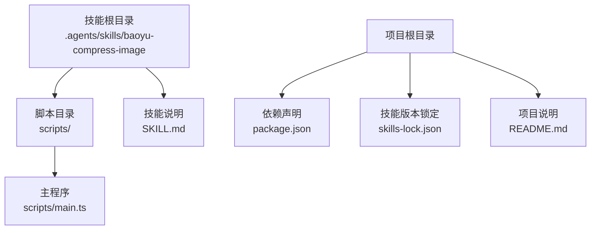
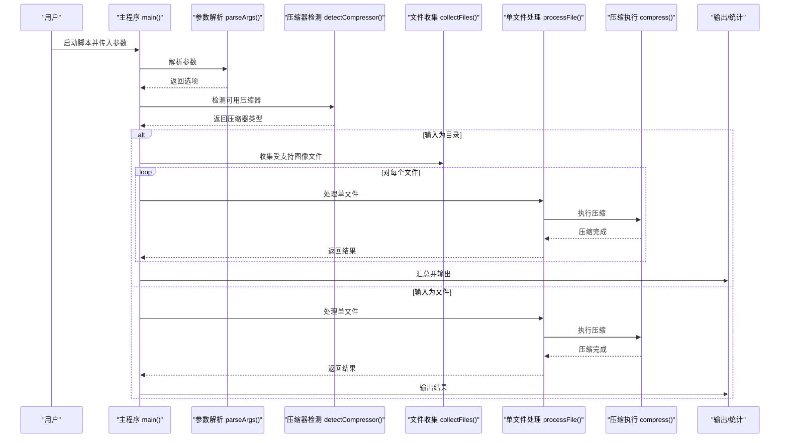
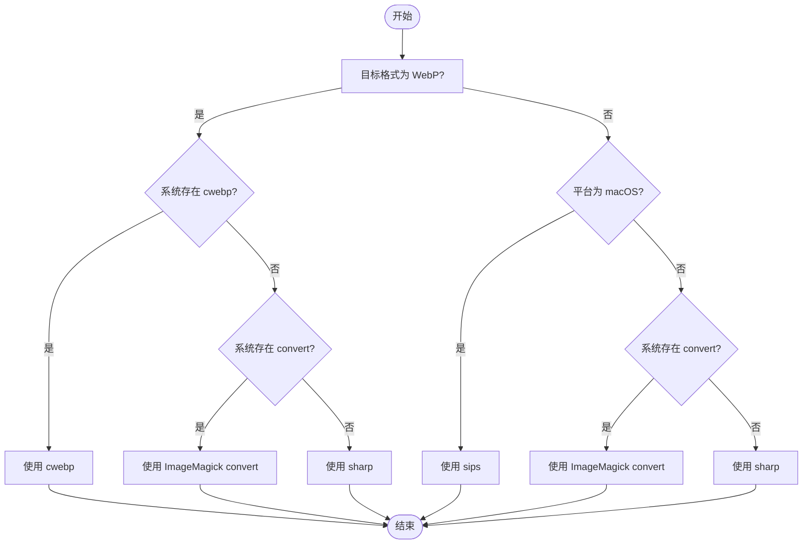
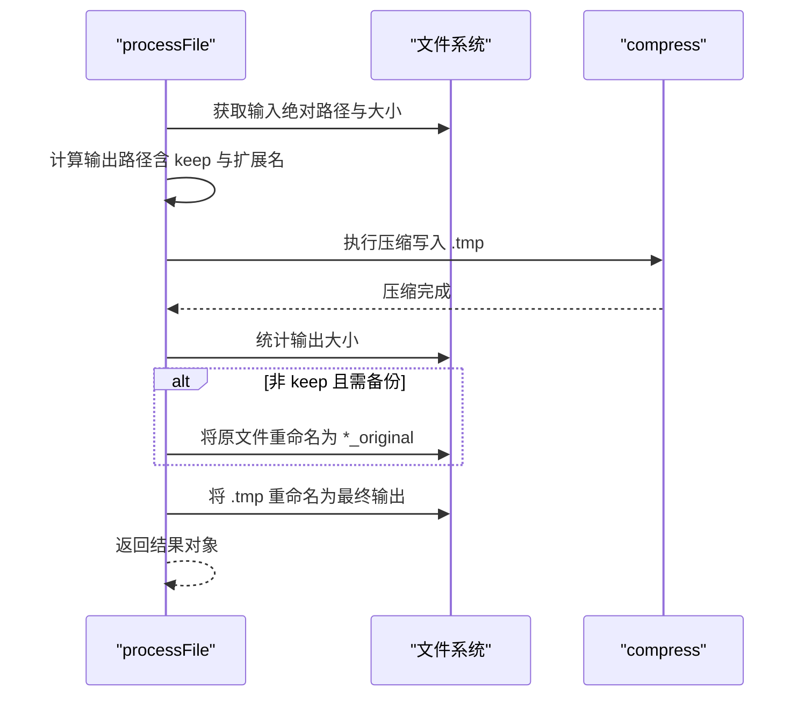
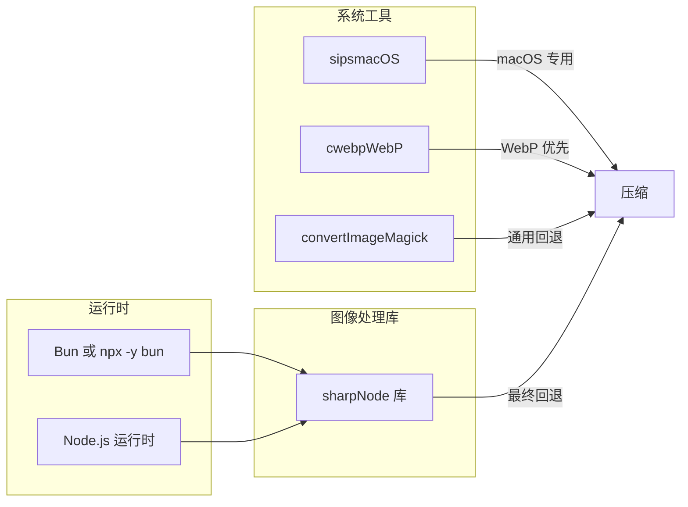

# 图像压缩技能

<cite>
**本文引用的文件**
- [main.ts](file://.agents/skills/baoyu-compress-image/scripts/main.ts)
- [SKILL.md](file://.agents/skills/baoyu-compress-image/SKILL.md)
- [package.json](file://package.json)
- [skills-lock.json](file://skills-lock.json)
- [README.md](file://README.md)
</cite>

## 目录
1. [简介](#简介)
2. [项目结构](#项目结构)
3. [核心组件](#核心组件)
4. [架构总览](#架构总览)
5. [详细组件分析](#详细组件分析)
6. [依赖关系分析](#依赖关系分析)
7. [性能考虑](#性能考虑)
8. [故障排查指南](#故障排查指南)
9. [结论](#结论)
10. [附录](#附录)

## 简介
本技能提供基于命令行的图像压缩工具，支持将图像转换为 WebP（默认）或 PNG，并在可用时优先选择系统原生或高性能工具（如 macOS 的 sips、cwebp、ImageMagick 的 convert、以及 Node.js 的 sharp）。它支持单文件与目录批量处理、递归扫描、质量参数控制、输出格式与质量配置、原始文件保留策略、JSON 汇总输出，以及错误处理与进度反馈。

## 项目结构
技能位于 .agents/skills/baoyu-compress-image 目录下，核心逻辑集中在 scripts/main.ts，技能元数据与使用说明位于 SKILL.md。

图表来源
- [.agents/skills/baoyu-compress-image/scripts/main.ts](file://.agents/skills/baoyu-compress-image/scripts/main.ts)
- [.agents/skills/baoyu-compress-image/SKILL.md](file://.agents/skills/baoyu-compress-image/SKILL.md)
- [package.json](file://package.json)
- [skills-lock.json](file://skills-lock.json)
- [README.md](file://README.md)

章节来源
- [.agents/skills/baoyu-compress-image/scripts/main.ts](file://.agents/skills/baoyu-compress-image/scripts/main.ts)
- [.agents/skills/baoyu-compress-image/SKILL.md](file://.agents/skills/baoyu-compress-image/SKILL.md)
- [package.json](file://package.json)
- [skills-lock.json](file://skills-lock.json)
- [README.md](file://README.md)

## 核心组件
- 命令行参数解析与帮助输出：支持输入路径、输出路径、目标格式、质量、是否保留原文件、是否递归、是否 JSON 输出等选项。
- 压缩器自动检测：根据目标格式与平台环境自动选择最优工具（sips → cwebp → ImageMagick → sharp）。
- 批量处理：遍历目录，收集受支持扩展名的图像文件，逐个压缩并汇总统计。
- 进度与结果：非 JSON 模式下逐文件打印压缩前后大小与节省百分比；JSON 模式下输出每文件结果与总体摘要。
- 错误处理：对无效参数、不可用工具、子进程失败等情况进行提示与退出码控制。

章节来源
- [.agents/skills/baoyu-compress-image/scripts/main.ts](file://.agents/skills/baoyu-compress-image/scripts/main.ts)
- [.agents/skills/baoyu-compress-image/SKILL.md](file://.agents/skills/baoyu-compress-image/SKILL.md)

## 架构总览
整体流程由“参数解析 → 压缩器选择 → 单文件/批量处理 → 结果输出”构成。下图展示关键函数之间的调用关系与数据流。

图表来源
- [.agents/skills/baoyu-compress-image/scripts/main.ts](file://.agents/skills/baoyu-compress-image/scripts/main.ts)

## 详细组件分析

### 命令行接口与参数解析
- 支持的选项
  - 输入路径：必填，可为文件或目录。
  - 输出路径：-o/--output，指定输出文件或目录。
  - 目标格式：-f/--format，取值 webp、png、jpeg（jpg 会被映射为 jpeg）。
  - 质量：-q/--quality，0-100，默认 80。
  - 保留原文件：-k/--keep。
  - 递归处理：-r/--recursive。
  - JSON 输出：--json。
  - 帮助：-h/--help。
- 参数校验与默认值：对格式合法性、质量范围进行检查；未显式指定时采用默认值。
- 帮助信息：统一输出使用说明与选项列表。

章节来源
- [.agents/skills/baoyu-compress-image/scripts/main.ts](file://.agents/skills/baoyu-compress-image/scripts/main.ts)
- [.agents/skills/baoyu-compress-image/SKILL.md](file://.agents/skills/baoyu-compress-image/SKILL.md)

### 压缩器选择与回退策略
- 选择顺序：sips → cwebp → ImageMagick → sharp。
- WebP 优先：当目标为 WebP 且系统存在 cwebp 时优先使用 cwebp；否则尝试 ImageMagick 的 convert；最后回退到 Node.js 的 sharp。
- 非 WebP：在 macOS 上优先 sips；否则尝试 ImageMagick；最终回退 sharp。
- 平台差异：macOS 上若非 WebP 默认走 sips，有利于系统集成与兼容性。

图表来源
- [.agents/skills/baoyu-compress-image/scripts/main.ts](file://.agents/skills/baoyu-compress-image/scripts/main.ts)

章节来源
- [.agents/skills/baoyu-compress-image/scripts/main.ts](file://.agents/skills/baoyu-compress-image/scripts/main.ts)

### 单文件处理流程
- 绝对路径解析与输入大小统计。
- 输出路径生成：若指定输出则使用；否则与输入同目录并替换扩展名；若启用 keep 且格式未变化，则追加后缀区分。
- 临时文件写入：先写入 .tmp 文件，成功后再原子重命名为最终输出，避免部分写入导致的损坏。
- 原文件处理：在非 keep 且输入非输出的情况下，将原文件重命名为带 _original 后缀，便于恢复。
- 结果对象：包含输入/输出路径、输入输出大小、压缩比与所用压缩器。

图表来源
- [.agents/skills/baoyu-compress-image/scripts/main.ts](file://.agents/skills/baoyu-compress-image/scripts/main.ts)

章节来源
- [.agents/skills/baoyu-compress-image/scripts/main.ts](file://.agents/skills/baoyu-compress-image/scripts/main.ts)

### 批量处理与进度输出
- 目录扫描：递归或非递归收集受支持扩展名的文件（.png、.jpg、.jpeg、.webp、.gif、.tiff）。
- 进度反馈：逐文件输出压缩前/后大小与节省百分比；JSON 模式下输出每文件明细与总体统计。
- 错误恢复：单文件处理异常不影响其他文件继续处理；最终汇总统计不受个别失败影响。

章节来源
- [.agents/skills/baoyu-compress-image/scripts/main.ts](file://.agents/skills/baoyu-compress-image/scripts/main.ts)

### 支持的图像格式与特性
- 输入格式：png、jpg/jpeg、webp、gif、tiff。
- 输出格式：webp、png、jpeg（jpg 作为 jpeg 的别名）。
- 质量控制：所有格式均支持 0-100 的质量参数；不同压缩器对质量的理解与表现略有差异，建议结合实际效果微调。
- 平台差异：macOS 上 sips 对 jpeg/webp 有良好支持；cwebp 在 WebP 压缩上通常更高效；ImageMagick 提供广泛兼容性；sharp 在 Node 环境下性能稳定。

章节来源
- [.agents/skills/baoyu-compress-image/scripts/main.ts](file://.agents/skills/baoyu-compress-image/scripts/main.ts)
- [.agents/skills/baoyu-compress-image/SKILL.md](file://.agents/skills/baoyu-compress-image/SKILL.md)

### 压缩质量评估与视觉对比
- 量化指标：输入/输出文件大小、压缩节省百分比（1 - 输出/输入）。
- 视觉对比：建议在相同质量参数下对比压缩前后图像细节、噪点与伪影；对于纹理丰富图像，适当提高质量可减少可见失真。
- 推荐实践：WebP 适合网页场景；PNG 适合需要无损或透明通道的图像；JPEG 适合照片类图像。根据用途选择格式与质量阈值。

章节来源
- [.agents/skills/baoyu-compress-image/scripts/main.ts](file://.agents/skills/baoyu-compress-image/scripts/main.ts)

### 命令行参数说明与使用示例
- 基本用法：通过 Bun 或 npx -y bun 运行脚本，传入输入路径与可选参数。
- 示例：
  - 单文件 WebP 压缩（替换原文件）
  - 保持 PNG 格式并保留原文件
  - 递归处理目录并调整质量
  - JSON 输出用于自动化集成
- 输出示例：显示输入/输出路径、大小与节省百分比；JSON 模式输出结构化结果与汇总。

章节来源
- [.agents/skills/baoyu-compress-image/SKILL.md](file://.agents/skills/baoyu-compress-image/SKILL.md)
- [.agents/skills/baoyu-compress-image/scripts/main.ts](file://.agents/skills/baoyu-compress-image/scripts/main.ts)

## 依赖关系分析
- 运行时依赖
  - Bun 或 npx -y bun：脚本运行环境。
  - sharp（Node.js 库）：作为最终回退方案，提供跨平台的高质量图像处理能力。
- 外部工具
  - macOS：sips（系统自带），适合快速处理。
  - WebP：cwebp（WebP 官方工具），适合 WebP 压缩。
  - 通用：ImageMagick 的 convert（广泛可用），提供多种格式支持。
- 技能版本管理
  - skills-lock.json 记录了该技能的来源与哈希，确保版本一致性与可追溯性。

图表来源
- [.agents/skills/baoyu-compress-image/scripts/main.ts](file://.agents/skills/baoyu-compress-image/scripts/main.ts)
- [package.json](file://package.json)
- [skills-lock.json](file://skills-lock.json)

章节来源
- [.agents/skills/baoyu-compress-image/scripts/main.ts](file://.agents/skills/baoyu-compress-image/scripts/main.ts)
- [package.json](file://package.json)
- [skills-lock.json](file://skills-lock.json)
- [README.md](file://README.md)

## 性能考虑
- 工具选择优先级：优先使用系统原生或专用工具（sips、cwebp）可获得更好的吞吐与更低的 CPU 开销。
- 批处理策略：递归扫描会遍历子目录，建议在大目录中谨慎使用，必要时限制范围或分批执行。
- 质量参数：质量越高，压缩时间越长且文件越大；建议从默认值开始，逐步微调以平衡体积与画质。
- I/O 优化：使用临时文件写入并在成功后重命名，避免部分写入导致的中间状态与后续失败。
- 内存管理：Node.js 环境下的 sharp 会在处理过程中按需加载与解码图像，建议在内存受限环境下控制并发与图像尺寸。

章节来源
- [.agents/skills/baoyu-compress-image/scripts/main.ts](file://.agents/skills/baoyu-compress-image/scripts/main.ts)
- [package.json](file://package.json)

## 故障排查指南
- 输入不存在：当输入路径不存在时，脚本会报错并退出。
- 无效参数：格式不在允许集合内、质量超出 0-100 范围时会提示并退出。
- 无受支持图像：目录扫描未发现任何受支持扩展名文件时会提示并退出。
- 子进程失败：各压缩器调用返回非零退出码或抛出错误时，脚本会捕获并输出错误信息。
- 权限问题：确保对输入文件具有读取权限，对输出目录具有写入权限。
- 工具缺失：若所需外部工具未安装，脚本会回退到下一个可用工具；若全部缺失，可能无法完成压缩。

章节来源
- [.agents/skills/baoyu-compress-image/scripts/main.ts](file://.agents/skills/baoyu-compress-image/scripts/main.ts)

## 结论
本技能通过“自动工具选择 + 批量处理 + 质量控制 + 结果汇总”的设计，在不同平台与场景下提供了稳定高效的图像压缩能力。建议结合业务需求选择合适的格式与质量参数，并在生产环境中配合 JSON 输出进行自动化集成与监控。

## 附录
- 使用建议
  - Web 场景优先 WebP；需要无损或透明通道使用 PNG；照片类图像可考虑 JPEG。
  - 初次使用建议从默认质量 80 开始，根据视觉效果与体积要求微调。
  - 大规模批量处理时，优先安装 cwebp 与 ImageMagick，以获得更快的处理速度。
- 最佳实践
  - 保留原文件（--keep）以便回滚与对比。
  - 使用 JSON 输出对接 CI/CD 或监控系统，记录压缩效果与耗时。
  - 在 macOS 上优先使用 sips，Windows/Linux 上优先使用 cwebp 或 ImageMagick。