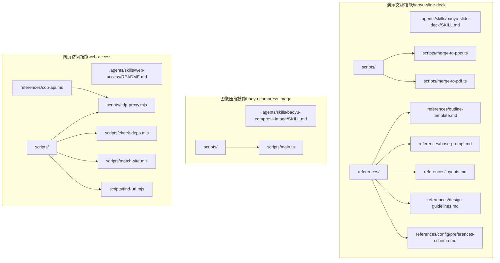
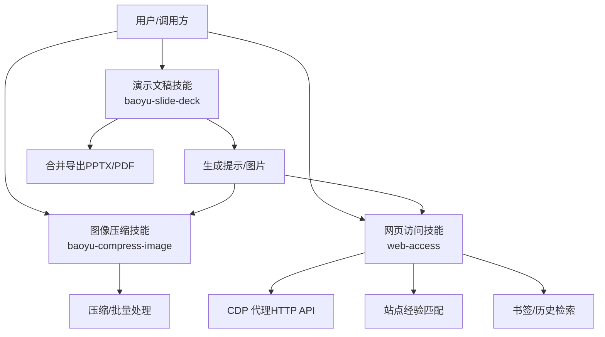
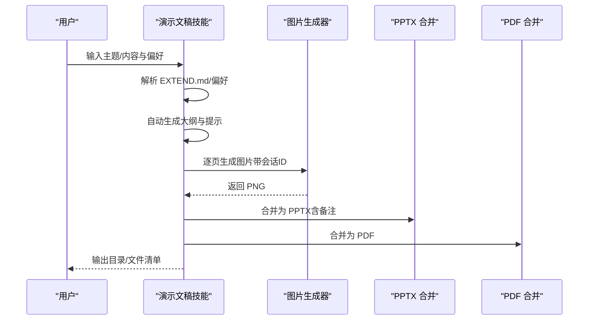
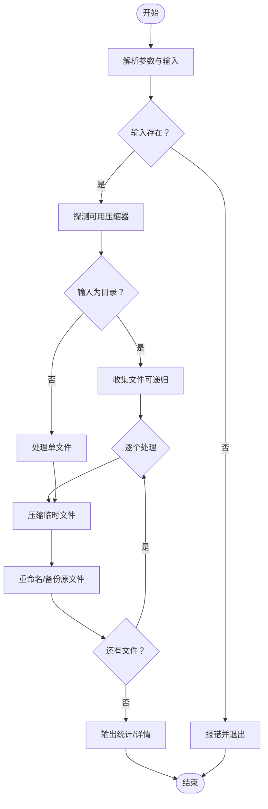
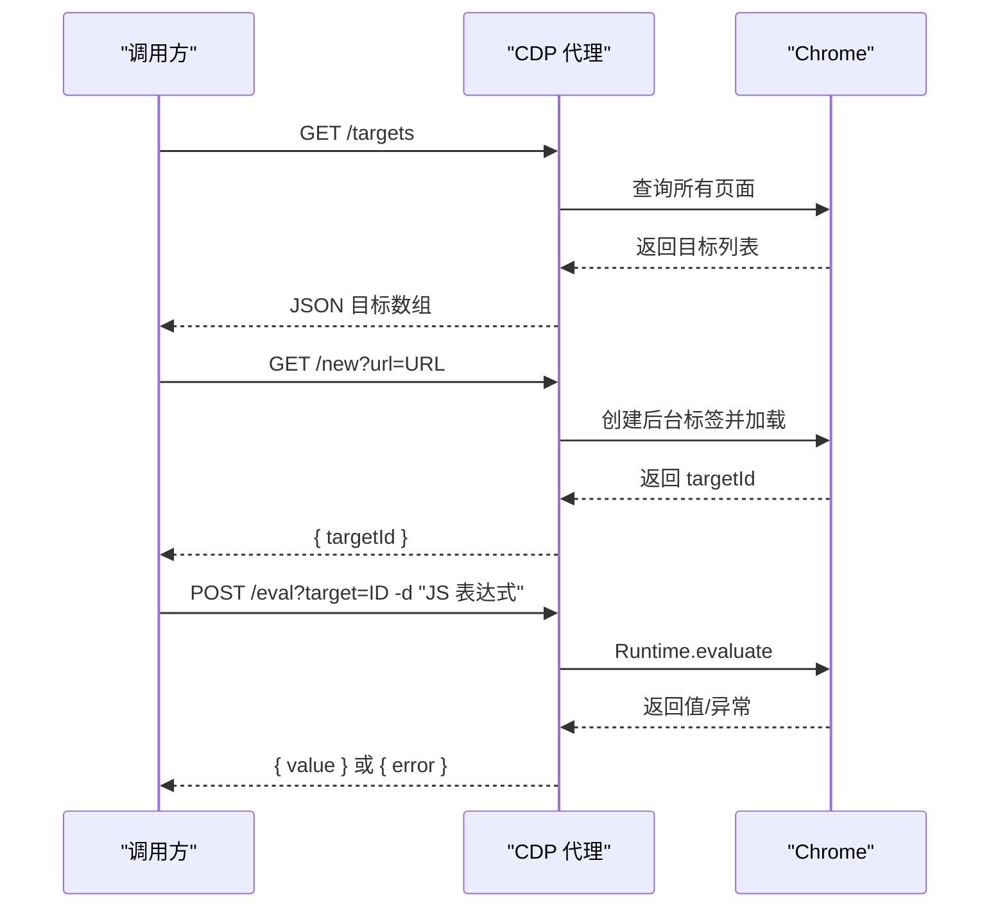
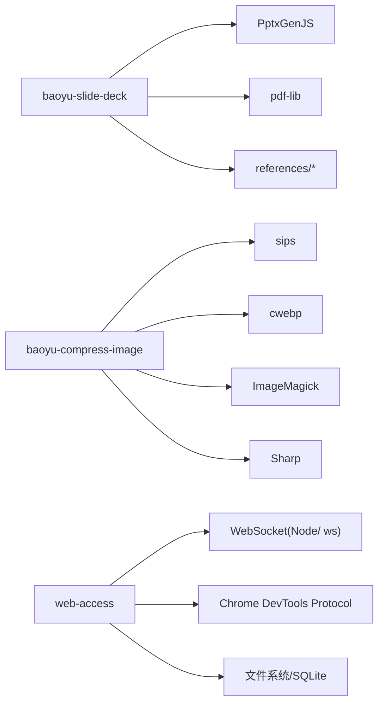

# 演示文稿技能

<cite>
**本文引用的文件**
- [SKILL.md（baoyu-slide-deck）](file://.agents/skills/baoyu-slide-deck/SKILL.md)
- [merge-to-pdf.ts](file://.agents/skills/baoyu-slide-deck/scripts/merge-to-pdf.ts)
- [merge-to-pptx.ts](file://.agents/skills/baoyu-slide-deck/scripts/merge-to-pptx.ts)
- [outline-template.md](file://.agents/skills/baoyu-slide-deck/references/outline-template.md)
- [base-prompt.md](file://.agents/skills/baoyu-slide-deck/references/base-prompt.md)
- [layouts.md](file://.agents/skills/baoyu-slide-deck/references/layouts.md)
- [design-guidelines.md](file://.agents/skills/baoyu-slide-deck/references/design-guidelines.md)
- [preferences-schema.md](file://.agents/skills/baoyu-slide-deck/references/config/preferences-schema.md)
- [SKILL.md（baoyu-compress-image）](file://.agents/skills/baoyu-compress-image/SKILL.md)
- [main.ts（baoyu-compress-image）](file://.agents/skills/baoyu-compress-image/scripts/main.ts)
- [README.md（web-access）](file://.agents/skills/web-access/README.md)
- [cdp-proxy.mjs](file://.agents/skills/web-access/scripts/cdp-proxy.mjs)
- [check-deps.mjs](file://.agents/skills/web-access/scripts/check-deps.mjs)
- [match-site.mjs](file://.agents/skills/web-access/scripts/match-site.mjs)
- [find-url.mjs](file://.agents/skills/web-access/scripts/find-url.mjs)
- [cdp-api.md（web-access）](file://.agents/skills/web-access/references/cdp-api.md)
</cite>

## 目录
1. [简介](#简介)
2. [项目结构](#项目结构)
3. [核心组件](#核心组件)
4. [架构总览](#架构总览)
5. [详细组件分析](#详细组件分析)
6. [依赖关系分析](#依赖关系分析)
7. [性能考量](#性能考量)
8. [故障排查指南](#故障排查指南)
9. [结论](#结论)
10. [附录](#附录)

## 简介
本文件面向 NTLx's Blog 的演示文稿技能模块，系统化梳理以下三个技能：
- baoyu-slide-deck：演示文稿生成与合并导出（PPTX/PDF），包含风格系统、布局模板、样式提示与工作流。
- baoyu-compress-image：图像压缩与批量处理，自动选择最优工具链（sips/cwebp/ImageMagick/Sharp）。
- web-access：网页访问与 CDP 浏览器自动化，提供站点匹配与本地 Chrome 资源检索。

文档覆盖功能设计、数据流、处理逻辑、集成方式、最佳实践与性能优化建议，并提供可视化图示帮助理解。

## 项目结构
演示文稿技能相关目录与关键文件概览如下：

图表来源
- [.agents/skills/baoyu-slide-deck/SKILL.md](file://.agents/skills/baoyu-slide-deck/SKILL.md)
- [.agents/skills/baoyu-slide-deck/scripts/merge-to-pptx.ts](file://.agents/skills/baoyu-slide-deck/scripts/merge-to-pptx.ts)
- [.agents/skills/baoyu-slide-deck/scripts/merge-to-pdf.ts](file://.agents/skills/baoyu-slide-deck/scripts/merge-to-pdf.ts)
- [.agents/skills/baoyu-slide-deck/references/outline-template.md](file://.agents/skills/baoyu-slide-deck/references/outline-template.md)
- [.agents/skills/baoyu-slide-deck/references/base-prompt.md](file://.agents/skills/baoyu-slide-deck/references/base-prompt.md)
- [.agents/skills/baoyu-slide-deck/references/layouts.md](file://.agents/skills/baoyu-slide-deck/references/layouts.md)
- [.agents/skills/baoyu-slide-deck/references/design-guidelines.md](file://.agents/skills/baoyu-slide-deck/references/design-guidelines.md)
- [.agents/skills/baoyu-slide-deck/references/config/preferences-schema.md](file://.agents/skills/baoyu-slide-deck/references/config/preferences-schema.md)
- [.agents/skills/baoyu-compress-image/SKILL.md](file://.agents/skills/baoyu-compress-image/SKILL.md)
- [.agents/skills/baoyu-compress-image/scripts/main.ts](file://.agents/skills/baoyu-compress-image/scripts/main.ts)
- [.agents/skills/web-access/README.md](file://.agents/skills/web-access/README.md)
- [.agents/skills/web-access/scripts/cdp-proxy.mjs](file://.agents/skills/web-access/scripts/cdp-proxy.mjs)
- [.agents/skills/web-access/scripts/check-deps.mjs](file://.agents/skills/web-access/scripts/check-deps.mjs)
- [.agents/skills/web-access/scripts/match-site.mjs](file://.agents/skills/web-access/scripts/match-site.mjs)
- [.agents/skills/web-access/scripts/find-url.mjs](file://.agents/skills/web-access/scripts/find-url.mjs)
- [.agents/skills/web-access/references/cdp-api.md](file://.agents/skills/web-access/references/cdp-api.md)

章节来源
- [.agents/skills/baoyu-slide-deck/SKILL.md](file://.agents/skills/baoyu-slide-deck/SKILL.md)
- [.agents/skills/baoyu-compress-image/SKILL.md](file://.agents/skills/baoyu-compress-image/SKILL.md)
- [.agents/skills/web-access/README.md](file://.agents/skills/web-access/README.md)

## 核心组件
- 演示文稿生成器（baoyu-slide-deck）
  - 风格系统：17 套预设 + 自定义维度（纹理/情绪/字体/密度），自动信号匹配与幻灯片数量启发式估算。
  - 工作流：确认 → 生成大纲 → 评审大纲 → 生成提示 → 评审提示 → 生成图片 → 合并导出 → 总结。
  - 合并导出：PPTX（嵌入图片与备注）、PDF（逐页嵌入）。
- 图像压缩器（baoyu-compress-image）
  - 自动选择最优工具链：sips → cwebp → ImageMagick → Sharp；支持 WebP/PNG/JPEG，质量控制与批量处理。
- 网页访问器（web-access）
  - CDP 代理直连 Chrome，提供 HTTP API 实现导航、点击、滚动、截图、文件上传等；支持本地书签/历史检索与站点经验匹配。

章节来源
- [.agents/skills/baoyu-slide-deck/SKILL.md](file://.agents/skills/baoyu-slide-deck/SKILL.md)
- [.agents/skills/baoyu-compress-image/SKILL.md](file://.agents/skills/baoyu-compress-image/SKILL.md)
- [.agents/skills/web-access/README.md](file://.agents/skills/web-access/README.md)

## 架构总览
下图展示三个技能的高层交互与职责边界：

图表来源
- [.agents/skills/baoyu-slide-deck/SKILL.md](file://.agents/skills/baoyu-slide-deck/SKILL.md)
- [.agents/skills/baoyu-compress-image/SKILL.md](file://.agents/skills/baoyu-compress-image/SKILL.md)
- [.agents/skills/web-access/README.md](file://.agents/skills/web-access/README.md)

## 详细组件分析

### 组件一：演示文稿生成与合并导出（baoyu-slide-deck）
- 功能要点
  - 风格系统：预设映射维度，自定义维度组合；基于内容信号自动挑选预设；幻灯片数量启发式估算。
  - 工作流：Step 1~9 的完整清单，支持“仅大纲”“仅提示”“仅图片”“重生成指定页”等选项。
  - 合并导出：PPTX（嵌入图片与备注）、PDF（逐页嵌入）。
- 数据结构与复杂度
  - 大纲与提示索引：线性扫描与排序（按编号），时间复杂度 O(N log N)，空间 O(N)。
  - 合并导出：顺序遍历图片，嵌入 PDF/PPTX，I/O 为主，整体 O(N)。
- 依赖关系
  - merge-to-pptx.ts 依赖 PptxGenJS；merge-to-pdf.ts 依赖 pdf-lib。
  - 基础提示与布局参考来自 references 目录。
- 错误处理
  - 缺少目录/图片时给出明确错误；参数解析失败提示用法；备份规则保护用户修改。
- 性能与可用性
  - 图片生成阶段支持会话 ID 复用以保持一致性；进度报告与自动重试一次提升体验。

图表来源
- [.agents/skills/baoyu-slide-deck/SKILL.md](file://.agents/skills/baoyu-slide-deck/SKILL.md)
- [.agents/skills/baoyu-slide-deck/scripts/merge-to-pptx.ts](file://.agents/skills/baoyu-slide-deck/scripts/merge-to-pptx.ts)
- [.agents/skills/baoyu-slide-deck/scripts/merge-to-pdf.ts](file://.agents/skills/baoyu-slide-deck/scripts/merge-to-pdf.ts)

章节来源
- [.agents/skills/baoyu-slide-deck/SKILL.md](file://.agents/skills/baoyu-slide-deck/SKILL.md)
- [.agents/skills/baoyu-slide-deck/scripts/merge-to-pptx.ts](file://.agents/skills/baoyu-slide-deck/scripts/merge-to-pptx.ts)
- [.agents/skills/baoyu-slide-deck/scripts/merge-to-pdf.ts](file://.agents/skills/baoyu-slide-deck/scripts/merge-to-pdf.ts)
- [.agents/skills/baoyu-slide-deck/references/outline-template.md](file://.agents/skills/baoyu-slide-deck/references/outline-template.md)
- [.agents/skills/baoyu-slide-deck/references/base-prompt.md](file://.agents/skills/baoyu-slide-deck/references/base-prompt.md)
- [.agents/skills/baoyu-slide-deck/references/layouts.md](file://.agents/skills/baoyu-slide-deck/references/layouts.md)
- [.agents/skills/baoyu-slide-deck/references/design-guidelines.md](file://.agents/skills/baoyu-slide-deck/references/design-guidelines.md)
- [.agents/skills/baoyu-slide-deck/references/config/preferences-schema.md](file://.agents/skills/baoyu-slide-deck/references/config/preferences-schema.md)

### 组件二：图像压缩与批量处理（baoyu-compress-image）
- 功能要点
  - 自动选择压缩器：WebP 优先 cwebp，其次 convert，最后 Sharp；非 macOS 下优先 sips。
  - 支持单文件/目录、递归、保留原图、JSON 输出汇总统计。
  - 质量控制：0–100，格式转换，输出路径策略。
- 算法与流程
  - 命令存在性探测 → 选择压缩器 → 临时文件写入 → 原文件备份/重命名 → 统计与输出。
- 依赖关系
  - 运行时依赖外部命令（sips/cwebp/convert）或 Node.js 库（Sharp）。
- 错误处理
  - 子进程失败抛出错误；非法参数打印帮助；目录无支持文件提示。

图表来源
- [.agents/skills/baoyu-compress-image/scripts/main.ts](file://.agents/skills/baoyu-compress-image/scripts/main.ts)

章节来源
- [.agents/skills/baoyu-compress-image/SKILL.md](file://.agents/skills/baoyu-compress-image/SKILL.md)
- [.agents/skills/baoyu-compress-image/scripts/main.ts](file://.agents/skills/baoyu-compress-image/scripts/main.ts)

### 组件三：网页访问与 CDP 自动化（web-access）
- 功能要点
  - CDP 代理：HTTP API 操作 Chrome（新建/关闭标签、导航、后退、滚动、截图、执行脚本、点击、文件上传）。
  - 环境检查：自动发现 Chrome 调试端口、启动代理、健康检查。
  - 站点经验：根据用户输入匹配站点经验文件，输出对应经验正文。
  - 本地资源检索：从 Chrome 书签/历史中检索 URL，支持关键词、时间窗、排序与多 Profile。
- 数据流与 API
  - /targets → /new → /navigate → /eval → /click → /clickAt → /setFiles → /scroll → /screenshot → /close
  - /health 用于健康检查与状态查询。

图表来源
- [.agents/skills/web-access/scripts/cdp-proxy.mjs](file://.agents/skills/web-access/scripts/cdp-proxy.mjs)
- [.agents/skills/web-access/references/cdp-api.md](file://.agents/skills/web-access/references/cdp-api.md)

章节来源
- [.agents/skills/web-access/README.md](file://.agents/skills/web-access/README.md)
- [.agents/skills/web-access/scripts/cdp-proxy.mjs](file://.agents/skills/web-access/scripts/cdp-proxy.mjs)
- [.agents/skills/web-access/scripts/check-deps.mjs](file://.agents/skills/web-access/scripts/check-deps.mjs)
- [.agents/skills/web-access/scripts/match-site.mjs](file://.agents/skills/web-access/scripts/match-site.mjs)
- [.agents/skills/web-access/scripts/find-url.mjs](file://.agents/skills/web-access/scripts/find-url.mjs)
- [.agents/skills/web-access/references/cdp-api.md](file://.agents/skills/web-access/references/cdp-api.md)

## 依赖关系分析
- 演示文稿技能
  - merge-to-pptx.ts 依赖 PptxGenJS；merge-to-pdf.ts 依赖 pdf-lib。
  - 工作流依赖 references 下的 outline-template、base-prompt、layouts、design-guidelines、preferences-schema。
- 图像压缩技能
  - 依赖外部命令（sips/cwebp/convert）或 Node.js 库（Sharp）；运行时根据平台与可用性自动选择。
- 网页访问技能
  - 依赖 Node.js 22+（原生 WebSocket）或 ws 模块；通过 DevToolsActivePort 或常见端口发现 Chrome 调试端口；CDP 代理提供 HTTP API。

图表来源
- [.agents/skills/baoyu-slide-deck/scripts/merge-to-pptx.ts](file://.agents/skills/baoyu-slide-deck/scripts/merge-to-pptx.ts)
- [.agents/skills/baoyu-slide-deck/scripts/merge-to-pdf.ts](file://.agents/skills/baoyu-slide-deck/scripts/merge-to-pdf.ts)
- [.agents/skills/baoyu-compress-image/scripts/main.ts](file://.agents/skills/baoyu-compress-image/scripts/main.ts)
- [.agents/skills/web-access/scripts/cdp-proxy.mjs](file://.agents/skills/web-access/scripts/cdp-proxy.mjs)

章节来源
- [.agents/skills/baoyu-slide-deck/scripts/merge-to-pptx.ts](file://.agents/skills/baoyu-slide-deck/scripts/merge-to-pptx.ts)
- [.agents/skills/baoyu-slide-deck/scripts/merge-to-pdf.ts](file://.agents/skills/baoyu-slide-deck/scripts/merge-to-pdf.ts)
- [.agents/skills/baoyu-compress-image/scripts/main.ts](file://.agents/skills/baoyu-compress-image/scripts/main.ts)
- [.agents/skills/web-access/scripts/cdp-proxy.mjs](file://.agents/skills/web-access/scripts/cdp-proxy.mjs)

## 性能考量
- 演示文稿生成
  - 图片生成耗时主要取决于后端与分辨率；建议使用会话 ID 保持一致性，减少风格漂移。
  - 合并导出阶段 I/O 占主导，注意磁盘空间与并发写入。
- 图像压缩
  - 优先使用系统原生工具（sips/cwebp）以获得更好性能；批量处理时避免频繁 I/O，尽量顺序写入。
  - 质量参数与格式选择影响压缩比与速度，建议针对场景设定默认值。
- 网页访问
  - CDP 代理采用延迟连接与闲置标签自动清理，降低资源占用；注意网络与页面加载时间对整体性能的影响。

## 故障排查指南
- 演示文稿生成
  - 缺失 prompts/ 目录或图片文件：检查 Step 7 的前置条件与备份规则。
  - 合并导出找不到图片：确认文件命名与编号规范。
- 图像压缩
  - 命令不存在：根据平台安装对应工具（sips/macOS、cwebp、ImageMagick）。
  - 质量/格式参数非法：参考帮助输出修正。
- 网页访问
  - Chrome 未开启远程调试：按照前置配置勾选 Allow remote debugging。
  - CDP 命令超时：检查页面状态或重试；确认 targetId 有效。
  - 端口占用：已有代理实例可直接复用；否则清理后重试。

章节来源
- [.agents/skills/baoyu-slide-deck/SKILL.md](file://.agents/skills/baoyu-slide-deck/SKILL.md)
- [.agents/skills/baoyu-compress-image/SKILL.md](file://.agents/skills/baoyu-compress-image/SKILL.md)
- [.agents/skills/web-access/README.md](file://.agents/skills/web-access/README.md)
- [.agents/skills/web-access/references/cdp-api.md](file://.agents/skills/web-access/references/cdp-api.md)

## 结论
本技能集围绕“演示文稿制作、图像优化与网页自动化”三大方向构建了完整的工具链：baoyu-slide-deck 提供风格化、可评审的工作流与高质量导出；baoyu-compress-image 以自动工具选择实现高效批量压缩；web-access 通过 CDP 代理打通浏览器自动化能力并提供站点经验与本地资源检索。三者协同可满足从内容到视觉再到交互的全流程需求。

## 附录

### 演示文稿制作工作流程与设计指南
- 工作流清单（Step 1–9）与关键决策点参见 SKILL.md。
- 大纲模板、基础提示、布局库与设计准则位于 references 目录，作为生成提示与图片风格的权威来源。
- 配置偏好（EXTEND.md）支持默认风格、受众、语言与后端选择，便于团队标准化。

章节来源
- [.agents/skills/baoyu-slide-deck/SKILL.md](file://.agents/skills/baoyu-slide-deck/SKILL.md)
- [.agents/skills/baoyu-slide-deck/references/outline-template.md](file://.agents/skills/baoyu-slide-deck/references/outline-template.md)
- [.agents/skills/baoyu-slide-deck/references/base-prompt.md](file://.agents/skills/baoyu-slide-deck/references/base-prompt.md)
- [.agents/skills/baoyu-slide-deck/references/layouts.md](file://.agents/skills/baoyu-slide-deck/references/layouts.md)
- [.agents/skills/baoyu-slide-deck/references/design-guidelines.md](file://.agents/skills/baoyu-slide-deck/references/design-guidelines.md)
- [.agents/skills/baoyu-slide-deck/references/config/preferences-schema.md](file://.agents/skills/baoyu-slide-deck/references/config/preferences-schema.md)

### 技能配置参数与使用示例
- 演示文稿技能（baoyu-slide-deck）
  - 选项：--style/--audience/--lang/--slides/--ref/--outline-only/--prompts-only/--images-only/--regenerate
  - 合并导出：merge-to-pptx.ts 与 merge-to-pdf.ts 支持 --output 指定输出文件名。
- 图像压缩技能（baoyu-compress-image）
  - 选项：<input>/--output/-f/--format/-q/--quality/-k/--keep/-r/--recursive/--json
  - 默认：WebP，质量 80，不保留原图。
- 网页访问技能（web-access）
  - CDP API：/health、/targets、/new、/close、/navigate、/back、/info、/eval、/click、/clickAt、/setFiles、/scroll、/screenshot
  - 环境检查：check-deps.mjs 自动发现端口并启动代理。
  - 站点匹配：match-site.mjs 根据用户输入匹配站点经验。
  - 本地检索：find-url.mjs 支持书签/历史检索与多 Profile。

章节来源
- [.agents/skills/baoyu-slide-deck/SKILL.md](file://.agents/skills/baoyu-slide-deck/SKILL.md)
- [.agents/skills/baoyu-slide-deck/scripts/merge-to-pptx.ts](file://.agents/skills/baoyu-slide-deck/scripts/merge-to-pptx.ts)
- [.agents/skills/baoyu-slide-deck/scripts/merge-to-pdf.ts](file://.agents/skills/baoyu-slide-deck/scripts/merge-to-pdf.ts)
- [.agents/skills/baoyu-compress-image/SKILL.md](file://.agents/skills/baoyu-compress-image/SKILL.md)
- [.agents/skills/baoyu-compress-image/scripts/main.ts](file://.agents/skills/baoyu-compress-image/scripts/main.ts)
- [.agents/skills/web-access/README.md](file://.agents/skills/web-access/README.md)
- [.agents/skills/web-access/scripts/check-deps.mjs](file://.agents/skills/web-access/scripts/check-deps.mjs)
- [.agents/skills/web-access/scripts/match-site.mjs](file://.agents/skills/web-access/scripts/match-site.mjs)
- [.agents/skills/web-access/scripts/find-url.mjs](file://.agents/skills/web-access/scripts/find-url.mjs)
- [.agents/skills/web-access/references/cdp-api.md](file://.agents/skills/web-access/references/cdp-api.md)