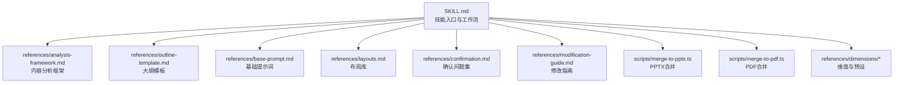
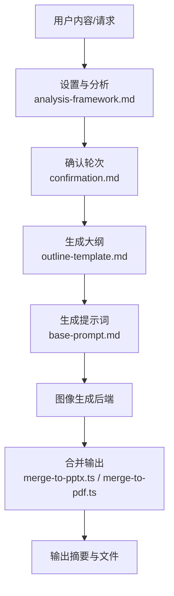
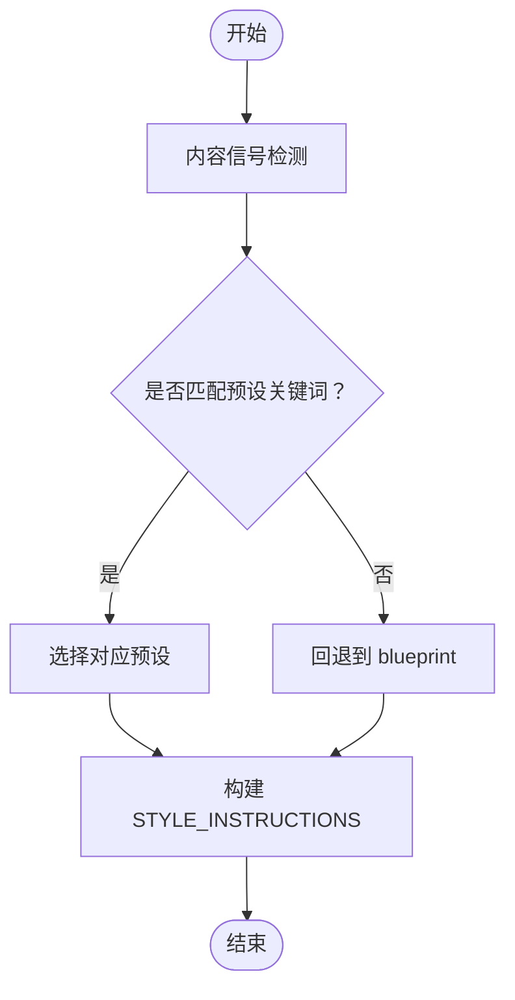
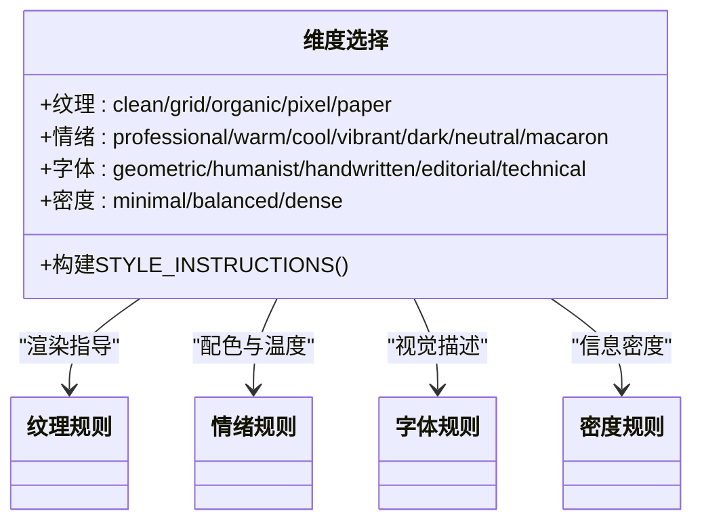
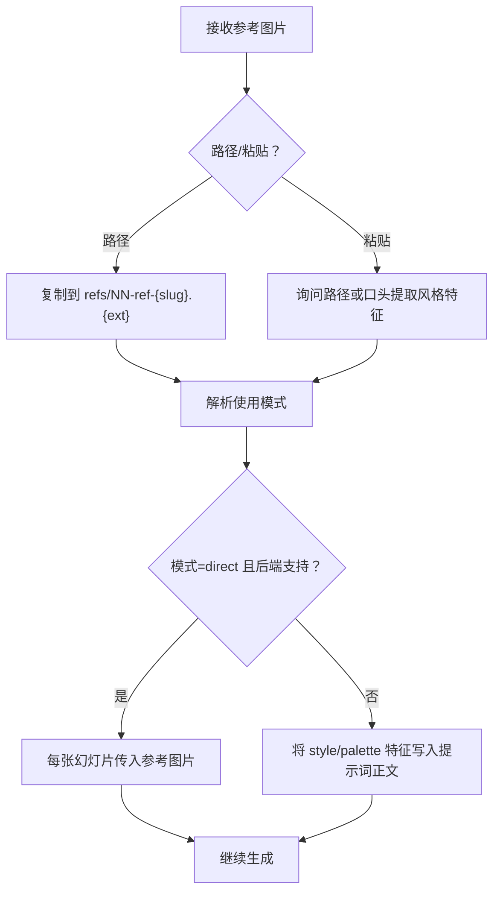
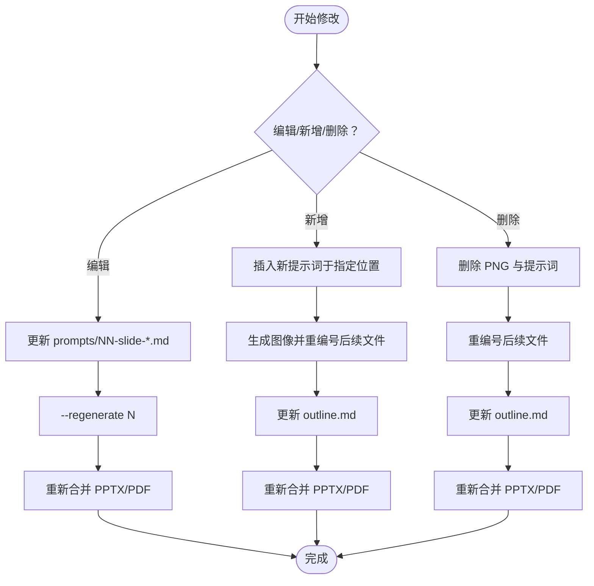
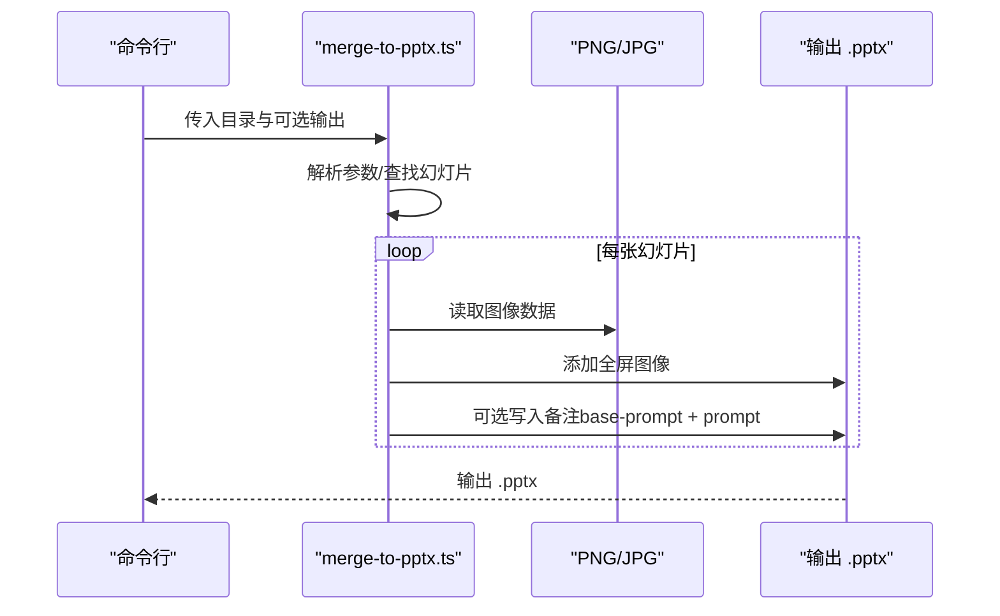
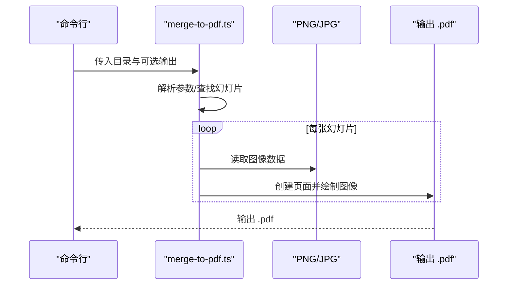
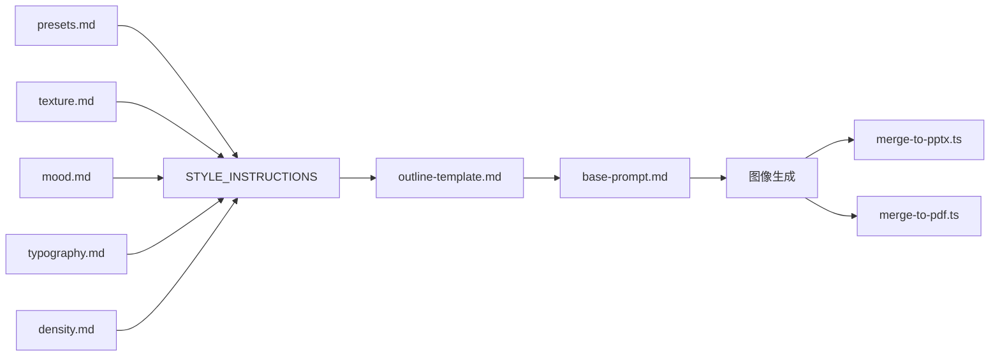

# 演示文稿生成器

<cite>
**本文引用的文件**
- [SKILL.md](file://.agents/skills/baoyu-slide-deck/SKILL.md)
- [analysis-framework.md](file://.agents/skills/baoyu-slide-deck/references/analysis-framework.md)
- [base-prompt.md](file://.agents/skills/baoyu-slide-deck/references/base-prompt.md)
- [content-rules.md](file://.agents/skills/baoyu-slide-deck/references/content-rules.md)
- [layouts.md](file://.agents/skills/baoyu-slide-deck/references/layouts.md)
- [confirmation.md](file://.agents/skills/baoyu-slide-deck/references/confirmation.md)
- [outline-template.md](file://.agents/skills/baoyu-slide-deck/references/outline-template.md)
- [modification-guide.md](file://.agents/skills/baoyu-slide-deck/references/modification-guide.md)
- [merge-to-pptx.ts](file://.agents/skills/baoyu-slide-deck/scripts/merge-to-pptx.ts)
- [merge-to-pdf.ts](file://.agents/skills/baoyu-slide-deck/scripts/merge-to-pdf.ts)
- [presets.md](file://.agents/skills/baoyu-slide-deck/references/dimensions/presets.md)
- [texture.md](file://.agents/skills/baoyu-slide-deck/references/dimensions/texture.md)
- [mood.md](file://.agents/skills/baoyu-slide-deck/references/dimensions/mood.md)
- [typography.md](file://.agents/skills/baoyu-slide-deck/references/dimensions/typography.md)
- [density.md](file://.agents/skills/baoyu-slide-deck/references/dimensions/density.md)
</cite>

## 目录
1. [简介](#简介)
2. [项目结构](#项目结构)
3. [核心组件](#核心组件)
4. [架构总览](#架构总览)
5. [详细组件分析](#详细组件分析)
6. [依赖关系分析](#依赖关系分析)
7. [性能考量](#性能考量)
8. [故障排除指南](#故障排除指南)
9. [结论](#结论)
10. [附录](#附录)

## 简介
本技术文档面向 baoyu-slide-deck 演示文稿生成器，系统性阐述从内容分析到最终 PPTX/PDF 输出的完整工作流，包括大纲生成、提示词构建、图像生成与文件合并等步骤；详解17种预设样式的设计理念与适用场景；解释自定义维度（纹理、情绪、字体、密度）的配置方法；说明参考图片的三种使用模式（direct、style、palette）及最佳实践；提供命令行选项说明与演示文稿修改指南，并给出PPTX与PDF输出的生成过程与优化建议。

## 项目结构
baoyu-slide-deck 技能位于 .agents/skills/baoyu-slide-deck 目录，采用“技能 + 参考资料 + 脚本”的分层组织：
- 技能入口与工作流说明：SKILL.md
- 内容分析框架与模板：analysis-framework.md、outline-template.md、base-prompt.md
- 风格与布局：content-rules.md、layouts.md
- 用户确认与交互：confirmation.md
- 修改与回滚：modification-guide.md
- 输出脚本：merge-to-pptx.ts、merge-to-pdf.ts
- 维度与预设：dimensions/*（texture、mood、typography、density、presets）

**图表来源**
- [SKILL.md:197-353](file://.agents/skills/baoyu-slide-deck/SKILL.md#L197-L353)
- [outline-template.md:1-270](file://.agents/skills/baoyu-slide-deck/references/outline-template.md#L1-L270)
- [base-prompt.md:1-85](file://.agents/skills/baoyu-slide-deck/references/base-prompt.md#L1-L85)
- [layouts.md:1-66](file://.agents/skills/baoyu-slide-deck/references/layouts.md#L1-L66)
- [confirmation.md:1-194](file://.agents/skills/baoyu-slide-deck/references/confirmation.md#L1-L194)
- [modification-guide.md:1-86](file://.agents/skills/baoyu-slide-deck/references/modification-guide.md#L1-L86)
- [merge-to-pptx.ts:1-138](file://.agents/skills/baoyu-slide-deck/scripts/merge-to-pptx.ts#L1-L138)
- [merge-to-pdf.ts:1-117](file://.agents/skills/baoyu-slide-deck/scripts/merge-to-pdf.ts#L1-L117)

**章节来源**
- [SKILL.md:181-196](file://.agents/skills/baoyu-slide-deck/SKILL.md#L181-L196)

## 核心组件
- 工作流引擎：基于 SKILL.md 的九步法（设置与分析、确认、生成大纲、审阅大纲、生成提示词、审阅提示词、生成图像、合并输出、总结）
- 内容分析与结构化：analysis-framework.md 提供消息层级、受众决策矩阵、视觉机会图、流程设计与内容取舍清单
- 大纲模板与风格指令：outline-template.md 定义 STYLE_INSTRUCTIONS 块与滑动条目模板
- 图像生成提示词：base-prompt.md 规定图像规格、角色定位、原则、文本风格、布局原则与语言要求
- 布局库：layouts.md 提供单页与信息图衍生布局及其选择建议
- 确认与交互：confirmation.md 提供确认轮次的选项文案与交互流程
- 修改与回滚：modification-guide.md 提供编辑、新增、删除幻灯片的重编号与再合并流程
- 输出合并：merge-to-pptx.ts 与 merge-to-pdf.ts 将 PNG 幻灯片批量合并为 PPTX/PDF，并可选写入备注

**章节来源**
- [SKILL.md:197-307](file://.agents/skills/baoyu-slide-deck/SKILL.md#L197-L307)
- [analysis-framework.md:1-162](file://.agents/skills/baoyu-slide-deck/references/analysis-framework.md#L1-L162)
- [outline-template.md:1-270](file://.agents/skills/baoyu-slide-deck/references/outline-template.md#L1-L270)
- [base-prompt.md:1-85](file://.agents/skills/baoyu-slide-deck/references/base-prompt.md#L1-L85)
- [layouts.md:1-66](file://.agents/skills/baoyu-slide-deck/references/layouts.md#L1-L66)
- [confirmation.md:1-194](file://.agents/skills/baoyu-slide-deck/references/confirmation.md#L1-L194)
- [modification-guide.md:1-86](file://.agents/skills/baoyu-slide-deck/references/modification-guide.md#L1-L86)
- [merge-to-pptx.ts:1-138](file://.agents/skills/baoyu-slide-deck/scripts/merge-to-pptx.ts#L1-L138)
- [merge-to-pdf.ts:1-117](file://.agents/skills/baoyu-slide-deck/scripts/merge-to-pdf.ts#L1-L117)

## 架构总览
下图展示了 baoyu-slide-deck 的端到端架构：用户输入内容后，系统进行分析与确认，生成大纲与提示词，调用图像后端生成幻灯片，最后合并为 PPTX/PDF 并输出摘要。

**图表来源**
- [SKILL.md:213-307](file://.agents/skills/baoyu-slide-deck/SKILL.md#L213-L307)
- [analysis-framework.md:1-162](file://.agents/skills/baoyu-slide-deck/references/analysis-framework.md#L1-L162)
- [confirmation.md:1-194](file://.agents/skills/baoyu-slide-deck/references/confirmation.md#L1-L194)
- [outline-template.md:1-270](file://.agents/skills/baoyu-slide-deck/references/outline-template.md#L1-L270)
- [base-prompt.md:1-85](file://.agents/skills/baoyu-slide-deck/references/base-prompt.md#L1-L85)
- [merge-to-pptx.ts:1-138](file://.agents/skills/baoyu-slide-deck/scripts/merge-to-pptx.ts#L1-L138)
- [merge-to-pdf.ts:1-117](file://.agents/skills/baoyu-slide-deck/scripts/merge-to-pdf.ts#L1-L117)

## 详细组件分析

### 组件A：样式系统与预设（17种）
- 设计理念：每种预设由四个维度组合而成（纹理、情绪、字体、密度），并通过自动匹配信号词在内容分析阶段进行推荐。
- 适用场景：不同行业、受众与主题（如技术架构、教育培训、企业提案、创意展示、学术报告、游戏/开发者文化等）。
- 自动选择：根据源内容中的关键词映射到相应预设，若无匹配则回退到默认 blueprint。
- 预设→维度映射：见 presets.md，包含每个预设的维度组合、风格感受与自动匹配关键词。

**图表来源**
- [SKILL.md:121-144](file://.agents/skills/baoyu-slide-deck/SKILL.md#L121-L144)
- [presets.md:1-133](file://.agents/skills/baoyu-slide-deck/references/dimensions/presets.md#L1-L133)

**章节来源**
- [SKILL.md:82-144](file://.agents/skills/baoyu-slide-deck/SKILL.md#L82-L144)
- [presets.md:1-133](file://.agents/skills/baoyu-slide-deck/references/dimensions/presets.md#L1-L133)

### 组件B：自定义维度选择机制
- 四维空间：
  - 纹理（Texture）：clean、grid、organic、pixel、paper
  - 情绪（Mood）：professional、warm、cool、vibrant、dark、neutral、macaron
  - 字体（Typography）：geometric、humanist、handwritten、editorial、technical
  - 密度（Density）：minimal、balanced、dense
- 维度规则与渲染指导：各维度文件提供配色、排版、元素与密度的组合建议与避忌，确保风格一致性。
- 交互流程：在 Round 1 选择“自定义维度”后，Round 2 批量询问四项维度选项，最终形成 STYLE_INSTRUCTIONS。

**图表来源**
- [confirmation.md:77-150](file://.agents/skills/baoyu-slide-deck/references/confirmation.md#L77-L150)
- [texture.md:1-61](file://.agents/skills/baoyu-slide-deck/references/dimensions/texture.md#L1-L61)
- [mood.md:1-158](file://.agents/skills/baoyu-slide-deck/references/dimensions/mood.md#L1-L158)
- [typography.md:1-98](file://.agents/skills/baoyu-slide-deck/references/dimensions/typography.md#L1-L98)
- [density.md:1-119](file://.agents/skills/baoyu-slide-deck/references/dimensions/density.md#L1-L119)

**章节来源**
- [SKILL.md:110-119](file://.agents/skills/baoyu-slide-deck/SKILL.md#L110-L119)
- [confirmation.md:1-194](file://.agents/skills/baoyu-slide-deck/references/confirmation.md#L1-L194)
- [texture.md:1-61](file://.agents/skills/baoyu-slide-deck/references/dimensions/texture.md#L1-L61)
- [mood.md:1-158](file://.agents/skills/baoyu-slide-deck/references/dimensions/mood.md#L1-L158)
- [typography.md:1-98](file://.agents/skills/baoyu-slide-deck/references/dimensions/typography.md#L1-L98)
- [density.md:1-119](file://.agents/skills/baoyu-slide-deck/references/dimensions/density.md#L1-L119)

### 组件C：参考图片使用方式与最佳实践
- 接收方式：支持通过命令行 --ref 传入或在对话中粘贴图片路径；若仅粘贴未提供路径，需用户提供路径或口头提取风格特征作为文本回退。
- 使用模式：
  - direct：将图片作为参考传递给后端（若后端支持），每张幻灯片均使用该参考
  - style：从图片中抽取风格特征（线条处理、纹理、情绪）并附加到每张幻灯片提示词正文
  - palette：从图片中抽取色值（hex）并附加到每张幻灯片提示词正文
- 提示词记录：在每张幻灯片提示词的 frontmatter 中记录 references 列表，包含 ref_id、文件名与使用方式
- 生成时校验：若使用 direct 且后端接受参考，则传入；否则嵌入提取的 style/palette 特征到提示文本

**图表来源**
- [SKILL.md:154-180](file://.agents/skills/baoyu-slide-deck/SKILL.md#L154-L180)

**章节来源**
- [SKILL.md:154-180](file://.agents/skills/baoyu-slide-deck/SKILL.md#L154-L180)

### 组件D：命令行选项说明
- --style <name>：预设名称、custom 或自定义样式名
- --audience <type>：受众类型（beginners、intermediate、experts、executives、general）
- --lang <code>：输出语言代码（en、zh、ja 等）
- --slides <N>：目标幻灯片数量（建议8-25，最大30）
- --ref <files...>：参考图片（按幻灯片应用，支持 direct/style/palette 模式）
- --outline-only：仅生成大纲
- --prompts-only：仅生成提示词（跳过图像生成）
- --images-only：跳至第7步；需要已存在的 prompts/ 目录
- --regenerate <N>：重新生成指定幻灯片（如 3 或 2,5,8）

**章节来源**
- [SKILL.md:68-81](file://.agents/skills/baoyu-slide-deck/SKILL.md#L68-L81)

### 组件E：演示文稿修改指南
- 编辑单张：更新 prompts/NN-slide-*.md 后，使用 --regenerate N 重新生成对应图像，再重新合并
- 新增幻灯片：在指定位置插入新提示词，生成图像并重编号后续文件（NN+1），更新 outline.md，再重新合并
- 删除幻灯片：删除对应 PNG 与提示词，重编号后续文件（NN-1），更新 outline.md，再重新合并
- 文件命名与重命名规则：保持 slug 不变，仅 NN 前缀变化；合并后更新幻灯片总数

**图表来源**
- [modification-guide.md:1-86](file://.agents/skills/baoyu-slide-deck/references/modification-guide.md#L1-L86)

**章节来源**
- [modification-guide.md:1-86](file://.agents/skills/baoyu-slide-deck/references/modification-guide.md#L1-L86)

### 组件F：PPTX 与 PDF 输出合并
- PPTX 合并（merge-to-pptx.ts）：
  - 解析参数：目录与可选输出文件名
  - 查找幻灯片：按 NN 前缀排序收集 01-slide-*.png/jpg
  - 读取 base-prompt.md 与对应提示词，写入备注（可选）
  - 使用 LAYOUT_16x9，全屏覆盖插入图像，保存为 .pptx
- PDF 合并（merge-to-pdf.ts）：
  - 解析参数：目录与可选输出文件名
  - 查找幻灯片：按 NN 前缀排序收集 01-slide-*.png/jpg
  - 根据首字节判断 PNG/JPG，逐页绘制，保存为 .pdf

**图表来源**
- [merge-to-pptx.ts:12-138](file://.agents/skills/baoyu-slide-deck/scripts/merge-to-pptx.ts#L12-L138)

**图表来源**
- [merge-to-pdf.ts:12-117](file://.agents/skills/baoyu-slide-deck/scripts/merge-to-pdf.ts#L12-L117)

**章节来源**
- [merge-to-pptx.ts:1-138](file://.agents/skills/baoyu-slide-deck/scripts/merge-to-pptx.ts#L1-L138)
- [merge-to-pdf.ts:1-117](file://.agents/skills/baoyu-slide-deck/scripts/merge-to-pdf.ts#L1-L117)

## 依赖关系分析
- 维度与预设：presets.md 为 STYLE_INSTRUCTIONS 的权威来源之一，其余维度文件提供渲染细节
- 大纲与提示：outline-template.md 产出 STYLE_INSTRUCTIONS，base-prompt.md 作为提示词模板，二者共同决定图像生成风格
- 输出脚本：merge-to-pptx.ts 与 merge-to-pdf.ts 依赖幻灯片命名规范（NN-slide-*.png/jpg）与 prompts/ 存在性（用于备注）

**图表来源**
- [presets.md:1-133](file://.agents/skills/baoyu-slide-deck/references/dimensions/presets.md#L1-L133)
- [texture.md:1-61](file://.agents/skills/baoyu-slide-deck/references/dimensions/texture.md#L1-L61)
- [mood.md:1-158](file://.agents/skills/baoyu-slide-deck/references/dimensions/mood.md#L1-L158)
- [typography.md:1-98](file://.agents/skills/baoyu-slide-deck/references/dimensions/typography.md#L1-L98)
- [density.md:1-119](file://.agents/skills/baoyu-slide-deck/references/dimensions/density.md#L1-L119)
- [outline-template.md:1-270](file://.agents/skills/baoyu-slide-deck/references/outline-template.md#L1-L270)
- [base-prompt.md:1-85](file://.agents/skills/baoyu-slide-deck/references/base-prompt.md#L1-L85)
- [merge-to-pptx.ts:1-138](file://.agents/skills/baoyu-slide-deck/scripts/merge-to-pptx.ts#L1-L138)
- [merge-to-pdf.ts:1-117](file://.agents/skills/baoyu-slide-deck/scripts/merge-to-pdf.ts#L1-L117)

**章节来源**
- [outline-template.md:211-228](file://.agents/skills/baoyu-slide-deck/references/outline-template.md#L211-L228)
- [base-prompt.md:53-84](file://.agents/skills/baoyu-slide-deck/references/base-prompt.md#L53-L84)

## 性能考量
- 图像生成耗时：每张幻灯片约10-30秒，建议在充足时间内串行生成并复用会话ID以保持一致性
- 合并效率：PPTX/PDF 合并为纯I/O操作，速度主要受磁盘吞吐影响；建议在生成完成后一次性合并
- 输出质量：优先使用 PNG 以保留透明度与无损压缩；若追求体积，可考虑 JPG，但需注意透明度丢失
- 会话复用：当后端支持会话时，使用统一会话ID有助于保持视觉一致性

[本节为通用建议，无需特定文件引用]

## 故障排除指南
- 未找到输出目录或幻灯片：检查目录是否存在、文件命名是否符合 NN-slide-*.png/jpg 规范
- 未生成提示词：确认是否使用 --prompts-only 或 --outline-only；若需生成图像，请移除这些标志
- 后端不可用：根据 SKILL.md 的后端选择规则，优先使用运行时原生工具，其次尝试非原生后端，必要时询问用户
- 重复生成导致覆盖：遵循备份规则（存在即重命名为带时间戳的备份文件），避免覆盖用户修改
- 参考图片未生效：确认 --ref 传入的文件存在且后端支持 direct 模式；否则将回退到 style/palette 文本注入

**章节来源**
- [SKILL.md:30-45](file://.agents/skills/baoyu-slide-deck/SKILL.md#L30-L45)
- [SKILL.md:195](file://.agents/skills/baoyu-slide-deck/SKILL.md#L195)
- [merge-to-pptx.ts:33-67](file://.agents/skills/baoyu-slide-deck/scripts/merge-to-pptx.ts#L33-L67)
- [merge-to-pdf.ts:33-67](file://.agents/skills/baoyu-slide-deck/scripts/merge-to-pdf.ts#L33-L67)

## 结论
baoyu-slide-deck 通过“内容分析—风格维度—大纲模板—提示词—图像生成—合并输出”的闭环流程，实现了高一致性的演示文稿自动化生产。其17种预设与四维自定义组合提供了广泛的风格适配能力；参考图片的多模式支持增强了个性化与品牌一致性；严格的确认与修改流程保障了可控性与可回滚性；PPTX/PDF 合并脚本则保证了最终交付质量与便捷性。

[本节为总结，无需特定文件引用]

## 附录

### A. 命令行选项速查
- --style <name>：预设或自定义
- --audience <type>：受众类型
- --lang <code>：输出语言
- --slides <N>：幻灯片数量
- --ref <files...>：参考图片（direct/style/palette）
- --outline-only：仅生成大纲
- --prompts-only：仅生成提示词
- --images-only：仅生成图像
- --regenerate <N>：重新生成指定幻灯片

**章节来源**
- [SKILL.md:68-81](file://.agents/skills/baoyu-slide-deck/SKILL.md#L68-L81)

### B. 风格维度速查
- 纹理：clean、grid、organic、pixel、paper
- 情绪：professional、warm、cool、vibrant、dark、neutral、macaron
- 字体：geometric、humanist、handwritten、editorial、technical
- 密度：minimal、balanced、dense

**章节来源**
- [SKILL.md:110-119](file://.agents/skills/baoyu-slide-deck/SKILL.md#L110-L119)

### C. 输出文件布局
- slide-deck/{topic-slug}/
  - source-{slug}.{ext}
  - outline.md
  - prompts/NN-slide-{slug}.md
  - NN-slide-{slug}.png
  - {topic-slug}.pptx
  - {topic-slug}.pdf

**章节来源**
- [SKILL.md:181-196](file://.agents/skills/baoyu-slide-deck/SKILL.md#L181-L196)