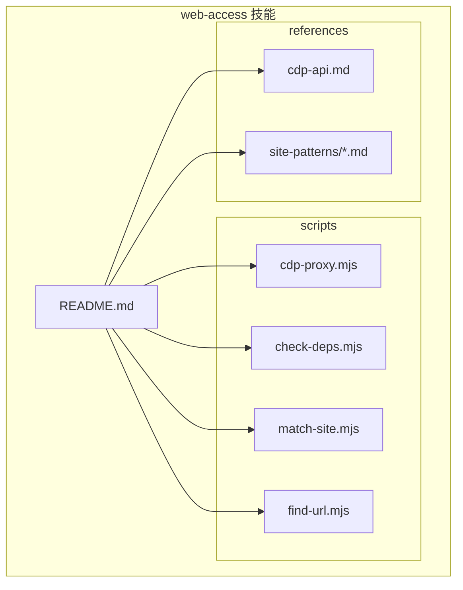
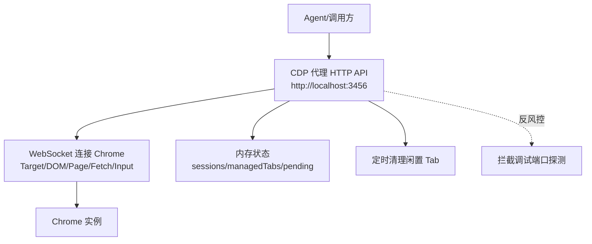
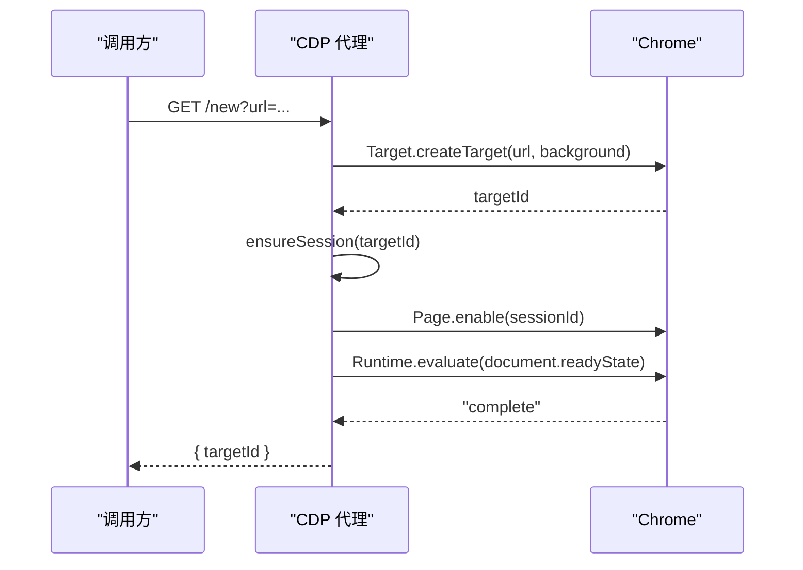
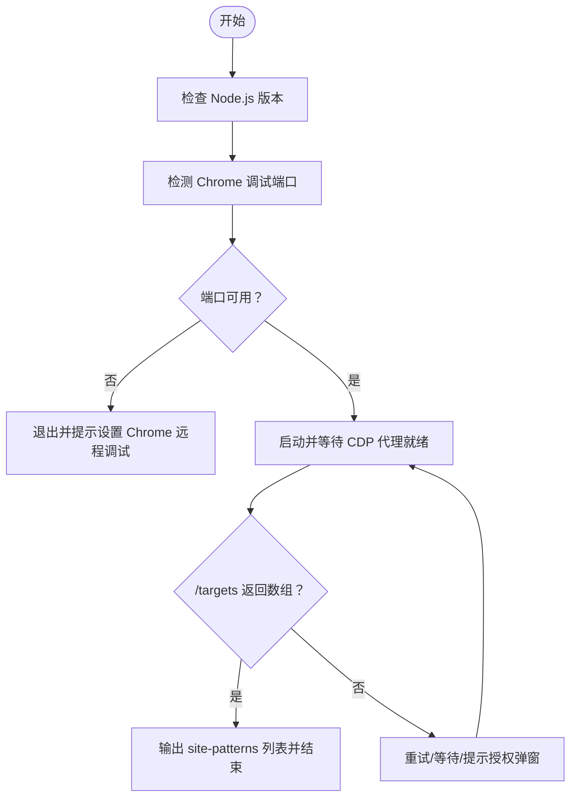
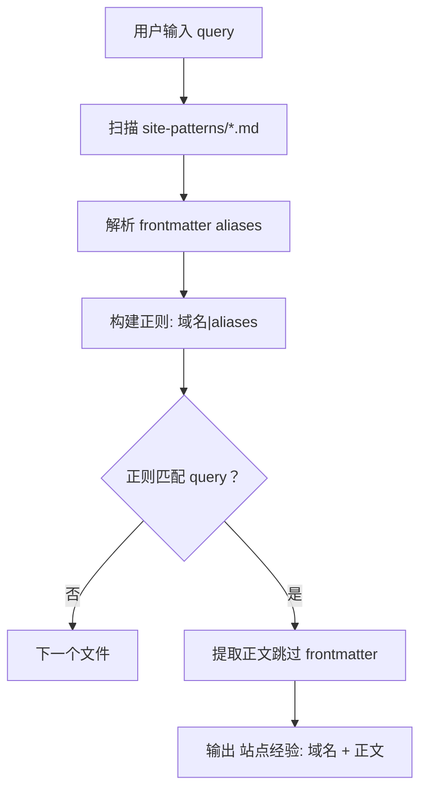
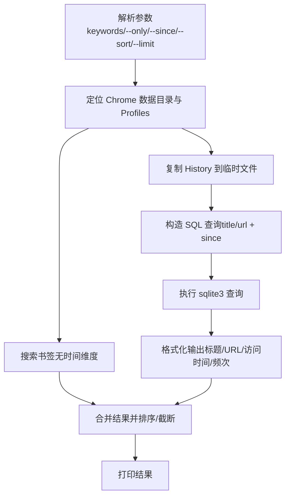
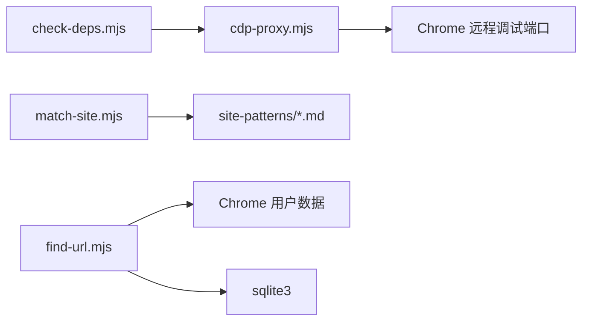

# 网页访问技能

<cite>
**本文引用的文件**
- [README.md](file://.agents/skills/web-access/README.md)
- [cdp-proxy.mjs](file://.agents/skills/web-access/scripts/cdp-proxy.mjs)
- [check-deps.mjs](file://.agents/skills/web-access/scripts/check-deps.mjs)
- [match-site.mjs](file://.agents/skills/web-access/scripts/match-site.mjs)
- [find-url.mjs](file://.agents/skills/web-access/scripts/find-url.mjs)
- [cdp-api.md](file://.agents/skills/web-access/references/cdp-api.md)
</cite>

## 目录
1. [简介](#简介)
2. [项目结构](#项目结构)
3. [核心组件](#核心组件)
4. [架构总览](#架构总览)
5. [详细组件分析](#详细组件分析)
6. [依赖关系分析](#依赖关系分析)
7. [性能考量](#性能考量)
8. [故障排查指南](#故障排查指南)
9. [结论](#结论)
10. [附录](#附录)

## 简介
本技能为 AI Agent 提供“联网策略 + CDP 浏览器操作 + 站点经验积累”的综合网页访问能力，兼容多种 Agent 平台。其核心能力包括：
- URL 解析与页面抓取：支持 WebSearch/WebFetch/curl/Jina/CDP 等多种工具与策略组合，按场景智能选择
- CDP（Chrome DevTools Protocol）代理：通过 HTTP API 控制本地 Chrome，实现动态页面、交互操作、媒体提取与截图
- 站点模式匹配与适配器系统：基于域名与别名的站点经验库，按查询内容匹配并输出适配策略
- 本地 Chrome 资源检索：从书签/历史中检索 URL，覆盖公网无法索引的内部系统或个人访问记录
- 并行分治与资源隔离：多目标时可并行执行，共享一个 Proxy，按 tab 级隔离
- 反爬虫与风控应对：拦截调试端口探测、真实鼠标事件、文件上传直传等策略降低风险

## 项目结构
- 技能根目录包含 README、参考文档与脚本集合
- scripts 子目录提供 CDP 代理、依赖检查、站点匹配与本地 URL 检索等核心工具
- references 子目录包含 CDP API 参考与站点模式（site-patterns）目录（由脚本扫描）

图表来源
- [README.md](file://.agents/skills/web-access/README.md)
- [cdp-proxy.mjs](file://.agents/skills/web-access/scripts/cdp-proxy.mjs)
- [check-deps.mjs](file://.agents/skills/web-access/scripts/check-deps.mjs)
- [match-site.mjs](file://.agents/skills/web-access/scripts/match-site.mjs)
- [find-url.mjs](file://.agents/skills/web-access/scripts/find-url.mjs)
- [cdp-api.md](file://.agents/skills/web-access/references/cdp-api.md)

章节来源
- [README.md](file://.agents/skills/web-access/README.md)

## 核心组件
- CDP 代理服务（cdp-proxy.mjs）：提供 HTTP API 控制 Chrome，支持新建/关闭标签、导航、后退、执行 JS、点击、鼠标真实点击、文件上传、滚动、截图、健康检查等
- 依赖检查（check-deps.mjs）：检测 Node.js 版本、Chrome 远程调试端口，自动启动并等待 CDP 代理就绪
- 站点匹配（match-site.mjs）：根据用户输入与站点经验文件（域名/别名）匹配，输出适配策略
- 本地 URL 检索（find-url.mjs）：从本地 Chrome 书签/历史检索 URL，支持关键词、时间窗、排序与多 Profile
- CDP API 参考（cdp-api.md）：HTTP API 端点与使用说明

章节来源
- [cdp-proxy.mjs](file://.agents/skills/web-access/scripts/cdp-proxy.mjs)
- [check-deps.mjs](file://.agents/skills/web-access/scripts/check-deps.mjs)
- [match-site.mjs](file://.agents/skills/web-access/scripts/match-site.mjs)
- [find-url.mjs](file://.agents/skills/web-access/scripts/find-url.mjs)
- [cdp-api.md](file://.agents/skills/web-access/references/cdp-api.md)

## 架构总览
CDP 代理以本地 HTTP 服务形式暴露 Chrome 控制能力，Agent 通过统一 API 发起请求，代理负责：
- 自动发现并连接 Chrome（DevToolsActivePort 或常见端口）
- 为目标页面建立 CDP 会话（session）
- 执行页面操作（导航、点击、滚动、截图等）
- 管理 tab 生命周期（闲置自动关闭）
- 反风控：拦截页面对调试端口的探测请求

图表来源
- [cdp-proxy.mjs](file://.agents/skills/web-access/scripts/cdp-proxy.mjs)

## 详细组件分析

### CDP 代理服务（cdp-proxy.mjs）
- 功能要点
  - 自动发现 Chrome 调试端口（DevToolsActivePort 与常见端口回退）
  - 建立 WebSocket 连接，维护 sessions 与 managedTabs
  - 提供 /new、/close、/navigate、/back、/info、/eval、/click、/clickAt、/setFiles、/scroll、/screenshot、/targets、/health 等端点
  - 等待页面加载（document.readyState）
  - 闲置 Tab 自动清理（可配置超时）
  - 反风控：拦截页面对 127.0.0.1:port 的本地调试端口探测请求
- 关键流程（新建标签并等待加载）

图表来源
- [cdp-proxy.mjs](file://.agents/skills/web-access/scripts/cdp-proxy.mjs)

章节来源
- [cdp-proxy.mjs](file://.agents/skills/web-access/scripts/cdp-proxy.mjs)

### 依赖检查（check-deps.mjs）
- 功能要点
  - 检测 Node.js 版本（建议 22+）
  - 检测 Chrome 远程调试端口（DevToolsActivePort 与常见端口）
  - 后台启动 CDP 代理并轮询 /targets，等待就绪
  - 输出已存在的站点模式列表
- 关键流程（启动代理并等待）

图表来源
- [check-deps.mjs](file://.agents/skills/web-access/scripts/check-deps.mjs)

章节来源
- [check-deps.mjs](file://.agents/skills/web-access/scripts/check-deps.mjs)

### 站点模式匹配（match-site.mjs）
- 功能要点
  - 扫描 references/site-patterns 下的 .md 文件
  - 读取 frontmatter 中的 aliases，构建正则模式
  - 对用户输入进行大小写不敏感匹配，输出对应站点经验正文
- 关键流程（匹配与输出）

图表来源
- [match-site.mjs](file://.agents/skills/web-access/scripts/match-site.mjs)

章节来源
- [match-site.mjs](file://.agents/skills/web-access/scripts/match-site.mjs)

### 本地 URL 检索（find-url.mjs）
- 功能要点
  - 跨平台定位 Chrome 用户数据目录与 Profile
  - 读取 Bookmarks JSON 与 History SQLite（临时拷贝避免锁定）
  - 支持关键词 AND 搜索、时间窗过滤、按最近访问/访问频次排序
  - 输出格式化结果，避免字段分隔符冲突
- 关键流程（历史检索）

图表来源
- [find-url.mjs](file://.agents/skills/web-access/scripts/find-url.mjs)

章节来源
- [find-url.mjs](file://.agents/skills/web-access/scripts/find-url.mjs)

### CDP API 参考（cdp-api.md）
- 端点概览
  - /health：健康检查
  - /targets：列出所有页面 tab
  - /new?url=：创建后台标签并等待加载
  - /close?target=：关闭标签
  - /navigate?target=&url=：导航并等待加载
  - /back?target=：后退
  - /info?target=：页面信息
  - /eval?target=：执行 JS（POST body 为表达式）
  - /click?target=：JS 点击（POST body 为 CSS 选择器）
  - /clickAt?target=：真实鼠标点击（CDP）
  - /setFiles?target=：文件上传直传（POST JSON {selector, files[]}）
  - /scroll?target=&y=&direction=：滚动
  - /screenshot?target=&file=&format=：截图
- 使用提示与错误处理
  - /eval 支持 awaitPromise，注意返回值可序列化
  - attach 失败/超时/端口占用等错误的排查指引

章节来源
- [cdp-api.md](file://.agents/skills/web-access/references/cdp-api.md)

## 依赖关系分析
- 组件耦合
  - check-deps.mjs 依赖 cdp-proxy.mjs 的端口与 /targets 健康检查
  - cdp-proxy.mjs 依赖 Chrome 的远程调试端口与 CDP 协议域（Target/DOM/Page/Fetch/Input）
  - match-site.mjs 依赖 references/site-patterns 下的站点经验文件
  - find-url.mjs 依赖本地 Chrome 用户数据与 sqlite3 命令
- 外部依赖
  - Node.js 22+（原生 WebSocket）
  - Chrome 远程调试端口（chrome://inspect/#remote-debugging）
  - sqlite3（历史检索）

图表来源
- [check-deps.mjs](file://.agents/skills/web-access/scripts/check-deps.mjs)
- [cdp-proxy.mjs](file://.agents/skills/web-access/scripts/cdp-proxy.mjs)
- [match-site.mjs](file://.agents/skills/web-access/scripts/match-site.mjs)
- [find-url.mjs](file://.agents/skills/web-access/scripts/find-url.mjs)

章节来源
- [check-deps.mjs](file://.agents/skills/web-access/scripts/check-deps.mjs)
- [cdp-proxy.mjs](file://.agents/skills/web-access/scripts/cdp-proxy.mjs)
- [match-site.mjs](file://.agents/skills/web-access/scripts/match-site.mjs)
- [find-url.mjs](file://.agents/skills/web-access/scripts/find-url.mjs)

## 性能考量
- 代理生命周期
  - 保持代理常驻，避免频繁重启带来的 Chrome 重新授权与连接成本
  - 通过环境变量调整闲置超时（CDP_TAB_IDLE_TIMEOUT），平衡资源占用与稳定性
- 请求与等待
  - /eval 支持 awaitPromise，合理使用异步表达式避免阻塞
  - /scroll 后等待 800ms 供懒加载触发，避免过早提取导致数据不完整
- 并行与隔离
  - 多目标并行执行时共享同一 Proxy，按 tab 级隔离，减少资源竞争
- 反爬虫与风控
  - 使用真实鼠标事件（/clickAt）与文件直传（/setFiles）降低被识别为自动化概率
  - 启用反风控：拦截页面对调试端口的探测请求，避免触发安全弹窗

## 故障排查指南
- Chrome 未开启远程调试
  - 现象：连接失败/端口不可用
  - 处理：打开 chrome://inspect/#remote-debugging 并勾选“Allow remote debugging”
- 代理端口占用
  - 现象：端口已被占用
  - 处理：已有实例可直接复用；否则释放端口或调整 CDP_PROXY_PORT
- /targets 返回非数组
  - 现象：代理未就绪
  - 处理：等待授权弹窗确认；检查日志（/tmp/cdp-proxy.log）
- attach 失败或超时
  - 现象：targetId 无效或 tab 已关闭
  - 处理：使用 /targets 获取最新列表，确认目标存在
- sqlite3 命令缺失
  - 现象：历史检索报错
  - 处理：安装 sqlite3 并加入 PATH（macOS/Linux 通常自带；Windows 可通过包管理器或官网下载）

章节来源
- [cdp-proxy.mjs](file://.agents/skills/web-access/scripts/cdp-proxy.mjs)
- [check-deps.mjs](file://.agents/skills/web-access/scripts/check-deps.mjs)
- [find-url.mjs](file://.agents/skills/web-access/scripts/find-url.mjs)
- [cdp-api.md](file://.agents/skills/web-access/references/cdp-api.md)

## 结论
该技能通过 CDP 代理将浏览器自动化能力以统一 HTTP API 暴露，结合站点模式匹配与本地 URL 检索，形成“策略选择 + 浏览器操作 + 经验复用”的闭环。配合反风控与资源隔离策略，可在复杂动态页面与多目标场景下稳定高效地完成网页访问与数据提取。

## 附录
- 快速安装与前置配置参见 README
- CDP API 使用与端点说明参见 CDP API 参考
- 站点适配器系统通过 match-site.mjs 与 site-patterns 目录实现

章节来源
- [README.md](file://.agents/skills/web-access/README.md)
- [cdp-api.md](file://.agents/skills/web-access/references/cdp-api.md)