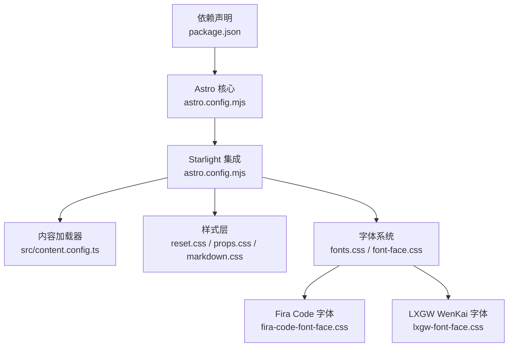
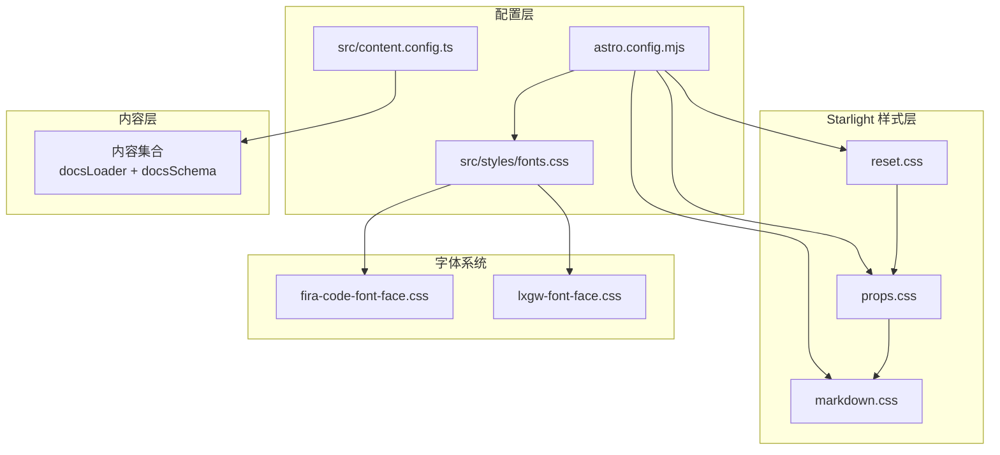
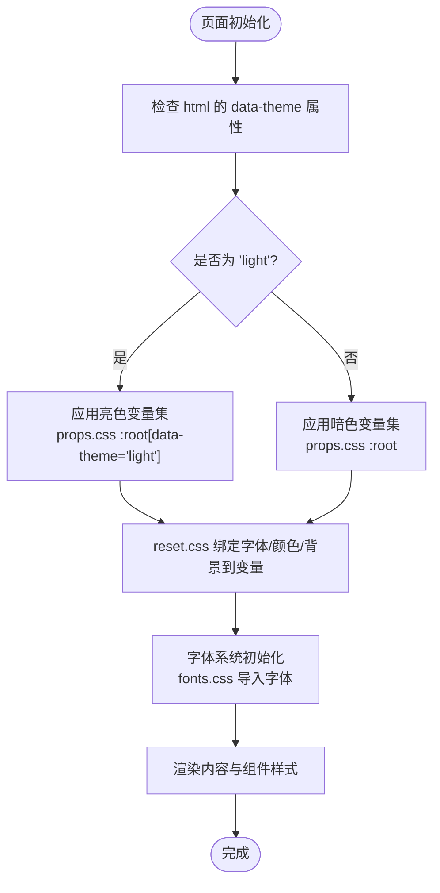
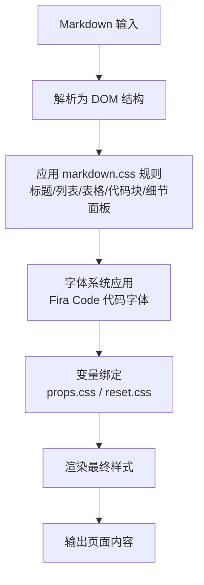
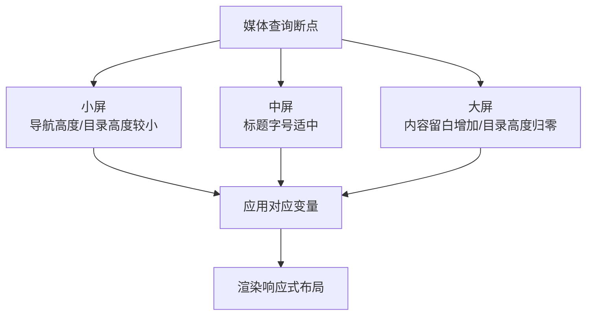
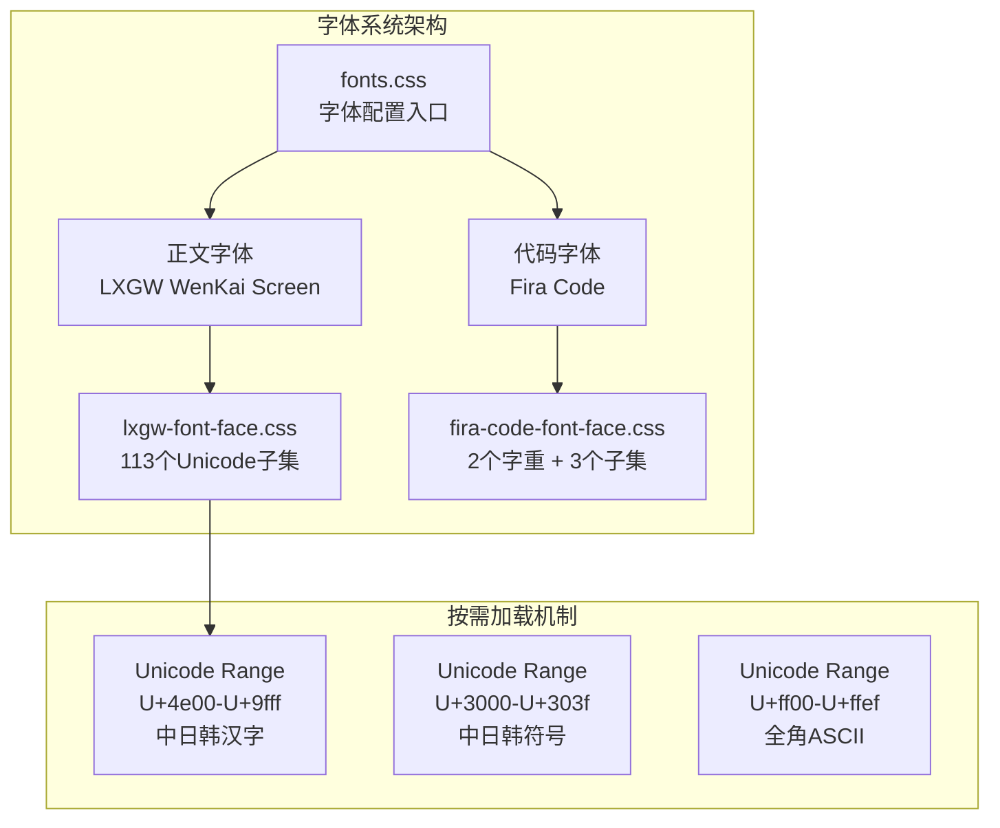
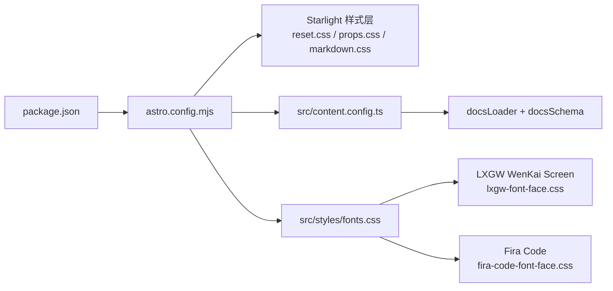

# 主题和样式系统

<cite>
**本文引用的文件**
- [package.json](file://package.json)
- [astro.config.mjs](file://astro.config.mjs)
- [src/content.config.ts](file://src/content.config.ts)
- [src/styles/fonts.css](file://src/styles/fonts.css)
- [src/styles/fira-code-font-face.css](file://src/styles/fira-code-font-face.css)
- [src/styles/lxgw-font-face.css](file://src/styles/lxgw-font-face.css)
- [node_modules/@astrojs/starlight/style/reset.css](file://node_modules/@astrojs/starlight/style/reset.css)
- [node_modules/@astrojs/starlight/style/props.css](file://node_modules/@astrojs/starlight/style/props.css)
- [node_modules/@astrojs/starlight/style/markdown.css](file://node_modules/@astrojs/starlight/style/markdown.css)
</cite>

## 更新摘要
**变更内容**
- 新增 Fira Code 自托管字体集成，支持代码块等宽字体渲染
- 新增 LXGW WenKai Screen 屏幕字体实现，优化中文排版体验
- 更新字体配置系统，通过 CSS 变量和按需加载策略提升性能
- 完善 Astro 配置中的自定义 CSS 引入机制

## 目录
1. [简介](#简介)
2. [项目结构](#项目结构)
3. [核心组件](#核心组件)
4. [架构总览](#架构总览)
5. [详细组件分析](#详细组件分析)
6. [字体系统详解](#字体系统详解)
7. [依赖关系分析](#依赖关系分析)
8. [性能考量](#性能考量)
9. [故障排查指南](#故障排查指南)
10. [结论](#结论)
11. [附录](#附录)

## 简介
本指南面向 NTLx's Blog 的主题与样式系统，聚焦 Astro + Starlight 的主题配置、自定义样式实现、响应式设计适配策略，以及主题变量、CSS 自定义属性（CSS Custom Properties）的使用方式。文档同时覆盖颜色方案、字体选择、布局调整与交互效果的定制选项，并提供主题切换机制、暗色/亮色模式支持与移动端适配的最佳实践，以及自定义组件开发流程与样式系统性能优化建议。

**更新** 本版本新增了完整的字体系统配置，包括 Fira Code 代码字体和 LXGW WenKai 中文字体的自托管实现，通过按需加载策略优化页面性能。

## 项目结构
该项目基于 Astro 6 与 Starlight 0.39 构建，内容通过 Astro Content Collections 加载，Starlight 提供文档站点的主题与样式层。核心入口与集成点如下：
- 依赖与脚本：通过包管理器声明 Astro 与 Starlight 版本，提供开发、构建与预览命令。
- 站点配置：在 Astro 配置中集成 Starlight，设置站点标题、描述、社交链接、SEO 元信息、编辑链接、Favicon、侧边栏导航等。
- 内容加载：通过 Astro Content Collections 的 Starlight Loader 与 Schema 加载文档内容。
- 字体系统：通过自托管字体实现，支持代码块和正文的差异化字体配置。



**图表来源**
- [astro.config.mjs:1-285](file://astro.config.mjs#L1-L285)
- [src/content.config.ts:1-8](file://src/content.config.ts#L1-L8)
- [src/styles/fonts.css:1-21](file://src/styles/fonts.css#L1-L21)
- [src/styles/fira-code-font-face.css:1-59](file://src/styles/fira-code-font-face.css#L1-L59)
- [src/styles/lxgw-font-face.css:1-874](file://src/styles/lxgw-font-face.css#L1-L874)
- [package.json:1-19](file://package.json#L1-L19)

**章节来源**
- [package.json:1-19](file://package.json#L1-L19)
- [astro.config.mjs:1-285](file://astro.config.mjs#L1-L285)
- [src/content.config.ts:1-8](file://src/content.config.ts#L1-L8)
- [src/styles/fonts.css:1-21](file://src/styles/fonts.css#L1-L21)

## 核心组件
- Starlight 主题与样式层
  - reset.css：重置与基础排版、颜色方案、字体族、暗/亮色模式切换等。
  - props.css：定义主题变量（颜色、阴影、文本尺寸、布局关键值等），并为暗/亮两套配色提供映射。
  - markdown.css：Markdown 内容渲染的排版与组件样式（标题、列表、表格、代码块、引用、细节面板等）。
- Astro 配置与集成
  - 在 astro.config.mjs 中启用 Starlight，并配置 SEO、编辑链接、侧边栏、Favicon 等。
- 内容加载
  - 通过 src/content.config.ts 使用 Starlight Loader 与 Schema，统一加载文档集合。
- 字体系统
  - fonts.css：字体配置入口，统一管理字体导入和应用范围。
  - fira-code-font-face.css：Fira Code 自托管字体，支持代码块等宽字体渲染。
  - lxgw-font-face.css：LXGW WenKai Screen 字体，支持中文正文排版。

**章节来源**
- [node_modules/@astrojs/starlight/style/reset.css:1-51](file://node_modules/@astrojs/starlight/style/reset.css#L1-L51)
- [node_modules/@astrojs/starlight/style/props.css:1-189](file://node_modules/@astrojs/starlight/style/props.css#L1-L189)
- [node_modules/@astrojs/starlight/style/markdown.css:1-254](file://node_modules/@astrojs/starlight/style/markdown.css#L1-L254)
- [astro.config.mjs:1-285](file://astro.config.mjs#L1-L285)
- [src/content.config.ts:1-8](file://src/content.config.ts#L1-L8)
- [src/styles/fonts.css:1-21](file://src/styles/fonts.css#L1-L21)
- [src/styles/fira-code-font-face.css:1-59](file://src/styles/fira-code-font-face.css#L1-L59)
- [src/styles/lxgw-font-face.css:1-874](file://src/styles/lxgw-font-face.css#L1-L874)

## 架构总览
下图展示从配置到样式层再到内容渲染的整体架构，强调 Starlight 的样式变量体系、字体系统的按需加载机制与 Astro 的内容加载路径。



**图表来源**
- [astro.config.mjs:1-285](file://astro.config.mjs#L1-L285)
- [src/content.config.ts:1-8](file://src/content.config.ts#L1-L8)
- [src/styles/fonts.css:1-21](file://src/styles/fonts.css#L1-L21)
- [src/styles/fira-code-font-face.css:1-59](file://src/styles/fira-code-font-face.css#L1-L59)
- [src/styles/lxgw-font-face.css:1-874](file://src/styles/lxgw-font-face.css#L1-L874)
- [node_modules/@astrojs/starlight/style/reset.css:1-51](file://node_modules/@astrojs/starlight/style/reset.css#L1-L51)
- [node_modules/@astrojs/starlight/style/props.css:1-189](file://node_modules/@astrojs/starlight/style/props.css#L1-L189)
- [node_modules/@astrojs/starlight/style/markdown.css:1-254](file://node_modules/@astrojs/starlight/style/markdown.css#L1-L254)

## 详细组件分析

### Starlight 样式变量与主题切换
- 变量定义与分层
  - props.css 定义了主题变量的完整集合，包括颜色（灰阶、强调色、背景、发丝线）、阴影、文本尺寸、行高、字体族、布局关键值（导航高度、侧边栏宽度、内容宽度、间距等）。
  - reset.css 将全局字体、行高、颜色与背景绑定到变量，并通过 html 的 color-scheme 属性与 data-theme 属性实现暗/亮模式切换。
- 模式切换机制
  - 默认暗色模式：html 的 color-scheme 为 dark；当存在 data-theme="light" 时切换为 light。
  - 通过在根元素设置 data-theme 或使用系统偏好（prefers-color-scheme）可影响 color-scheme，从而驱动变量集切换。
- 字体与排版
  - reset.css 将 body 字体绑定到变量 --__sl-font；等宽字体绑定到 --__sl-font-mono。
  - props.css 提供系统字体族与等宽字体族变量，并在 :root 与 [data-theme='light'] 下分别映射不同配色与阴影。



**图表来源**
- [node_modules/@astrojs/starlight/style/reset.css:12-27](file://node_modules/@astrojs/starlight/style/reset.css#L12-L27)
- [node_modules/@astrojs/starlight/style/props.css:118-169](file://node_modules/@astrojs/starlight/style/props.css#L118-L169)
- [src/styles/fonts.css:1-21](file://src/styles/fonts.css#L1-L21)

**章节来源**
- [node_modules/@astrojs/starlight/style/props.css:1-189](file://node_modules/@astrojs/starlight/style/props.css#L1-L189)
- [node_modules/@astrojs/starlight/style/reset.css:1-51](file://node_modules/@astrojs/starlight/style/reset.css#L1-L51)

### Markdown 内容样式与交互
- 排版与间距
  - markdown.css 为标题、段落、列表、定义列表、表格、引用、水平分割线等提供间距与对齐规则。
- 代码与代码块
  - 行内代码与代码块的背景、字号、字体族均绑定到变量，确保在不同主题下保持一致观感。
  - 通过字体系统配置，代码块使用 Fira Code 字体，支持上下文连字（contextual ligatures）。
- 细节面板（Details/Summary）
  - 通过变量控制边框色、悬停色、展开动画与 RTL 支持，提供良好的可访问性与交互反馈。
- 表格与 Aside 组件
  - 表格在 aside 中的颜色与边框采用混合色（color-mix）以适配主题差异，提升一致性。



**图表来源**
- [node_modules/@astrojs/starlight/style/markdown.css:1-254](file://node_modules/@astrojs/starlight/style/markdown.css#L1-L254)
- [node_modules/@astrojs/starlight/style/props.css:1-189](file://node_modules/@astrojs/starlight/style/props.css#L1-L189)
- [node_modules/@astrojs/starlight/style/reset.css:1-51](file://node_modules/@astrojs/starlight/style/reset.css#L1-L51)
- [src/styles/fira-code-font-face.css:1-59](file://src/styles/fira-code-font-face.css#L1-L59)

**章节来源**
- [node_modules/@astrojs/starlight/style/markdown.css:1-254](file://node_modules/@astrojs/starlight/style/markdown.css#L1-L254)

### 响应式设计与布局调整
- 关键断点与变量
  - props.css 在不同媒体查询断点下调整导航高度、标题字号、内容内边距与移动端目录高度，确保桌面端与移动端的阅读体验。
- 侧边栏与内容宽度
  - 通过 --sl-sidebar-width 与 --sl-content-width 控制侧边栏与内容区宽度，配合 --sl-content-pad-x 实现内容区留白。
- 移动端适配
  - 移动端目录高度（--sl-mobile-toc-height）在大屏断点下归零，减少空间占用；导航高度在小屏下为固定值，在大屏下增大以提升可用性。



**图表来源**
- [node_modules/@astrojs/starlight/style/props.css:171-187](file://node_modules/@astrojs/starlight/style/props.css#L171-L187)

**章节来源**
- [node_modules/@astrojs/starlight/style/props.css:171-187](file://node_modules/@astrojs/starlight/style/props.css#L171-L187)

### 主题变量使用与覆盖策略
- 使用方式
  - 在自定义 CSS 中直接使用变量（如 --sl-color-text、--sl-text-base、--sl-content-width 等）以保持与 Starlight 主题的一致性。
- 覆盖策略
  - 可通过在页面或组件级设置 :root 或特定容器的 CSS 变量，临时覆盖默认值，实现局部主题定制。
  - 对于全局覆盖，可在 Astro 配置中引入自定义 CSS 文件（当前配置注释掉 customCss 字段，可按需启用）。

**章节来源**
- [astro.config.mjs:76-76](file://astro.config.mjs#L76-L76)
- [node_modules/@astrojs/starlight/style/props.css:1-189](file://node_modules/@astrojs/starlight/style/props.css#L1-L189)

### 自定义组件开发与样式集成
- 组件样式隔离
  - 建议在组件内部使用 CSS 变量与 Starlight 提供的布局与排版变量，避免硬编码颜色与尺寸。
- 交互与可访问性
  - 细节面板的展开/收起状态与 hover 效果可参考 markdown.css 中的实现，确保在不同主题下具备一致的视觉反馈。
- 渐进增强
  - 在组件中优先使用语义化标签与可访问性属性，结合变量实现主题感知的交互效果。

**章节来源**
- [node_modules/@astrojs/starlight/style/markdown.css:187-252](file://node_modules/@astrojs/starlight/style/markdown.css#L187-L252)

## 字体系统详解

### 字体架构概览
NTLx's Blog 采用了双字体架构设计，针对不同内容类型提供最优的字体体验：

- **正文字体**：LXGW WenKai Screen（中文屏幕字体）
- **代码字体**：Fira Code（等宽代码字体）



**图表来源**
- [src/styles/fonts.css:1-21](file://src/styles/fonts.css#L1-L21)
- [src/styles/lxgw-font-face.css:1-874](file://src/styles/lxgw-font-face.css#L1-L874)
- [src/styles/fira-code-font-face.css:1-59](file://src/styles/fira-code-font-face.css#L1-L59)

### LXGW WenKai Screen 字体实现

#### 字体特性
- **字体家族**：LXGW WenKai Screen
- **字重**：400（常规）
- **子集数量**：113个 Unicode 子集
- **按需加载**：通过 unicode-range 指令实现
- **文件大小**：约 11MB（113个子集）

#### Unicode 子集分布
字体按照 Unicode 范围进行模块化分片：

| 子集范围 | 字符数量 | 用途 |
|---------|---------|------|
| 4e00-9fff | 约20,000字符 | 中文汉字 |
| 3000-303f | 约64字符 | 中日韩符号 |
| ff00-ffef | 约240字符 | 全角ASCII字符 |
| 其他范围 | 约100字符 | 特殊符号和表情 |

#### 加载策略
```css
/* 示例：LXGW WenKai Screen 字体子集 */
@font-face {
  font-family: 'LXGW WenKai Screen';
  font-style: normal;
  font-weight: 400;
  font-display: swap;
  src: url('/fonts/lxgw/lxgwwenkaiscreen-subset-100.woff2') format('woff2');
  unicode-range: U+2ae-2b3, U+2b5-2bf, U+2c2-2c3, U+2c6-2d1, U+2d8-2da, U+2dc, U+2e1-2e3, U+2e5, U+2eb, U+2ee-2f0, U+2f2-2f7, U+2f9-2ff, U+302-30d, U+311, U+31b, U+321-325, U+327-329, U+32b-32c, U+32e-32f, U+331-339, U+33c-33d, U+33f, U+348, U+352, U+35c, U+35e-35f, U+361, U+363, U+368, U+36c, U+36f, U+530-540, U+55d-55e, U+561, U+563, U+565, U+56b, U+56e-579;
}
```

### Fira Code 字体实现

#### 字体特性
- **字体家族**：Fira Code
- **字重**：400（常规）和 500（加粗）
- **子集数量**：3个（latin、latin-ext、symbols2）
- **按需加载**：通过 unicode-range 指令实现
- **文件大小**：约 72KB（包含两个字重的所有子集）

#### 字体应用策略
- **常规字重（400）**：用于正文文本
- **加粗字重（500）**：用于代码块中的关键字和语法高亮
- **上下文连字**：启用 contextual ligatures，改善代码可读性

#### 连字效果示例
```css
/* 启用上下文连字 */
.sl-markdown-content :is(code, pre, kbd, samp) {
  font-family: "Fira Code", ui-monospace, SFMono-Regular, Menlo, Consolas, "Liberation Mono", monospace;
  font-variant-ligatures: contextual;
  font-feature-settings: "calt" 1;
}
```

连字效果包括：
- `!=` → `≠`
- `->` → `→`
- `=>` → `⇒`
- `<=` → `≤`
- `>=` → `≥`

### 字体加载优化

#### 按需加载机制
两种字体都采用了按需加载策略：

1. **Unicode Range 分片**：将字体拆分为多个子集，每个子集对应特定的 Unicode 范围
2. **浏览器智能加载**：浏览器只会下载页面实际使用的字符子集
3. **文件格式优化**：使用 WOFF2 格式，提供更好的压缩比

#### 性能优势
- **减少初始加载时间**：只加载必要的字符子集
- **降低带宽消耗**：避免下载整个字体文件
- **提升渲染性能**：减少内存占用和渲染负担

**章节来源**
- [src/styles/fonts.css:1-21](file://src/styles/fonts.css#L1-L21)
- [src/styles/lxgw-font-face.css:1-874](file://src/styles/lxgw-font-face.css#L1-L874)
- [src/styles/fira-code-font-face.css:1-59](file://src/styles/fira-code-font-face.css#L1-L59)

## 依赖关系分析
- 依赖与版本
  - 项目依赖 Astro 6 与 Starlight 0.39，版本在 package.json 中声明，保证构建与运行时的兼容性。
- 集成点
  - astro.config.mjs 中通过 defineConfig 与 starlight 集成，配置站点元信息、SEO、编辑链接、侧边栏等。
- 内容加载
  - src/content.config.ts 使用 docsLoader 与 docsSchema，将内容集合交由 Starlight 处理。
- 字体系统
  - 通过 customCss 配置引入字体样式文件，实现自定义字体的全局应用。



**图表来源**
- [package.json:1-19](file://package.json#L1-L19)
- [astro.config.mjs:1-285](file://astro.config.mjs#L1-L285)
- [src/content.config.ts:1-8](file://src/content.config.ts#L1-L8)
- [src/styles/fonts.css:1-21](file://src/styles/fonts.css#L1-L21)
- [src/styles/lxgw-font-face.css:1-874](file://src/styles/lxgw-font-face.css#L1-L874)
- [src/styles/fira-code-font-face.css:1-59](file://src/styles/fira-code-font-face.css#L1-L59)

**章节来源**
- [package.json:1-19](file://package.json#L1-L19)
- [astro.config.mjs:1-285](file://astro.config.mjs#L1-L285)
- [src/content.config.ts:1-8](file://src/content.config.ts#L1-L8)
- [src/styles/fonts.css:1-21](file://src/styles/fonts.css#L1-L21)

## 性能考量
- 样式体积控制
  - 优先使用 CSS 变量与 Starlight 提供的样式层，避免重复定义相同规则，减少 CSS 体积。
- 构建与缓存
  - 利用 Astro 的静态资源处理与压缩能力，确保字体、图片与样式在构建阶段得到优化。
- 字体加载优化
  - 通过 unicode-range 实现按需加载，显著减少字体文件大小和加载时间。
  - 使用 WOFF2 格式提供更好的压缩比。
- 交互与动画
  - 细节面板的过渡动画仅在用户无减少动态偏好时启用，兼顾性能与体验。

**更新** 新增字体系统的性能优化策略，包括按需加载、文件格式优化和智能缓存机制。

## 故障排查指南
- 暗/亮模式不生效
  - 检查 html 是否正确设置了 data-theme 属性；确认 color-scheme 与变量集是否匹配。
- 字体显示异常
  - 确认 --__sl-font 与 --__sl-font-mono 是否被正确继承；检查系统字体回退链。
  - 检查字体文件路径是否正确，特别是自托管字体的相对路径。
- 响应式布局错位
  - 检查媒体查询断点下的变量覆盖是否正确；确认侧边栏与内容宽度变量是否符合预期。
- 自定义样式未生效
  - 确认自定义 CSS 的加载顺序与作用域；必要时提升选择器优先级或使用 :root 局部覆盖。
- 字体加载失败
  - 检查字体文件是否正确部署到 public/fonts 目录。
  - 确认字体文件的 MIME 类型配置。
  - 验证 unicode-range 范围是否正确匹配页面内容。

**更新** 新增字体系统相关的故障排查指南，包括字体文件路径、MIME 类型和 unicode-range 配置等问题。

**章节来源**
- [node_modules/@astrojs/starlight/style/reset.css:12-27](file://node_modules/@astrojs/starlight/style/reset.css#L12-L27)
- [node_modules/@astrojs/starlight/style/props.css:171-187](file://node_modules/@astrojs/starlight/style/props.css#L171-L187)
- [src/styles/fonts.css:1-21](file://src/styles/fonts.css#L1-L21)

## 结论
NTLx's Blog 基于 Astro 6 与 Starlight 0.39 的主题与样式系统，通过变量化的颜色、排版与布局，实现了跨设备的一致体验。借助 props.css 的变量体系与 reset.css 的模式切换机制，开发者可以在不破坏整体风格的前提下进行局部定制。配合 markdown.css 的内容样式与响应式断点，项目在桌面端与移动端均具备良好的可读性与交互体验。

**更新** 新版本的字体系统进一步提升了用户体验，通过 LXGW WenKai Screen 优化了中文排版，通过 Fira Code 提升了代码可读性。按需加载策略确保了良好的性能表现，为用户提供了更优质的阅读体验。

建议在后续迭代中逐步启用自定义 CSS，并遵循变量优先、组件隔离与渐进增强的原则，持续优化性能与可维护性。

## 附录
- 颜色方案
  - 暗色模式：以深色背景与浅色文字为主，强调色用于高亮与链接。
  - 亮色模式：以浅色背景与深色文字为主，强调色用于高亮与链接。
- 字体选择
  - 正文字体：LXGW WenKai Screen，支持中文屏幕显示优化。
  - 代码字体：Fira Code，支持上下文连字和等宽字符。
  - 系统字体族与等宽字体族通过变量统一管理，确保跨平台一致性。
- 布局调整
  - 通过 --sl-sidebar-width、--sl-content-width、--sl-content-pad-x 等变量控制侧边栏与内容区布局。
- 交互效果
  - 细节面板的展开/收起与 hover 效果采用变量控制，确保在不同主题下具备一致的视觉反馈。
- 字体系统特性
  - 按需加载：通过 unicode-range 实现字符级别的字体加载优化。
  - 文件格式：使用 WOFF2 格式提供更好的压缩比。
  - 字体子集：LXGW WenKai Screen 包含 113 个 Unicode 子集，Fira Code 包含 3 个子集。
  - 连字支持：Fira Code 启用上下文连字，提升代码可读性。

**更新** 新增字体系统的详细特性说明，包括字体子集数量、按需加载机制和连字支持等功能介绍。