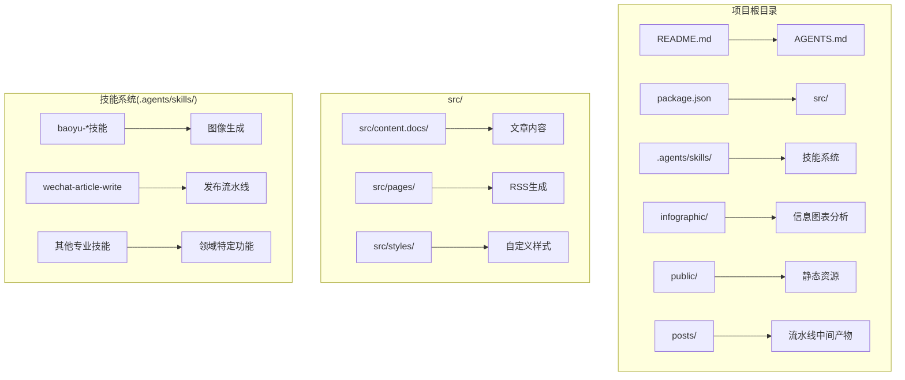
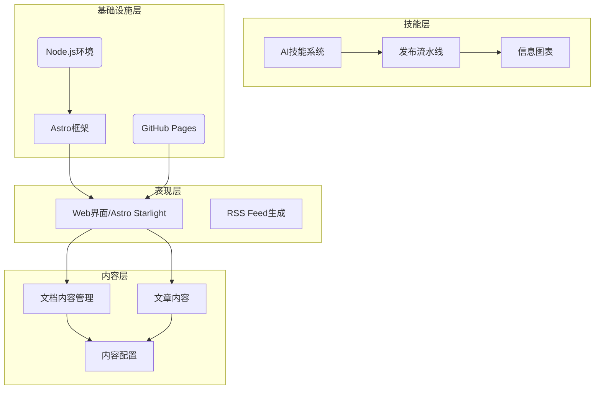
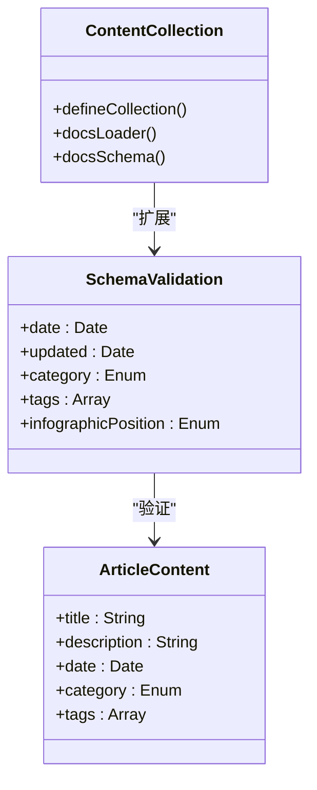
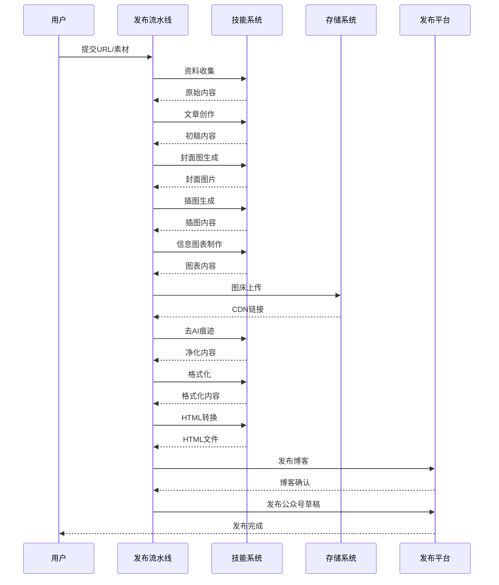
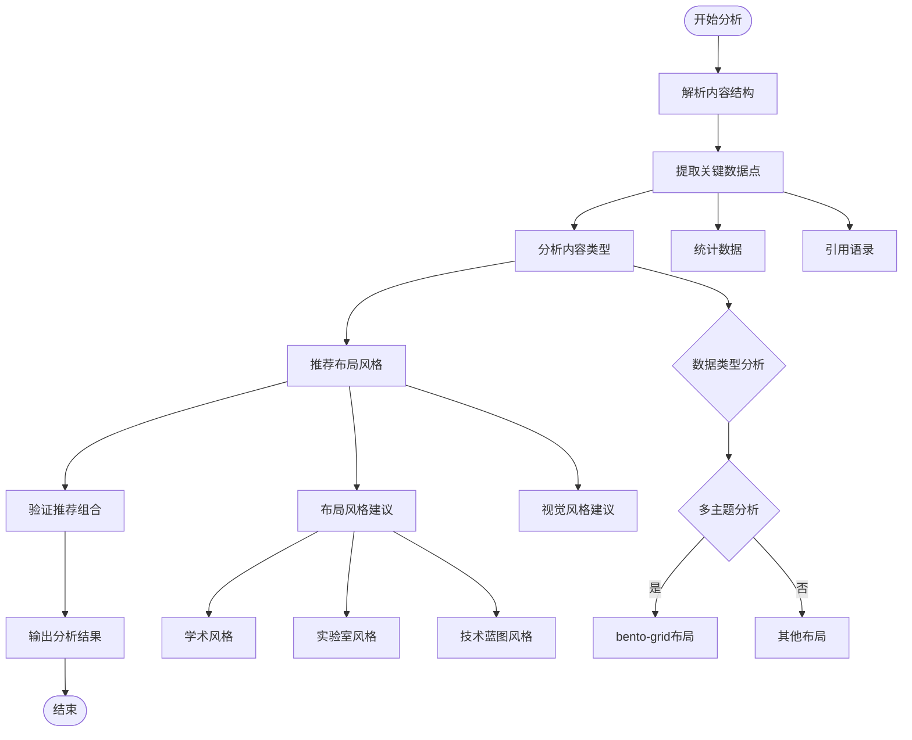
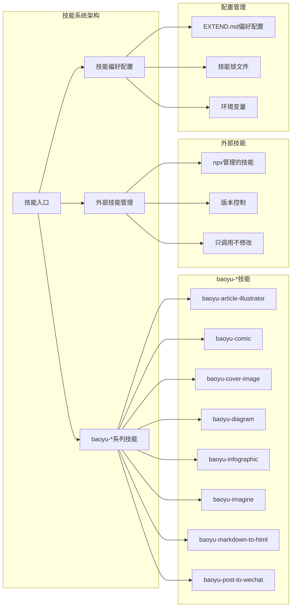
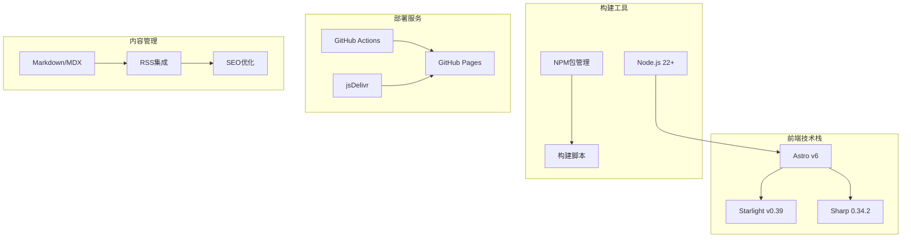

# AI模型评测

<cite>
**本文档引用的文件**
- [README.md](file://README.md)
- [AGENTS.md](file://AGENTS.md)
- [src/content.config.ts](file://src/content.config.ts)
- [package.json](file://package.json)
- [infographic/deepseek-v4-engineering/analysis.md](file://infographic/deepseek-v4-engineering/analysis.md)
- [src/content/docs/articles/2026-05-12-amazon-foundation-model-building-blocks.md](file://src/content/docs/articles/2026-05-12-amazon-foundation-model-building-blocks.md)
</cite>

## 目录
1. [简介](#简介)
2. [项目结构](#项目结构)
3. [核心组件](#核心组件)
4. [架构总览](#架构总览)
5. [详细组件分析](#详细组件分析)
6. [依赖关系分析](#依赖关系分析)
7. [性能考虑](#性能考虑)
8. [故障排除指南](#故障排除指南)
9. [结论](#结论)
10. [附录](#附录)

## 简介
本项目是一个基于 Astro Starlight 的个人博客与内容发布平台，专注于技术随笔与AI相关主题，涵盖AI辅助编程、操作系统、高性能计算、网络代理、DevOps、生物信息学等多个领域。项目集成了28个AI技能，支持从URL或素材出发的微信公众号与博客双轨发布流水线，实现从资料收集到文章发布的自动化流程。

项目的主要目标包括：
- 提供高质量的技术内容创作与发布平台
- 展示AI模型评测与分析能力
- 支持多平台内容分发（博客、微信公众号）
- 建立可重复的自动化发布流水线

## 项目结构
项目采用模块化的目录结构，主要包含以下核心部分：



**图表来源**
- [README.md:75-90](file://README.md#L75-L90)
- [AGENTS.md:22-33](file://AGENTS.md#L22-L33)

**章节来源**
- [README.md:1-99](file://README.md#L1-L99)
- [AGENTS.md:1-90](file://AGENTS.md#L1-L90)

## 核心组件
项目的核心组件包括内容管理系统、技能系统、发布流水线和信息图表分析模块。

### 内容管理系统
基于Astro Starlight构建，支持：
- 全文搜索与深色模式
- SEO优化（Open Graph、结构化数据、自动sitemap）
- RSS订阅功能
- 响应式设计与无障碍访问

### 技能系统
集成28个AI技能，分为：
- 自研技能：wechat-article-write（15阶段写作发布流水线）、github-image-hosting
- 外部技能：通过npx管理版本，只调用不修改
- 技能源文件在.agents/skills/，版本锁文件为skills-lock.json

### 发布流水线
通过wechat-article-write技能实现的自动化发布流程：
- 资料收集 → 文章创作 → 封面图 → 插图 → 信息图 → 图床上传 → CDN整合
- 去AI痕迹 → 格式化 → HTML转换 → 发布博客 → 发布公众号草稿
- 支持blog-slug生成、CDN图床批量上传、状态断点续跑

### 信息图表分析
专门的信息图表制作与分析模块，支持：
- 多主题内容结构化分析
- 视觉布局推荐与风格选择
- 数据点提取与统计分析

**章节来源**
- [README.md:12-38](file://README.md#L12-L38)
- [AGENTS.md:35-53](file://AGENTS.md#L35-L53)

## 架构总览
项目采用分层架构设计，各组件之间通过明确的接口进行交互：



**图表来源**
- [package.json:12-18](file://package.json#L12-L18)
- [src/content.config.ts:5-32](file://src/content.config.ts#L5-L32)

## 详细组件分析

### 内容配置系统
内容配置系统定义了文档集合的结构和验证规则：



**图表来源**
- [src/content.config.ts:8-30](file://src/content.config.ts#L8-L30)

内容配置的关键特性：
- 支持6种文章分类：ai-coding、ai-agents、ai-industry、ai-models、security、engineering
- 支持可选的标签系统
- 信息图表插入位置配置
- 日期字段的可选性和类型验证

**章节来源**
- [src/content.config.ts:1-33](file://src/content.config.ts#L1-L33)

### 发布流水线组件
发布流水线是项目的核心自动化组件，包含15个阶段的完整工作流程：



**图表来源**
- [AGENTS.md:42-52](file://AGENTS.md#L42-L52)

发布流水线的关键特性：
- **状态管理**：每个步骤完成后自动写入.pipeline-state.json
- **监控机制**：state-watch.mjs提供实时状态监控
- **双轨发布**：博客先发（Step 9）→ 微信草稿（Step 10）
- **错误处理**：复杂的DOM/文本树修改优先用解析器或内置技能

**章节来源**
- [AGENTS.md:42-86](file://AGENTS.md#L42-L86)

### 信息图表分析系统
信息图表分析系统提供了专业的数据分析和可视化建议：



**图表来源**
- [infographic/deepseek-v4-engineering/analysis.md:31-68](file://infographic/deepseek-v4-engineering/analysis.md#L31-L68)

信息图表分析的关键特性：
- **多主题内容分析**：支持技术、数字、人物、战略、哲学等多维度分析
- **布局推荐**：根据内容复杂度推荐合适的布局方案
- **风格匹配**：结合受众特点推荐视觉风格
- **数据提取**：自动提取关键统计数据和引用内容

**章节来源**
- [infographic/deepseek-v4-engineering/analysis.md:1-68](file://infographic/deepseek-v4-engineering/analysis.md#L1-L68)

### 技能系统架构
技能系统采用模块化设计，支持多种类型的AI技能：



**图表来源**
- [AGENTS.md:35-41](file://AGENTS.md#L35-L41)

## 依赖关系分析
项目的技术栈和依赖关系如下：



**图表来源**
- [package.json:5-18](file://package.json#L5-L18)
- [README.md:66-74](file://README.md#L66-L74)

**章节来源**
- [package.json:1-19](file://package.json#L1-L19)
- [README.md:66-74](file://README.md#L66-L74)

## 性能考虑
项目在性能方面的考虑包括：

### 构建性能
- 使用Astro的静态生成能力，减少运行时计算
- 采用Sharp进行高效的图像处理
- 优化的RSS生成和SEO元数据处理

### 内容加载性能
- 静态资源通过CDN分发
- 图片采用适当的格式和尺寸优化
- 响应式设计确保移动端性能

### 发布流水线性能
- 并行处理多个技能任务
- 状态断点续跑避免重复工作
- CDN集成减少上传时间

## 故障排除指南
常见问题及解决方案：

### 发布流水线问题
1. **状态文件损坏**
   - 检查.pipeline-state.json文件完整性
   - 使用state-watch.mjs监控状态变化
   - 必要时手动清理并重新开始

2. **技能调用失败**
   - 验证技能配置文件(.agents/skills/*/EXTEND.md)
   - 检查环境变量和API密钥
   - 查看技能日志输出

3. **CDN上传失败**
   - 验证GitHub仓库权限
   - 检查jsDelivr CDN状态
   - 确认文件格式和大小限制

### 内容显示问题
1. **文章分类不正确**
   - 检查frontmatter中的category字段
   - 确保使用正确的枚举值
   - 运行`npx astro sync`同步内容集合

2. **RSS订阅问题**
   - 验证date和updated字段格式
   - 检查RSS feed生成配置
   - 测试本地RSS解析

**章节来源**
- [AGENTS.md:72-86](file://AGENTS.md#L72-L86)

## 结论
本项目成功构建了一个功能完整的AI模型评测与内容发布平台。通过模块化的技能系统、自动化的发布流水线和专业的信息图表分析，实现了从内容创作到多平台分发的完整闭环。

项目的主要优势包括：
- **高度自动化**：15阶段的发布流水线大幅减少了人工干预
- **多平台支持**：同时支持博客和微信公众号发布
- **专业分析能力**：信息图表分析系统提供深度内容洞察
- **可扩展性**：模块化的技能系统便于添加新功能

未来可以考虑的改进方向：
- 增强AI模型评测的自动化程度
- 扩展更多的内容分发渠道
- 优化发布流水线的性能和可靠性
- 加强内容质量的自动化检测

## 附录

### 快速开始指南
```bash
# 克隆项目
git clone https://github.com/NTLx/ntlx.github.io.git
cd ntlx.github.io

# 安装依赖
npm install

# 启动开发服务器
npm run dev

# 访问 http://localhost:4321/
```

### 技术规格
- **框架**：Astro v6 + Starlight v0.39
- **运行环境**：Node.js 22+
- **部署**：GitHub Pages（GitHub Actions自动化）
- **图床**：GitHub仓库 + jsDelivr CDN
- **公众号发布**：微信公众号API

### 内容分类
项目支持6种文章分类：
- ai-coding：AI辅助编程相关
- ai-agents：AI智能体技术
- ai-industry：AI产业观察
- ai-models：AI模型评测
- security：网络安全
- engineering：工程技术

**章节来源**
- [README.md:39-74](file://README.md#L39-L74)