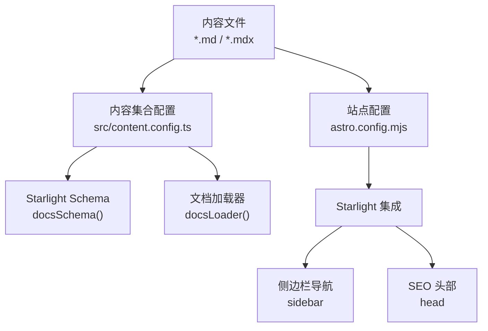
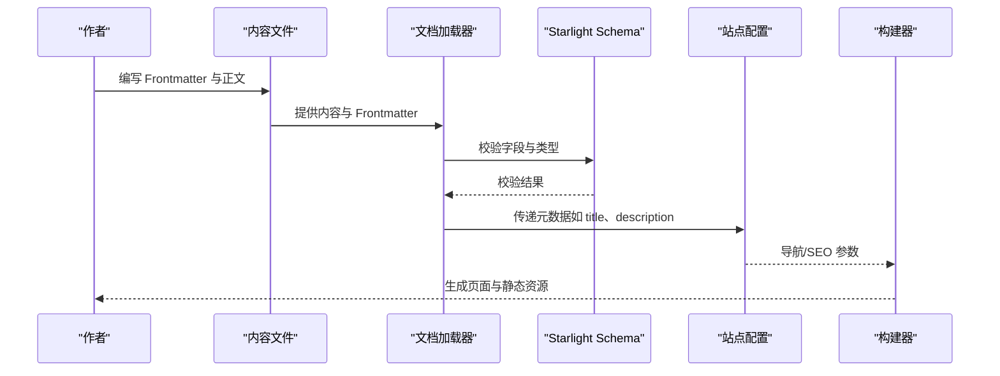
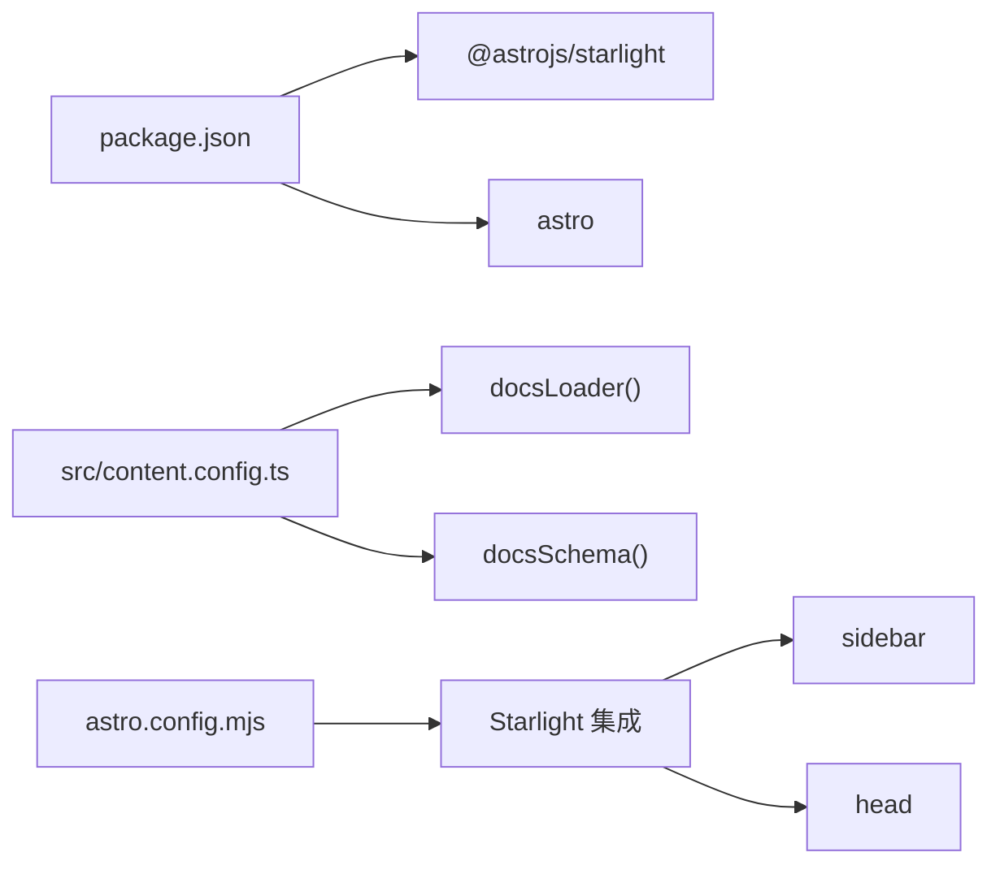

# Frontmatter 元数据规范

<cite>
**本文引用的文件**
- [src/content.config.ts](file://src/content.config.ts)
- [astro.config.mjs](file://astro.config.mjs)
- [src/content/docs/index.mdx](file://src/content/docs/index.mdx)
- [src/content/docs/ai-tools/antigravity-best-practices.md](file://src/content/docs/ai-tools/antigravity-best-practices.md)
- [src/content/docs/articles/ai-maintenance-costs-trap.md](file://src/content/docs/articles/ai-maintenance-costs-trap.md)
- [src/content/docs/devops/version-control/git.md](file://src/content/docs/devops/version-control/git.md)
- [src/content/docs/guides/blog-quality-standards.md](file://src/content/docs/guides/blog-quality-standards.md)
- [CLAUDE.md](file://CLAUDE.md)
- [.agents/skills/wechat-article-write/SKILL.md](file://.agents/skills/wechat-article-write/SKILL.md)
- [package.json](file://package.json)
</cite>

## 目录
1. [简介](#简介)
2. [项目结构](#项目结构)
3. [核心组件](#核心组件)
4. [架构总览](#架构总览)
5. [详细组件分析](#详细组件分析)
6. [依赖关系分析](#依赖关系分析)
7. [性能考量](#性能考量)
8. [故障排查指南](#故障排查指南)
9. [结论](#结论)
10. [附录](#附录)

## 简介
本文件系统化梳理 Astro Starlight 项目中 Frontmatter 的语法规则、字段定义与使用规范，覆盖内置字段（如 title、description、$schema）、可选字段（如 hero、date、tags 等）、自定义字段的添加与类型处理，并结合导航生成、SEO 优化与内容过滤的应用场景给出实操指引与验证策略。文档同时总结了项目中已有的典型内容类型（文档、文章、指南）的 Frontmatter 示例与最佳实践。

## 项目结构
本项目采用 Astro Starlight 的内容集合（Content Collections）与 Starlight Schema 对 Markdown 内容进行规范化解析与渲染。核心入口与配置如下：
- 内容集合定义：通过内容配置文件声明文档集合与加载器/校验器
- Starlight 集成：在站点配置中启用 Starlight，并通过 sidebar、head 等选项参与导航与 SEO
- 内容文件：各类型内容（文档、文章、指南）均以 MDX/Markdown 形式存放于 src/content/docs 下，使用 Frontmatter 注入元数据

图表来源
- [src/content.config.ts:1-7](file://src/content.config.ts#L1-L7)
- [astro.config.mjs:1-60](file://astro.config.mjs#L1-L60)

章节来源
- [src/content.config.ts:1-7](file://src/content.config.ts#L1-L7)
- [astro.config.mjs:1-60](file://astro.config.mjs#L1-L60)

## 核心组件
- 内容集合与加载器/校验器
  - 通过内容配置文件定义文档集合，使用 Starlight 的文档加载器与 Schema 校验器，确保 Frontmatter 字段符合 Starlight 约束
- Starlight Schema
  - 项目中显式使用 $schema: starlight，使文档遵循 Starlight 的内置字段与渲染行为
- 站点配置与导航
  - 通过站点配置中的 sidebar、head 等选项，将 Frontmatter 与站点级配置联动，实现导航生成与 SEO 优化

章节来源
- [src/content.config.ts:1-7](file://src/content.config.ts#L1-L7)
- [astro.config.mjs:57-257](file://astro.config.mjs#L57-L257)

## 架构总览
Frontmatter 在本项目中的处理流程如下：
- 内容文件包含 Frontmatter（如 title、description、$schema 等）
- Astro 通过内容集合加载器读取内容与 Frontmatter
- Starlight Schema 对 Frontmatter 进行校验与类型约束
- 站点配置中的 sidebar、head 等选项参与导航与 SEO
- 构建阶段生成页面并输出静态资源

图表来源
- [src/content.config.ts:1-7](file://src/content.config.ts#L1-L7)
- [astro.config.mjs:57-257](file://astro.config.mjs#L57-L257)

## 详细组件分析

### 内置字段与作用
- title
  - 作用：页面标题，用于渲染页面 <h1> 与 SEO 标题
  - 使用：所有内容类型均需提供；正文不得再次使用一级标题
  - 示例：参见首页与文章示例
- description
  - 作用：页面描述，用于 SEO 与社交分享预览
  - 使用：建议 50–100 字，概括主要内容
  - 示例：参见首页与文章示例
- $schema: starlight
  - 作用：声明使用 Starlight Schema，启用内置字段与渲染行为
  - 使用：所有文档类内容均需包含
  - 示例：参见文档与文章示例

章节来源
- [src/content/docs/index.mdx:1-17](file://src/content/docs/index.mdx#L1-L17)
- [src/content/docs/ai-tools/antigravity-best-practices.md:1-5](file://src/content/docs/ai-tools/antigravity-best-practices.md#L1-L5)
- [src/content/docs/articles/ai-maintenance-costs-trap.md:1-6](file://src/content/docs/articles/ai-maintenance-costs-trap.md#L1-L6)
- [CLAUDE.md:125-130](file://CLAUDE.md#L125-L130)

### 可选字段与配置
- hero
  - 作用：首页英雄区配置，包含标题、副标题与操作按钮
  - 类型：对象，包含 title、tagline、actions 等键
  - 示例：参见首页 Frontmatter
- date
  - 作用：发布日期，可用于排序与展示
  - 类型：日期字符串
  - 示例：参见文章示例
- tags
  - 作用：标签列表，便于内容分类与筛选
  - 类型：数组
  - 示例：参见指南文档中的可选字段说明
- sidebar_label / sidebar_position
  - 作用：侧边栏显示标签与排序位置
  - 类型：字符串/数字
  - 示例：参见指南文档中的可选字段说明

章节来源
- [src/content/docs/index.mdx:5-16](file://src/content/docs/index.mdx#L5-L16)
- [src/content/docs/articles/ai-maintenance-costs-trap.md:4](file://src/content/docs/articles/ai-maintenance-costs-trap.md#L4)
- [src/content/docs/guides/blog-quality-standards.md:22-27](file://src/content/docs/guides/blog-quality-standards.md#L22-L27)

### 自定义字段与类型处理
- 布尔值
  - 适用场景：开关类配置（如是否启用某些功能）
  - 处理方式：遵循 YAML/TS 的布尔表示
- 数组
  - 适用场景：tags、actions 等列表型数据
  - 处理方式：遵循 YAML 数组语法
- 对象
  - 适用场景：hero、actions 等复合结构
  - 处理方式：遵循 YAML 对象语法
- 注意事项
  - 字段命名：建议使用 kebab-case 或 camelCase，保持一致性
  - 类型约束：Starlight Schema 会对字段进行校验，不符合类型将导致构建失败

章节来源
- [src/content/docs/index.mdx:5-16](file://src/content/docs/index.mdx#L5-L16)
- [src/content/docs/guides/blog-quality-standards.md:22-27](file://src/content/docs/guides/blog-quality-standards.md#L22-L27)

### 常见内容类型的 Frontmatter 示例
- 文档（Docs）
  - 示例：AI 工具最佳实践
  - 字段：$schema、title、description
  - 用途：技术指南类内容
- 文章（Articles）
  - 示例：AI 维护成本陷阱
  - 字段：$schema、title、description、date
  - 用途：深度文章与观点类内容
- 指南（Guides）
  - 示例：博客文章质量标准
  - 字段：$schema、title、description、sidebar_label、sidebar_position、tags、author、date
  - 用途：规范与流程类内容

章节来源
- [src/content/docs/ai-tools/antigravity-best-practices.md:1-5](file://src/content/docs/ai-tools/antigravity-best-practices.md#L1-L5)
- [src/content/docs/articles/ai-maintenance-costs-trap.md:1-6](file://src/content/docs/articles/ai-maintenance-costs-trap.md#L1-L6)
- [src/content/docs/guides/blog-quality-standards.md:1-5](file://src/content/docs/guides/blog-quality-standards.md#L1-L5)

### 元数据验证机制与错误处理策略
- 构建前检查
  - 同步内容集合：新增/删除/重命名文件后执行同步命令
  - 本地构建：执行构建命令验证是否成功
  - 缓存清理：若构建失败且原因不明，清理构建缓存后重试
- 常见失败原因
  - sidebar slug 与实际文件名不匹配（大小写、中文）
  - 正文中出现与 title 冲突的一级标题
  - frontmatter 格式错误（如缺少 title）
  - 文件名不符合 kebab-case 且包含非 ASCII 字符
- 错误定位
  - 查看构建日志中的具体报错信息
  - 根据报错提示逐一修正字段与文件名

章节来源
- [.agents/skills/wechat-article-write/SKILL.md:1295-1307](file://.agents/skills/wechat-article-write/SKILL.md#L1295-L1307)
- [CLAUDE.md:113-130](file://CLAUDE.md#L113-L130)

### Frontmatter 在导航生成、SEO 优化与内容过滤中的应用
- 导航生成
  - 侧边栏配置：站点配置中的 sidebar 项与内容文件的 slug 对应，用于生成导航树
  - 标题与描述：title 用于页面标题，description 用于导航项的简要说明
- SEO 优化
  - head 配置：站点配置中的 head 选项注入 SEO 相关 meta 与脚本
  - description：用于社交分享与搜索引擎预览
- 内容过滤
  - tags：用于内容分类与筛选
  - date：用于内容排序与归档
  - sidebar_position：用于侧边栏排序

章节来源
- [astro.config.mjs:57-257](file://astro.config.mjs#L57-L257)
- [src/content/docs/guides/blog-quality-standards.md:22-27](file://src/content/docs/guides/blog-quality-standards.md#L22-L27)

## 依赖关系分析
- 内容集合与加载器/校验器
  - 内容配置文件依赖 Starlight 的 docsLoader 与 docsSchema
- 站点配置与内容集合
  - 站点配置中的 sidebar、head 等选项与内容文件的 Frontmatter 共同决定页面呈现
- 依赖版本
  - 项目使用 @astrojs/starlight 与 astro，确保 Frontmatter 与 Schema 的兼容性

图表来源
- [package.json:12-16](file://package.json#L12-L16)
- [src/content.config.ts:1-7](file://src/content.config.ts#L1-L7)
- [astro.config.mjs:1-60](file://astro.config.mjs#L1-L60)

章节来源
- [package.json:12-16](file://package.json#L12-L16)
- [src/content.config.ts:1-7](file://src/content.config.ts#L1-L7)
- [astro.config.mjs:1-60](file://astro.config.mjs#L1-L60)

## 性能考量
- 构建缓存
  - 构建过程中会生成缓存目录，必要时清理缓存可避免陈旧状态影响
- 内容体积
  - 合理使用 tags、date 等字段，避免过度冗余，有助于构建与渲染效率
- 导航层级
  - 侧边栏层级不宜过深，减少渲染与路由计算压力

## 故障排查指南
- 构建失败
  - 检查内容集合同步与本地构建是否通过
  - 若失败，清理缓存后重试
- 导航异常
  - 确认 sidebar 中的 slug 与文件名一致（大小写、字符集）
- 标题冲突
  - 正文不得使用与 Frontmatter title 对应的一级标题
- 字段缺失
  - 确保每个文档包含 $schema 与 title

章节来源
- [.agents/skills/wechat-article-write/SKILL.md:1295-1307](file://.agents/skills/wechat-article-write/SKILL.md#L1295-L1307)
- [CLAUDE.md:113-130](file://CLAUDE.md#L113-L130)

## 结论
本规范明确了 Astro Starlight 项目中 Frontmatter 的语法规则、字段定义与使用方式，给出了内置字段与可选字段的配置要点，并结合导航生成、SEO 优化与内容过滤的实际应用场景提供了实操指引。通过遵循本规范与验证策略，可确保内容的一致性与可维护性，提升站点的整体质量与用户体验。

## 附录
- 字段对照与转换（微信管线到 Starlight）
  - summary → description
  - title → title
  - date → 自定义字段（保留用于排序）
  - coverImage、sourceUrl → 移除（博客不需要）
  - $schema: starlight → 必须添加

章节来源
- [.agents/skills/wechat-article-write/SKILL.md:1280-1291](file://.agents/skills/wechat-article-write/SKILL.md#L1280-L1291)