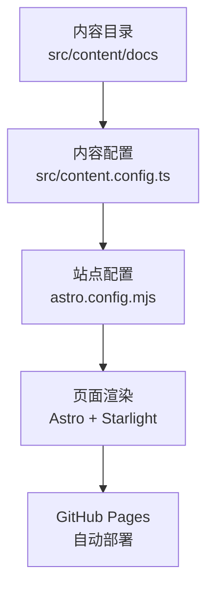
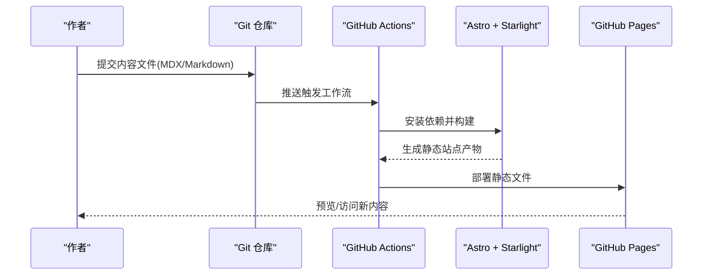
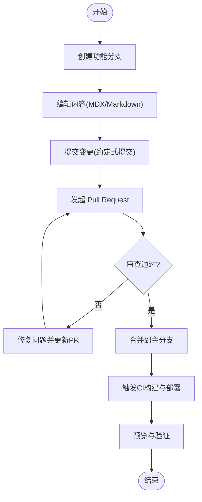
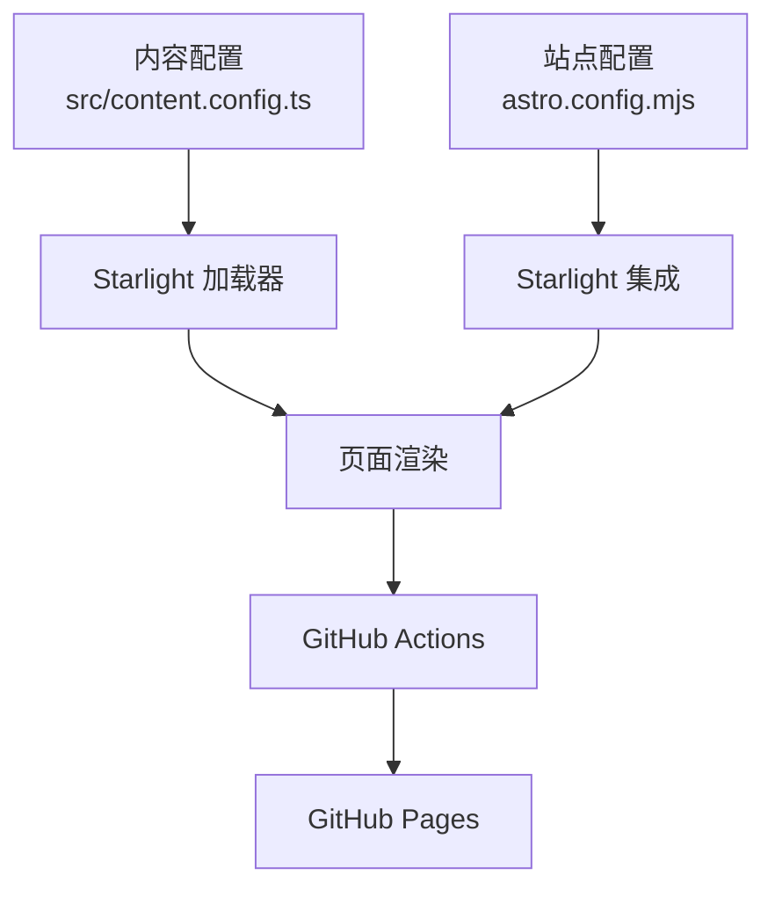

# 内容创建与编辑流程

<cite>
**本文引用的文件**
- [src/content.config.ts](file://src/content.config.ts)
- [astro.config.mjs](file://astro.config.mjs)
- [src/content/docs/index.mdx](file://src/content/docs/index.mdx)
- [src/content/docs/404.md](file://src/content/docs/404.md)
- [src/content/docs/guides/blog-quality-standards.md](file://src/content/docs/guides/blog-quality-standards.md)
- [src/content/docs/devops/version-control/git.md](file://src/content/docs/devops/version-control/git.md)
- [src/content/docs/ai-tools/install-cli-tools.md](file://src/content/docs/ai-tools/install-cli-tools.md)
- [src/content/docs/devops/shell-terminal/tmux.md](file://src/content/docs/devops/shell-terminal/tmux.md)
- [src/content/docs/network-proxy/privoxy.md](file://src/content/docs/network-proxy/privoxy.md)
- [DEPLOYMENT.md](file://DEPLOYMENT.md)
- [package.json](file://package.json)
</cite>

## 目录
1. [简介](#简介)
2. [项目结构](#项目结构)
3. [核心组件](#核心组件)
4. [架构总览](#架构总览)
5. [详细组件分析](#详细组件分析)
6. [依赖关系分析](#依赖关系分析)
7. [性能考虑](#性能考虑)
8. [故障排查指南](#故障排查指南)
9. [结论](#结论)
10. [附录](#附录)

## 简介
本指南面向内容创作者与维护者，系统讲解基于 Astro + Starlight 的知识库内容创建与编辑流程，覆盖文件命名与目录结构、MDX/Markdown 内容规范、编辑最佳实践、图片与媒体插入、版本控制与发布流程、质量检查清单与审核流程，以及批量内容处理与自动化工具的使用方法。

## 项目结构
本项目采用 Astro + Starlight 构建，内容统一存放于 src/content/docs 下，通过内容配置与站点配置驱动页面渲染与导航。关键要点：
- 内容集合通过内容配置定义，Starlight 提供加载器与模式校验。
- 站点配置定义标题、社交链接、SEO、编辑链接、侧边栏结构、最后更新时间等。
- 首页与 404 页面采用 MDX Frontmatter 配置 hero、模板与编辑链接。
- 部署通过 GitHub Actions 自动化，支持自定义域名与本地预览。

**图表来源**
- [src/content.config.ts:1-8](file://src/content.config.ts#L1-L8)
- [astro.config.mjs:1-261](file://astro.config.mjs#L1-L261)

**章节来源**
- [src/content.config.ts:1-8](file://src/content.config.ts#L1-L8)
- [astro.config.mjs:1-261](file://astro.config.mjs#L1-L261)
- [src/content/docs/index.mdx:1-43](file://src/content/docs/index.mdx#L1-L43)
- [src/content/docs/404.md:1-15](file://src/content/docs/404.md#L1-L15)

## 核心组件
- 内容集合与加载器：通过内容配置定义 docs 集合，使用 Starlight 加载器与模式校验，确保 Frontmatter 规范与页面结构一致。
- 站点配置与导航：通过站点配置定义标题、社交链接、SEO、编辑链接、侧边栏结构、最后更新时间等，驱动页面头部、社交分享、编辑入口与导航树。
- 首页与 404 页面：采用 MDX Frontmatter 配置 hero、模板与编辑链接，实现统一的视觉与交互体验。
- 部署与自动化：通过 GitHub Actions 工作流自动构建与部署至 GitHub Pages，支持手动触发与本地预览。

**章节来源**
- [src/content.config.ts:1-8](file://src/content.config.ts#L1-L8)
- [astro.config.mjs:1-261](file://astro.config.mjs#L1-L261)
- [src/content/docs/index.mdx:1-43](file://src/content/docs/index.mdx#L1-L43)
- [src/content/docs/404.md:1-15](file://src/content/docs/404.md#L1-L15)
- [DEPLOYMENT.md:1-121](file://DEPLOYMENT.md#L1-L121)

## 架构总览
内容从创建到发布的端到端流程如下：

**图表来源**
- [DEPLOYMENT.md:44-58](file://DEPLOYMENT.md#L44-L58)
- [astro.config.mjs:1-261](file://astro.config.mjs#L1-L261)

## 详细组件分析

### 内容创建与文件命名规范
- 文件类型：优先使用 MDX（支持组件与 Frontmatter）；纯文本内容使用 Markdown。
- 文件命名：使用小写短横线分隔，如 ai-tools/install-cli-tools.md；避免空格与特殊字符。
- 目录结构：按主题域组织，如 devops/version-control/git.md、network-proxy/privoxy.md、ai-tools/install-cli-tools.md。
- Frontmatter：必填字段包括 title、description；可选 sidebar_label、sidebar_position、tags、author、date 等。
- 模板使用：首页与 404 页面采用 splash 模板与 hero 配置，遵循 Starlight 模板约定。

**章节来源**
- [src/content/docs/index.mdx:1-43](file://src/content/docs/index.mdx#L1-L43)
- [src/content/docs/404.md:1-15](file://src/content/docs/404.md#L1-L15)
- [src/content/docs/guides/blog-quality-standards.md:11-28](file://src/content/docs/guides/blog-quality-standards.md#L11-L28)

### 内容编辑最佳实践
- 标题层级：使用 H2 为主标题，H3/H4 为子标题，保持层级清晰。
- 段落格式：中文使用中文标点；避免冗长句子；必要时使用 :::tip/:::caution/:::note 组件强调要点。
- 列表使用：有序/无序列表保持一致缩进；复杂步骤拆分为多级列表。
- 链接规范：内部链接使用相对路径；外部链接使用 Markdown 格式并注明来源。
- 代码块：为代码块添加语言标识符；复杂命令添加注释说明；提供跨平台命令示例（Linux/macOS/Windows）。

**章节来源**
- [src/content/docs/guides/blog-quality-standards.md:48-86](file://src/content/docs/guides/blog-quality-standards.md#L48-L86)

### 图片与媒体插入
- 本地资源：将图片放入 public 或与内容同级目录，使用相对路径引用；确保文件名小写、无空格。
- 外部链接：使用 HTTPS 链接；优先使用稳定域名与 CDN；避免过期链接。
- 响应式与可访问性：为图片添加 alt 文本；必要时提供尺寸与对比度考虑。
- 示例参考：tmux 文档中包含图片引用方式，可作为参考。

**章节来源**
- [src/content/docs/devops/shell-terminal/tmux.md:7](file://src/content/docs/devops/shell-terminal/tmux.md#L7)

### 版本控制与发布流程
- 分支管理：建议采用 Git Flow 或 GitHub Flow；主分支用于发布，功能分支用于开发。
- 提交规范：使用约定式提交；在 Git 文档中提供日志查询与历史修改技巧。
- 合并与审查：使用 Pull Request 进行代码/内容审查；合并前确保构建通过。
- 发布流程：推送主分支触发 GitHub Actions；工作流自动构建并部署至 GitHub Pages；支持手动触发与本地预览。

**图表来源**
- [src/content/docs/devops/version-control/git.md:178-197](file://src/content/docs/devops/version-control/git.md#L178-L197)
- [DEPLOYMENT.md:21-43](file://DEPLOYMENT.md#L21-L43)

**章节来源**
- [src/content/docs/devops/version-control/git.md:178-197](file://src/content/docs/devops/version-control/git.md#L178-L197)
- [DEPLOYMENT.md:21-43](file://DEPLOYMENT.md#L21-L43)

### 内容质量检查清单与审核流程
- 结构检查：Frontmatter 完整、标题层级清晰、包含引言与总结。
- 内容检查：技术准确性、代码可运行性、链接有效性、跨平台命令。
- 格式检查：语言一致性、标点正确、代码块语法高亮、提示/警告框使用正确。
- 可读性检查：易于理解、无冗余内容、排版清晰。
- 审核流程：至少一名同行评审；关注技术准确性与可操作性；通过 PR 进行讨论与修订。

**章节来源**
- [src/content/docs/guides/blog-quality-standards.md:87-132](file://src/content/docs/guides/blog-quality-standards.md#L87-L132)

### 批量内容处理与自动化工具
- 一键安装脚本：提供 AI 编程工具的批量安装与更新脚本，自动检测包管理器并执行安装/更新。
- LSP 语言服务器：提供一键安装与更新脚本，自动适配 bun/npm/uv/rustup/cpanm 等工具链。
- 本地预览：使用 npm 脚本进行本地构建与预览，便于发布前验证。
- 自动化部署：GitHub Actions 工作流自动构建与部署，支持手动触发与故障排查。

**章节来源**
- [src/content/docs/ai-tools/install-cli-tools.md:596-778](file://src/content/docs/ai-tools/install-cli-tools.md#L596-L778)
- [src/content/docs/ai-tools/install-cli-tools.md:780-800](file://src/content/docs/ai-tools/install-cli-tools.md#L780-L800)
- [src/content/docs/ai-tools/install-cli-tools.md:329-594](file://src/content/docs/ai-tools/install-cli-tools.md#L329-L594)
- [package.json:5-11](file://package.json#L5-L11)
- [DEPLOYMENT.md:88-110](file://DEPLOYMENT.md#L88-L110)

## 依赖关系分析
- 内容配置依赖 Starlight 加载器与模式校验，确保 Frontmatter 与页面结构一致。
- 站点配置依赖 Astro 与 Starlight 集成，定义导航、编辑链接、SEO、社交等。
- 部署依赖 GitHub Actions 工作流，自动安装 Node.js、依赖与构建产物。

**图表来源**
- [src/content.config.ts:1-8](file://src/content.config.ts#L1-L8)
- [astro.config.mjs:1-261](file://astro.config.mjs#L1-L261)
- [DEPLOYMENT.md:44-58](file://DEPLOYMENT.md#L44-L58)

**章节来源**
- [src/content.config.ts:1-8](file://src/content.config.ts#L1-L8)
- [astro.config.mjs:1-261](file://astro.config.mjs#L1-L261)
- [DEPLOYMENT.md:44-58](file://DEPLOYMENT.md#L44-L58)

## 性能考虑
- 构建性能：使用 Astro 的静态生成与按需渲染，减少运行时开销。
- 资源优化：压缩图片与静态资源；使用相对路径避免重复加载。
- 预览验证：在本地预览生产构建，提前发现性能与兼容性问题。
- 缓存策略：利用浏览器缓存与 CDN 加速，结合 GitHub Pages 的静态托管。

## 故障排查指南
- 构建失败：检查 Actions 日志、本地 npm run build 是否通过、Node.js 版本是否满足要求。
- 部署成功但 404：确认 GitHub Pages 源为 GitHub Actions、站点配置中的 site 地址正确。
- 样式或资源加载失败：检查资源路径是否为相对路径、清理浏览器缓存后重试。
- 内容未出现在导航：检查站点配置中的侧边栏条目与 slug 是否匹配。

**章节来源**
- [DEPLOYMENT.md:68-87](file://DEPLOYMENT.md#L68-L87)
- [astro.config.mjs:57-257](file://astro.config.mjs#L57-L257)

## 结论
通过规范的内容创建与编辑流程、严格的版本控制与发布机制、完善的质量检查与审核流程，以及批量处理与自动化工具的使用，可以高效、稳定地维护与扩展本知识库。建议团队在协作中遵循本文档的规范，并持续优化自动化流程与质量标准。

## 附录
- 本地开发与预览：使用 npm 脚本启动开发服务器与预览生产构建。
- 首页与 404 页面：采用 MDX Frontmatter 配置 hero 与模板，确保统一的视觉与交互体验。
- 侧边栏与导航：通过站点配置集中管理，确保内容组织与可发现性。

**章节来源**
- [package.json:5-11](file://package.json#L5-L11)
- [src/content/docs/index.mdx:1-43](file://src/content/docs/index.mdx#L1-L43)
- [src/content/docs/404.md:1-15](file://src/content/docs/404.md#L1-L15)
- [astro.config.mjs:57-257](file://astro.config.mjs#L57-L257)