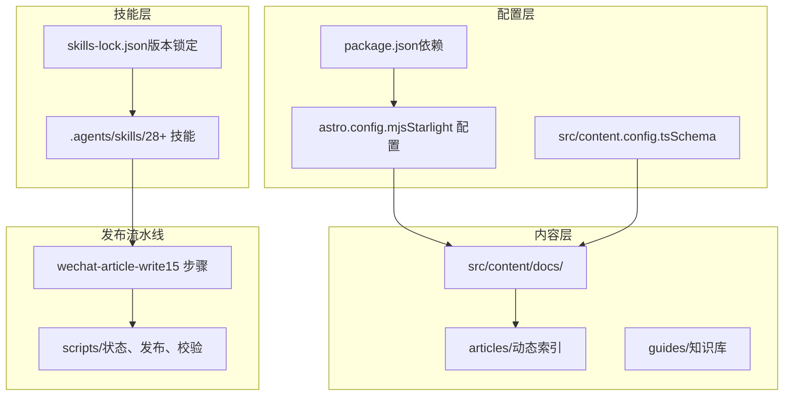
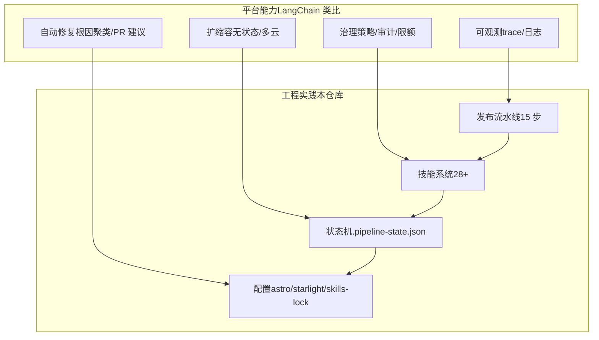
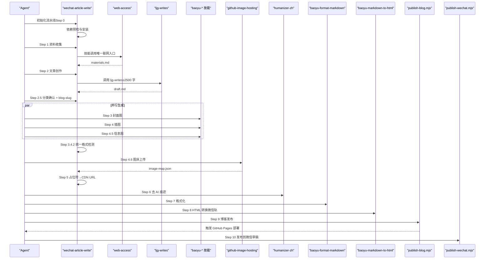
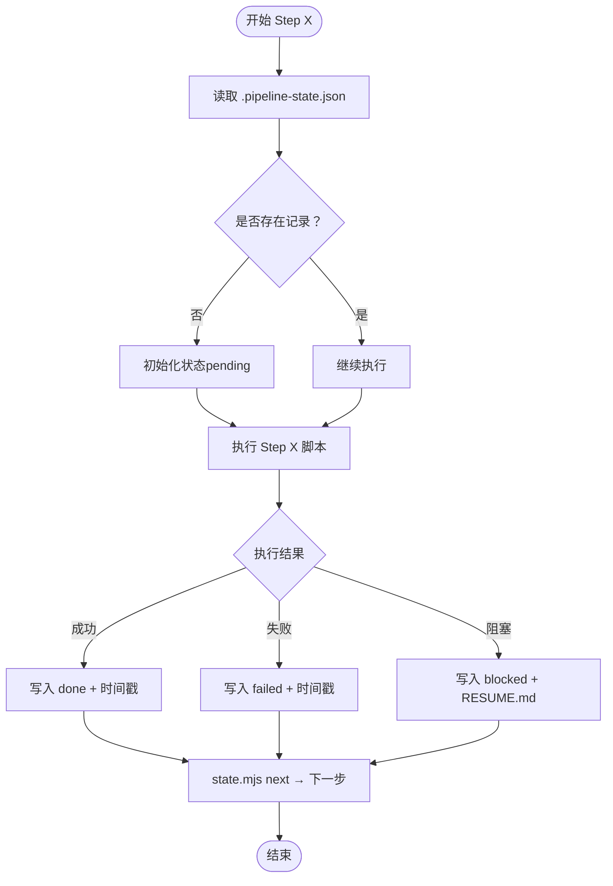
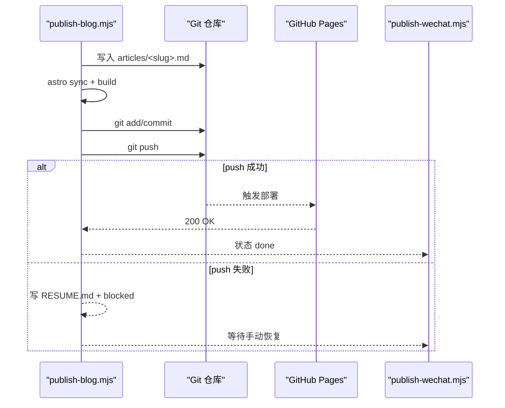
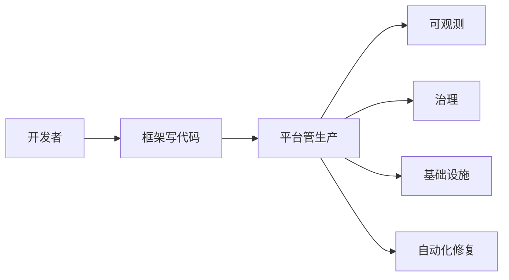
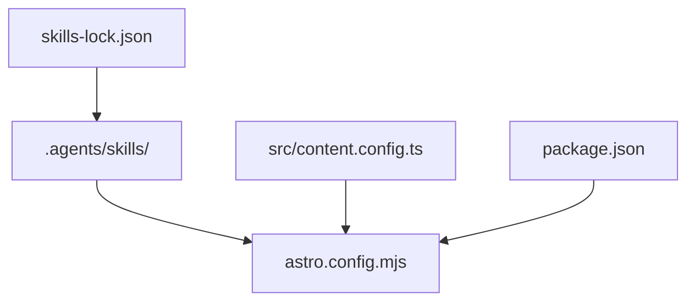

# LangChain 不再做框架了

<cite>
**本文档引用的文件**
- [README.md](file://README.md)
- [AGENTS.md](file://AGENTS.md)
- [package.json](file://package.json)
- [astro.config.mjs](file://astro.config.mjs)
- [skills-lock.json](file://skills-lock.json)
- [src/content.config.ts](file://src/content.config.ts)
- [src/pages/rss.xml.js](file://src/pages/rss.xml.js)
- [.agents/skills/wechat-article-write/SKILL.md](file://.agents/skills/wechat-article-write/SKILL.md)
- [.agents/skills/wechat-article-write/scripts/state.mjs](file://.agents/skills/wechat-article-write/scripts/state.mjs)
- [.agents/skills/wechat-article-write/scripts/publish-blog.mjs](file://.agents/skills/wechat-article-write/scripts/publish-blog.mjs)
- [.agents/skills/wechat-article-write/scripts/publish-wechat.mjs](file://.agents/skills/wechat-article-write/scripts/publish-wechat.mjs)
- [src/content/docs/articles/langchain-interrupt-2026-agent-platform.md](file://src/content/docs/articles/langchain-interrupt-2026-agent-platform.md)
</cite>

## 目录
1. [简介](#简介)
2. [项目结构](#项目结构)
3. [核心组件](#核心组件)
4. [架构总览](#架构总览)
5. [详细组件分析](#详细组件分析)
6. [依赖分析](#依赖分析)
7. [性能考虑](#性能考虑)
8. [故障排查指南](#故障排查指南)
9. [结论](#结论)
10. [附录](#附录)

## 简介
本仓库基于 Astro Starlight 构建个人博客与知识库，核心特色在于集成「微信公众号 + 博客双轨发布流水线」，以及 28+ AI 技能的技能系统。文章《LangChain 不再做框架了》系统梳理了 LangChain 在 Interrupt 2026 上释放的信号：从「帮助开发者写 agent 代码」转向「帮助团队把 agent 管起来」，强调生产级可观测、治理、基础设施与平台化能力。本文档围绕该主题，结合仓库中的技能系统与发布流水线，解释如何在工程实践中落地「从框架到平台」的演进。

**章节来源**
- [README.md:1-99](file://README.md#L1-L99)
- [AGENTS.md:1-88](file://AGENTS.md#L1-L88)
- [src/content/docs/articles/langchain-interrupt-2026-agent-platform.md:1-148](file://src/content/docs/articles/langchain-interrupt-2026-agent-platform.md#L1-L148)

## 项目结构
仓库采用「内容 + 技能 + 配置」三层结构：
- 内容层：`src/content/docs/` 下的 Markdown/MDX 文档，通过 Starlight 自动索引与侧边栏生成。
- 技能层：`.agents/skills/` 下的技能目录，包含 28+ 技能，覆盖写作、图像、翻译、信息图、发布等。
- 配置层：`astro.config.mjs`、`src/content.config.ts`、`skills-lock.json` 等，统一站点配置、内容 Schema 与技能版本锁定。

**图表来源**
- [astro.config.mjs:1-130](file://astro.config.mjs#L1-L130)
- [src/content.config.ts:1-31](file://src/content.config.ts#L1-L31)
- [skills-lock.json:1-241](file://skills-lock.json#L1-L241)
- [.agents/skills/wechat-article-write/SKILL.md:1-800](file://.agents/skills/wechat-article-write/SKILL.md#L1-L800)

**章节来源**
- [README.md:75-90](file://README.md#L75-L90)
- [AGENTS.md:22-34](file://AGENTS.md#L22-L34)

## 核心组件
- 微信公众号文章写作流水线（wechat-article-write）
  - 15 步骤的端到端流水线，包含资料收集、创作、封面/插图/信息图并行生成、图床上传、去 AI 痕迹、格式化、HTML 转换、博客发布、等待 Pages 部署、微信草稿发布。
  - 双轨分离：博客轨消费 CDN URL 的 Markdown；微信轨消费本地 HTML + 本地图片路径。
  - 状态内聚：每个 Step 通过脚本自动写入 `.pipeline-state.json`，支持断点续跑。
- 技能系统
  - 项目级技能在 `.agents/skills/`，版本通过 `skills-lock.json` 锁定；调用方式分为「Skill 工具调用型」与「脚本执行型」。
  - 外部技能通过 `npx skills` 管理版本，只调用不修改。
- 站点与内容
  - Astro + Starlight，支持 SEO、RSS、编辑链接、侧边栏自动生成。
  - 内容 Schema 限定 `date`、`updated`、`category`、`tags`，分类枚举为 6 个。

**章节来源**
- [.agents/skills/wechat-article-write/SKILL.md:18-52](file://.agents/skills/wechat-article-write/SKILL.md#L18-L52)
- [AGENTS.md:35-41](file://AGENTS.md#L35-L41)
- [src/content.config.ts:8-28](file://src/content.config.ts#L8-L28)

## 架构总览
LangChain 的「从框架到平台」转型体现在：框架阶段关注「写出一个 agent」，平台阶段关注「规模化管理 agent 的生产运行」。本仓库通过技能系统与发布流水线，体现同样的工程化演进：

**图表来源**
- [src/content/docs/articles/langchain-interrupt-2026-agent-platform.md:25-124](file://src/content/docs/articles/langchain-interrupt-2026-agent-platform.md#L25-L124)
- [.agents/skills/wechat-article-write/SKILL.md:128-153](file://.agents/skills/wechat-article-write/SKILL.md#L128-L153)

## 详细组件分析

### 组件 A：微信公众号文章写作流水线
- 流水线概览（15 步）
  - Step 0：依赖预检与安装
  - Step 1：资料收集（唯一联网入口 web-access）
  - Step 2：文章创作（ljg-writes，≥2500 字，含互动与原文参考）
  - Step 2.5：分类确认 + blog-slug 生成
  - 并行：Step 3（封面图）、Step 4（插图）、Step 4.5（信息图）
  - Step 3.4.2：统一格式检测（PNG→JPG）
  - Step 4.6：图床上传（GitHub 图床 + CDN）
  - Step 5：占位符→CDN URL（生成 article.md 与 article-local.md）
  - Step 6：去 AI 痕迹（humanizer-zh）
  - Step 7：Markdown 格式化（baoyu-format-markdown）
  - Step 8：HTML 转换（baoyu-markdown-to-html，微信轨）
  - Step 9：博客发布（publish-blog.mjs，写入 src/content/docs/articles/）
  - Step 9.5：等待 Pages 部署（可选）
  - Step 10：发布到微信草稿（publish-wechat.mjs）

**图表来源**
- [.agents/skills/wechat-article-write/SKILL.md:128-153](file://.agents/skills/wechat-article-write/SKILL.md#L128-L153)
- [.agents/skills/wechat-article-write/scripts/publish-blog.mjs:17-275](file://.agents/skills/wechat-article-write/scripts/publish-blog.mjs#L17-L275)
- [.agents/skills/wechat-article-write/scripts/publish-wechat.mjs:12-117](file://.agents/skills/wechat-article-write/scripts/publish-wechat.mjs#L12-L117)

**章节来源**
- [.agents/skills/wechat-article-write/SKILL.md:128-173](file://.agents/skills/wechat-article-write/SKILL.md#L128-L173)
- [.agents/skills/wechat-article-write/SKILL.md:281-357](file://.agents/skills/wechat-article-write/SKILL.md#L281-L357)
- [.agents/skills/wechat-article-write/SKILL.md:358-592](file://.agents/skills/wechat-article-write/SKILL.md#L358-L592)
- [.agents/skills/wechat-article-write/SKILL.md:593-696](file://.agents/skills/wechat-article-write/SKILL.md#L593-L696)
- [.agents/skills/wechat-article-write/SKILL.md:697-790](file://.agents/skills/wechat-article-write/SKILL.md#L697-L790)
- [.agents/skills/wechat-article-write/SKILL.md:790-800](file://.agents/skills/wechat-article-write/SKILL.md#L790-L800)

### 组件 B：状态机与断点续跑
- 状态文件：`.pipeline-state.json`，记录每个 Step 的状态与时间戳。
- 命令行工具：`state.mjs`，支持初始化、查询、设置、推进到下一步、导出。
- 断点续跑：Step 9（博客发布）若 push 失败，写入 `RESUME.md`，状态标记为 `blocked`，后续可恢复。

**图表来源**
- [.agents/skills/wechat-article-write/scripts/state.mjs:1-128](file://.agents/skills/wechat-article-write/scripts/state.mjs#L1-L128)
- [.agents/skills/wechat-article-write/scripts/publish-blog.mjs:183-275](file://.agents/skills/wechat-article-write/scripts/publish-blog.mjs#L183-L275)

**章节来源**
- [.agents/skills/wechat-article-write/scripts/state.mjs:12-103](file://.agents/skills/wechat-article-write/scripts/state.mjs#L12-L103)
- [.agents/skills/wechat-article-write/scripts/publish-blog.mjs:207-275](file://.agents/skills/wechat-article-write/scripts/publish-blog.mjs#L207-L275)

### 组件 C：博客发布与微信发布
- 博客发布（Step 9）
  - 校验 frontmatter（title/date/summary/category），转换为 Starlight Schema，写入 `src/content/docs/articles/<slug>.md`。
  - 执行 `astro sync` 与 `build`，git add/commit，push（失败写 RESUME.md 并标记 blocked）。
- 微信发布（Step 10）
  - 读取 article.md frontmatter 提取 title/sourceUrl，探活 sourceUrl（HTTP 200）。
  - 调用 baoyu-post-to-wechat 脚本，传入本地 HTML 与图片路径，微信 API 直接读本地文件上传。

**图表来源**
- [.agents/skills/wechat-article-write/scripts/publish-blog.mjs:17-275](file://.agents/skills/wechat-article-write/scripts/publish-blog.mjs#L17-L275)
- [.agents/skills/wechat-article-write/scripts/publish-wechat.mjs:12-117](file://.agents/skills/wechat-article-write/scripts/publish-wechat.mjs#L12-L117)

**章节来源**
- [.agents/skills/wechat-article-write/scripts/publish-blog.mjs:177-203](file://.agents/skills/wechat-article-write/scripts/publish-blog.mjs#L177-L203)
- [.agents/skills/wechat-article-write/scripts/publish-wechat.mjs:74-81](file://.agents/skills/wechat-article-write/scripts/publish-wechat.mjs#L74-L81)

### 概念性总览：从框架到平台的工程化演进
- 框架期：追求「能跑通」，关注单体 agent 的正确性与效果。
- 平台期：追求「能稳定运行」，关注可观测、治理、扩缩容与自动化修复。
- 本仓库实践：通过技能系统与流水线，将「写代码」逐步外包给「平台能力」，工程师聚焦于业务价值与协作治理。

（本图为概念性示意，不直接映射具体源码文件）

## 依赖分析
- 技能版本锁定：`skills-lock.json` 统一管理 28+ 技能来源与哈希，确保可复现与可审计。
- 站点依赖：`package.json` 指定 Astro 6 + Starlight 0.39，RSS 集成与 sharp 图像处理。
- 内容 Schema：`src/content.config.ts` 限定分类枚举与可选字段，保证内容一致性。

**图表来源**
- [skills-lock.json:1-241](file://skills-lock.json#L1-L241)
- [package.json:1-19](file://package.json#L1-L19)
- [src/content.config.ts:1-31](file://src/content.config.ts#L1-L31)
- [astro.config.mjs:1-130](file://astro.config.mjs#L1-L130)

**章节来源**
- [skills-lock.json:1-241](file://skills-lock.json#L1-L241)
- [package.json:12-18](file://package.json#L12-L18)
- [src/content.config.ts:8-28](file://src/content.config.ts#L8-L28)

## 性能考虑
- 并行执行：封面图、插图、信息图三者并行，显著缩短总耗时。
- 统一格式检测：集中处理 PNG→JPG 修正，避免遗漏。
- 本地文件优先：微信轨全程本地文件操作，减少 CDN 依赖与网络抖动。
- 状态内聚：每个 Step 自动写入状态，便于快速定位瓶颈与断点续跑。

（本节为通用指导，不直接分析具体文件）

## 故障排查指南
- 依赖缺失或安装失败
  - 现象：Step 0 检查失败或安装报错。
  - 处理：查看 `bun install` 输出，确认技能目录与入口脚本存在。
- 网络抓取失败
  - 现象：Step 1 web-access 失败（登录/反爬/超时）。
  - 处理：按提示在 Chrome 登录目标站点，或降级为用户手动提供内容。
- 图片格式不匹配
  - 现象：Gemini 返回 JPEG 内容但扩展名为 .png。
  - 处理：执行 Step 3.4.2 统一格式检测，修正扩展名并更新引用。
- 博客发布 push 失败
  - 现象：Step 9 push 失败，生成 `RESUME.md`。
  - 处理：按指引重新推送或使用 gh CLI，随后升级状态为 done 并继续后续步骤。
- 微信草稿发布 sourceUrl 未就绪
  - 现象：Step 10 探活失败（HTTP 非 200）。
  - 处理：先执行 Step 9.5 等待 Pages 部署完成，再发布微信草稿。

**章节来源**
- [.agents/skills/wechat-article-write/SKILL.md:220-280](file://.agents/skills/wechat-article-write/SKILL.md#L220-L280)
- [.agents/skills/wechat-article-write/SKILL.md:281-357](file://.agents/skills/wechat-article-write/SKILL.md#L281-L357)
- [.agents/skills/wechat-article-write/SKILL.md:661-696](file://.agents/skills/wechat-article-write/SKILL.md#L661-L696)
- [.agents/skills/wechat-article-write/scripts/publish-blog.mjs:194-275](file://.agents/skills/wechat-article-write/scripts/publish-blog.mjs#L194-L275)
- [.agents/skills/wechat-article-write/scripts/publish-wechat.mjs:74-81](file://.agents/skills/wechat-article-write/scripts/publish-wechat.mjs#L74-L81)

## 结论
LangChain 的「从框架到平台」转型，本质是从「能跑通」走向「能稳定运行」。本仓库通过技能系统与发布流水线，将「写代码」逐步外包给「平台能力」，工程师聚焦于业务价值与协作治理。对于团队而言，当 agent 数量从 1→10→100→100+ 时，基础设施与平台能力的价值愈发凸显：可观测、治理、扩缩容与自动化修复，构成了生产级 agent 管理的核心支柱。

（本节为总结性内容，不直接分析具体文件）

## 附录
- 站点配置与 RSS
  - Starlight 配置：社交图标、SEO、侧边栏自动生成、最后更新时间、自定义 CSS。
  - RSS：按 date 降序生成，注入 atom:updated，自引用 atom:link。
- 文章《LangChain 不再做框架了》要点
  - Engine：失败聚类、根因诊断、PR 修复建议、在线评估器、离线评估套件。
  - SmithDB：专为 agent trace 设计的数据库，无状态、对象存储持久化。
  - Sandboxes：微虚拟化沙盒，隔离、快照、自动暂停、认证代理注入。
  - Context Hub：行为文件版本管理与协作。
  - LLM Gateway：治理层，策略分层、审计日志、trace 连续性。
  - Fleet：预建 agent（Coding/GTM/X/高管助理/竞品研究）。
  - Labs：用 agent trace 做持续学习，生成 eval、环境设计、Harness 工程、模型选择、prompt 优化、fine-tuning。

**章节来源**
- [astro.config.mjs:10-129](file://astro.config.mjs#L10-L129)
- [src/pages/rss.xml.js:14-67](file://src/pages/rss.xml.js#L14-L67)
- [src/content/docs/articles/langchain-interrupt-2026-agent-platform.md:25-138](file://src/content/docs/articles/langchain-interrupt-2026-agent-platform.md#L25-L138)