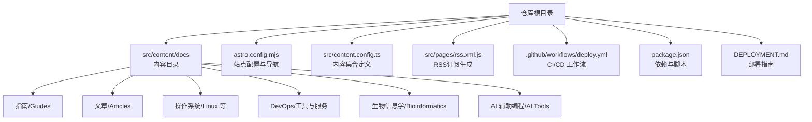
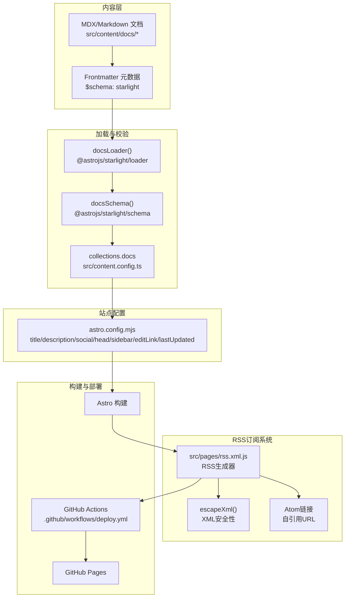
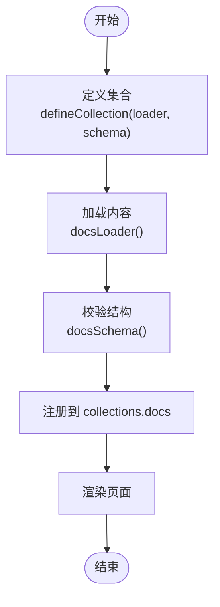
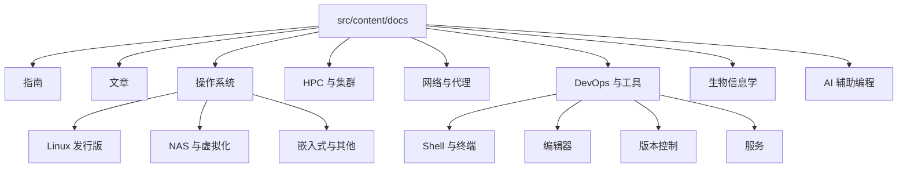
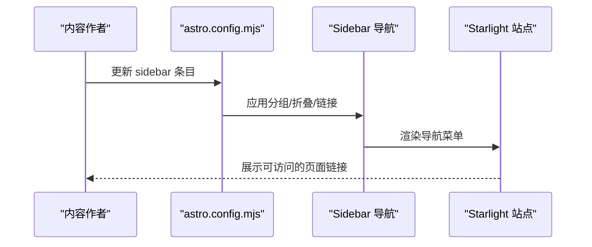
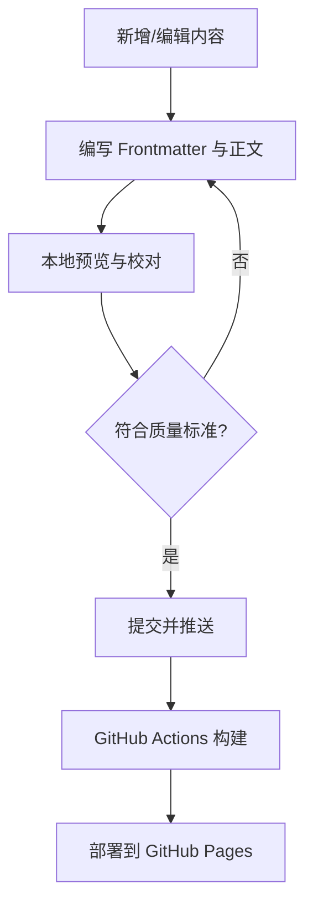
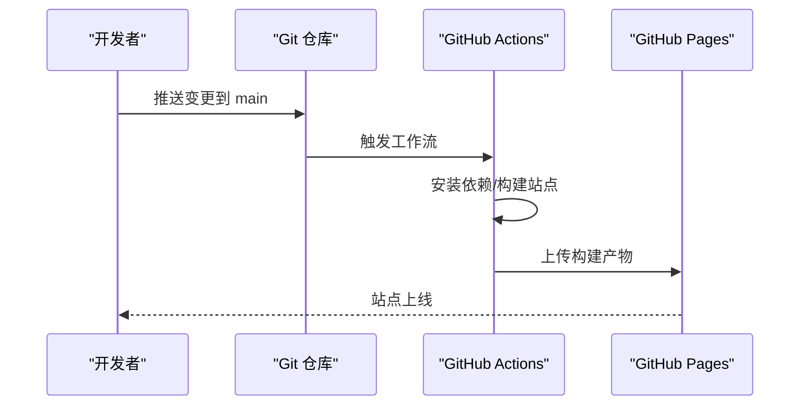
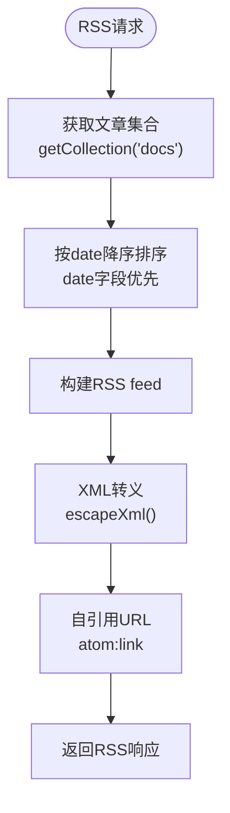
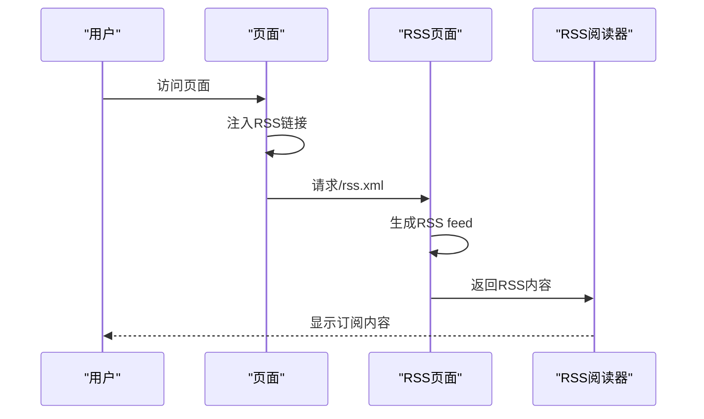
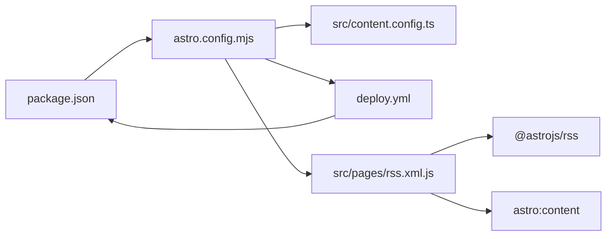

# 内容管理系统

<cite>
**本文引用的文件**
- [package.json](file://package.json)
- [astro.config.mjs](file://astro.config.mjs)
- [src/content.config.ts](file://src/content.config.ts)
- [src/content/docs/index.mdx](file://src/content/docs/index.mdx)
- [src/content/docs/404.md](file://src/content/docs/404.md)
- [src/content/docs/articles/ai-maintenance-costs-trap.md](file://src/content/docs/articles/ai-maintenance-costs-trap.md)
- [src/content/docs/devops/version-control/git.md](file://src/content/docs/devops/version-control/git.md)
- [src/content/docs/operating-systems/linux/arch-linux.md](file://src/content/docs/operating-systems/linux/arch-linux.md)
- [src/content/docs/ai-tools/antigravity-best-practices.md](file://src/content/docs/ai-tools/antigravity-best-practices.md)
- [src/content/docs/guides/blog-quality-standards.md](file://src/content/docs/guides/blog-quality-standards.md)
- [src/pages/rss.xml.js](file://src/pages/rss.xml.js)
- [migrate_docs.py](file://migrate_docs.py)
- [DEPLOYMENT.md](file://DEPLOYMENT.md)
- [.github/workflows/deploy.yml](file://.github/workflows/deploy.yml)
- [README.md](file://README.md)
</cite>

## 更新摘要
**变更内容**
- 新增RSS功能增强章节，详细介绍date和updated字段支持
- 更新XML安全性改进部分，说明escapeXml函数的作用
- 添加RSS订阅集成说明，展示自引用URL和Atom链接
- 更新Frontmatter元数据规范，包含updated字段使用指南

## 目录
1. [简介](#简介)
2. [项目结构](#项目结构)
3. [核心组件](#核心组件)
4. [架构总览](#架构总览)
5. [详细组件分析](#详细组件分析)
6. [RSS功能增强](#rss功能增强)
7. [依赖关系分析](#依赖关系分析)
8. [性能考量](#性能考量)
9. [故障排查指南](#故障排查指南)
10. [结论](#结论)
11. [附录](#附录)

## 简介
本文件面向 NTLx's Blog 的内容管理系统，围绕 Astro Starlight 的内容集合（Content Collections）机制、Frontmatter 元数据规范与内容组织结构展开，结合 MDX/Markdown 内容的创建、编辑与管理流程，系统阐述导航配置、搜索实现原理、响应式设计适配策略，并提供内容发布工作流、版本管理与备份策略、主题定制与样式系统使用方法。文档旨在帮助内容作者与运维人员高效理解与维护站点。

**更新** 本版本新增了RSS功能增强章节，详细说明date和updated字段支持、XML安全性改进和RSS订阅集成。

## 项目结构
- 项目采用 Astro v5 + Starlight v0.37，内容统一放置于 src/content/docs 下，按主题与类别组织。
- 构建与部署通过 GitHub Actions 自动化，站点托管于 GitHub Pages。
- 项目同时具备"博客文章"与"微信公众号文章"的双重发布能力，形成统一的内容来源与发布流水线。
- **RSS功能**：通过自定义RSS页面提供XML格式的订阅源，支持date和updated字段。



**图表来源**
- [astro.config.mjs:57-257](file://astro.config.mjs#L57-L257)
- [src/content.config.ts:5-7](file://src/content.config.ts#L5-L7)
- [src/pages/rss.xml.js:14-67](file://src/pages/rss.xml.js#L14-L67)
- [README.md:73-84](file://README.md#L73-L84)

**章节来源**
- [README.md:66-84](file://README.md#L66-L84)
- [astro.config.mjs:57-257](file://astro.config.mjs#L57-L257)
- [src/content.config.ts:5-7](file://src/content.config.ts#L5-L7)
- [src/pages/rss.xml.js:14-67](file://src/pages/rss.xml.js#L14-L67)

## 核心组件
- 内容集合（Content Collections）
  - 通过 src/content.config.ts 定义 docs 集合，使用 @astrojs/starlight/loader 与 schema 加载与校验内容。
- 导航系统（Sidebar）
  - 在 astro.config.mjs 中集中配置，按主题分组、折叠与层级组织，支持编辑链接、最后更新时间等增强项。
- Frontmatter 元数据
  - 使用 $schema: starlight 确保元数据结构符合 Starlight 规范；常见字段包括 title、description、date、tags、sidebar_label、sidebar_position 等。
  - **RSS支持**：date和updated字段用于RSS订阅生成，提供准确的发布时间和更新时间。
- 搜索与 SEO
  - 通过 head 注入 Google Analytics；站点配置包含 og:image 等 SEO 元信息。
- 部署与自动化
  - GitHub Actions 工作流自动构建与部署至 GitHub Pages；支持手动触发与本地预览。
- **RSS订阅系统**
  - 自定义RSS页面生成XML格式的订阅源
  - 支持XML安全性，防止特殊字符破坏RSS feed
  - 集成自引用URL和Atom链接

**章节来源**
- [src/content.config.ts:1-8](file://src/content.config.ts#L1-L8)
- [astro.config.mjs:10-56](file://astro.config.mjs#L10-L56)
- [astro.config.mjs:57-257](file://astro.config.mjs#L57-L257)
- [src/content/docs/index.mdx:1-17](file://src/content/docs/index.mdx#L1-L17)
- [src/content/docs/404.md:1-14](file://src/content/docs/404.md#L1-L14)
- [.github/workflows/deploy.yml:1-71](file://.github/workflows/deploy.yml#L1-L71)
- [src/pages/rss.xml.js:4-12](file://src/pages/rss.xml.js#L4-L12)
- [src/pages/rss.xml.js:33-39](file://src/pages/rss.xml.js#L33-L39)

## 架构总览
下图展示内容从创建、加载、渲染到发布的整体流程，涵盖内容集合、导航、搜索与部署。



**图表来源**
- [src/content.config.ts:5-7](file://src/content.config.ts#L5-L7)
- [astro.config.mjs:10-56](file://astro.config.mjs#L10-L56)
- [src/pages/rss.xml.js:4-12](file://src/pages/rss.xml.js#L4-L12)
- [src/pages/rss.xml.js:33-39](file://src/pages/rss.xml.js#L33-L39)
- [.github/workflows/deploy.yml:24-71](file://.github/workflows/deploy.yml#L24-L71)

## 详细组件分析

### 内容集合与加载机制
- 集合定义
  - 使用 defineCollection 指定 loader 与 schema，确保内容结构与类型安全。
- 加载与校验
  - docsLoader 负责扫描与解析内容；docsSchema 提供元数据与页面结构的校验规则。
- 影响范围
  - 所有 Markdown/MDX 文档遵循同一套元数据与结构约束，保证站点一致性与可维护性。



**图表来源**
- [src/content.config.ts:5-7](file://src/content.config.ts#L5-L7)

**章节来源**
- [src/content.config.ts:1-8](file://src/content.config.ts#L1-L8)

### Frontmatter 元数据规范
- 规范要点
  - 必填字段：$schema: starlight、title、description。
  - 常用可选字段：date、tags、author、sidebar_label、sidebar_position、editUrl、template 等。
  - **RSS支持字段**：date（发布日期）和updated（更新日期）。
- 示例参考
  - 首页与 404 页面均采用统一 Frontmatter 结构，首页包含 hero 与 actions，404 页面关闭 editUrl 并提供返回首页的操作按钮。
- 类型与校验
  - 通过 docsSchema() 对字段进行类型与取值范围校验，避免无效或缺失字段导致渲染异常。
- **RSS字段使用**
  - date字段用于RSS中的pubDate
  - updated字段用于RSS中的atom:updated
  - 如果缺少updated，则回退到date字段

```mermaid
erDiagram
FRONTMATTER {
string $schema
string title
string description
date date
date updated
string[] tags
string author
string sidebar_label
number sidebar_position
boolean editUrl
string template
}
```

**图表来源**
- [src/content/docs/index.mdx:1-17](file://src/content/docs/index.mdx#L1-L17)
- [src/content/docs/404.md:1-14](file://src/content/docs/404.md#L1-L14)
- [src/content/docs/guides/blog-quality-standards.md:11-28](file://src/content/docs/guides/blog-quality-standards.md#L11-L28)

**章节来源**
- [src/content/docs/index.mdx:1-17](file://src/content/docs/index.mdx#L1-L17)
- [src/content/docs/404.md:1-14](file://src/content/docs/404.md#L1-L14)
- [src/content/docs/guides/blog-quality-standards.md:11-28](file://src/content/docs/guides/blog-quality-standards.md#L11-L28)

### 内容组织与主题分类
- 主题维度
  - AI 辅助编程、操作系统（Linux、NAS/虚拟化、嵌入式）、HPC 与集群、网络与代理、DevOps（Shell/编辑器/版本控制/服务）、生物信息学、指南、文章等。
- 目录结构
  - 采用 feature-based 组织方式，每个主题下按子主题进一步细分，便于维护与检索。
- 示例
  - Git 配置与技巧、Arch Linux 安装指南、Antigravity 最佳实践等，体现内容深度与实用性。



**图表来源**
- [astro.config.mjs:57-257](file://astro.config.mjs#L57-L257)

**章节来源**
- [astro.config.mjs:57-257](file://astro.config.mjs#L57-L257)

### 导航系统配置
- 配置入口
  - 在 astro.config.mjs 的 sidebar 中定义分组、折叠状态与条目 slug。
- 功能特性
  - 支持编辑链接（baseUrl）、最后更新时间显示、社交图标与链接、favicon 等。
- 维护建议
  - 新增/删除条目需同步更新 sidebar；slug 与文件路径保持一致，避免 404。



**图表来源**
- [astro.config.mjs:57-257](file://astro.config.mjs#L57-L257)

**章节来源**
- [astro.config.mjs:48-56](file://astro.config.mjs#L48-L56)
- [astro.config.mjs:57-257](file://astro.config.mjs#L57-L257)

### 搜索功能实现原理
- 前置条件
  - Starlight 内置搜索能力，依赖内容集合与 Frontmatter 元数据。
- 数据来源
  - docsLoader 解析文档标题、描述、正文与标签，构建索引。
- 使用建议
  - 保持 Frontmatter 的 title 与 description 准确、简洁，有助于提升搜索命中率与相关性。
- 扩展思路
  - 若需自定义搜索 UI 或行为，可在 Starlight 配置中扩展，或引入第三方搜索服务（需评估隐私与性能影响）。

**章节来源**
- [src/content.config.ts:5-7](file://src/content.config.ts#L5-L7)
- [src/content/docs/guides/blog-quality-standards.md:11-28](file://src/content/docs/guides/blog-quality-standards.md#L11-L28)

### 响应式设计与无障碍访问
- 设计特性
  - Starlight 提供移动端优先的布局、深色模式支持与无障碍访问基础能力。
- 适配策略
  - 使用 Markdown 组件（如 :::tip/:::caution 等）提升可读性；避免过宽表格与长代码行；为图片提供替代文本与描述。
- 测试建议
  - 在多设备与多种主题模式下进行回归测试，关注导航折叠、字体大小与交互元素的可用性。

**章节来源**
- [src/content/docs/index.mdx:32-39](file://src/content/docs/index.mdx#L32-L39)

### 内容创建、编辑与管理流程
- 创建流程
  - 在 src/content/docs 下新建 Markdown/MDX 文件，编写 Frontmatter 与正文。
  - 参考质量标准文档，确保结构、语言与格式规范。
- 编辑与校对
  - 使用本地开发服务器预览变更；必要时借助迁移脚本将旧内容转换为 Starlight 格式。
- 发布与回滚
  - 推送至 main 分支触发 CI/CD；若发现问题可通过回滚到上一个稳定构建版本。



**图表来源**
- [src/content/docs/guides/blog-quality-standards.md:87-112](file://src/content/docs/guides/blog-quality-standards.md#L87-L112)
- [.github/workflows/deploy.yml:24-71](file://.github/workflows/deploy.yml#L24-L71)

**章节来源**
- [src/content/docs/guides/blog-quality-standards.md:11-28](file://src/content/docs/guides/blog-quality-standards.md#L11-L28)
- [migrate_docs.py:107-130](file://migrate_docs.py#L107-L130)
- [.github/workflows/deploy.yml:24-71](file://.github/workflows/deploy.yml#L24-L71)

### 内容发布工作流、版本管理与备份策略
- 发布工作流
  - 推送 main 分支触发构建与部署；支持手动触发与本地预览。
- 版本管理
  - 使用 Git 进行版本控制；建议采用约定式提交与分支策略（如 GitHub Flow）。
- 备份策略
  - 依托 GitHub 仓库的版本历史与 Releases；对关键内容可定期导出为归档。
- 双重发布能力
  - 博客文章与微信公众号文章通过技能链并行产出，确保内容一致性与传播广度。



**图表来源**
- [.github/workflows/deploy.yml:24-71](file://.github/workflows/deploy.yml#L24-L71)
- [DEPLOYMENT.md:21-43](file://DEPLOYMENT.md#L21-L43)

**章节来源**
- [DEPLOYMENT.md:11-43](file://DEPLOYMENT.md#L11-L43)
- [README.md:12-38](file://README.md#L12-L38)

### 主题定制与样式系统
- 主题与样式
  - 可通过 Starlight 配置项启用深色模式、favicon、社交链接等；如需自定义 CSS，可在配置中启用自定义样式文件。
- 组件与排版
  - 使用 Starlight 提供的组件（如 Hero、Actions、Asides）提升页面表现力；遵循一致的标题层级与代码块规范。
- 优化建议
  - 控制图片尺寸与格式，合理使用 CDN；减少首屏渲染阻塞；确保跨设备可读性。

**章节来源**
- [astro.config.mjs:51-56](file://astro.config.mjs#L51-L56)
- [src/content/docs/index.mdx:5-16](file://src/content/docs/index.mdx#L5-L16)

## RSS功能增强

### RSS订阅生成器
- **自定义RSS页面**
  - 通过 src/pages/rss.xml.js 实现自定义RSS订阅生成
  - 支持XML命名空间，包括Atom命名空间（xmlns: atom）
  - 提供自引用URL（atom:link rel="self"），符合RSS 2.0最佳实践
- **XML安全性改进**
  - 实现escapeXml函数，防止URL/字符串中特殊字符破坏RSS feed
  - 转义字符包括：&、<、>、"、'
  - 确保RSS输出的XML格式正确性和安全性



**图表来源**
- [src/pages/rss.xml.js:14-67](file://src/pages/rss.xml.js#L14-L67)
- [src/pages/rss.xml.js:4-12](file://src/pages/rss.xml.js#L4-L12)
- [src/pages/rss.xml.js:33-39](file://src/pages/rss.xml.js#L33-L39)

### date和updated字段支持
- **发布日期（date）**
  - 用于RSS中的pubDate字段
  - 作为文章的主要发布时间
  - 用于RSS feed的排序依据
- **更新日期（updated）**
  - 用于RSS中的atom:updated字段
  - 提供细粒度的更新时间戳
  - 用于RSS feed的lastBuildDate计算
- **字段优先级**
  - updated字段优先级高于date字段
  - 如果缺少updated，则回退到date字段
  - 如果两者都不存在，则使用当前时间

### RSS订阅集成
- **自引用URL**
  - 通过URL构造函数生成自引用URL
  - 使用context.site确保正确的域名和路径
  - 符合RSS 2.0规范的自引用链接
- **Atom链接集成**
  - 在RSS feed中注入atom:link元素
  - 提供rel="self"和type="application/rss+xml"
  - 支持RSS阅读器的自动发现
- **页面集成**
  - 所有页面都包含RSS订阅链接
  - 在HTML head中添加alternate link
  - 社交图标区域提供RSS订阅按钮



**图表来源**
- [src/pages/rss.xml.js:33-39](file://src/pages/rss.xml.js#L33-L39)

**章节来源**
- [src/pages/rss.xml.js:4-12](file://src/pages/rss.xml.js#L4-L12)
- [src/pages/rss.xml.js:14-67](file://src/pages/rss.xml.js#L14-L67)
- [src/pages/rss.xml.js:25-31](file://src/pages/rss.xml.js#L25-L31)
- [src/pages/rss.xml.js:48-66](file://src/pages/rss.xml.js#L48-L66)

## 依赖关系分析
- 依赖与脚本
  - package.json 定义了 Astro 与 Starlight 的版本、构建脚本与 sharp 依赖。
- 集成点
  - astro.config.mjs 作为核心配置入口，串联内容集合、导航、SEO、编辑链接与部署参数。
- 工作流
  - deploy.yml 通过 Actions 完成 Node.js 环境准备、依赖安装、构建与部署。
- **RSS依赖**
  - @astrojs/rss 模块提供RSS生成功能
  - 自定义RSS页面依赖astro:content模块获取文章集合



**图表来源**
- [package.json:12-16](file://package.json#L12-L16)
- [astro.config.mjs:6-259](file://astro.config.mjs#L6-L259)
- [src/pages/rss.xml.js:1-2](file://src/pages/rss.xml.js#L1-L2)
- [.github/workflows/deploy.yml:24-71](file://.github/workflows/deploy.yml#L24-L71)

**章节来源**
- [package.json:12-16](file://package.json#L12-L16)
- [astro.config.mjs:6-259](file://astro.config.mjs#L6-L259)
- [src/pages/rss.xml.js:1-2](file://src/pages/rss.xml.js#L1-L2)
- [.github/workflows/deploy.yml:24-71](file://.github/workflows/deploy.yml#L24-L71)

## 性能考量
- 构建与缓存
  - Actions 中启用 npm 缓存与 Pages 配置，缩短构建时间。
- 资源优化
  - 使用 CDN 加速图片与静态资源；控制图片体积与格式；避免不必要的 JavaScript。
- 渲染性能
  - 合理使用组件与代码块；减少首屏内容体积；启用压缩与懒加载策略（如适用）。
- **RSS性能优化**
  - 仅包含articles/路径下的文章，减少RSS生成的数据量
  - 使用XML转义避免重复的字符串处理
  - 自引用URL减少额外的HTTP请求

**章节来源**
- [.github/workflows/deploy.yml:34-47](file://.github/workflows/deploy.yml#L34-L47)
- [src/pages/rss.xml.js:15](file://src/pages/rss.xml.js#L15)
- [src/pages/rss.xml.js:4-12](file://src/pages/rss.xml.js#L4-L12)

## 故障排查指南
- 构建失败
  - 检查 Actions 日志定位错误；确保本地 npm run build 成功；确认 Node.js 版本满足要求。
- 部署成功但页面 404
  - 确认 Pages 源为 GitHub Actions；核对 astro.config.mjs 中 site 配置；等待 DNS 缓存更新。
- 样式或资源加载异常
  - 检查浏览器控制台错误；确认资源路径为相对路径；清除浏览器缓存后重试。
- 内容未出现在导航
  - 检查 sidebar 配置与 slug 是否与文件路径一致；确认 Frontmatter 字段完整且无拼写错误。
- **RSS相关问题**
  - RSS feed显示乱码：检查XML转义是否正确应用
  - RSS订阅无效：确认自引用URL是否正确生成
  - 更新时间不准确：检查文章Frontmatter中的date和updated字段

**章节来源**
- [DEPLOYMENT.md:68-87](file://DEPLOYMENT.md#L68-L87)
- [astro.config.mjs:57-257](file://astro.config.mjs#L57-L257)
- [src/pages/rss.xml.js:4-12](file://src/pages/rss.xml.js#L4-L12)
- [src/pages/rss.xml.js:33-39](file://src/pages/rss.xml.js#L33-L39)

## 结论
本内容管理系统以 Astro Starlight 为核心，通过标准化的内容集合、严格的 Frontmatter 规范与完善的导航配置，实现了高质量、易维护的知识库站点。配合 GitHub Actions 的自动化部署与双重发布能力，作者可以高效地创建与发布内容，同时保障站点的可访问性与可扩展性。

**更新** 新增的RSS功能增强了内容分发能力，通过date和updated字段支持、XML安全性改进和RSS订阅集成，为读者提供了更好的内容消费体验。建议在日常维护中坚持质量标准、规范命名与路径、定期校验构建与部署流程，以确保内容与体验的持续优化。

## 附录
- 参考示例
  - Git 配置与技巧、Arch Linux 安装指南、Antigravity 最佳实践等，均可作为写作与排版的参考模板。
- 迁移工具
  - migrate_docs.py 提供从旧格式到 Starlight 的批量迁移能力，包含 GitHub Alerts 转换与 Frontmatter 注入。
- **RSS使用指南**
  - 在Frontmatter中添加date和updated字段以支持RSS订阅
  - 使用标准的日期格式（YYYY-MM-DD）
  - 确保RSS订阅链接在页面中正确显示

**章节来源**
- [src/content/docs/devops/version-control/git.md:1-197](file://src/content/docs/devops/version-control/git.md#L1-L197)
- [src/content/docs/operating-systems/linux/arch-linux.md:1-225](file://src/content/docs/operating-systems/linux/arch-linux.md#L1-L225)
- [src/content/docs/ai-tools/antigravity-best-practices.md:1-86](file://src/content/docs/ai-tools/antigravity-best-practices.md#L1-L86)
- [migrate_docs.py:68-130](file://migrate_docs.py#L68-L130)
- [src/pages/rss.xml.js:48-66](file://src/pages/rss.xml.js#L48-L66)