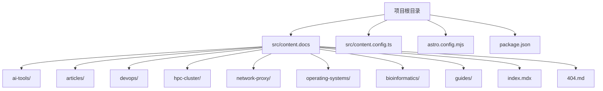
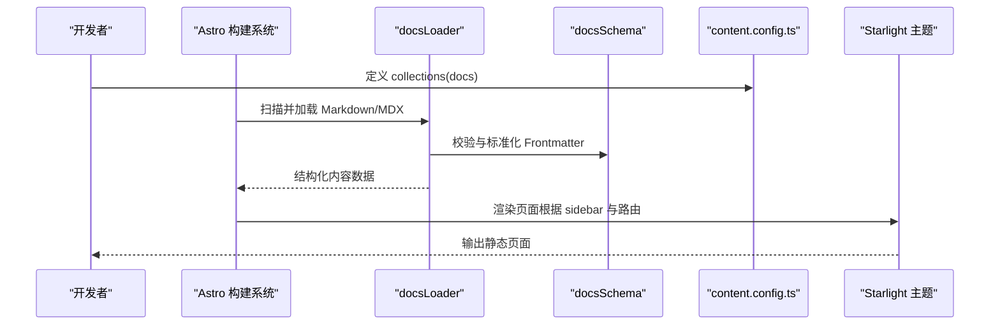
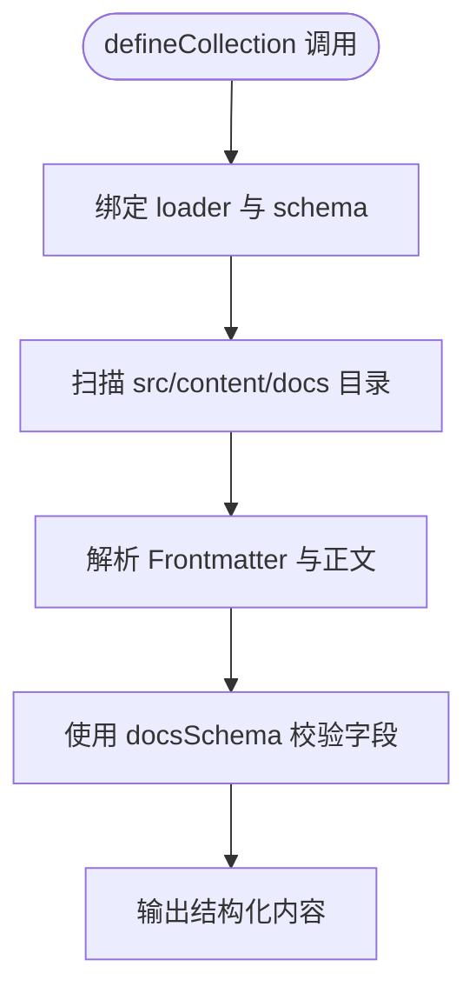
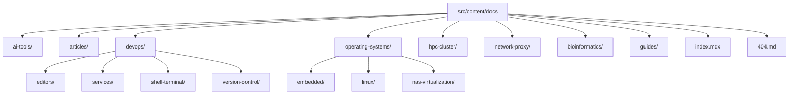
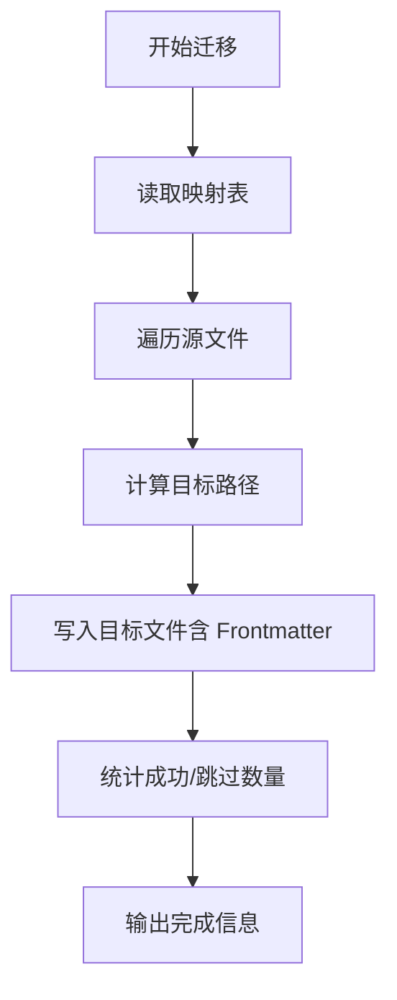
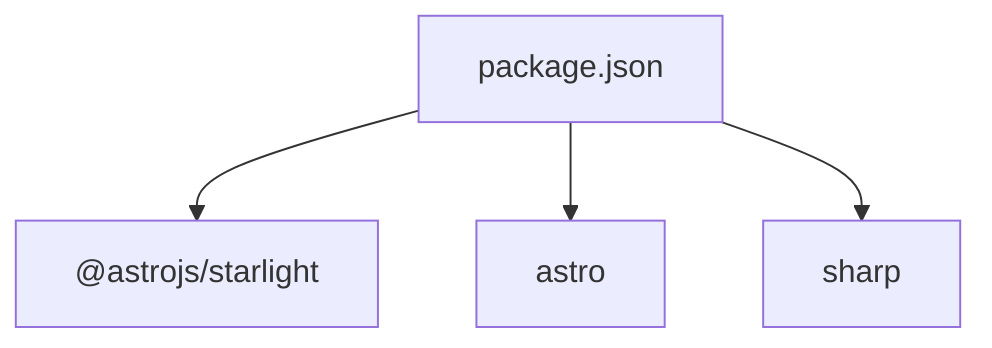

# 内容结构设计

<cite>
**本文引用的文件**
- [content.config.ts](file://src/content.config.ts)
- [astro.config.mjs](file://astro.config.mjs)
- [package.json](file://package.json)
- [index.mdx](file://src/content/docs/index.mdx)
- [404.md](file://src/content/docs/404.md)
- [git.md](file://src/content/docs/devops/version-control/git.md)
- [vim-guide.md](file://src/content/docs/devops/editors/vim-guide.md)
- [claude-code-config.md](file://src/content/docs/ai-tools/claude-code-config.md)
- [ai-cafe-stockholm.md](file://src/content/docs/articles/ai-cafe-stockholm.md)
- [migrate_docs.py](file://migrate_docs.py)
</cite>

## 目录
1. [简介](#简介)
2. [项目结构](#项目结构)
3. [核心组件](#核心组件)
4. [架构总览](#架构总览)
5. [详细组件分析](#详细组件分析)
6. [依赖分析](#依赖分析)
7. [性能考虑](#性能考虑)
8. [故障排除指南](#故障排除指南)
9. [结论](#结论)
10. [附录](#附录)

## 简介
本文件面向内容结构设计，围绕 Astro Starlight 的内容集合（Content Collections）进行系统化技术文档编制。重点解释 defineCollection 的使用方法与配置选项，详解 docsLoader 与 docsSchema 的工作机制，并结合 content.config.ts 的配置说明如何组织文档目录、命名规范与层级关系。同时提供内容分类最佳实践（分组、标签、元数据管理）、扩展方法（自定义字段）与常见问题排查建议。

## 项目结构
本项目采用 Astro Starlight + Astro Content Collections 的组合方案，内容统一放置于 src/content/docs 目录下，通过 content.config.ts 定义内容集合，astro.config.mjs 配置 Starlight 主题与侧边栏导航。

- 内容根目录：src/content/docs
  - 子目录按主题划分：ai-tools、articles、devops、hpc-cluster、network-proxy、operating-systems、bioinformatics、guides 等
  - 根目录包含入口页面与 404 页面
- 配置文件：
  - src/content.config.ts：定义内容集合与加载器/模式
  - astro.config.mjs：Starlight 主题配置与侧边栏导航
  - package.json：依赖声明（@astrojs/starlight、astro）

**图表来源**
- [content.config.ts:1-8](file://src/content.config.ts#L1-L8)
- [astro.config.mjs:1-261](file://astro.config.mjs#L1-L261)
- [package.json:1-18](file://package.json#L1-L18)

**章节来源**
- [content.config.ts:1-8](file://src/content.config.ts#L1-L8)
- [astro.config.mjs:1-261](file://astro.config.mjs#L1-L261)
- [package.json:1-18](file://package.json#L1-L18)

## 核心组件
- defineCollection：Astro 内容集合定义入口，接收 loader 与 schema 作为配置项
- docsLoader：Starlight 提供的文档专用加载器，负责解析 Markdown/MDX 的 Frontmatter 与正文
- docsSchema：Starlight 提供的文档专用模式（Schema），内置字段与校验规则
- content.config.ts：集中声明 collections，将 defineCollection 与 docsLoader/docsSchema 绑定
- astro.config.mjs：Starlight 集成与侧边栏导航配置，决定内容展示与路由映射

**章节来源**
- [content.config.ts:1-8](file://src/content.config.ts#L1-L8)
- [astro.config.mjs:1-261](file://astro.config.mjs#L1-L261)

## 架构总览
Astro 在构建阶段扫描 src/content/docs 下的 Markdown/MDX 文件，使用 docsLoader 解析 Frontmatter 与正文，借助 docsSchema 校验与标准化元数据，最终由 Starlight 渲染为主题页面。侧边栏导航由 astro.config.mjs 的 sidebar 配置驱动，slug 与路径一一对应。

**图表来源**
- [content.config.ts:1-8](file://src/content.config.ts#L1-L8)
- [astro.config.mjs:57-257](file://astro.config.mjs#L57-L257)

**章节来源**
- [content.config.ts:1-8](file://src/content.config.ts#L1-L8)
- [astro.config.mjs:57-257](file://astro.config.mjs#L57-L257)

## 详细组件分析

### defineCollection 与内容集合
- 作用：声明一个内容集合，绑定 loader 与 schema
- 在本项目中，仅定义了 docs 集合，指向 docsLoader 与 docsSchema
- 可扩展：若需引入其他类型内容（如博客文章、产品文档），可在 collections 中新增键值并配置相应 loader/schema

**图表来源**
- [content.config.ts:1-8](file://src/content.config.ts#L1-L8)

**章节来源**
- [content.config.ts:1-8](file://src/content.config.ts#L1-L8)

### docsLoader 机制
- 负责读取 Markdown/MDX 文件，提取 Frontmatter 与正文
- 支持 MDX 组件渲染与图片资源处理
- 与 docsSchema 协同，保证元数据一致性与可用性

**章节来源**
- [content.config.ts:1-8](file://src/content.config.ts#L1-L8)

### docsSchema 字段体系
- 由 Starlight 提供，内置常用文档字段（如 title、description、date、coverImage 等）
- 通过 Frontmatter 的 $schema: starlight 指定使用该模式
- 可扩展：在需要时可自定义 schema，增加业务字段（见“扩展方法”）

示例字段（来源于项目文档）：
- title：标题
- description：描述
- date：发布日期
- coverImage：封面图
- editUrl：是否允许编辑链接
- hero：英雄区配置（title/tagline/actions）

**章节来源**
- [index.mdx:1-43](file://src/content/docs/index.mdx#L1-L43)
- [404.md:1-15](file://src/content/docs/404.md#L1-L15)
- [ai-cafe-stockholm.md:1-127](file://src/content/docs/articles/ai-cafe-stockholm.md#L1-L127)

### 文档目录组织与命名规范
- 目录结构：按主题分层，如 ai-tools、articles、devops、operating-systems 等
- 文件命名：采用短横线分隔的小写英文，避免空格与特殊字符
- 层级关系：子目录代表主题细分，如 devops/editors、operating-systems/linux 等
- 入口与异常页：index.mdx 为主页，404.md 为未找到页面

**图表来源**
- [content.config.ts:1-8](file://src/content.config.ts#L1-L8)

**章节来源**
- [content.config.ts:1-8](file://src/content.config.ts#L1-L8)
- [index.mdx:1-43](file://src/content/docs/index.mdx#L1-L43)
- [404.md:1-15](file://src/content/docs/404.md#L1-L15)

### 内容分类最佳实践
- 分组策略
  - 按主题分组：ai-tools、articles、devops、operating-systems、hpc-cluster、network-proxy、bioinformatics、guides
  - 二级目录细化：如 devops 下的 editors、services、shell-terminal、version-control
- 标签系统
  - 可通过自定义字段（如 tags、categories）实现标签化（见“扩展方法”）
  - 在 Frontmatter 中维护，便于筛选与索引
- 元数据管理
  - 使用 $schema: starlight 固化字段
  - 统一字段：title、description、date、coverImage、editUrl、hero 等
  - 保持字段值一致性，避免重复或缺失

**章节来源**
- [astro.config.mjs:57-257](file://astro.config.mjs#L57-L257)
- [index.mdx:1-43](file://src/content/docs/index.mdx#L1-L43)
- [404.md:1-15](file://src/content.docs/404.md#L1-L15)
- [ai-cafe-stockholm.md:1-127](file://src/content/docs/articles/ai-cafe-stockholm.md#L1-L127)

### 扩展方法与自定义字段
- 在现有 docsSchema 基础上扩展
  - 通过自定义 schema（在 content.config.ts 中替换 docsSchema）增加字段（如 tags、categories、authors、draft 等）
  - 注意与 Starlight 模式兼容，避免破坏内置字段
- 示例字段建议
  - tags：文章标签，便于检索
  - categories：分类，与 sidebar 分组呼应
  - authors：作者列表
  - draft：草稿标记
  - lastUpdated：最后更新时间（可与 Starlight lastUpdated 配置联动）
- 字段渲染与展示
  - 在 MDX 中可通过 Astro props 访问自定义字段
  - 在 Starlight 主题中可自定义组件展示额外元数据

**章节来源**
- [content.config.ts:1-8](file://src/content.config.ts#L1-L8)

### 内容迁移与批量处理
- 项目包含迁移脚本 migrate_docs.py，用于将旧文档批量迁移到新的内容结构
- 迁移流程要点
  - 读取映射表，确定源文件与目标路径
  - 生成目标路径并写入带 Frontmatter 的 Markdown
  - 输出统计与后续构建验证提示

**图表来源**
- [migrate_docs.py:132-168](file://migrate_docs.py#L132-L168)

**章节来源**
- [migrate_docs.py:132-168](file://migrate_docs.py#L132-L168)

## 依赖分析
- @astrojs/starlight：Starlight 主题与内容渲染
- astro：Astro 核心引擎，负责构建与内容扫描
- sharp：图像处理（可选，用于封面图优化）

**图表来源**
- [package.json:12-16](file://package.json#L12-L16)

**章节来源**
- [package.json:12-16](file://package.json#L12-L16)

## 性能考虑
- 内容加载
  - 使用 docsLoader 与 docsSchema 可减少手工解析成本，提高一致性
  - 控制 Frontmatter 字段数量，避免冗余数据影响构建时间
- 图片与媒体
  - 合理使用 coverImage 与 inline 图片，避免过大资源
  - 使用相对路径与本地资源，减少外部依赖
- 构建优化
  - 分层目录结构便于增量构建与缓存
  - 保持 slug 与路径一致，减少路由映射开销

## 故障排除指南
- Frontmatter 缺失或格式错误
  - 症状：页面空白或构建失败
  - 排查：确认 $schema: starlight 存在，字段值格式正确
- 404 页面未生效
  - 症状：访问不存在路径未显示 404
  - 排查：确认 404.md 存在且 Frontmatter 正确
- 侧边栏不显示
  - 症状：导航缺失或链接无效
  - 排查：核对 astro.config.mjs 中 sidebar 的 slug 与实际路径一致
- 构建报错
  - 症状：构建失败或警告
  - 排查：检查 package.json 依赖版本，确保 @astrojs/starlight 与 astro 版本兼容

**章节来源**
- [404.md:1-15](file://src/content/docs/404.md#L1-L15)
- [astro.config.mjs:57-257](file://astro.config.mjs#L57-L257)
- [package.json:12-16](file://package.json#L12-L16)

## 结论
本项目通过 Astro Content Collections 与 Starlight 的组合，实现了结构化的文档内容管理。content.config.ts 中的 defineCollection 与 docsLoader/docsSchema 配置，确保了内容的一致性与可扩展性；astro.config.mjs 的 sidebar 配置则提供了清晰的导航与路由映射。遵循本文档的目录组织、命名规范与元数据管理最佳实践，可进一步提升内容生产效率与维护性。

## 附录
- 示例文档字段参考
  - 基础字段：title、description、date、coverImage
  - 主题字段：editUrl、hero（title/tagline/actions）
  - 参考文件：index.mdx、404.md、articles/ai-cafe-stockholm.md
- 常用主题示例
  - devops/version-control/git.md：展示技术类文档的结构与 Frontmatter
  - devops/editors/vim-guide.md：长文档示例，体现内容深度与组织

**章节来源**
- [index.mdx:1-43](file://src/content/docs/index.mdx#L1-L43)
- [404.md:1-15](file://src/content/docs/404.md#L1-L15)
- [git.md:1-197](file://src/content/docs/devops/version-control/git.md#L1-L197)
- [vim-guide.md:1-885](file://src/content/docs/devops/editors/vim-guide.md#L1-L885)
- [claude-code-config.md:1-268](file://src/content/docs/ai-tools/claude-code-config.md#L1-L268)
- [ai-cafe-stockholm.md:1-127](file://src/content/docs/articles/ai-cafe-stockholm.md#L1-L127)