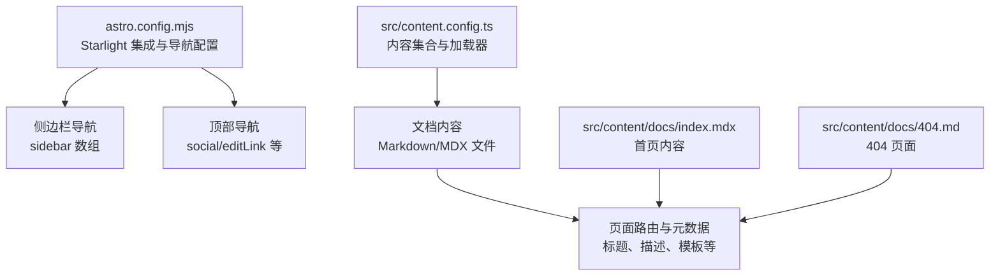
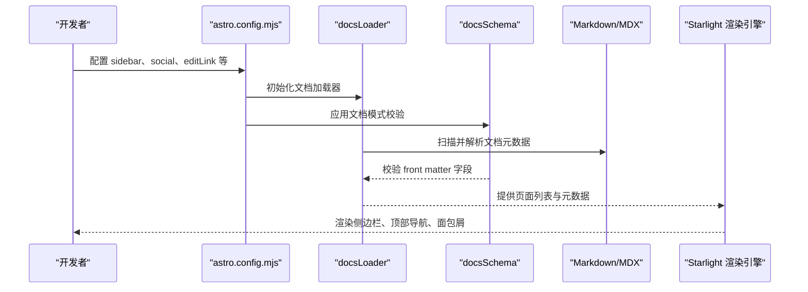
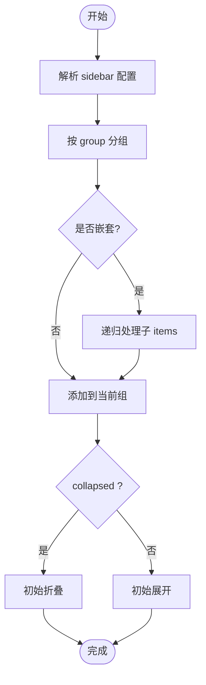
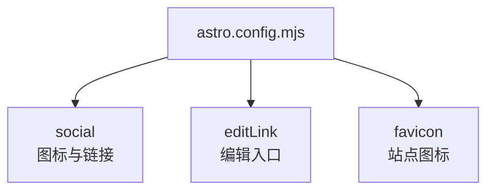
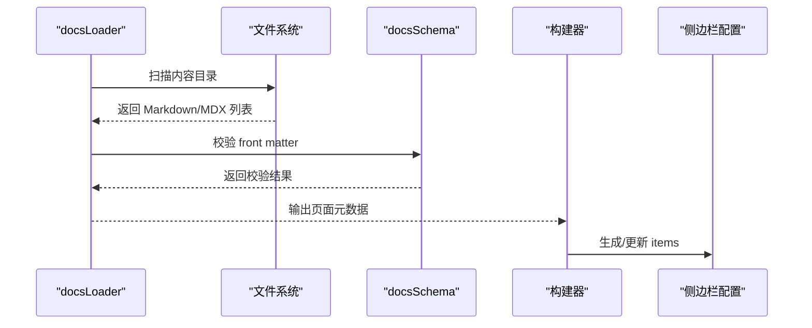
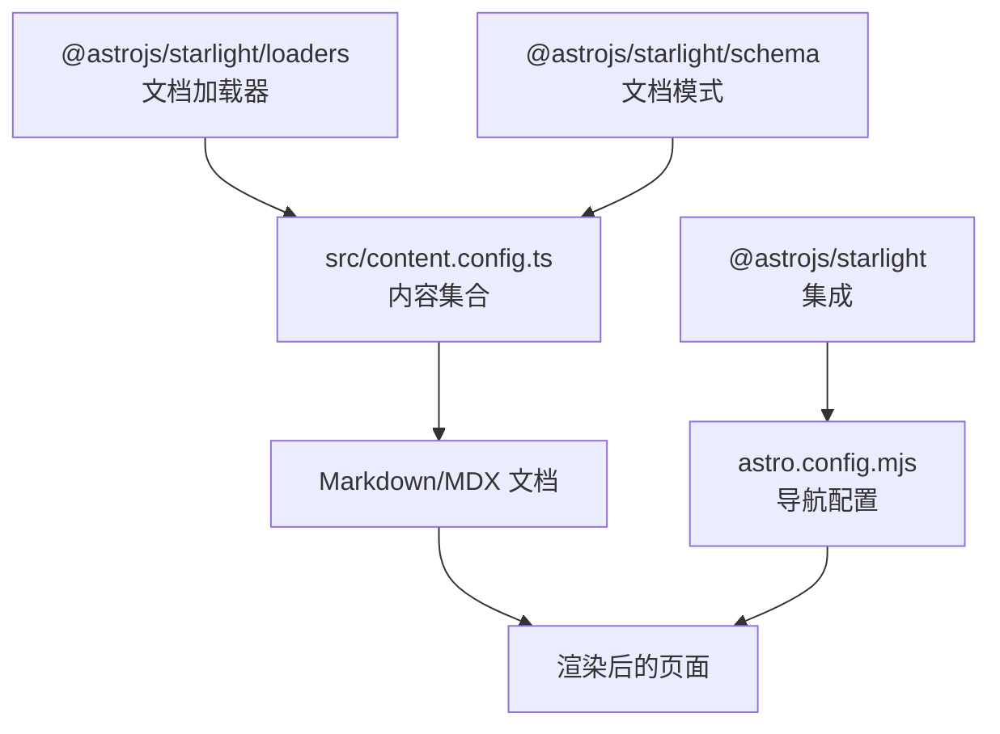

# 导航系统配置

<cite>
**本文引用的文件**
- [astro.config.mjs](file://astro.config.mjs)
- [src/content.config.ts](file://src/content.config.ts)
- [src/content/docs/index.mdx](file://src/content/docs/index.mdx)
- [src/content/docs/404.md](file://src/content/docs/404.md)
- [src/content/docs/network-proxy/zerotier.md](file://src/content/docs/network-proxy/zerotier.md)
- [src/content/docs/network-proxy/mdns.md](file://src/content/docs/network-proxy/mdns.md)
- [migrate_docs.py](file://migrate_docs.py)
- [DEPLOYMENT.md](file://DEPLOYMENT.md)
</cite>

## 目录
1. [简介](#简介)
2. [项目结构](#项目结构)
3. [核心组件](#核心组件)
4. [架构总览](#架构总览)
5. [详细组件分析](#详细组件分析)
6. [依赖关系分析](#依赖关系分析)
7. [性能考虑](#性能考虑)
8. [故障排除指南](#故障排除指南)
9. [结论](#结论)
10. [附录](#附录)

## 简介
本文件面向 Astro Starlight 导航系统的配置与使用，围绕侧边栏导航、顶部导航与面包屑导航的配置方法进行深入说明；解释导航项的排序规则、分组机制与层级结构设置；阐述动态导航生成（内容集合自动发现）的实现原理；提供导航样式定制（图标、颜色、响应式）与多语言国际化支持建议；并总结导航状态管理与用户体验优化策略。

## 项目结构
该项目采用 Astro + Starlight 构建文档站点，导航系统的核心配置集中在集成选项中，内容通过内容集合加载器统一管理。下图展示与导航相关的关键文件与职责：

图表来源
- [astro.config.mjs:10-259](file://astro.config.mjs#L10-L259)
- [src/content.config.ts:1-8](file://src/content.config.ts#L1-L8)
- [src/content/docs/index.mdx:1-43](file://src/content/docs/index.mdx#L1-L43)
- [src/content/docs/404.md:1-15](file://src/content/docs/404.md#L1-L15)

章节来源
- [astro.config.mjs:10-259](file://astro.config.mjs#L10-L259)
- [src/content.config.ts:1-8](file://src/content.config.ts#L1-L8)

## 核心组件
- Starlight 集成与导航配置
  - 通过集成选项集中配置标题、描述、社交链接、SEO 头部、编辑链接、Favicon、最后更新时间、侧边栏导航等。
- 内容集合与加载器
  - 使用文档加载器与模式校验，统一管理 Markdown/MDX 文档的元数据与路由生成。
- 页面模板与元数据
  - 首页与 404 页面通过 front matter 指定模板与操作按钮，影响顶部导航与面包屑呈现。

章节来源
- [astro.config.mjs:10-259](file://astro.config.mjs#L10-L259)
- [src/content.config.ts:1-8](file://src/content.config.ts#L1-L8)
- [src/content/docs/index.mdx:1-43](file://src/content/docs/index.mdx#L1-L43)
- [src/content/docs/404.md:1-15](file://src/content/docs/404.md#L1-L15)

## 架构总览
下图展示导航系统在构建期与运行期的交互流程，以及内容集合与侧边栏配置的关系：

图表来源
- [astro.config.mjs:10-259](file://astro.config.mjs#L10-L259)
- [src/content.config.ts:1-8](file://src/content.config.ts#L1-L8)

章节来源
- [astro.config.mjs:10-259](file://astro.config.mjs#L10-L259)
- [src/content.config.ts:1-8](file://src/content.config.ts#L1-L8)

## 详细组件分析

### 侧边栏导航（Sidebar）
- 结构与分组
  - 侧边栏为数组结构，每个条目可包含 label 与 items；items 支持嵌套以形成层级分组。
  - 可通过 collapsed 控制初始折叠状态，便于管理大量分类。
- 排序规则
  - 顺序由配置数组中的先后决定，先声明先显示；可通过调整数组顺序改变展示优先级。
- 层级结构
  - 通过 items 的嵌套实现二级/三级分组，适合按主题、子主题组织内容。
- 动态生成机制
  - 当前配置为静态声明；若需动态生成，可在构建期通过加载器扫描内容集合并生成 items，或在运行期通过插件扩展。

图表来源
- [astro.config.mjs:57-257](file://astro.config.mjs#L57-L257)

章节来源
- [astro.config.mjs:57-257](file://astro.config.mjs#L57-L257)

### 顶部导航（Social、Edit Link、Favicon）
- 社交链接
  - social 数组用于在顶部导航区域显示图标与跳转链接，如 GitHub。
- 编辑此页
  - editLink.baseUrl 指定编辑入口，便于贡献者直接跳转到源文件。
- Favicon
  - favicon 指定站点图标，提升品牌识别度。

图表来源
- [astro.config.mjs:13-52](file://astro.config.mjs#L13-L52)

章节来源
- [astro.config.mjs:13-52](file://astro.config.mjs#L13-L52)

### 面包屑导航（Breadcrumb）
- 自动生成
  - Starlight 默认根据当前页面的路由层级自动生成面包屑，无需额外配置。
- 元数据影响
  - 页面 front matter 中的 title、description 等会影响面包屑的显示文本与 SEO。

章节来源
- [src/content.docs/index.mdx:1-43](file://src/content/docs/index.mdx#L1-L43)
- [src/content.docs/404.md:1-15](file://src/content/docs/404.md#L1-L15)

### 动态导航生成（内容集合自动发现与菜单自动生成）
- 内容集合加载
  - 通过文档加载器与模式校验，统一扫描 Markdown/MDX 文件并提取元数据。
- 菜单自动生成思路
  - 在构建阶段，利用加载器输出的页面列表，按分类路径生成 items；或在运行期通过插件注入动态菜单项。
- 文档迁移与一致性
  - 迁移脚本确保旧文档映射到新路径，避免破坏导航结构。

图表来源
- [src/content.config.ts:1-8](file://src/content.config.ts#L1-L8)
- [migrate_docs.py:1-27](file://migrate_docs.py#L1-L27)

章节来源
- [src/content.config.ts:1-8](file://src/content.config.ts#L1-L8)
- [migrate_docs.py:1-27](file://migrate_docs.py#L1-L27)

### 导航样式定制（图标、颜色、响应式）
- 图标
  - 顶部导航的社交图标来自配置项；侧边栏项可结合主题或自定义 CSS 实现图标显示。
- 颜色与主题
  - Starlight 支持深色/浅色主题切换；可通过自定义 CSS 覆盖主题变量以实现品牌色彩。
- 响应式适配
  - Starlight 默认响应式布局；可通过自定义 CSS 调整断点与间距，确保移动端体验。

章节来源
- [astro.config.mjs:13-55](file://astro.config.mjs#L13-L55)

### 多语言导航与国际化（i18n）
- 多语言支持
  - Starlight 提供多语言与国际化能力；可为不同语言版本维护独立的 sidebar 配置与内容集合。
- 路由与语言切换
  - 通过语言前缀路由区分不同语言版本；在每个语言版本中分别配置导航与元数据。

章节来源
- [astro.config.mjs:10-259](file://astro.config.mjs#L10-L259)

### 导航状态管理与用户体验优化
- 状态管理
  - 侧边栏折叠状态可由用户控制；建议在用户切换语言或页面时保持折叠状态一致。
- 用户体验优化
  - 提供“编辑此页”链接、清晰的面包屑、快速返回顶部的滚动行为，提升易用性。

章节来源
- [astro.config.mjs:48-56](file://astro.config.mjs#L48-L56)

## 依赖关系分析
- 集成依赖
  - astro.config.mjs 依赖 @astrojs/starlight；sidebar、social、editLink 等均属于 Starlight 集成选项。
- 内容依赖
  - src/content.config.ts 依赖 @astrojs/starlight/loaders 与 @astrojs/starlight/schema，用于加载与校验文档。
- 页面依赖
  - 首页与 404 页面通过 front matter 影响导航与面包屑的呈现。

图表来源
- [astro.config.mjs:3](file://astro.config.mjs#L3)
- [src/content.config.ts:2-3](file://src/content.config.ts#L2-L3)

章节来源
- [astro.config.mjs:3](file://astro.config.mjs#L3)
- [src/content.config.ts:2-3](file://src/content.config.ts#L2-L3)

## 性能考虑
- 构建期优化
  - 减少不必要的内容集合扫描范围；对大型站点可按语言或模块拆分集合。
- 运行期优化
  - 侧边栏折叠减少 DOM 节点数量；延迟加载非关键资源以提升首屏速度。
- 缓存与预取
  - 利用浏览器缓存与预取策略，加速导航切换与页面加载。

## 故障排除指南
- 构建失败
  - 检查内容文件的 front matter 是否符合 schema；确认文档路径与 sidebar 中的 slug 一致。
- 部署后 404
  - 确认 GitHub Pages 源设置为 GitHub Actions；检查 site 配置与 CNAME 文件（如有）。
- 导航不显示或顺序异常
  - 检查 sidebar 数组的顺序与嵌套层级；确认 collapsed 配置是否符合预期。

章节来源
- [DEPLOYMENT.md:68-80](file://DEPLOYMENT.md#L68-L80)

## 结论
本项目通过 Starlight 的集成配置实现了结构化的导航体系：静态侧边栏、顶部导航与自动生成的面包屑共同构成完整的用户体验。配合内容集合加载器与模式校验，能够稳定地管理大量文档并生成一致的导航结构。未来可进一步引入动态生成与多语言国际化能力，持续优化性能与可维护性。

## 附录
- 示例页面参考
  - 网络代理类文档示例展示了 front matter 的典型字段与内容组织方式，可作为新增页面的模板。

章节来源
- [src/content/docs/network-proxy/zerotier.md:1-59](file://src/content/docs/network-proxy/zerotier.md#L1-L59)
- [src/content/docs/network-proxy/mdns.md:1-84](file://src/content/docs/network-proxy/mdns.md#L1-L84)