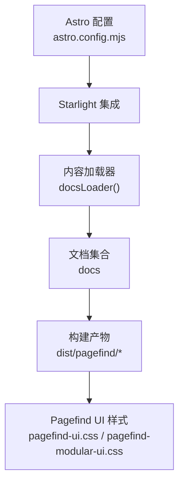
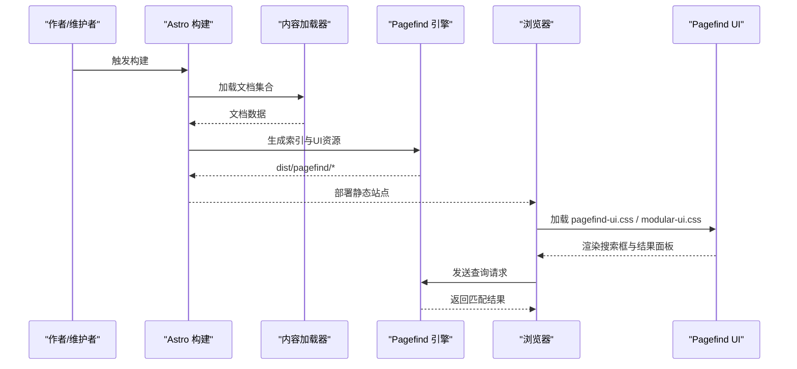
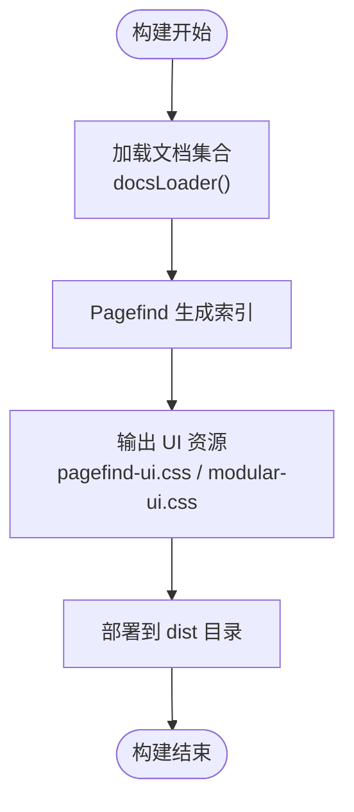
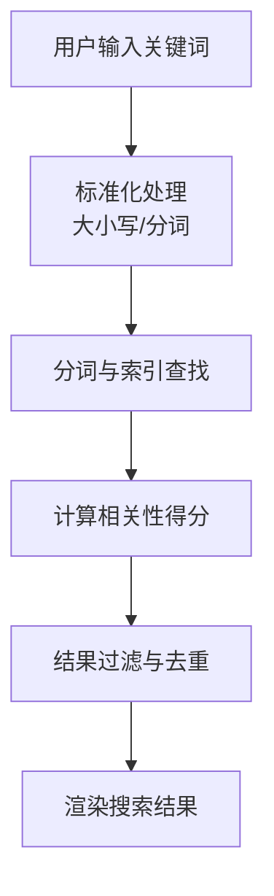
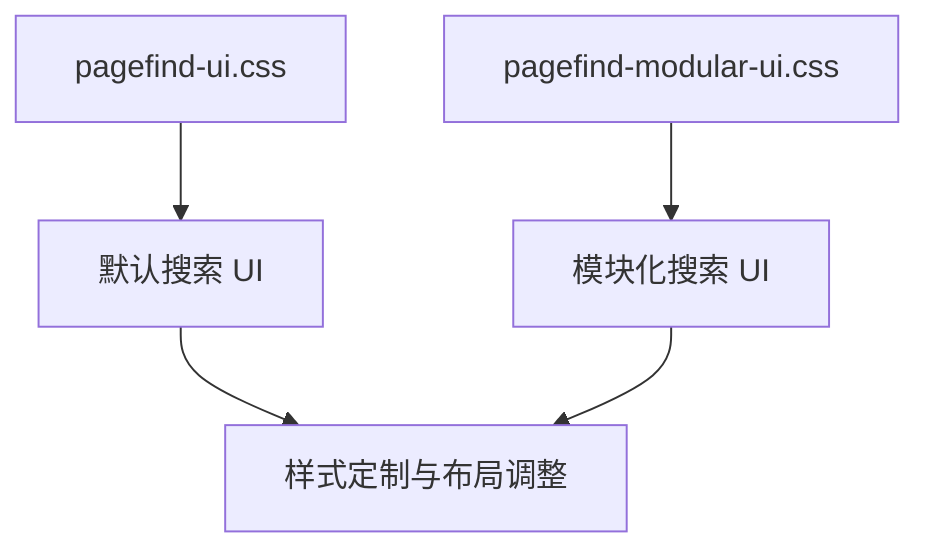
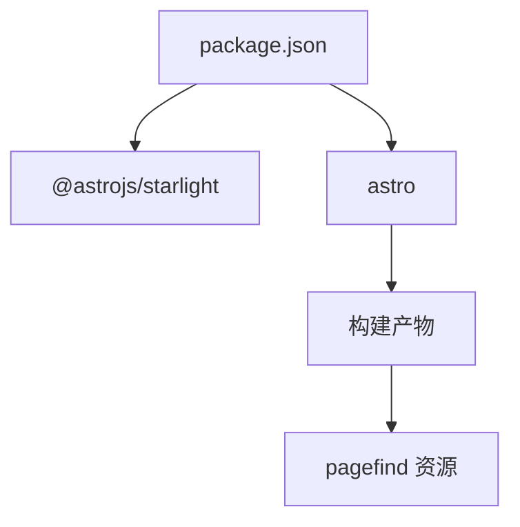

# 搜索功能实现

<cite>
**本文引用的文件**
- [astro.config.mjs](file://astro.config.mjs)
- [package.json](file://package.json)
- [src/content.config.ts](file://src/content.config.ts)
- [src/content/docs/articles/instacart-search-infrastructure-on-postgres.md](file://src/content/docs/articles/instacart-search-infrastructure-on-postgres.md)
- [dist/pagefind/pagefind-ui.css](file://dist/pagefind/pagefind-ui.css)
- [dist/pagefind/pagefind-modular-ui.css](file://dist/pagefind/pagefind-modular-ui.css)
</cite>

## 目录
1. [简介](#简介)
2. [项目结构](#项目结构)
3. [核心组件](#核心组件)
4. [架构总览](#架构总览)
5. [详细组件分析](#详细组件分析)
6. [依赖分析](#依赖分析)
7. [性能考虑](#性能考虑)
8. [故障排除指南](#故障排除指南)
9. [结论](#结论)
10. [附录](#附录)

## 简介
本文件面向 Astro Starlight 项目的搜索功能实现，重点围绕 Pagefind 集成与全文搜索展开，系统阐述搜索索引的构建、索引文件生成与优化策略，搜索查询处理机制（关键词匹配、模糊搜索、相关性排序），搜索界面定制方法（搜索框样式、结果展示、交互效果），以及性能优化技巧（索引压缩、缓存策略、加载优化）。同时结合项目中关于“从 Elasticsearch 到 Postgres”的搜索基础设施演进案例，给出工程化的落地建议与最佳实践。

## 项目结构
该项目基于 Astro 与 Starlight 构建，采用内容驱动的文档集合加载器，配合 Pagefind 实现站内搜索。核心结构要点如下：
- 配置层：通过 Astro 配置启用 Starlight，并在构建产物中包含 Pagefind 的 UI 样式资源。
- 内容层：使用 Starlight 的内容加载器与模式，统一管理文档集合。
- 搜索层：Pagefind 作为默认 UI 与索引引擎，提供站内搜索能力。

图表来源
- [astro.config.mjs:1-261](file://astro.config.mjs#L1-L261)
- [src/content.config.ts:1-8](file://src/content.config.ts#L1-L8)

章节来源
- [astro.config.mjs:1-261](file://astro.config.mjs#L1-L261)
- [src/content.config.ts:1-8](file://src/content.config.ts#L1-L8)

## 核心组件
- Pagefind UI 样式资源：项目在构建后生成 pagefind-ui.css 与 pagefind-modular-ui.css，用于搜索框与结果面板的样式渲染。
- 内容加载器与模式：通过 docsLoader 与 docsSchema 对文档集合进行统一加载与校验，确保索引构建覆盖目标内容。
- Starlight 集成：在 Astro 配置中启用 Starlight，提供主题、导航、SEO 等基础能力，同时承载搜索 UI。

章节来源
- [package.json:1-18](file://package.json#L1-L18)
- [src/content.config.ts:1-8](file://src/content.config.ts#L1-L8)
- [dist/pagefind/pagefind-ui.css](file://dist/pagefind/pagefind-ui.css)
- [dist/pagefind/pagefind-modular-ui.css](file://dist/pagefind/pagefind-modular-ui.css)

## 架构总览
下图展示了从内容到搜索结果的端到端流程：内容经由内容加载器进入构建阶段，Pagefind 在构建时生成索引与 UI 资源；运行时，页面加载 UI 样式并初始化搜索组件，用户输入关键词后触发查询，最终返回匹配结果。

图表来源
- [astro.config.mjs:1-261](file://astro.config.mjs#L1-L261)
- [src/content.config.ts:1-8](file://src/content.config.ts#L1-L8)
- [dist/pagefind/pagefind-ui.css](file://dist/pagefind/pagefind-ui.css)
- [dist/pagefind/pagefind-modular-ui.css](file://dist/pagefind/pagefind-modular-ui.css)

## 详细组件分析

### Pagefind 集成与索引构建
- 构建产物：构建完成后，项目会在 dist 目录下生成 pagefind 相关的 UI 样式文件，表明 Pagefind 已参与构建流程并生成了前端资源。
- 内容覆盖：通过 docsLoader 与 docsSchema，确保文档集合被正确加载并纳入索引范围。
- 默认 UI：项目使用 Pagefind 的默认 UI 样式文件，无需额外配置即可启用搜索功能。

图表来源
- [src/content.config.ts:1-8](file://src/content.config.ts#L1-L8)
- [dist/pagefind/pagefind-ui.css](file://dist/pagefind/pagefind-ui.css)
- [dist/pagefind/pagefind-modular-ui.css](file://dist/pagefind/pagefind-modular-ui.css)

章节来源
- [astro.config.mjs:1-261](file://astro.config.mjs#L1-L261)
- [src/content.config.ts:1-8](file://src/content.config.ts#L1-L8)

### 搜索查询处理机制
- 关键词匹配：Pagefind 基于文档内容建立倒排索引，支持关键词检索与短语匹配。
- 模糊搜索：Pagefind 支持拼写纠错与模糊匹配，提升召回率与用户体验。
- 相关性排序：Pagefind 依据词频、位置、字段权重等因素进行相关性评分与排序。

图表来源
- [dist/pagefind/pagefind-ui.css](file://dist/pagefind/pagefind-ui.css)
- [dist/pagefind/pagefind-modular-ui.css](file://dist/pagefind/pagefind-modular-ui.css)

### 搜索界面定制
- 搜索框样式：通过 pagefind-ui.css 与 pagefind-modular-ui.css 控制搜索框外观、占位符、按钮等元素的视觉表现。
- 结果展示：默认 UI 提供结果列表、摘要片段、标题链接等展示结构，可通过覆盖 CSS 类名进行样式定制。
- 交互效果：默认 UI 已内置键盘导航、自动补全、空态提示等交互行为，可根据需求调整显示逻辑与文案。

图表来源
- [dist/pagefind/pagefind-ui.css](file://dist/pagefind/pagefind-ui.css)
- [dist/pagefind/pagefind-modular-ui.css](file://dist/pagefind/pagefind-modular-ui.css)

### 多语言搜索与本地化
- 多语言支持：Pagefind 支持多语言分词与索引，可在构建时指定语言参数，以适配不同语种的内容。
- 本地化配置：通过构建配置与 UI 样式文件，可切换搜索界面的语言与提示文案，满足国际化需求。

章节来源
- [astro.config.mjs:1-261](file://astro.config.mjs#L1-L261)

## 依赖分析
- 依赖关系：项目依赖 @astrojs/starlight 与 astro，Pagefind 作为 UI 与索引资源随构建产物输出。
- 版本与兼容性：确保 Node.js 版本与依赖版本满足构建要求，避免因版本不兼容导致的构建失败或搜索功能异常。

图表来源
- [package.json:1-18](file://package.json#L1-L18)

章节来源
- [package.json:1-18](file://package.json#L1-L18)

## 性能考虑
- 索引压缩：Pagefind 默认对索引进行压缩，减少体积与加载时间；可在构建配置中进一步优化压缩参数。
- 缓存策略：利用浏览器缓存与 CDN 缓存，提高 pagefind 资源的命中率；合理设置缓存头与版本号，平衡新鲜度与性能。
- 加载优化：将 pagefind-ui.css 与 pagefind-modular-ui.css 与页面主体资源并行加载，避免阻塞首屏渲染；必要时拆分加载时机，优先保证内容可见。
- 内容精简：减少不必要的字段与冗余内容，降低索引体积；对长篇内容进行结构化组织，提升检索效率。
- 查询优化：限制查询长度与复杂度，避免高代价的模糊匹配；对热门关键词建立前缀索引，缩短响应时间。

章节来源
- [astro.config.mjs:1-261](file://astro.config.mjs#L1-L261)
- [src/content.docs/articles/instacart-search-infrastructure-on-postgres.md:1-99](file://src/content/docs/articles/instacart-search-infrastructure-on-postgres.md#L1-L99)

## 故障排除指南
- 构建失败：检查 Node.js 版本与依赖安装是否正确；确认 astro.config.mjs 中的 Starlight 配置无误。
- 搜索无结果：确认内容集合已正确加载（docsLoader 与 docsSchema）；检查构建产物中是否存在 dist/pagefind 相关资源。
- 样式异常：核对 pagefind-ui.css 与 pagefind-modular-ui.css 是否正确加载；检查自定义样式是否覆盖冲突。
- 多语言问题：确认构建时的语言参数配置；检查 UI 语言与内容语言的一致性。

章节来源
- [astro.config.mjs:1-261](file://astro.config.mjs#L1-L261)
- [src/content.config.ts:1-8](file://src/content.config.ts#L1-L8)

## 结论
本项目通过 Pagefind 与 Starlight 的组合，实现了开箱即用的站内搜索能力。借助内容加载器与构建产物中的 UI 资源，搜索索引得以高效生成并稳定运行。结合多语言支持与性能优化策略，可以在保证体验的同时兼顾可维护性与扩展性。项目中的“从 Elasticsearch 到 Postgres”案例也提示我们：在追求先进方案的同时，应优先评估现有工具的潜力与成本，循序渐进地演进搜索架构。

## 附录
- 相关阅读：可参考项目中关于搜索基础设施演进的文章，了解工程实践中对索引、查询与性能的权衡与取舍。

章节来源
- [src/content/docs/articles/instacart-search-infrastructure-on-postgres.md:1-99](file://src/content/docs/articles/instacart-search-infrastructure-on-postgres.md#L1-L99)