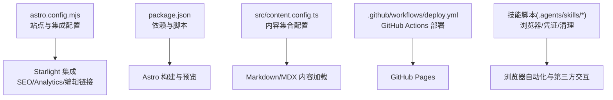
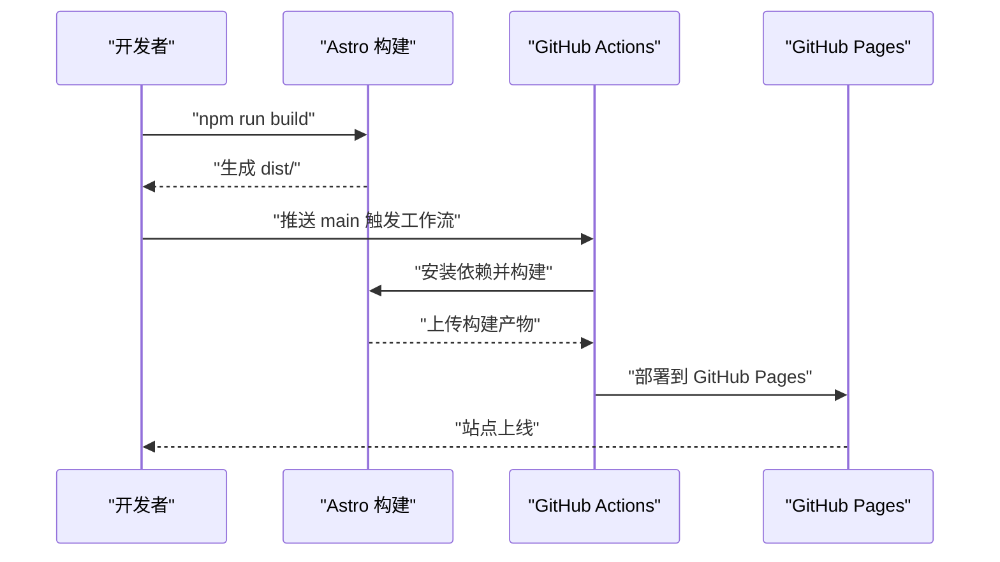
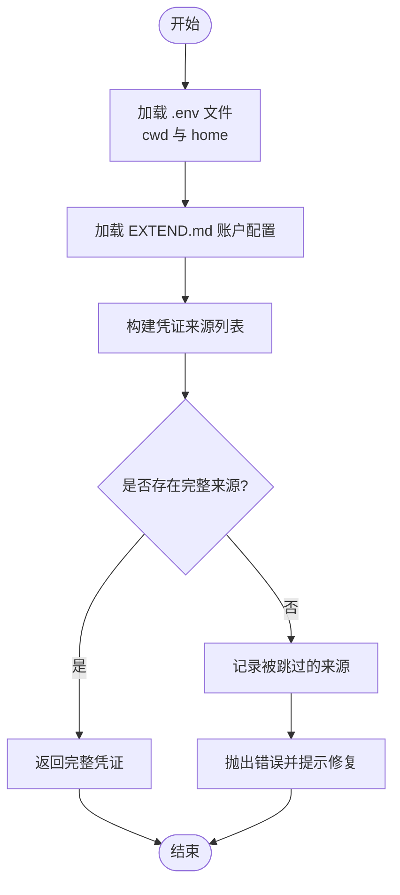
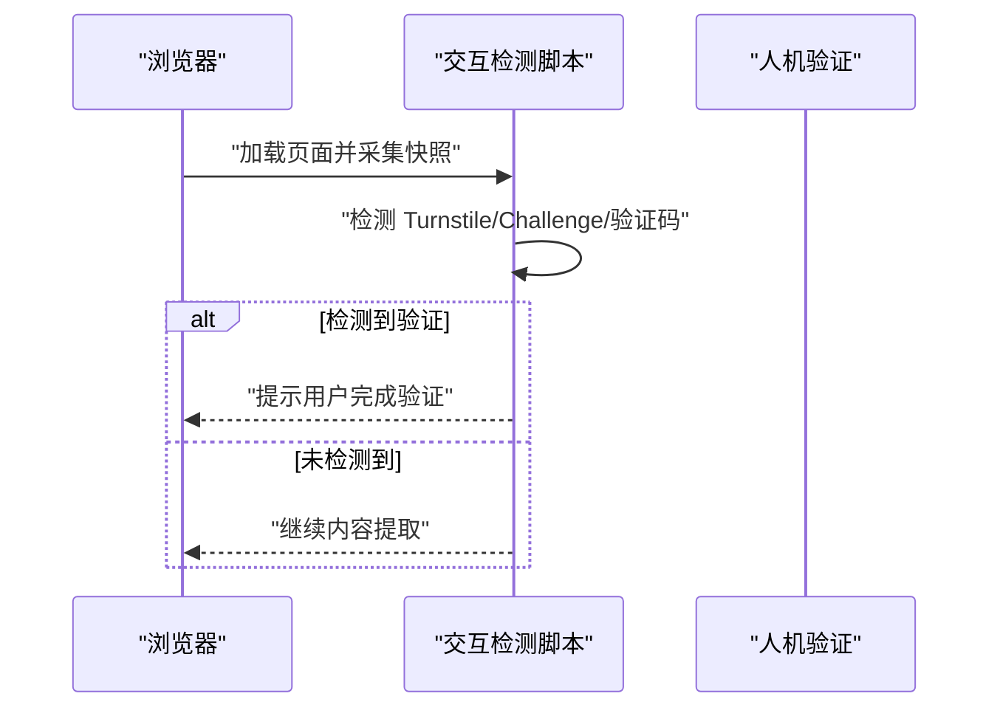
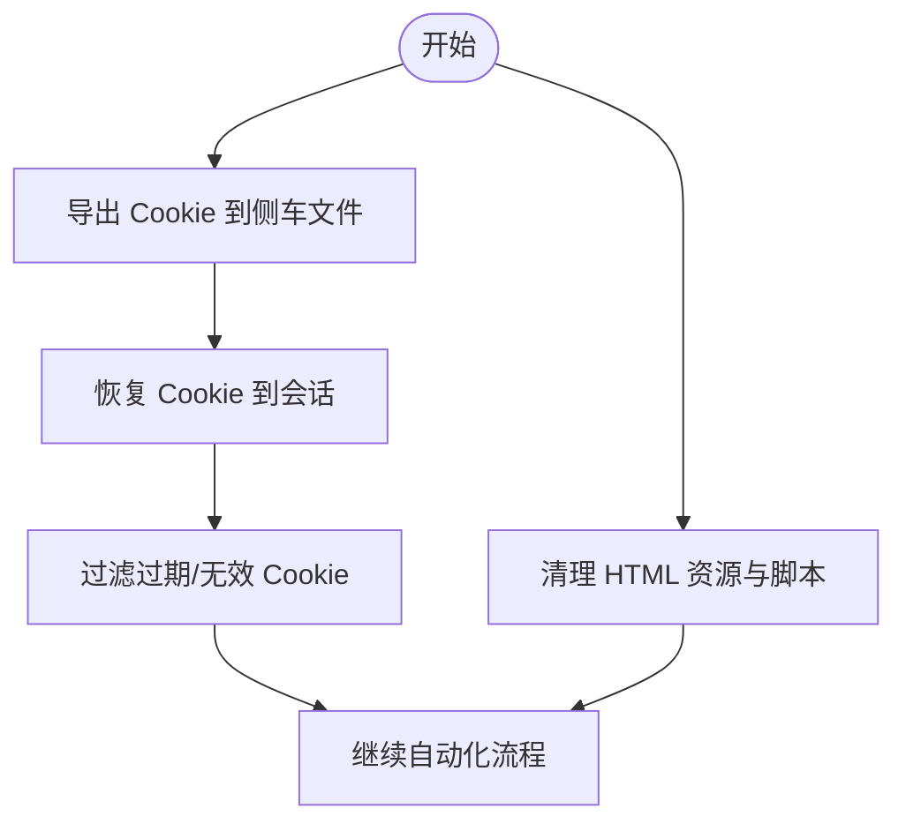
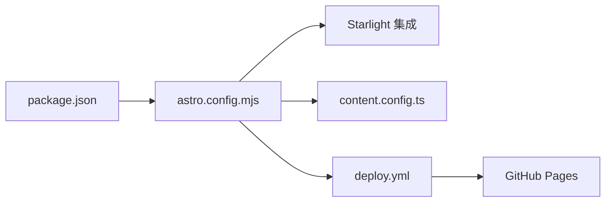

# 安全考虑

<cite>
**本文引用的文件**
- [package.json](file://package.json)
- [astro.config.mjs](file://astro.config.mjs)
- [src/content.config.ts](file://src/content.config.ts)
- [.github/workflows/deploy.yml](file://.github/workflows/deploy.yml)
- [CLAUDE.md](file://CLAUDE.md)
- [DEPLOYMENT.md](file://DEPLOYMENT.md)
- [src/content/docs/ai-tools/claude-code-config.md](file://src/content/docs/ai-tools/claude-code-config.md)
- [.agents/skills/baoyu-post-to-wechat/scripts/wechat-extend-config.ts](file://.agents/skills/baoyu-post-to-wechat/scripts/wechat-extend-config.ts)
- [.agents/skills/baoyu-url-to-markdown/scripts/lib/browser/interaction-gates.ts](file://.agents/skills/baoyu-url-to-markdown/scripts/lib/browser/interaction-gates.ts)
- [.agents/skills/baoyu-url-to-markdown/scripts/lib/browser/cookie-sidecar.ts](file://.agents/skills/baoyu-url-to-markdown/scripts/lib/browser/cookie-sidecar.ts)
- [.agents/skills/baoyu-url-to-markdown/scripts/lib/extract/html-cleaner.ts](file://.agents/skills/baoyu-url-to-markdown/scripts/lib/extract/html-cleaner.ts)
- [src/content/docs/articles/building-mcp-ecosystem-pinterest.md](file://src/content/docs/articles/building-mcp-ecosystem-pinterest.md)
</cite>

## 目录
1. [简介](#简介)
2. [项目结构](#项目结构)
3. [核心组件](#核心组件)
4. [架构总览](#架构总览)
5. [详细组件分析](#详细组件分析)
6. [依赖关系分析](#依赖关系分析)
7. [性能考量](#性能考量)
8. [故障排查指南](#故障排查指南)
9. [结论](#结论)
10. [附录](#附录)

## 简介
本指南面向 NTLx's Blog 的安全运营与维护，聚焦以下方面：
- API 密钥与凭证管理：最小暴露、多来源加载、错误提示与轮换策略
- 配置文件与环境变量：优先级、持久化与隔离
- 访问控制与审计：基于角色与会话的访问控制思路
- 网络安全与传输安全：站点 HTTPS、CORS 与反爬交互处理
- 第三方服务集成：风险评估与防护建议
- 安全审计与事件响应：流程与建议
- 常见威胁识别与缓解：结合项目现有实现与最佳实践

## 项目结构
本项目为基于 Astro + Starlight 的静态博客，内容通过 Markdown/MDX 管线生成，部署至 GitHub Pages。关键安全相关位置：
- 配置与构建：astro.config.mjs、package.json、src/content.config.ts
- 部署：.github/workflows/deploy.yml
- 技能与脚本：.agents/skills/ 下的各类技能脚本，涉及浏览器自动化、Cookie 管理与第三方 API 凭证加载
- 文档与指南：CLAUDE.md、DEPLOYMENT.md、环境变量配置文档

图表来源
- [astro.config.mjs:1-261](file://astro.config.mjs#L1-L261)
- [package.json:1-18](file://package.json#L1-L18)
- [src/content.config.ts:1-8](file://src/content.config.ts#L1-L8)
- [.github/workflows/deploy.yml:1-71](file://.github/workflows/deploy.yml#L1-L71)

章节来源
- [astro.config.mjs:1-261](file://astro.config.mjs#L1-L261)
- [package.json:1-18](file://package.json#L1-L18)
- [src/content.config.ts:1-8](file://src/content.config.ts#L1-L8)
- [.github/workflows/deploy.yml:1-71](file://.github/workflows/deploy.yml#L1-L71)

## 核心组件
- 站点配置与集成
  - 站点基础 URL、社交链接、SEO 元信息、编辑链接、favicon、最后更新时间等
  - 集成 Google Analytics（gtag.js）与 Open Graph 图片
- 内容加载
  - 通过 docsLoader 与 docsSchema 加载文档内容集合
- 部署流水线
  - GitHub Actions 自动构建与部署至 GitHub Pages，支持手动触发
- 技能与脚本
  - 浏览器自动化与反爬交互检测
  - Cookie 导出/恢复与清理
  - 环境变量与配置文件优先级加载（微信公众号凭证）

章节来源
- [astro.config.mjs:1-261](file://astro.config.mjs#L1-L261)
- [src/content.config.ts:1-8](file://src/content.config.ts#L1-L8)
- [.github/workflows/deploy.yml:1-71](file://.github/workflows/deploy.yml#L1-L71)

## 架构总览
下图展示从开发到部署的关键节点，以及与安全相关的控制点。

图表来源
- [.github/workflows/deploy.yml:24-71](file://.github/workflows/deploy.yml#L24-L71)
- [astro.config.mjs:6-9](file://astro.config.mjs#L6-L9)

章节来源
- [.github/workflows/deploy.yml:1-71](file://.github/workflows/deploy.yml#L1-L71)
- [astro.config.mjs:1-261](file://astro.config.mjs#L1-L261)

## 详细组件分析

### API 密钥与凭证管理
- 多来源加载与优先级
  - 支持通过 EXTEND.md 账户配置、环境变量、工作目录与用户目录下的 .env 文件加载
  - 对缺失或不完整的凭证组合进行明确错误提示，避免静默失败
- 错误处理与可观测性
  - 当任一来源仅提供部分键值时，记录被跳过的来源，便于定位问题
- 最小暴露与隔离
  - 仅在必要时加载与传递，避免在日志或错误堆栈中泄露
- 轮换策略
  - 建议在新旧密钥并行期间进行灰度切换，完成后立即吊销旧密钥
  - 结合错误提示机制，确保轮换后能快速发现失效来源

图表来源
- [.agents/skills/baoyu-post-to-wechat/scripts/wechat-extend-config.ts:274-290](file://.agents/skills/baoyu-post-to-wechat/scripts/wechat-extend-config.ts#L274-L290)
- [.agents/skills/baoyu-post-to-wechat/scripts/wechat-extend-config.ts:241-272](file://.agents/skills/baoyu-post-to-wechat/scripts/wechat-extend-config.ts#L241-L272)

章节来源
- [.agents/skills/baoyu-post-to-wechat/scripts/wechat-extend-config.ts:195-290](file://.agents/skills/baoyu-post-to-wechat/scripts/wechat-extend-config.ts#L195-L290)

### 配置文件与环境变量
- 优先级与持久化
  - 环境变量 > 配置文件；配置文件 > 临时导出
  - 提供跨平台（Bash/Zsh/Fish/PowerShell/命令提示符）的持久化示例
- 安全使用建议
  - 将机密信息放入 .env 并纳入忽略列表
  - 避免在公共仓库中提交密钥；使用 CI/CD 的加密变量或受控注入
- 文档化与一致性
  - 在文档中明确变量名、用途与示例，减少误配

章节来源
- [src/content/docs/ai-tools/claude-code-config.md:1-46](file://src/content/docs/ai-tools/claude-code-config.md#L1-L46)
- [CLAUDE.md:206-216](file://CLAUDE.md#L206-L216)

### 访问控制与审计
- 双层授权思路（参考文章）
  - JWT 用户身份 + SPIFFE 服务身份 + 业务组访问控制
  - 工具发现阶段即要求身份验证，保障全链路审计
- 实践要点
  - 将“登录即授权”的理念贯穿到内部系统与 MCP 生态
  - 对高风险操作引入人工审批（Human-in-the-loop）

章节来源
- [src/content/docs/articles/building-mcp-ecosystem-pinterest.md:40-98](file://src/content/docs/articles/building-mcp-ecosystem-pinterest.md#L40-L98)

### 网络安全与传输安全
- 站点 HTTPS
  - GitHub Pages 默认支持 HTTPS；确保站点 URL 为 https
  - 若使用自定义域名，确认 CNAME 指向与证书生效
- CORS 策略
  - 本项目为静态站点，无服务端 API；若未来引入前端 API，应明确允许来源与方法
- 反爬交互处理
  - 浏览器自动化脚本检测 Cloudflare、reCAPTCHA、hCaptcha 等人机验证
  - 通过可见浏览器界面引导用户完成挑战，避免自动化绕过导致的异常

图表来源
- [.agents/skills/baoyu-url-to-markdown/scripts/lib/browser/interaction-gates.ts:16-123](file://.agents/skills/baoyu-url-to-markdown/scripts/lib/browser/interaction-gates.ts#L16-L123)

章节来源
- [.agents/skills/baoyu-url-to-markdown/scripts/lib/browser/interaction-gates.ts:1-123](file://.agents/skills/baoyu-url-to-markdown/scripts/lib/browser/interaction-gates.ts#L1-L123)

### Cookie 管理与隐私
- 导出/恢复
  - 在浏览器会话中导出所需 Cookie 至侧车文件，后续会话恢复以维持登录状态
  - 恢复时过滤过期 Cookie，确保有效性
- 清理与最小化
  - HTML 清理器移除广告、隐藏元素、表单与脚本，降低跟踪与副作用
  - 对 data: 图片进行清理，避免内联资源泄露

图表来源
- [.agents/skills/baoyu-url-to-markdown/scripts/lib/browser/cookie-sidecar.ts:54-100](file://.agents/skills/baoyu-url-to-markdown/scripts/lib/browser/cookie-sidecar.ts#L54-L100)
- [.agents/skills/baoyu-url-to-markdown/scripts/lib/extract/html-cleaner.ts:11-401](file://.agents/skills/baoyu-url-to-markdown/scripts/lib/extract/html-cleaner.ts#L11-L401)

章节来源
- [.agents/skills/baoyu-url-to-markdown/scripts/lib/browser/cookie-sidecar.ts:1-100](file://.agents/skills/baoyu-url-to-markdown/scripts/lib/browser/cookie-sidecar.ts#L1-L100)
- [.agents/skills/baoyu-url-to-markdown/scripts/lib/extract/html-cleaner.ts:1-401](file://.agents/skills/baoyu-url-to-markdown/scripts/lib/extract/html-cleaner.ts#L1-L401)

### 第三方服务集成的安全风险与防护
- 风险评估
  - 代理/自定义 API：需验证上游 TLS 与签名，避免中间人攻击
  - 人机验证：自动化绕过可能触发更严格风控，应遵循服务条款
  - Cookie 与会话：避免在不受控环境中泄露，定期轮换
- 防护措施
  - 仅在受信网络与可信主机上运行自动化脚本
  - 对第三方 API 请求添加超时与重试上限，避免资源耗尽
  - 使用最小权限原则，限制脚本对第三方系统的访问范围

章节来源
- [src/content/docs/ai-tools/claude-code-config.md:36-46](file://src/content/docs/ai-tools/claude-code-config.md#L36-L46)
- [.agents/skills/baoyu-url-to-markdown/scripts/lib/browser/interaction-gates.ts:16-123](file://.agents/skills/baoyu-url-to-markdown/scripts/lib/browser/interaction-gates.ts#L16-L123)

## 依赖关系分析
- 构建与运行
  - package.json 定义依赖与脚本，astro.config.mjs 配置站点与集成
  - src/content.config.ts 通过 docsLoader 与 docsSchema 加载内容
- 部署与发布
  - .github/workflows/deploy.yml 定义构建与部署步骤，使用 GitHub Pages

图表来源
- [package.json:1-18](file://package.json#L1-L18)
- [astro.config.mjs:1-261](file://astro.config.mjs#L1-L261)
- [src/content.config.ts:1-8](file://src/content.config.ts#L1-L8)
- [.github/workflows/deploy.yml:1-71](file://.github/workflows/deploy.yml#L1-L71)

章节来源
- [package.json:1-18](file://package.json#L1-L18)
- [astro.config.mjs:1-261](file://astro.config.mjs#L1-L261)
- [src/content.config.ts:1-8](file://src/content.config.ts#L1-L8)
- [.github/workflows/deploy.yml:1-71](file://.github/workflows/deploy.yml#L1-L71)

## 性能考量
- 构建与预览
  - 使用本地预览验证生产构建，减少线上回滚成本
- 自动化脚本
  - 合理设置超时与重试，避免长时间占用资源
- 静态站点优势
  - 无服务端逻辑，天然降低攻击面；但仍需关注第三方资源与脚本

## 故障排查指南
- 构建失败
  - 检查内容集合同步与文件名规范，确保 slug 与文件名一致
- 部署成功但页面 404
  - 确认 GitHub Pages 源为 GitHub Actions，检查站点 URL 配置
- 资源加载异常
  - 确认相对路径与缓存，清理浏览器缓存后重试
- 环境变量与凭证
  - 按文档优先级设置变量，使用错误提示定位缺失来源

章节来源
- [DEPLOYMENT.md:68-87](file://DEPLOYMENT.md#L68-L87)
- [CLAUDE.md:113-131](file://CLAUDE.md#L113-L131)

## 结论
本项目以静态站点为基础，结合技能脚本实现内容与第三方服务的自动化集成。安全重点在于：
- 凭证与密钥的最小暴露与可控轮换
- 环境变量与配置文件的清晰优先级与文档化
- 访问控制与审计的工程化落地
- 网络传输与反爬交互的合规处理
- 部署流水线的最小权限与加密变量使用

## 附录
- 常用安全检查清单
  - 密钥是否在 .env 中且被忽略
  - 环境变量是否覆盖配置文件
  - 是否存在硬编码的密钥或令牌
  - 是否启用 HTTPS 与正确的 CORS 策略
  - 是否对第三方 API 请求进行超时与限速
  - 是否对浏览器自动化脚本进行最小权限与可见交互