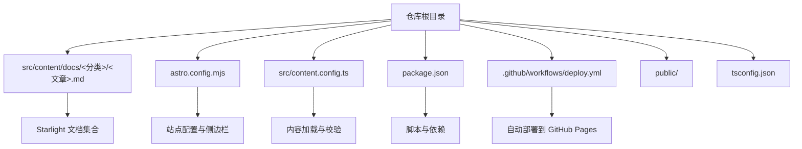
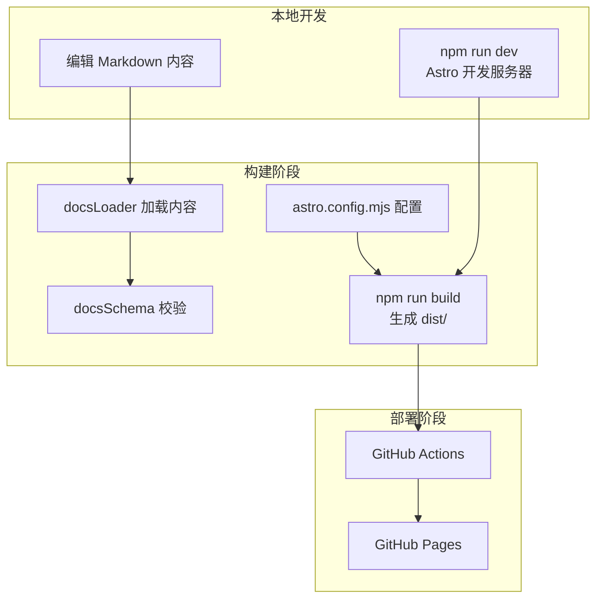
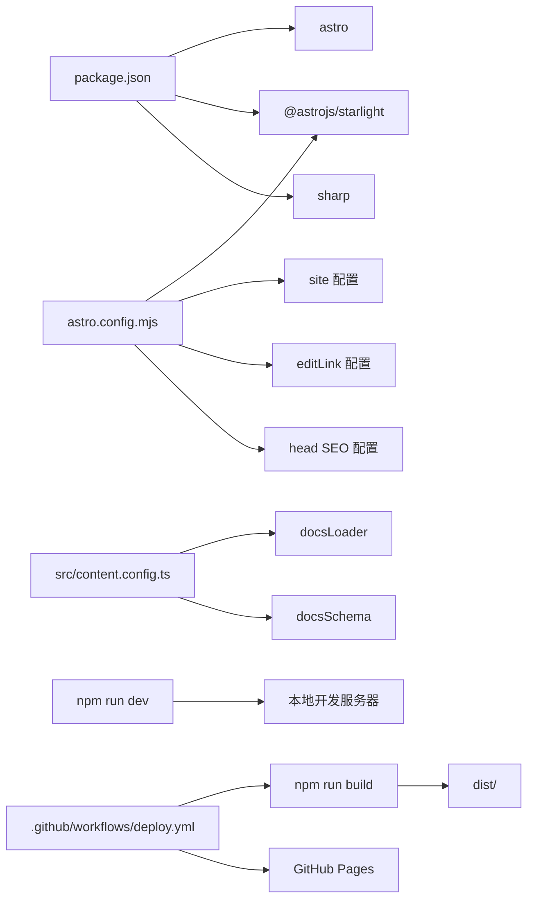

# 快速开始

<cite>
**本文引用的文件**
- [package.json](file://package.json)
- [astro.config.mjs](file://astro.config.mjs)
- [src/content.config.ts](file://src/content.config.ts)
- [README.md](file://README.md)
- [DEPLOYMENT.md](file://DEPLOYMENT.md)
- [.github/workflows/deploy.yml](file://.github/workflows/deploy.yml)
- [tsconfig.json](file://tsconfig.json)
- [src/content/docs/index.mdx](file://src/content/docs/index.mdx)
- [src/content/docs/articles/ai-maintenance-costs-trap.md](file://src/content/docs/articles/ai-maintenance-costs-trap.md)
- [src/content/docs/devops/version-control/git.md](file://src/content/docs/devops/version-control/git.md)
</cite>

## 目录
1. [简介](#简介)
2. [项目结构](#项目结构)
3. [核心组件](#核心组件)
4. [架构总览](#架构总览)
5. [详细组件分析](#详细组件分析)
6. [依赖关系分析](#依赖关系分析)
7. [性能考虑](#性能考虑)
8. [故障排查指南](#故障排查指南)
9. [结论](#结论)
10. [附录](#附录)

## 简介
本指南面向首次接触 NTLx's Blog 的开发者与内容创作者，帮助你在最短时间内完成环境准备、依赖安装与本地开发运行，并理解 Astro 与 Starlight 的基本概念。项目基于 Astro 5 + Starlight 0.37 构建，采用 GitHub Actions 自动部署至 GitHub Pages，支持双发布路径：博客文章与微信公众号文章的自动化发布流水线。

## 项目结构
项目采用“内容即文档”的组织方式，核心内容位于 src/content/docs/，并通过 Starlight 的文档集合加载器统一管理。站点配置集中在 astro.config.mjs，内容类型通过 src/content.config.ts 定义。

图表来源
- [astro.config.mjs:1-261](file://astro.config.mjs#L1-L261)
- [src/content.config.ts:1-8](file://src/content.config.ts#L1-L8)
- [package.json:1-18](file://package.json#L1-L18)
- [.github/workflows/deploy.yml:1-71](file://.github/workflows/deploy.yml#L1-L71)

章节来源
- [README.md:73-84](file://README.md#L73-L84)
- [astro.config.mjs:1-261](file://astro.config.mjs#L1-L261)
- [src/content.config.ts:1-8](file://src/content.config.ts#L1-L8)

## 核心组件
- Astro 与 Starlight：前端静态站点生成器与文档主题，提供文档侧边栏、搜索、编辑链接、SEO 等能力。
- 内容集合：通过 docsLoader 与 docsSchema 加载 Markdown 内容，支持 Front Matter 元数据与类型校验。
- 构建与预览：通过 npm 脚本封装 Astro 的 dev/build/preview 命令。
- 自动部署：GitHub Actions 在推送到 main 分支时自动构建并部署到 GitHub Pages。

章节来源
- [package.json:5-11](file://package.json#L5-L11)
- [src/content.config.ts:5-7](file://src/content.config.ts#L5-L7)
- [astro.config.mjs:9-259](file://astro.config.mjs#L9-L259)

## 架构总览
下图展示了从本地开发到 GitHub Pages 部署的整体流程，以及内容与配置之间的关系。

图表来源
- [astro.config.mjs:9-259](file://astro.config.mjs#L9-L259)
- [src/content.config.ts:5-7](file://src/content.config.ts#L5-L7)
- [.github/workflows/deploy.yml:24-71](file://.github/workflows/deploy.yml#L24-L71)

## 详细组件分析

### 环境要求与安装步骤
- Node.js 版本：要求 Node.js 22+（本地与 CI 均需满足）。
- 克隆仓库后，在项目根目录执行依赖安装与启动开发服务器。
- 启动后在浏览器访问本地端口，即可预览站点。

章节来源
- [README.md:47-56](file://README.md#L47-L56)
- [.github/workflows/deploy.yml:34-38](file://.github/workflows/deploy.yml#L34-L38)

### Astro 与 Starlight 基本概念
- Astro：静态站点生成器，强调按需渲染与原生 Web 组件生态。
- Starlight：专为文档设计的主题，内置侧边栏、搜索、编辑链接、社交图标、SEO 元数据等。
- 内容集合：通过 docsLoader 与 docsSchema 对 Markdown 内容进行加载与类型校验，Front Matter 支持标题、描述、日期等元数据。

章节来源
- [README.md:66-72](file://README.md#L66-L72)
- [astro.config.mjs:10-50](file://astro.config.mjs#L10-L50)
- [src/content.config.ts:1-8](file://src/content.config.ts#L1-L8)

### 本地开发设置
- 启动开发服务器：运行 npm run dev（或 npm start），默认监听本地端口。
- 预览生产构建：先 npm run build，再 npm run preview，可在本地模拟生产环境。
- 内容更新：在 src/content/docs/ 下新增或修改 Markdown 文件，保存后热更新生效。

章节来源
- [package.json:5-11](file://package.json#L5-L11)
- [DEPLOYMENT.md:97-109](file://DEPLOYMENT.md#L97-L109)
- [src/content/docs/index.mdx:1-43](file://src/content/docs/index.mdx#L1-L43)

### 常见开发工作流程
- 新增文档：在对应分类目录下创建 Markdown 文件，编写 Front Matter 与正文。
- 验证与预览：本地运行 npm run dev，确认样式、导航、搜索等功能正常。
- 提交与部署：推送到 main 分支，GitHub Actions 自动构建并部署到 GitHub Pages。

章节来源
- [README.md:16-31](file://README.md#L16-L31)
- [DEPLOYMENT.md:21-35](file://DEPLOYMENT.md#L21-L35)

### 调试技巧
- 控制台与网络面板：检查资源加载与脚本错误。
- 本地预览：使用 npm run preview 快速验证生产构建。
- 配置核对：确认 astro.config.mjs 的 site、editLink、social 等配置正确。
- 类型与校验：tsconfig.json 采用 Astro 的严格配置，有助于在编辑器中获得更好的类型提示。

章节来源
- [DEPLOYMENT.md:68-86](file://DEPLOYMENT.md#L68-L86)
- [tsconfig.json:1-6](file://tsconfig.json#L1-L6)

## 依赖关系分析
项目依赖关系围绕 Astro 与 Starlight 展开，内容加载通过 docsLoader 与 docsSchema 实现，构建与部署由 npm 脚本与 GitHub Actions 协同完成。

图表来源
- [package.json:12-16](file://package.json#L12-L16)
- [astro.config.mjs:6-259](file://astro.config.mjs#L6-L259)
- [src/content.config.ts:1-8](file://src/content.config.ts#L1-L8)
- [.github/workflows/deploy.yml:24-71](file://.github/workflows/deploy.yml#L24-L71)

章节来源
- [package.json:12-16](file://package.json#L12-L16)
- [astro.config.mjs:6-259](file://astro.config.mjs#L6-L259)
- [src/content.config.ts:1-8](file://src/content.config.ts#L1-L8)
- [.github/workflows/deploy.yml:24-71](file://.github/workflows/deploy.yml#L24-L71)

## 性能考虑
- 静态生成：Astro 的静态输出与 Starlight 的轻量主题，确保页面加载速度快。
- 资源优化：可结合 sharp 进行图片处理（已在依赖中声明），建议在内容中使用合适的图片尺寸与格式。
- 构建缓存：GitHub Actions 使用 npm ci 与缓存策略，提升 CI 构建效率。

章节来源
- [package.json:15](file://package.json#L15)
- [.github/workflows/deploy.yml:38-47](file://.github/workflows/deploy.yml#L38-L47)

## 故障排查指南
- 构建失败：检查 Actions 日志，确认 Node.js 版本为 22+，并在本地先执行 npm run build。
- 页面 404：确认 GitHub Pages 设置中 Source 为 GitHub Actions，检查 astro.config.mjs 中的 site 配置。
- 资源加载异常：检查浏览器控制台错误，确认资源路径为相对路径，清除缓存后重试。
- 本地预览：使用 npm run preview 验证生产构建效果。

章节来源
- [DEPLOYMENT.md:68-86](file://DEPLOYMENT.md#L68-L86)
- [DEPLOYMENT.md:97-109](file://DEPLOYMENT.md#L97-L109)

## 结论
通过本快速开始指南，你可以在本地快速搭建并运行 NTLx's Blog，理解 Astro 与 Starlight 的基础能力，并掌握从内容创作到自动部署的完整工作流。建议在本地完成内容验证后再推送到 main 分支，以确保 GitHub Pages 的稳定上线。

## 附录
- 在线访问：https://ntlx.github.io/
- 本地开发端口：http://localhost:4321/
- 构建产物：dist/

章节来源
- [README.md:41-43](file://README.md#L41-L43)
- [README.md:56](file://README.md#L56)
- [DEPLOYMENT.md:109](file://DEPLOYMENT.md#L109)