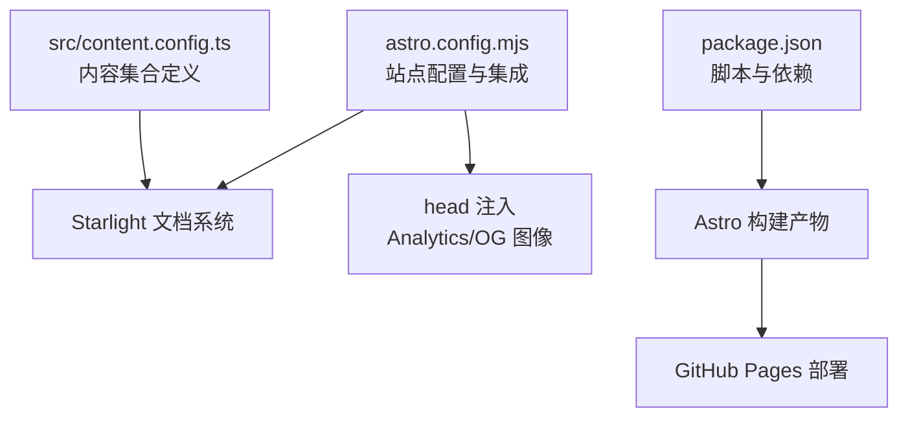
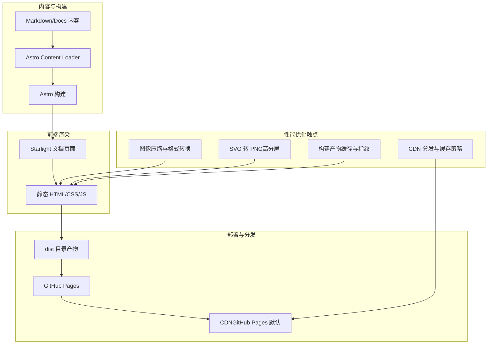
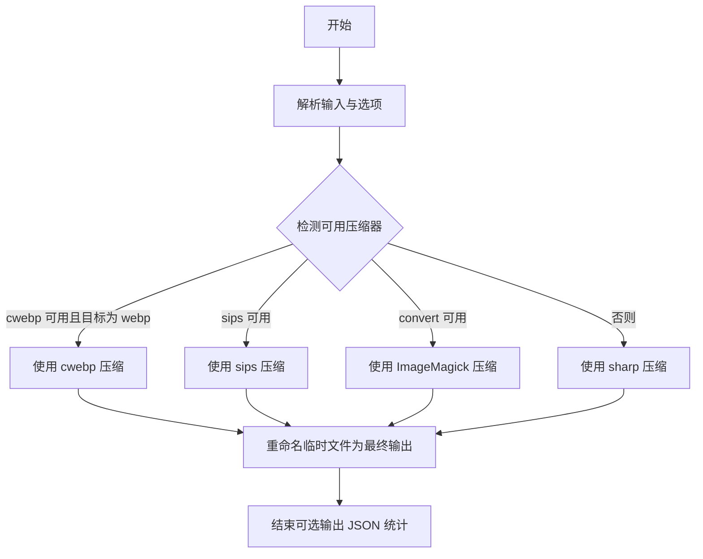
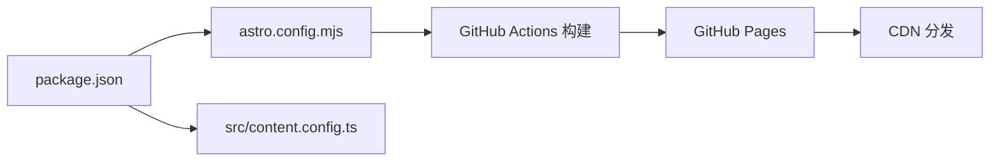

# 性能优化

<cite>
**本文引用的文件**
- [package.json](file://package.json)
- [astro.config.mjs](file://astro.config.mjs)
- [src/content.config.ts](file://src/content.config.ts)
- [DEPLOYMENT.md](file://DEPLOYMENT.md)
- [.agents/skills/baoyu-compress-image/scripts/main.ts](file://.agents/skills/baoyu-compress-image/scripts/main.ts)
- [.agents/skills/baoyu-imagine/scripts/main.ts](file://.agents/skills/baoyu-imagine/scripts/main.ts)
- [.agents/skills/baoyu-format-markdown/scripts/main.ts](file://.agents/skills/baoyu-format-markdown/scripts/main.ts)
- [.agents/skills/baoyu-markdown-to-html/scripts/main.ts](file://.agents/skills/baoyu-markdown-to-html/scripts/main.ts)
- [.agents/skills/baoyu-diagram/scripts/main.ts](file://.agents/skills/baoyu-diagram/scripts/main.ts)
</cite>

## 目录
1. [简介](#简介)
2. [项目结构](#项目结构)
3. [核心组件](#核心组件)
4. [架构总览](#架构总览)
5. [详细组件分析](#详细组件分析)
6. [依赖关系分析](#依赖关系分析)
7. [性能考量](#性能考量)
8. [故障排查指南](#故障排查指南)
9. [结论](#结论)
10. [附录](#附录)

## 简介
本指南面向 NTLx's Blog（基于 Astro + Starlight 的静态站点），围绕“静态资源优化、图像处理优化、加载性能提升、Web Vitals 监控、缓存与 CDN、代码分割与懒加载、构建优化与资源指纹、性能测试与瓶颈定位、移动端与离线策略”等主题，提供可操作的优化建议与落地方法。文档同时结合仓库内现有脚本与配置，给出与当前代码基线一致的优化路径。

## 项目结构
- 技术栈：Astro 5 + Starlight，内容通过 Astro Content Collection 加载，构建产物用于 GitHub Pages 部署。
- 关键配置：站点基础配置、SEO 头部注入、Analytics、Favicon、侧边栏导航等。
- 内容层：通过 content.config.ts 定义 docs 类集合，配合 Starlight 的 schema 与 loader。
- 部署：通过 GitHub Actions 自动构建并发布至 GitHub Pages。

图表来源
- [astro.config.mjs:1-261](file://astro.config.mjs#L1-L261)
- [src/content.config.ts:1-8](file://src/content.config.ts#L1-L8)
- [package.json:1-18](file://package.json#L1-L18)
- [DEPLOYMENT.md:1-121](file://DEPLOYMENT.md#L1-L121)

章节来源
- [astro.config.mjs:1-261](file://astro.config.mjs#L1-L261)
- [src/content.config.ts:1-8](file://src/content.config.ts#L1-L8)
- [package.json:1-18](file://package.json#L1-L18)
- [DEPLOYMENT.md:1-121](file://DEPLOYMENT.md#L1-L121)

## 核心组件
- 站点配置与集成：通过 Astro 配置启用 Starlight，并注入 SEO 与 Analytics；配置站点地址、社交链接、编辑链接、Favicon、最后更新时间等。
- 内容加载：通过 Astro Content Loader 与 Starlight Schema 加载 docs 类内容，支持多分类与侧边栏导航。
- 部署流程：GitHub Actions 自动构建与部署，支持自定义域名与 CNAME。

章节来源
- [astro.config.mjs:1-261](file://astro.config.mjs#L1-L261)
- [src/content.config.ts:1-8](file://src/content.config.ts#L1-L8)
- [DEPLOYMENT.md:1-121](file://DEPLOYMENT.md#L1-L121)

## 架构总览
下图展示从内容到构建、部署与前端渲染的整体链路，以及与性能优化相关的关键节点（资源压缩、图像处理、CDN、缓存）。

图表来源
- [astro.config.mjs:1-261](file://astro.config.mjs#L1-L261)
- [DEPLOYMENT.md:1-121](file://DEPLOYMENT.md#L1-L121)

## 详细组件分析

### 静态资源优化策略
- 资源压缩与格式转换
  - 使用图像压缩脚本按需将 PNG/JPG/GIF/WebP 等转为更优格式与质量，支持递归处理与保留原图。
  - 使用 SVG 转 PNG 脚本，按缩放因子输出高分辨率位图，适配高 DPI 屏幕。
- 资源指纹与缓存
  - 构建阶段由 Astro 自动生成带指纹的资源文件名，结合浏览器缓存与 CDN 缓存策略，减少重复下载。
- CDN 集成
  - GitHub Pages 默认使用 CDN；可在自定义域名场景下进一步利用 DNS/CDN 提升边缘缓存命中率。

章节来源
- [.agents/skills/baoyu-compress-image/scripts/main.ts:1-318](file://.agents/skills/baoyu-compress-image/scripts/main.ts#L1-L318)
- [.agents/skills/baoyu-diagram/scripts/main.ts:1-101](file://.agents/skills/baoyu-diagram/scripts/main.ts#L1-L101)
- [DEPLOYMENT.md:1-121](file://DEPLOYMENT.md#L1-L121)

### 图像处理优化技术
- 多压缩器自动探测与回退
  - 脚本会根据平台与可用命令自动选择最优压缩器（如 cwebp、ImageMagick、sips 或 sharp），保证跨平台兼容与高效压缩。
- 质量与格式参数化
  - 支持指定输出格式（webp/png/jpeg）与质量阈值，兼顾体积与视觉质量。
- 批量处理与统计
  - 支持目录级递归处理与 JSON 输出统计，便于评估压缩收益与回归对比。

图表来源
- [.agents/skills/baoyu-compress-image/scripts/main.ts:42-116](file://.agents/skills/baoyu-compress-image/scripts/main.ts#L42-L116)
- [.agents/skills/baoyu-compress-image/scripts/main.ts:135-164](file://.agents/skills/baoyu-compress-image/scripts/main.ts#L135-L164)

章节来源
- [.agents/skills/baoyu-compress-image/scripts/main.ts:1-318](file://.agents/skills/baoyu-compress-image/scripts/main.ts#L1-L318)

### 加载性能提升方法
- 预渲染与静态生成
  - Astro Starlight 采用静态生成，页面在构建期完成渲染，减少首屏等待。
- 资源延迟加载
  - 对非首屏图片与富媒体内容，建议采用懒加载策略（如使用 loading="lazy" 与 IntersectionObserver）。
- 预加载与预连接
  - 对关键字体、图标与首屏资源，使用 rel="preload/preconnect" 提前建立连接与传输。
- 减少主线程阻塞
  - 将非关键 JS 异步加载，避免阻塞首次内容绘制（FCP）与用户可交互（TTI）。

章节来源
- [astro.config.mjs:1-261](file://astro.config.mjs#L1-L261)

### Web Vitals 指标监控
- 建议在站点 head 中注入 Web Vitals 监控脚本，或通过第三方 SDK（如 Google Analytics 4）采集指标。
- 结合构建产物与 CDN 缓存，持续跟踪 LCP、FID、CLS 等指标变化，定位回归。

章节来源
- [astro.config.mjs:20-46](file://astro.config.mjs#L20-L46)

### 缓存策略配置与 CDN 集成
- 构建产物指纹
  - Astro 默认为静态资源生成带指纹的文件名，确保浏览器与 CDN 可长期缓存。
- GitHub Pages 与自定义域名
  - 使用 CNAME 与 GitHub Pages 设置，结合 CDN 提升全球访问速度与缓存命中。
- 缓存头策略
  - 静态资源（JS/CSS/PNG/WebP 等）应设置长缓存与 ETag/Last-Modified；HTML 页面设置较短缓存或可缓存。

章节来源
- [DEPLOYMENT.md:1-121](file://DEPLOYMENT.md#L1-L121)

### 代码分割、懒加载与预加载
- 代码分割
  - Astro 支持按路由与组件进行代码分割，建议拆分文档页面与 UI 组件，减少首屏 JS 体积。
- 懒加载
  - 对图片、视频与重型组件采用懒加载，优先保证首屏内容快速呈现。
- 预加载
  - 对关键字体与图标使用 rel="preload"，对远端域名使用 rel="preconnect" 与 dns-prefetch。

章节来源
- [astro.config.mjs:1-261](file://astro.config.mjs#L1-L261)

### 构建优化、压缩与资源指纹
- 构建脚本
  - 使用 npm run build 生成 dist，包含带指纹的静态资源与页面。
- 压缩与最小化
  - Astro 内置对 JS/CSS 的压缩与最小化；可结合外部工具对 HTML 与图片进一步优化。
- 资源指纹
  - 通过文件名指纹与长期缓存策略，降低重复请求与带宽消耗。

章节来源
- [package.json:5-10](file://package.json#L5-L10)
- [DEPLOYMENT.md:46-58](file://DEPLOYMENT.md#L46-L58)

### 移动端性能优化
- 视口与 DPR
  - 合理设置视口与 DPR，避免过度放大导致的内存与渲染压力。
- 图像尺寸与格式
  - 为不同 DPR 提供合适尺寸与格式（如 WebP），减少移动端带宽占用。
- 交互响应
  - 控制首屏交互元素数量，避免复杂动画与大量事件监听。

章节来源
- [.agents/skills/baoyu-diagram/scripts/main.ts:32-51](file://.agents/skills/baoyu-diagram/scripts/main.ts#L32-L51)
- [astro.config.mjs:1-261](file://astro.config.mjs#L1-L261)

### 离线访问支持策略
- Service Worker（可选）
  - 可引入轻量 SW，缓存关键静态资源与页面，提升离线可用性。
- 渐进增强
  - 确保核心内容在无网络情况下仍可阅读，非关键功能降级显示。

章节来源
- [DEPLOYMENT.md:1-121](file://DEPLOYMENT.md#L1-L121)

## 依赖关系分析
- 依赖与脚本
  - 项目依赖 Astro 与 Starlight，构建脚本通过 npm run build 生成静态站点。
- 内容加载
  - 通过 Astro Content Loader 与 Starlight Schema 加载 docs 内容，支持多分类与导航。
- 部署链路
  - GitHub Actions 自动构建并部署至 GitHub Pages，默认使用 CDN。

图表来源
- [package.json:1-18](file://package.json#L1-L18)
- [astro.config.mjs:1-261](file://astro.config.mjs#L1-L261)
- [src/content.config.ts:1-8](file://src/content.config.ts#L1-L8)
- [DEPLOYMENT.md:44-58](file://DEPLOYMENT.md#L44-L58)

章节来源
- [package.json:1-18](file://package.json#L1-L18)
- [astro.config.mjs:1-261](file://astro.config.mjs#L1-L261)
- [src/content.config.ts:1-8](file://src/content.config.ts#L1-L8)
- [DEPLOYMENT.md:1-121](file://DEPLOYMENT.md#L1-L121)

## 性能考量
- 图像处理
  - 优先使用 WebP；对矢量图形导出 PNG 时按需放大，避免模糊。
- 构建与缓存
  - 启用指纹与长缓存；对 HTML 设置合理缓存策略；利用 CDN 提升边缘缓存命中。
- 加载体验
  - 首屏最小化 JS；关键资源预加载；非关键资源懒加载。
- 监控与回归
  - 持续采集 Web Vitals 指标，结合构建日志与 CDN 访问日志定位瓶颈。

## 故障排查指南
- 构建失败
  - 检查 Actions 日志与本地构建是否一致；确认 Node.js 版本与依赖安装。
- 部署成功但页面 404
  - 确认 GitHub Pages 源为 GitHub Actions；检查站点配置与 CNAME 设置。
- 资源无法加载
  - 检查资源路径是否为相对路径；清理浏览器缓存；确认 CDN 缓存生效。

章节来源
- [DEPLOYMENT.md:68-87](file://DEPLOYMENT.md#L68-L87)

## 结论
通过结合 Astro 的静态生成能力、Starlight 的内容组织方式与现有图像处理脚本，NTLx's Blog 可在不改变现有技术栈的前提下，系统性地提升静态资源体积、加载速度与用户体验。建议优先落地图像压缩与格式转换、构建产物指纹与 CDN 缓存、关键资源预加载与非关键资源懒加载，并持续监控 Web Vitals 指标，形成闭环优化。

## 附录
- 性能测试工具
  - Lighthouse/Audit：本地与 CI 中运行，识别性能与可访问性问题。
  - WebPageTest/Chrome DevTools：分析首屏渲染、资源瀑布与缓存命中。
- 常见优化清单
  - 图像：WebP 格式、按 DPR 提供尺寸、压缩比与质量平衡。
  - 资源：指纹命名、长缓存、CDN 边缘缓存。
  - 加载：首屏最小化、关键资源预加载、非关键资源懒加载。
  - 监控：Web Vitals 指标采集与趋势分析。