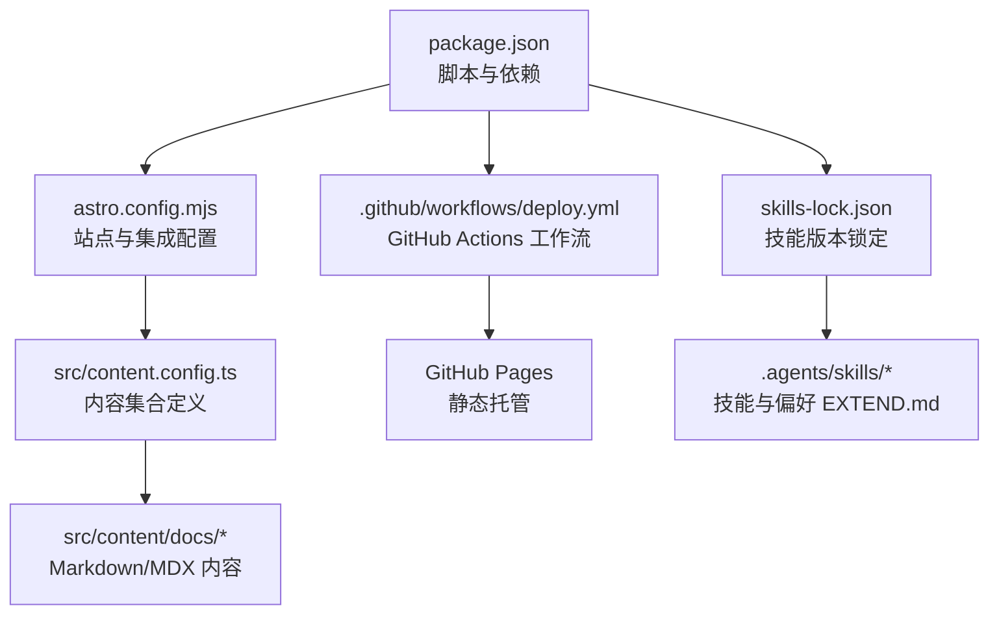
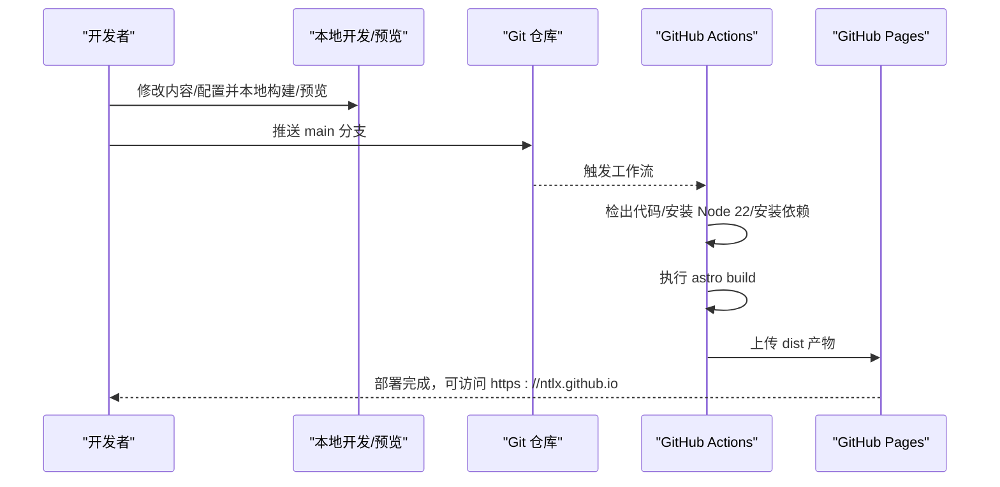
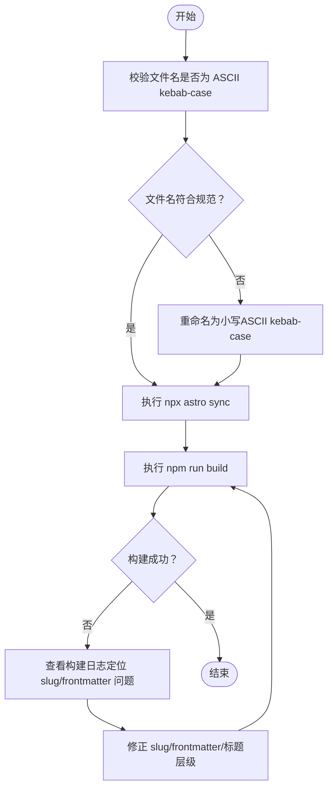
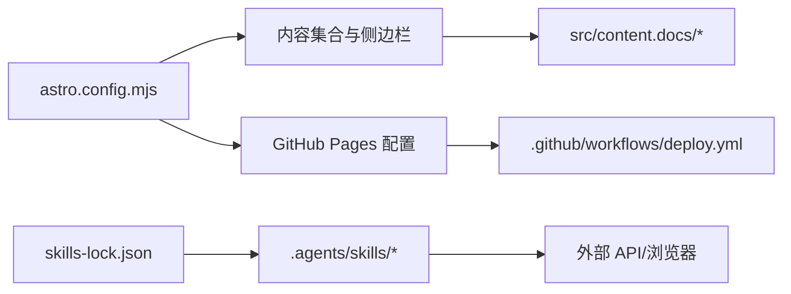

# 故障排查

<cite>
**本文引用的文件**
- [package.json](file://package.json)
- [astro.config.mjs](file://astro.config.mjs)
- [DEPLOYMENT.md](file://DEPLOYMENT.md)
- [CLAUDE.md](file://CLAUDE.md)
- [.github/workflows/deploy.yml](file://.github/workflows/deploy.yml)
- [src/content.config.ts](file://src/content.config.ts)
- [migrate_docs.py](file://migrate_docs.py)
- [src/content/docs/index.mdx](file://src/content/docs/index.mdx)
- [src/content/docs/ai-tools/claude-code-config.md](file://src/content/docs/ai-tools/claude-code-config.md)
- [src/content/docs/devops/shell-terminal/bash.md](file://src/content/docs/devops/shell-terminal/bash.md)
- [src/content/docs/network-proxy/shadowsocks.md](file://src/content/docs/network-proxy/shadowsocks.md)
- [.agents/skills/baoyu-imagine/SKILL.md](file://.agents/skills/baoyu-imagine/SKILL.md)
- [.agents/skills/baoyu-post-to-wechat/SKILL.md](file://.agents/skills/baoyu-post-to-wechat/SKILL.md)
- [skills-lock.json](file://skills-lock.json)
</cite>

## 目录
1. [简介](#简介)
2. [项目结构](#项目结构)
3. [核心组件](#核心组件)
4. [架构总览](#架构总览)
5. [详细组件分析](#详细组件分析)
6. [依赖关系分析](#依赖关系分析)
7. [性能考虑](#性能考虑)
8. [故障排查指南](#故障排查指南)
9. [结论](#结论)
10. [附录](#附录)

## 简介
本指南面向 NTLx's Blog 的维护者与贡献者，覆盖开发环境、构建、部署与运行时异常的系统化排查方法。内容基于项目实际配置与文档，聚焦 Astro + Starlight 架构、GitHub Actions 自动化部署、内容集合与侧边栏一致性、第三方服务（如微信公众号）集成，以及技能系统（Skills）在图像生成与内容发布的使用要点。

## 项目结构
- 构建与运行时
  - 使用 Astro v5 + Starlight v0.37，内容通过内容集合加载，站点配置集中于 astro.config.mjs。
  - 开发命令通过 package.json 脚本统一入口，本地预览使用 astro preview。
- 内容与导航
  - 内容位于 src/content/docs/，通过 src/content.config.ts 定义 docs 集合。
  - 侧边栏导航在 astro.config.mjs 中集中配置，新增页面需同步更新。
- 部署与自动化
  - GitHub Actions 工作流在推送到 main 分支时自动构建并部署至 GitHub Pages。
  - 部署前置条件、步骤与常见问题在 DEPLOYMENT.md 与 CLAUDE.md 中说明。
- 技能系统
  - .agents/skills/ 下的技能通过 EXTEND.md 配置偏好，部分脚本通过 bun 或 npx 执行。
  - skills-lock.json 锁定技能版本，便于复现与审计。

图表来源
- [package.json:1-18](file://package.json#L1-L18)
- [astro.config.mjs:1-261](file://astro.config.mjs#L1-L261)
- [src/content.config.ts:1-8](file://src/content.config.ts#L1-L8)
- [.github/workflows/deploy.yml:1-71](file://.github/workflows/deploy.yml#L1-L71)
- [skills-lock.json:1-234](file://skills-lock.json#L1-L234)

章节来源
- [package.json:1-18](file://package.json#L1-L18)
- [astro.config.mjs:1-261](file://astro.config.mjs#L1-L261)
- [src/content.config.ts:1-8](file://src/content.config.ts#L1-L8)
- [.github/workflows/deploy.yml:1-71](file://.github/workflows/deploy.yml#L1-L71)
- [skills-lock.json:1-234](file://skills-lock.json#L1-L234)

## 核心组件
- 站点配置与集成
  - 站点基础 URL、SEO 头部注入、社交链接、编辑链接、favicon、最后更新时间等均在 astro.config.mjs 中集中配置。
  - 侧边栏导航结构庞大且层级丰富，新增页面需同步更新 slug 与分类。
- 内容集合与加载
  - 通过 docsLoader 与 docsSchema 定义内容集合，确保 frontmatter 规范与 schema 校验。
- 构建与预览
  - 本地开发与预览通过 npm 脚本统一入口，生产构建输出 dist。
- 自动化部署
  - Actions 工作流固定 Node 22，安装依赖后执行 astro build，并上传 dist 产物至 Pages。
- 技能系统
  - 技能偏好通过 EXTEND.md 管理，支持多账户、主题、颜色、评论开关等；部分技能依赖外部 API 与浏览器自动化。

章节来源
- [astro.config.mjs:1-261](file://astro.config.mjs#L1-L261)
- [src/content.config.ts:1-8](file://src/content.config.ts#L1-L8)
- [package.json:1-18](file://package.json#L1-L18)
- [.github/workflows/deploy.yml:1-71](file://.github/workflows/deploy.yml#L1-L71)
- [.agents/skills/baoyu-post-to-wechat/SKILL.md:1-268](file://.agents/skills/baoyu-post-to-wechat/SKILL.md#L1-L268)

## 架构总览
下图展示从内容变更到 GitHub Pages 展示的端到端流程，包括本地开发、构建、部署与回源访问。

图表来源
- [.github/workflows/deploy.yml:1-71](file://.github/workflows/deploy.yml#L1-L71)
- [DEPLOYMENT.md:44-58](file://DEPLOYMENT.md#L44-L58)
- [astro.config.mjs:6-9](file://astro.config.mjs#L6-L9)

章节来源
- [.github/workflows/deploy.yml:1-71](file://.github/workflows/deploy.yml#L1-L71)
- [DEPLOYMENT.md:44-58](file://DEPLOYMENT.md#L44-L58)
- [astro.config.mjs:6-9](file://astro.config.mjs#L6-L9)

## 详细组件分析

### 组件一：内容集合与侧边栏一致性
- 问题特征
  - 新增页面后导航缺失或 404。
  - 构建报错提示 slug 不存在或大小写不匹配。
- 根因分析
  - 侧边栏 slug 必须与实际文件名（ASCII kebab-case）一致，且自动转小写。
  - frontmatter 必须包含 title，正文首行不得使用 H1 标题。
- 解决步骤
  - 使用 npx astro sync 同步内容集合。
  - 按 CLAUDE.md 的“构建验证检查清单”逐项执行。
  - 确保文件名与 slug 一致，frontmatter 完整，正文从 H2 或段落开始。
- 预防措施
  - 新增页面时同步更新 astro.config.mjs 的 sidebar。
  - 团队约定文件名与 slug 的命名规范，避免中文与大小写混用。

图表来源
- [CLAUDE.md:113-131](file://CLAUDE.md#L113-L131)
- [src/content.config.ts:1-8](file://src/content.config.ts#L1-L8)
- [astro.config.mjs:57-257](file://astro.config.mjs#L57-L257)

章节来源
- [CLAUDE.md:113-131](file://CLAUDE.md#L113-L131)
- [src/content.config.ts:1-8](file://src/content.config.ts#L1-L8)
- [astro.config.mjs:57-257](file://astro.config.mjs#L57-L257)

### 组件二：构建与预览
- 问题特征
  - 本地构建失败或预览端口冲突。
  - Actions 构建阶段报 Node 版本或依赖安装错误。
- 根因分析
  - 本地 Node 版本与 Actions 不一致。
  - 依赖安装缓存或锁文件问题导致差异。
- 解决步骤
  - 本地执行 npm run build 与 npm run preview 验证。
  - 若 Actions 报错，清理缓存后重试（如 rm -rf .astro/）。
  - 确认 Actions 使用 Node 22，依赖安装使用 npm ci。
- 预防措施
  - 团队统一 Node 版本（22+）。
  - 使用 package-lock.json 与 npm ci 保证依赖一致性。

章节来源
- [package.json:5-10](file://package.json#L5-L10)
- [.github/workflows/deploy.yml:34-53](file://.github/workflows/deploy.yml#L34-L53)
- [CLAUDE.md:117-119](file://CLAUDE.md#L117-L119)

### 组件三：部署与 GitHub Pages
- 问题特征
  - 部署成功但页面 404。
  - 样式或资源加载失败。
- 根因分析
  - GitHub Pages 源未设置为 GitHub Actions。
  - site 配置与实际域名不一致。
  - 资源路径为绝对路径或相对路径不当。
- 解决步骤
  - 在仓库 Settings → Pages 中将 Source 设为 GitHub Actions。
  - 校验 astro.config.mjs 中的 site 配置与预期一致。
  - 检查浏览器控制台错误，确认资源路径与静态资源放置位置。
- 预防措施
  - 部署前本地预览 npm run preview。
  - 使用相对路径引用静态资源。

章节来源
- [DEPLOYMENT.md:68-87](file://DEPLOYMENT.md#L68-L87)
- [astro.config.mjs:6-9](file://astro.config.mjs#L6-L9)
- [.github/workflows/deploy.yml:41-58](file://.github/workflows/deploy.yml#L41-L58)

### 组件四：技能系统（图像生成与微信公众号发布）
- 问题特征
  - 技能首次使用报 EXTEND.md 未找到或配置缺失。
  - 图像生成失败或并发受限。
  - 微信公众号发布时缺少封面或评论配置。
- 根因分析
  - EXTEND.md 未按优先级路径创建或未完成首次设置。
  - API 密钥未配置或过期。
  - 浏览器自动化缺少 Chrome 或剪贴板权限。
- 解决步骤
  - 按技能文档指引完成首次设置，生成 EXTEND.md。
  - 配置对应环境变量（如 OPENAI_API_KEY 等）。
  - 使用技能提供的检查脚本（如 wechat-article-write 的权限检查）。
  - 图像生成优先使用批处理并合理设置并发。
- 预防措施
  - 使用 skills-lock.json 锁定技能版本，避免上游变更导致的不一致。
  - 在 CI 中预置必要环境变量与浏览器配置。

章节来源
- [.agents/skills/baoyu-imagine/SKILL.md:32-50](file://.agents/skills/baoyu-imagine/SKILL.md#L32-L50)
- [.agents/skills/baoyu-imagine/SKILL.md:98-124](file://.agents/skills/baoyu-imagine/SKILL.md#L98-L124)
- [.agents/skills/baoyu-post-to-wechat/SKILL.md:42-53](file://.agents/skills/baoyu-post-to-wechat/SKILL.md#L42-L53)
- [.agents/skills/baoyu-post-to-wechat/SKILL.md:84-103](file://.agents/skills/baoyu-post-to-wechat/SKILL.md#L84-L103)
- [skills-lock.json:1-234](file://skills-lock.json#L1-L234)

## 依赖关系分析
- 组件耦合
  - astro.config.mjs 与内容集合、侧边栏高度耦合，任一变更需同步更新。
  - Actions 工作流与站点配置（site）强关联，影响 Pages 访问路径。
  - 技能系统与外部服务（API、浏览器）存在运行时依赖。
- 外部依赖
  - GitHub Pages、第三方 API（如图像生成服务）、浏览器自动化（Chrome）。
- 循环依赖
  - 未发现直接循环依赖；内容与配置分离清晰。

图表来源
- [astro.config.mjs:1-261](file://astro.config.mjs#L1-L261)
- [.github/workflows/deploy.yml:1-71](file://.github/workflows/deploy.yml#L1-L71)
- [skills-lock.json:1-234](file://skills-lock.json#L1-L234)

章节来源
- [astro.config.mjs:1-261](file://astro.config.mjs#L1-L261)
- [.github/workflows/deploy.yml:1-71](file://.github/workflows/deploy.yml#L1-L71)
- [skills-lock.json:1-234](file://skills-lock.json#L1-L234)

## 性能考虑
- 构建性能
  - 使用 npm ci 与缓存策略减少依赖安装耗时。
  - 控制内容数量与图片尺寸，避免过大资源拖慢构建。
- 运行时性能
  - Starlight 提供搜索与响应式设计，注意图片懒加载与 CDN 使用。
- 技能系统性能
  - 图像生成建议批处理与并发控制，避免触发上游速率限制。
  - 微信公众号发布优先使用 API 方法以提升吞吐。

## 故障排查指南

### 开发环境问题
- 症状：本地开发/预览无法启动或端口冲突
  - 检查本地 Node 版本是否为 22+，使用 nvm 管理版本。
  - 确认端口 4321 未被占用，或调整 astro preview 端口。
  - 清理缓存后重试：rm -rf .astro/ 并重新安装依赖。
- 症状：编辑器/IDE 无法识别内容集合
  - 执行 npx astro sync 同步内容集合。
  - 确认 src/content.config.ts 的 loader/schema 正确。

章节来源
- [package.json:5-10](file://package.json#L5-L10)
- [CLAUDE.md:117-119](file://CLAUDE.md#L117-L119)
- [src/content.config.ts:1-8](file://src/content.config.ts#L1-L8)

### 构建错误
- 症状：构建失败，提示 slug 不存在或大小写不匹配
  - 检查 astro.config.mjs 的 sidebar 与实际文件名是否一致（ASCII kebab-case）。
  - 确保 frontmatter 包含 title，正文首行不得为 H1。
- 症状：Actions 构建阶段失败
  - 查看 Actions 日志定位具体错误。
  - 确认 Actions 使用 Node 22，依赖安装使用 npm ci。
  - 本地先执行 npm run build 与 npm run preview 验证。

章节来源
- [CLAUDE.md:113-131](file://CLAUDE.md#L113-L131)
- [.github/workflows/deploy.yml:34-53](file://.github/workflows/deploy.yml#L34-L53)

### 部署失败
- 症状：部署成功但页面 404
  - 确认 GitHub Pages 设置中 Source 为 GitHub Actions。
  - 检查 astro.config.mjs 的 site 配置与预期一致。
- 症状：样式或资源文件无法加载
  - 检查浏览器控制台错误，确认资源路径为相对路径。
  - 清除浏览器缓存后重试。

章节来源
- [DEPLOYMENT.md:68-87](file://DEPLOYMENT.md#L68-L87)
- [astro.config.mjs:6-9](file://astro.config.mjs#L6-L9)

### 运行时异常
- 症状：页面空白或导航缺失
  - 检查内容集合是否同步，执行 npx astro sync。
  - 核对 index.mdx 等首页 frontmatter 与 hero 配置。
- 症状：搜索或深色模式异常
  - 确认 Starlight 集成未被意外覆盖。
  - 检查自定义 CSS 是否引入冲突。

章节来源
- [src/content/docs/index.mdx:1-43](file://src/content/docs/index.mdx#L1-L43)
- [astro.config.mjs:10-57](file://astro.config.mjs#L10-L57)

### 技能系统故障
- 症状：技能首次使用报 EXTEND.md 未找到
  - 按技能文档完成首次设置，生成 EXTEND.md。
  - 检查 EXTEND.md 优先级路径与权限。
- 症状：图像生成失败或超时
  - 配置对应 API 密钥与模型参数。
  - 使用批处理与合理并发，避免触发上游限流。
- 症状：微信公众号发布失败
  - 使用权限检查脚本排查 Chrome、剪贴板、API 凭据。
  - 确认封面、评论配置与 EXTEND.md 一致。

章节来源
- [.agents/skills/baoyu-imagine/SKILL.md:32-50](file://.agents/skills/baoyu-imagine/SKILL.md#L32-L50)
- [.agents/skills/baoyu-imagine/SKILL.md:98-124](file://.agents/skills/baoyu-imagine/SKILL.md#L98-L124)
- [.agents/skills/baoyu-post-to-wechat/SKILL.md:84-103](file://.agents/skills/baoyu-post-to-wechat/SKILL.md#L84-L103)

### 第三方服务集成
- 症状：Google Analytics 未生效
  - 检查 astro.config.mjs 中 head 注入的脚本与属性。
- 症状：自定义域名未生效
  - 确认 public/CNAME 存在且指向正确域名。
  - 等待 DNS 生效（几分钟到几小时）。

章节来源
- [astro.config.mjs:21-46](file://astro.config.mjs#L21-L46)
- [DEPLOYMENT.md:59-67](file://DEPLOYMENT.md#L59-L67)

### 调试工具与日志分析
- Actions 日志
  - 在 Actions 页面查看构建与部署阶段的详细输出，定位依赖安装、构建命令与上传环节的问题。
- 本地日志
  - npm run build 与 npm run preview 输出构建与预览信息，结合浏览器控制台定位前端资源问题。
- 技能调试
  - 使用技能提供的检查脚本（如 wechat-article-write 的权限检查）快速定位环境问题。

章节来源
- [.github/workflows/deploy.yml:28-58](file://.github/workflows/deploy.yml#L28-L58)
- [.agents/skills/baoyu-post-to-wechat/SKILL.md:84-103](file://.agents/skills/baoyu-post-to-wechat/SKILL.md#L84-L103)

### 错误信息解读
- “The slug specified in the Starlight sidebar config does not exist”
  - 表示 sidebar 中的 slug 与实际文件名不一致或包含非 ASCII 字符。
- “正文首行不得使用 H1 标题”
  - Starlight 已将 frontmatter title 渲染为 h1，正文重复 H1 会产生重复标题。
- “Access token error”
  - 微信公众号 API 凭据无效或过期，需重新配置。

章节来源
- [CLAUDE.md:100-105](file://CLAUDE.md#L100-L105)
- [CLAUDE.md:125-131](file://CLAUDE.md#L125-L131)
- [.agents/skills/baoyu-post-to-wechat/SKILL.md:246-248](file://.agents/skills/baoyu-post-to-wechat/SKILL.md#L246-L248)

### 性能问题识别与优化
- 识别
  - 构建时间过长：检查内容数量、图片体积与第三方集成。
  - 预览卡顿：减少一次性渲染的内容量，启用懒加载。
- 优化
  - 使用批处理与并发控制（图像生成）。
  - 使用 CDN 与缓存策略（静态资源）。
  - 控制侧边栏层级与导航项数量，减少前端渲染压力。

章节来源
- [.agents/skills/baoyu-imagine/SKILL.md:207-214](file://.agents/skills/baoyu-imagine/SKILL.md#L207-L214)

### 兼容性问题
- 平台差异
  - Windows 命令行与 Shell 配置差异较大，注意 PowerShell 与 CMD 的变量设置方式。
- 浏览器自动化
  - macOS 需启用辅助功能权限，Linux/Wayland 需安装 xdotool/ydotool。
- API 兼容
  - 不同图像服务的参数与限制不同，遵循技能文档的 provider-specific 指南。

章节来源
- [src/content/docs/devops/shell-terminal/bash.md:171-203](file://src/content/docs/devops/shell-terminal/bash.md#L171-L203)
- [.agents/skills/baoyu-post-to-wechat/SKILL.md:94-103](file://.agents/skills/baoyu-post-to-wechat/SKILL.md#L94-L103)
- [.agents/skills/baoyu-imagine/SKILL.md:154-172](file://.agents/skills/baoyu-imagine/SKILL.md#L154-L172)

### 第三方服务集成故障排除
- 微信公众号
  - API 方法：确保凭据有效，封面必填，评论开关按需配置。
  - 浏览器方法：确保 Chrome 可用、剪贴板权限正常。
- Claude Code
  - 配置优先级：工作目录配置 > 系统环境变量 > 用户目录配置。
  - 模型与超时：根据任务类型选择合适模型与超时参数。

章节来源
- [.agents/skills/baoyu-post-to-wechat/SKILL.md:178-225](file://.agents/skills/baoyu-post-to-wechat/SKILL.md#L178-L225)
- [src/content/docs/ai-tools/claude-code-config.md:80-91](file://src/content/docs/ai-tools/claude-code-config.md#L80-L91)

### 问题预防与维护检查清单
- 内容与配置
  - 新增页面：创建文件 → 填写 frontmatter → 更新 astro.config.mjs sidebar → 执行 npx astro sync → 本地构建验证。
- 构建与部署
  - 本地预览：npm run preview → 检查页面与资源。
  - Actions：确认 Node 22、npm ci、构建命令与上传产物。
- 技能系统
  - 首次使用：完成 EXTEND.md 首次设置。
  - 环境检查：使用技能提供的检查脚本。
  - 版本锁定：维护 skills-lock.json，避免上游变更。
- 第三方服务
  - 微信公众号：凭据有效期检查、封面与评论配置核对。
  - Analytics：确认脚本注入与属性正确。

章节来源
- [CLAUDE.md:113-131](file://CLAUDE.md#L113-L131)
- [.github/workflows/deploy.yml:34-58](file://.github/workflows/deploy.yml#L34-L58)
- [skills-lock.json:1-234](file://skills-lock.json#L1-L234)

## 结论
本指南围绕 Astro + Starlight 架构与 GitHub Actions 自动化，提供了从开发环境、构建、部署到运行时异常的系统化排查方法。通过严格执行内容与配置一致性、构建验证与预览、技能系统偏好与环境检查、第三方服务集成与版本锁定，可显著降低故障率并提升维护效率。

## 附录
- 快速参考
  - 本地开发：npm run dev
  - 构建：npm run build
  - 预览：npm run preview
  - 同步内容集合：npx astro sync
  - Actions 触发：推送到 main 分支或手动触发

章节来源
- [package.json:5-10](file://package.json#L5-L10)
- [CLAUDE.md:117-119](file://CLAUDE.md#L117-L119)
- [.github/workflows/deploy.yml:3-9](file://.github/workflows/deploy.yml#L3-L9)