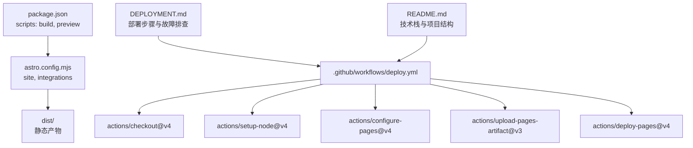
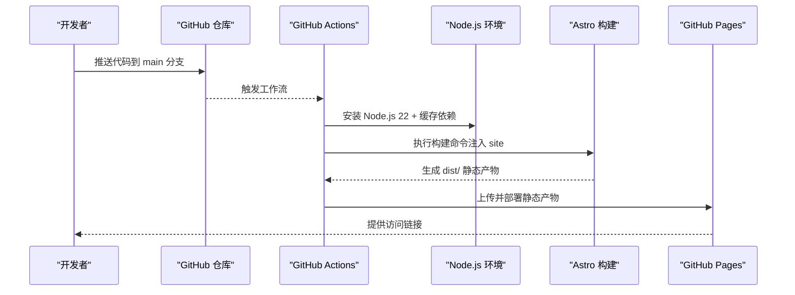
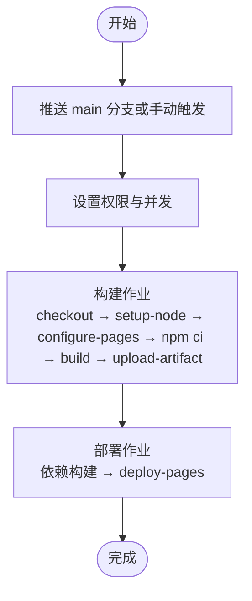
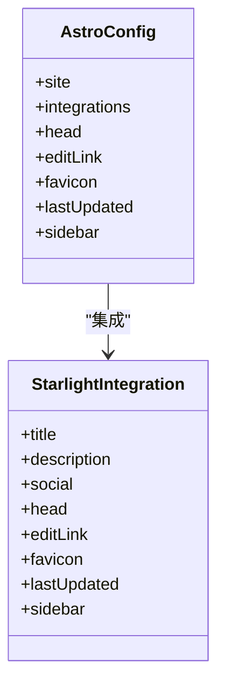
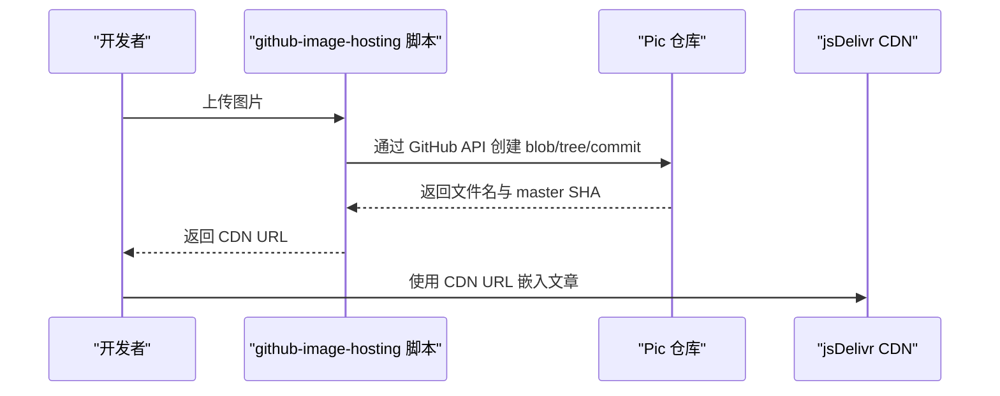
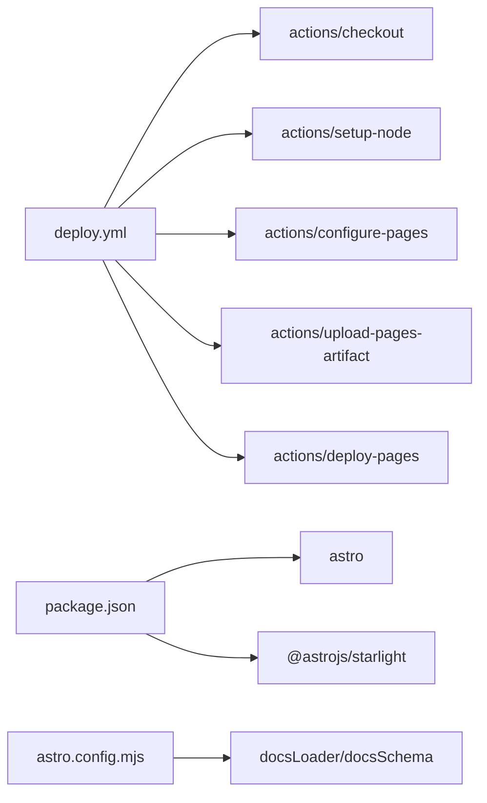

# 自动化部署

<cite>
**本文引用的文件**
- [.github/workflows/deploy.yml](file://.github/workflows/deploy.yml)
- [DEPLOYMENT.md](file://DEPLOYMENT.md)
- [README.md](file://README.md)
- [astro.config.mjs](file://astro.config.mjs)
- [package.json](file://package.json)
- [src/content.config.ts](file://src/content.config.ts)
- [.editorconfig](file://.editorconfig)
- [.gitignore](file://.gitignore)
- [skills-lock.json](file://skills-lock.json)
- [.agents/skills/github-image-hosting/scripts/upload.ts](file://.agents/skills/github-image-hosting/scripts/upload.ts)
- [.agents/skills/baoyu-post-to-wechat/scripts/wechat-api.ts](file://.agents/skills/baoyu-post-to-wechat/scripts/wechat-api.ts)
</cite>

## 目录
1. [简介](#简介)
2. [项目结构](#项目结构)
3. [核心组件](#核心组件)
4. [架构总览](#架构总览)
5. [详细组件分析](#详细组件分析)
6. [依赖分析](#依赖分析)
7. [性能考量](#性能考量)
8. [故障排查指南](#故障排查指南)
9. [结论](#结论)
10. [附录](#附录)

## 简介
本指南面向 NTLx's Blog 的自动化部署系统，聚焦 GitHub Actions 工作流的配置、CI/CD 流程实现与部署策略选择。文档覆盖部署前准备、构建过程监控、部署后验证、多环境配置、域名绑定与 HTTPS 设置、安全与权限管理、故障恢复机制以及性能优化建议。同时结合项目实际，解释 Astro Starlight 在 GitHub Pages 上的构建与发布流程，并给出可操作的步骤与可视化图示，帮助读者快速上手并稳定运维。

## 项目结构
本项目采用 Astro Starlight 框架，静态站点通过 GitHub Actions 自动构建并发布至 GitHub Pages。关键文件与职责如下：
- 工作流定义：.github/workflows/deploy.yml
- 部署操作说明：DEPLOYMENT.md
- 项目总览与技术栈：README.md
- 站点配置与 SEO：astro.config.mjs
- 构建脚本与依赖：package.json
- 内容集合配置：src/content.config.ts
- 代码风格与忽略规则：.editorconfig、.gitignore
- 技能版本锁定：skills-lock.json
- 图床上传脚本：.agents/skills/github-image-hosting/scripts/upload.ts
- 微信公众号发布脚本：.agents/skills/baoyu-post-to-wechat/scripts/wechat-api.ts

**图表来源**
- [.github/workflows/deploy.yml:24-71](file://.github/workflows/deploy.yml#L24-L71)
- [package.json:5-11](file://package.json#L5-L11)
- [astro.config.mjs:6-10](file://astro.config.mjs#L6-L10)

**章节来源**
- [README.md:66-84](file://README.md#L66-L84)
- [DEPLOYMENT.md:11-58](file://DEPLOYMENT.md#L11-L58)
- [.github/workflows/deploy.yml:24-71](file://.github/workflows/deploy.yml#L24-L71)

## 核心组件
- GitHub Actions 工作流
  - 触发条件：推送到 main 分支或手动触发
  - 权限：读取仓库内容、写入 Pages、签发 ID Token
  - 并发控制：同一时间仅允许一个部署作业
  - 构建步骤：检出代码、安装 Node.js 22、安装依赖、构建 Astro 站点、上传构建产物
  - 部署步骤：从构建产物部署到 GitHub Pages
- Astro 配置
  - 站点地址：默认值为 https://ntlx.github.io，构建时由 GitHub Actions 注入
  - 集成 Starlight，配置社交链接、SEO 头部、编辑链接、Favicon、侧边栏导航等
- 本地构建与预览
  - 通过 npm run build 与 npm run preview 在本地验证生产构建

**章节来源**
- [.github/workflows/deploy.yml:1-71](file://.github/workflows/deploy.yml#L1-L71)
- [astro.config.mjs:6-50](file://astro.config.mjs#L6-L50)
- [package.json:5-11](file://package.json#L5-L11)
- [DEPLOYMENT.md:97-110](file://DEPLOYMENT.md#L97-L110)

## 架构总览
下图展示了从代码提交到页面上线的端到端流程，包括权限、构建与部署阶段。

**图表来源**
- [.github/workflows/deploy.yml:24-71](file://.github/workflows/deploy.yml#L24-L71)
- [astro.config.mjs:6-10](file://astro.config.mjs#L6-L10)

## 详细组件分析

### GitHub Actions 工作流
- 触发与权限
  - on.push.branches: main
  - on.workflow_dispatch: 支持手动触发
  - permissions: contents=read, pages=write, id-token=write
  - concurrency.group: "pages", cancel-in-progress: true
- 构建作业（Build）
  - checkout 仓库，fetch-depth: 0
  - setup-node 使用缓存策略，缓存路径指向 package-lock.json
  - configure-pages 输出 origin，供构建时注入 site
  - npm ci 安装依赖
  - npm run build 传入 --site "${{ steps.pages.outputs.origin }}"
  - upload-pages-artifact 上传 dist 目录
- 部署作业（Deploy）
  - 依赖 Build 作业完成
  - deploy-pages 将产物部署到 GitHub Pages
  - environment.url 指向部署输出的 page_url

**图表来源**
- [.github/workflows/deploy.yml:3-71](file://.github/workflows/deploy.yml#L3-L71)

**章节来源**
- [.github/workflows/deploy.yml:3-71](file://.github/workflows/deploy.yml#L3-L71)

### Astro 构建与站点配置
- 站点地址
  - site 默认值为 https://ntlx.github.io，构建时由 GitHub Actions 注入
- 集成 Starlight
  - 标题、描述、社交链接、SEO 头部（Google Analytics、OG 图）
  - 编辑链接 baseUrl 指向 GitHub 仓库
  - Favicon、自定义 CSS、最后更新时间
  - 侧边栏导航结构（开始、AI 辅助编程、操作系统、HPC、网络与代理、DevOps、生物信息学、指南、文章）
- 内容集合
  - docsLoader 与 docsSchema 配置，用于加载 src/content/docs 下的内容

**图表来源**
- [astro.config.mjs:9-259](file://astro.config.mjs#L9-L259)

**章节来源**
- [astro.config.mjs:6-50](file://astro.config.mjs#L6-L50)
- [src/content.config.ts:1-8](file://src/content.config.ts#L1-L8)

### 本地构建与预览
- 本地构建
  - npm run build 生成 dist/ 静态产物
- 本地预览
  - npm run preview 在本地 4321 端口预览生产构建效果

**章节来源**
- [package.json:5-11](file://package.json#L5-L11)
- [DEPLOYMENT.md:97-110](file://DEPLOYMENT.md#L97-L110)

### 图床上传与微信公众号发布（与部署协同）
- GitHub 图床上传脚本
  - 通过 GitHub API 将图片上传至指定仓库与目录，返回 jsDelivr CDN URL
  - 支持去重、文件名清洗、Dry Run 等功能
- 微信公众号发布脚本
  - 读取 Markdown/HTML，渲染为兼容公众号的 HTML
  - 上传正文图片与封面，发布到公众号草稿
  - 支持多账号配置、评论开关、摘要截断等

**图表来源**
- [.agents/skills/github-image-hosting/scripts/upload.ts:136-220](file://.agents/skills/github-image-hosting/scripts/upload.ts#L136-L220)

**章节来源**
- [.agents/skills/github-image-hosting/scripts/upload.ts:1-237](file://.agents/skills/github-image-hosting/scripts/upload.ts#L1-L237)
- [.agents/skills/baoyu-post-to-wechat/scripts/wechat-api.ts:1-796](file://.agents/skills/baoyu-post-to-wechat/scripts/wechat-api.ts#L1-L796)

## 依赖分析
- 工作流依赖
  - actions/checkout@v4：检出代码
  - actions/setup-node@v4：安装 Node.js 22，启用 npm 缓存
  - actions/configure-pages@v4：配置 GitHub Pages，输出 origin
  - actions/upload-pages-artifact@v3：上传构建产物
  - actions/deploy-pages@v4：部署到 Pages
- 项目依赖
  - @astrojs/starlight、astro、sharp 等
- 内容加载
  - docsLoader 与 docsSchema 用于加载 docs 内容

**图表来源**
- [.github/workflows/deploy.yml:24-71](file://.github/workflows/deploy.yml#L24-L71)
- [package.json:12-16](file://package.json#L12-L16)
- [astro.config.mjs:2-6](file://astro.config.mjs#L2-L6)

**章节来源**
- [.github/workflows/deploy.yml:24-71](file://.github/workflows/deploy.yml#L24-L71)
- [package.json:12-16](file://package.json#L12-L16)
- [src/content.config.ts:1-8](file://src/content.config.ts#L1-L8)

## 性能考量
- 构建缓存
  - 使用 Node.js 缓存策略，减少依赖安装时间
- 并发控制
  - 同组并发仅允许一个部署，避免资源竞争
- 产物最小化
  - 通过 Astro 构建生成 dist/ 静态产物，适合静态托管
- CDN 利用
  - 图床使用 jsDelivr，提升图片加载速度
- 本地预览
  - 在推送前本地预览，降低线上失败概率

[本节为通用指导，无需特定文件引用]

## 故障排查指南
- 构建失败
  - 查看 Actions 日志定位错误
  - 本地执行 npm run build 确认可重现
  - 确认 Node.js 版本为 22+
- 部署成功但页面 404
  - 确认 GitHub Pages 设置 Source 为 GitHub Actions
  - 检查 astro.config.mjs 中的 site 配置
  - 等待 DNS 缓存更新
- 样式或资源文件无法加载
  - 检查浏览器控制台错误
  - 确认资源路径为相对路径
  - 清除浏览器缓存后重试
- 手动触发部署
  - 进入 Actions 标签页，选择工作流并运行
- 本地预览
  - npm run preview 在 http://localhost:4321 验证

**章节来源**
- [DEPLOYMENT.md:68-110](file://DEPLOYMENT.md#L68-L110)

## 结论
本项目采用轻量、稳定的 GitHub Actions + Astro Starlight + GitHub Pages 方案，实现了从代码提交到静态页面上线的自动化流程。通过合理的权限配置、并发控制与构建缓存，保证了部署效率与可靠性。结合本地预览与故障排查指引，可有效降低风险并提升维护效率。对于需要更复杂托管策略的场景，可在现有基础上扩展多环境配置与域名绑定方案。

[本节为总结性内容，无需特定文件引用]

## 附录

### 部署前准备
- 确保仓库已创建并启用 GitHub Actions
- 在仓库 Settings → Pages 中选择 GitHub Actions 作为 Source
- 本地具备 Node.js 22+ 环境

**章节来源**
- [DEPLOYMENT.md:5-19](file://DEPLOYMENT.md#L5-L19)
- [README.md:46-57](file://README.md#L46-L57)

### 构建与部署流程
- 推送代码触发工作流
- Actions 安装 Node.js 22，安装依赖，构建站点并上传产物
- 部署到 GitHub Pages，输出访问链接

**章节来源**
- [DEPLOYMENT.md:21-42](file://DEPLOYMENT.md#L21-L42)
- [.github/workflows/deploy.yml:24-71](file://.github/workflows/deploy.yml#L24-L71)

### 多环境与域名绑定
- 多环境
  - 可通过分支策略（如 feature/* 触发预览）或矩阵构建实现多环境
- 自定义域名
  - 在项目根目录创建 public/CNAME 文件，添加域名
  - 在域名提供商处添加 CNAME 记录指向 ntlx.github.io
  - 推送更改并重新部署

**章节来源**
- [DEPLOYMENT.md:59-67](file://DEPLOYMENT.md#L59-L67)

### HTTPS 与安全
- GitHub Pages 默认启用 HTTPS
- 通过 CNAME 绑定自定义域名时，HTTPS 由 GitHub Pages 提供
- 权限管理
  - 工作流使用最小权限原则（contents=read, pages=write, id-token=write）
  - 避免在工作流中硬编码敏感信息，使用 GitHub Secrets 管理密钥

**章节来源**
- [.github/workflows/deploy.yml:11-14](file://.github/workflows/deploy.yml#L11-L14)
- [DEPLOYMENT.md:59-67](file://DEPLOYMENT.md#L59-L67)

### 故障恢复机制
- 并发取消
  - 新的部署会取消进行中的部署，避免资源冲突
- 本地回滚
  - 通过本地预览与版本控制回退到上一个稳定提交
- 重试策略
  - Actions 与 npm 缓存减少失败重试成本

**章节来源**
- [.github/workflows/deploy.yml:17-19](file://.github/workflows/deploy.yml#L17-L19)
- [DEPLOYMENT.md:68-110](file://DEPLOYMENT.md#L68-L110)