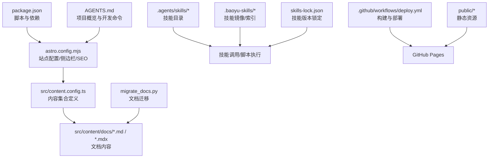
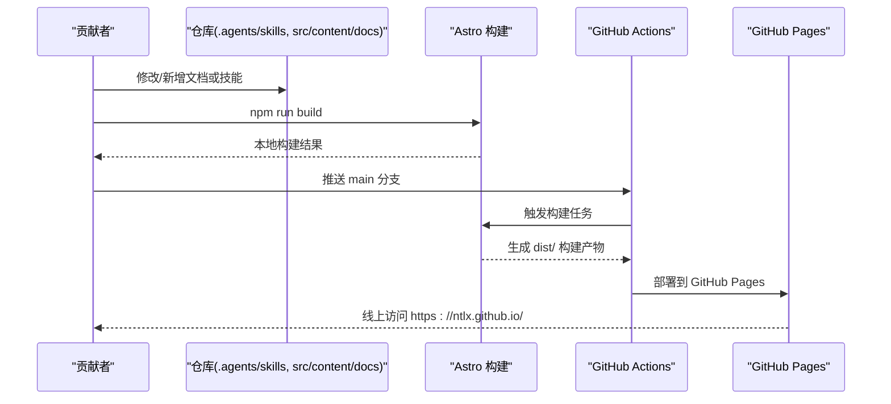
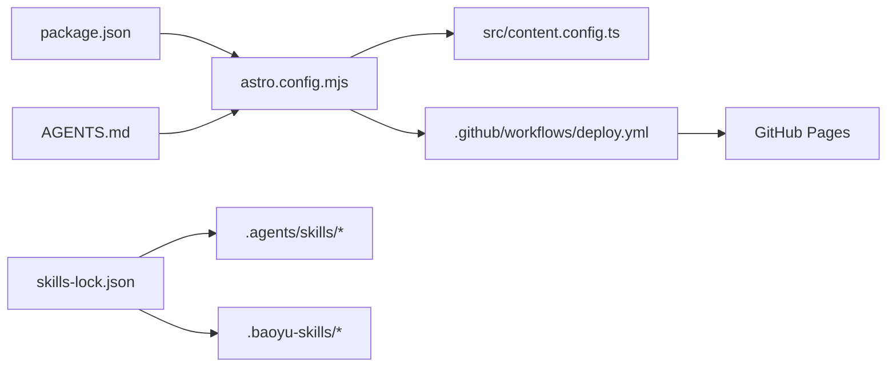

# 贡献指南

<cite>
**本文引用的文件**
- [package.json](file://package.json)
- [astro.config.mjs](file://astro.config.mjs)
- [src/content.config.ts](file://src/content.config.ts)
- [.editorconfig](file://.editorconfig)
- [AGENTS.md](file://AGENTS.md)
- [CLAUDE.md](file://CLAUDE.md)
- [DEPLOYMENT.md](file://DEPLOYMENT.md)
- [.github/workflows/deploy.yml](file://.github/workflows/deploy.yml)
- [skills-lock.json](file://skills-lock.json)
- [migrate_docs.py](file://migrate_docs.py)
</cite>

## 更新摘要
**所做更改**
- 更新了项目概览和开发命令部分，反映 CLAUDE.md 内容已整合到 AGENTS.md
- 更新了技能系统和微信公众号文章发布流水线的相关章节
- 更新了文档迁移和质量保障章节
- 更新了故障排查指南中的相关文件引用

## 目录
1. [简介](#简介)
2. [项目结构](#项目结构)
3. [核心组件](#核心组件)
4. [架构总览](#架构总览)
5. [详细组件分析](#详细组件分析)
6. [依赖关系分析](#依赖关系分析)
7. [性能考虑](#性能考虑)
8. [故障排查指南](#故障排查指南)
9. [结论](#结论)
10. [附录](#附录)

## 简介
本指南面向希望为 NTLx's Blog 项目做出贡献的开发者与内容作者，覆盖开发流程、代码与内容规范、提交要求、新功能开发流程、技能模块扩展方法、文档更新标准、代码审查与测试要求、质量保证流程、分支与版本发布策略、变更日志维护方法、社区参与方式、问题报告模板与功能请求流程，以及开发环境设置与调试技巧。项目基于 Astro + Starlight 构建，支持自动化部署至 GitHub Pages，并提供一套可扩展的"技能"（Skill）系统，用于驱动内容创作与发布流水线。

## 项目结构
项目采用"内容即代码"的组织方式，核心目录与职责如下：
- src/content/docs：文档内容（Markdown/MDX），由 Starlight 内容集合加载
- src/content.config.ts：定义内容集合与校验 Schema
- astro.config.mjs：站点配置、SEO、社交链接、侧边栏导航、编辑链接等
- public：静态资源（如 favicon、CNAME）
- .agents/skills 与 .baoyu-skills：技能系统（技能目录与版本锁定）
- .github/workflows/deploy.yml：GitHub Actions 自动化部署工作流
- package.json：脚本与依赖
- .editorconfig：统一编码风格
- AGENTS.md：项目概览、开发命令、内容与技能系统说明、部署与最佳实践
- DEPLOYMENT.md：GitHub Pages 部署步骤与故障排查
- migrate_docs.py：Docsify 文档迁移脚本

**图表来源**
- [astro.config.mjs:1-285](file://astro.config.mjs#L1-L285)
- [src/content.config.ts:1-18](file://src/content.config.ts#L1-L18)
- [package.json:1-19](file://package.json#L1-L19)
- [.github/workflows/deploy.yml:1-71](file://.github/workflows/deploy.yml#L1-L71)
- [skills-lock.json:1-234](file://skills-lock.json#L1-L234)
- [migrate_docs.py:1-169](file://migrate_docs.py#L1-L169)
- [AGENTS.md:1-266](file://AGENTS.md#L1-L266)

**章节来源**
- [package.json:1-19](file://package.json#L1-L19)
- [astro.config.mjs:1-285](file://astro.config.mjs#L1-L285)
- [src/content.config.ts:1-18](file://src/content.config.ts#L1-L18)
- [.editorconfig:1-26](file://.editorconfig#L1-L26)
- [AGENTS.md:1-266](file://AGENTS.md#L1-L266)
- [DEPLOYMENT.md:1-121](file://DEPLOYMENT.md#L1-L121)
- [.github/workflows/deploy.yml:1-71](file://.github/workflows/deploy.yml#L1-L71)
- [skills-lock.json:1-234](file://skills-lock.json#L1-L234)
- [migrate_docs.py:1-169](file://migrate_docs.py#L1-L169)

## 核心组件
- 开发与构建脚本：通过 npm scripts 提供 dev/build/preview 等命令
- 内容系统：Starlight 内容集合加载与校验，确保文档结构一致
- 站点配置：标题、描述、社交链接、SEO、编辑链接、侧边栏导航等
- 技能系统：技能目录与版本锁定，支持工具调用型与脚本执行型两类技能
- 自动化部署：GitHub Actions 在推送到 main 分支时自动构建并部署到 GitHub Pages
- 文档迁移：Python 脚本将旧版 Docsify 文档迁移为 Starlight 格式

**章节来源**
- [package.json:5-11](file://package.json#L5-L11)
- [src/content.config.ts:5-7](file://src/content.config.ts#L5-L7)
- [astro.config.mjs:10-285](file://astro.config.mjs#L10-L285)
- [AGENTS.md:43-51](file://AGENTS.md#L43-L51)
- [.github/workflows/deploy.yml:24-71](file://.github/workflows/deploy.yml#L24-L71)
- [migrate_docs.py:107-130](file://migrate_docs.py#L107-L130)

## 架构总览
下图展示从内容变更到线上发布的整体流程，包括技能调用、内容构建与部署。

**图表来源**
- [.github/workflows/deploy.yml:24-71](file://.github/workflows/deploy.yml#L24-L71)
- [astro.config.mjs:8](file://astro.config.mjs#L8)
- [DEPLOYMENT.md:21-42](file://DEPLOYMENT.md#L21-L42)

## 详细组件分析

### 开发与构建流程
- 启动开发服务器：npm run dev（默认监听 http://localhost:4321）
- 构建生产版本：npm run build（输出至 dist/）
- 预览生产构建：npm run preview
- 内容同步：新增/删除/重命名内容后需执行 astro sync

**章节来源**
- [AGENTS.md:9-19](file://AGENTS.md#L9-L19)
- [package.json:5-11](file://package.json#L5-L11)

### 内容与文档规范
- Frontmatter 规范：至少包含 title；文章类可使用扩展 frontmatter（含日期等）
- 侧边栏导航：需在 astro.config.mjs 中手动更新 sidebar，新页面才会出现
- 文件命名：使用小写 ASCII kebab-case，避免中文文件名
- 正文首行禁用 H1 标题，Starlight 会自动渲染 frontmatter title 为 h1
- Git 跟踪：技能源与版本锁需入库，.claude/skills 通过 .gitignore 排除

**章节来源**
- [AGENTS.md:60-94](file://AGENTS.md#L60-L94)
- [AGENTS.md:125-142](file://AGENTS.md#L125-L142)
- [astro.config.mjs:57-285](file://astro.config.mjs#L57-L285)

### 技能系统与扩展
- 技能类型
  - 工具调用型：读取 SKILL.md 中的工作流指令执行
  - 脚本执行型：在 scripts/ 目录执行脚本（使用 bun run）
- 版本管理：通过 skills-lock.json 锁定技能来源与哈希
- 新增技能：在 .agents/skills 下新增技能目录，完善 SKILL.md 与 EXTEND.md（如适用）

**章节来源**
- [AGENTS.md:43-51](file://AGENTS.md#L43-L51)
- [skills-lock.json:1-234](file://skills-lock.json#L1-L234)

### 微信公众号文章发布流水线（wechat-article-write）
- 输出目录：中间产物在 posts/YYYY-MM-DD-slug/（gitignored），最终文章在 src/content/docs/articles/
- 13 步流水线：依赖预检 → 资料收集 → 创作 → 封面 → 插图 → 信息图 → 图床 → CDN 整合 → 去 AI 痕迹 → 格式化 → HTML → 发布到微信 → 发布到博客
- 发布到博客步骤：复制 article.md 到 src/content/docs/articles/，更新 astro.config.mjs 侧边栏

**章节来源**
- [AGENTS.md:52-59](file://AGENTS.md#L52-L59)

### 文档迁移与更新
- migrate_docs.py：将 docs/ 下的旧版 Markdown 迁移至 src/content/docs/，自动添加 frontmatter 并转换 GitHub Alerts 为 Starlight Asides
- 迁移后需运行 npm run build 验证

**章节来源**
- [migrate_docs.py:107-130](file://migrate_docs.py#L107-L130)
- [migrate_docs.py:132-169](file://migrate_docs.py#L132-L169)

### 自动化部署与发布
- 触发条件：推送到 main 分支或手动触发 workflow_dispatch
- 环境：Node.js 22，构建产物 dist/，部署到 GitHub Pages
- 自定义域名：在 public/CNAME 中配置域名并在域名提供商添加 CNAME 记录

**章节来源**
- [.github/workflows/deploy.yml:3-9](file://.github/workflows/deploy.yml#L3-L9)
- [DEPLOYMENT.md:13-42](file://DEPLOYMENT.md#L13-L42)
- [DEPLOYMENT.md:59-67](file://DEPLOYMENT.md#L59-L67)

### 代码与内容质量保障
- 编码风格：统一使用 EditorConfig，遵循缩进与换行规范
- 内容一致性：通过内容集合与 Schema 校验，确保 frontmatter 结构
- 构建验证：每次修改后执行 astro sync 与 npm run build，必要时清理 .astro/ 后重试

**章节来源**
- [.editorconfig:1-26](file://.editorconfig#L1-L26)
- [src/content.config.ts:5-7](file://src/content.config.ts#L5-L7)
- [AGENTS.md:113-124](file://AGENTS.md#L113-L124)

## 依赖关系分析
- package.json 定义了 Astro 与 Starlight 依赖及脚本
- astro.config.mjs 依赖内容集合与侧边栏配置
- GitHub Actions 依赖 Node.js 22 与 npm ci
- 技能系统依赖 skills-lock.json 与 .agents/skills/.baoyu-skills

**图表来源**
- [package.json:12-16](file://package.json#L12-L16)
- [astro.config.mjs:9-285](file://astro.config.mjs#L9-L285)
- [.github/workflows/deploy.yml:34-53](file://.github/workflows/deploy.yml#L34-L53)
- [skills-lock.json:1-234](file://skills-lock.json#L1-L234)
- [AGENTS.md:1-266](file://AGENTS.md#L1-L266)

**章节来源**
- [package.json:12-16](file://package.json#L12-L16)
- [astro.config.mjs:9-285](file://astro.config.mjs#L9-L285)
- [.github/workflows/deploy.yml:34-53](file://.github/workflows/deploy.yml#L34-L53)
- [skills-lock.json:1-234](file://skills-lock.json#L1-L234)

## 性能考虑
- 构建阶段：优先使用 npm ci 与缓存策略，减少重复安装时间
- 资源优化：利用 sharp 等图像处理依赖，合理压缩与尺寸控制
- 内容加载：避免在单页中引入过大资源，拆分模块与懒加载
- 部署效率：保持最小化变更，减少不必要的重建

## 故障排查指南
- 构建失败
  - 检查 sidebar slug 与文件名大小写/字符
  - 确认文章引用的本地图片存在
  - 清理 .astro/ 后重试
- 部署成功但页面 404
  - 确认 GitHub Pages 源设置为 GitHub Actions
  - 检查 astro.config.mjs 中 site 配置
- 样式或资源加载失败
  - 检查浏览器控制台错误
  - 确保资源路径为相对路径
  - 清除浏览器缓存

**章节来源**
- [AGENTS.md:113-124](file://AGENTS.md#L113-L124)
- [DEPLOYMENT.md:68-87](file://DEPLOYMENT.md#L68-L87)

## 结论
本指南提供了从开发环境搭建、内容与技能扩展、质量保障到自动化部署的完整贡献路径。请在提交前确保遵循内容规范、执行构建验证，并参考自动化工作流与故障排查章节，以提升协作效率与发布稳定性。

## 附录

### 开发环境设置与调试
- 安装 Node.js 22+，执行 npm install
- 启动开发服务器：npm run dev（默认 http://localhost:4321）
- 修改内容后执行 astro sync 与 npm run build 验证
- 使用 BrowserOS 工具预览修改效果（适用于大型文档）

**章节来源**
- [AGENTS.md:9-19](file://AGENTS.md#L9-L19)
- [AGENTS.md:240-246](file://AGENTS.md#L240-L246)

### 提交流程与分支策略
- 分支：在功能分支上开发，合并到 main 分支
- 提交规范：采用 Conventional Commits（如 docs: 简短描述）
- 提交前：执行 astro sync 与 npm run build，确保无构建错误

**章节来源**
- [AGENTS.md:247-266](file://AGENTS.md#L247-L266)
- [AGENTS.md:113-124](file://AGENTS.md#L113-L124)

### 代码审查与测试要求
- 代码审查：遵循团队共识，关注内容一致性、可读性与可维护性
- 测试：当前项目未定义单元/端到端测试脚本，建议后续引入 Astro 内置测试或 Vitest

**章节来源**
- [AGENTS.md:17-19](file://AGENTS.md#L17-L19)

### 版本发布与变更日志
- 版本：项目版本在 package.json 中定义
- 发布：通过 GitHub Actions 自动化发布至 GitHub Pages
- 变更日志：可在 DEPLOYMENT.md 中记录重大变更与修复

**章节来源**
- [package.json:4](file://package.json#L4)
- [.github/workflows/deploy.yml:1-71](file://.github/workflows/deploy.yml#L1-L71)
- [DEPLOYMENT.md:111-121](file://DEPLOYMENT.md#L111-L121)

### 社区参与与问题报告
- 问题报告模板（建议）
  - 标题：简明扼要描述问题
  - 环境：操作系统、Node 版本、Astro 版本
  - 复现步骤：最小可复现步骤
  - 预期/实际结果：清晰对比
  - 截图/日志：便于定位问题
- 功能请求流程（建议）
  - 在 issue 中描述背景、目标与预期收益
  - 提供可行的实现思路或替代方案
  - 讨论影响范围与维护成本

### 新功能开发流程
- 设计：在 issue 中讨论需求与方案
- 实施：在功能分支开发，遵循内容与技能规范
- 验证：执行 astro sync 与构建验证
- 提交：发起 Pull Request，等待审查与合并

### 技能模块扩展方法
- 工具调用型：完善 SKILL.md 工作流指令与 EXTEND.md 配置
- 脚本执行型：在 scripts/ 目录添加脚本，使用 bun run 执行
- 版本管理：更新 skills-lock.json 并提交入库

**章节来源**
- [AGENTS.md:43-51](file://AGENTS.md#L43-L51)
- [skills-lock.json:1-234](file://skills-lock.json#L1-L234)

### 文档更新标准
- 使用 EditorConfig 统一风格
- 添加或更新内容时，同步更新 astro.config.mjs 侧边栏
- 使用 migrate_docs.py 迁移旧文档并验证构建

**章节来源**
- [.editorconfig:1-26](file://.editorconfig#L1-L26)
- [astro.config.mjs:57-285](file://astro.config.mjs#L57-L285)
- [migrate_docs.py:107-130](file://migrate_docs.py#L107-L130)