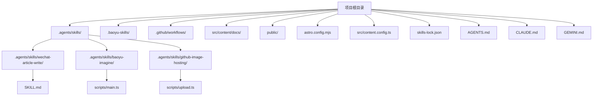
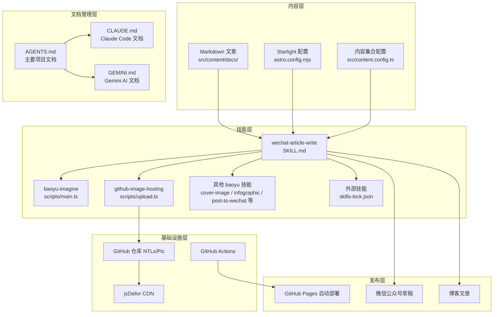
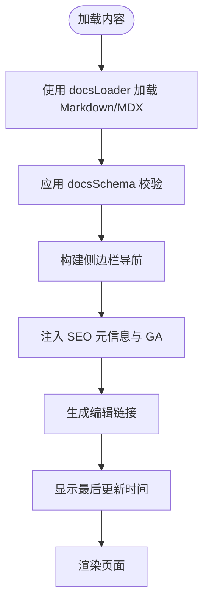
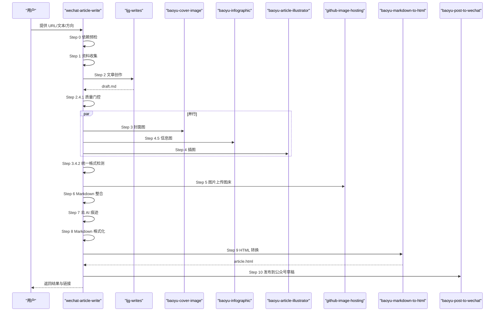
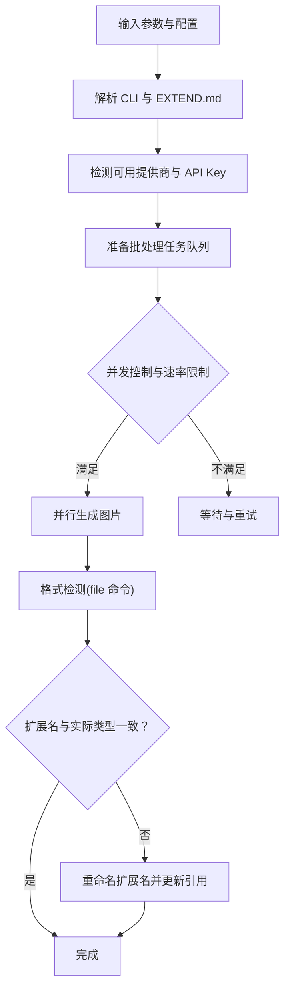
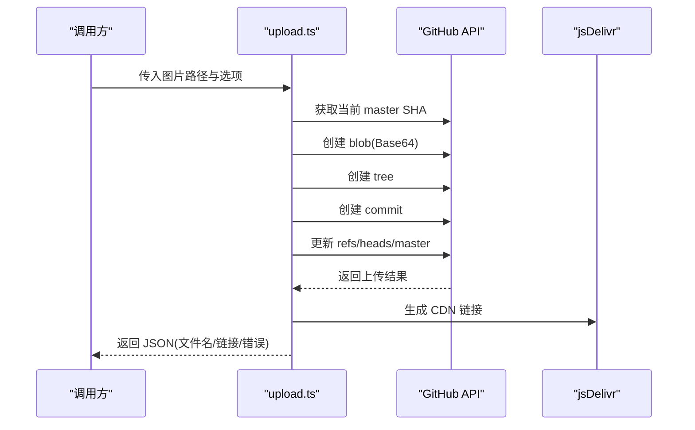
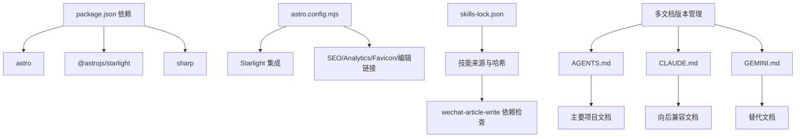

# 项目概述

<cite>
**本文档引用的文件**
- [package.json](file://package.json)
- [astro.config.mjs](file://astro.config.mjs)
- [src/content.config.ts](file://src/content.config.ts)
- [README.md](file://README.md)
- [src/content/docs/index.mdx](file://src/content/docs/index.mdx)
- [src/content/docs/articles/ai-maintenance-costs-trap.md](file://src/content/docs/articles/ai-maintenance-costs-trap.md)
- [src/content/docs/devops/version-control/git.md](file://src/content/docs/devops/version-control/git.md)
- [src/content/docs/ai-tools/claude-code-config.md](file://src/content/docs/ai-tools/claude-code-config.md)
- [.agents/skills/wechat-article-write/SKILL.md](file://.agents/skills/wechat-article-write/SKILL.md)
- [.agents/skills/baoyu-imagine/scripts/main.ts](file://.agents/skills/baoyu-imagine/scripts/main.ts)
- [.agents/skills/github-image-hosting/scripts/upload.ts](file://.agents/skills/github-image-hosting/scripts/upload.ts)
- [skills-lock.json](file://skills-lock.json)
- [AGENTS.md](file://AGENTS.md)
- [CLAUDE.md](file://CLAUDE.md)
- [GEMINI.md](file://GEMINI.md)
</cite>

## 更新摘要
**变更内容**
- 更新文档结构说明，反映 CLAUDE.md 文件被 AGENTS.md 替代的情况
- 新增对多份文档文件（AGENTS.md、CLAUDE.md、GEMINI.md）的说明
- 更新项目文档结构图，体现当前的文件组织方式
- 补充文档版本管理的最佳实践说明

## 目录
1. [简介](#简介)
2. [项目结构](#项目结构)
3. [核心组件](#核心组件)
4. [架构总览](#架构总览)
5. [详细组件分析](#详细组件分析)
6. [依赖分析](#依赖分析)
7. [性能考虑](#性能考虑)
8. [故障排查指南](#故障排查指南)
9. [结论](#结论)
10. [附录](#附录)

## 简介

NTLx's Blog 是一个基于 Astro Starlight 构建的个人知识库网站，旨在系统化记录与分享技术笔记与深度思考。项目采用双发布能力：既可以直接在 `src/content/docs/` 下创建 Markdown 文章，通过 GitHub Actions 自动部署到 GitHub Pages；也可以通过 wechat-article-write 技能，将 URL 或素材自动转化为微信公众号文章与博客文章，实现"一条命令，双端发布"。

**重要更新**：项目文档结构已重新组织，CLAUDE.md 文件已被 AGENTS.md 替代，同时保留了 GEMINI.md 作为备用文档。所有文档文件内容保持一致，确保向后兼容性和文档版本管理的灵活性。

项目核心目标：
- 构建高质量、可检索的个人知识库
- 提供"写作—发布—传播"的一体化工作流
- 支持多平台内容分发（博客与微信公众号）
- 维护文档版本的向后兼容性

设计理念：
- 内容为王：以"有感而发"的技术随笔为主，强调实用性与可复用性
- 工具即生产力：通过技能链与自动化流水线，降低内容生产的边际成本
- 可靠与可追溯：通过技能锁定与版本控制，确保发布一致性与可回溯性
- 文档版本管理：通过多版本文档文件支持不同的使用场景和工具集成

目标受众：
- 技术从业者与内容创作者
- 希望建立个人知识库与技术博客的工程师
- 需要同时运营博客与微信公众号的作者
- 需要文档版本管理的团队协作场景

使用场景：
- 日常技术笔记沉淀与检索
- 快速将网络素材转化为公众号文章与博客文章
- 通过技能链实现图片生成、格式化、去 AI 痕迹、HTML 转换与公众号发布
- 多工具集成场景下的文档版本管理

## 项目结构

项目采用"内容驱动 + 技能编排"的组织方式，核心目录如下：
- `.agents/skills/`：自研与外部技能源，包含图片生成、文章写作、发布、格式化等技能
- `.baoyu-skills/`：baoyu 系列技能的项目级偏好配置
- `.github/workflows/`：GitHub Actions 自动化部署工作流
- `src/content/docs/`：博客文章内容，按主题分类组织
- `public/`：静态资源
- `astro.config.mjs`：Astro 与 Starlight 配置
- `src/content.config.ts`：内容集合与加载器配置
- `skills-lock.json`：技能版本锁定文件
- **新增**：`AGENTS.md`、`CLAUDE.md`、`GEMINI.md`：多版本文档文件，内容相同但用途不同

**图表来源**
- [astro.config.mjs:1-285](file://astro.config.mjs#L1-L285)
- [src/content.config.ts:1-18](file://src/content.config.ts#L1-L18)
- [.agents/skills/wechat-article-write/SKILL.md:1-120](file://.agents/skills/wechat-article-write/SKILL.md#L1-L120)
- [.agents/skills/baoyu-imagine/scripts/main.ts:1-120](file://.agents/skills/baoyu-imagine/scripts/main.ts#L1-L120)
- [.agents/skills/github-image-hosting/scripts/upload.ts:1-60](file://.agents/skills/github-image-hosting/scripts/upload.ts#L1-L60)
- [AGENTS.md:1-266](file://AGENTS.md#L1-L266)
- [CLAUDE.md:1-266](file://CLAUDE.md#L1-L266)
- [GEMINI.md:1-266](file://GEMINI.md#L1-L266)

**章节来源**
- [README.md:75-90](file://README.md#L75-L90)
- [astro.config.mjs:57-257](file://astro.config.mjs#L57-L257)
- [src/content.config.ts:5-7](file://src/content.config.ts#L5-L7)

## 核心组件

- Astro Starlight 内容管理与展示
  - 通过 `content.config.ts` 定义内容集合，使用 `docsLoader` 与 `docsSchema` 加载文档
  - 通过 `astro.config.mjs` 配置标题、描述、社交链接、SEO、编辑链接、Favicon、最后更新时间等
- 双发布流水线
  - 博客文章：直接在 `src/content/docs/` 下创建 Markdown，自动构建与部署
  - 微信公众号文章：通过 wechat-article-write 技能，串联资料收集、写作、封面与插图生成、信息图、去 AI 痕迹、格式化、HTML 转换、发布到公众号草稿与博客
- 技能生态与版本管理
  - 技能锁定：通过 `skills-lock.json` 锁定技能来源与版本，确保可复现性
  - 技能配置：baoyu 系列技能支持项目级 EXTEND.md 与用户级 .env，按优先级加载
- 图床与 CDN
  - 使用 GitHub 仓库 + jsDelivr CDN 作为图床，通过 `github-image-hosting` 脚本上传并返回 CDN URL
- **新增**：多文档版本管理
  - `AGENTS.md`：主要项目文档，提供完整的项目概览和使用指南
  - `CLAUDE.md`：Claude Code 工具专用文档，保留向后兼容性
  - `GEMINI.md`：Gemini AI 工具专用文档，提供替代文档选项

**章节来源**
- [src/content.config.ts:1-18](file://src/content.config.ts#L1-L18)
- [astro.config.mjs:10-56](file://astro.config.mjs#L10-L56)
- [.agents/skills/wechat-article-write/SKILL.md:105-137](file://.agents/skills/wechat-article-write/SKILL.md#L105-L137)
- [skills-lock.json:1-234](file://skills-lock.json#L1-L234)
- [.agents/skills/github-image-hosting/scripts/upload.ts:136-220](file://.agents/skills/github-image-hosting/scripts/upload.ts#L136-L220)
- [AGENTS.md:43-51](file://AGENTS.md#L43-L51)

## 架构总览

整体架构分为"内容层"、"技能层"、"发布层"和"基础设施层"。内容层由 Astro Starlight 管理；技能层通过 wechat-article-write 调度多个 baoyu 系列技能与外部技能；发布层负责博客与微信公众号的双端输出；基础设施层包括 GitHub Pages 自动化部署与图床服务。

**重要更新**：架构中新增文档版本管理层，支持多工具集成场景下的文档版本管理。

**图表来源**
- [astro.config.mjs:6-56](file://astro.config.mjs#L6-L56)
- [src/content.config.ts:5-7](file://src/content.config.ts#L5-L7)
- [.agents/skills/wechat-article-write/SKILL.md:105-137](file://.agents/skills/wechat-article-write/SKILL.md#L105-L137)
- [.agents/skills/baoyu-imagine/scripts/main.ts:163-343](file://.agents/skills/baoyu-imagine/scripts/main.ts#L163-L343)
- [.agents/skills/github-image-hosting/scripts/upload.ts:136-220](file://.agents/skills/github-image-hosting/scripts/upload.ts#L136-L220)
- [skills-lock.json:1-234](file://skills-lock.json#L1-L234)
- [AGENTS.md:43-51](file://AGENTS.md#L43-L51)

## 详细组件分析

### 组件 A：Starlight 内容管理与导航

- 内容加载
  - 使用 `docsLoader` 与 `docsSchema` 定义文档集合，支持 Markdown 与 MDX
- 导航与侧边栏
  - 通过 `sidebar` 配置多层级分类，覆盖 AI 工具、操作系统、DevOps、生物信息学、网络与代理、HPC 集群、文章等主题
- SEO 与编辑链接
  - 配置站点元信息、社交链接、Google Analytics、OG 图片、编辑链接与 Favicon
- 最后更新时间
  - 开启 `lastUpdated` 展示文档最后更新时间

**图表来源**
- [src/content.config.ts:5-7](file://src/content.config.ts#L5-L7)
- [astro.config.mjs:10-56](file://astro.config.mjs#L10-L56)
- [astro.config.mjs:57-257](file://astro.config.mjs#L57-L257)

**章节来源**
- [src/content.config.ts:1-18](file://src/content.config.ts#L1-L18)
- [astro.config.mjs:10-56](file://astro.config.mjs#L10-L56)
- [astro.config.mjs:57-257](file://astro.config.mjs#L57-L257)

### 组件 B：微信公众号文章写作流水线（wechat-article-write）

- 核心原则
  - 全自动执行、失败不阻塞、封面不上传图床、内联插图走 CDN、date-slug 安全、图片后端优先级、格式检测修正、封面文字约束、配置路径分层
- 流水线步骤（13步）
  - Step 0：依赖预检与安装
  - Step 1：资料收集（CDP → URL 转 Markdown → 手动）
  - Step 2：文章创作（ljg-writes）
  - Step 2.4.1：质量门控（字数/互动/引用/数据点）
  - Step 3+4.5：封面图 + 信息图（并行）
  - Step 4：插图生成（与 3+4.5 并行）
  - Step 3.4.2：统一格式检测
  - Step 5：图片上传图床
  - Step 5.6：CDN 传播等待
  - Step 6：Markdown 整合（替换 CDN 地址）
  - Step 7：去 AI 痕迹（humanizer-zh）
  - Step 8：Markdown 格式化（baoyu-format-markdown）
  - Step 9：HTML 转换（baoyu-markdown-to-html）
  - Step 10：发布到公众号草稿（baoyu-post-to-wechat）
- 并行策略
  - 封面图、信息图、插图三者并行执行，显著缩短总耗时

**图表来源**
- [.agents/skills/wechat-article-write/SKILL.md:119-156](file://.agents/skills/wechat-article-write/SKILL.md#L119-L156)
- [.agents/skills/wechat-article-write/SKILL.md:232-306](file://.agents/skills/wechat-article-write/SKILL.md#L232-L306)
- [.agents/skills/wechat-article-write/SKILL.md:307-464](file://.agents/skills/wechat-article-write/SKILL.md#L307-L464)
- [.agents/skills/wechat-article-write/SKILL.md:466-571](file://.agents/skills/wechat-article-write/SKILL.md#L466-L571)
- [.agents/skills/wechat-article-write/SKILL.md:573-664](file://.agents/skills/wechat-article-write/SKILL.md#L573-L664)
- [.agents/skills/wechat-article-write/SKILL.md:666-751](file://.agents/skills/wechat-article-write/SKILL.md#L666-L751)
- [.agents/skills/wechat-article-write/SKILL.md:753-800](file://.agents/skills/wechat-article-write/SKILL.md#L753-L800)

**章节来源**
- [.agents/skills/wechat-article-write/SKILL.md:19-31](file://.agents/skills/wechat-article-write/SKILL.md#L19-L31)
- [.agents/skills/wechat-article-write/SKILL.md:119-156](file://.agents/skills/wechat-article-write/SKILL.md#L119-L156)
- [.agents/skills/wechat-article-write/SKILL.md:232-306](file://.agents/skills/wechat-article-write/SKILL.md#L232-L306)
- [.agents/skills/wechat-article-write/SKILL.md:307-464](file://.agents/skills/wechat-article-write/SKILL.md#L307-L464)
- [.agents/skills/wechat-article-write/SKILL.md:466-571](file://.agents/skills/wechat-article-write/SKILL.md#L466-L571)
- [.agents/skills/wechat-article-write/SKILL.md:573-664](file://.agents/skills/wechat-article-write/SKILL.md#L573-L664)
- [.agents/skills/wechat-article-write/SKILL.md:666-751](file://.agents/skills/wechat-article-write/SKILL.md#L666-L751)
- [.agents/skills/wechat-article-write/SKILL.md:753-800](file://.agents/skills/wechat-article-write/SKILL.md#L753-L800)

### 组件 C：图片生成与批处理（baoyu-imagine）

- 支持多提供商（Google、OpenAI、OpenRouter、DashScope、Z.AI、MiniMax、Replicate、Jimeng、Seedream、Azure）
- 批量生成与并发控制
  - 自动并行处理，支持最大工作者数量与提供商速率限制配置
- 环境变量与配置优先级
  - CLI 参数 > EXTEND.md > process.env > 项目级 .baoyu-skills/.env > 用户级 ~/.baoyu-skills/.env
- 格式检测与修正
  - 针对 Gemini 等后端返回 JPEG 内容但扩展名为 .png 的情况，统一执行格式检测与修正

**图表来源**
- [.agents/skills/baoyu-imagine/scripts/main.ts:163-343](file://.agents/skills/baoyu-imagine/scripts/main.ts#L163-L343)
- [.agents/skills/baoyu-imagine/scripts/main.ts:551-571](file://.agents/skills/baoyu-imagine/scripts/main.ts#L551-L571)
- [.agents/skills/baoyu-imagine/scripts/main.ts:613-651](file://.agents/skills/baoyu-imagine/scripts/main.ts#L613-L651)

**章节来源**
- [.agents/skills/baoyu-imagine/scripts/main.ts:163-343](file://.agents/skills/baoyu-imagine/scripts/main.ts#L163-L343)
- [.agents/skills/baoyu-imagine/scripts/main.ts:551-571](file://.agents/skills/baoyu-imagine/scripts/main.ts#L551-L571)
- [.agents/skills/baoyu-imagine/scripts/main.ts:613-651](file://.agents/skills/baoyu-imagine/scripts/main.ts#L613-L651)

### 组件 D：图床上传与 CDN 集成（github-image-hosting）

- 功能
  - 通过 GitHub API 将图片上传至 NTLx/Pic 仓库，返回 GitHub 溯源链接与 jsDelivr CDN 链接
- 流程
  - 解析参数（路径、自定义名称、文件夹、dry-run）
  - 获取现有文件列表，生成唯一文件名
  - 读取文件内容并 Base64 编码，创建 blob、tree、commit，更新 master 分支引用
- 输出
  - 成功时返回 JSON 包含文件名、文件夹、GitHub 溯源链接、CDN 链接
  - 失败时返回错误信息

**图表来源**
- [.agents/skills/github-image-hosting/scripts/upload.ts:40-62](file://.agents/skills/github-image-hosting/scripts/upload.ts#L40-L62)
- [.agents/skills/github-image-hosting/scripts/upload.ts:136-220](file://.agents/skills/github-image-hosting/scripts/upload.ts#L136-L220)

**章节来源**
- [.agents/skills/github-image-hosting/scripts/upload.ts:1-237](file://.agents/skills/github-image-hosting/scripts/upload.ts#L1-L237)

### 组件 E：技能锁定与版本管理（skills-lock.json）

- 作用
  - 锁定技能来源、类型与哈希，确保技能版本可复现
- 结构
  - version：版本号
  - skills：技能清单，包含 source、sourceType、skillPath、computedHash 等字段
- 影响
  - 与 wechat-article-write 的配置路径分层配合，保证项目级与用户级配置的安全与一致性

**章节来源**
- [skills-lock.json:1-234](file://skills-lock.json#L1-L234)
- [.agents/skills/wechat-article-write/SKILL.md:32-64](file://.agents/skills/wechat-article-write/SKILL.md#L32-L64)

### 组件 F：多文档版本管理（AGENTS.md、CLAUDE.md、GEMINI.md）

**重要更新**：项目新增多文档版本管理机制，支持不同工具集成场景下的文档版本选择。

- **AGENTS.md**（主要文档）
  - 项目的主要文档文件，提供完整的项目概览和使用指南
  - 包含技能系统、微信公众号文章管线、内容指南等核心信息
  - 适用于大多数使用场景和工具集成
- **CLAUDE.md**（向后兼容）
  - 保留 Claude Code 工具专用的文档文件
  - 内容与 AGENTS.md 完全相同，确保向后兼容性
  - 用于支持 Claude Code 的历史集成
- **GEMINI.md**（替代文档）
  - Gemini AI 工具专用的文档文件
  - 内容与 AGENTS.md 相同，提供替代文档选项
  - 支持 Gemini AI 工具的集成场景

**文档版本管理最佳实践**：
- 优先使用 AGENTS.md 作为主要文档
- 保留 CLAUDE.md 以支持历史 Claude Code 集成
- 使用 GEMINI.md 支持 Gemini AI 工具集成
- 所有文档文件内容保持同步，确保信息一致性

**章节来源**
- [AGENTS.md:1-266](file://AGENTS.md#L1-L266)
- [CLAUDE.md:1-266](file://CLAUDE.md#L1-L266)
- [GEMINI.md:1-266](file://GEMINI.md#L1-L266)

## 依赖分析

- 技术栈
  - 框架：Astro v5 + Starlight v0.37
  - 部署：GitHub Pages（GitHub Actions 自动化）
  - 图床：GitHub 仓库 + jsDelivr CDN
  - 公众号发布：微信公众号 API
- 外部依赖
  - 技能链：baoyu-* 系列、ljg-* 系列、web-access、humanizer-zh 等
  - 技能锁定：skills-lock.json
- 内部耦合
  - wechat-article-write 与多个 baoyu 技能存在强耦合（并行执行、格式检测、引用校验）
  - 图床上传与 CDN 链接在流水线中形成关键路径
- **新增**：文档版本管理依赖
  - AGENTS.md、CLAUDE.md、GEMINI.md 之间的版本同步管理
  - 多工具集成场景下的文档选择策略

**图表来源**
- [package.json:12-16](file://package.json#L12-L16)
- [astro.config.mjs:9-56](file://astro.config.mjs#L9-L56)
- [skills-lock.json:1-234](file://skills-lock.json#L1-L234)
- [AGENTS.md:43-51](file://AGENTS.md#L43-L51)

**章节来源**
- [package.json:12-16](file://package.json#L12-L16)
- [astro.config.mjs:9-56](file://astro.config.mjs#L9-L56)
- [skills-lock.json:1-234](file://skills-lock.json#L1-L234)

## 性能考虑

- 并行执行
  - 封面图、信息图、插图三者并行，显著缩短生成时间
- 批量处理与并发控制
  - baoyu-imagine 支持最大工作者数量与提供商速率限制，避免超载
- 格式检测前置
  - 统一执行格式检测与修正，避免后续步骤中重复处理
- CDN 传播等待
  - 在上传后等待 CDN 传播，确保链接可用性
- **新增**：文档版本管理性能
  - 多文档文件的存在不影响运行时性能
  - 文档同步机制确保版本一致性，避免维护成本

## 故障排查指南

- 依赖安装失败
  - 现象：Step 0 依赖预检失败
  - 处理：检查技能脚本目录与 node_modules 是否存在，确认安装命令执行成功
- 图片格式不匹配
  - 现象：扩展名为 .png 但实际为 JPEG
  - 处理：执行统一格式检测与修正，更新 draft.md 中的引用路径
- 插图引用缺失
  - 现象：生成了图片但文章中未插入引用
  - 处理：在 draft.md 中手动插入对应引用，或检查 baoyu-article-illustrator 的 Finalize 步骤
- 信息图插入验证失败
  - 现象：信息图生成成功但未写入 draft.md
  - 处理：在 Step 4.5.4 立即插入引用并验证，确保引用存在
- 图床上传失败
  - 现象：上传脚本报错
  - 处理：检查 GitHub API 凭据、仓库权限与网络连接，必要时使用 dry-run 预览
- **新增**：文档版本冲突
  - 现象：不同文档文件内容不一致
  - 处理：同步 AGENTS.md、CLAUDE.md、GEMINI.md 内容，确保版本一致性
- **新增**：工具集成问题
  - 现象：特定工具（Claude Code、Gemini）无法正常工作
  - 处理：检查对应文档文件（CLAUDE.md 或 GEMINI.md）的集成配置

**章节来源**
- [.agents/skills/wechat-article-write/SKILL.md:180-231](file://.agents/skills/wechat-article-write/SKILL.md#L180-L231)
- [.agents/skills/wechat-article-write/SKILL.md:545-564](file://.agents/skills/wechat-article-write/SKILL.md#L545-L564)
- [.agents/skills/wechat-article-write/SKILL.md:636-664](file://.agents/skills/wechat-article-write/SKILL.md#L636-L664)
- [.agents/skills/wechat-article-write/SKILL.md:718-737](file://.agents/skills/wechat-article-write/SKILL.md#L718-L737)
- [.agents/skills/github-image-hosting/scripts/upload.ts:136-220](file://.agents/skills/github-image-hosting/scripts/upload.ts#L136-L220)

## 结论

NTLx's Blog 通过 Astro Starlight 提供优秀的文档体验，结合 wechat-article-write 技能链实现了"写作—发布—传播"的高效闭环。项目在内容组织、技能编排、版本管理与基础设施方面形成了清晰的架构，既能满足初学者快速上手，也能为有经验的开发者提供深度定制与扩展空间。

**重要更新**：项目文档结构的重新组织体现了对多工具集成场景的支持，通过 AGENTS.md、CLAUDE.md、GEMINI.md 的多版本文档管理，确保了向后兼容性和工具集成的灵活性。建议在使用过程中关注并行策略、格式检测与引用校验等关键环节，同时注意文档版本的一致性管理，以确保流水线稳定可靠。

## 附录

- 快速开始
  - 在线访问：https://ntlx.github.io/
  - 本地运行：安装 Node.js 22+，执行 `npm install` 与 `npm run dev`
  - 构建：执行 `npm run build`，产物位于 `dist/`
- 技术栈概览
  - 框架：Astro v5 + Starlight v0.37
  - 部署：GitHub Pages（GitHub Actions 自动化）
  - 图床：GitHub 仓库 + jsDelivr CDN
  - 公众号发布：微信公众号 API
- **新增**：文档版本管理
  - AGENTS.md：主要项目文档，推荐使用
  - CLAUDE.md：Claude Code 工具专用文档，向后兼容
  - GEMINI.md：Gemini AI 工具专用文档，替代选项
- **新增**：多工具集成支持
  - 支持 Claude Code、Gemini 等不同 AI 工具的集成
  - 通过多版本文档文件适配不同工具的使用场景

**章节来源**
- [README.md:39-64](file://README.md#L39-L64)
- [README.md:66-72](file://README.md#L66-L72)
- [AGENTS.md:174-266](file://AGENTS.md#L174-L266)
- [CLAUDE.md:174-266](file://CLAUDE.md#L174-L266)
- [GEMINI.md:174-266](file://GEMINI.md#L174-L266)